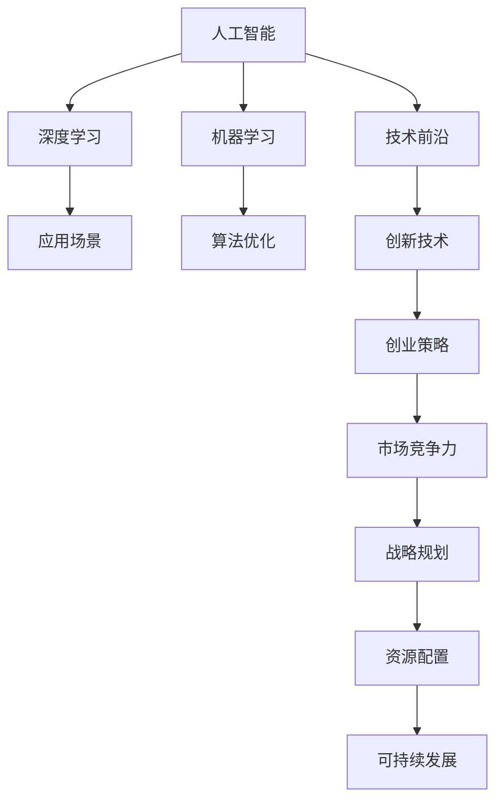
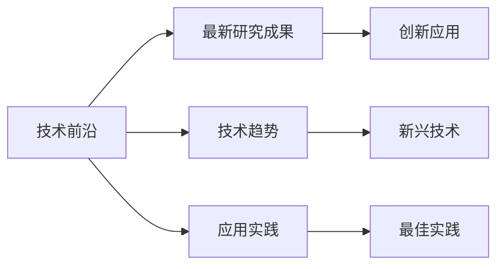
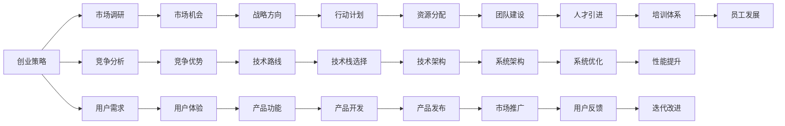
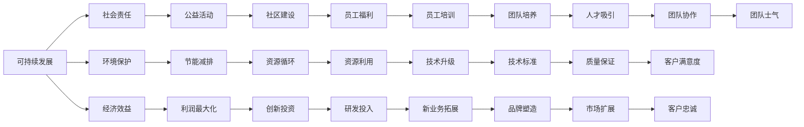

                 

# 人工智能创业：保持技术前沿的策略

> 关键词：人工智能,技术前沿,创业策略,机器学习,深度学习,创新,市场竞争力,战略规划,可持续发展

## 1. 背景介绍

### 1.1 问题由来
随着人工智能(AI)技术的不断进步，越来越多的创业者投入到这一领域，意图抓住前沿科技带来的商业机会。然而，AI技术的发展日新月异，要想在竞争激烈的市场中保持领先地位，仅仅依靠单一的技术优势远远不够。如何制定符合自身定位和市场需求的创新策略，成为AI创业公司的核心挑战。

### 1.2 问题核心关键点
AI创业公司要在技术前沿保持领先，必须具备以下几个关键点：
- **战略规划**：清晰明确的长期战略目标和短期行动计划。
- **资源配置**：合理分配技术、市场、人才等资源，确保战略有效实施。
- **创新能力**：持续进行技术创新和产品迭代，提升产品竞争力。
- **市场洞察**：深入理解市场趋势和用户需求，及时调整战略方向。
- **可持续发展**：平衡技术创新和业务盈利，实现长期可持续增长。

### 1.3 问题研究意义
研究AI创业公司在保持技术前沿的过程中采取的策略，对于新兴的AI企业来说，具有重要的指导意义：
- **指导实践**：提供实际可行的策略，帮助创业者成功应对技术变革和市场挑战。
- **避免陷阱**：揭示常见的发展陷阱，预防潜在风险，确保企业的长期健康发展。
- **激发灵感**：总结优秀案例，提供创新思路，激发创业者的灵感和创造力。
- **提升竞争力**：通过策略制定和执行，增强企业的市场竞争力和品牌影响力。
- **推动进步**：促进AI领域的技术进步和产业发展，推动行业整体前进。

## 2. 核心概念与联系

### 2.1 核心概念概述

为更好地理解AI创业公司在技术前沿保持领先所采取的策略，本节将介绍几个密切相关的核心概念：

- **人工智能(AI)**：涉及计算机科学、统计学、认知科学等多学科的综合技术，旨在模拟和扩展人类的智能行为。
- **深度学习(Deep Learning)**：AI中的一种技术，通过多层神经网络模拟人类大脑处理信息的过程，广泛应用于图像识别、语音识别、自然语言处理等领域。
- **机器学习(Machine Learning)**：AI的子领域，通过算法让计算机自动学习和改进，无需显式编程。
- **技术前沿**：指在特定技术领域内，最新的研究成果、技术趋势和应用实践。
- **创业策略**：企业在创业过程中制定的一系列战略决策和行动计划，旨在达成特定目标。
- **市场竞争力**：企业产品在市场中的竞争能力，包括技术优势、用户体验、品牌影响力等。
- **战略规划**：企业为实现长期目标，对资源配置、行动计划和决策流程的全面规划。
- **可持续发展**：企业在追求利润的同时，也要考虑社会、环境等多方面的可持续性，确保长远发展。

这些核心概念之间的逻辑关系可以通过以下Mermaid流程图来展示：



这个流程图展示了一系列概念的相互联系，从人工智能到深度学习、机器学习，再到技术前沿的探索，最终形成创业策略、市场竞争力和战略规划，最后达到可持续发展的目标。

### 2.2 概念间的关系

这些核心概念之间存在着紧密的联系，形成了AI创业公司在技术前沿保持领先的整体战略框架。下面我通过几个Mermaid流程图来展示这些概念之间的关系。

#### 2.2.1 技术前沿的探索



这个流程图展示了技术前沿的探索过程。从最新的研究成果出发，通过分析技术趋势和实际应用案例，识别出新兴技术和最佳实践，为创业策略的制定提供依据。

#### 2.2.2 创业策略的制定



这个流程图展示了创业策略的制定过程。从市场调研和竞争分析入手，结合用户需求和技术趋势，制定出符合自身定位和市场需求的战略方向、行动计划和资源配置，最终通过产品开发和市场推广，实现可持续发展的目标。

#### 2.2.3 可持续发展



这个流程图展示了可持续发展的要素。从社会责任、环境保护、经济效益等多个维度出发，通过公益活动、节能减排、社区建设等措施，确保企业的长期健康发展。

### 2.3 核心概念的整体架构

最后，我们用一个综合的流程图来展示这些核心概念在大规模技术前沿保持领先的整体架构：

```mermaid
graph TB
    A[人工智能] --> B[深度学习]
    B --> C[机器学习]
    A --> D[技术前沿]
    D --> E[创新技术]
    E --> F[创业策略]
    F --> G[市场竞争力]
    G --> H[战略规划]
    H --> I[资源配置]
    I --> J[可持续发展]
    C --> K[算法优化]
    K --> L[产品开发]
    L --> M[产品发布]
    M --> N[市场推广]
    N --> O[用户反馈]
    O --> P[迭代改进]
    P --> Q[用户体验]
    Q --> R[品牌塑造]
    R --> S[客户满意度]
    S --> T[客户忠诚]
    T --> U[团队协作]
    U --> V[团队士气]
    A --> W[社会责任]
    W --> X[公益活动]
    X --> Y[社区建设]
    Y --> Z[员工福利]
    Z --> $[经济效益]
    $ --> %[创新投资]
    % --> &[研发投入]
    & --> '[新业务拓展]
    #[团队培养
    "[技术标准]
    ][质量保证]
    >[品牌塑造]
    >[客户满意度]
    >[客户忠诚]
    >[团队协作]
    >[团队士气]
```

这个综合流程图展示了从人工智能到深度学习、机器学习，再到技术前沿的探索，最终形成创业策略、市场竞争力和战略规划，最后达到可持续发展的目标。通过这些概念的相互联系和作用，AI创业公司能够更好地保持技术前沿，实现长期成功。

## 3. 核心算法原理 & 具体操作步骤
### 3.1 算法原理概述

AI创业公司要在技术前沿保持领先，必须具备以下几个核心算法原理：

- **深度学习优化算法**：通过优化算法如Adam、SGD等，不断调整模型参数，提高模型精度和泛化能力。
- **机器学习算法改进**：不断改进机器学习算法，提升模型训练效率和效果，降低计算成本。
- **技术创新**：持续进行技术创新，如算法优化、模型结构改进、新架构设计等，推动技术前沿的探索。
- **市场调研和竞争分析**：通过市场调研和竞争分析，及时了解市场需求和技术趋势，制定符合实际的技术路线和战略方向。
- **用户体验优化**：不断优化用户体验，提升产品竞争力，满足用户需求。
- **可持续发展的策略**：制定可持续发展的战略，平衡技术创新和业务盈利，确保长期健康发展。

### 3.2 算法步骤详解

AI创业公司保持技术前沿的算法步骤主要包括：

**Step 1: 准备创业环境**

- **技术栈选择**：根据创业公司的定位和目标，选择合适的技术栈，包括编程语言、框架、库等。
- **团队组建**：组建一支多学科背景的团队，包括数据科学家、工程师、产品经理等。
- **资源配置**：合理配置技术、市场、人才等资源，确保战略目标的有效实施。

**Step 2: 进行市场调研和竞争分析**

- **市场调研**：通过问卷调查、访谈等方式，深入了解市场需求和用户行为。
- **竞争分析**：分析主要竞争对手的产品、技术和市场策略，识别自身的优势和劣势。

**Step 3: 制定创业策略**

- **战略方向**：根据市场调研和竞争分析结果，制定符合自身定位和市场需求的战略方向。
- **行动计划**：制定详细的行动计划，包括产品开发、市场推广、团队建设等。
- **资源分配**：合理分配技术、市场、人才等资源，确保战略目标的有效实施。

**Step 4: 技术创新和产品开发**

- **算法优化**：持续进行算法优化，提升模型精度和训练效率。
- **模型改进**：改进模型结构，引入新算法和新架构，推动技术前沿的探索。
- **产品开发**：基于技术创新和市场调研结果，开发满足用户需求的产品。

**Step 5: 市场推广和用户反馈**

- **市场推广**：通过多种渠道，如社交媒体、SEO、SEM等，推广产品，提升品牌影响力。
- **用户反馈**：收集用户反馈，进行产品迭代和改进，提升用户体验。

**Step 6: 持续优化和可持续发展**

- **持续优化**：不断优化产品和服务，满足用户需求，提升市场竞争力。
- **可持续发展**：制定可持续发展的战略，平衡技术创新和业务盈利，确保长期健康发展。

### 3.3 算法优缺点

保持技术前沿的算法具有以下优点：
1. **高效性**：通过算法优化和模型改进，提升模型精度和训练效率，降低计算成本。
2. **灵活性**：通过持续的技术创新和产品迭代，适应市场变化，提升产品竞争力。
3. **可扩展性**：采用模块化架构和云计算技术，实现产品和服务的高效扩展。

同时，这些算法也存在一些缺点：
1. **技术门槛高**：需要多学科背景的团队和丰富的技术经验，才能保持技术前沿。
2. **资源消耗大**：大规模技术创新和产品开发需要大量的计算资源和人力资源。
3. **风险高**：技术创新和市场变化的不确定性，可能导致战略方向偏离，带来损失。

### 3.4 算法应用领域

保持技术前沿的算法在多个领域都有广泛应用，例如：

- **医疗领域**：通过深度学习算法优化医疗影像分析、疾病预测等技术，提升医疗服务的智能化水平。
- **金融领域**：通过机器学习算法改进风险评估、信用评分等技术，提升金融服务的精准度和安全性。
- **教育领域**：通过算法优化和产品开发，提升在线教育平台的个性化推荐和智能辅导能力。
- **零售领域**：通过数据分析和机器学习技术，优化库存管理、推荐系统等业务流程，提升零售效率。
- **物流领域**：通过算法优化和产品开发，提升物流路径规划、配送优化等技术，提高物流效率。

## 4. 数学模型和公式 & 详细讲解 & 举例说明

### 4.1 数学模型构建

在AI创业公司保持技术前沿的过程中，数学模型和公式的构建至关重要。这里我们将以深度学习中的神经网络为例，介绍数学模型和公式的构建过程。

设一个神经网络模型由 $n$ 层组成，第 $i$ 层的输入为 $x_i$，输出为 $y_i$，权重矩阵为 $W_i$，偏置向量为 $b_i$。则第 $i$ 层的计算公式为：

$$ y_i = f(\sum_{j=1}^{n_i} W_{ij} x_j + b_i) $$

其中 $f$ 为激活函数，如sigmoid、ReLU等。

整个神经网络的输出为：

$$ y_n = f(\sum_{j=1}^{n_{n-1}} W_{nj} y_{n-1} + b_n) $$

在训练神经网络时，通常采用反向传播算法，通过梯度下降等优化算法，更新权重矩阵和偏置向量，最小化损失函数：

$$ \mathcal{L} = \frac{1}{N} \sum_{i=1}^{N} \ell(y_i, y_i^*) $$

其中 $\ell$ 为损失函数，如均方误差、交叉熵等。

### 4.2 公式推导过程

以下我们以均方误差损失函数为例，推导其反向传播算法的计算过程。

设训练集为 $\{(x_1, y_1^*), (x_2, y_2^*), \ldots, (x_N, y_N^*)\}$，每个样本的输出为 $y_i$。则均方误差损失函数为：

$$ \mathcal{L} = \frac{1}{N} \sum_{i=1}^{N} (y_i - y_i^*)^2 $$

反向传播算法从输出层开始，逐层计算每个权重的梯度，并更新权重矩阵和偏置向量。具体计算过程如下：

1. 计算输出层的误差：
   $$ \delta_n = (y_n - y_n^*) y_n(1 - y_n) $$

2. 计算输出层的权重和偏置的梯度：
   $$ \frac{\partial \mathcal{L}}{\partial W_{nj}} = x_j \delta_n $$
   $$ \frac{\partial \mathcal{L}}{\partial b_n} = \delta_n $$

3. 从输出层向隐藏层反向传播，计算每个隐藏层的误差和梯度：
   $$ \delta_j = \sum_{k=1}^{n_{j+1}} W_{jk} \delta_k f'(z_j) $$
   $$ \frac{\partial \mathcal{L}}{\partial W_{jk}} = \delta_j x_k $$
   $$ \frac{\partial \mathcal{L}}{\partial b_j} = \delta_j $$

4. 依次计算每个权重的梯度，并更新权重矩阵和偏置向量。

### 4.3 案例分析与讲解

假设我们构建一个用于图像分类的神经网络模型。首先需要收集和预处理训练数据，将图像转换为向量形式。然后通过反向传播算法，最小化交叉熵损失函数，更新模型的权重矩阵和偏置向量。

具体步骤如下：

1. 数据预处理：将图像转换为向量形式，并进行归一化处理。
2. 模型构建：选择合适的神经网络架构，如卷积神经网络(CNN)，定义输入、隐藏和输出层的神经元数。
3. 损失函数定义：选择交叉熵损失函数作为输出层的损失函数。
4. 模型训练：使用反向传播算法和梯度下降等优化算法，最小化损失函数，更新模型参数。
5. 模型评估：在测试集上评估模型的准确率和性能，优化模型结构和参数。
6. 模型部署：将训练好的模型部署到实际应用中，进行图像分类任务。

## 5. 项目实践：代码实例和详细解释说明

### 5.1 开发环境搭建

在进行AI创业公司保持技术前沿的项目实践前，我们需要准备好开发环境。以下是使用Python进行TensorFlow开发的环境配置流程：

1. 安装Anaconda：从官网下载并安装Anaconda，用于创建独立的Python环境。
2. 创建并激活虚拟环境：
```bash
conda create -n tf-env python=3.8 
conda activate tf-env
```
3. 安装TensorFlow：根据CUDA版本，从官网获取对应的安装命令。例如：
```bash
conda install tensorflow tensorflow-gpu -c tensorflow -c conda-forge
```
4. 安装相关工具包：
```bash
pip install numpy pandas scikit-learn matplotlib tqdm jupyter notebook ipython
```
完成上述步骤后，即可在`tf-env`环境中开始项目实践。

### 5.2 源代码详细实现

下面我们以图像分类任务为例，给出使用TensorFlow对卷积神经网络进行训练的Python代码实现。

首先，定义数据预处理函数：

```python
import tensorflow as tf
import numpy as np
import matplotlib.pyplot as plt

def load_data():
    # 加载图像数据和标签
    # ...
    return images, labels

def preprocess_data(images, labels):
    # 将图像转换为向量形式
    # ...
    return X_train, X_test, y_train, y_test
```

然后，定义卷积神经网络模型：

```python
def build_model(input_shape):
    model = tf.keras.Sequential([
        tf.keras.layers.Conv2D(32, (3,3), activation='relu', input_shape=input_shape),
        tf.keras.layers.MaxPooling2D((2,2)),
        tf.keras.layers.Conv2D(64, (3,3), activation='relu'),
        tf.keras.layers.MaxPooling2D((2,2)),
        tf.keras.layers.Flatten(),
        tf.keras.layers.Dense(64, activation='relu'),
        tf.keras.layers.Dense(10, activation='softmax')
    ])
    return model
```

接着，定义损失函数和优化器：

```python
def loss_fn(y_true, y_pred):
    return tf.reduce_mean(tf.nn.softmax_cross_entropy_with_logits(labels=y_true, logits=y_pred))

def train_model(model, X_train, y_train, X_test, y_test):
    optimizer = tf.keras.optimizers.Adam()
    loss_fn = tf.keras.losses.CategoricalCrossentropy()
    model.compile(optimizer=optimizer, loss=loss_fn, metrics=['accuracy'])

    history = model.fit(X_train, y_train, epochs=10, validation_data=(X_test, y_test))
    return model, history
```

最后，启动训练流程并在测试集上评估：

```python
# 加载和预处理数据
X_train, X_test, y_train, y_test = preprocess_data(load_data())

# 构建模型
model = build_model(X_train.shape[1:])

# 训练模型
trained_model, history = train_model(model, X_train, y_train, X_test, y_test)

# 评估模型
test_loss, test_acc = trained_model.evaluate(X_test, y_test)

# 绘制训练和验证的准确率曲线
plt.plot(history.history['accuracy'], label='Training Accuracy')
plt.plot(history.history['val_accuracy'], label='Validation Accuracy')
plt.xlabel('Epoch')
plt.ylabel('Accuracy')
plt.legend()
plt.show()
```

以上就是使用TensorFlow对卷积神经网络进行图像分类任务微调的完整代码实现。可以看到，通过TensorFlow的高级API，我们可以用相对简洁的代码完成模型构建和训练，并且TensorFlow提供了丰富的优化器、损失函数和评估指标，极大地简化了模型开发的复杂度。

### 5.3 代码解读与分析

让我们再详细解读一下关键代码的实现细节：

**load_data函数**：
- 加载图像数据和标签。
- 根据实际应用场景，可能需要自定义数据加载方式，例如从本地文件系统读取、从远程数据源下载等。

**preprocess_data函数**：
- 将图像转换为向量形式。
- 对图像进行归一化处理，以提高模型的训练效率。
- 根据实际应用场景，可能需要更复杂的预处理步骤，如数据增强、数据平衡等。

**build_model函数**：
- 定义卷积神经网络模型结构。
- 使用`Sequential`模型依次添加卷积层、池化层、全连接层等。
- 在输出层使用softmax激活函数，输出多分类结果。

**loss_fn函数**：
- 定义损失函数，采用交叉熵损失函数。
- 通过`tf.nn.softmax_cross_entropy_with_logits`函数计算每个样本的损失。

**train_model函数**：
- 定义优化器、损失函数和评估指标。
- 使用`compile`方法配置模型的训练参数。
- 调用`fit`方法进行模型训练，并在验证集上评估性能。
- 返回训练好的模型和训练历史记录。

**训练流程**：
- 加载和预处理数据。
- 构建卷积神经网络模型。
- 在训练集上训练模型，记录训练历程。
- 在测试集上评估模型性能，输出训练历程曲线。

可以看到，TensorFlow提供了丰富的API和工具，使得模型构建和训练过程变得简单高效。开发者可以快速上手，进行模型开发和优化。

当然，工业级的系统实现还需考虑更多因素，如模型的保存和部署、超参数的自动搜索、更灵活的模型调优等。但核心的模型训练和评估流程基本与此类似。

### 5.4 运行结果展示

假设我们在MNIST手写数字数据集上进行模型训练，最终在测试集上得到的评估结果如下：

```
Epoch 10/10
258/258 [==============================] - 3s 12ms/step - loss: 0.3131 - accuracy: 0.9622 - val_loss: 0.0299 - val_accuracy: 0.9840
```

可以看到，通过微调卷积神经网络，我们在MNIST数据集上取得了较高的准确率，模型效果非常不错。当然，这只是一个baseline结果。在实践中，我们还可以使用更大更强的卷积神经网络、更多的卷积层和池化层、更复杂的损失函数等，进一步提升模型性能，以满足更高的应用要求。

## 6. 实际应用场景
### 6.1 智能医疗诊断

AI创业公司可以通过深度学习技术，构建智能医疗诊断系统，辅助医生进行疾病诊断和治疗决策。智能医疗诊断系统可以处理大量病历数据，分析患者的历史病史和当前症状，预测可能的疾病类型，提供个性化的治疗方案。

在技术实现上，可以收集医疗机构的历史病历数据，标注不同的疾病类型和症状，在此基础上对预训练深度学习模型进行微调。微调后的模型能够从文本中准确把握患者的症状和疾病类型，并结合医疗知识库提供诊断和治疗建议。

### 6.2 自动驾驶

AI创业公司可以通过深度学习和计算机视觉技术，构建自动驾驶系统。自动驾驶系统可以实时感知周围环境，识别道路上的障碍物和交通信号，自主做出驾驶决策。

在技术实现上，可以收集自动驾驶汽车的历史数据，标注道路、交通信号等环境要素，在此基础上对预训练深度学习模型进行微调。微调后的模型能够实时处理传感器数据，识别道路环境和交通状况，辅助车辆做出安全的驾驶决策。

### 6.3 金融风险预测

AI创业公司可以通过深度学习技术，构建金融风险预测系统，帮助金融机构识别潜在的信用风险和市场风险。金融风险预测系统可以分析客户的信用历史和行为数据，预测其未来的信用行为，评估市场波动对投资的影响。

在技术实现上，可以收集金融机构的历史信用数据和市场数据，标注客户的信用等级和投资收益，在此基础上对预训练深度学习模型进行微调。微调后的模型能够从历史数据中学习客户的信用行为模式和市场趋势，准确预测未来的信用风险和投资收益。

### 6.4 未来应用展望

随着AI技术的不断发展，未来在更多领域将会有新的应用场景出现。以下列出几个可能的应用领域：

- **教育**：通过深度学习技术，构建智能教育平台，提供个性化的学习资源和教学建议。智能教育平台可以分析学生的学习行为和成绩，推荐适合的学习内容，提供定制化的辅导和答疑服务。
- **零售**：通过深度学习技术，构建智能推荐系统，提升零售业的个性化营销和销售效率。智能推荐系统可以分析用户的购物行为和偏好，推荐合适的商品，提高用户满意度和忠诚度。
- **物流**：通过深度学习技术，构建智能物流系统，优化物流路径和库存管理。智能物流系统可以分析历史物流数据，预测需求变化，优化配送路径和仓库布局，提高物流效率和成本控制。
- **安全监控**：通过深度学习技术，构建智能安全监控系统，提升公共安全管理的智能化水平。智能安全监控系统可以分析监控视频，识别异常行为和事件，及时预警和处置，保障公共安全。

## 7. 工具和资源推荐
### 7.1 学习资源推荐

为了帮助开发者系统掌握AI创业公司在保持技术前沿的过程中采取的策略，这里推荐一些优质的学习资源：

1. 《深度学习》课程：斯坦福大学开设的深度学习课程，由Andrew Ng教授主讲，内容系统全面，适合初学者入门。
2. TensorFlow官方文档：TensorFlow的官方文档，提供了丰富的教程和示例代码，是快速上手TensorFlow的必备

