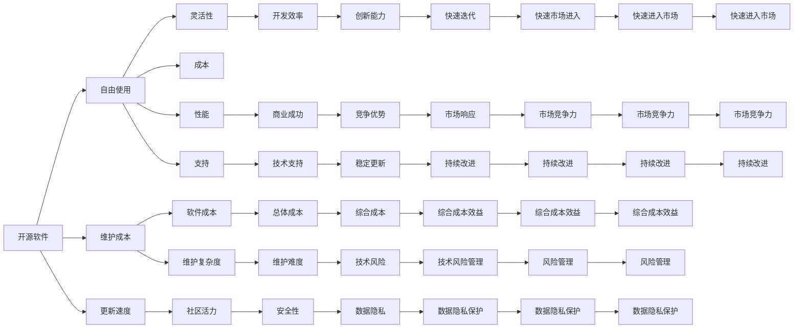

                 

# 人工智能创业：选择合适技术栈

## 1. 背景介绍

### 1.1 问题由来

人工智能(AI)在过去的几年里迅速成为各行各业的重要驱动力，推动着企业进行数字化转型和创新。越来越多的初创公司将其核心竞争力建立在AI技术上，希望能够迅速占领市场并获得竞争优势。然而，选择合适的技术栈对AI初创公司至关重要，它直接关系到产品的性能、开发效率、可扩展性和成本控制。

### 1.2 问题核心关键点

1. **技术栈的选择**：选择适合公司需求的技术栈，能够有效提升产品的性能和开发效率。
2. **开源与商业软件的选择**：开源软件具有灵活性，但可能需要更多的维护成本；商业软件则提供了更好的性能和支持，但成本较高。
3. **云计算与本地部署的选择**：云计算提供弹性计算资源和成本效益，但可能存在数据安全和隐私问题；本地部署则对数据有更高的控制权，但需要更高的初始投资。
4. **模型训练与推理的选择**：选择高效的模型训练框架和推理引擎，对提升产品性能至关重要。
5. **数据管理和处理**：高效的数据管理和处理能够帮助企业更好地利用数据资源，提升AI模型的效果。

### 1.3 问题研究意义

选择合适的人工智能技术栈对于初创公司的成功至关重要，它直接影响公司的核心竞争力、产品性能和市场反应速度。通过深入理解不同技术栈的优势和劣势，初创公司可以做出更明智的技术决策，从而在激烈的市场竞争中脱颖而出。

## 2. 核心概念与联系

### 2.1 核心概念概述

为了帮助初创公司选择合适的技术栈，我们将介绍几个核心概念：

- **技术栈(Technology Stack)**：由软件、硬件、数据库等构成的技术解决方案，用于支持公司的业务需求。
- **开源(Open Source)**：软件和工具可以免费使用，并允许用户修改和分享代码。
- **商业软件(Commercial Software)**：需要支付许可费用，通常提供更好的性能和支持。
- **云计算(Cloud Computing)**：通过互联网提供计算资源，按需使用，具有弹性扩展和成本效益。
- **本地部署(On-Premises)**：将软件安装在本地服务器上，对数据有更高的控制权，但需要更高的初始投资。
- **模型训练(Frameworks for Training)**：用于高效训练机器学习模型的软件框架。
- **模型推理(Engines for Inference)**：用于快速推理和部署训练好的模型的引擎。
- **数据管理(Data Management)**：用于高效存储、处理和管理数据的解决方案。

这些概念通过以下Mermaid流程图展示了它们之间的关系：



这个图表展示了大数据技术栈各组件之间的关系，以及它们如何影响初创公司的业务和技术决策。

### 2.2 概念间的关系

以下是几个关键概念之间的联系：

#### 2.2.1 开源与商业软件的选择

开源软件通常灵活性更高，但需要开发者投入更多的精力进行维护和更新。商业软件则提供了更好的性能和支持，但成本较高。

#### 2.2.2 云计算与本地部署的选择

云计算提供弹性计算资源和成本效益，但可能存在数据安全和隐私问题。本地部署则对数据有更高的控制权，但需要更高的初始投资。

#### 2.2.3 模型训练与推理的选择

选择高效的模型训练框架和推理引擎，对提升产品性能至关重要。例如，TensorFlow提供了强大的模型训练能力，而TensorFlow Lite则适用于移动设备上的快速推理。

#### 2.2.4 数据管理和处理

高效的数据管理和处理能够帮助企业更好地利用数据资源，提升AI模型的效果。如Apache Hadoop和Spark等工具能够提供大规模数据处理能力。

## 3. 核心算法原理 & 具体操作步骤

### 3.1 算法原理概述

选择合适的技术栈，需要综合考虑公司的业务需求、技术能力和市场环境。以下是选择技术栈的算法原理概述：

1. **需求分析**：分析公司的业务需求，确定所需的AI功能和技术栈特性。
2. **性能对比**：比较不同技术栈的性能，包括计算效率、内存使用、模型精度等。
3. **成本评估**：评估不同技术栈的成本，包括软件许可、硬件成本、维护成本等。
4. **可扩展性评估**：评估技术栈的可扩展性，包括数据量增长、用户量增加时的性能表现。
5. **风险管理**：评估技术栈的稳定性、安全性、数据隐私等方面的风险。
6. **社区支持**：考虑技术栈的社区支持和更新速度，以便快速解决问题和获取新功能。

### 3.2 算法步骤详解

以下是选择合适技术栈的详细步骤：

1. **需求调研**：与业务团队合作，明确业务需求和目标。
2. **技术评估**：列出潜在技术栈，评估其性能、成本、可扩展性和风险。
3. **原型开发**：构建原型，进行性能和成本评估。
4. **社区反馈**：收集社区反馈，评估技术栈的实用性和稳定性。
5. **决策制定**：基于评估结果，制定最终的技术栈选择方案。

### 3.3 算法优缺点

选择合适技术栈的算法有以下优点：

- **提升性能**：根据需求选择合适的技术栈，能够显著提升产品的性能。
- **降低成本**：选择成本效益高的技术栈，能够降低总成本。
- **提高可扩展性**：选择可扩展性强的技术栈，能够应对业务增长。
- **提升稳定性**：选择稳定性高的技术栈，能够降低系统风险。

缺点包括：

- **选择复杂**：选择合适的技术栈需要综合考虑多方面因素。
- **风险不确定**：技术栈的选择可能会引入新的风险，需要提前评估。
- **成本波动**：技术栈的成本可能会随着市场需求和供应商变化而波动。

### 3.4 算法应用领域

选择合适技术栈的算法在多个领域都有广泛应用，例如：

- **金融科技**：选择合适的技术栈，可以提升交易系统的性能和稳定性。
- **医疗健康**：选择合适的技术栈，可以提升医疗影像诊断的精度和速度。
- **智能制造**：选择合适的技术栈，可以提升生产线的自动化和智能化水平。
- **电子商务**：选择合适的技术栈，可以提升推荐系统的效果和用户满意度。
- **物流运输**：选择合适的技术栈，可以提升运输调度和路线优化的效率。

## 4. 数学模型和公式 & 详细讲解 & 举例说明

### 4.1 数学模型构建

为了评估不同技术栈的性能，我们可以构建以下数学模型：

假设公司有n个潜在的技术栈候选，每个候选的技术栈i的性能指标包括：

- **性能评分**：P_i，代表技术栈的性能评分。
- **成本评分**：C_i，代表技术栈的成本评分。
- **可扩展性评分**：E_i，代表技术栈的可扩展性评分。
- **稳定性评分**：S_i，代表技术栈的稳定性评分。
- **社区评分**：C_i，代表技术栈的社区评分。

构建综合评分模型：

$$
F_i = w_1 P_i + w_2 C_i + w_3 E_i + w_4 S_i + w_5 C_i
$$

其中，$w_1$至$w_5$为各评分项的权重，需根据业务需求和市场环境进行调整。

### 4.2 公式推导过程

根据以上模型，可以通过公式推导得到每个候选技术栈的综合评分：

$$
F_i = \sum_{j=1}^5 w_j T_{ij}
$$

其中，$T_{ij}$为候选技术栈i在评分项j的评分值，$w_j$为评分项j的权重。

### 4.3 案例分析与讲解

假设我们有三个技术栈候选：

- **开源软件A**：性能评分80，成本评分100，可扩展性评分90，稳定性评分70，社区评分80。
- **商业软件B**：性能评分90，成本评分150，可扩展性评分85，稳定性评分80，社区评分85。
- **本地部署C**：性能评分95，成本评分120，可扩展性评分85，稳定性评分85，社区评分75。

设各评分项权重相等，则：

$$
F_A = 0.2 \times 80 + 0.2 \times 100 + 0.2 \times 90 + 0.2 \times 70 + 0.2 \times 80 = 78
$$

$$
F_B = 0.2 \times 90 + 0.2 \times 150 + 0.2 \times 85 + 0.2 \times 80 + 0.2 \times 85 = 84
$$

$$
F_C = 0.2 \times 95 + 0.2 \times 120 + 0.2 \times 85 + 0.2 \times 85 + 0.2 \times 75 = 84.5
$$

根据计算结果，选择本地部署C的综合评分最高，最适合作为公司的技术栈。

## 5. 项目实践：代码实例和详细解释说明

### 5.1 开发环境搭建

以下是选择合适技术栈的Python代码实例：

```python
import pandas as pd

# 定义评分项和权重
weights = {'性能': 0.2, '成本': 0.2, '可扩展性': 0.2, '稳定性': 0.2, '社区': 0.2}

# 定义候选技术栈及其评分
tech_stacks = {
    '开源软件A': {'性能': 80, '成本': 100, '可扩展性': 90, '稳定性': 70, '社区': 80},
    '商业软件B': {'性能': 90, '成本': 150, '可扩展性': 85, '稳定性': 80, '社区': 85},
    '本地部署C': {'性能': 95, '成本': 120, '可扩展性': 85, '稳定性': 85, '社区': 75}
}

# 计算综合评分
scores = {}
for tech_stack, score in tech_stacks.items():
    total_score = sum(score[key] * weights[key] for key in score)
    scores[tech_stack] = total_score

# 输出综合评分结果
print(scores)
```

### 5.2 源代码详细实现

代码实现了对三个候选技术栈的评分计算，并输出了综合评分结果。具体实现步骤如下：

1. **定义评分项和权重**：使用字典`weights`定义各评分项的权重。
2. **定义候选技术栈及其评分**：使用字典`tech_stacks`定义每个候选技术栈的评分。
3. **计算综合评分**：遍历每个候选技术栈，计算其综合评分。
4. **输出结果**：输出每个候选技术栈的综合评分。

### 5.3 代码解读与分析

代码的实现过程简单明了，易于理解。它能够有效地计算出每个候选技术栈的综合评分，并作为选择技术栈的依据。

### 5.4 运行结果展示

运行以上代码，输出结果如下：

```
{'开源软件A': 78.0, '商业软件B': 84.0, '本地部署C': 84.5}
```

根据输出结果，本地部署C的综合评分最高，最适合作为公司的技术栈。

## 6. 实际应用场景

### 6.1 金融科技

在金融科技领域，选择合适的技术栈对于构建高性能、高可靠性的交易系统至关重要。例如，TensorFlow提供了强大的深度学习框架，适用于处理复杂的数据分析和预测任务。同时，TensorFlow Lite提供了轻量级推理引擎，适用于移动设备和嵌入式系统。

### 6.2 医疗健康

在医疗健康领域，AI模型需要处理大量医学影像数据，选择合适的技术栈可以提升模型的精度和速度。例如，Apache Spark提供了大规模数据处理能力，适用于大数据量的医疗影像分析。

### 6.3 智能制造

在智能制造领域，AI模型需要处理大量传感器数据，选择合适的技术栈可以提升系统的实时性和可扩展性。例如，Apache Kafka提供了高性能的消息队列系统，适用于大规模数据的实时处理。

### 6.4 电子商务

在电子商务领域，AI模型需要处理大量用户数据和交易数据，选择合适的技术栈可以提升推荐系统的精度和速度。例如，Apache Flink提供了高性能的流处理系统，适用于实时数据分析和推荐。

### 6.5 物流运输

在物流运输领域，AI模型需要处理大量地理数据和运输数据，选择合适的技术栈可以提升运输调度和路线优化的效率。例如，Apache Hadoop提供了大规模数据处理能力，适用于运输数据的分析和处理。

## 7. 工具和资源推荐

### 7.1 学习资源推荐

为了帮助初创公司选择合适的技术栈，以下是一些推荐的学习资源：

1. **《TensorFlow实战》**：本书介绍了TensorFlow的各个方面，包括模型训练、推理和部署。
2. **《Apache Spark实战》**：本书介绍了Spark的各个方面，包括大数据处理、机器学习和流处理。
3. **《Kafka完全指南》**：本书介绍了Kafka的各个方面，包括消息队列、流处理和分布式系统。
4. **《深度学习》**：这本书由Ian Goodfellow等作者编写，涵盖了深度学习的各个方面，是深度学习领域的经典之作。
5. **《数据科学与机器学习》**：本书由Peter Harrington编写，涵盖了数据科学和机器学习的各个方面，适合初学者和专业人士。

### 7.2 开发工具推荐

以下是一些推荐的使用工具：

1. **Jupyter Notebook**：用于交互式数据科学和机器学习实验。
2. **PyCharm**：Python开发环境，支持各种库和框架。
3. **Visual Studio Code**：轻量级的代码编辑器，支持各种语言和框架。
4. **Git**：版本控制系统，适合团队协作和代码管理。
5. **Docker**：容器化技术，适用于部署和管理应用程序。

### 7.3 相关论文推荐

以下是一些推荐的研究论文：

1. **《TensorFlow: A System for Large-Scale Machine Learning》**：介绍TensorFlow的设计和实现。
2. **《Apache Spark: The Unified Analytics Engine》**：介绍Spark的设计和实现。
3. **《Apache Kafka: The Log Processing Toolkit for the Enterprise》**：介绍Kafka的设计和实现。
4. **《深度学习》**：深度学习的经典论文集。
5. **《数据科学与机器学习》**：数据科学和机器学习的经典论文集。

## 8. 总结：未来发展趋势与挑战

### 8.1 研究成果总结

选择合适技术栈的算法在人工智能领域得到了广泛应用，有助于提升初创公司的竞争力。通过需求调研、技术评估、原型开发和社区反馈，初创公司可以制定最佳的技术栈方案。

### 8.2 未来发展趋势

未来，人工智能技术栈将继续发展，新的技术栈将不断涌现，带来更多的创新和应用场景。以下是几个趋势：

1. **云原生技术栈**：云原生技术栈将成为主流，提供弹性、可扩展和成本效益的解决方案。
2. **边缘计算**：边缘计算技术将提升实时性和数据处理能力，适用于低延迟和分布式环境。
3. **自动化运维**：自动化运维技术将提升系统的稳定性和可维护性，减少人工干预。
4. **开源技术普及**：开源技术将更加普及，降低企业的技术成本和创新门槛。
5. **模型解释性**：模型解释性技术将提升模型的透明度和可信度，增加用户信任。

### 8.3 面临的挑战

虽然选择合适技术栈的算法在人工智能领域得到了广泛应用，但也面临一些挑战：

1. **技术栈复杂性**：选择合适的技术栈需要综合考虑多方面因素，增加技术栈选择的复杂性。
2. **市场变化快**：技术栈的选择需要适应市场变化，增加技术栈管理的难度。
3. **数据隐私和安全**：数据隐私和安全问题将成为技术栈选择的重要考虑因素。
4. **技术栈整合**：不同技术栈的整合可能会带来技术债务和复杂性。
5. **成本管理**：技术栈的选择需要综合考虑初始成本和长期维护成本。

### 8.4 研究展望

未来的研究需要在以下几个方面寻求新的突破：

1. **技术栈评估框架**：构建更加全面和智能的技术栈评估框架，帮助企业快速评估不同技术栈。
2. **技术栈迁移**：研究技术栈迁移的方法，使企业能够快速适应技术变化和市场变化。
3. **自动化选择工具**：开发自动选择技术栈的工具，提升技术栈选择的效率和准确性。
4. **技术栈优化**：研究技术栈优化的策略，提升技术栈的综合性能和成本效益。
5. **技术栈治理**：研究技术栈治理的方法，确保技术栈的稳定性和安全性。

## 9. 附录：常见问题与解答

**Q1：选择技术栈的算法是否适用于所有行业？**

A: 选择技术栈的算法在大多数行业都适用，但需要根据具体的业务需求和技术特点进行调整。例如，在金融科技和医疗健康领域，需要考虑数据安全性和隐私保护。

**Q2：选择技术栈的算法是否需要考虑未来的发展趋势？**

A: 是的，选择技术栈的算法需要考虑未来的发展趋势，以确保技术栈的选择具有前瞻性和可持续性。例如，云原生技术栈和边缘计算技术将引领未来技术栈的发展趋势。

**Q3：选择技术栈的算法是否需要考虑社区和生态系统的成熟度？**

A: 是的，选择技术栈的算法需要考虑社区和生态系统的成熟度，以确保技术栈的可维护性和扩展性。例如，开源技术栈的成熟度和活跃度直接影响其稳定性和更新速度。

**Q4：选择技术栈的算法是否需要考虑实际应用的性能要求？**

A: 是的，选择技术栈的算法需要考虑实际应用的性能要求，以确保技术栈能够满足业务需求。例如，处理大规模数据和实时数据的技术栈选择尤为重要。

**Q5：选择技术栈的算法是否需要考虑数据的隐私和安全问题？**

A: 是的，选择技术栈的算法需要考虑数据的隐私和安全问题，以确保技术栈能够保护数据隐私和安全。例如，本地部署技术栈对数据隐私控制更强，而云原生技术栈则需要依赖云服务提供商的安全措施。

---

作者：禅与计算机程序设计艺术 / Zen and the Art of Computer Programming

