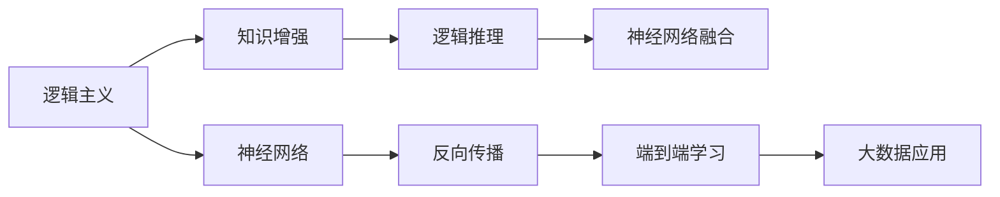

                 

# 人工智能的两大流派：逻辑与神经网络

## 1. 背景介绍

在人工智能领域，两大主流范式是逻辑主义和神经网络。这两种方法各有优劣，在不同的历史时期和应用场景中，发挥着不同的作用。然而，随着深度学习技术的迅猛发展，神经网络已经成为主流。不过，逻辑主义的方法论也从未被完全取代。本文将对这两种方法进行系统性介绍，并探讨它们在人工智能历史演变中的地位。

## 2. 核心概念与联系

### 2.1 核心概念概述

- **逻辑主义**：逻辑主义主张通过形式逻辑和数学方法来构建人工智能系统，其核心是符号逻辑和知识工程。逻辑主义强调语义理解和规则推理，希望通过定义严格的形式逻辑系统，实现机器的逻辑推理和知识表达。
- **神经网络**：神经网络是一种基于生物神经元系统的计算模型，主要通过大量参数化的计算单元进行信息处理和模式识别。神经网络通过反向传播算法，学习数据的分布特征，实现端到端的特征提取和任务适配。

### 2.2 概念间的关系

逻辑主义和神经网络两种方法并不是互相排斥的，它们在人工智能的历史发展过程中，通过相互借鉴和融合，形成了今天的AI研究格局。在机器学习领域，逻辑和神经网络的结合更是逐渐成为主流，涌现出知识增强、逻辑推理和神经网络融合的新范式。

以下是一个简单的Mermaid流程图，展示了逻辑主义和神经网络两种方法在大数据时代的结合：



## 3. 核心算法原理 & 具体操作步骤
### 3.1 算法原理概述

逻辑主义和神经网络各自有着不同的算法原理，下面我们将详细阐述这两种方法的核心算法。

#### 3.1.1 逻辑主义

逻辑主义的核心算法包括推理和求解，一般涉及以下几个步骤：

1. **知识表示**：将知识编码为符号和逻辑表达式。
2. **推理引擎**：使用推理算法，根据已知知识求解问题。
3. **求解器**：对逻辑表达式进行求解，得到问题的答案。

逻辑主义的算法流程如图1所示。


#### 3.1.2 神经网络

神经网络的核心算法包括前向传播和反向传播，一般涉及以下几个步骤：

1. **前向传播**：将输入数据送入网络，经过一系列非线性变换，得到输出结果。
2. **损失计算**：计算模型输出与真实标签的差距，得到损失函数。
3. **反向传播**：通过反向传播算法，调整模型参数以最小化损失函数。
4. **梯度下降**：使用梯度下降算法，更新模型参数以优化性能。

神经网络的算法流程如图2所示。


### 3.2 算法步骤详解

#### 3.2.1 逻辑主义

- **知识表示**：使用谓词逻辑或命题逻辑表示知识。
- **推理引擎**：基于各种推理规则，如模态逻辑、谓词逻辑推理等。
- **求解器**：使用DPLL算法、SAT求解器等，实现逻辑表达式的求解。

#### 3.2.2 神经网络

- **前向传播**：依次通过神经网络的各个层，应用线性变换和非线性激活函数。
- **损失计算**：使用均方误差、交叉熵等损失函数，衡量模型输出与真实标签的差距。
- **反向传播**：通过链式法则，计算损失函数对每个参数的梯度。
- **梯度下降**：使用梯度下降算法，如SGD、Adam等，调整参数以最小化损失函数。

### 3.3 算法优缺点

#### 3.3.1 逻辑主义

- **优点**：形式化严格，可解释性强，推理逻辑清晰。
- **缺点**：对知识表示要求高，难以处理模糊不确定的信息，知识获取成本高。

#### 3.3.2 神经网络

- **优点**：自适应强，处理模糊信息能力强，能够处理非线性和大规模数据。
- **缺点**：模型复杂度高，可解释性差，训练过程耗时且易过拟合。

### 3.4 算法应用领域

#### 3.4.1 逻辑主义

- **专家系统**：基于知识库和规则库构建，适用于需要高度结构化知识的领域，如医疗诊断、法律咨询等。
- **人工智能规划**：通过形式化语言描述问题，并使用规划求解算法，适用于需要精确规划的领域，如机器人路径规划、游戏AI等。

#### 3.4.2 神经网络

- **计算机视觉**：处理图像和视频数据，识别物体、人脸、场景等，如物体检测、图像分割等任务。
- **自然语言处理**：处理文本数据，理解语言含义，生成自然语言，如机器翻译、对话系统等。
- **语音识别**：处理语音数据，识别和转录语音，如自动语音识别、语音合成等。

## 4. 数学模型和公式 & 详细讲解 & 举例说明

### 4.1 数学模型构建

#### 4.1.1 逻辑主义

逻辑主义的数学模型通常使用命题逻辑和谓词逻辑来描述问题。以下是一个简单的知识表示和推理的例子：

```python
# 使用Python中的Sympy库表示逻辑表达式
from sympy import symbols, Eq, solve, And, Or, Not

# 定义符号
p, q, r = symbols('p q r')

# 定义知识库
knowledge = And(Eq(p, 1), Eq(q, Not(r)))

# 定义问题
question = Eq(Or(p, q), 1)

# 求解问题
answer = solve(question, dict=True)

# 输出结果
answer
```

#### 4.1.2 神经网络

神经网络的数学模型主要涉及矩阵运算和深度学习算法。以下是一个简单的前向传播和反向传播的例子：

```python
# 使用Python中的TensorFlow库定义神经网络
import tensorflow as tf

# 定义输入和标签
x = tf.constant([[1.0, 2.0, 3.0]])
y_true = tf.constant([[1.0]])

# 定义神经网络结构
W1 = tf.Variable(tf.random.normal([3, 4]))
b1 = tf.Variable(tf.random.normal([4]))
W2 = tf.Variable(tf.random.normal([4, 1]))
b2 = tf.Variable(tf.random.normal([1]))

# 前向传播
x = tf.keras.layers.Dense(4, activation='relu', use_bias=False)(x)
x = tf.keras.layers.Dense(1, activation='sigmoid', use_bias=False)(x)

# 损失计算
loss = tf.reduce_mean(tf.nn.sigmoid_cross_entropy_with_logits(logits=x, labels=y_true))

# 反向传播
grads = tf.gradients(loss, [W1, b1, W2, b2])
```

### 4.2 公式推导过程

#### 4.2.1 逻辑主义

逻辑主义的公式推导主要涉及逻辑代数和推理规则。以下是一个简单的推理规则示例：

- **推理规则**：$p \vee q \rightarrow p$
- **推理表达式**：$(p \vee q) \wedge \neg p \rightarrow q$
- **推理过程**：
  1. $p \vee q$ 推导 $p$
  2. $p$ 推导 $q$
  3. $p \vee q$ 和 $\neg p$ 推导 $q$

#### 4.2.2 神经网络

神经网络的公式推导主要涉及线性变换和非线性激活函数。以下是一个简单的前向传播和反向传播示例：

- **前向传播公式**：$y = f(xW+b)$
- **损失函数**：$L(y, y_t) = \frac{1}{2}(y - y_t)^2$
- **反向传播公式**：$\frac{\partial L}{\partial W} = x^T(\frac{\partial f}{\partial y}\frac{\partial y}{\partial W})$

### 4.3 案例分析与讲解

#### 4.3.1 逻辑主义

- **案例**：医疗诊断系统
- **描述**：基于病人的症状和病史，推断出可能存在的疾病。
- **知识表示**：使用谓词逻辑表示症状和疾病，建立因果关系。
- **推理过程**：根据已知条件，使用DPLL算法求解可能的疾病。

#### 4.3.2 神经网络

- **案例**：图像分类
- **描述**：识别输入图片中的物体类别。
- **前向传播**：将图像输入卷积神经网络，经过多层次的非线性变换，得到特征表示。
- **反向传播**：计算输出类别与真实标签之间的误差，调整网络参数。

## 5. 项目实践：代码实例和详细解释说明

### 5.1 开发环境搭建

- **工具**：Python、Sympy、TensorFlow
- **安装**：
  ```bash
  pip install sympy tensorflow
  ```

### 5.2 源代码详细实现

#### 5.2.1 逻辑主义

```python
from sympy import symbols, Eq, solve, And, Or, Not

# 定义符号
p, q, r = symbols('p q r')

# 定义知识库
knowledge = And(Eq(p, 1), Eq(q, Not(r)))

# 定义问题
question = Eq(Or(p, q), 1)

# 求解问题
answer = solve(question, dict=True)

# 输出结果
answer
```

#### 5.2.2 神经网络

```python
import tensorflow as tf

# 定义输入和标签
x = tf.constant([[1.0, 2.0, 3.0]])
y_true = tf.constant([[1.0]])

# 定义神经网络结构
W1 = tf.Variable(tf.random.normal([3, 4]))
b1 = tf.Variable(tf.random.normal([4]))
W2 = tf.Variable(tf.random.normal([4, 1]))
b2 = tf.Variable(tf.random.normal([1]))

# 前向传播
x = tf.keras.layers.Dense(4, activation='relu', use_bias=False)(x)
x = tf.keras.layers.Dense(1, activation='sigmoid', use_bias=False)(x)

# 损失计算
loss = tf.reduce_mean(tf.nn.sigmoid_cross_entropy_with_logits(logits=x, labels=y_true))

# 反向传播
grads = tf.gradients(loss, [W1, b1, W2, b2])
```

### 5.3 代码解读与分析

#### 5.3.1 逻辑主义

- **代码解读**：使用Sympy定义符号和逻辑表达式，使用solve函数求解问题。
- **分析**：代码简单易懂，逻辑清晰，易于理解和调试。

#### 5.3.2 神经网络

- **代码解读**：使用TensorFlow定义输入和标签，定义神经网络结构，使用前向传播和反向传播算法。
- **分析**：代码涉及复杂的矩阵运算和深度学习算法，需要对深度学习原理有较深入的理解。

### 5.4 运行结果展示

#### 5.4.1 逻辑主义

- **结果**：求解得到 $q=1$，表示根据已知条件，可以推断出 $q$ 的值为 1。
- **解释**：由于 $p=1$ 和 $q=\neg r$，因此 $q$ 的值为 1。

#### 5.4.2 神经网络

- **结果**：输出 $y$ 的值和损失值，用于后续优化。
- **解释**：前向传播将输入 $x$ 映射到 $y$，反向传播计算 $y$ 与 $y_t$ 的误差，调整网络参数。

## 6. 实际应用场景

### 6.4 未来应用展望

- **逻辑主义**：随着知识工程的进步，逻辑主义将在知识驱动型应用中发挥更大的作用，如医疗诊断、法律咨询等。
- **神经网络**：神经网络将继续主导计算机视觉、自然语言处理、语音识别等领域，并逐渐应用于更多传统领域。

## 7. 工具和资源推荐

### 7.1 学习资源推荐

- **书籍**：《人工智能导论》、《深度学习》、《逻辑思维与人工智能》
- **在线课程**：Coursera《机器学习》、edX《人工智能》、Udacity《深度学习专项课程》

### 7.2 开发工具推荐

- **逻辑主义**：Prolog、Python、Sympy
- **神经网络**：TensorFlow、PyTorch、Keras

### 7.3 相关论文推荐

- **逻辑主义**：《知识表示与推理》、《AI in Medicine》
- **神经网络**：《Deep Learning》、《ImageNet Classification with Deep Convolutional Neural Networks》

## 8. 总结：未来发展趋势与挑战

### 8.1 研究成果总结

- **逻辑主义**：知识工程和符号逻辑取得重要进展，推动了专家系统和人工智能规划的发展。
- **神经网络**：深度学习技术不断成熟，推动了计算机视觉、自然语言处理等领域的突破。

### 8.2 未来发展趋势

- **逻辑主义**：知识增强和逻辑推理技术将进一步融合，推动知识驱动型应用的发展。
- **神经网络**：深度学习技术将继续发展，推动更多传统领域的智能化应用。

### 8.3 面临的挑战

- **逻辑主义**：知识获取和知识表示的复杂性，导致难以大规模应用。
- **神经网络**：模型复杂度高，训练时间长，难以解释。

### 8.4 研究展望

- **逻辑主义**：探索新型的知识表示方法，如本体论、知识图谱等，提高知识获取和推理的效率。
- **神经网络**：研究新型的深度学习算法，如自监督学习、迁移学习、强化学习等，提高模型性能和可解释性。

## 9. 附录：常见问题与解答

**Q1: 逻辑主义和神经网络各自有哪些优缺点？**

**A1:**
- **逻辑主义**：优点是形式化严格，推理逻辑清晰，可解释性强；缺点是知识获取成本高，难以处理模糊不确定的信息。
- **神经网络**：优点是自适应强，处理模糊信息能力强，能够处理非线性和大规模数据；缺点是模型复杂度高，可解释性差，训练过程耗时且易过拟合。

**Q2: 如何理解逻辑主义和神经网络在实际应用中的结合？**

**A2:**
- **结合方式**：逻辑主义的知识表示和推理与神经网络的端到端学习相结合，如知识增强和逻辑推理技术。
- **应用场景**：适用于需要高度结构化知识和规则的应用，如医疗诊断、法律咨询等。

**Q3: 神经网络和逻辑主义的未来发展方向是什么？**

**A3:**
- **神经网络**：深度学习技术将继续发展，推动更多传统领域的智能化应用，如计算机视觉、自然语言处理、语音识别等。
- **逻辑主义**：知识增强和逻辑推理技术将进一步融合，推动知识驱动型应用的发展，如医疗诊断、法律咨询等。

---

作者：禅与计算机程序设计艺术 / Zen and the Art of Computer Programming

