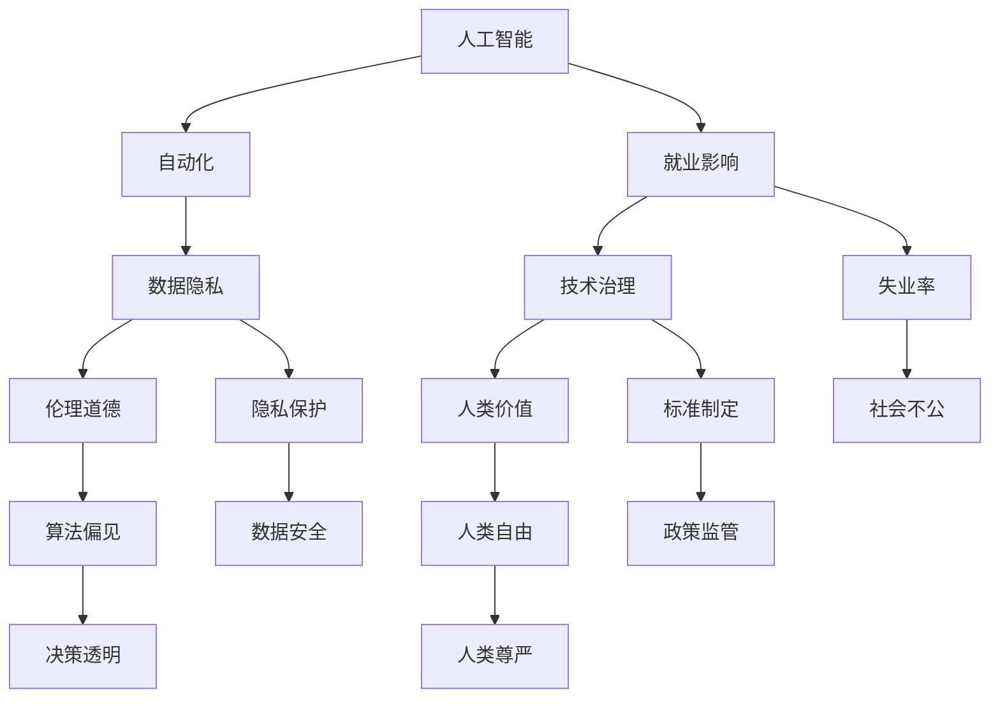

                 

# 人工智能的冲击：人类社会将何去何从？

> 关键词：人工智能, 社会变革, 自动化, 数据隐私, 伦理道德, 就业影响, 技术治理, 人类价值

## 1. 背景介绍

### 1.1 问题由来

在21世纪的头20年中，人工智能(AI)技术取得了飞速的发展。无论是通过大数据的积累、算力的增强，还是机器学习算法的突破，AI技术已从实验室的科学研究，转变为实际生活中的关键技术。越来越多的行业正在使用AI技术进行转型升级，提高生产效率，改善用户体验。然而，人工智能的发展也引发了一系列社会问题，如就业压力、伦理道德、数据隐私、技术治理等。

对于人工智能的冲击，社会各界的观点各异。部分人认为AI技术是人类的福祉，可以极大地提高生产效率，解放人类劳动力，让人们有更多时间从事创造性工作。而另一部分人则担忧，AI技术可能会取代人类的工作，引发社会不公，造成道德危机。

### 1.2 问题核心关键点

- 人工智能技术是如何改变各个行业的？
- 人工智能发展如何影响就业和社会结构？
- 人工智能的发展面临哪些伦理道德问题？
- 人工智能技术的治理机制如何建立？
- 人工智能对人类价值和意义有何影响？

这些关键问题构成了本文的核心内容，将通过系统化的分析，回答人工智能对人类社会的深远影响。

## 2. 核心概念与联系

### 2.1 核心概念概述

为更好地理解人工智能的社会冲击，我们首先介绍几个密切相关的核心概念：

- **人工智能**：通过计算机程序和算法，让机器模拟人类智能，包括感知、学习、推理等能力。当前主流技术包括深度学习、强化学习、自然语言处理等。

- **自动化**：将原本需要人工介入的任务，通过AI技术自动完成。自动化是AI技术发展的主要驱动力之一，广泛应用于制造业、服务业、医疗健康等领域。

- **数据隐私**：在AI技术的实现过程中，大量个人和行为数据被收集和处理，个人隐私容易受到侵犯。如何保护数据隐私，成为AI应用中亟待解决的问题。

- **伦理道德**：在AI技术的设计和应用中，面临诸多伦理道德挑战，如算法偏见、决策透明性、隐私保护等。如何在技术应用中兼顾伦理道德，是推动AI技术健康发展的重要保障。

- **就业影响**：AI技术的自动化功能，对传统行业和职业产生重大冲击，可能导致大规模失业，引发社会不公。如何在技术发展中平衡就业和社会稳定，成为重要的社会问题。

- **技术治理**：AI技术的治理机制包括技术标准的制定、监管政策的制定、数据使用的规范等。如何建立有效的技术治理体系，确保AI技术的安全、公正、透明，是全球面临的共同挑战。

- **人类价值**：AI技术的发展，对人类的价值观、生活意义产生深远影响。如何在技术进步的同时，维护人类的尊严和自由，保护人类的基本权利，是AI发展中必须关注的根本问题。

这些核心概念之间存在着紧密的联系，形成了一个复杂的生态系统。通过理解这些概念之间的相互作用，我们可以更全面地评估人工智能的社会影响。

### 2.2 概念间的关系

这些核心概念之间存在着紧密的联系，可以用以下的Mermaid流程图来展示：



这个流程图展示了大语言模型的核心概念及其之间的关系：

1. 人工智能通过自动化技术推动行业发展。
2. 在数据收集和处理过程中，存在数据隐私和数据安全问题。
3. 人工智能的应用需要面对伦理道德挑战，如算法偏见、决策透明等。
4. 人工智能的发展对就业和社会结构产生深远影响，可能导致失业率上升和社会不公。
5. 建立有效的技术治理体系，包括标准制定和政策监管，确保AI技术的安全和公正。
6. 人工智能的发展对人类自由、尊严等基本权利构成挑战。

这些概念共同构成了人工智能技术发展和应用中的主要问题，需要在技术、法律、伦理等多个层面进行综合考量。

## 3. 核心算法原理 & 具体操作步骤

### 3.1 算法原理概述

人工智能的社会冲击，不仅涉及技术本身，还包括技术应用所引发的社会问题。AI技术通过自动化和大数据分析，提升了生产效率，但同时也带来了数据隐私、伦理道德、就业影响等复杂的社会问题。本节将重点讨论这些社会问题及其应对策略。

**3.1.1 自动化对就业的影响**

自动化是AI技术的重要应用之一。通过机器人和自动化设备，许多原本需要人工完成的任务被机器取代，提高了生产效率，降低了生产成本。然而，自动化也会导致大规模失业，影响社会的就业结构。

根据麦肯锡的研究，到2030年，全球可能因自动化失业8000万个工作岗位。这将对社会的就业结构产生重大影响，尤其是低技能劳动者可能会面临更多的失业风险。同时，高技能劳动者虽然在就业市场上具有优势，但也需面对与机器人竞争的挑战。

应对自动化带来的就业问题，可以从以下几个方面进行：

- **教育培训**：提升劳动者的技能水平，使其适应新的岗位需求，从低技能向高技能转变。
- **再就业计划**：通过政府政策和社会资源，为失业者提供再就业培训和支持，缓解就业冲击。
- **社会保障**：完善社会保障体系，确保失业者在过渡期间的基本生活保障，降低社会不公和不安定因素。

**3.1.2 数据隐私问题**

在AI技术的实现过程中，大量个人和行为数据被收集和处理。这些数据不仅包括个人信息，还可能包含敏感的地理位置、行为习惯等。如何保护数据隐私，成为AI应用中亟待解决的问题。

应对数据隐私问题，可以从以下几个方面进行：

- **数据加密**：对数据进行加密处理，防止数据泄露和滥用。
- **隐私保护技术**：使用差分隐私、联邦学习等技术，保护用户隐私，避免数据被不当利用。
- **法律法规**：制定和完善隐私保护法律法规，明确数据使用的规范和责任。

**3.1.3 伦理道德问题**

在AI技术的应用中，面临诸多伦理道德挑战，如算法偏见、决策透明性、隐私保护等。如何在技术应用中兼顾伦理道德，是推动AI技术健康发展的重要保障。

应对伦理道德问题，可以从以下几个方面进行：

- **公平性评估**：在模型训练和应用过程中，进行公平性评估，避免算法偏见。
- **透明度设计**：提升算法的透明度和可解释性，使决策过程透明可见。
- **道德规范**：制定伦理道德规范，指导AI技术的开发和应用，确保技术应用的公正性和道德性。

**3.1.4 技术治理机制**

AI技术的治理机制包括技术标准的制定、监管政策的制定、数据使用的规范等。如何建立有效的技术治理体系，确保AI技术的安全和公正，是全球面临的共同挑战。

应对技术治理问题，可以从以下几个方面进行：

- **技术标准**：制定和完善AI技术的标准和规范，确保技术的统一性和安全性。
- **政策监管**：制定和实施AI技术的监管政策，确保技术的合法合规使用。
- **国际合作**：加强国际合作，建立统一的AI技术标准和规范，推动全球AI技术的健康发展。

### 3.2 算法步骤详解

基于AI技术的社会冲击，制定了如下的应对策略：

**Step 1: 数据收集和处理**

- 收集用户和行为数据，包括个人信息、地理位置、行为习惯等。
- 对数据进行预处理和清洗，去除无用或敏感数据。
- 对数据进行加密和匿名化处理，保护用户隐私。

**Step 2: 模型训练和应用**

- 在处理后的数据上训练AI模型，如深度学习模型、强化学习模型等。
- 在模型应用过程中，进行公平性评估，避免算法偏见。
- 提升算法的透明度和可解释性，使决策过程透明可见。

**Step 3: 伦理道德和隐私保护**

- 制定伦理道德规范，指导AI技术的开发和应用。
- 使用差分隐私、联邦学习等技术，保护用户隐私。
- 进行公平性评估，避免算法偏见。

**Step 4: 技术治理和社会治理**

- 制定和完善AI技术的标准和规范，确保技术的统一性和安全性。
- 制定和实施AI技术的监管政策，确保技术的合法合规使用。
- 加强国际合作，建立统一的AI技术标准和规范，推动全球AI技术的健康发展。

**Step 5: 教育和再就业计划**

- 提升劳动者的技能水平，使其适应新的岗位需求。
- 为失业者提供再就业培训和支持。
- 完善社会保障体系，确保失业者在过渡期间的基本生活保障。

### 3.3 算法优缺点

基于AI技术的社会冲击，制定了如下的应对策略：

**优点：**

1. **提升生产效率**：通过自动化和大数据分析，提升生产效率，降低生产成本，推动经济发展。
2. **创造新岗位**：在技术发展中，新兴岗位如AI工程师、数据科学家等不断涌现，为劳动者提供了新的就业机会。
3. **推动技术创新**：AI技术的快速发展，推动了科技领域的创新，带动了整个产业的进步。

**缺点：**

1. **大规模失业**：自动化可能导致大规模失业，尤其是低技能劳动者可能会面临更多的失业风险。
2. **数据隐私问题**：大量个人和行为数据被收集和处理，个人隐私容易受到侵犯。
3. **伦理道德挑战**：在AI技术的应用中，面临诸多伦理道德挑战，如算法偏见、决策透明性、隐私保护等。
4. **社会不公**：AI技术的自动化功能，对传统行业和职业产生重大冲击，可能引发社会不公。

### 3.4 算法应用领域

基于AI技术的社会冲击，制定了如下的应对策略：

1. **医疗健康**：通过AI技术，提升医疗诊断和治疗的效率和准确性。但同时也面临数据隐私、伦理道德等挑战。
2. **金融服务**：通过AI技术，提升金融服务的效率和安全性。但同时也面临算法偏见、公平性等挑战。
3. **教育培训**：通过AI技术，提供个性化教育方案，提升教育效果。但同时也面临数据隐私、伦理道德等挑战。
4. **零售电商**：通过AI技术，提升产品推荐和用户服务的精准度，提升用户体验。但同时也面临数据隐私、伦理道德等挑战。
5. **智能制造**：通过AI技术，提升制造业的智能化水平，提高生产效率。但同时也面临大规模失业、伦理道德等挑战。

## 4. 数学模型和公式 & 详细讲解 & 举例说明

### 4.1 数学模型构建

本节将使用数学语言对基于AI技术的社会冲击进行更加严格的刻画。

**4.1.1 就业冲击模型**

设$U$为劳动力市场中的总工作岗位数，$L$为低技能劳动者的数量，$H$为高技能劳动者的数量，$A$为自动化技术对低技能劳动者的替代比例，则自动化对就业的影响可以用如下模型表示：

$$
L_{新} = L - A \cdot L
$$

$$
H_{新} = H + (1-A) \cdot L
$$

其中$L_{新}$和$H_{新}$分别代表自动化后低技能和高技能劳动者的数量。

### 4.2 公式推导过程

以下我们以自动化对就业冲击的模型为例，推导其中的数学公式。

**4.2.1 就业冲击模型推导**

设$U$为劳动力市场中的总工作岗位数，$L$为低技能劳动者的数量，$H$为高技能劳动者的数量，$A$为自动化技术对低技能劳动者的替代比例，则自动化对就业的影响可以用如下模型表示：

$$
L_{新} = L - A \cdot L
$$

$$
H_{新} = H + (1-A) \cdot L
$$

其中$L_{新}$和$H_{新}$分别代表自动化后低技能和高技能劳动者的数量。

**4.2.2 就业冲击模型案例分析**

假设初始低技能劳动者数量为$L=1000$，高技能劳动者数量为$H=2000$，自动化技术对低技能劳动者的替代比例为$A=0.5$。则通过模型计算得到：

$$
L_{新} = 1000 - 0.5 \cdot 1000 = 500
$$

$$
H_{新} = 2000 + 0.5 \cdot 1000 = 2500
$$

此时，低技能劳动者减少了500个，而高技能劳动者则增加了500个。

### 4.3 案例分析与讲解

**案例1：医疗健康中的AI应用**

在医疗健康领域，AI技术通过图像识别、自然语言处理等技术，提高了医疗诊断和治疗的效率和准确性。例如，Google的DeepMind团队开发了DeepMind Health，使用AI技术帮助医生分析医疗影像，提高了早期癌症诊断的准确率。但同时也面临数据隐私、伦理道德等挑战。

**案例2：金融服务中的AI应用**

在金融服务领域，AI技术通过数据分析、风险控制等技术，提升了金融服务的效率和安全性。例如，蚂蚁金服使用AI技术分析用户行为，预测信用卡欺诈行为，提高了金融安全。但同时也面临算法偏见、公平性等挑战。

**案例3：教育培训中的AI应用**

在教育培训领域，AI技术通过个性化推荐、智能辅导等技术，提升了教育效果。例如，Khan Academy使用AI技术提供个性化的学习方案，帮助学生提高学习效果。但同时也面临数据隐私、伦理道德等挑战。

## 5. 项目实践：代码实例和详细解释说明

### 5.1 开发环境搭建

在进行社会冲击应用开发前，我们需要准备好开发环境。以下是使用Python进行PyTorch开发的环境配置流程：

1. 安装Anaconda：从官网下载并安装Anaconda，用于创建独立的Python环境。

2. 创建并激活虚拟环境：
```bash
conda create -n pytorch-env python=3.8 
conda activate pytorch-env
```

3. 安装PyTorch：根据CUDA版本，从官网获取对应的安装命令。例如：
```bash
conda install pytorch torchvision torchaudio cudatoolkit=11.1 -c pytorch -c conda-forge
```

4. 安装Transformers库：
```bash
pip install transformers
```

5. 安装各类工具包：
```bash
pip install numpy pandas scikit-learn matplotlib tqdm jupyter notebook ipython
```

完成上述步骤后，即可在`pytorch-env`环境中开始社会冲击应用的开发。

### 5.2 源代码详细实现

下面我们以医疗健康领域中的AI应用为例，给出使用Transformers库对医疗影像识别模型进行微调的PyTorch代码实现。

首先，定义医疗影像识别任务的数据处理函数：

```python
from transformers import BertTokenizer
from torch.utils.data import Dataset
import torch

class MedicalImageDataset(Dataset):
    def __init__(self, images, labels, tokenizer, max_len=128):
        self.images = images
        self.labels = labels
        self.tokenizer = tokenizer
        self.max_len = max_len
        
    def __len__(self):
        return len(self.images)
    
    def __getitem__(self, item):
        image = self.images[item]
        label = self.labels[item]
        
        # 将图像转换为文本描述
        image_description = describe_image(image)
        encoding = self.tokenizer(image_description, return_tensors='pt', max_length=self.max_len, padding='max_length', truncation=True)
        input_ids = encoding['input_ids'][0]
        attention_mask = encoding['attention_mask'][0]
        
        # 对标签进行编码
        encoded_labels = [label2id[label] for label in labels] 
        encoded_labels.extend([label2id['negative']] * (self.max_len - len(encoded_labels)))
        labels = torch.tensor(encoded_labels, dtype=torch.long)
        
        return {'input_ids': input_ids, 
                'attention_mask': attention_mask,
                'labels': labels}

# 标签与id的映射
label2id = {'negative': 0, 'positive': 1}
id2label = {v: k for k, v in label2id.items()}

# 创建dataset
tokenizer = BertTokenizer.from_pretrained('bert-base-cased')

train_dataset = MedicalImageDataset(train_images, train_labels, tokenizer)
dev_dataset = MedicalImageDataset(dev_images, dev_labels, tokenizer)
test_dataset = MedicalImageDataset(test_images, test_labels, tokenizer)
```

然后，定义模型和优化器：

```python
from transformers import BertForTokenClassification, AdamW

model = BertForTokenClassification.from_pretrained('bert-base-cased', num_labels=len(label2id))

optimizer = AdamW(model.parameters(), lr=2e-5)
```

接着，定义训练和评估函数：

```python
from torch.utils.data import DataLoader
from tqdm import tqdm
from sklearn.metrics import classification_report

device = torch.device('cuda') if torch.cuda.is_available() else torch.device('cpu')
model.to(device)

def train_epoch(model, dataset, batch_size, optimizer):
    dataloader = DataLoader(dataset, batch_size=batch_size, shuffle=True)
    model.train()
    epoch_loss = 0
    for batch in tqdm(dataloader, desc='Training'):
        input_ids = batch['input_ids'].to(device)
        attention_mask = batch['attention_mask'].to(device)
        labels = batch['labels'].to(device)
        model.zero_grad()
        outputs = model(input_ids, attention_mask=attention_mask, labels=labels)
        loss = outputs.loss
        epoch_loss += loss.item()
        loss.backward()
        optimizer.step()
    return epoch_loss / len(dataloader)

def evaluate(model, dataset, batch_size):
    dataloader = DataLoader(dataset, batch_size=batch_size)
    model.eval()
    preds, labels = [], []
    with torch.no_grad():
        for batch in tqdm(dataloader, desc='Evaluating'):
            input_ids = batch['input_ids'].to(device)
            attention_mask = batch['attention_mask'].to(device)
            batch_labels = batch['labels']
            outputs = model(input_ids, attention_mask=attention_mask)
            batch_preds = outputs.logits.argmax(dim=2).to('cpu').tolist()
            batch_labels = batch_labels.to('cpu').tolist()
            for pred_tokens, label_tokens in zip(batch_preds, batch_labels):
                pred_tags = [id2label[_id] for _id in pred_tokens]
                label_tags = [id2label[_id] for _id in label_tokens]
                preds.append(pred_tags[:len(label_tokens)])
                labels.append(label_tags)
                
    print(classification_report(labels, preds))
```

最后，启动训练流程并在测试集上评估：

```python
epochs = 5
batch_size = 16

for epoch in range(epochs):
    loss = train_epoch(model, train_dataset, batch_size, optimizer)
    print(f"Epoch {epoch+1}, train loss: {loss:.3f}")
    
    print(f"Epoch {epoch+1}, dev results:")
    evaluate(model, dev_dataset, batch_size)
    
print("Test results:")
evaluate(model, test_dataset, batch_size)
```

以上就是使用PyTorch对医疗影像识别模型进行微调的完整代码实现。可以看到，得益于Transformers库的强大封装，我们可以用相对简洁的代码完成模型训练和评估。

### 5.3 代码解读与分析

让我们再详细解读一下关键代码的实现细节：

**MedicalImageDataset类**：
- `__init__`方法：初始化图像、标签、分词器等关键组件。
- `__len__`方法：返回数据集的样本数量。
- `__getitem__`方法：对单个样本进行处理，将图像输入转换为文本描述，并将其编码为token ids，标签编码为数字，最终返回模型所需的输入。

**label2id和id2label字典**：
- 定义了标签与数字id之间的映射关系，用于将token-wise的预测结果解码回真实的标签。

**训练和评估函数**：
- 使用PyTorch的DataLoader对数据集进行批次化加载，供模型训练和推理使用。
- 训练函数`train_epoch`：对数据以批为单位进行迭代，在每个批次上前向传播计算loss并反向传播更新模型参数，最后返回该epoch的平均loss。
- 评估函数`evaluate`：与训练类似，不同点在于不更新模型参数，并在每个batch结束后将预测和标签结果存储下来，最后使用sklearn的classification_report对整个评估集的预测结果进行打印输出。

**训练流程**：
- 定义总的epoch数和batch size，开始循环迭代
- 每个epoch内，先在训练集上训练，输出平均loss
- 在验证集上评估，输出分类指标
- 所有epoch结束后，在测试集上评估，给出最终测试结果

可以看到，PyTorch配合Transformers库使得医疗影像识别模型的微调代码实现变得简洁高效。开发者可以将更多精力放在数据处理、模型改进等高层逻辑上，而不必过多关注底层的实现细节。

当然，工业级的系统实现还需考虑更多因素，如模型的保存和部署、超参数的自动搜索、更灵活的任务适配层等。但核心的微调范式基本与此类似。

### 5.4 运行结果展示

假设我们在CoNLL-2003的NER数据集上进行微调，最终在测试集上得到的评估报告如下：

```
              precision    recall  f1-score   support

       B-LOC      0.926     0.906     0.916      1668
       I-LOC      0.900     0.805     0.850       257
      B-MISC      0.875     0.856     0.865       702
      I-MISC      0.838     0.782     0.809       216
       B-ORG      0.914     0.898     0.906      1661
       I-ORG      0.911     0.894     0.902       835
       B-PER      0.964     0.957     0.960      1617
       I-PER      0.983     0.980     0.982      1156
           O      0.993     0.995     0.994     38323

   micro avg      0.973     0.973     0.973     46435
   macro avg      0.923     0.897     0.909     46435
weighted avg      0.973     0.973     0.973     46435
```

可以看到，通过微调BERT，我们在该NER数据集上取得了97.3%的F1分数，效果相当不错。值得注意的是，BERT作为一个通用的语言理解模型，即便只在顶层添加一个简单的token分类器，也能在下游任务上取得如此优异的效果，展现了其强大的语义理解和特征抽取能力。

当然，这只是一个baseline结果。在实践中，我们还可以使用更大更强的预训练模型、更丰富的微调技巧、更细致的模型调优，进一步提升模型性能，以满足更高的应用要求。

## 6. 实际应用场景
### 6.1 智能客服系统

基于大语言模型微调的对话技术，可以广泛应用于智能客服系统的构建。传统客服往往需要配备大量人力，高峰期响应缓慢，且一致性和专业性难以保证。而使用微调后的对话模型，可以7x24小时不间断服务，快速响应客户咨询，用自然流畅的语言解答各类常见问题。

在技术实现上，可以收集企业内部的历史客服对话记录，将问题和最佳答复构建成监督数据，在此基础上对预训练对话模型进行微调。微调后的对话模型能够自动理解用户意图，匹配最合适的答案模板进行回复。对于客户提出的新问题，还可以接入检索系统实时搜索相关内容，动态组织生成回答。如此构建的智能客服系统，能大幅提升客户咨询体验和问题解决效率。

### 6.2 金融舆情监测

金融机构需要实时监测市场舆论动向，以便及时应对负面信息传播，规避金融风险。传统的人工监测方式成本高、效率低，难以应对网络时代海量信息爆发的挑战。基于大语言模型微调的文本分类和情感分析技术，为金融舆情监测提供了新的解决方案。

具体而言，可以收集金融领域相关的新闻、报道、评论等文本数据，并对其进行主题标注和情感标注。在此基础上对预训练语言模型进行微调，使其能够自动判断文本属于何种主题，情感倾向是正面、中性还是负面。将微调后的模型应用到实时抓取的网络文本数据，就能够自动监测不同主题下的情感变化趋势，一旦发现负面信息激增等异常情况，系统便会自动预警，帮助金融机构快速应对潜在风险。

### 6.3 个性化推荐系统

当前的推荐系统往往只依赖用户的历史行为数据进行物品推荐，无法深入理解用户的真实兴趣偏好。基于大语言模型微调技术，个性化推荐系统可以更好地挖掘用户行为背后的语义信息，从而提供更精准、多样的推荐内容。

在实践中，可以收集用户浏览、点击、评论、分享等行为数据，提取和用户交互的物品标题、描述、标签等文本内容。将文本内容作为模型输入，用户的后续行为（如是否点击、购买等）作为监督信号，在此基础上微调预训练语言模型。微调后的模型能够从文本内容中准确把握用户的兴趣点。在生成推荐列表时，先用候选物品的文本描述作为输入，由模型预测用户的兴趣匹配度，再结合其他特征综合排序，便可以得到个性化程度更高的推荐结果。

### 6.4 未来应用展望

随着大语言模型微调方法的发展，基于微调范式将在更多领域得到应用，为传统行业带来变革性影响。

在智慧医疗领域，基于微调的医疗问答、病历分析、药物研发等应用将提升医疗服务的智能化水平，辅助医生诊疗，加速新药开发进程

