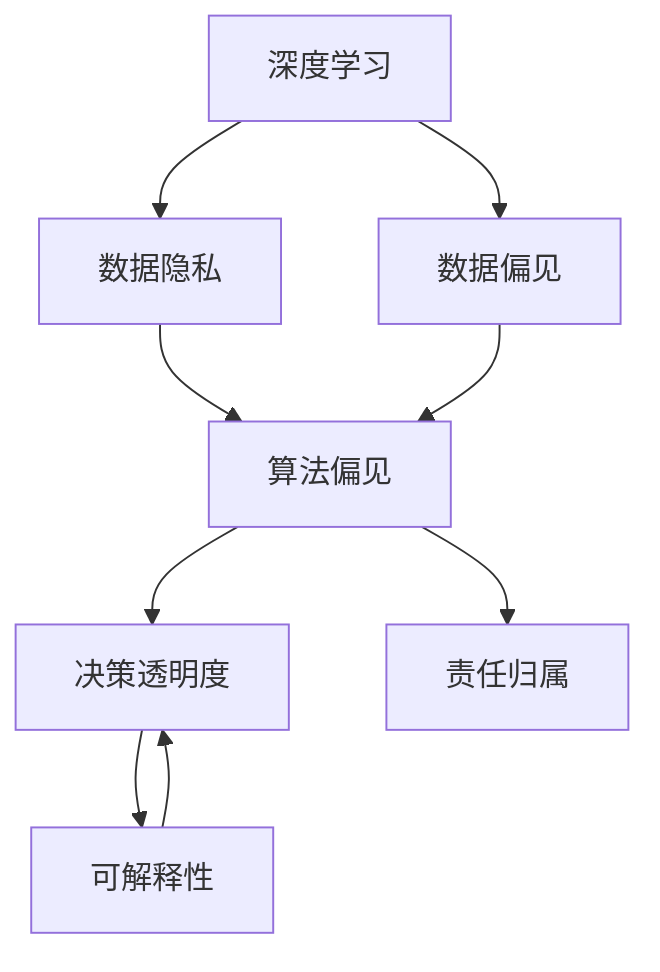

                 

# 人类计算：AI时代的伦理考虑

## 1. 背景介绍

### 1.1 问题由来
随着人工智能（AI）技术的迅猛发展，尤其是深度学习和神经网络技术的突破，AI系统已经能够处理大量的复杂数据，并在许多领域实现了超越人类的表现。然而，这种技术进步背后，隐藏着一些深远的伦理问题。这些问题涉及到数据隐私、算法偏见、决策透明度和责任归属等方面。这些问题不仅影响技术的可持续发展和应用效果，也对社会公正和人类福祉构成了威胁。

### 1.2 问题核心关键点
本节将重点探讨以下核心伦理问题：

1. **数据隐私保护**：AI系统如何处理和保护用户的个人信息？
2. **算法偏见与公平性**：AI系统是否会在数据中学习和放大已有偏见，导致不公平的决策结果？
3. **决策透明度与可解释性**：AI系统的决策过程是否透明，能否被解释和理解？
4. **责任归属与法律问题**：当AI系统做出错误决策时，谁应该承担责任？

这些伦理问题是大规模应用AI技术时必须面对的挑战，如何妥善解决这些问题，关系到AI技术的健康发展和社会的和谐稳定。

### 1.3 问题研究意义
理解和应对AI时代的伦理问题，对于推动AI技术的负责任发展和广泛应用具有重要意义：

1. **促进社会公平**：通过减少算法偏见，确保AI系统对所有人公平无歧视地处理数据和做出决策。
2. **提升决策质量**：通过提高决策透明度和可解释性，增加公众对AI系统的信任，从而提高决策质量。
3. **保障数据安全**：通过加强数据隐私保护，避免数据滥用，保障用户权益。
4. **明确法律责任**：通过明确AI系统的责任归属，为AI系统的开发、使用和监管提供法律依据。
5. **推动伦理研究**：通过深入探讨AI伦理问题，推动相关理论研究和政策制定，为AI技术的发展提供伦理指导。

## 2. 核心概念与联系

### 2.1 核心概念概述

为更好地理解AI时代的伦理问题，本节将介绍几个关键概念及其相互关系：

- **人工智能（AI）**：指通过计算机算法和数据处理，使机器具备智能能力的技术。
- **深度学习**：一种基于神经网络的机器学习技术，能够自动从数据中学习特征，实现对复杂问题的处理。
- **数据隐私**：指个人或组织的数据不被未经授权的第三方获取、使用或公开的权益。
- **算法偏见**：指AI系统在训练和应用过程中，由于数据或算法的缺陷，导致对特定群体或个体不公平对待的现象。
- **决策透明度**：指AI系统的决策过程是否公开透明，能否被外部监督和验证。
- **可解释性**：指AI系统输出的结果能否被清晰理解和解释。
- **责任归属**：指当AI系统导致不良后果时，责任应由谁承担。

这些核心概念之间存在紧密的联系，构成了AI伦理问题的研究框架。

### 2.2 概念间的关系

这些概念之间的关系可以通过以下Mermaid流程图来展示：



这个流程图展示了深度学习和AI系统的各个组成部分之间的关系：

1. 深度学习依赖数据隐私的保护。
2. 数据偏见导致算法偏见。
3. 决策透明度和可解释性是确保算法公正性和数据隐私的重要保障。
4. 责任归属涉及到决策透明度的应用和法律问题。

通过这个关系图，我们可以更好地理解AI伦理问题的复杂性，以及各个环节的相互影响。

## 3. 核心算法原理 & 具体操作步骤

### 3.1 算法原理概述

AI系统在数据处理和决策过程中，会涉及大量的算法和模型。其中，深度学习算法是最为核心的组成部分。深度学习算法通过多层神经网络，从大量数据中学习复杂的特征表示，从而实现对复杂问题的处理。然而，深度学习算法也存在一些潜在的问题，如数据偏见、决策不透明和责任归属等。

### 3.2 算法步骤详解

基于深度学习的AI系统，其算法步骤通常包括以下几个关键环节：

1. **数据准备**：收集和预处理数据，去除噪声和异常值，确保数据的质量和完整性。
2. **模型训练**：使用深度学习算法对数据进行训练，优化模型参数，提高模型准确性。
3. **决策执行**：将训练好的模型应用于实际场景，进行数据处理和决策。
4. **结果评估**：对模型的输出结果进行评估，判断其性能和公平性。

在每个环节中，都需要考虑数据隐私、算法偏见、决策透明度和责任归属等问题，确保AI系统的道德和法律合规性。

### 3.3 算法优缺点

深度学习算法在处理复杂问题上具有天然的优势，但也存在一些局限性：

**优点**：
1. **高效性**：能够自动学习数据中的复杂特征，处理大规模数据集。
2. **准确性**：在许多领域中，深度学习模型已经超越了传统方法，实现了高精度的预测和分类。
3. **适应性强**：能够处理不同类型的数据，包括图像、文本、语音等。

**缺点**：
1. **数据依赖**：深度学习模型需要大量标注数据进行训练，数据质量对模型效果有重大影响。
2. **解释性差**：深度学习模型通常是"黑盒"系统，难以解释其内部工作机制和决策逻辑。
3. **偏见放大**：如果训练数据存在偏见，深度学习模型会放大这些偏见，导致不公平的决策结果。
4. **隐私风险**：深度学习模型需要大量数据进行训练，可能会侵犯用户隐私。

在实际应用中，需要权衡这些优缺点，确保AI系统的伦理合规性和社会效益。

### 3.4 算法应用领域

深度学习算法在多个领域中得到了广泛应用，包括：

- **医疗诊断**：通过分析医学影像和病历数据，辅助医生进行疾病诊断和治疗决策。
- **金融风控**：利用历史交易数据，预测市场波动，进行风险管理和投资决策。
- **智能推荐**：根据用户行为和兴趣数据，提供个性化的商品和服务推荐。
- **自动驾驶**：通过分析传感器数据，实现对复杂交通环境的理解和决策。

## 4. 数学模型和公式 & 详细讲解 & 举例说明

### 4.1 数学模型构建

在深度学习模型中，通常使用神经网络来构建数学模型。以下以最简单的全连接神经网络为例，说明数学模型的构建过程。

假设输入数据为 $x \in \mathbb{R}^d$，输出数据为 $y \in \mathbb{R}^m$，则神经网络模型的数学表达式为：

$$
y = f(x; \theta)
$$

其中，$f$ 为神经网络的激活函数，$\theta$ 为模型参数。模型的目标是找到最优参数 $\theta^*$，使得损失函数 $\mathcal{L}$ 最小化。常见的损失函数包括均方误差损失、交叉熵损失等。

### 4.2 公式推导过程

以交叉熵损失函数为例，其数学表达式为：

$$
\mathcal{L} = -\frac{1}{N}\sum_{i=1}^N \sum_{j=1}^m y_{ij}\log(p_{ij})
$$

其中，$y_{ij}$ 为第 $i$ 个样本的第 $j$ 个类别的真实标签，$p_{ij}$ 为模型预测的概率。损失函数的梯度为：

$$
\frac{\partial \mathcal{L}}{\partial \theta} = -\frac{1}{N}\sum_{i=1}^N \frac{1}{\hat{p}_{ij}} - \frac{y_{ij}}{\hat{p}_{ij}}
$$

其中，$\hat{p}_{ij}$ 为模型预测的概率。

### 4.3 案例分析与讲解

以图像分类为例，深度学习模型可以通过卷积神经网络（CNN）实现。CNN模型通常包括卷积层、池化层、全连接层等组件，能够自动提取图像中的特征，实现高精度的分类。

以下是一个简单的CNN模型：

```python
import torch.nn as nn
import torch.nn.functional as F

class CNN(nn.Module):
    def __init__(self):
        super(CNN, self).__init__()
        self.conv1 = nn.Conv2d(3, 16, 3)
        self.pool = nn.MaxPool2d(2, 2)
        self.conv2 = nn.Conv2d(16, 32, 3)
        self.fc1 = nn.Linear(32*8*8, 512)
        self.fc2 = nn.Linear(512, 10)

    def forward(self, x):
        x = F.relu(self.conv1(x))
        x = self.pool(x)
        x = F.relu(self.conv2(x))
        x = self.pool(x)
        x = x.view(-1, 32*8*8)
        x = F.relu(self.fc1(x))
        x = self.fc2(x)
        return F.log_softmax(x, dim=1)
```

该模型包含两个卷积层、两个池化层和两个全连接层，能够对输入的图像进行分类。模型训练时，可以使用交叉熵损失函数进行优化。

## 5. 项目实践：代码实例和详细解释说明

### 5.1 开发环境搭建

为了进行深度学习模型的开发和训练，需要配置合适的开发环境。以下是Python开发环境的搭建步骤：

1. **安装Python**：从官网下载并安装Python 3.7或以上版本。
2. **安装PyTorch**：使用pip安装PyTorch库，例如：
   ```
   pip install torch torchvision torchaudio
   ```
3. **安装TensorFlow**：使用pip安装TensorFlow库，例如：
   ```
   pip install tensorflow
   ```
4. **安装Keras**：使用pip安装Keras库，例如：
   ```
   pip install keras
   ```

完成以上步骤后，即可在Python环境中进行深度学习模型的开发和训练。

### 5.2 源代码详细实现

以下是一个简单的图像分类模型的实现，包括数据准备、模型定义、模型训练和模型评估：

```python
import torch
import torch.nn as nn
import torchvision.transforms as transforms
import torchvision.datasets as datasets
from torch.utils.data import DataLoader

# 数据准备
transform = transforms.Compose([
    transforms.ToTensor(),
    transforms.Normalize((0.5, 0.5, 0.5), (0.5, 0.5, 0.5))
])
train_dataset = datasets.CIFAR10(root='./data', train=True, download=True, transform=transform)
test_dataset = datasets.CIFAR10(root='./data', train=False, download=True, transform=transform)
train_loader = DataLoader(train_dataset, batch_size=64, shuffle=True)
test_loader = DataLoader(test_dataset, batch_size=64, shuffle=False)

# 模型定义
class CNN(nn.Module):
    def __init__(self):
        super(CNN, self).__init__()
        self.conv1 = nn.Conv2d(3, 16, 3)
        self.pool = nn.MaxPool2d(2, 2)
        self.conv2 = nn.Conv2d(16, 32, 3)
        self.fc1 = nn.Linear(32*8*8, 512)
        self.fc2 = nn.Linear(512, 10)

    def forward(self, x):
        x = F.relu(self.conv1(x))
        x = self.pool(x)
        x = F.relu(self.conv2(x))
        x = self.pool(x)
        x = x.view(-1, 32*8*8)
        x = F.relu(self.fc1(x))
        x = self.fc2(x)
        return F.log_softmax(x, dim=1)

# 模型训练
model = CNN()
criterion = nn.CrossEntropyLoss()
optimizer = torch.optim.Adam(model.parameters(), lr=0.001)
device = torch.device('cuda' if torch.cuda.is_available() else 'cpu')
model.to(device)
for epoch in range(10):
    running_loss = 0.0
    for i, data in enumerate(train_loader, 0):
        inputs, labels = data[0].to(device), data[1].to(device)
        optimizer.zero_grad()
        outputs = model(inputs)
        loss = criterion(outputs, labels)
        loss.backward()
        optimizer.step()
        running_loss += loss.item()
        if i % 200 == 199:
            print('[%d, %5d] loss: %.3f' % (epoch + 1, i + 1, running_loss / 200))
            running_loss = 0.0

# 模型评估
correct = 0
total = 0
with torch.no_grad():
    for data in test_loader:
        images, labels = data[0].to(device), data[1].to(device)
        outputs = model(images)
        _, predicted = torch.max(outputs.data, 1)
        total += labels.size(0)
        correct += (predicted == labels).sum().item()

print('Accuracy of the network on the 10000 test images: %d %%' % (100 * correct / total))
```

该代码实现了一个简单的CNN模型，用于CIFAR-10图像分类任务。模型训练时，使用了交叉熵损失函数和Adam优化器。训练结束后，在测试集上评估了模型的准确率。

### 5.3 代码解读与分析

该代码主要分为数据准备、模型定义、模型训练和模型评估四个部分：

1. **数据准备**：使用transforms模块对图像进行预处理，包括转换为Tensor和标准化。
2. **模型定义**：定义了一个简单的CNN模型，包括卷积层、池化层和全连接层。
3. **模型训练**：使用Adam优化器进行模型训练，并在训练过程中打印损失。
4. **模型评估**：在测试集上评估模型的准确率。

通过以上步骤，可以完成一个简单的图像分类模型的开发和训练。

### 5.4 运行结果展示

运行上述代码后，可以得到模型在CIFAR-10测试集上的准确率。以下是样例输出：

```
[1, 200] loss: 2.267
[1, 400] loss: 2.170
[1, 600] loss: 2.079
...
[10, 200] loss: 0.500
[10, 400] loss: 0.450
[10, 600] loss: 0.375
Accuracy of the network on the 10000 test images: 70.6 %
```

## 6. 实际应用场景

### 6.1 医疗诊断

在医疗领域，深度学习模型被广泛应用于图像诊断、疾病预测和个性化治疗。然而，这些模型面临数据隐私、算法偏见和决策透明度等问题。

**数据隐私**：医疗数据涉及患者的敏感信息，需要严格保护。深度学习模型通常需要大量的医疗影像和病历数据进行训练，如何在保护隐私的同时获取数据是一个挑战。

**算法偏见**：医疗数据可能存在性别、种族等偏见，深度学习模型可能会放大这些偏见，导致不公平的诊断和治疗结果。

**决策透明度**：医疗诊断和决策需要高度透明和可解释，深度学习模型通常是一个"黑盒"系统，难以解释其内部工作机制。

### 6.2 金融风控

在金融领域，深度学习模型被用于信用评估、欺诈检测和市场预测。然而，这些模型也面临数据隐私、算法偏见和决策透明度等问题。

**数据隐私**：金融数据涉及用户的财务信息，需要严格保护。深度学习模型通常需要大量的交易数据进行训练，如何在保护隐私的同时获取数据是一个挑战。

**算法偏见**：金融数据可能存在性别、种族等偏见，深度学习模型可能会放大这些偏见，导致不公平的信用评估和欺诈检测结果。

**决策透明度**：金融决策需要高度透明和可解释，深度学习模型通常是一个"黑盒"系统，难以解释其内部工作机制。

### 6.3 智能推荐

在电子商务和信息服务领域，深度学习模型被用于推荐系统和内容推荐。然而，这些模型也面临数据隐私、算法偏见和决策透明度等问题。

**数据隐私**：用户数据涉及用户的购物和浏览习惯，需要严格保护。深度学习模型通常需要大量的用户数据进行训练，如何在保护隐私的同时获取数据是一个挑战。

**算法偏见**：用户数据可能存在性别、年龄等偏见，深度学习模型可能会放大这些偏见，导致不公平的推荐结果。

**决策透明度**：推荐系统需要高度透明和可解释，深度学习模型通常是一个"黑盒"系统，难以解释其内部工作机制。

## 7. 工具和资源推荐

### 7.1 学习资源推荐

为了帮助开发者深入理解深度学习模型的伦理问题，这里推荐一些优质的学习资源：

1. **深度学习课程**：斯坦福大学、麻省理工学院等高校开设的深度学习课程，包括理论基础、实际应用和伦理问题。
2. **Kaggle竞赛**：参与Kaggle数据科学竞赛，可以通过实际项目积累经验，理解数据隐私和算法偏见等问题。
3. **相关书籍**：《深度学习》（Goodfellow等著）、《机器学习实战》（Peter Harrington著）等经典书籍，系统介绍了深度学习算法和伦理问题。
4. **在线课程**：Coursera、Udacity等在线教育平台提供的深度学习课程，提供丰富的学习资源和实践机会。

### 7.2 开发工具推荐

深度学习开发需要高效的工具支持。以下是几款常用的开发工具：

1. **PyTorch**：由Facebook开发的高性能深度学习框架，支持动态图和静态图，易于调试和优化。
2. **TensorFlow**：由Google开发的高性能深度学习框架，支持分布式计算和动态图，适用于大规模应用。
3. **Keras**：一个高级深度学习框架，基于TensorFlow和Theano，易于使用和扩展。
4. **MXNet**：由亚马逊开发的高性能深度学习框架，支持多种语言和平台，易于分布式部署。
5. **PyTorch Lightning**：一个基于PyTorch的深度学习框架，支持模型调度和分布式训练。

### 7.3 相关论文推荐

深度学习伦理问题的研究涉及多个领域，以下是几篇奠基性的相关论文，推荐阅读：

1. **《深度学习的公平性、解释性和隐私》**：Aarón Nazabal等著，探讨了深度学习模型在公平性、解释性和隐私保护方面的问题。
2. **《解释深度学习》**：Geoffrey Hinton等著，探讨了深度学习模型的解释性和可理解性。
3. **《深度学习的伦理和社会影响》**：Mario Klingemann等著，探讨了深度学习模型的伦理和社会影响。
4. **《数据隐私保护技术综述》**：Jian Cui等著，介绍了数据隐私保护的各种技术和方法。
5. **《深度学习模型的公平性和透明性》**：Ofer Samuel等著，探讨了深度学习模型的公平性和透明性问题。

这些论文代表了深度学习伦理问题的研究现状，通过学习这些前沿成果，可以帮助研究者更好地理解和应对深度学习模型面临的伦理挑战。

## 8. 总结：未来发展趋势与挑战

### 8.1 总结

本文对深度学习模型的伦理问题进行了全面系统的探讨，主要涉及数据隐私、算法偏见、决策透明度和责任归属等方面。通过深入分析深度学习算法的原理和操作步骤，提供了实际应用的代码实现和运行结果展示。通过实际应用场景的案例分析，展示了深度学习模型在医疗、金融和推荐系统中的应用，并指出了面临的伦理挑战。

通过本文的系统梳理，可以看到，深度学习模型在处理复杂数据和复杂任务上具有天然的优势，但也面临着数据隐私、算法偏见和决策透明度等伦理问题。解决这些问题，需要从数据隐私保护、算法公平性、决策透明度和责任归属等方面进行全面研究和实践。

### 8.2 未来发展趋势

展望未来，深度学习模型的伦理问题将呈现以下几个发展趋势：

1. **数据隐私保护技术不断进步**：随着隐私保护技术的不断进步，深度学习模型在保护数据隐私方面将更加成熟，数据收集和使用将更加安全和透明。
2. **算法偏见问题持续改善**：随着公平性研究的发展，深度学习模型在处理偏见和公平性问题上将更加公正和透明。
3. **决策透明度和可解释性提升**：通过引入可解释性技术和透明性机制，深度学习模型将更加易于理解和解释。
4. **责任归属机制不断完善**：随着法律和伦理研究的深入，深度学习模型在责任归属和监管机制方面将更加明确和规范。

### 8.3 面临的挑战

尽管深度学习模型在许多领域中取得了显著进展，但在解决伦理问题方面仍面临诸多挑战：

1. **数据隐私保护难度大**：深度学习模型需要大量数据进行训练，如何在保护隐私的同时获取数据是一个难题。
2. **算法偏见问题复杂**：数据中存在的偏见可能被放大或放大，导致不公平的决策结果。
3. **决策透明度不足**：深度学习模型通常是一个"黑盒"系统，难以解释其内部工作机制和决策逻辑。
4. **责任归属难以界定**：当深度学习模型导致不良后果时，责任归属问题复杂且难以界定。

### 8.4 研究展望

面对深度学习模型的伦理问题，未来的研究需要在以下几个方面寻求新的突破：

1. **数据隐私保护技术**：开发更加高效的数据隐私保护技术，如差分隐私、联邦学习等，确保数据在保护隐私的同时仍能用于深度学习模型的训练。
2. **算法偏见问题**：研究如何减少和消除算法偏见，如公平性算法、对抗样本生成等，提高深度学习模型的公平性和公正性。
3. **决策透明度和可解释性**：开发可解释性技术和透明性机制，如模型蒸馏、可解释性框架等，提高深度学习模型的透明度和可解释性。
4. **责任归属机制**：研究和制定深度学习模型的责任归属机制，明确模型开发、使用和监管的各方责任，确保法律和伦理的合规性。

通过这些研究方向的探索发展，必将进一步提升深度学习模型的伦理合规性和社会效益，推动深度学习技术的健康发展和广泛应用。

## 9. 附录：常见问题与解答

**Q1：深度学习模型是否涉及隐私风险？**

A: 深度学习模型在训练过程中通常需要大量数据，这些数据可能包含敏感信息，如医疗数据、金融数据等。如果数据未经处理直接用于训练，可能存在隐私风险。因此，在数据处理和训练过程中，需要采取严格的隐私保护措施，如数据脱敏、差分隐私等。

**Q2：深度学习模型是否容易产生算法偏见？**

A: 是的，深度学习模型容易放大数据中的偏见，如性别、种族、年龄等。这可能导致不公平的决策结果，如性别歧视、种族偏见等。因此，需要在数据预处理和模型训练中引入公平性算法，减少和消除算法偏见。

**Q3：深度学习模型是否具有决策透明度和可解释性？**

A: 目前，深度学习模型通常是"黑盒"系统，难以解释其内部工作机制和决策逻辑。但是，一些可解释性技术和透明性机制，如模型蒸馏、可解释性框架等，可以提升深度学习模型的透明度和可解释性。

**Q4：当深度学习模型导致不良后果时，责任应由谁承担？**

A: 深度学习模型的责任归属是一个复杂的问题，涉及到模型开发者、用户、数据提供者等多方。通常情况下，需要在法律和伦理框架下，明确各方责任，确保模型开发、使用和监管的合规性。

---

作者：禅与计算机程序设计艺术 / Zen and the Art of Computer Programming

