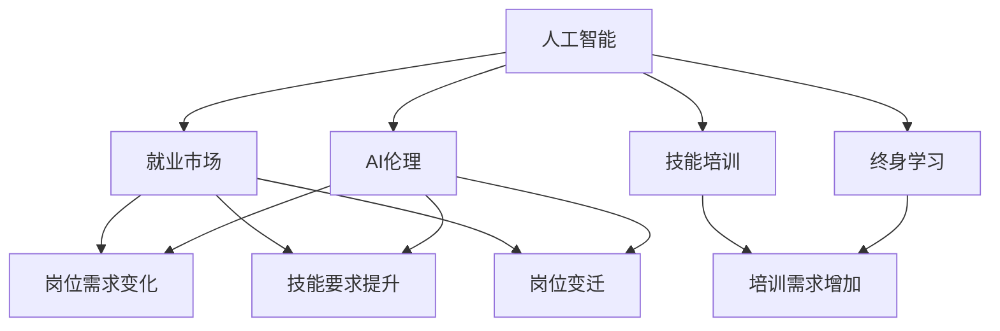

                 

# 人类计算：AI时代的未来就业市场与技能培训发展趋势分析总结挑战

## 1. 背景介绍

### 1.1 问题由来
近年来，人工智能（AI）的迅猛发展引起了社会各界的广泛关注。AI不仅在科技领域带来了革命性的变革，也深刻影响着各行各业的生产方式、管理模式及就业结构。智能机器的普及使得重复性、低技能的工作逐渐被取代，而高技能、创意型的岗位需求不断增加。就业市场结构的变化给传统劳动者带来了严峻的挑战，同时也为终身学习与技能培训提供了前所未有的机遇。

### 1.2 问题核心关键点
AI时代就业市场的变化主要体现在以下几个方面：

1. **岗位需求变化**：AI自动化替代了许多重复性劳动岗位，如数据录入、客服咨询等，但对高技能岗位，如数据分析、AI算法、机器学习工程师的需求却在增长。

2. **技能要求提升**：随着AI技术的发展，许多岗位对技能要求明显提升，如跨领域知识融合、创新能力、复杂问题解决等。

3. **培训需求增加**：终身学习成为新的工作理念，快速适应AI变化的技能培训需求显著增加。

4. **岗位变迁**：一些传统岗位被取代，同时涌现出新岗位，如AI伦理、AI系统管理、机器人维护等。

5. **教育与培训体系更新**：教育体系需要更新课程，结合AI技术开发相关课程，如Python编程、机器学习、数据科学等。

### 1.3 问题研究意义
研究AI时代就业市场的变化及其对技能培训的影响，具有重要意义：

1. **指导就业结构调整**：帮助政策制定者、教育机构和企业更好地适应AI时代的就业市场变化。

2. **提升劳动者技能**：为劳动者提供学习和转型的指引，帮助他们提升自身竞争力。

3. **推动教育改革**：引导教育体系的更新，使培养的学生更好地适应未来的就业市场。

4. **促进经济发展**：为经济增长提供新动力，实现人才与技术的有效结合。

## 2. 核心概念与联系

### 2.1 核心概念概述

在AI时代就业市场与技能培训的研究中，有几个核心概念尤为重要：

- **人工智能（AI）**：一种模拟人类智能过程的技术，包括机器学习、深度学习、自然语言处理等。

- **就业市场**：劳动力的供给与需求市场，受技术进步、政策法规、经济环境等多方面因素影响。

- **技能培训**：通过教育培训提升劳动者技能，使其适应技术变化和职业变迁的过程。

- **终身学习**：在职业生涯中持续学习和提升，以适应技术发展和职业变化。

- **AI伦理**：在开发和使用AI技术时，需考虑其对社会、伦理和道德的影响。

这些概念之间存在紧密的联系，构建起AI时代就业市场与技能培训的研究框架：



这个图展示了AI对就业市场、技能培训、终身学习和AI伦理的深远影响。

### 2.2 概念间的关系

这些核心概念之间具有以下逻辑关系：

- **人工智能与就业市场**：AI技术的发展直接影响就业市场结构变化，自动化替代低技能岗位，增加对高技能岗位的需求。

- **人工智能与技能培训**：AI技术要求劳动者具备新技能，如编程、数据分析、机器学习等，因此技能培训需求增加。

- **人工智能与终身学习**：AI技术发展迅猛，劳动者需持续学习新技能以适应就业市场变化。

- **人工智能与AI伦理**：AI伦理问题如隐私保护、决策透明性、责任归属等需得到重视，这直接影响AI技术的开发与应用。

- **就业市场与技能培训**：就业市场变化推动技能培训的更新，如增加数据科学、AI算法等课程。

- **终身学习与技能培训**：终身学习理念要求持续更新技能培训内容，提升劳动者职业素养。

- **AI伦理与技能培训**：AI伦理问题需融入技能培训，培养负责任的AI从业人员。

## 3. 核心算法原理 & 具体操作步骤
### 3.1 算法原理概述

AI时代的就业市场与技能培训研究，主要依赖数据驱动的模型与算法。其核心原理包括以下几个方面：

1. **数据采集与分析**：采集和分析劳动力市场数据，了解岗位需求变化、技能要求提升等趋势。

2. **预测模型构建**：使用统计学、机器学习等方法，构建就业市场预测模型，预测未来岗位需求和技能要求。

3. **技能映射与培训规划**：将岗位需求与技能要求进行映射，制定个性化的技能培训计划。

4. **效果评估与反馈**：评估技能培训效果，收集反馈信息，持续优化培训计划。

5. **动态调整与优化**：根据市场变化与反馈信息，动态调整培训计划，确保其与时俱进。

### 3.2 算法步骤详解

基于上述原理，AI时代就业市场与技能培训研究的具体步骤如下：

1. **数据准备**：收集劳动力市场数据，包括岗位数量、技能要求、薪酬水平等。

2. **特征工程**：对收集的数据进行预处理，提取关键特征，如岗位类型、技能需求、技术栈等。

3. **模型训练**：使用机器学习算法，如决策树、随机森林、神经网络等，对就业市场趋势进行建模。

4. **技能映射**：将预测的岗位需求与技能要求进行映射，生成技能培训需求清单。

5. **培训计划制定**：根据技能映射结果，制定个性化的培训计划，包括课程内容、培训时长、培训方式等。

6. **培训效果评估**：通过问卷调查、实践考核等方式，评估培训效果，收集反馈信息。

7. **调整与优化**：根据评估结果，动态调整培训计划，优化课程内容和培训方式。

### 3.3 算法优缺点

基于数据驱动的模型与算法，具有以下优点：

- **客观性与科学性**：通过数据驱动的方法，预测结果更具客观性和科学性。

- **动态性与适应性**：能实时跟踪市场变化，灵活调整培训计划。

- **个性化与定制化**：根据个人职业规划与市场需求，制定个性化培训方案。

但同时也有以下缺点：

- **数据依赖性**：数据的质量与完备性直接影响模型的准确性。

- **算法复杂性**：复杂算法可能需要大量的计算资源和时间。

- **结果解释性**：模型的输出可能缺乏明确的解释性。

- **模型偏见**：模型可能存在数据偏见，影响结果的公平性。

### 3.4 算法应用领域

AI时代就业市场与技能培训的研究，广泛应用在以下几个领域：

- **政府政策制定**：为政府制定就业政策、职业培训计划提供数据支持。

- **教育机构改革**：帮助学校更新课程内容，引入AI相关知识。

- **企业培训规划**：为企业设计个性化培训方案，提升员工技能。

- **职业发展规划**：帮助劳动者规划职业发展路径，提升自身竞争力。

- **AI伦理教育**：引入AI伦理课程，培养负责任的AI从业人员。

## 4. 数学模型和公式 & 详细讲解  
### 4.1 数学模型构建

在AI时代就业市场与技能培训研究中，可以构建如下数学模型：

- **岗位需求预测模型**：
$$
\hat{D_t} = f(D_{t-1},X_t;\theta)
$$
其中，$D_t$表示未来时间$t$的岗位需求，$D_{t-1}$为过去时间$t-1$的岗位需求，$X_t$为特征变量，$\theta$为模型参数。

- **技能需求映射模型**：
$$
M_{S_t} = g(S_{t-1},D_t;\phi)
$$
其中，$M_{S_t}$表示时间$t$的技能需求，$S_{t-1}$为过去时间$t-1$的技能需求，$D_t$为岗位需求，$\phi$为模型参数。

- **培训效果评估模型**：
$$
E_{t+1} = h(E_t, M_{S_t},R_t;\psi)
$$
其中，$E_{t+1}$表示时间$t+1$的培训效果，$E_t$为时间$t$的培训效果，$M_{S_t}$为技能需求，$R_t$为反馈数据，$\psi$为模型参数。

### 4.2 公式推导过程

以岗位需求预测模型为例，使用回归分析方法进行推导：

设岗位需求为$Y$，特征变量为$X$，线性回归模型为：
$$
Y = \beta_0 + \beta_1X_1 + \beta_2X_2 + ... + \beta_pX_p + \epsilon
$$
其中，$\beta$为回归系数，$\epsilon$为误差项。

利用最小二乘法，求解$\beta$：
$$
\hat{\beta} = (\mathbf{X}^T\mathbf{X})^{-1}\mathbf{X}^TY
$$

训练模型后，使用时间序列方法，对未来岗位需求进行预测：
$$
\hat{D_t} = \hat{\beta}^TX_t
$$

### 4.3 案例分析与讲解

例如，某城市劳动市场数据集包含历史岗位数量、技能需求、技术栈等信息。通过回归模型建立预测模型，设定时间序列参数，可预测未来岗位需求。进一步，使用特征选择方法，如信息增益、Lasso回归等，选择关键特征，生成个性化技能培训需求清单。最终，结合学习者职业发展规划与市场需求，制定个性化培训方案。

## 5. 项目实践：代码实例和详细解释说明
### 5.1 开发环境搭建

进行AI时代就业市场与技能培训研究，需要先搭建开发环境。以下是Python的配置步骤：

1. 安装Python和相关依赖包，如pandas、numpy、scikit-learn、statsmodels等。

2. 安装Jupyter Notebook，搭建交互式开发环境。

3. 准备数据集，包括岗位数量、技能需求、技术栈等，并进行初步清洗和预处理。

4. 搭建机器学习模型，如线性回归、随机森林、神经网络等，使用scikit-learn、statsmodels等库。

5. 设计评估指标，如准确率、召回率、F1分数等，使用scikit-learn中的metrics库。

6. 进行模型训练和验证，调整参数，选择最优模型。

### 5.2 源代码详细实现

以下是使用Python和scikit-learn库，对岗位需求预测模型进行实现的代码示例：

```python
import pandas as pd
from sklearn.linear_model import LinearRegression
from sklearn.model_selection import train_test_split
from sklearn.metrics import mean_squared_error

# 读取数据集
data = pd.read_csv('labor_market_data.csv')

# 数据预处理
features = ['post_number', 'skill_demand', 'technology_stack']
target = 'post_demand'
X = data[features]
y = data[target]

# 分割数据集
X_train, X_test, y_train, y_test = train_test_split(X, y, test_size=0.2, random_state=42)

# 模型训练
model = LinearRegression()
model.fit(X_train, y_train)

# 模型评估
y_pred = model.predict(X_test)
mse = mean_squared_error(y_test, y_pred)
rmse = np.sqrt(mse)

print(f'RMSE: {rmse:.2f}')
```

### 5.3 代码解读与分析

上述代码展示了数据预处理、模型训练和评估的基本步骤：

- `read_csv`：读取数据集。
- `train_test_split`：将数据集分割为训练集和测试集。
- `LinearRegression`：使用线性回归模型。
- `fit`：模型训练。
- `predict`：模型预测。
- `mean_squared_error`：计算预测值与真实值之间的均方误差。

## 6. 实际应用场景
### 6.1 政府政策制定

政府在制定就业政策时，可利用AI技术对未来劳动力市场需求进行预测，提前做好准备。例如，预测某一新兴技术领域岗位需求的增长趋势，提前规划相关职业培训和就业扶持政策，确保政策针对性和前瞻性。

### 6.2 企业培训规划

企业需根据市场变化，及时调整培训计划，提升员工技能。例如，某公司预计大数据分析岗位需求增长，可及时引入相关课程，进行专项培训，满足岗位需求。

### 6.3 职业发展规划

劳动者可利用AI技术，进行职业发展规划，提升自身竞争力。例如，某员工计划转型为AI算法工程师，可通过分析市场需求，选择合适的技能培训课程，规划学习路径。

### 6.4 未来应用展望

随着AI技术的不断进步，未来AI时代就业市场与技能培训研究将呈现以下几个趋势：

1. **多模态数据融合**：结合文本、图像、音频等多模态数据，提高岗位需求预测的准确性。

2. **动态调整机制**：引入强化学习等方法，动态调整培训计划，适应市场变化。

3. **跨领域技能培训**：培养跨学科知识融合能力，如AI与金融、AI与医疗等。

4. **AI伦理教育**：在技能培训中引入AI伦理课程，培养负责任的AI从业者。

5. **个性化学习**：利用AI技术，为每个人定制个性化的培训方案，提升学习效果。

## 7. 工具和资源推荐
### 7.1 学习资源推荐

为了更好地掌握AI时代就业市场与技能培训的研究方法，以下推荐一些优质学习资源：

1. **机器学习课程**：如斯坦福大学的《机器学习》课程，系统介绍机器学习算法及应用。

2. **深度学习框架**：如TensorFlow、PyTorch，学习深度学习模型的构建与训练。

3. **大数据分析**：如Coursera上的《大数据分析与统计》课程，学习数据处理与分析方法。

4. **AI伦理课程**：如《AI伦理与治理》课程，了解AI技术对伦理与道德的影响。

5. **开源工具**：如Jupyter Notebook、scikit-learn，提供强大的数据处理与建模工具。

6. **在线资源**：如Kaggle、GitHub，提供丰富的数据集和开源代码，助力学习与研究。

### 7.2 开发工具推荐

高效开发离不开合适的工具支持。以下是几个推荐的工具：

1. **Python**：Python是数据科学与AI研究的主流编程语言，具有丰富的科学计算库和数据处理工具。

2. **Jupyter Notebook**：提供交互式编程环境，方便代码调试与验证。

3. **TensorFlow**：由Google开发的深度学习框架，功能强大，支持分布式计算。

4. **Scikit-learn**：提供便捷的机器学习算法与工具，适合快速原型开发。

5. **Pandas**：用于数据处理与分析，支持多种数据格式和复杂数据操作。

6. **Matplotlib、Seaborn**：用于数据可视化，帮助更好地理解数据特征。

### 7.3 相关论文推荐

AI时代就业市场与技能培训的研究涉及多学科知识，以下是几篇有代表性的论文：

1. **《未来的工作：自动化时代的就业转变》**：分析AI自动化对就业市场的影响，提出未来工作岗位预测模型。

2. **《教育技术的未来：AI与终身学习》**：探讨AI技术在教育中的应用，推动终身学习与技能培训。

3. **《技能培训的智能设计：基于机器学习的个性化方案》**：利用机器学习算法，设计个性化培训方案，提升学习效果。

4. **《AI伦理与就业市场：挑战与对策》**：分析AI伦理问题对就业市场的影响，提出应对策略。

5. **《大数据与就业市场：趋势与预测》**：利用大数据分析方法，预测就业市场趋势，指导政策制定。

## 8. 总结：未来发展趋势与挑战
### 8.1 研究成果总结

AI时代就业市场与技能培训研究在以下几个方面取得显著进展：

1. **数据驱动预测**：利用数据建模，预测岗位需求与技能要求。

2. **个性化培训方案**：结合个人职业规划与市场需求，设计个性化培训路径。

3. **动态调整机制**：利用强化学习等方法，动态调整培训计划。

4. **跨领域技能培训**：培养跨学科融合能力，提升综合素养。

5. **AI伦理教育**：在技能培训中引入AI伦理课程，培养负责任的AI从业者。

### 8.2 未来发展趋势

未来AI时代就业市场与技能培训将呈现以下几个趋势：

1. **多模态数据融合**：结合多模态数据，提高预测准确性。

2. **动态调整机制**：利用强化学习等方法，实时调整培训计划。

3. **跨领域技能培训**：培养跨学科融合能力，提升综合素养。

4. **AI伦理教育**：在技能培训中引入AI伦理课程，培养负责任的AI从业者。

5. **个性化学习**：利用AI技术，为每个人定制个性化的培训方案。

6. **教育体系更新**：推动教育体系的更新，引入AI相关知识。

### 8.3 面临的挑战

尽管AI时代就业市场与技能培训研究取得了重要进展，但仍面临诸多挑战：

1. **数据质量与完备性**：数据缺失与噪声影响模型预测准确性。

2. **算法复杂性**：复杂算法可能需要大量的计算资源和时间。

3. **结果解释性**：模型的输出可能缺乏明确的解释性。

4. **模型偏见**：模型可能存在数据偏见，影响结果的公平性。

5. **政策与法规**：需要政府政策与法规的支持，保障就业市场的公平与稳定。

6. **技术与教育资源不均**：不同地区、不同群体可能存在资源不均问题。

### 8.4 研究展望

未来研究需从以下几个方面进行探索：

1. **多模态数据融合**：利用多种数据源，提高预测准确性。

2. **动态调整机制**：利用强化学习等方法，实时调整培训计划。

3. **跨领域技能培训**：培养跨学科融合能力，提升综合素养。

4. **AI伦理教育**：在技能培训中引入AI伦理课程，培养负责任的AI从业者。

5. **个性化学习**：利用AI技术，为每个人定制个性化的培训方案。

6. **教育体系更新**：推动教育体系的更新，引入AI相关知识。

7. **政策与法规支持**：完善相关政策与法规，保障就业市场的公平与稳定。

8. **技术与教育资源均衡**：提升技术与教育资源的均衡分配，确保公平性。

通过这些探索，AI时代就业市场与技能培训研究将更好地服务于社会和经济的发展，推动技术与教育的协同进步。

## 9. 附录：常见问题与解答
### 9.1 如何收集高质量的数据？

A: 数据采集需要专业知识和工具。可以借助公共数据集，如Kaggle、UCI等，也可以结合行业报告、企业调研等手段收集数据。

### 9.2 如何提高预测模型的准确性？

A: 采用特征工程、模型选择与调参等方法，提高模型预测的准确性。常用的方法包括特征选择、交叉验证、正则化等。

### 9.3 如何进行动态调整？

A: 结合强化学习等方法，利用反馈数据实时调整培训计划，适应市场变化。

### 9.4 如何确保模型的公平性？

A: 引入公平性约束，避免模型偏见。同时，加强数据处理，保证数据集的代表性。

### 9.5 如何平衡资源与效果？

A: 合理配置计算资源，利用分布式计算、模型压缩等方法，平衡效率与效果。

---

作者：禅与计算机程序设计艺术 / Zen and the Art of Computer Programming

