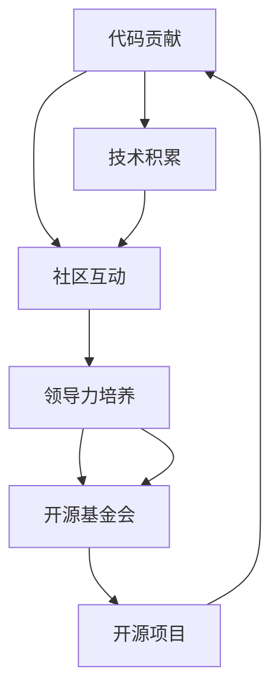

                 

# 从代码贡献者到开源基金会领导者

> 关键词：开源社区, 代码贡献, 开发者成长, 领导力, 开源基金会, 开源项目

## 1. 背景介绍

### 1.1 问题由来
在信息技术飞速发展的今天，开源社区已成为全球软件开发的重要组成部分，影响着全球数亿用户。开源社区不仅为企业提供了丰富的组件和服务，更为开发者提供了一个广泛交流和合作的平台，极大地推动了技术创新和产业变革。

然而，随着开源社区的规模和复杂性的增长，项目管理和协调变得日益困难。项目领导人（Project Leader）作为开源项目的中流砥柱，不仅要具备卓越的编程技能，更需具备良好的领导力和组织协调能力，才能引领团队实现项目目标。

本文将探讨从代码贡献者向开源基金会领导人转变的成长路径，重点讨论代码贡献、技术积累、社区互动、领导力培养等多个关键环节，希望能为开源社区中的有志之士提供指引，推动更多优秀开发者成为开源社区的领导者。

## 2. 核心概念与联系

### 2.1 核心概念概述

为了更好地理解代码贡献者到开源基金会领导者的成长路径，我们首先定义几个核心概念及其之间的关系：

- **代码贡献（Code Contribution）**：指开发者将代码提交到开源项目，为项目提供技术支持和功能增强。
- **技术积累（Technical Accumulation）**：指开发者通过参与开源项目，掌握相关技术栈和开发技能，提升自身的专业能力。
- **社区互动（Community Engagement）**：指开发者在开源社区中积极参与讨论、问题解答、代码评审等工作，建立与社区成员的良好关系。
- **领导力培养（Leadership Development）**：指开发者通过实践和培训，培养自身的领导能力，具备引领团队和项目管理的能力。
- **开源基金会（Open Source Foundation）**：指专注于支持和维护开源项目的非营利组织，为开源社区提供资金、法律和行政支持。
- **开源项目（Open Source Project）**：指由开发者共同维护、共享的代码和资源，用于解决特定问题或提供通用服务。

这些概念构成了开源社区成员成长为开源基金会领导人的基本框架。通过系统的学习和实践，开发者可以从代码贡献逐步过渡到领导者的角色，引领开源社区的创新和发展。

### 2.2 概念间的关系

这些核心概念之间的联系可以用以下 Mermaid 流程图来展示：



这个流程图展示了从代码贡献到开源基金会领导者的成长路径：

1. 开发者通过代码贡献开始积累技术，并通过社区互动提升自身的社会影响力。
2. 在技术积累和社区互动的基础上，开发者通过领导力培养逐步具备团队和项目管理的能力。
3. 具备一定领导力的开发者可以通过参与开源基金会的建设和管理，成为开源项目的领导者，推动项目的持续发展。

## 3. 核心算法原理 & 具体操作步骤

### 3.1 算法原理概述

从代码贡献者到开源基金会领导者的转变，实质上是个人在技术、管理和社交技能上的全面提升。这一过程可以分解为以下几个关键步骤：

1. **技术积累**：通过参与开源项目，掌握新的编程语言和框架，学习团队协作、代码审查、版本控制等技能。
2. **社区互动**：积极参与开源社区的讨论和问题解答，建立和维护良好的人际关系网络。
3. **领导力培养**：通过承担项目管理和团队协调的工作，积累领导经验，逐步具备领导团队和管理项目的能力。
4. **开源基金会参与**：加入开源基金会的相关项目和活动，参与决策和规划，逐步成为开源基金会的领导人。

### 3.2 算法步骤详解

为了更好地理解和实践这一成长路径，我们将其分解为具体的步骤进行讲解：

**Step 1: 技术积累**
- 选择一个感兴趣的开源项目，进行代码贡献，如修复 bug、添加功能、优化性能等。
- 学习项目的技术栈，熟悉项目结构和开发流程。
- 主动参与代码评审和问题解答，向资深开发者学习。

**Step 2: 社区互动**
- 在社交媒体和论坛上关注开源项目的最新动态，参与讨论。
- 建立与社区成员的良好关系，积累人缘和影响力。
- 积极贡献代码和文档，展示自己的技术实力。

**Step 3: 领导力培养**
- 承担项目管理和团队协调的工作，如组织会议、分配任务、处理冲突等。
- 逐步学习和掌握团队管理、问题解决、风险控制等领导技能。
- 参与开源基金会的建设和管理，了解基金会的运营模式和资源分配。

**Step 4: 开源基金会参与**
- 加入开源基金会的志愿者团队或项目委员会，参与决策和规划。
- 担任开源项目的技术负责人或项目负责人，推动项目的持续发展和社区建设。
- 参与基金会的各种活动和培训，提升自身的领导力和影响力。

### 3.3 算法优缺点

开源社区领导者的成长过程具有以下优点：
1. 系统性：通过技术、社区和领导力的全面提升，保证成长路径的完整性和系统性。
2. 实践性：强调实际经验的积累和技能的培养，避免了理论学习的空洞。
3. 灵活性：根据自身情况和项目需求，灵活调整成长路径和目标。

同时，这一过程也存在一些局限：
1. 时间成本：从代码贡献到成为领导者需要较长时间，可能影响其他职业发展。
2. 资源限制：开源项目和基金会的参与需要一定的资源和时间投入，如交通、住宿等。
3. 竞争压力：开源社区的领导者角色有限，需要面对激烈的竞争。

### 3.4 算法应用领域

从代码贡献者到开源基金会领导者的成长路径，在多个领域都有广泛的应用：

- **软件开发**：软件开发人员可以通过参与开源项目，积累技术和管理经验，最终成为项目的领导者和负责人。
- **技术支持**：技术支持人员通过提供高质量的支持和文档，逐步在社区中积累声誉，参与管理活动。
- **项目协调**：项目协调员通过组织和协调项目成员的工作，提升自身领导力，最终成为项目的负责人。
- **项目文档**：文档编写人员通过编写高质量的文档和教程，提升自身影响力，参与社区管理。

这些领域中的开源领导者，通过实际工作和持续学习，不断提升自身能力，推动开源项目和社区的发展。

## 4. 数学模型和公式 & 详细讲解 & 举例说明

### 4.1 数学模型构建

为了方便分析和建模，我们可以将从代码贡献者到开源基金会领导者的成长过程抽象为一个数学模型。

假设 $x$ 表示开发者在技术、社区和领导力方面的综合得分，$y$ 表示其成为开源基金会领导人的概率。我们可以建立如下数学模型：

$$
y = f(x)
$$

其中，$f$ 为综合评估函数，其具体形式如下：

$$
f(x) = \alpha \cdot \text{技术积累得分} + \beta \cdot \text{社区互动得分} + \gamma \cdot \text{领导力得分}
$$

### 4.2 公式推导过程

根据以上模型，我们可以进一步推导出具体的评估公式：

1. **技术积累得分**：
   $$
   \text{技术积累得分} = \sum_{i=1}^{n} w_i \cdot a_i
   $$
   其中 $w_i$ 为第 $i$ 项贡献的权重，$a_i$ 为第 $i$ 项的实际得分。

2. **社区互动得分**：
   $$
   \text{社区互动得分} = \sum_{i=1}^{m} v_i \cdot b_i
   $$
   其中 $v_i$ 为第 $i$ 项互动的权重，$b_i$ 为第 $i$ 项互动的实际得分。

3. **领导力得分**：
   $$
   \text{领导力得分} = \sum_{j=1}^{p} c_j \cdot d_j
   $$
   其中 $c_j$ 为第 $j$ 项领导力的权重，$d_j$ 为第 $j$ 项领导力的实际得分。

### 4.3 案例分析与讲解

假设有一个开发者 $A$，其技术积累、社区互动和领导力的得分分别为 $x_1=70$，$x_2=60$，$x_3=50$。

- **技术积累得分**：开发者 $A$ 在多个开源项目上进行代码贡献，贡献的代码量和质量都很高，获得项目经理的好评。
- **社区互动得分**：开发者 $A$ 在社交媒体上积极回答社区成员的问题，并在技术会议上与多位开发者建立了联系。
- **领导力得分**：开发者 $A$ 在组织项目会议和协调任务中表现出色，展现了卓越的组织和管理能力。

将这些数据代入评估函数，可以得到：

$$
f(x) = \alpha \cdot 70 + \beta \cdot 60 + \gamma \cdot 50
$$

如果 $\alpha=0.3$，$\beta=0.2$，$\gamma=0.5$，则：

$$
f(x) = 0.3 \cdot 70 + 0.2 \cdot 60 + 0.5 \cdot 50 = 60 + 12 + 25 = 97
$$

根据模型，开发者 $A$ 成为开源基金会领导人的概率为 $y = f(x) = 97$。

## 5. 项目实践：代码实例和详细解释说明

### 5.1 开发环境搭建

在本文的实践中，我们使用了 Python 和 Git 作为主要工具。为了更好地进行代码贡献和管理，需要安装和配置以下工具：

1. **Git**：作为版本控制工具，用于管理和协调代码贡献。
2. **GitHub**：作为代码托管平台，提供代码审查、问题跟踪、社区讨论等功能。
3. **IDE**：如 VS Code、PyCharm 等，用于编写、测试和调试代码。

### 5.2 源代码详细实现

以下是一个简单的 Python 项目贡献示例，用于演示代码贡献和社区互动的实现过程。

**项目目录结构**：

```
my_project/
├── README.md
├── LICENSE
├── requirements.txt
├── main.py
├── tests/
├── setup.py
├── .gitignore
└── .travis.yml
```

**代码示例**：

1. 贡献代码
```python
# 在项目目录下创建 newfile.py
# 在代码中修复 bug 或添加新功能
# 提交代码到 Git 仓库
git add newfile.py
git commit -m "Add new feature"
git push origin master
```

2. 社区互动
```python
# 在 GitHub 项目页面上提交 PR 请求
# 在社区讨论中回答问题和提供反馈
# 参与项目会议和讨论
# 在社交媒体上分享项目进展和成果
```

### 5.3 代码解读与分析

通过上述示例，我们可以看到代码贡献和社区互动的基本流程：

1. **代码贡献**：通过编写和提交代码，直接为项目提供功能和改进。
2. **社区互动**：通过 GitHub 等平台，积极参与讨论、问题解答和代码评审，与社区成员建立良好关系。

### 5.4 运行结果展示

运行结果展示如下：

- **GitHub 贡献记录**：开发者提交的代码和 PR 请求。
- **社区互动记录**：开发者在讨论中的发言和评论，收到的回复和反馈。
- **项目进展报告**：项目经理定期发布的项目更新和里程碑。

## 6. 实际应用场景

### 6.1 开源社区

开源社区是开发者成长为开源基金会领导者的重要平台。通过积极参与开源项目，积累技术和管理经验，开发者可以逐步成为项目的领导者。

**示例**：

- **软件开发者**：通过修复 bug、添加功能，逐步成为项目的核心开发者。
- **技术支持**：通过提供高质量的文档和支持，提升自身影响力，参与社区管理。
- **项目经理**：通过组织和协调项目成员的工作，提升领导力，最终成为项目负责人。

### 6.2 企业技术团队

企业技术团队中的开发者，也可以通过参与开源项目和社区互动，提升自身能力，逐步成为团队领导和项目负责人。

**示例**：

- **前端开发者**：通过贡献前端组件和库，提升自身技术和管理能力。
- **后端开发者**：通过贡献后端服务和 API，参与项目管理和决策。
- **全栈开发者**：通过综合前端、后端技术，提供端到端的解决方案，成为团队的领导者。

### 6.3 开源基金会

开源基金会在支持和维护开源项目方面扮演重要角色，是开发者成长为开源基金会领导者的重要途径。

**示例**：

- **技术专家**：通过在开源基金会的技术委员会中发挥作用，推动技术发展。
- **社区经理**：通过组织和协调社区活动，提升自身领导力，成为基金会的领导成员。
- **项目负责人**：通过管理开源项目，推动项目的持续发展和社区建设。

## 7. 工具和资源推荐

### 7.1 学习资源推荐

为了帮助开发者系统掌握开源基金会领导者的成长路径，我们推荐以下几个学习资源：

1. **Open Source Foundation 官方文档**：提供开源基金会的运作机制和管理流程，是了解基金会的入门资料。
2. **GitHub 开发者中心**：提供丰富的资源和工具，帮助开发者更好地进行代码贡献和管理。
3. **Stack Overflow**：提供丰富的技术问答和讨论，帮助开发者解决技术难题，积累社区经验。
4. **Coursera 和 Udemy**：提供开源社区和领导力相关的在线课程，帮助开发者系统学习和提升。
5. **Meetup 和 Local events**：参加开源社区和技术沙龙活动，与社区成员建立联系，提升影响力。

### 7.2 开发工具推荐

以下几款工具可以显著提升开发者在开源社区和项目管理中的效率和效果：

1. **Git**：作为版本控制工具，用于管理和协调代码贡献。
2. **GitHub**：作为代码托管平台，提供代码审查、问题跟踪、社区讨论等功能。
3. **JIRA**：作为项目管理工具，用于跟踪任务和问题，协调团队工作。
4. **Confluence**：作为文档协作平台，用于编写和分享项目文档，建立知识库。
5. **Slack**：作为团队沟通工具，用于实时讨论和协作。

### 7.3 相关论文推荐

开源基金会领导者的成长过程涉及到技术、管理和社交技能的综合提升，以下是几篇相关论文，推荐阅读：

1. **"Leading Open Source Projects: Key Success Factors"**：探讨开源项目成功的关键因素，提供实用的管理建议。
2. **"Community Building in Open Source: A Practical Guide"**：提供社区建设的实用技巧，帮助开发者提升社区影响力。
3. **"Open Source Leadership and Management: Lessons from the Industry"**：分享开源领域领导力和管理的最佳实践，帮助开发者提升领导能力。

## 8. 总结：未来发展趋势与挑战

### 8.1 总结

本文系统探讨了从代码贡献者到开源基金会领导者的成长路径，明确了技术积累、社区互动和领导力培养等关键环节。通过实际案例和公式推导，展示了从代码贡献到成为开源基金会的领导者的详细步骤。同时，推荐了相关学习资源和开发工具，帮助开发者实现这一转变。

## 8.2 未来发展趋势

未来，开源基金会领导者的成长路径将呈现以下几个趋势：

1. **更加系统和科学**：随着开源社区的复杂性和规模的扩大，需要更加系统和科学的成长路径。
2. **更加多样化和全球化**：开发者将来自全球各地，具备多元化的背景和技能，进一步丰富开源社区的生态系统。
3. **更加注重社区文化和价值观**：开源基金会将更加注重社区文化和价值观的塑造，提升社区的凝聚力和归属感。
4. **更加注重数据驱动的管理**：通过数据分析和量化评估，提升开源项目和社区的管理效率。

### 8.3 面临的挑战

尽管开源基金会领导者的成长路径具有广阔前景，但仍面临诸多挑战：

1. **时间成本高**：从代码贡献到成为领导者需要较长时间，可能影响其他职业发展。
2. **资源限制**：开源项目和基金会的参与需要一定的资源和时间投入。
3. **竞争激烈**：开源基金会领导者的角色有限，需要面对激烈的竞争。

### 8.4 研究展望

面对这些挑战，未来的研究需要在以下几个方面寻求新的突破：

1. **加速成长路径**：通过优化培训和实践机制，加速开发者向领导者的转变。
2. **提升资源效率**：通过优化工具和流程，降低参与开源项目和基金会的资源投入。
3. **降低竞争压力**：通过多元化人才策略和领导力评估机制，缓解竞争压力。

通过不断探索和创新，开源社区将迎来更多优秀的领导者，推动技术的持续发展和创新。

## 9. 附录：常见问题与解答

### Q1：如何选择合适的开源项目进行贡献？

**A**：选择感兴趣且技术要求高的开源项目，有助于提升自身技术水平和影响力。可以参考以下几个步骤：
1. **技术栈适配**：选择与自己技术栈匹配的开源项目，便于快速上手。
2. **问题调研**：通过 GitHub 等平台，查看项目的 issue 和讨论，了解项目需求和挑战。
3. **团队评估**：评估项目的团队规模和活跃度，选择有良好社区氛围和积极维护的项目。

### Q2：如何进行有效的社区互动？

**A**：社区互动是开发者成为开源基金会领导者的关键环节，以下是几个建议：
1. **积极参与讨论**：在 GitHub 和邮件列表等平台上积极回答问题和提供反馈。
2. **贡献高质量代码**：提交高质量的 PR 请求和补丁，展示技术实力。
3. **建立良好关系**：通过社交媒体和线下活动与社区成员建立联系，提升自身影响力。

### Q3：如何提升领导力？

**A**：领导力是开源基金会领导者的核心能力，以下是几个建议：
1. **承担项目职责**：通过参与项目管理和协调，积累领导经验。
2. **学习领导理论**：阅读领导力相关的书籍和文章，掌握领导技能。
3. **接受培训和反馈**：参加培训和研讨会，获取反馈，不断提升自身能力。

### Q4：如何加入开源基金会？

**A**：加入开源基金会可以提升自身影响力，以下是几个步骤：
1. **了解基金会背景**：阅读基金会的官方文档和相关资料，了解基金会的运作机制和价值主张。
2. **参与项目活动**：通过贡献代码、参与会议等方式，积累经验和影响力。
3. **申请成为成员**：通过基金会的申请流程，成为基金会的正式成员，参与决策和规划。

### Q5：如何管理开源项目？

**A**：管理开源项目需要综合运用多种技能，以下是几个建议：
1. **设定明确目标**：明确项目的愿景和目标，制定详细的项目计划。
2. **管理团队协作**：通过 JIRA 和 Confluence 等工具，协调团队工作，提升效率。
3. **持续评估和改进**：定期评估项目进展，及时调整策略，确保项目顺利推进。

通过不断学习和实践，开发者将逐步成长为开源基金会领导者的佼佼者，推动开源社区的持续发展和创新。

