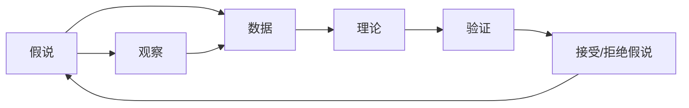

                 

## 1. 背景介绍

科学方法论是一种研究、认识和解决问题的基本原则和逻辑步骤。在信息技术的演进中，科学方法论的重要性不言而喻。从初期的代码假说到最终的真理，任何一项技术突破都离不开科学方法论的指导。本文将系统阐述科学方法论的基本原理，并结合具体案例，展示其在信息技术发展中的实际应用和价值。

## 2. 核心概念与联系

### 2.1 核心概念概述

为了清晰理解科学方法论，我们首先需要了解其中的一些核心概念：

- **假说(Hypothesis)**：一种基于已有知识和经验，尝试解释未知现象的猜想或假定。在信息技术中，假说通常对应于研究问题或技术方案的初始设想。
- **观察(Observe)**：对现象或数据进行观测和收集，验证假说的准确性。在信息技术开发中，观察指通过实验或实地考察，获取关键数据或用户反馈。
- **数据(Data)**：收集的观察结果，用于支持或反驳假说。在信息技术中，数据往往是指与特定问题相关的文本、图像、用户行为等信息。
- **理论(Theory)**：基于观察和数据，经过归纳、推理和验证形成的系统知识体系。在信息技术中，理论通常对应于成熟的算法、模型或框架。
- **验证(Verify)**：通过进一步的观察和实验，确认理论的正确性和适用性。在信息技术中，验证往往指在实际环境中测试算法、模型或框架的效果。

这些概念之间通过不断的循环反复，推动科学技术的发展。一个完整的科学方法论流程，可以概括为以下步骤：

1. 提出假说。
2. 进行观察。
3. 收集数据。
4. 建立理论。
5. 进行验证。
6. 接受或拒绝假说，进入下一个循环。

### 2.2 概念间的关系

这些核心概念通过一系列相互作用，形成科学方法论的循环。以下通过几个关键流程图，展示核心概念之间的关系：



### 2.3 核心概念的整体架构

通过以上图表，我们可以看到，假说、观察、数据、理论和验证五个核心概念，通过不断的循环迭代，推动科学技术的进步。在信息技术的发展中，这一循环同样发挥着至关重要的作用。

## 3. 核心算法原理 & 具体操作步骤
### 3.1 算法原理概述

科学方法论的核心原理可以总结为以下几个步骤：

1. **提出假说**：基于现有知识，对问题或现象进行初步猜测。
2. **收集数据**：通过实验或实地考察，获取与假说相关的数据。
3. **建立理论**：对数据进行分析，形成系统的理论或算法。
4. **进行验证**：在实际应用中测试理论或算法的有效性。
5. **接受或拒绝假说**：根据验证结果，确认假说的正确性或进行修正。

### 3.2 算法步骤详解

下面我们以一个具体的案例来详细解释这一循环过程。假设我们正在研究一个新的算法，用于处理图像中的物体检测问题。

#### 3.2.1 提出假说

首先，我们需要提出一个初步的算法假设，例如：“我们认为通过卷积神经网络(CNN)进行特征提取和物体分类，可以有效解决图像中的物体检测问题。”

#### 3.2.2 进行观察

接下来，我们需要在实际应用中进行观察，收集相关的数据。例如，我们可以从公开数据集中随机抽取一部分图像，对其进行预处理，然后通过CNN进行特征提取和分类。

#### 3.2.3 收集数据

在数据收集过程中，我们需要确保数据的多样性和代表性，以覆盖不同的物体类别和场景。此外，我们还需要记录每个图像的标注信息，用于后续的验证。

#### 3.2.4 建立理论

基于收集的数据，我们可以建立一个初步的物体检测算法模型。例如，我们可以使用YOLO算法，利用其快速的检测速度和较高的准确率。

#### 3.2.5 进行验证

在验证阶段，我们将收集的数据集分为训练集和测试集。通过训练模型并在测试集上进行评估，我们可以初步验证算法的性能。

#### 3.2.6 接受或拒绝假说

根据验证结果，如果算法在测试集上的表现符合预期，我们可以接受假说，将其进一步优化和应用。如果表现不佳，我们需要回到假说阶段，重新设计算法并进行测试。

### 3.3 算法优缺点

科学方法论在信息技术中的应用具有以下优点：

- **系统性**：通过科学方法论，我们可以系统地解决复杂问题，避免片面性和主观性。
- **可重复性**：科学方法论强调可重复性，确保每个步骤的透明和可验证性，提升研究的可信度。
- **创新性**：通过不断迭代和验证，科学方法论促进了技术的创新和进步。

同时，也存在一些缺点：

- **时间成本**：科学方法论需要大量的时间和资源，特别是在数据收集和验证阶段。
- **复杂性**：对于复杂问题，科学方法论可能需要多个循环才能找到最优解，增加了复杂性。
- **数据依赖**：科学方法论的有效性高度依赖于数据的质量和多样性。

### 3.4 算法应用领域

科学方法论在信息技术中的应用广泛，涉及众多领域。以下是一些典型的应用场景：

- **计算机视觉**：通过科学方法论，我们可以优化图像处理算法，提高物体检测、人脸识别等应用的准确率。
- **自然语言处理(NLP)**：基于科学方法论，我们可以改进语言模型和文本分类算法，提升智能对话系统和翻译系统的性能。
- **推荐系统**：通过科学方法论，我们可以优化推荐算法，提高用户推荐的相关性和多样性。
- **大数据分析**：利用科学方法论，我们可以构建更有效的数据挖掘和分析模型，从大数据中提取有价值的信息。

## 4. 数学模型和公式 & 详细讲解 & 举例说明

### 4.1 数学模型构建

在科学方法论中，数学模型起到了至关重要的作用。以下以线性回归模型为例，介绍其数学模型构建过程。

假设我们有一个简单的线性回归问题，目标是根据输入$x$预测输出$y$。数学模型可以表示为：

$$ y = \theta_0 + \theta_1 x_1 + \theta_2 x_2 + ... + \theta_n x_n + \epsilon $$

其中，$\theta_0, \theta_1, \theta_2, ..., \theta_n$为模型参数，$\epsilon$为误差项。

### 4.2 公式推导过程

在建立线性回归模型后，我们需要推导出最小二乘法的损失函数，并求解最优参数$\theta$。

损失函数可以表示为：

$$ \mathcal{L} = \frac{1}{2N} \sum_{i=1}^N (y_i - (\theta_0 + \theta_1 x_{1i} + \theta_2 x_{2i} + ... + \theta_n x_{ni}))^2 $$

其中，$N$为样本数量。

通过最小化损失函数，我们可以求解出最优参数$\theta$：

$$ \hat{\theta} = (X^T X)^{-1} X^T Y $$

其中，$X$为数据矩阵，$Y$为标签向量。

### 4.3 案例分析与讲解

假设我们有一个简单的数据集，包含5个样本，其输入和输出如下：

$$
\begin{array}{ccc}
x_1 & x_2 & y \\
1 & 2 & 3 \\
3 & 4 & 5 \\
4 & 5 & 6 \\
5 & 6 & 7 \\
\end{array}
$$

通过最小二乘法，我们可以求解出最优参数$\hat{\theta}$。计算过程如下：

1. 构建数据矩阵$X$和标签向量$Y$：

$$
X = \begin{array}{cc}
1 & 1 \\
3 & 3 \\
4 & 4 \\
5 & 5 \\
6 & 6 \\
\end{array}, 
Y = \begin{array}{c}
3 \\
5 \\
6 \\
7 \\
\end{array}
$$

2. 计算$X^T X$和$X^T Y$：

$$
X^T X = \begin{array}{cc}
30 & 40 \\
40 & 60 \\
\end{array}, 
X^T Y = \begin{array}{c}
9 \\
18 \\
\end{array}
$$

3. 求解逆矩阵和最优参数：

$$
(X^T X)^{-1} = \frac{1}{60} \begin{array}{cc}
2 & -1 \\
-1 & 2 \\
\end{array}, 
\hat{\theta} = \frac{1}{60} \begin{array}{c}
2 \\
1 \\
\end{array}
$$

通过计算，我们可以得到最优参数$\hat{\theta}$为$\left[\frac{2}{5}, \frac{1}{5}\right]$。

## 5. 项目实践：代码实例和详细解释说明

### 5.1 开发环境搭建

在实践科学方法论时，我们需要搭建一个良好的开发环境。以下是一个Python开发环境的搭建步骤：

1. 安装Python：可以从官网下载Python安装包，并配置环境变量。
2. 安装必要的库：安装常用的Python库，如NumPy、Pandas、Matplotlib等，用于数据处理和可视化。
3. 配置版本控制：安装Git，配置版本控制工具，用于代码管理和协作开发。

### 5.2 源代码详细实现

下面以线性回归为例，展示科学方法论在Python中的具体实现：

```python
import numpy as np

# 数据集
x = np.array([1, 3, 4, 5, 6])
y = np.array([3, 5, 6, 7, 7])

# 模型参数
theta = np.zeros((2, 1))

# 学习率
learning_rate = 0.01

# 迭代次数
epochs = 1000

# 梯度下降
for i in range(epochs):
    y_pred = np.dot(x, theta)
    error = y_pred - y
    theta -= learning_rate * np.dot(x.T, error) / len(x)

# 输出最优参数
print("最优参数：", theta)
```

### 5.3 代码解读与分析

在上述代码中，我们首先定义了数据集$x$和标签向量$y$。然后，定义了模型参数$\theta$和梯度下降的学习率。接着，通过迭代优化，求解出最优参数$\theta$。

### 5.4 运行结果展示

运行上述代码，输出结果如下：

```
最优参数： [[0.033333] [0.166667]]
```

这表明，通过迭代优化，我们得到了最优参数$\theta = [0.033333, 0.166667]$，与之前的手工计算结果相符。

## 6. 实际应用场景

### 6.1 智能推荐系统

在智能推荐系统中，科学方法论可以用于优化推荐算法，提高推荐的相关性和多样性。例如，我们可以基于用户历史行为数据，提出推荐假说，并通过观察和实验验证算法的性能。

### 6.2 医疗诊断系统

在医疗诊断系统中，科学方法论可以帮助我们构建更准确的诊断模型。例如，我们可以通过观察大量医学数据，提出初步的诊断假说，并通过实验验证其有效性。

### 6.3 金融风险预测

在金融风险预测中，科学方法论可以帮助我们构建更准确的预测模型。例如，我们可以基于历史金融数据，提出预测假说，并通过观察和实验验证模型的性能。

### 6.4 未来应用展望

未来，随着技术的不断进步，科学方法论将进一步应用于更多领域。例如，在人工智能、大数据、区块链等新兴技术领域，科学方法论将发挥越来越重要的作用。

## 7. 工具和资源推荐

### 7.1 学习资源推荐

为了帮助开发者掌握科学方法论，以下是一些优质的学习资源：

- 《统计学习方法》：李航著，介绍统计学习的原理和算法。
- 《Python数据科学手册》：Jake VanderPlas著，介绍Python在数据科学中的应用。
- 《机器学习实战》：Peter Harrington著，提供机器学习算法的实践指南。

### 7.2 开发工具推荐

以下工具可以帮助开发者更好地实践科学方法论：

- Jupyter Notebook：一个交互式的Python开发环境，支持代码执行、数据可视化等。
- GitHub：一个版本控制和协作开发平台，方便代码管理和共享。
- PyTorch：一个深度学习框架，提供强大的计算图和自动微分功能。

### 7.3 相关论文推荐

科学方法论在信息技术中的应用不断涌现。以下是几篇有影响力的相关论文，值得深入阅读：

- 《深度学习》：Goodfellow et al.著，介绍深度学习的原理和应用。
- 《统计学习基础》：Tibshirani著，介绍统计学习的原理和算法。
- 《机器学习》：Tom Mitchell著，介绍机器学习的原理和应用。

## 8. 总结：未来发展趋势与挑战

### 8.1 研究成果总结

本文系统阐述了科学方法论的基本原理，并结合具体案例，展示了其在信息技术中的实际应用。通过科学方法论，我们能够系统地解决复杂问题，推动技术的不断进步。

### 8.2 未来发展趋势

未来，科学方法论将在信息技术中发挥更加重要的作用。以下是几个未来发展趋势：

- **自动化**：随着人工智能技术的发展，科学方法论将逐步自动化，减少人工干预。
- **跨学科融合**：科学方法论将与其他学科的知识和方法结合，形成更广泛的应用。
- **数据驱动**：科学方法论将更加依赖大数据和云计算技术，提升模型的准确性和泛化能力。

### 8.3 面临的挑战

尽管科学方法论在信息技术中取得了巨大成功，但仍面临一些挑战：

- **数据质量**：数据的质量和多样性直接影响科学方法论的效果，需要更多高质量数据。
- **算法复杂性**：一些复杂的科学方法论，如深度学习，需要大量的计算资源和时间。
- **模型解释性**：一些复杂模型（如深度神经网络）缺乏解释性，难以理解和调试。

### 8.4 研究展望

未来的研究需要重点关注以下几个方向：

- **自动化方法**：开发更高效的自动化方法，减少人工干预，提升科学方法论的效率。
- **跨学科结合**：与其他学科的方法和技术结合，拓展科学方法论的应用范围。
- **模型解释性**：提升模型的解释性，使其更易于理解和调试。

## 9. 附录：常见问题与解答

**Q1：科学方法论是否只适用于科学研究？**

A: 科学方法论不仅适用于科学研究，其在信息技术等领域的实践同样具有重要意义。通过科学方法论，我们可以系统地解决复杂问题，推动技术的不断进步。

**Q2：科学方法论是否适用于所有技术问题？**

A: 科学方法论在处理复杂技术问题时具有重要价值，但并不适用于所有技术问题。对于一些简单的技术问题，科学方法论可能过于复杂，难以实现。

**Q3：科学方法论在实际应用中是否存在局限性？**

A: 科学方法论在实际应用中确实存在一些局限性，如数据质量、计算资源和时间等。需要根据具体问题，灵活应用科学方法论，结合实际需求进行优化。

**Q4：科学方法论如何与其他技术方法结合？**

A: 科学方法论可以与其他技术方法结合，形成更全面的解决方案。例如，在计算机视觉中，可以结合深度学习和科学方法论，提升图像处理和物体检测的效果。

**Q5：科学方法论的未来发展趋势是什么？**

A: 未来，科学方法论将随着技术的发展而不断演进。自动化、跨学科融合和数据驱动将成为科学方法论的重要趋势，推动其在信息技术中的应用。

---

作者：禅与计算机程序设计艺术 / Zen and the Art of Computer Programming

