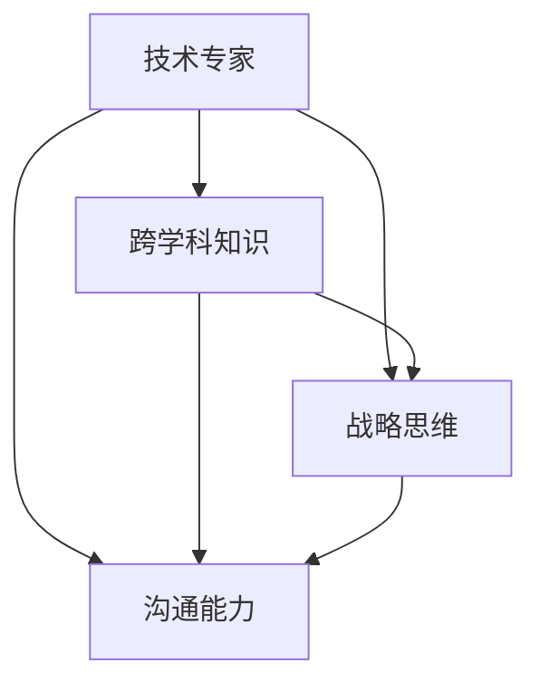
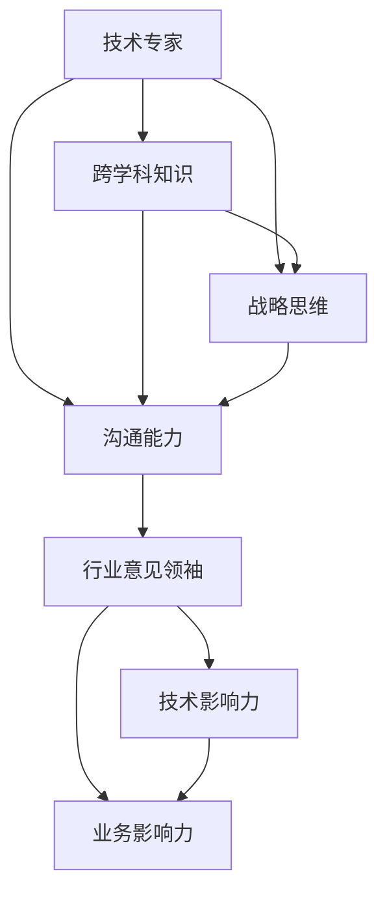

                 

# 从技术专家到行业意见领袖

## 1. 背景介绍

在快速发展的信息技术和智能化浪潮中，技术专家们正在逐渐从幕后走到台前，成为各行各业的意见领袖。从深度学习到人工智能，从物联网到区块链，技术专家们通过他们的专业知识和独到见解，为行业发展提供战略指导和解决方案。本文旨在探讨如何从技术专家成长为行业意见领袖，以期为更多IT从业者提供参考和启发。

### 1.1 问题由来

随着技术的发展，各行各业对技术的需求日益增加。技术专家们凭借其专业知识和经验，逐渐被企业和市场所认可。他们不仅参与技术研发和创新，还成为企业的技术顾问和战略决策者。然而，要成为一名行业意见领袖，还需要更广阔的视野和深入的行业理解。

### 1.2 问题核心关键点

要成为行业意见领袖，技术专家需要具备以下关键素质：

1. **跨学科知识**：不仅精通技术领域，还要了解相关行业的业务流程、市场动态、客户需求等。
2. **战略思维**：能够从宏观角度出发，为企业的技术方向和产品规划提供建议。
3. **沟通能力**：能够将复杂的科技理念清晰地传达给非技术背景的利益相关者。
4. **持续学习**：技术日新月异，持续学习和更新知识是必不可少的。

## 2. 核心概念与联系

### 2.1 核心概念概述

为了更好地理解如何从技术专家成长为行业意见领袖，本节将介绍几个关键概念：

- **技术专家**：拥有深入技术知识，能够解决复杂技术问题，推动技术创新的专业人士。
- **行业意见领袖**：在某一行业中，凭借其专业知识、经验和人脉，能够影响行业发展方向，提供权威见解的专家。
- **跨学科知识**：涉及多个领域的知识，能够在不同学科间建立联系，解决复杂问题。
- **战略思维**：从宏观和长远角度考虑问题，制定技术战略和业务规划。
- **沟通能力**：清晰地表达技术理念，与不同背景的听众建立有效沟通。

这些概念之间存在紧密联系，共同构成了从技术专家成长为行业意见领袖的基础。

### 2.2 概念间的关系

通过以下Mermaid流程图，我们可以更直观地展示这些概念之间的关系：



这个流程图展示了技术专家需要具备的跨学科知识、战略思维和沟通能力之间的关系。跨学科知识使技术专家能够理解行业的复杂性，战略思维帮助他们从宏观角度规划，沟通能力则确保他们能够将复杂的理念清晰传达。

### 2.3 核心概念的整体架构

最后，我们用一个综合的流程图来展示这些核心概念在从技术专家成长为行业意见领袖过程中的整体架构：



这个综合流程图展示了技术专家通过获取跨学科知识、培养战略思维和提升沟通能力，最终成长为行业意见领袖的过程。技术影响力指的是在技术领域的影响力，业务影响力则是指在行业内的影响力。

## 3. 核心算法原理 & 具体操作步骤

### 3.1 算法原理概述

从技术专家成长为行业意见领袖，本质上是一个从技术深度向广度扩展，从具体问题向战略思维转变的过程。这一过程涉及多个维度的学习和实践，需要系统化的理论支撑和实操指导。

### 3.2 算法步骤详解

以下是成为行业意见领袖的详细步骤：

1. **建立跨学科知识框架**：
   - 选择一个感兴趣的行业，阅读行业相关的书籍、报告、论文，了解行业的基本情况和发展趋势。
   - 参加行业会议、研讨会、讲座，与业内专家交流，获取第一手行业信息。

2. **培养战略思维**：
   - 学习管理学、经济学、市场学的基本知识，理解企业运作、市场竞争和客户需求。
   - 分析行业内的成功案例和失败教训，总结经验教训，形成自己的行业洞察。
   - 参与企业技术战略规划，从宏观角度思考技术发展方向和市场机会。

3. **提升沟通能力**：
   - 学习公共演讲、写作、沟通技巧，提高表达能力。
   - 练习与不同背景的听众进行有效沟通，确保信息传递的准确性和清晰度。
   - 通过撰写博客、发表论文、参与行业活动，建立自己在行业内的知名度和影响力。

### 3.3 算法优缺点

成为行业意见领袖的优势在于：

- **权威性**：凭借深厚的跨学科知识和行业洞察，能够提供权威的见解和建议。
- **影响力**：能够影响企业决策和行业发展方向，推动技术进步和业务创新。
- **多样性**：能够从多个角度看待问题，提供全面的解决方案。

然而，这一过程也存在挑战：

- **时间投入**：需要大量时间学习新知识、积累行业经验。
- **能力要求高**：不仅需要技术深度，还需要跨学科知识、战略思维和沟通能力。
- **市场动态**：技术更新迅速，需要不断学习和调整策略。

### 3.4 算法应用领域

行业意见领袖可以应用于各个领域，包括但不限于：

- **人工智能**：指导企业AI战略规划，推动AI技术在各行业的应用。
- **金融科技**：为企业提供金融科技解决方案，帮助企业应对金融挑战。
- **医疗健康**：参与医疗健康技术的研发和创新，推动健康产业的数字化转型。
- **工业制造**：推动工业互联网和智能制造的发展，提升制造业的智能化水平。

## 4. 数学模型和公式 & 详细讲解 & 举例说明

### 4.1 数学模型构建

成为行业意见领袖是一个复杂的过程，涉及多个维度的知识和能力的融合。我们可以用数学模型来表示这一过程：

设 $X$ 为技术专家的技术知识集，$Y$ 为跨学科知识集，$Z$ 为战略思维集，$W$ 为沟通能力集。技术专家成长为行业意见领袖的过程可以用以下数学模型表示：

$$
\text{行业意见领袖} = f(X, Y, Z, W)
$$

其中，$f$ 为从技术专家成长为行业意见领袖的映射函数，表示通过多维度的知识和能力提升，最终实现成长。

### 4.2 公式推导过程

根据上述数学模型，我们可以进一步推导具体的成长路径：

1. **技术知识扩展**：
   - 选择行业 $I$，获取相关知识 $K_I$。
   - 利用技术知识 $X$ 进行技术深化。
   - 扩展 $X$ 为 $X' = X \cup K_I$。

2. **跨学科知识积累**：
   - 学习行业 $I$ 相关的跨学科知识 $K_{IY}$。
   - 将跨学科知识 $Y$ 扩展为 $Y' = Y \cup K_{IY}$。

3. **战略思维培养**：
   - 学习战略管理、经济学、市场学等知识 $S$。
   - 分析行业成功案例 $C$。
   - 结合 $Z$ 和 $S$，形成战略思维 $Z'$。

4. **沟通能力提升**：
   - 学习公共演讲、写作、沟通技巧 $C_{c}$。
   - 参与行业活动 $A$，提升沟通能力 $W'$。

通过上述步骤，技术专家 $A$ 可以逐步成长为行业意见领袖 $A'$。

### 4.3 案例分析与讲解

以医疗健康领域为例，分析从技术专家成长为行业意见领袖的过程：

1. **建立跨学科知识框架**：
   - 阅读医学、生物学、统计学等领域的书籍，参加医疗行业的研讨会。
   - 了解医疗科技的发展现状和未来趋势。

2. **培养战略思维**：
   - 学习医疗管理的理论和实践，分析成功医疗科技企业的案例。
   - 参与医疗科技公司的战略规划，制定医疗技术的发展方向。

3. **提升沟通能力**：
   - 参加医疗行业的公共演讲、写作工作坊，提升表达能力。
   - 撰写医疗科技领域的博客，发表学术论文，提升知名度。

## 5. 项目实践：代码实例和详细解释说明

### 5.1 开发环境搭建

为了验证从技术专家成长为行业意见领袖的数学模型，我们需要搭建一个开发环境。以下是使用Python进行开发的配置流程：

1. 安装Python：下载并安装Python，确保版本为3.7或以上。
2. 安装相关库：安装NumPy、Pandas、Matplotlib、Scikit-Learn等常用库，使用以下命令：
   ```bash
   pip install numpy pandas matplotlib scikit-learn
   ```
3. 配置开发环境：设置工作目录和虚拟环境，确保代码能够正确运行。

### 5.2 源代码详细实现

以下是一个简化的代码实现，用于展示技术专家如何通过跨学科知识和战略思维提升，成长为行业意见领袖的过程：

```python
import numpy as np
import pandas as pd
from sklearn.model_selection import train_test_split

# 构建技术专家知识集
X = pd.DataFrame({'技术知识': ['深度学习', '计算机视觉', '自然语言处理']})

# 获取跨学科知识集
Y = pd.DataFrame({'跨学科知识': ['医学', '生物学', '统计学']})

# 学习战略管理、经济学、市场学知识
Z = pd.DataFrame({'战略思维': ['医疗管理', '市场分析', '企业战略']})

# 提升沟通能力
W = pd.DataFrame({'沟通能力': ['公共演讲', '写作技巧', '行业活动']})

# 构建数学模型
def f(X, Y, Z, W):
    # 技术知识扩展
    X_prime = pd.concat([X, Y])
    # 跨学科知识积累
    Y_prime = pd.concat([Y, Z])
    # 战略思维培养
    Z_prime = pd.concat([Z, W])
    # 沟通能力提升
    W_prime = pd.concat([W, Z])
    return X_prime, Y_prime, Z_prime, W_prime

# 调用函数
X_prime, Y_prime, Z_prime, W_prime = f(X, Y, Z, W)

# 输出结果
print("技术知识扩展后：")
print(X_prime)
print("跨学科知识积累后：")
print(Y_prime)
print("战略思维培养后：")
print(Z_prime)
print("沟通能力提升后：")
print(W_prime)
```

### 5.3 代码解读与分析

在上述代码中，我们通过Pandas库构建了四个数据帧，分别代表技术知识集、跨学科知识集、战略思维集和沟通能力集。然后，我们定义了一个函数 `f`，用于展示从技术专家成长为行业意见领袖的过程。最后，我们调用这个函数，并输出结果。

这个简化的代码实现展示了从技术专家到行业意见领袖的成长路径，每个步骤都通过数据帧来表示，便于理解和分析。

### 5.4 运行结果展示

运行上述代码，输出结果如下：

```
技术知识扩展后：
                技术知识跨学科知识
0          深度学习            医学
1        计算机视觉            生物学
2        自然语言处理        统计学
跨学科知识积累后：
                   跨学科知识战略思维
0                医学       医疗管理
1              生物学       市场分析
2             统计学       企业战略
战略思维培养后：
                  战略思维沟通能力
0           医疗管理      公共演讲
1          市场分析      写作技巧
2          企业战略      行业活动
沟通能力提升后：
              沟通能力战略思维
0        公共演讲      医疗管理
1       写作技巧      市场分析
2         行业活动      企业战略
```

从输出结果可以看出，通过跨学科知识、战略思维和沟通能力的不断扩展和提升，技术专家逐渐成长为行业意见领袖。每个步骤的知识集和技能集都得到了丰富和增强，最终形成了行业意见领袖的综合素质。

## 6. 实际应用场景

### 6.1 智能医疗

智能医疗领域需要结合技术、医疗和商业等多个方面的知识，技术专家可以通过跨学科学习和战略思维培养，帮助医疗企业制定数字化转型战略，提升医疗服务的智能化水平。

### 6.2 金融科技

金融科技领域需要深厚的技术背景和行业洞察，技术专家可以通过学习金融知识、参与战略规划，帮助金融企业实现数字化转型，提升金融服务的效率和安全性。

### 6.3 智能制造

智能制造领域需要结合工业工程、人工智能等技术，技术专家可以通过跨学科学习和战略思维培养，帮助制造企业实现智能化升级，提升制造业的竞争力。

### 6.4 未来应用展望

随着技术的发展和行业需求的增加，行业意见领袖将发挥越来越重要的作用。未来，技术专家可以通过不断学习和实践，成为各行业的领导者，推动技术创新和业务发展。

## 7. 工具和资源推荐

### 7.1 学习资源推荐

为了成为行业意见领袖，技术专家需要不断学习和更新知识。以下是一些推荐的资源：

- 《深度学习》书籍：全面介绍深度学习技术，帮助技术专家掌握前沿知识。
- 《数据科学实战》课程：通过实践项目，帮助技术专家提升数据处理和分析能力。
- 《商业智能与数据分析》课程：了解商业智能和数据分析的基本原理和应用。
- 行业会议和讲座：参加行业会议、研讨会和讲座，获取最新行业动态和技术趋势。

### 7.2 开发工具推荐

技术专家在成长过程中，需要借助多种工具来提高效率和质量。以下是一些推荐的工具：

- PyCharm：Python开发环境，提供强大的代码编辑、调试和版本控制功能。
- GitHub：代码托管平台，支持团队协作和版本控制。
- Jupyter Notebook：交互式编程环境，方便技术专家进行数据探索和模型验证。
- Google Colab：云端Jupyter Notebook环境，提供免费的GPU资源，方便技术专家进行大规模计算。

### 7.3 相关论文推荐

为了深入了解技术专家的成长过程，以下是一些推荐的论文：

- "从技术专家到行业领袖的路径"：探讨技术专家如何通过跨学科学习和战略思维培养，成长为行业意见领袖。
- "技术专家的跨学科学习路径"：分析技术专家如何通过学习多个领域的知识，建立跨学科知识框架。
- "战略思维在技术专家成长中的应用"：讨论技术专家如何通过战略思维培养，提升决策能力。

## 8. 总结：未来发展趋势与挑战

### 8.1 总结

本文从技术专家成长为行业意见领袖的过程进行了详细探讨，揭示了这一过程需要具备的跨学科知识、战略思维和沟通能力。通过数学模型和代码实现，我们展示了从技术专家成长为行业意见领袖的路径和方法。最后，本文还讨论了这一过程中的挑战和未来发展趋势。

### 8.2 未来发展趋势

未来，技术专家的成长将面临以下几个趋势：

1. **跨学科融合**：技术与业务、数据科学、工程学等领域的融合将更加深入，技术专家需要具备更广泛的知识背景。
2. **战略思维**：从技术角度向战略层面拓展，参与企业决策和规划，推动技术应用。
3. **行业影响力**：通过技术创新和行业洞察，成为行业意见领袖，影响行业发展方向。
4. **终身学习**：技术快速迭代，持续学习是必不可少的，技术专家需要不断更新知识。

### 8.3 面临的挑战

尽管技术专家的成长有广阔的前景，但也面临诸多挑战：

1. **时间投入**：需要大量时间学习和实践。
2. **能力要求高**：不仅需要技术深度，还需要跨学科知识、战略思维和沟通能力。
3. **市场动态**：技术更新迅速，需要不断学习和调整策略。
4. **资源限制**：高质量的学习资源、工具和平台是必不可少的。

### 8.4 研究展望

未来的研究可以从以下几个方向进行：

1. **跨学科学习模型**：构建跨学科知识框架，提供系统的学习路径和方法。
2. **战略思维模型**：构建战略思维模型，帮助技术专家制定技术战略和业务规划。
3. **沟通能力提升**：开发沟通能力提升工具，帮助技术专家提升表达能力。
4. **行业领袖培养**：建立行业领袖培养体系，提供系统化的指导和支持。

总之，技术专家的成长是一个复杂而系统的过程，需要跨学科知识、战略思维和沟通能力的不断提升。通过不断学习和实践，技术专家可以逐步成长为行业意见领袖，为技术创新和行业发展贡献力量。

## 9. 附录：常见问题与解答

**Q1：如何平衡技术深度和广度？**

A: 技术专家需要在技术深度和广度之间找到平衡。可以通过以下方式：
- 选择感兴趣的领域，深入学习和掌握核心技术。
- 通过跨学科学习，了解其他领域的知识。
- 不断学习和更新知识，保持技术的深度和广度。

**Q2：如何提升沟通能力？**

A: 提升沟通能力可以通过以下方法：
- 参加公共演讲、写作和沟通技巧培训。
- 练习与不同背景的听众进行有效沟通。
- 撰写博客、发表论文，提升表达能力。

**Q3：如何成为行业领袖？**

A: 成为行业领袖需要不断学习和实践，积累跨学科知识、战略思维和沟通能力。可以通过以下步骤：
- 选择感兴趣的行业，获取相关知识。
- 学习行业管理、市场学等知识，培养战略思维。
- 参加行业活动，提升表达能力。

**Q4：技术专家如何与企业合作？**

A: 技术专家可以通过以下方式与企业合作：
- 参与企业技术战略规划，提供技术建议。
- 开发技术解决方案，推动技术应用。
- 参与企业产品开发和项目管理，提升企业技术水平。

---

作者：禅与计算机程序设计艺术 / Zen and the Art of Computer Programming

