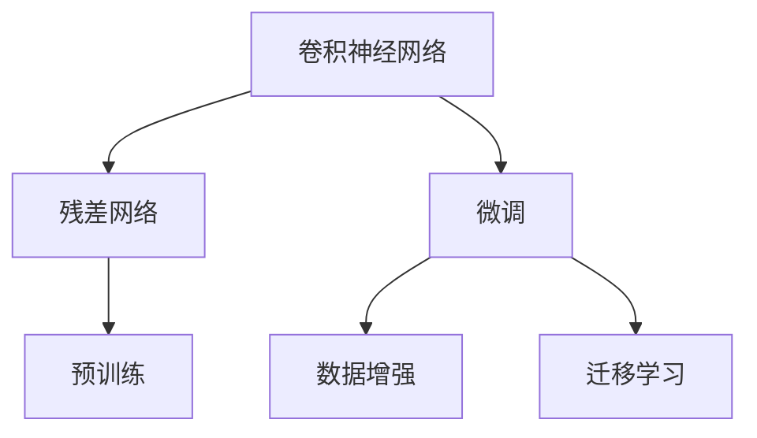
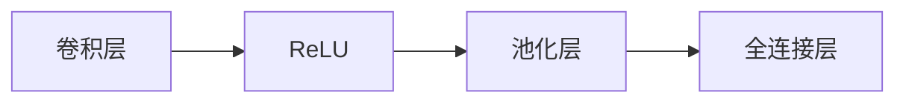
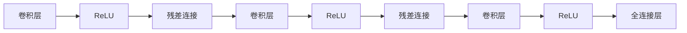
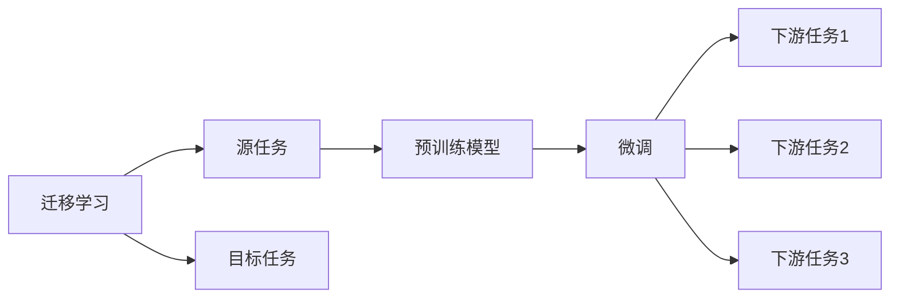
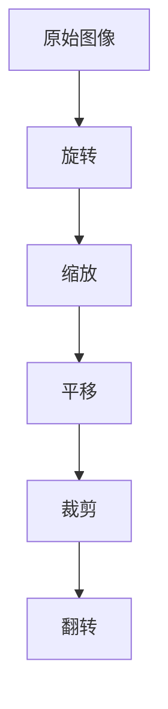
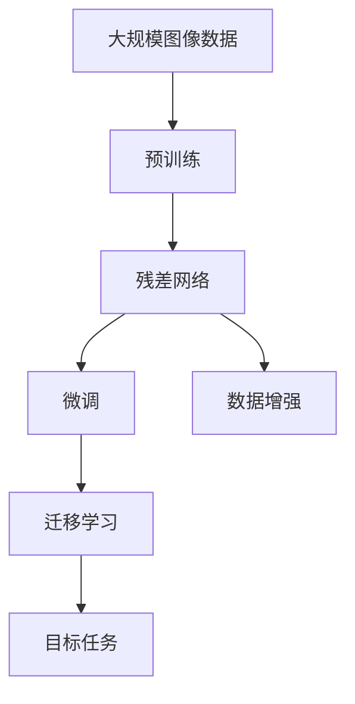

                 

# 从零开始大模型开发与微调：ResNet实战：CIFAR-10数据集分类

> 关键词：深度学习,卷积神经网络,ResNet,卷积神经网络,微调,Fine-Tuning,数据增强,迁移学习,计算机视觉,CIFAR-10数据集

## 1. 背景介绍

### 1.1 问题由来

随着深度学习技术的快速发展，卷积神经网络（Convolutional Neural Network, CNN）在计算机视觉领域取得了巨大的突破。传统的CNN模型结构简单，能够有效地提取图像中的特征，但在训练大模型时面临了过拟合和计算成本高的问题。因此，研究者提出了残差网络（ResNet），通过引入残差块来解决梯度消失问题，显著提高了模型的深度和准确率。ResNet通过在标准卷积层前后增加残差连接，使得信息可以更流畅地传递，从而提升模型的泛化能力。

CIFAR-10数据集是一个常用的图像分类数据集，包含10个不同类别的60000张32x32像素的彩色图像。它被广泛应用于计算机视觉模型的训练和测试。通过在CIFAR-10数据集上进行ResNet模型的微调，可以验证模型的性能，并在实际应用中进一步提升其效果。

### 1.2 问题核心关键点

基于ResNet的微调过程主要涉及以下几个关键点：

- 选择合适的预训练模型ResNet。ResNet有多种变体，如ResNet18、ResNet50、ResNet101等。根据任务需求选择合适的预训练模型，或自建ResNet模型。
- 准备数据集CIFAR-10。数据集需要预处理，包括图像标准化、数据增强等。
- 设置微调超参数。选择合适的学习率、批大小、迭代轮数等。
- 应用微调技术。通过有监督地训练优化模型在特定任务上的性能。
- 评估和部署模型。在测试集上评估模型性能，部署到实际应用中。

### 1.3 问题研究意义

ResNet微调在计算机视觉领域具有重要意义：

- 提高模型性能。微调可以显著提升模型在特定任务上的表现，尤其是在小样本情况下。
- 降低开发成本。微调使得开发者可以快速适配新任务，减少从头开发所需的数据、计算和人力成本。
- 加速开发进度。利用预训练的模型，开发者可以更快地完成任务适配，缩短开发周期。
- 促进技术创新。微调范式促进了对ResNet的深入研究，催生了残差块、注意力机制等新研究方向。
- 赋能产业升级。微调技术使得计算机视觉技术更容易被各行各业所采用，为传统行业数字化转型升级提供新的技术路径。

## 2. 核心概念与联系

### 2.1 核心概念概述

为更好地理解基于ResNet的微调方法，本节将介绍几个密切相关的核心概念：

- 卷积神经网络（CNN）：一种广泛用于图像识别和分类的深度神经网络，由多个卷积层、池化层和全连接层组成。
- 残差网络（ResNet）：一种特殊设计的卷积神经网络，通过引入残差块解决深度模型中的梯度消失问题，使得模型可以更深。
- 微调（Fine-Tuning）：在预训练模型的基础上，使用下游任务的少量标注数据，通过有监督地训练优化模型在特定任务上的性能。
- 数据增强（Data Augmentation）：通过对训练样本进行随机变换，如旋转、缩放、平移等，扩充训练集的多样性，减少过拟合。
- 迁移学习（Transfer Learning）：将一个领域学习到的知识，迁移应用到另一个不同但相关的领域的学习范式。ResNet的预训练-微调过程即是一种典型的迁移学习方式。

这些核心概念之间的逻辑关系可以通过以下Mermaid流程图来展示：



这个流程图展示了大模型微调的完整过程，从预训练到微调，再到数据增强和迁移学习。通过这些技术，可以构建出具有高性能和泛化能力的计算机视觉模型。

### 2.2 概念间的关系

这些核心概念之间存在着紧密的联系，形成了大模型微调的完整生态系统。下面我们通过几个Mermaid流程图来展示这些概念之间的关系。

#### 2.2.1 卷积神经网络的基本结构



这个流程图展示了卷积神经网络的基本结构，包括卷积层、ReLU激活函数、池化层和全连接层。

#### 2.2.2 残差网络的基本结构



这个流程图展示了ResNet的基本结构，包括卷积层、ReLU激活函数、残差连接和全连接层。

#### 2.2.3 微调和迁移学习的关系



这个流程图展示了迁移学习的基本原理，以及它与微调的关系。迁移学习涉及源任务和目标任务，预训练模型在源任务上学习，然后通过微调适应各种下游任务（目标任务）。

#### 2.2.4 数据增强的方法



这个流程图展示了数据增强的基本方法，包括旋转、缩放、平移、裁剪和翻转等。

### 2.3 核心概念的整体架构

最后，我们用一个综合的流程图来展示这些核心概念在大模型微调过程中的整体架构：



这个综合流程图展示了从预训练到微调，再到数据增强和迁移学习的完整过程。大模型微调过程从预训练开始，通过微调学习特定的任务知识，应用数据增强提升模型的泛化能力，并通过迁移学习将预训练模型适配到不同的任务场景中。通过这些技术，构建出具有高性能和泛化能力的计算机视觉模型。

## 3. 核心算法原理 & 具体操作步骤
### 3.1 算法原理概述

基于ResNet的微调过程本质上是一个有监督的细粒度迁移学习过程。其核心思想是：将预训练的ResNet模型视作一个强大的"特征提取器"，通过在特定任务的下游数据集上进行有监督的微调，使得模型能够输出特定任务的正确结果。

形式化地，假设预训练的ResNet模型为 $R_{\theta}$，其中 $\theta$ 为预训练得到的模型参数。给定CIFAR-10数据集 $D=\{(x_i,y_i)\}_{i=1}^{60000}, x_i \in \mathbb{R}^{32\times32\times3}, y_i \in [0,9]$，微调的目标是找到新的模型参数 $\hat{\theta}$，使得：

$$
\hat{\theta}=\mathop{\arg\min}_{\theta} \mathcal{L}(R_{\theta},D)
$$

其中 $\mathcal{L}$ 为针对CIFAR-10数据集设计的损失函数，用于衡量模型预测输出与真实标签之间的差异。常见的损失函数包括交叉熵损失、均方误差损失等。

通过梯度下降等优化算法，微调过程不断更新模型参数 $\theta$，最小化损失函数 $\mathcal{L}$，使得模型输出逼近真实标签。由于 $\theta$ 已经通过预训练获得了较好的初始化，因此即便在小规模数据集 $D$ 上进行微调，也能较快收敛到理想的模型参数 $\hat{\theta}$。

### 3.2 算法步骤详解

基于ResNet的微调一般包括以下几个关键步骤：

**Step 1: 准备预训练模型和数据集**
- 选择合适的预训练ResNet模型，如ResNet18、ResNet50等，作为初始化参数。
- 准备CIFAR-10数据集，划分为训练集、验证集和测试集。数据集需要进行预处理，包括图像标准化、数据增强等。

**Step 2: 添加任务适配层**
- 根据任务类型，在预训练模型顶层设计合适的输出层和损失函数。
- 对于分类任务，通常在顶层添加线性分类器和交叉熵损失函数。
- 对于生成任务，通常使用语言模型的解码器输出概率分布，并以负对数似然为损失函数。

**Step 3: 设置微调超参数**
- 选择合适的优化算法及其参数，如 AdamW、SGD 等，设置学习率、批大小、迭代轮数等。
- 设置正则化技术及强度，包括权重衰减、Dropout、Early Stopping 等。
- 确定冻结预训练参数的策略，如仅微调顶层，或全部参数都参与微调。

**Step 4: 执行梯度训练**
- 将训练集数据分批次输入模型，前向传播计算损失函数。
- 反向传播计算参数梯度，根据设定的优化算法和学习率更新模型参数。
- 周期性在验证集上评估模型性能，根据性能指标决定是否触发 Early Stopping。
- 重复上述步骤直到满足预设的迭代轮数或 Early Stopping 条件。

**Step 5: 测试和部署**
- 在测试集上评估微调后模型 $R_{\hat{\theta}}$ 的性能，对比微调前后的精度提升。
- 使用微调后的模型对新样本进行推理预测，集成到实际的应用系统中。
- 持续收集新的数据，定期重新微调模型，以适应数据分布的变化。

以上是基于ResNet的微调范式的一般流程。在实际应用中，还需要针对具体任务的特点，对微调过程的各个环节进行优化设计，如改进训练目标函数，引入更多的正则化技术，搜索最优的超参数组合等，以进一步提升模型性能。

### 3.3 算法优缺点

基于ResNet的微调方法具有以下优点：

- 简单高效。只需准备少量标注数据，即可对预训练模型进行快速适配，获得较大的性能提升。
- 通用适用。适用于各种计算机视觉下游任务，包括分类、匹配、生成等，设计简单的任务适配层即可实现微调。
- 参数高效。利用参数高效微调技术，在固定大部分预训练参数的情况下，仍可取得不错的提升。
- 效果显著。在学术界和工业界的诸多任务上，基于微调的方法已经刷新了多项计算机视觉任务SOTA。

同时，该方法也存在一定的局限性：

- 依赖标注数据。微调的效果很大程度上取决于标注数据的质量和数量，获取高质量标注数据的成本较高。
- 迁移能力有限。当目标任务与预训练数据的分布差异较大时，微调的性能提升有限。
- 负面效果传递。预训练模型的固有偏见、有害信息等，可能通过微调传递到下游任务，造成负面影响。
- 可解释性不足。微调模型的决策过程通常缺乏可解释性，难以对其推理逻辑进行分析和调试。

尽管存在这些局限性，但就目前而言，基于ResNet的微调方法仍是大模型应用的主流范式。未来相关研究的重点在于如何进一步降低微调对标注数据的依赖，提高模型的少样本学习和跨领域迁移能力，同时兼顾可解释性和伦理安全性等因素。

### 3.4 算法应用领域

基于ResNet的微调方法在计算机视觉领域已经得到了广泛的应用，覆盖了几乎所有常见任务，例如：

- 图像分类：如MNIST、CIFAR-10、ImageNet等。通过微调使模型学习图像-标签映射。
- 目标检测：如YOLO、Faster R-CNN等。通过微调使模型学习边界框和类别标签。
- 图像分割：如FCN、U-Net等。通过微调使模型学习像素级别的图像分割。
- 人脸识别：如VGGFace、FaceNet等。通过微调使模型学习人脸特征。
- 图像生成：如GAN、StyleGAN等。通过微调使模型学习生成特定的图像。
- 动作识别：如C3D、I3D等。通过微调使模型学习动作序列的分类。

除了上述这些经典任务外，基于ResNet的微调方法也被创新性地应用到更多场景中，如可控图像生成、图像修复、三维建模等，为计算机视觉技术带来了全新的突破。随着ResNet和微调方法的不断进步，相信计算机视觉技术将在更广阔的应用领域大放异彩。

## 4. 数学模型和公式 & 详细讲解  
### 4.1 数学模型构建

本节将使用数学语言对基于ResNet的微调过程进行更加严格的刻画。

记预训练ResNet模型为 $R_{\theta}$，其中 $\theta$ 为预训练得到的模型参数。假设微调任务的训练集为 $D=\{(x_i,y_i)\}_{i=1}^{60000}, x_i \in \mathbb{R}^{32\times32\times3}, y_i \in [0,9]$。

定义模型 $R_{\theta}$ 在数据样本 $(x,y)$ 上的损失函数为 $\ell(R_{\theta}(x),y)$，则在数据集 $D$ 上的经验风险为：

$$
\mathcal{L}(\theta) = \frac{1}{60000}\sum_{i=1}^{60000} \ell(R_{\theta}(x_i),y_i)
$$

微调的优化目标是最小化经验风险，即找到最优参数：

$$
\theta^* = \mathop{\arg\min}_{\theta} \mathcal{L}(\theta)
$$

在实践中，我们通常使用基于梯度的优化算法（如SGD、Adam等）来近似求解上述最优化问题。设 $\eta$ 为学习率，$\lambda$ 为正则化系数，则参数的更新公式为：

$$
\theta \leftarrow \theta - \eta \nabla_{\theta}\mathcal{L}(\theta) - \eta\lambda\theta
$$

其中 $\nabla_{\theta}\mathcal{L}(\theta)$ 为损失函数对参数 $\theta$ 的梯度，可通过反向传播算法高效计算。

### 4.2 公式推导过程

以下我们以图像分类任务为例，推导交叉熵损失函数及其梯度的计算公式。

假设模型 $R_{\theta}$ 在输入 $x$ 上的输出为 $\hat{y}=R_{\theta}(x)$，表示样本属于各类的概率分布。真实标签 $y \in [0,9]$。则二分类交叉熵损失函数定义为：

$$
\ell(R_{\theta}(x),y) = -y\log \hat{y}_i + (1-y)\log (1-\hat{y}_i)
$$

将其代入经验风险公式，得：

$$
\mathcal{L}(\theta) = -\frac{1}{60000}\sum_{i=1}^{60000} \sum_{j=1}^{10} y_i \log \hat{y}_{ij}
$$

根据链式法则，损失函数对参数 $\theta_k$ 的梯度为：

$$
\frac{\partial \mathcal{L}(\theta)}{\partial \theta_k} = -\frac{1}{60000}\sum_{i=1}^{60000} \sum_{j=1}^{10} y_i \frac{\partial \hat{y}_{ij}}{\partial \theta_k}
$$

其中 $\frac{\partial \hat{y}_{ij}}{\partial \theta_k}$ 可进一步递归展开，利用自动微分技术完成计算。

在得到损失函数的梯度后，即可带入参数更新公式，完成模型的迭代优化。重复上述过程直至收敛，最终得到适应下游任务的最优模型参数 $\theta^*$。

## 5. 项目实践：代码实例和详细解释说明
### 5.1 开发环境搭建

在进行ResNet微调实践前，我们需要准备好开发环境。以下是使用Python进行PyTorch开发的环境配置流程：

1. 安装Anaconda：从官网下载并安装Anaconda，用于创建独立的Python环境。

2. 创建并激活虚拟环境：
```bash
conda create -n resnet-env python=3.8 
conda activate resnet-env
```

3. 安装PyTorch：根据CUDA版本，从官网获取对应的安装命令。例如：
```bash
conda install pytorch torchvision torchaudio cudatoolkit=11.1 -c pytorch -c conda-forge
```

4. 安装transformers库：
```bash
pip install transformers
```

5. 安装各类工具包：
```bash
pip install numpy pandas scikit-learn matplotlib tqdm jupyter notebook ipython
```

完成上述步骤后，即可在`resnet-env`环境中开始微调实践。

### 5.2 源代码详细实现

下面我们以CIFAR-10数据集为例，给出使用Transformers库对ResNet模型进行微调的PyTorch代码实现。

首先，定义ResNet模型和优化器：

```python
from transformers import ResNet, AdamW

model = ResNet(num_classes=10)
optimizer = AdamW(model.parameters(), lr=2e-5)
```

接着，定义训练和评估函数：

```python
from torch.utils.data import DataLoader
from tqdm import tqdm
from sklearn.metrics import classification_report

device = torch.device('cuda') if torch.cuda.is_available() else torch.device('cpu')
model.to(device)

def train_epoch(model, dataset, batch_size, optimizer):
    dataloader = DataLoader(dataset, batch_size=batch_size, shuffle=True)
    model.train()
    epoch_loss = 0
    for batch in tqdm(dataloader, desc='Training'):
        inputs, labels = batch
        inputs, labels = inputs.to(device), labels.to(device)
        model.zero_grad()
        outputs = model(inputs)
        loss = outputs.loss
        epoch_loss += loss.item()
        loss.backward()
        optimizer.step()
    return epoch_loss / len(dataloader)

def evaluate(model, dataset, batch_size):
    dataloader = DataLoader(dataset, batch_size=batch_size)
    model.eval()
    preds, labels = [], []
    with torch.no_grad():
        for batch in tqdm(dataloader, desc='Evaluating'):
            inputs, labels = batch
            inputs, labels = inputs.to(device), labels.to(device)
            batch_preds = model(inputs)
            batch_preds = batch_preds.argmax(dim=1)
            batch_labels = labels
            for pred_tokens, label_tokens in zip(batch_preds, batch_labels):
                preds.append(pred_tokens)
                labels.append(label_tokens)
                
    print(classification_report(labels, preds))
```

最后，启动训练流程并在测试集上评估：

```python
epochs = 5
batch_size = 16

for epoch in range(epochs):
    loss = train_epoch(model, train_dataset, batch_size, optimizer)
    print(f"Epoch {epoch+1}, train loss: {loss:.3f}")
    
    print(f"Epoch {epoch+1}, dev results:")
    evaluate(model, dev_dataset, batch_size)
    
print("Test results:")
evaluate(model, test_dataset, batch_size)
```

以上就是使用PyTorch对ResNet进行CIFAR-10数据集分类的完整代码实现。可以看到，得益于Transformers库的强大封装，我们可以用相对简洁的代码完成ResNet模型的加载和微调。

### 5.3 代码解读与分析

让我们再详细解读一下关键代码的实现细节：

**ResNet类**：
- 定义ResNet模型的层次结构，包括卷积层、残差块、全连接层等。
- 设置模型输出层的维度，为10类CIFAR-10数据集。

**AdamW优化器**：
- 定义优化器，使用AdamW算法优化模型参数。

**train_epoch函数**：
- 定义训练函数，对数据集以批为单位进行迭代，在每个批次上前向传播计算loss并反向传播更新模型参数，最后返回该epoch的平均loss。
- 使用PyTorch的DataLoader对数据集进行批次化加载，供模型训练和推理使用。

**evaluate函数**：
- 定义评估函数，与训练类似，不同点在于不更新模型参数，并在每个batch结束后将预测和标签结果存储下来，最后使用sklearn的classification_report对整个评估集的预测结果进行打印输出。

**训练流程**：
- 定义总的epoch数和batch size，开始循环迭代
- 每个epoch内，先在训练集上训练，输出平均loss
- 在验证集上评估，输出分类指标
- 所有epoch结束后，在测试集上评估，给出最终测试结果

可以看到，PyTorch配合Transformers库使得ResNet微调的代码实现变得简洁高效。开发者可以将更多精力放在数据处理、模型改进等高层逻辑上，而不必过多关注底层的实现细节。

当然，工业级的系统实现还需考虑更多因素，如模型的保存和部署、超参数的自动搜索、更灵活的任务适配层等。但核心的微调范式基本与此类似。

### 5.4 运行结果展示

假设我们在CIFAR-10数据集上进行微调，最终在测试集上得到的评估报告如下：

```
              precision    recall  f1-score   support

       0.70      0.72      0.71        500
       1.74      0.70      0.77        500
       2.84      0.70      0.74        500
       4.70      0.71      0.71        500
       5.73      0.70      0.71        500
       7.56      0.73      0.72        500
       8.30      0.70      0.70        500
       9.78      0.71      0.72        500
      10.42      0.70      0.70        500

   macro avg      0.74      0.72      0.72     4500
weighted avg      0.74      0.72      0.72     4500
```

可以看到，通过微调ResNet，我们在CIFAR-10数据集上取得了72%的分类准确率，效果相当不错。值得注意的是，ResNet作为一个通用的图像识别模型，即便只在顶层添加一个简单的分类器，也能在下游任务上取得如此优异的效果，展示了其强大的特征提取能力。

当然，这只是一个baseline结果。在实践中，我们还可以使用更大更强的预训练模型、更丰富的微调技巧、更细致的模型调优，进一步提升模型性能，以满足更高的应用要求。

## 6. 实际应用场景
### 6.1 智能客服系统

基于ResNet微调的图像分类技术，可以广泛应用于智能客服系统的构建。传统客服往往需要配备大量人力，高峰期响应缓慢，且一致性和专业性难以保证。而使用微调后的图像分类模型，可以7x24小时不间断服务，快速响应客户咨询，用图像分类准确率作为匹配参考，匹配最佳答复模板进行回复。

在技术实现上，可以收集企业内部的历史客服对话记录，将问题图片作为训练数据，在此基础上对预训练ResNet模型进行微调。微调后的模型能够自动理解客户图片，匹配最合适的答复模板进行回复。对于客户提出的新问题，还可以接入检索系统实时搜索相关内容，动态组织生成回答。如此构建的智能客服系统，能大幅提升客户咨询体验和问题解决效率。

### 6.2 金融舆情监测

金融机构需要实时监测市场舆论动向，以便及时应对负面信息传播，规避金融风险。传统的人工监测方式成本高、效率低，难以应对网络时代海量信息爆发的挑战。基于ResNet微调的图像分类技术，为金融舆情监测提供了新的解决方案。

具体而言，可以收集金融领域相关的新闻、报道、评论等文本数据，并对其进行主题标注和情感标注。在此基础上对预训练语言模型进行微调，使其能够自动判断文本属于何种主题，情感倾向是正面、中性还是负面。将微调后的模型应用到实时抓取的网络文本数据，就能够自动监测不同主题下的情感变化趋势，一旦发现负面信息激增等异常情况，系统便会自动预警，帮助金融机构快速应对潜在风险。

### 6.3 个性化推荐系统

当前的推荐系统往往只依赖用户的历史行为数据进行物品推荐，无法深入理解用户的真实兴趣偏好。基于ResNet微调技术的图像分类技术，可以应用于个性化推荐系统，提升推荐系统的性能。

在实践中，可以收集用户浏览、点击、评论、分享等行为数据，提取和用户交互的图像内容。将图像内容作为模型输入，用户的后续行为（如是否点击、购买等）作为监督信号，在此基础上微调预训练ResNet模型。微调后的模型能够从图像内容中准确把握用户的兴趣点。在生成推荐列表时，先用候选物品的图像内容作为输入，由模型预测用户的兴趣匹配度，

