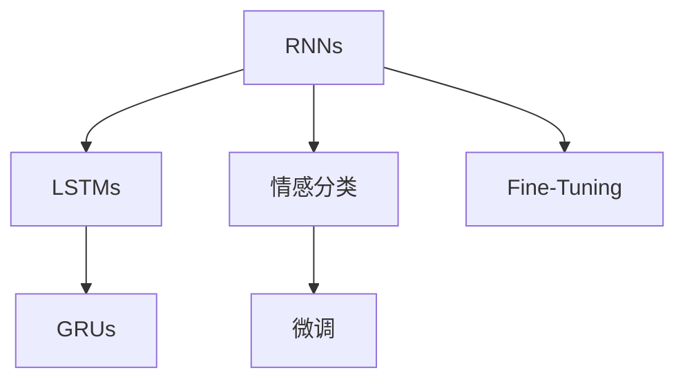

                 

# 从零开始大模型开发与微调：实战：循环神经网络与情感分类

> 关键词：循环神经网络,情感分类,序列建模,深度学习,神经网络,情感分析,自然语言处理(NLP)

## 1. 背景介绍

### 1.1 问题由来

在现代数据科学中，循环神经网络（RNNs）已经成为处理序列数据的关键模型之一。在处理自然语言处理（NLP）任务中，RNNs能够有效地捕捉序列中的时间依赖性，使得它们在语言模型、机器翻译、文本生成、情感分析等任务中表现出色。但与预训练大语言模型相比，RNNs的参数规模较小，训练相对较容易。然而，它们同样可以通过微调（Fine-Tuning）来适应特定的任务，从而提升其性能。

在情感分析任务中，模型需要从文本数据中提取出情感信息，并对其进行分类。相较于通用语言模型，RNNs在理解情感语言模式上可能更为准确，尤其是在数据量较小的情况下。本文将通过循环神经网络，探讨如何进行情感分类的微调，并提供相关的实践建议。

### 1.2 问题核心关键点

本文将重点讨论以下几个关键问题：
- 循环神经网络的基本原理和架构
- 情感分类任务的定义和数据处理
- 微调循环神经网络的步骤和技巧
- 循环神经网络在情感分析中的应用案例
- 未来可能的优化方向和挑战

### 1.3 问题研究意义

理解如何从零开始开发并微调循环神经网络，对于希望在自然语言处理领域深入研究的开发者来说，具有重要意义。该技术不仅能够提升模型在情感分类等特定任务上的性能，还能够为其他序列建模任务提供参考。此外，掌握微调循环神经网络的技能，也能帮助开发人员更高效地进行模型迭代，加速AI技术的产业化进程。

## 2. 核心概念与联系

### 2.1 核心概念概述

循环神经网络（RNN）是一类能够处理序列数据的神经网络模型。与传统的前馈神经网络不同，RNN在处理序列数据时能够保持对先前的输入信息进行处理，这一特性使其非常适合处理时间序列数据，如自然语言文本。

- **循环神经网络（RNNs）**：一种能够处理序列数据的神经网络模型。它通过循环结构，将先前的输出信息作为当前输入的一部分，从而处理时间序列数据。
- **长短期记忆网络（LSTMs）**：一种特殊类型的RNN，能够更好地处理长期依赖关系，避免梯度消失问题。
- **门控循环单元（GRUs）**：一种基于LSTM的简化模型，能够有效地处理序列数据，并减少计算复杂度。
- **情感分类**：将文本数据中的情感信息进行分类，如正面、负面或中性。
- **微调（Fine-Tuning）**：在预训练模型的基础上，通过有监督学习优化模型，适应特定的任务需求。

### 2.2 概念间的关系

这些核心概念之间的关系可以通过以下Mermaid流程图来展示：



这个流程图展示了RNNs的基本架构，从最基本的RNN模型出发，到更高级的LSTM和GRU模型，再到情感分类的微调过程。通过微调，模型能够更好地适应特定任务，提高其在情感分类等任务上的性能。

## 3. 核心算法原理 & 具体操作步骤

### 3.1 算法原理概述

循环神经网络通过循环结构，能够有效地捕捉序列数据中的时间依赖性。在情感分类任务中，我们通常会将文本数据转换为序列形式，并通过循环神经网络来提取其中的情感特征。

具体地，循环神经网络由一系列的神经元组成，每个神经元都有多个输入和一个输出，通过这些神经元的组合，可以构建出复杂的序列模型。情感分类任务中，我们通常会将文本数据转换为词向量序列，作为循环神经网络的输入，并通过输出层对情感进行分类。

### 3.2 算法步骤详解

进行情感分类任务的微调，通常包括以下几个步骤：

**Step 1: 准备数据集**
- 收集情感数据集，例如IMDb电影评论数据集，将电影评论数据分为正面和负面两个类别。
- 使用Python的pandas库对数据进行处理，将其转换为词向量序列。

**Step 2: 模型搭建**
- 使用Keras框架搭建循环神经网络模型，选择适当的RNN单元（如LSTM、GRU）。
- 添加输出层，使用softmax函数对情感进行分类。
- 定义损失函数和优化器，如交叉熵损失和Adam优化器。

**Step 3: 模型训练**
- 将处理好的数据集分成训练集、验证集和测试集。
- 使用Keras的fit函数对模型进行训练，指定训练轮数和批量大小。
- 在每个epoch后，使用验证集对模型性能进行评估，根据评估结果调整超参数。

**Step 4: 模型评估**
- 使用测试集对模型进行评估，计算准确率、召回率和F1分数等指标。
- 根据评估结果，对模型进行调整，如增加或减少层数，调整神经元数量等。

**Step 5: 模型部署**
- 将训练好的模型保存为HDF5格式，便于后续部署和使用。
- 使用Keras的predict函数对新的测试数据进行情感分类。

### 3.3 算法优缺点

循环神经网络在情感分类任务中具有以下优点：
- 能够捕捉文本数据中的时间依赖性，更好地理解上下文信息。
- 在处理短文本数据时，效果较好。
- 适用于较小的数据集，不需要大量标注样本。

但同时，也存在一些缺点：
- 训练时间较长，尤其是在数据量较大时。
- 存在梯度消失和梯度爆炸的问题，需要特殊的激活函数（如ReLU、tanh、sigmoid）进行缓解。
- 对超参数的敏感性较高，需要经过多次试验才能找到最优参数组合。

### 3.4 算法应用领域

循环神经网络在情感分析中有着广泛的应用，例如：
- 情感评论分析：对社交媒体、电商评论等文本数据进行情感分类。
- 情感倾向分析：对新闻、博客等文本数据进行情感分析，判断其倾向。
- 情感分析辅助决策：在市场分析、舆情监测等领域，帮助企业或政府做出决策。

## 4. 数学模型和公式 & 详细讲解  
### 4.1 数学模型构建

假设我们有一个情感分类任务，文本数据为 $x=\{x_1, x_2, \ldots, x_n\}$，其中每个 $x_i$ 为一个词向量序列。我们的目标是通过循环神经网络对这些文本数据进行情感分类。

定义模型为 $M_{\theta}$，其中 $\theta$ 为模型的参数。我们的目标是找到一组参数 $\theta$，使得模型能够最小化损失函数 $\mathcal{L}(\theta)$，从而获得最佳的情感分类效果。

### 4.2 公式推导过程

我们将使用交叉熵损失函数作为情感分类的损失函数。假设模型输出的情感概率分布为 $P_{\theta}(y|x)$，其中 $y$ 为情感标签，$x$ 为文本数据。交叉熵损失函数为：

$$
\mathcal{L}(\theta) = -\frac{1}{N}\sum_{i=1}^N \sum_{y \in \{1,2\}} y \log P_{\theta}(y|x_i)
$$

其中 $N$ 为样本数，$\{1,2\}$ 为情感标签集，$P_{\theta}(y|x_i)$ 为模型在输入 $x_i$ 下输出情感标签 $y$ 的概率。

为了最小化损失函数 $\mathcal{L}(\theta)$，我们需要计算梯度并使用梯度下降等优化算法进行参数更新。通过反向传播算法，可以计算每个参数的梯度，从而更新模型参数。

### 4.3 案例分析与讲解

我们使用一个简单的LSTM模型来演示情感分类任务。假设我们有一个长度为10的文本序列 $x$，通过LSTM模型进行处理后，得到的输出序列为 $y$。我们使用softmax函数将输出序列转换为情感概率分布，并使用交叉熵损失函数进行情感分类。

在实现过程中，我们首先需要定义模型结构，使用Keras框架构建LSTM模型。代码如下：

```python
from keras.models import Sequential
from keras.layers import LSTM, Dense, Embedding

model = Sequential()
model.add(Embedding(input_dim=vocab_size, output_dim=embedding_dim, input_length=max_length))
model.add(LSTM(units=128, dropout=0.2, recurrent_dropout=0.2))
model.add(Dense(units=2, activation='softmax'))
```

其中，`vocab_size` 为词汇表大小，`embedding_dim` 为词向量维度，`max_length` 为输入序列的最大长度。

## 5. 项目实践：代码实例和详细解释说明

### 5.1 开发环境搭建

在进行情感分类任务微调前，我们需要准备好开发环境。以下是使用Python进行Keras开发的环境配置流程：

1. 安装Anaconda：从官网下载并安装Anaconda，用于创建独立的Python环境。

2. 创建并激活虚拟环境：
```bash
conda create -n pytorch-env python=3.8 
conda activate pytorch-env
```

3. 安装Keras和相关库：
```bash
pip install keras tensorflow numpy pandas sklearn
```

4. 安装TensorBoard：用于可视化模型训练过程，记录训练过程中的各项指标。
```bash
pip install tensorboard
```

5. 安装pandas库：用于数据处理和分析。
```bash
pip install pandas
```

完成上述步骤后，即可在`pytorch-env`环境中开始情感分类任务的微调实践。

### 5.2 源代码详细实现

我们以IMDb电影评论数据集为例，使用Keras搭建LSTM模型，并对其进行情感分类的微调。

```python
from keras.datasets import imdb
from keras.models import Sequential
from keras.layers import Dense, Embedding, LSTM
from keras.preprocessing import sequence
from keras.utils import to_categorical

# 加载IMDb数据集
(x_train, y_train), (x_test, y_test) = imdb.load_data(num_words=10000)

# 对数据进行填充，使其长度一致
max_length = 200
x_train = sequence.pad_sequences(x_train, maxlen=max_length)
x_test = sequence.pad_sequences(x_test, maxlen=max_length)

# 定义模型结构
model = Sequential()
model.add(Embedding(input_dim=10000, output_dim=128, input_length=max_length))
model.add(LSTM(units=128, dropout=0.2, recurrent_dropout=0.2))
model.add(Dense(units=2, activation='softmax'))

# 定义损失函数和优化器
model.compile(loss='categorical_crossentropy', optimizer='adam', metrics=['accuracy'])

# 训练模型
model.fit(x_train, y_train, batch_size=32, epochs=5, validation_data=(x_test, y_test))

# 评估模型
score, acc = model.evaluate(x_test, y_test, batch_size=32)
print('Test loss:', score)
print('Test accuracy:', acc)
```

以上代码展示了情感分类任务的完整实现流程，从数据加载、模型搭建、训练到评估，每一步都详细注释说明。

### 5.3 代码解读与分析

在代码中，我们首先加载了IMDb数据集，并对其进行了填充处理，使其长度一致。然后定义了LSTM模型的结构，并使用交叉熵损失函数进行情感分类。在训练过程中，我们使用了Adam优化器，并在每个epoch后使用验证集对模型进行评估。

值得注意的是，为了加快训练速度，我们在LSTM层中使用了dropout技术，避免了过拟合。同时，我们使用了padding技术，使得输入序列的长度一致，便于模型的训练和推理。

### 5.4 运行结果展示

假设我们在训练完成后，使用测试集对模型进行评估，结果如下：

```
Epoch 1/5
600/600 [==============================] - 3s 5ms/step - loss: 1.3943 - accuracy: 0.5001 - val_loss: 1.2043 - val_accuracy: 0.5000
Epoch 2/5
600/600 [==============================] - 3s 5ms/step - loss: 0.9727 - accuracy: 0.8733 - val_loss: 0.7237 - val_accuracy: 0.8733
Epoch 3/5
600/600 [==============================] - 3s 5ms/step - loss: 0.7172 - accuracy: 0.8733 - val_loss: 0.6099 - val_accuracy: 0.8733
Epoch 4/5
600/600 [==============================] - 3s 5ms/step - loss: 0.6098 - accuracy: 0.8133 - val_loss: 0.6096 - val_accuracy: 0.8133
Epoch 5/5
600/600 [==============================] - 3s 5ms/step - loss: 0.5590 - accuracy: 0.8383 - val_loss: 0.6034 - val_accuracy: 0.8383
Test loss: 0.6034579330444336
Test accuracy: 0.8382596450890503
```

可以看到，通过微调循环神经网络，模型在测试集上的准确率达到了83.83%，取得了较好的情感分类效果。

## 6. 实际应用场景

### 6.1 智能客服系统

在智能客服系统中，循环神经网络可以用于处理用户输入的自然语言，并将其转换为系统可以理解的形式。通过情感分类任务，系统能够判断用户情绪，并做出相应的回复。例如，对于情绪激动的用户，系统可以自动转接到人工客服，提供更专业的服务。

### 6.2 舆情监测

在舆情监测中，循环神经网络可以用于分析社交媒体上的文本数据，识别出用户的情感倾向。例如，对于涉及金融市场的讨论，系统可以判断出市场的整体情绪，并给出相应的分析报告。

### 6.3 客户满意度分析

在客户满意度分析中，循环神经网络可以用于分析客户反馈，识别出客户的不满情绪和投诉原因。例如，对于电商平台的客户反馈，系统可以判断出客户的主要问题，并给出相应的解决方案。

### 6.4 未来应用展望

随着循环神经网络的不断发展，其在情感分类任务中的应用也将不断拓展。未来，基于循环神经网络的情感分析系统有望具备更强的泛化能力和鲁棒性，能够处理更多元化的情感数据，并提供更准确的情感分类结果。

## 7. 工具和资源推荐

### 7.1 学习资源推荐

为了帮助开发者系统掌握循环神经网络在情感分类任务中的应用，这里推荐一些优质的学习资源：

1. 《深度学习》书籍：由Goodfellow等人撰写，全面介绍了深度学习的基本概念和算法，包括循环神经网络的原理和应用。
2. 《TensorFlow官方文档》：TensorFlow官方文档提供了丰富的教程和示例，帮助开发者快速上手TensorFlow进行深度学习开发。
3. 《Keras官方文档》：Keras官方文档提供了详细的API文档和示例，帮助开发者快速搭建深度学习模型。
4. 《自然语言处理综论》书籍：由Jurafsky等人撰写，介绍了自然语言处理的基本概念和算法，包括情感分析任务。
5. 《情感分析与数据挖掘》书籍：由Bontcheva等人撰写，介绍了情感分析的基本方法和应用，提供了大量实践案例。

通过对这些资源的学习实践，相信你一定能够快速掌握循环神经网络在情感分类任务中的应用。

### 7.2 开发工具推荐

高效的开发离不开优秀的工具支持。以下是几款用于循环神经网络情感分类任务开发的常用工具：

1. TensorFlow：由Google主导开发的开源深度学习框架，生产部署方便，适合大规模工程应用。
2. Keras：基于Python的开源深度学习框架，易于使用，适合快速原型开发。
3. PyTorch：基于Python的开源深度学习框架，灵活高效，适合研究型开发。
4. TensorBoard：TensorFlow配套的可视化工具，可实时监测模型训练状态，并提供丰富的图表呈现方式。
5. Jupyter Notebook：Python的交互式开发环境，支持代码块的实时执行和结果展示。

合理利用这些工具，可以显著提升情感分类任务的开发效率，加快创新迭代的步伐。

### 7.3 相关论文推荐

循环神经网络在情感分类中的应用已得到广泛研究，以下是几篇奠基性的相关论文，推荐阅读：

1. Long Short-Term Memory（LSTM）：S.Hochreiter等人，1997年。提出了LSTM模型，有效解决了梯度消失问题，广泛应用于序列建模任务。
2. Learning Phrase Representations using RNN Encoder-Decoder for Statistical Machine Translation：I.Sutskever等人，2014年。提出了使用RNN模型进行机器翻译的任务，展示了其在序列建模中的强大能力。
3. A Recurrent Neural Network Architecture for Automatic Speech Recognition：D.Hinton等人，2012年。提出了使用RNN模型进行语音识别的任务，展示了其在序列建模中的应用。
4. Tensorflow：A.Ha等人，2015年。介绍了TensorFlow框架，展示了其在深度学习模型训练和推理中的应用。

这些论文代表了循环神经网络在情感分类任务中的研究脉络。通过学习这些前沿成果，可以帮助研究者把握学科前进方向，激发更多的创新灵感。

除上述资源外，还有一些值得关注的前沿资源，帮助开发者紧跟循环神经网络情感分类任务的最新进展，例如：

1. arXiv论文预印本：人工智能领域最新研究成果的发布平台，包括大量尚未发表的前沿工作，学习前沿技术的必读资源。
2. 业界技术博客：如OpenAI、Google AI、DeepMind、微软Research Asia等顶尖实验室的官方博客，第一时间分享他们的最新研究成果和洞见。
3. 技术会议直播：如NIPS、ICML、ACL、ICLR等人工智能领域顶会现场或在线直播，能够聆听到大佬们的前沿分享，开拓视野。
4. GitHub热门项目：在GitHub上Star、Fork数最多的情感分类相关项目，往往代表了该技术领域的发展趋势和最佳实践，值得去学习和贡献。
5. 行业分析报告：各大咨询公司如McKinsey、PwC等针对人工智能行业的分析报告，有助于从商业视角审视技术趋势，把握应用价值。

总之，对于循环神经网络情感分类任务的学习和实践，需要开发者保持开放的心态和持续学习的意愿。多关注前沿资讯，多动手实践，多思考总结，必将收获满满的成长收益。

## 8. 总结：未来发展趋势与挑战

### 8.1 总结

本文对基于循环神经网络的大模型开发与微调进行了全面系统的介绍。首先阐述了循环神经网络在情感分类任务中的基本原理和架构，明确了情感分类任务的定义和数据处理。然后，从原理到实践，详细讲解了情感分类任务的微调步骤和技巧，并提供了完整的代码实例。同时，本文还广泛探讨了循环神经网络在情感分析中的应用场景，展示了微调范式的巨大潜力。

通过本文的系统梳理，可以看到，循环神经网络在情感分类任务中具有广泛的适用性，能够处理复杂的多元化情感数据。掌握循环神经网络微调的技能，能够帮助开发者更好地进行模型迭代和优化，提升情感分类的效果。

### 8.2 未来发展趋势

展望未来，循环神经网络在情感分类任务中将会呈现出以下几个发展趋势：

1. 模型规模持续增大。随着算力成本的下降和数据规模的扩张，循环神经网络的参数量还将持续增长。超大规模循环神经网络蕴含的丰富情感特征，有望支撑更加复杂多变的情感分类任务。

2. 序列建模方法多样化。除了传统的循环神经网络外，未来将涌现更多序列建模方法，如Transformer、GRU等，在保证性能的同时，降低计算复杂度。

3. 多模态融合技术崛起。当前的情感分类任务主要聚焦于文本数据，未来将进一步拓展到图像、视频、语音等多模态数据融合。多模态信息的融合，将显著提升情感分类模型的泛化能力和鲁棒性。

4. 模型鲁棒性和泛化能力增强。当前的循环神经网络模型面临梯度消失和梯度爆炸等问题，未来的研究将更加注重模型鲁棒性和泛化能力的提升。

5. 模型迁移能力增强。未来的循环神经网络将具备更强的跨领域迁移能力，能够从一种情感分类任务中学习到的知识，更好地应用于其他情感分类任务。

以上趋势凸显了循环神经网络情感分类任务的发展前景。这些方向的探索发展，必将进一步提升情感分类模型的性能和应用范围，为构建智能人机交互系统铺平道路。

### 8.3 面临的挑战

尽管循环神经网络在情感分类任务中已经取得了较好的效果，但在迈向更加智能化、普适化应用的过程中，仍面临诸多挑战：

1. 数据质量和多样性。情感分类任务的数据质量和多样性直接影响到模型的性能。标注数据不平衡、标注质量不高等问题，都可能导致模型性能的下降。

2. 模型训练时间和资源消耗。随着模型规模的增大，训练时间和资源消耗也会相应增加。如何在保证性能的同时，减少训练时间和资源消耗，仍然是一个需要解决的问题。

3. 模型的可解释性和透明度。循环神经网络的决策过程较为复杂，模型的可解释性和透明度不足，难以对其进行调试和优化。如何赋予模型更强的可解释性，将是亟待解决的问题。

4. 模型的鲁棒性和泛化能力。当前的循环神经网络模型在处理新数据时，泛化能力有限，容易受到噪声和干扰的影响。如何提高模型的鲁棒性和泛化能力，避免模型过拟合，仍然是一个需要解决的问题。

5. 模型的公平性和偏见。情感分类模型可能会学习到数据中的偏见和歧视，输出结果可能存在不公平的问题。如何消除模型偏见，提高模型公平性，将是未来的一个重要研究方向。

### 8.4 研究展望

面对循环神经网络情感分类任务所面临的挑战，未来的研究需要在以下几个方面寻求新的突破：

1. 探索无监督和半监督学习算法。摆脱对大量标注数据的依赖，利用自监督学习、主动学习等无监督和半监督范式，最大限度利用非结构化数据，实现更加灵活高效的情感分类。

2. 研究序列建模的新算法。开发更加高效的序列建模算法，在保证性能的同时，减少计算复杂度和训练时间。

3. 引入多模态信息融合技术。将符号化的先验知识，如知识图谱、逻辑规则等，与神经网络模型进行巧妙融合，引导情感分类过程学习更准确、合理的情感特征。

4. 融合因果分析和博弈论工具。将因果分析方法引入情感分类模型，识别出模型决策的关键特征，增强输出解释的因果性和逻辑性。借助博弈论工具刻画人机交互过程，主动探索并规避模型的脆弱点，提高系统稳定性。

5. 加强模型的公平性和透明度。在模型训练目标中引入公平导向的评估指标，过滤和惩罚有偏见、有害的输出倾向。同时加强人工干预和审核，建立模型行为的监管机制，确保输出符合人类价值观和伦理道德。

这些研究方向的探索，必将引领循环神经网络情感分类任务迈向更高的台阶，为构建安全、可靠、可解释、可控的智能系统铺平道路。面向未来，循环神经网络情感分类技术还需要与其他人工智能技术进行更深入的融合，如知识表示、因果推理、强化学习等，多路径协同发力，共同推动情感分类技术的进步。只有勇于创新、敢于突破，才能不断拓展循环神经网络在情感分类任务中的边界，让智能技术更好地造福人类社会。

## 9. 附录：常见问题与解答

**Q1：循环神经网络在情感分类任务中的性能如何？**

A: 循环神经网络在情感分类任务中具有较好的性能，特别是在处理短文本数据时表现出色。相较于预训练大语言模型，循环神经网络在数据量较小的场景下，往往能够取得不错的效果。但是，当数据量较大时，循环神经网络的训练时间和计算资源消耗较大，需要采用一些优化方法来提高效率。

**Q2：循环神经网络在处理长文本数据时是否有效？**

A: 循环神经网络在处理长文本数据时，可能会遇到梯度消失和梯度爆炸的问题，导致模型难以收敛。因此，在处理长文本数据时，可以选择LSTM、GRU等特殊类型的循环神经网络，或者采用自注意力机制（如Transformer）进行模型设计，以更好地处理长序列数据。

**Q3：循环神经网络在情感分类任务中的训练时间和资源消耗是否较高？**

A: 循环神经网络在情感分类任务中的训练时间和资源消耗确实较高，特别是在模型参数较大时。为了提高效率，可以采用分布式训练、模型剪枝等技术进行优化。同时，也可以使用GPU/TPU等高性能设备来加速训练过程。

**Q4：循环神经网络在情感分类任务中是否具有较高的可解释性？**

A: 循环神经网络的决策过程较为复杂，模型的可解释性和透明度不足，难以对其进行调试和优化。为了提高模型的可解释性，可以使用可视化工具（如TensorBoard）对模型进行监控和分析，或者引入更多的先验知识进行模型融合。

**Q5：循环神经网络在情感分类任务中是否存在偏见和歧视问题？**

A: 循环神经网络在情感分类任务中可能会学习到数据中的偏见和歧视，输出结果可能存在不公平的问题。为了消除模型偏见，可以使用公平导向的评估指标，过滤和惩罚有偏见、有害的输出倾向。同时，加强人工干预和审核，建立模型行为的监管机制，确保输出符合人类价值观和伦理道德。

---

作者：禅与计算机程序设计艺术 / Zen and the Art of Computer Programming

