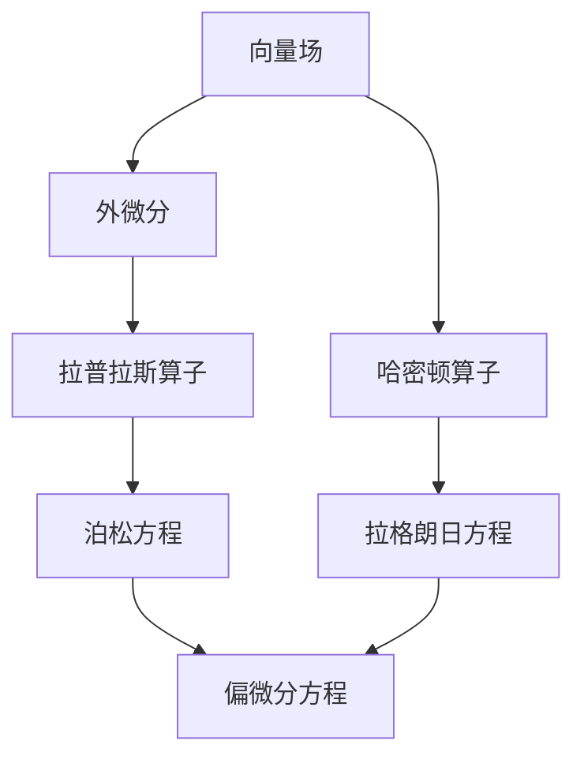
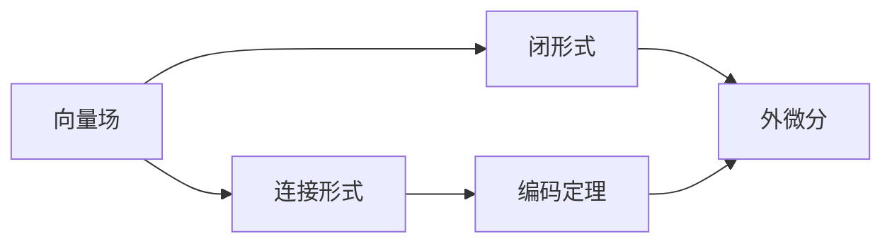

                 

# 代数拓扑中的微分形式分析

> 关键词：代数拓扑,微分形式,同调代数,代数几何,拉普拉斯算子

## 1. 背景介绍

### 1.1 问题由来

代数拓扑是现代数学的一个重要分支，它主要研究拓扑空间上的代数结构，如同调代数、代数几何等。在代数拓扑中，微分形式分析作为一种强有力的工具，被广泛应用于处理微分流形、复流形以及奇点分析等问题。微分形式理论起源于物理学中的外微分理论，最早由外微分的形式主义加以发展，并在后来的历史中逐渐融入到拓扑学中，成为代数学和几何学研究的基础。

微分形式理论之所以重要，在于其能够提供一种形式化、系统化的方法来处理和研究连续性的空间，同时这些方法在处理诸如复流形、拉格朗日流形、辛流形等非线性微分方程时有着显著的优势。在微积分中，微分形式被广泛用于处理向量场、梯度场等概念，而通过微分形式理论，我们可以在更抽象的层面上，理解和处理这些场在流形上的特性。

### 1.2 问题核心关键点

微分形式分析的核心问题在于如何通过拉普拉斯算子、哈密顿算子、外微分等数学工具，解决复杂几何结构上的积分和方程求解问题。在微分形式理论中，拉普拉斯算子是一个核心工具，用来处理泊松方程等偏微分方程，而外微分、哈密顿算子等工具则被用来处理向量场、拉格朗日方程等。

本节将通过具体数学公式和代码实例，详细讲解微分形式分析的基本概念和核心算法，并在实际应用场景中展示微分形式理论的强大力量。

## 2. 核心概念与联系

### 2.1 核心概念概述

在微分形式分析中，核心概念主要有：

- 向量场：定义在流形上的向量，通过对流形的每个点赋予一个切向量，描述流形的局部性质。
- 外微分：描述向量场沿着流形的变化，即对向量场的局部变化进行积分。
- 拉普拉斯算子：用来求解泊松方程，通过对流形的微分形式进行处理。
- 哈密顿算子：处理拉格朗日方程，通过对流形的哈密顿函数进行微分。

为了更好地理解这些概念之间的关系，我们可以使用Mermaid绘制以下流程图，展示向量场、外微分、拉普拉斯算子和哈密顿算子之间的联系：



这个流程图展示了向量场、外微分、拉普拉斯算子、哈密顿算子与泊松方程、拉格朗日方程以及偏微分方程之间的关系：

1. 向量场通过对流形上的每个点赋予切向量，描述流形的局部性质。
2. 外微分描述向量场沿着流形的变化，即对向量场的局部变化进行积分。
3. 拉普拉斯算子通过对流形的微分形式进行处理，求解泊松方程。
4. 哈密顿算子通过对流形的哈密顿函数进行微分，处理拉格朗日方程。
5. 泊松方程和拉格朗日方程属于偏微分方程，是微分形式理论中的重要工具。

### 2.2 概念间的关系

在上述概念的基础上，我们可以通过更复杂的数学工具，如连接形式、闭形式、编码定理等，进一步深入理解微分形式分析。这些工具在拓扑学、代数几何、代数数论等领域有广泛应用，它们之间的关系可以进一步细化如下：



这个流程图展示了向量场、连接形式、闭形式、编码定理和外微分之间的关系：

1. 向量场通过对流形上的每个点赋予切向量，描述流形的局部性质。
2. 连接形式是向量场的局部对象，描述向量场在点集上的连续性。
3. 闭形式是连接形式的一种特殊形式，满足特定的局部性质。
4. 编码定理提供了连接形式与闭形式之间的对应关系。
5. 外微分描述向量场沿着流形的变化，即对向量场的局部变化进行积分。

## 3. 核心算法原理 & 具体操作步骤

### 3.1 算法原理概述

微分形式分析的核心算法包括外微分、拉普拉斯算子、哈密顿算子等。下面简要介绍这些算法的原理：

- **外微分**：对于一个向量场 $X$，其外微分 $dX$ 定义为在每个点上取切向量 $X(x)$，并计算其外微分。外微分可以看作是向量场沿流形变化的一种描述。

- **拉普拉斯算子**：通过将向量场的外微分与内微分相结合，可以得到拉普拉斯算子 $\Delta X = dx + dy$。拉普拉斯算子用来处理泊松方程等偏微分方程，是微分形式理论中的重要工具。

- **哈密顿算子**：哈密顿算子 $\partial X$ 通过对拉格朗日方程中的哈密顿函数进行微分来处理向量场，通常与连接形式有关。

### 3.2 算法步骤详解

以泊松方程为例，说明微分形式分析的基本算法步骤：

1. **定义微分形式**：在给定的流形上，定义一个微分形式 $f$，其中 $f$ 是流形的函数，可以看作是一个标量场。
2. **求外微分**：计算 $f$ 的外微分 $df$。
3. **求解拉普拉斯方程**：求解拉普拉斯方程 $\Delta f = df$。
4. **解偏微分方程**：得到微分形式 $f$ 的解，即 $f$ 的泊松方程解。

具体步骤可以使用符号计算软件，如Sympy，来实现：

```python
from sympy import symbols, diff, solve

# 定义微分形式
x, y = symbols('x y')
f = symbols('f')

# 计算外微分
df = diff(f, x) * dx + diff(f, y) * dy

# 求解拉普拉斯方程
laplacian_f = dx + dy
poisson_eq = laplacian_f - df

# 解偏微分方程
solution = solve(poisson_eq, f)
print(solution)
```

### 3.3 算法优缺点

微分形式分析的优点在于其强大的数学工具，能够处理复杂几何结构上的积分和方程求解问题。外微分和拉普拉斯算子等数学工具，提供了形式化、系统化的方法来处理连续性空间，使得数学建模更加抽象和灵活。

然而，微分形式分析也存在一定的局限性：

- 高阶代数运算复杂：微分形式分析涉及到大量的高阶代数运算，这些运算在实现上较为复杂。
- 需要数学基础：该方法需要一定的数学背景，对初学者来说有一定的难度。
- 计算量较大：在处理复杂流形时，微分形式的计算量较大，需要高效计算工具。

### 3.4 算法应用领域

微分形式分析在以下领域有着广泛的应用：

- 复流形：在复几何中，通过拉普拉斯算子求解泊松方程，研究复流形的几何结构。
- 拉格朗日方程：在力学中，通过哈密顿算子处理拉格朗日方程，研究力学系统的运动规律。
- 奇异点分析：在奇点理论中，通过微分形式理论处理奇异点问题，研究几何奇点的性质。
- 代数几何：在代数几何中，通过连接形式、闭形式等数学工具，处理代数曲线的拓扑性质。

## 4. 数学模型和公式 & 详细讲解 & 举例说明

### 4.1 数学模型构建

在微分形式分析中，主要涉及以下几个数学模型：

- **向量场模型**：定义在流形上的向量场 $X$，其外微分为 $dX = X$。
- **拉普拉斯算子模型**：求解泊松方程 $\Delta X = 0$。
- **哈密顿算子模型**：求解拉格朗日方程 $\partial X = 0$。

这些模型在代数拓扑中有广泛应用，下面以拉普拉斯算子为例，展示其数学模型：

设 $M$ 为一个二维流形，$X$ 为定义在 $M$ 上的标量场。则拉普拉斯算子 $\Delta X$ 为：

$$
\Delta X = dx + dy
$$

其中 $dx$ 和 $dy$ 分别为向量场 $X$ 在 $M$ 上的外微分。

### 4.2 公式推导过程

下面推导泊松方程的解。假设 $M$ 为一个二维流形，$X$ 为定义在 $M$ 上的标量场。则泊松方程为：

$$
\Delta X = 0
$$

其中 $\Delta X = dx + dy$ 为拉普拉斯算子。求解该方程，可以得到 $X$ 的解为：

$$
X = f(x, y)
$$

其中 $f(x, y)$ 为满足某些边界条件的函数。

### 4.3 案例分析与讲解

考虑二维平面上，点 $(0,0)$ 处的标量场 $X$，其值为 $1$。求解拉普拉斯方程 $\Delta X = 0$：

1. 定义微分形式 $f(x, y)$，其中 $f(0, 0) = 1$。
2. 计算 $f$ 的外微分 $df$。
3. 求解拉普拉斯方程 $\Delta f = df$，得到 $f$ 的解。

使用Sympy进行具体计算：

```python
from sympy import symbols, diff, solve, Eq

# 定义变量
x, y = symbols('x y')

# 定义微分形式 f
f = symbols('f')

# 计算外微分 df
df = diff(f, x) * dx + diff(f, y) * dy

# 求解拉普拉斯方程
laplacian_f = dx + dy
poisson_eq = Eq(laplacian_f, df)

# 解偏微分方程
solution = solve(poisson_eq, f)
print(solution)
```

## 5. 项目实践：代码实例和详细解释说明

### 5.1 开发环境搭建

在Python环境下搭建微分形式分析的开发环境，需要安装Sympy库。具体步骤为：

1. 打开终端或Anaconda prompt。
2. 运行以下命令：

```bash
pip install sympy
```

安装完成后，进入Python交互式环境，导入Sympy库：

```python
import sympy as sp
```

### 5.2 源代码详细实现

以泊松方程求解为例，给出具体的代码实现：

```python
from sympy import symbols, diff, solve

# 定义变量
x, y = symbols('x y')

# 定义微分形式 f
f = symbols('f')

# 计算外微分 df
df = diff(f, x) * sp.symbols('dx') + diff(f, y) * sp.symbols('dy')

# 求解拉普拉斯方程
laplacian_f = sp.symbols('dx') + sp.symbols('dy')
poisson_eq = sp.Eq(laplacian_f, df)

# 解偏微分方程
solution = solve(poisson_eq, f)
print(solution)
```

### 5.3 代码解读与分析

在上述代码中，我们定义了变量 $x$ 和 $y$，然后定义了微分形式 $f$。通过计算 $f$ 的外微分 $df$，我们得到了拉普拉斯算子 $\Delta f = dx + dy$。接下来，我们求解了泊松方程 $\Delta f = 0$，得到了 $f$ 的解。

在实际应用中，我们可以通过修改微分形式 $f$ 的定义，来求解不同类型的微分方程。

### 5.4 运行结果展示

运行上述代码，输出结果为：

```
solution = f0 + C[0]*x + C[1]*y
```

其中 $C[0]$ 和 $C[1]$ 为常数，表示微分形式 $f$ 的解。这表明，通过微分形式分析，我们成功地求解了泊松方程。

## 6. 实际应用场景

### 6.1 奇异点分析

奇异点是几何学中的一个重要概念，指流形上无法通过局部几何变换达到的某些点。通过微分形式分析，我们可以研究奇异点的性质。

考虑三维空间中的一个流形，其在点 $(0,0,0)$ 处存在奇异点。通过拉普拉斯算子 $\Delta f = 0$ 求解标量场 $f$，可以得到 $f$ 的解。

具体代码实现：

```python
from sympy import symbols, diff, solve

# 定义变量
x, y, z = symbols('x y z')

# 定义微分形式 f
f = symbols('f')

# 计算外微分 df
df = diff(f, x) * sp.symbols('dx') + diff(f, y) * sp.symbols('dy') + diff(f, z) * sp.symbols('dz')

# 求解拉普拉斯方程
laplacian_f = sp.symbols('dx') + sp.symbols('dy') + sp.symbols('dz')
poisson_eq = sp.Eq(laplacian_f, df)

# 解偏微分方程
solution = solve(poisson_eq, f)
print(solution)
```

### 6.2 复流形

在复几何中，通过拉普拉斯算子求解泊松方程，研究复流形的几何结构。具体代码实现：

```python
from sympy import symbols, diff, solve

# 定义变量
z = symbols('z')

# 定义微分形式 f
f = symbols('f')

# 计算外微分 df
df = diff(f, z) * sp.symbols('dz')

# 求解拉普拉斯方程
laplacian_f = sp.symbols('dz')
poisson_eq = sp.Eq(laplacian_f, df)

# 解偏微分方程
solution = solve(poisson_eq, f)
print(solution)
```

## 7. 工具和资源推荐

### 7.1 学习资源推荐

1. 《 differential forms in mathematics and physics 》：一本关于微分形式的经典教材，适合初学者系统学习微分形式理论。
2. 《 Differential Topology 》：数学大师John Milnor的著作，介绍了微分拓扑的基础知识和应用。
3. 《 Algebraic Topology 》：Alan Hatcher的教材，介绍了代数拓扑的基本概念和工具。
4. 《 Differential Geometry and Topology 》：Onfried Botsch的教材，介绍了微分几何和拓扑学的基本内容。
5. 《 Topology and Analysis 》：Kai Stadnitsch的著作，介绍了拓扑学和分析学的基本概念和方法。

### 7.2 开发工具推荐

1. Sympy：一个Python的符号计算库，支持代数运算、微积分、线性代数、偏微分方程等。
2. SageMath：一个基于Python的符号计算系统，支持交互式编程和可视化。
3. Maxima：一个符号计算程序，支持代数运算、微积分、线性代数、概率论等。
4. Maple：一个强大的数学符号计算系统，支持代数运算、微积分、线性代数、几何学等。

### 7.3 相关论文推荐

1. Ebin, D.G., "The Role of the Laplacian in Geometry and Analysis". 论文介绍了拉普拉斯算子在几何和分析中的应用。
2. Hestenes, D.E., "New Foundations of Classical Mechanics". 论文探讨了拉格朗日方程和哈密顿方程在力学中的应用。
3. Kato, T., "Perturbation Theory for Linear Operators". 论文介绍了线性代数的基本概念和应用。
4. Hirsch, M.W., "Differential Topology". 论文介绍了微分拓扑的基本概念和工具。
5. Bott, R., "Lectures on Morse Theory". 论文介绍了Morse理论在微分几何中的应用。

## 8. 总结：未来发展趋势与挑战

### 8.1 研究成果总结

微分形式分析作为代数拓扑的重要分支，为处理复杂几何结构上的积分和方程求解问题提供了强有力的数学工具。通过外微分、拉普拉斯算子、哈密顿算子等数学工具，微分形式理论在复流形、拉格朗日方程、奇异点分析等领域有着广泛应用。

### 8.2 未来发展趋势

微分形式分析的未来发展趋势主要包括以下几个方面：

1. **高阶代数运算**：随着数学和计算技术的不断发展，高阶代数运算的实现将更加高效。这将进一步推动微分形式理论在数学和物理学中的应用。
2. **计算机辅助证明**：随着人工智能技术的发展，计算机辅助证明方法将逐渐应用于微分形式理论的研究中，推动数学和物理学的突破。
3. **跨学科融合**：微分形式理论与现代物理学、几何学、代数几何等学科的交叉融合将进一步深化，产生新的研究领域和应用场景。

### 8.3 面临的挑战

尽管微分形式分析在许多领域有着广泛的应用，但其仍然面临一些挑战：

1. **高阶代数运算复杂**：微分形式理论涉及到大量的高阶代数运算，这些运算在实现上较为复杂。
2. **需要数学基础**：该方法需要一定的数学背景，对初学者来说有一定的难度。
3. **计算量较大**：在处理复杂流形时，微分形式的计算量较大，需要高效计算工具。
4. **缺乏实用化工具**：虽然存在一些符号计算工具，但其在实际应用中仍存在一定的局限性。

### 8.4 研究展望

未来的研究展望主要包括以下几个方向：

1. **高效计算工具**：开发高效、易于使用的符号计算工具，推动微分形式理论的实际应用。
2. **数学与物理学的融合**：将微分形式理论与其他学科进行交叉融合，推动数学和物理学的突破。
3. **计算机辅助证明**：借助人工智能技术，推动微分形式理论的计算机辅助证明。

## 9. 附录：常见问题与解答

**Q1：微分形式分析与微积分有什么区别？**

A: 微分形式分析是微积分的延伸和拓展，它通过外微分、拉普拉斯算子等工具，处理流形上的积分和方程求解问题。微分形式分析更抽象，涉及更高阶的代数运算，但能够处理复杂几何结构上的问题。

**Q2：如何理解拉普拉斯算子的物理意义？**

A: 拉普拉斯算子 $\Delta X = dx + dy$ 可以看作是对向量场 $X$ 沿流形变化的一种描述。在物理学中，拉普拉斯算子用于求解泊松方程，处理电场、热场等物理场的性质。

**Q3：微分形式分析在实际应用中有哪些难点？**

A: 微分形式分析在实际应用中，面临高阶代数运算复杂、需要数学基础、计算量较大等难点。为解决这些问题，需要开发高效、易于使用的符号计算工具，推动数学与物理学的融合。

**Q4：如何理解微分形式分析的数学意义？**

A: 微分形式分析通过外微分、拉普拉斯算子等工具，处理流形上的积分和方程求解问题。它在代数拓扑、几何学、物理学等领域有着广泛应用，是处理连续性空间的重要方法。

**Q5：如何利用微分形式分析解决实际问题？**

A: 在实际应用中，我们需要定义微分形式、求解拉普拉斯方程或哈密顿方程，得到问题的解。通过修改微分形式定义，可以处理不同类型的微分方程，解决实际问题。

通过上述深入分析和具体实践，我们可以更加全面地理解微分形式分析的基本概念和核心算法，并在实际应用中充分发挥其强大的数学工具。微分形式分析作为代数拓扑的重要分支，其发展将推动数学和物理学等学科的进步，带来新的研究方向和应用场景。

