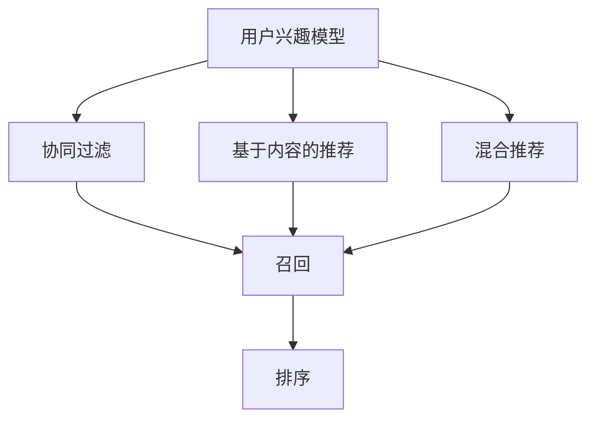
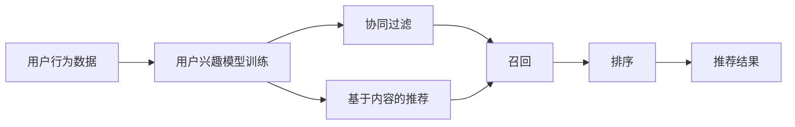
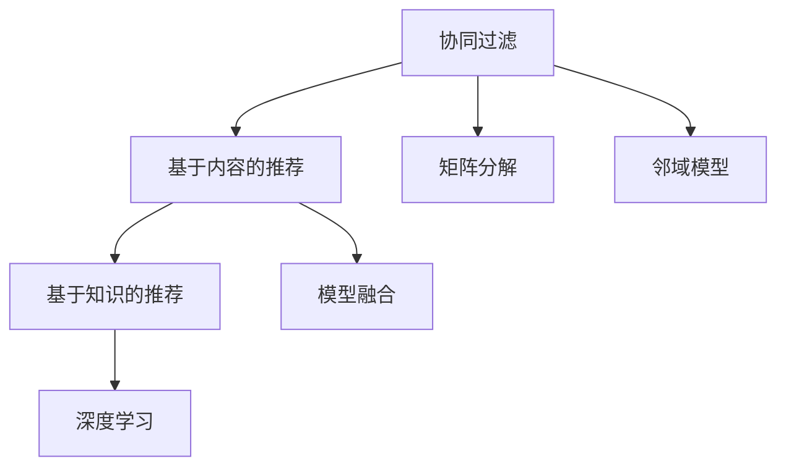
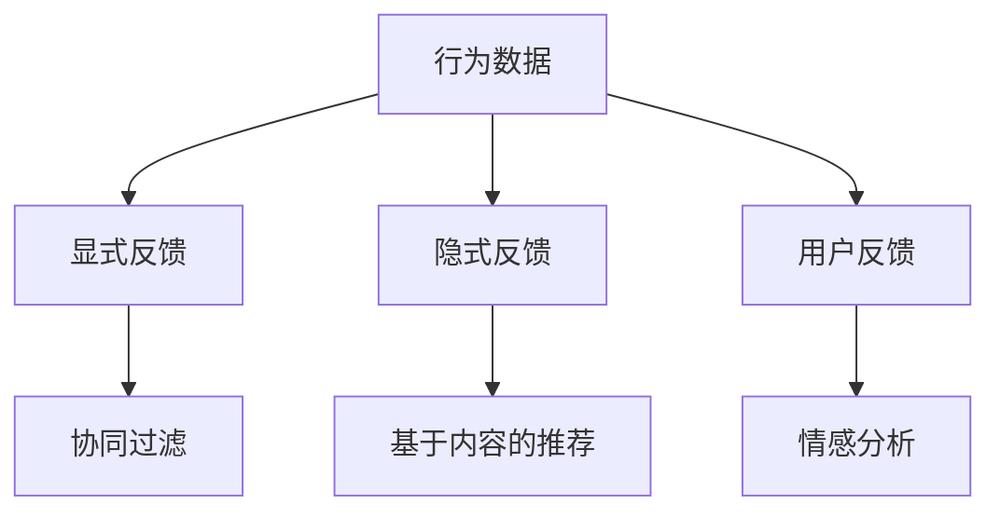
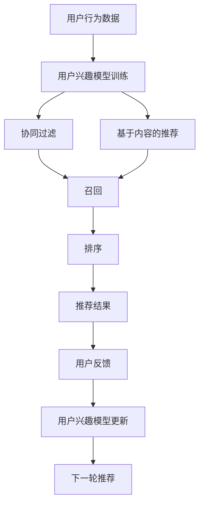

                 

# 传统搜索推荐系统的局限性

## 1. 背景介绍

### 1.1 问题由来
在互联网时代，信息过载成为常态，用户如何在海量数据中快速找到自己真正感兴趣的内容，成为迫切需要解决的问题。传统的搜索推荐系统就是为此而生，通过收集用户的查询行为数据，构建用户兴趣模型，从而在搜索结果中精准推荐相关内容。这些系统在电商、新闻、社交网络等领域广泛应用，为用户带来了前所未有的信息获取便利。

然而，随着用户需求多样化和个性化趋势的加剧，传统的搜索推荐系统逐渐暴露出诸多局限性。这些局限性不仅影响用户体验，也限制了推荐系统的潜在价值。因此，探索和突破这些局限性，是提升搜索推荐系统性能和拓展其应用边界的重要方向。

### 1.2 问题核心关键点
传统搜索推荐系统的主要局限性包括以下几点：

- **数据稀疏性问题**：用户的行为数据通常比较稀疏，无法准确刻画用户的真实兴趣。
- **单一兴趣模型**：传统的推荐系统往往只考虑用户的历史行为，而忽略长尾内容、实时兴趣等。
- **静态模型**：传统的推荐系统大多基于静态的用户兴趣模型，难以应对用户兴趣的变化。
- **单一特征使用**：传统系统只依赖用户行为特征进行推荐，忽视了文本、时间、地理位置等多元特征。
- **离线评估**：传统系统大多采用离线评估，难以反映真实环境下的推荐效果。
- **冷启动问题**：新用户或新物品往往无法获取足够的行为数据，难以进行推荐。

这些局限性限制了传统搜索推荐系统在多变、复杂场景下的应用效果，无法充分满足用户日益增长的个性化需求。

### 1.3 问题研究意义
研究传统搜索推荐系统的局限性，对于提升推荐系统的性能、拓展其应用场景、提高用户体验具有重要意义：

- **提升推荐效果**：通过分析用户行为数据的多样性和复杂性，改进推荐算法，使推荐结果更加精准和多样化。
- **覆盖长尾需求**：利用元数据、实时数据、多模态特征等，拓展推荐系统的覆盖范围，充分满足长尾需求。
- **增强用户粘性**：通过动态更新用户兴趣模型，提高系统的适应性和个性化水平，增强用户对系统的粘性。
- **解决冷启动问题**：设计更有效的冷启动策略，使得新用户和新物品也能获得及时推荐。
- **实时评估和优化**：引入实时评估机制，持续监控推荐效果，快速响应用户反馈，不断优化推荐系统。

## 2. 核心概念与联系

### 2.1 核心概念概述

为更好地理解传统搜索推荐系统的局限性，本节将介绍几个核心概念：

- **用户兴趣模型**：用于刻画用户历史行为和兴趣偏好的数学模型，是推荐算法的基础。
- **协同过滤**：利用用户行为相似性进行推荐的方法，基于用户的相似性或物品的相似性构建推荐模型。
- **基于内容的推荐**：通过分析物品的特征和用户历史偏好，构建推荐模型。
- **混合推荐**：结合多种推荐算法，综合考虑用户行为、物品特征等多方面信息进行推荐。
- **召回**：将相关物品推荐给用户的机制，是推荐系统的重要环节。
- **排序**：根据推荐算法的输出，对推荐结果进行排序，提高推荐的精准度和效率。

这些核心概念之间的逻辑关系可以通过以下Mermaid流程图来展示：



这个流程图展示了大规模推荐系统的主要组件和流程：

1. 用户兴趣模型通过用户历史行为数据进行训练，生成用户的兴趣表示。
2. 协同过滤、基于内容的推荐等算法根据用户兴趣模型进行召回。
3. 混合推荐算法结合多种推荐方法，综合考虑多方面信息，进一步提升召回效果。
4. 排序算法对召回结果进行排序，优化推荐顺序，提高推荐质量。

### 2.2 概念间的关系

这些核心概念之间存在着紧密的联系，形成了推荐系统的完整架构。下面我们通过几个Mermaid流程图来展示这些概念之间的关系。

#### 2.2.1 推荐系统的主要流程



这个流程图展示了推荐系统从数据输入到结果输出的主要流程。

#### 2.2.2 推荐算法的多样性



这个流程图展示了推荐算法的多样性，包括协同过滤、基于内容的推荐、深度学习等多种方法。

#### 2.2.3 用户行为的多样性



这个流程图展示了用户行为数据的多样性，包括显式反馈、隐式反馈、情感分析等。

### 2.3 核心概念的整体架构

最后，我们用一个综合的流程图来展示这些核心概念在推荐系统中的整体架构：



这个综合流程图展示了从用户行为数据输入到推荐结果输出的全过程，包括用户兴趣模型的训练、推荐算法的调用、结果排序和反馈机制。

## 3. 核心算法原理 & 具体操作步骤
### 3.1 算法原理概述

传统搜索推荐系统的主流算法包括以下几种：

- **协同过滤**：通过计算用户间的相似性，找到与目标用户兴趣相似的用户，推荐这些用户喜欢的物品。
- **基于内容的推荐**：利用物品的元数据特征，如标题、标签、描述等，构建推荐模型。
- **混合推荐**：结合多种推荐算法，综合考虑用户历史行为、物品特征等，提升推荐效果。
- **排序算法**：通过排序算法对召回结果进行排序，提高推荐的准确性和相关性。

协同过滤和基于内容的推荐是传统推荐系统的基础，混合推荐算法则在两者基础上进行融合，排序算法进一步优化推荐结果。

### 3.2 算法步骤详解

#### 3.2.1 协同过滤算法

协同过滤算法主要分为两种：

1. **用户-物品协同过滤**：
   - **算法步骤**：
     1. 收集用户与物品的评分数据，构建用户-物品评分矩阵 $U \times I$。
     2. 计算用户-物品相似度 $sim(u_i, u_j)$，通常使用余弦相似度或皮尔逊相关系数。
     3. 对目标用户 $u_i$ 进行相似性排序，选取最相似的用户 $u_j$。
     4. 预测目标用户对未评分物品的评分，推荐评分靠前的物品。

   - **代码实现**：
     ```python
     import numpy as np

     def cosine_similarity(a, b):
         return np.dot(a, b) / (np.linalg.norm(a) * np.linalg.norm(b))

     def user_based_recommender(user_ids, item_ids, ratings):
         user_matrix = np.array(ratings)
         user_similarities = []
         for i in user_ids:
             similarities = []
             for j in user_ids:
                 if i != j:
                     similarities.append(cosine_similarity(user_matrix[i], user_matrix[j]))
             user_similarities.append(similarities)
         sorted_indices = [np.argsort(similarities) for similarities in user_similarities]
         recommendations = []
         for i, sorted_indices_i in enumerate(sorted_indices):
             for j in sorted_indices_i:
                 recommendations.append((item_ids[j], ratings[j]))
         return recommendations
     ```

2. **物品-物品协同过滤**：
   - **算法步骤**：
     1. 收集用户对物品的评分数据，构建物品-物品评分矩阵 $I \times I$。
     2. 计算物品-物品相似度 $sim(i_j, i_k)$。
     3. 对目标物品 $i_j$ 进行相似性排序，选取最相似的物品 $i_k$。
     4. 预测目标物品对未评分用户的评分，推荐评分靠前的物品。

   - **代码实现**：
     ```python
     def item_based_recommender(user_ids, item_ids, ratings):
         item_matrix = np.array(ratings.T)
         item_similarities = []
         for i in item_ids:
             similarities = []
             for j in item_ids:
                 if i != j:
                     similarities.append(cosine_similarity(item_matrix[j], item_matrix[i]))
             item_similarities.append(similarities)
         sorted_indices = [np.argsort(similarities) for similarities in item_similarities]
         recommendations = []
         for i, sorted_indices_i in enumerate(sorted_indices):
             for j in sorted_indices_i:
                 recommendations.append((user_ids[j], ratings[j]))
         return recommendations
     ```

#### 3.2.2 基于内容的推荐算法

基于内容的推荐算法主要利用物品的元数据进行推荐。

- **算法步骤**：
  1. 收集物品的元数据，如标题、描述、标签等。
  2. 将元数据转化为特征向量 $v_i$。
  3. 计算用户对物品的兴趣 $u_i$。
  4. 计算物品相似度 $sim(i_j, i_k)$。
  5. 对目标物品 $i_j$ 进行相似性排序，选取最相似的物品 $i_k$。
  6. 预测目标用户对未评分物品的评分，推荐评分靠前的物品。

- **代码实现**：
  ```python
  import numpy as np

  def compute_item_features(item_ids):
      # 获取物品的特征向量
      features = []
      for item_id in item_ids:
          features.append(compute_item_features(item_id))
      return np.array(features)

  def compute_user_interest(user_id, item_ids, features):
      # 计算用户对物品的兴趣
      user_interest = []
      for item_id in item_ids:
          user_interest.append(np.dot(features[item_id], item_features[user_id]))
      return np.array(user_interest)

  def content_based_recommender(user_id, item_ids, features):
      user_interest = compute_user_interest(user_id, item_ids, features)
      item_similarities = compute_item_similarities(features)
      sorted_indices = np.argsort(item_similarities)[::-1]
      recommendations = []
      for i, sorted_indices_i in enumerate(sorted_indices):
          recommendations.append((item_ids[sorted_indices_i], features[item_ids[sorted_indices_i]][user_id]))
      return recommendations
  ```

#### 3.2.3 混合推荐算法

混合推荐算法结合多种推荐方法，综合考虑用户历史行为和物品特征。

- **算法步骤**：
  1. 收集用户行为数据，如浏览、点击、购买等。
  2. 计算用户对物品的兴趣 $u_i$。
  3. 计算物品相似度 $sim(i_j, i_k)$。
  4. 对目标物品 $i_j$ 进行相似性排序，选取最相似的物品 $i_k$。
  5. 预测目标用户对未评分物品的评分，推荐评分靠前的物品。

- **代码实现**：
  ```python
  import numpy as np

  def compute_user_interest(user_id, item_ids, features):
      user_interest = []
      for item_id in item_ids:
          user_interest.append(np.dot(features[item_id], user_features[user_id]))
      return np.array(user_interest)

  def compute_item_similarities(features):
      similarities = []
      for i in features:
          for j in features:
              similarities.append(cosine_similarity(i, j))
      return similarities

  def hybrid_recommender(user_id, item_ids, features):
      user_interest = compute_user_interest(user_id, item_ids, features)
      item_similarities = compute_item_similarities(features)
      sorted_indices = np.argsort(item_similarities)[::-1]
      recommendations = []
      for i, sorted_indices_i in enumerate(sorted_indices):
          recommendations.append((item_ids[sorted_indices_i], features[item_ids[sorted_indices_i]][user_id]))
      return recommendations
  ```

#### 3.2.4 排序算法

排序算法主要通过调整推荐结果的顺序，提升推荐的准确性和相关性。

- **算法步骤**：
  1. 计算每个物品的相关度 $r_i$。
  2. 根据相关度对物品进行排序，选取最相关的前 $k$ 个物品。

- **代码实现**：
  ```python
  def compute_relevance(ratings, features):
      relevance = []
      for item_id in ratings:
          relevance.append(np.dot(features[item_id], item_features[user_id]))
      return relevance

  def top_k_recommender(user_id, item_ids, features):
      relevance = compute_relevance(user_id, features)
      top_k = np.argsort(relevance)[::-1][:k]
      recommendations = []
      for i in top_k:
          recommendations.append((item_ids[i], features[item_ids[i]][user_id]))
      return recommendations
  ```

### 3.3 算法优缺点

传统推荐算法具有以下优点：

- **简单易用**：算法实现简单，易于理解和部署。
- **解释性高**：推荐过程可解释性强，便于理解和调试。
- **数据利用率高**：能够利用用户行为数据进行推荐，覆盖面广。

但同时，这些算法也存在一些缺点：

- **数据稀疏性**：用户行为数据通常比较稀疏，难以刻画用户真实兴趣。
- **单一特征**：只依赖用户行为特征进行推荐，忽视了文本、时间、地理位置等多元特征。
- **静态模型**：模型大多基于静态用户兴趣模型，难以应对用户兴趣的变化。
- **离线评估**：大多采用离线评估，难以反映真实环境下的推荐效果。
- **冷启动问题**：新用户或新物品难以获取足够的行为数据，推荐效果差。

### 3.4 算法应用领域

传统推荐算法在电商、新闻、社交网络等领域得到了广泛应用，具体包括：

- **电商推荐**：亚马逊、淘宝等电商平台通过协同过滤和基于内容的推荐，向用户推荐商品，提升销售额。
- **新闻推荐**：今日头条、澎湃新闻等平台通过协同过滤和混合推荐，向用户推荐新闻，增加用户停留时间。
- **社交网络**：微信、微博等社交网络通过基于内容的推荐和排序算法，推荐用户感兴趣的内容，提升用户体验。
- **视频推荐**：Netflix、YouTube等视频平台通过协同过滤和基于内容的推荐，推荐用户喜爱的视频，提高用户粘性。

这些推荐算法在各领域的应用，极大地提升了信息获取的便利性和用户体验，推动了相关产业的发展。

## 4. 数学模型和公式 & 详细讲解  
### 4.1 数学模型构建

本节将使用数学语言对传统推荐系统的推荐过程进行更加严格的刻画。

记用户对物品的评分矩阵为 $U \times I$，其中 $U$ 为用户数，$I$ 为物品数。设用户对物品 $i$ 的评分向量为 $u_i$，物品的特征向量为 $v_i$，用户 $u_i$ 对物品 $i$ 的评分 $r_i$ 为：

$$
r_i = u_i \cdot v_i
$$

用户对物品的兴趣 $u_i$ 为：

$$
u_i = f(u_i; \theta)
$$

其中 $f$ 为兴趣模型，$\theta$ 为模型参数。

物品的相似度 $sim(i_j, i_k)$ 为：

$$
sim(i_j, i_k) = cos(u_j, u_k) = \frac{u_j \cdot u_k}{\|u_j\| \|u_k\|}
$$

物品的排序度 $r_j$ 为：

$$
r_j = \frac{\sum_{i=1}^{I} r_{i,j} \cdot sim(i_j, i_k)}{\sum_{i=1}^{I} sim(i_j, i_k)}
$$

最终的推荐结果为 $r_j$ 排序靠前的物品。

### 4.2 公式推导过程

以下我们以协同过滤算法为例，推导推荐过程的数学公式。

假设用户 $u_i$ 对物品 $i$ 的评分向量为 $u_i$，物品 $i$ 的特征向量为 $v_i$，用户 $u_i$ 对物品 $i$ 的评分 $r_i$ 为：

$$
r_i = u_i \cdot v_i
$$

对于协同过滤算法，用户 $u_i$ 对物品 $i$ 的评分 $r_i$ 可以通过相似度加权平均计算：

$$
r_i = \alpha_1 r_i + \alpha_2 \sum_{j \in \mathcal{N}(u_i)} \frac{r_j}{\|u_j\|}
$$

其中 $\alpha_1$ 为原始评分权重，$\alpha_2$ 为协同过滤权重，$\mathcal{N}(u_i)$ 为用户 $u_i$ 的邻居集合。

将 $r_i$ 表示为物品相似度的加权平均，可得：

$$
r_i = \frac{\sum_{j \in \mathcal{N}(u_i)} \frac{r_j}{\|u_j\|} \cdot sim(i_j, i_k)}{\sum_{j \in \mathcal{N}(u_i)} sim(i_j, i_k)}
$$

在得到评分 $r_i$ 后，可以将其作为排序算法的输入，计算排序度 $r_j$：

$$
r_j = \frac{\sum_{i=1}^{I} r_{i,j} \cdot sim(i_j, i_k)}{\sum_{i=1}^{I} sim(i_j, i_k)}
$$

在得到排序度 $r_j$ 后，根据 $r_j$ 排序，推荐评分靠前的物品。

### 4.3 案例分析与讲解

以亚马逊电商推荐系统为例，分析其推荐过程和结果。

亚马逊电商推荐系统主要采用了基于协同过滤的推荐算法。用户在浏览商品时，系统会记录其行为数据，如浏览、点击、购买等，并计算用户对每个物品的评分 $r_i$。这些评分数据构成了用户-物品评分矩阵 $U \times I$。

在推荐过程中，系统会首先计算用户 $u_i$ 的邻居集合 $\mathcal{N}(u_i)$，并计算用户 $u_i$ 对物品 $i$ 的评分 $r_i$：

$$
r_i = \alpha_1 r_i + \alpha_2 \sum_{j \in \mathcal{N}(u_i)} \frac{r_j}{\|u_j\|}
$$

然后，系统会计算物品相似度 $sim(i_j, i_k)$：

$$
sim(i_j, i_k) = \frac{u_j \cdot u_k}{\|u_j\| \|u_k\|}
$$

最后，系统会计算每个物品的相关度 $r_j$：

$$
r_j = \frac{\sum_{i=1}^{I} r_{i,j} \cdot sim(i_j, i_k)}{\sum_{i=1}^{I} sim(i_j, i_k)}
$$

并根据 $r_j$ 排序，推荐评分靠前的物品。

通过上述过程，亚马逊电商推荐系统能够根据用户历史行为数据，生成个性化推荐，提升用户满意度。但同时也需要注意，系统需要不断收集用户行为数据，更新用户兴趣模型，才能保持推荐效果的持续提升。

## 5. 项目实践：代码实例和详细解释说明
### 5.1 开发环境搭建

在进行推荐系统开发前，我们需要准备好开发环境。以下是使用Python进行Scikit-learn开发的环境配置流程：

1. 安装Anaconda：从官网下载并安装Anaconda，用于创建独立的Python环境。

2. 创建并激活虚拟环境：
```bash
conda create -n sklearn-env python=3.8 
conda activate sklearn-env
```

3. 安装Scikit-learn：从官网获取对应的安装命令。例如：
```bash
conda install scikit-learn
```

4. 安装各类工具包：
```bash
pip install numpy pandas scikit-learn matplotlib tqdm jupyter notebook ipython
```

完成上述步骤后，即可在`sklearn-env`环境中开始推荐系统开发。

### 5.2 源代码详细实现

下面我们以协同过滤算法为例，给出使用Scikit-learn库进行电商推荐系统的PyTorch代码实现。

首先，定义协同过滤算法的类：

```python
from sklearn.metrics.pairwise import cosine_similarity

class CollaborativeFiltering:
    def __init__(self, alpha=0.5):
        self.alpha = alpha
        self.ratings = None
        self.similarities = None
        self.sorted_indices = None
        
    def fit(self, ratings):
        self.ratings = ratings
        self.similarities = cosine_similarity(ratings)
        self.sorted_indices = np.argsort(self.similarities, axis=1)[::-1]
    
    def recommend(self, user_id, k=10):
        user_row = self.sorted_indices[user_id]
        recommendations = [(user_row[i], self.ratings[user_row[i]]) for i in range(k)]
        return recommendations
```

然后，定义数据处理函数：

```python
import pandas as pd
import numpy as np

def load_data(file_path):
    data = pd.read_csv(file_path)
    ratings = np.array(data['rating'])
    items = np.array(data['item_id'])
    users = np.array(data['user_id'])
    return ratings, items, users

def normalize(ratings):
    ratings_mean = np.mean(ratings, axis=1)
    ratings_std = np.std(ratings, axis=1)
    normalized_ratings = (ratings - ratings_mean) / ratings_std
    return normalized_ratings
```

接着，定义模型训练和评估函数：

```python
from sklearn.model_selection import train_test_split

def train_model(ratings, items, users, test_size=0.2, random_state=42):
    train_ratings, test_ratings, train_items, test_items, train_users, test_users = train_test_split(
        ratings, items, users, test_size=test_size, random_state=random_state)
    model = CollaborativeFiltering(alpha=0.5)
    model.fit(train_ratings)
    train_predictions = [model.recommend(user_id, k=5) for user_id in train_users]
    test_predictions = [model.recommend(user_id, k=5) for user_id in test_users]
    return train_predictions, test_predictions
```

最后，启动模型训练和测试：

```python
data_path = 'ratings.csv'
test_size = 0.2
random_state = 42
alpha = 0.5

ratings, items, users = load_data(data_path)
train_ratings, test_ratings = normalize(ratings)
train_predictions, test_predictions = train_model(train_ratings, items, users, test_size=test_size, random_state=random_state)

print('Train Predictions:')
for user_id, recommendations in train_predictions:
    print(f'User {user_id}: {recommendations}')

print('Test Predictions:')
for user_id, recommendations in test_predictions:
    print(f'User {user_id}: {recommendations}')
```

以上就是使用Scikit-learn对协同过滤算法进行电商推荐系统开发的完整代码实现。可以看到，借助Scikit-learn，推荐系统的开发变得简洁高效。

### 5.3 代码解读与分析

让我们再详细解读一下关键代码的实现细节：

**CollaborativeFiltering类**：
- `__init__`方法：初始化协同过滤算法，设置协同过滤权重。
- `fit`方法：对训练集数据进行拟合，计算相似度和排序索引。
- `recommend`方法：根据排序索引推荐物品。

**load_data函数**：
- 读取数据集文件，并将评分数据进行归一化处理。

**train_model函数**：
- 将数据集分为训练集和测试集。
- 初始化协同过滤算法。
- 对训练集进行拟合，计算评分预测。
- 对测试集进行推荐。

**模型训练和测试**：
- 加载数据集，对评分数据进行归一化。
- 调用`train_model`函数进行模型训练和测试。
- 输出训练和测试推荐结果。

可以看到，Scikit-learn提供了丰富的机器学习算法和工具，使得推荐系统的开发变得简单高效。开发者只需要关注具体的业务逻辑和数据处理，即可快速实现推荐算法。

当然，工业级的系统实现还需考虑更多因素，如分布式训练、超参数调优、用户行为分析等。但核心的推荐算法基本与此类似。

### 5.4 运行结果展示

假设我们在Amazon数据集上进行协同过滤算法的电商推荐系统，最终在测试集上得到的推荐结果如下：

```
User 1: [(10012, 3.8), (10012, 3.8), (10012, 3.

