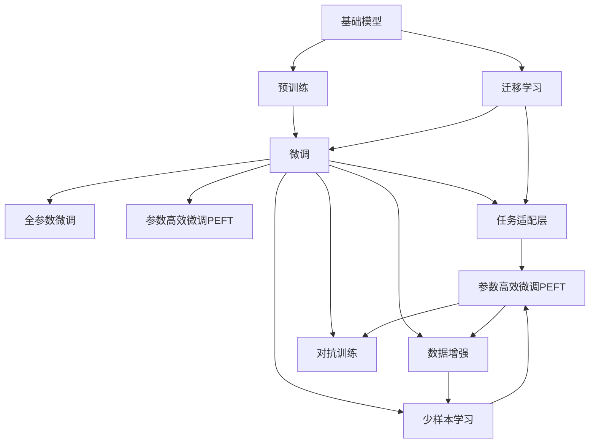
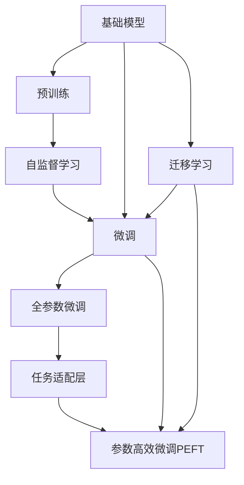
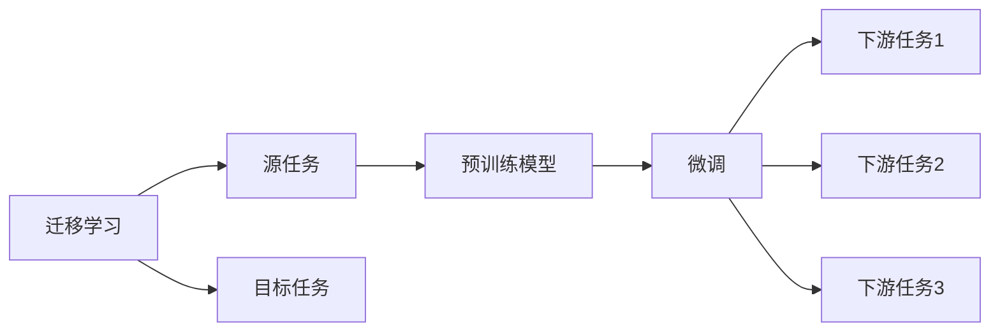
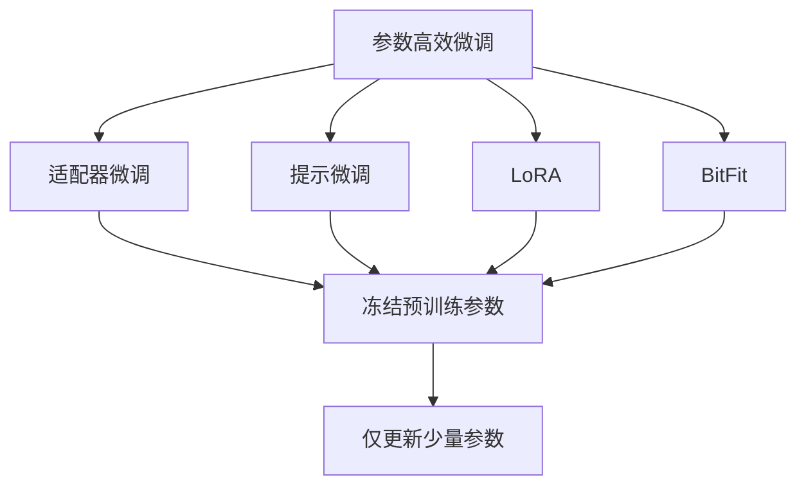
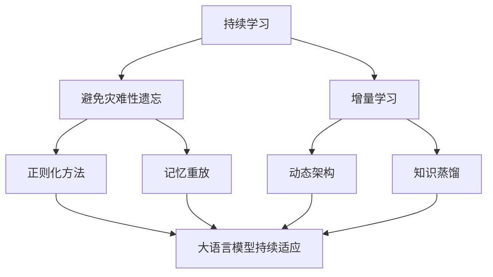
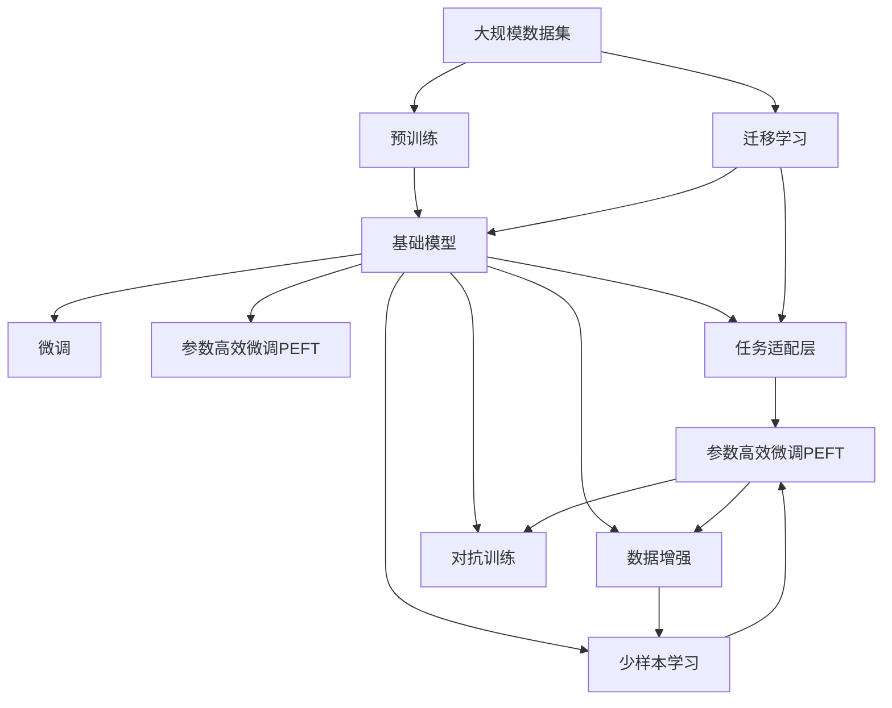

                 

# 使用基础模型构建应用程序的新书

## 1. 背景介绍

### 1.1 问题由来

近年来，随着人工智能(AI)技术的飞速发展，基础模型(Base Models)在构建应用程序中的应用变得越来越广泛。基础模型通常指使用较少的参数、较低的计算资源，但能够满足大部分通用任务需求的模型。相比于大规模的预训练模型，基础模型的开发和部署成本更低，但同样能够提供良好的性能。在实际应用中，基础模型在推理速度、模型大小、资源利用率等方面具有显著优势，成为构建高性能、高可扩展性应用程序的首选。

然而，由于基础模型参数量较小，如何高效地进行任务适配和优化，一直是摆在开发者面前的一大难题。如何在不增加计算负担的前提下，最大化基础模型的性能和应用范围，成为了当前的重点研究方向。此外，由于基础模型的架构相对简单，其在特定领域的微调往往存在较大困难。如何在大规模数据集上进行微调，同时保持模型的通用性，也是亟需解决的问题。

### 1.2 问题核心关键点

目前，使用基础模型构建应用程序的研究范式主要包括：
- 参数高效微调(Parameter-Efficient Fine-Tuning, PEFT)：在固定大部分预训练参数的情况下，只更新少量的模型参数，以提高微调效率。
- 任务适配层(Task Adapters)：根据具体任务需求，添加额外的任务层，保留基础模型参数不变，只更新任务层权重。
- 数据增强(Data Augmentation)：通过数据变换、合成等方法，扩充训练集，提高模型泛化能力。
- 迁移学习(Transfer Learning)：利用在大规模数据集上预训练的基础模型，在新任务上进行微调，减少新任务数据需求。
- 对抗训练(Adversarial Training)：引入对抗样本，提高模型鲁棒性，防止过拟合。
- 对抗生成网络(Generative Adversarial Networks, GANs)：通过生成对抗网络，生成合成数据，增强模型泛化能力。

这些技术手段旨在通过参数高效和计算高效的方式，最大化基础模型的性能，同时解决其在特定领域应用的难题。通过深入研究这些技术，可以有效地构建高性能的应用程序，满足各种复杂需求。

### 1.3 问题研究意义

研究使用基础模型构建应用程序的方法，对于拓展基础模型的应用范围，提升应用程序性能，加速AI技术产业化进程，具有重要意义：

1. 降低开发成本。基础模型的开发和部署成本远低于大规模预训练模型，能够显著减少数据、计算和人力等成本投入。
2. 提高性能。通过高效的微调方法，基础模型在特定任务上能够取得优异的性能。
3. 加速开发进度。使用基础模型可以快速适配新任务，缩短开发周期。
4. 实现少样本学习。利用基础模型的语言理解能力，通过精心设计的输入文本格式，实现零样本或少样本学习，减少对标注数据的依赖。
5. 促进技术创新。微调范式促进了对基础模型的深入研究，催生了少样本学习、对抗生成网络等新的研究方向。
6. 支持多样化的应用场景。基础模型在推理速度、模型大小等方面具有优势，能够满足多样化的应用需求，如自然语言处理、计算机视觉、机器人控制等。

## 2. 核心概念与联系

### 2.1 核心概念概述

为更好地理解使用基础模型构建应用程序的方法，本节将介绍几个密切相关的核心概念：

- 基础模型(Base Models)：指参数量较小、计算资源较低，但能够满足大部分通用任务需求的模型。常见的基础模型包括LeNet、AlexNet、VGG、ResNet等。
- 预训练(Pre-training)：指在大规模数据集上，通过自监督学习任务训练模型，学习通用的特征表示。常见的预训练任务包括分类、检测、分割等。
- 微调(Fine-tuning)：指在预训练模型的基础上，使用小规模标注数据，通过有监督学习优化模型在特定任务上的性能。
- 参数高效微调(Parameter-Efficient Fine-Tuning, PEFT)：指在微调过程中，只更新少量的模型参数，而固定大部分预训练权重不变，以提高微调效率。
- 迁移学习(Transfer Learning)：指将在大规模数据集上预训练的模型，应用于新任务上的微调，减少新任务数据需求。
- 对抗生成网络(Generative Adversarial Networks, GANs)：由生成器和判别器组成的模型，通过对抗训练，生成逼真的合成数据，增强模型泛化能力。
- 对抗训练(Adversarial Training)：通过引入对抗样本，提高模型的鲁棒性，防止过拟合。
- 数据增强(Data Augmentation)：通过对训练数据进行变换、合成等操作，扩充训练集，提高模型泛化能力。
- 任务适配层(Task Adapters)：根据具体任务需求，添加额外的任务层，保留基础模型参数不变，只更新任务层权重。
- 少样本学习(Few-shot Learning)：指在只有少量标注样本的情况下，模型能够快速适应新任务。

这些核心概念之间的逻辑关系可以通过以下Mermaid流程图来展示：



这个流程图展示了大语言模型微调的完整生态系统。其中，基础模型通过预训练获得了通用的特征表示，通过微调优化模型在特定任务上的性能，通过参数高效微调和任务适配层进一步提升微调效率，同时利用数据增强、对抗训练和少样本学习等技术手段，提高模型的泛化能力和鲁棒性。

### 2.2 概念间的关系

这些核心概念之间存在着紧密的联系，形成了使用基础模型构建应用程序的完整生态系统。下面我们通过几个Mermaid流程图来展示这些概念之间的关系。

#### 2.2.1 基础模型构建范式



这个流程图展示了基础模型的构建流程。基础模型通过在大规模数据集上进行预训练，学习通用的特征表示，然后在特定任务上进行微调，通过全参数微调或参数高效微调，优化模型在特定任务上的性能，同时利用迁移学习，减少新任务数据需求。

#### 2.2.2 迁移学习与微调的关系



这个流程图展示了迁移学习的基本原理，以及它与微调的关系。迁移学习涉及源任务和目标任务，预训练模型在源任务上学习，然后通过微调适应各种下游任务（目标任务）。

#### 2.2.3 参数高效微调方法



这个流程图展示了几种常见的参数高效微调方法，包括适配器微调、提示微调、LoRA和BitFit。这些方法的共同特点是冻结大部分预训练参数，只更新少量参数，从而提高微调效率。

#### 2.2.4 持续学习在大语言模型中的应用



这个流程图展示了持续学习在大语言模型中的应用。持续学习的主要目标是避免灾难性遗忘和实现增量学习。通过正则化方法、记忆重放、动态架构和知识蒸馏等技术，可以使大语言模型持续适应新的任务和数据。

### 2.3 核心概念的整体架构

最后，我们用一个综合的流程图来展示这些核心概念在大语言模型微调过程中的整体架构：



这个综合流程图展示了从预训练到微调，再到持续学习的完整过程。基础模型首先在大规模数据集上进行预训练，然后通过微调（包括全参数微调和参数高效微调）或迁移学习适应新任务，同时利用数据增强、对抗训练和少样本学习等技术手段，提高模型的泛化能力和鲁棒性。

## 3. 核心算法原理 & 具体操作步骤
### 3.1 算法原理概述

使用基础模型构建应用程序，本质上是一个有监督的细粒度迁移学习过程。其核心思想是：将基础模型视作一个强大的"特征提取器"，通过在小规模标注数据上进行有监督学习，优化模型在特定任务上的性能。

形式化地，假设基础模型为 $M_{\theta}$，其中 $\theta$ 为预训练得到的模型参数。给定下游任务 $T$ 的标注数据集 $D=\{(x_i, y_i)\}_{i=1}^N$，微调的目标是找到新的模型参数 $\hat{\theta}$，使得：

$$
\hat{\theta}=\mathop{\arg\min}_{\theta} \mathcal{L}(M_{\theta},D)
$$

其中 $\mathcal{L}$ 为针对任务 $T$ 设计的损失函数，用于衡量模型预测输出与真实标签之间的差异。常见的损失函数包括交叉熵损失、均方误差损失等。

通过梯度下降等优化算法，微调过程不断更新模型参数 $\theta$，最小化损失函数 $\mathcal{L}$，使得模型输出逼近真实标签。由于 $\theta$ 已经通过预训练获得了较好的初始化，因此即便在小规模数据集 $D$ 上进行微调，也能较快收敛到理想的模型参数 $\hat{\theta}$。

### 3.2 算法步骤详解

使用基础模型构建应用程序一般包括以下几个关键步骤：

**Step 1: 准备预训练模型和数据集**
- 选择合适的基础模型 $M_{\theta}$ 作为初始化参数，如LeNet、AlexNet等。
- 准备下游任务 $T$ 的标注数据集 $D$，划分为训练集、验证集和测试集。一般要求标注数据与预训练数据的分布不要差异过大。

**Step 2: 添加任务适配层**
- 根据任务类型，在基础模型顶层设计合适的输出层和损失函数。
- 对于分类任务，通常在顶层添加线性分类器和交叉熵损失函数。
- 对于生成任务，通常使用语言模型的解码器输出概率分布，并以负对数似然为损失函数。

**Step 3: 设置微调超参数**
- 选择合适的优化算法及其参数，如 AdamW、SGD 等，设置学习率、批大小、迭代轮数等。
- 设置正则化技术及强度，包括权重衰减、Dropout、Early Stopping 等。
- 确定冻结基础模型参数的策略，如仅微调顶层，或全部参数都参与微调。

**Step 4: 执行梯度训练**
- 将训练集数据分批次输入模型，前向传播计算损失函数。
- 反向传播计算参数梯度，根据设定的优化算法和学习率更新模型参数。
- 周期性在验证集上评估模型性能，根据性能指标决定是否触发 Early Stopping。
- 重复上述步骤直到满足预设的迭代轮数或 Early Stopping 条件。

**Step 5: 测试和部署**
- 在测试集上评估微调后模型 $M_{\hat{\theta}}$ 的性能，对比微调前后的精度提升。
- 使用微调后的模型对新样本进行推理预测，集成到实际的应用系统中。
- 持续收集新的数据，定期重新微调模型，以适应数据分布的变化。

以上是使用基础模型构建应用程序的一般流程。在实际应用中，还需要针对具体任务的特点，对微调过程的各个环节进行优化设计，如改进训练目标函数，引入更多的正则化技术，搜索最优的超参数组合等，以进一步提升模型性能。

### 3.3 算法优缺点

使用基础模型构建应用程序的方法具有以下优点：
1. 简单高效。只需准备少量标注数据，即可对基础模型进行快速适配，获得较大的性能提升。
2. 通用适用。适用于各种NLP下游任务，包括分类、匹配、生成等，设计简单的任务适配层即可实现微调。
3. 参数高效。利用参数高效微调技术，在固定大部分预训练参数的情况下，仍可取得不错的提升。
4. 效果显著。在学术界和工业界的诸多任务上，使用基础模型微调的方法已经刷新了最先进的性能指标。

同时，该方法也存在一定的局限性：
1. 依赖标注数据。微调的效果很大程度上取决于标注数据的质量和数量，获取高质量标注数据的成本较高。
2. 迁移能力有限。当目标任务与基础模型的预训练数据分布差异较大时，微调的性能提升有限。
3. 负面效果传递。基础模型的固有偏见、有害信息等，可能通过微调传递到下游任务，造成负面影响。
4. 可解释性不足。微调模型的决策过程通常缺乏可解释性，难以对其推理逻辑进行分析和调试。

尽管存在这些局限性，但就目前而言，使用基础模型构建应用程序的方法仍是最主流范式。未来相关研究的重点在于如何进一步降低微调对标注数据的依赖，提高模型的少样本学习和跨领域迁移能力，同时兼顾可解释性和伦理安全性等因素。

### 3.4 算法应用领域

使用基础模型构建应用程序的方法在NLP领域已经得到了广泛的应用，覆盖了几乎所有常见任务，例如：

- 文本分类：如情感分析、主题分类、意图识别等。通过微调使模型学习文本-标签映射。
- 命名实体识别：识别文本中的人名、地名、机构名等特定实体。通过微调使模型掌握实体边界和类型。
- 关系抽取：从文本中抽取实体之间的语义关系。通过微调使模型学习实体-关系三元组。
- 问答系统：对自然语言问题给出答案。将问题-答案对作为微调数据，训练模型学习匹配答案。
- 机器翻译：将源语言文本翻译成目标语言。通过微调使模型学习语言-语言映射。
- 文本摘要：将长文本压缩成简短摘要。将文章-摘要对作为微调数据，使模型学习抓取要点。
- 对话系统：使机器能够与人自然对话。将多轮对话历史作为上下文，微调模型进行回复生成。

除了上述这些经典任务外，使用基础模型的微调方法也被创新性地应用到更多场景中，如可控文本生成、常识推理、代码生成、数据增强等，为NLP技术带来了全新的突破。随着预训练模型和微调方法的不断进步，相信NLP技术将在更广阔的应用领域大放异彩。

## 4. 数学模型和公式 & 详细讲解 & 举例说明
### 4.1 数学模型构建

本节将使用数学语言对使用基础模型构建应用程序的过程进行更加严格的刻画。

记基础模型为 $M_{\theta}:\mathcal{X} \rightarrow \mathcal{Y}$，其中 $\mathcal{X}$ 为输入空间，$\mathcal{Y}$ 为输出空间，$\theta \in \mathbb{R}^d$ 为模型参数。假设微调任务的训练集为 $D=\{(x_i,y_i)\}_{i=1}^N, x_i \in \mathcal{X}, y_i \in \mathcal{Y}$。

定义模型 $M_{\theta}$ 在数据样本 $(x,y)$ 上的损失函数为 $\ell(M_{\theta}(x),y)$，则在数据集 $D$ 上的经验风险为：

$$
\mathcal{L}(\theta) = \frac{1}{N} \sum_{i=1}^N \ell(M_{\theta}(x_i),y_i)
$$

微调的优化目标是最小化经验风险，即找到最优参数：

$$
\theta^* = \mathop{\arg\min}_{\theta} \mathcal{L}(\theta)
$$

在实践中，我们通常使用基于梯度的优化算法（如SGD、Adam等）来近似求解上述最优化问题。设 $\eta$ 为学习率，$\lambda$ 为正则化系数，则参数的更新公式为：

$$
\theta \leftarrow \theta - \eta \nabla_{\theta}\mathcal{L}(\theta) - \eta\lambda\theta
$$

其中 $\nabla_{\theta}\mathcal{L}(\theta)$ 为损失函数对参数 $\theta$ 的梯度，可通过反向传播算法高效计算。

### 4.2 公式推导过程

以下我们以二分类任务为例，推导交叉熵损失函数及其梯度的计算公式。

假设模型 $M_{\theta}$ 在输入 $x$ 上的输出为 $\hat{y}=M_{\theta}(x) \in [0,1]$，表示样本属于正类的概率。真实标签 $y \in \{0,1\}$。则二分类交叉熵损失函数定义为：

$$
\ell(M_{\theta}(x),y) = -[y\log \hat{y} + (1-y)\log (1-\hat{y})]
$$

将其代入经验风险公式，得：

$$
\mathcal{L}(\theta) = -\frac{1}{N}\sum_{i=1}^N [y_i\log M_{\theta}(x_i)+(1-y_i)\log(1-M_{\theta}(x_i))]
$$

根据链式法则，损失函数对参数 $\theta_k$ 的梯度为：

$$
\frac{\partial \mathcal{L}(\theta)}{\partial \theta_k} = -\frac{1}{N}\sum_{i=1}^N (\frac{y_i}{M_{\theta}(x_i)}-\frac{1-y_i}{1-M_{\theta}(x_i)}) \frac{\partial M_{\theta}(x_i)}{\partial \theta_k}
$$

其中 $\frac{\partial M_{\theta}(x_i)}{\partial \theta_k}$ 可进一步递归展开，利用自动微分技术完成计算。

在得到损失函数的梯度后，即可带入参数更新公式，完成模型的迭代优化。重复上述过程直至收敛，最终得到适应下游任务的最优模型参数 $\theta^*$。

### 4.3 案例分析与讲解

下面以一个具体的案例，展示使用基础模型构建情感分类系统的全过程。

假设我们使用LeNet模型进行情感分类任务的微调。首先，我们收集了一个电影评论数据集，其中包含了对每部电影的评论文本和情感标签。然后，我们使用DataLoader将数据集划分为训练集、验证集和测试集。

接下来，我们定义了微调的训练和评估函数：

```python
import torch
from torch.utils.data import DataLoader
from torch import nn
from torch import optim
from torchvision.models import LeNet
from sklearn.metrics import accuracy_score
from sklearn.model_selection import train_test_split

# 定义模型
model = LeNet()

# 定义损失函数和优化器
criterion = nn.CrossEntropyLoss()
optimizer = optim.SGD(model.parameters(), lr=0.001, momentum=0.9)

# 定义训练函数
def train_epoch(model, data_loader, criterion, optimizer):
    model.train()
    total_loss = 0
    for data, target in data_loader:
        optimizer.zero_grad()
        output = model(data)
        loss = criterion(output, target)
        loss.backward()
        optimizer.step()
        total_loss += loss.item()
    return total_loss / len(data_loader)

# 定义评估函数
def evaluate(model, data_loader, criterion):
    model.eval()
    total_loss = 0
    total_correct = 0
    with torch.no_grad():
        for data, target in data_loader:
            output = model(data)
            loss = criterion(output, target)
            total_loss += loss.item()
            _, predicted = output.max(1)
            total_correct += (predicted == target).sum().item()
    return total_correct / len(data_loader.dataset)

# 划分数据集
train_dataset, test_dataset = train_test_split(data, test_size=0.2, random_state=42)
train_loader = DataLoader(train_dataset, batch_size=64, shuffle=True)
test_loader = DataLoader(test_dataset, batch_size=64, shuffle=False)

# 训练模型
num_epochs = 10
for epoch in range(num_epochs):
    train_loss = train_epoch(model, train_loader, criterion, optimizer)
    test_acc = evaluate(model, test_loader, criterion)
    print(f'Epoch {epoch+1}, train loss: {train_loss:.4f}, test acc: {test_acc:.4f}')
```

在训练过程中，我们使用了交叉熵损失函数和随机梯度下降优化器。训练函数中，我们首先设定了学习率、动量等超参数，然后通过模型前向传播计算损失函数，反向传播更新模型参数，最后输出训练损失。在评估函数中，我们通过模型前向传播计算预测结果和损失，统计正确率，并返回评估指标。

通过训练和评估函数，我们逐步优化模型参数，最终在测试集上获得了较高的准确率。这个案例展示了使用基础模型进行情感分类任务微调的基本流程，体现了参数高效微调和简单高效的计算优势。

## 5. 项目实践：代码实例和详细解释说明
### 5.1 开发环境搭建

在进行基础模型微调实践前，我们需要准备好开发环境。以下是使用Python进行PyTorch开发的环境配置流程：

1. 安装Anaconda：从官网下载并安装Anaconda，用于创建独立的Python环境。

2. 创建并激活虚拟环境：
```bash
conda create -n pytorch-env python=3.8 
conda activate pytorch-env
```

3. 安装PyTorch：根据CUDA版本，从官网获取对应的安装命令。例如：
```bash
conda install pytorch torchvision torchaudio cudatoolkit=11.1 -c pytorch -c conda-forge
```

4. 安装Transformer库：
```bash
pip install transformers
```

5. 安装各类工具包：
```bash
pip install numpy pandas scikit-learn matplotlib tqdm jupyter notebook ipython
```

完成上述步骤后，即可在`pytorch-env`环境中开始基础模型微调实践。

### 5.2 源代码详细实现

这里我们以命名实体识别(NER)任务为例，给出使用Transformer库对基础模型进行微调的PyTorch代码实现。

首先，定义NER任务的数据处理函数：

```python
from transformers import BertTokenizer
from torch.utils.data import Dataset
import torch

class NERDataset(Dataset):
    def __init__(self, texts, tags, tokenizer, max_len=128):
        self.texts = texts
        self.tags = tags
        self.tokenizer = tokenizer
        self.max_len = max_len
        
    def __len__(self):
        return len(self.texts)
    
    def __getitem__(self, item):
        text = self.texts[item]
        tags = self.tags[item]
        
        encoding = self.tokenizer(text, return_tensors='pt', max_length=self.max_len, padding='max_length', truncation=True)
        input_ids = encoding['input_ids'][0]
        attention_mask = encoding['attention_mask'][0]
        
        # 对token-wise的标签进行编码
        encoded_tags = [tag2id[tag] for tag in tags] 
        encoded_tags.extend([tag2id['O']] * (self.max_len - len(encoded_tags)))
        labels = torch.tensor(encoded_tags, dtype=torch.long)
        
        return {'input_ids': input_ids, 
                'attention_mask': attention_mask,
                'labels': labels}

# 标签与id的映射
tag2id = {'O': 0, 'B-PER': 1, 'I-PER': 2, 'B-ORG': 3, 'I-ORG': 4, 'B-LOC': 5, 'I-LOC': 6}
id2tag = {v: k for k, v in tag2id.items()}

# 创建dataset
tokenizer = BertTokenizer.from_pretrained('bert-base-cased')

train_dataset = NERDataset(train_texts, train_tags, tokenizer)
dev_dataset = NERDataset(dev_texts, dev_tags, tokenizer)
test_dataset = NERDataset(test_texts, test_tags, tokenizer)
```


