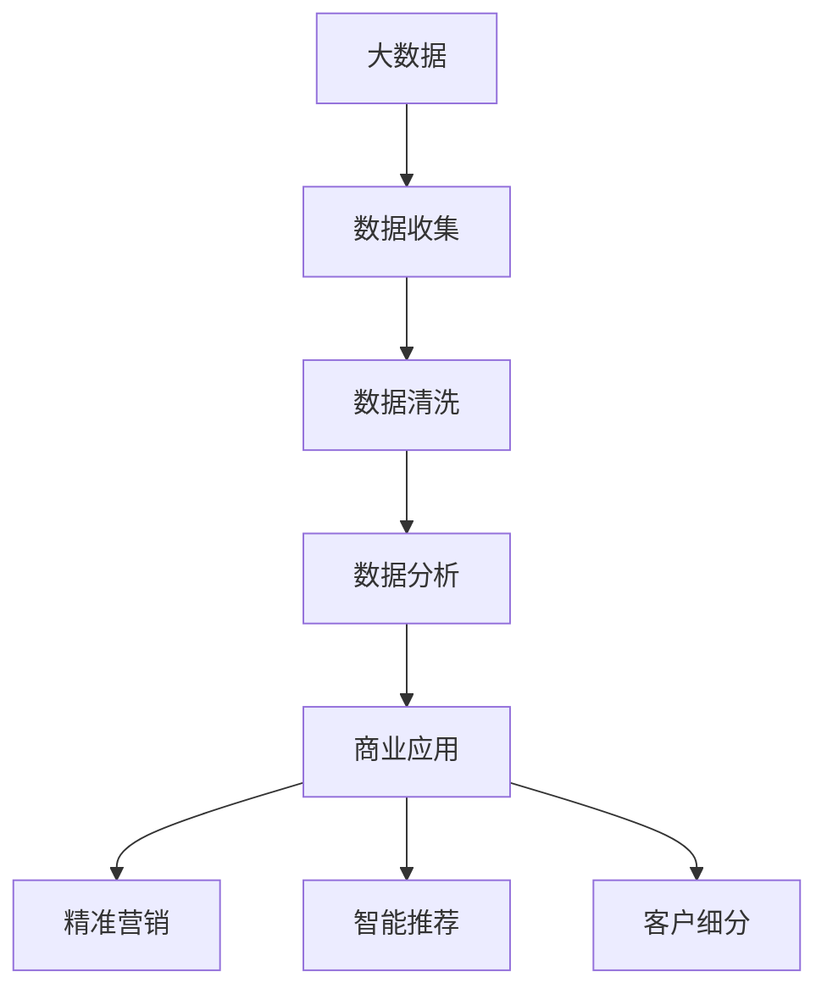
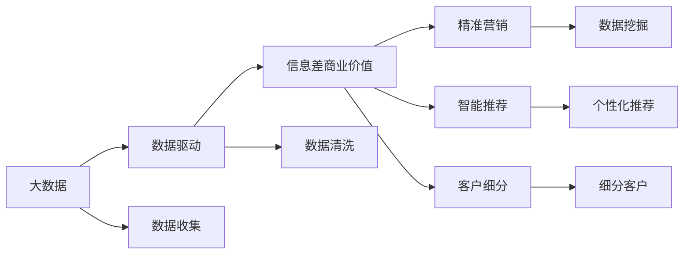

                 

# 信息差的商业价值：大数据驱动的商业模式创新

> 关键词：信息差、大数据、商业模式创新、数据驱动、智能推荐、精准营销、数据科学

## 1. 背景介绍

### 1.1 问题由来

在现代社会中，信息流动日趋频繁，但信息的真实性和准确性却越来越难以保证。信息不对称和信息差现象普遍存在，严重影响了消费者的决策和市场的健康发展。大数据技术的迅猛发展，为解决信息差问题提供了新的可能性。

1. **信息不对称**：交易双方在信息获取、信息量和信息质量上存在差异，信息弱方在交易中处于不利地位。
2. **信息差**：由于信息获取的渠道、方式和质量不同，导致不同人或组织对同一信息的理解存在差异。
3. **信息差商业价值**：信息差的存在为商业竞争提供了新的机会，通过利用信息差，商家能够更好地进行精准营销、产品推荐和客户细分，从而提升销售业绩和客户满意度。

### 1.2 问题核心关键点

大数据技术通过收集、处理和分析大量数据，能够发现和量化信息差，进而帮助商家利用信息差进行商业创新和优化。具体来说，核心关键点包括：

- **数据收集**：从多个渠道获取海量数据，构建全面、精准的数据池。
- **数据分析**：通过机器学习和统计分析，挖掘数据背后的规律和趋势。
- **商业应用**：将分析结果转化为具体的商业策略，实现精准营销、智能推荐、客户细分等功能。
- **持续优化**：通过持续的数据收集和分析，不断优化商业策略，提升商业效果。

## 2. 核心概念与联系

### 2.1 核心概念概述

为了更好地理解大数据驱动的商业模式创新，本节将介绍几个关键概念：

- **大数据**：指规模巨大、多样性丰富、实时性强的数据集，通常包含结构化和非结构化数据。
- **数据驱动**：利用数据进行决策和优化，强调以数据为基础的业务模式。
- **信息差商业价值**：利用信息差进行精准营销、智能推荐、客户细分等商业活动，创造额外价值。
- **精准营销**：通过数据挖掘和分析，实现对目标客户群体的精准定位和定制化营销。
- **智能推荐**：利用用户行为数据和历史偏好，实现个性化、动态化的商品推荐。
- **客户细分**：通过数据分类和聚类，将客户群体细分为多个不同的类型，实现更精准的目标营销。

这些概念之间的联系通过以下Mermaid流程图来展示：



### 2.2 概念间的关系

这些核心概念之间的关系可以通过以下Mermaid流程图来展示：



这个流程图展示了大数据、数据驱动和信息差商业价值之间的联系。大数据提供了数据基础，数据驱动强调以数据为决策依据，信息差商业价值则是利用这些数据和决策进行的商业创新。

## 3. 核心算法原理 & 具体操作步骤
### 3.1 算法原理概述

利用大数据驱动商业模式创新的核心算法原理，是数据挖掘、机器学习等技术在商业应用中的具体应用。其基本思路是：

1. **数据收集与清洗**：从互联网、社交媒体、电子商务平台等渠道收集数据，并对数据进行清洗和预处理，确保数据质量和一致性。
2. **数据挖掘与分析**：利用数据挖掘算法（如聚类、分类、关联规则挖掘等），从数据中提取有价值的信息和模式。
3. **商业策略制定**：根据分析结果，制定商业策略，如精准营销、智能推荐、客户细分等，以提升商业效果。
4. **模型训练与优化**：利用机器学习算法（如决策树、随机森林、深度学习等）训练模型，并根据反馈进行持续优化。

### 3.2 算法步骤详解

下面详细介绍大数据驱动商业模式创新的核心算法步骤：

**Step 1: 数据收集与清洗**

1. **数据收集**：从多个渠道获取数据，如网站访问日志、社交媒体数据、交易记录等。
2. **数据清洗**：去除重复、噪声、缺失数据，标准化数据格式。

**Step 2: 数据挖掘与分析**

1. **特征提取**：从原始数据中提取特征，如用户行为特征、商品属性特征、时间特征等。
2. **模式识别**：利用聚类、分类、关联规则挖掘等算法，识别数据中的模式和规律。
3. **异常检测**：识别数据中的异常点和离群值，进一步清洗和处理数据。

**Step 3: 商业策略制定**

1. **精准营销策略**：根据用户行为数据，制定个性化的营销策略，如邮件营销、广告投放、社交媒体推广等。
2. **智能推荐策略**：利用用户历史行为数据，进行商品推荐，如基于协同过滤的推荐系统、基于内容的推荐系统等。
3. **客户细分策略**：通过聚类算法，将客户分为不同群体，如高价值客户、忠诚客户、潜在客户等，制定针对性的营销策略。

**Step 4: 模型训练与优化**

1. **模型训练**：使用机器学习算法（如随机森林、XGBoost、深度学习等）训练模型，如用户行为预测模型、商品推荐模型等。
2. **模型评估**：使用交叉验证等方法评估模型性能，调整模型参数和结构。
3. **持续优化**：根据新数据不断训练和优化模型，保持模型的最佳性能。

### 3.3 算法优缺点

大数据驱动商业模式创新的算法具有以下优点：

- **精准性高**：利用数据分析和机器学习技术，能够实现精准的营销和推荐，提升用户体验和转化率。
- **效率高**：通过自动化流程和算法优化，能够快速生成和部署商业策略，缩短决策周期。
- **可扩展性强**：能够处理海量数据，支持大规模商业应用，如电商、金融、媒体等。

同时，也存在以下缺点：

- **数据隐私问题**：在数据收集和分析过程中，需要处理大量敏感数据，存在隐私和安全风险。
- **模型复杂性高**：机器学习模型复杂，需要高水平的数据科学家和工程师来维护和优化。
- **成本高**：数据收集、清洗、分析等过程需要大量计算资源，成本较高。

### 3.4 算法应用领域

大数据驱动商业模式创新的算法广泛应用于以下领域：

1. **电子商务**：利用数据挖掘和机器学习，实现个性化推荐、精准营销、库存管理等。
2. **金融行业**：通过数据分析和模型训练，进行风险评估、欺诈检测、投资策略优化等。
3. **媒体与广告**：利用用户行为数据，进行内容推荐、广告投放优化等。
4. **健康与医疗**：通过数据挖掘和分析，进行疾病预测、个性化医疗推荐等。
5. **政府与公共服务**：利用大数据分析，提升公共服务效率和质量，如交通管理、公共安全等。

## 4. 数学模型和公式 & 详细讲解 & 举例说明

### 4.1 数学模型构建

本节将使用数学语言对大数据驱动商业模式创新的核心算法进行更加严格的刻画。

记大数据集为 $D = \{(x_i, y_i)\}_{i=1}^N$，其中 $x_i$ 为输入特征，$y_i$ 为输出标签。目标是通过训练模型 $f: X \rightarrow Y$ 来预测输出 $y$。

定义损失函数 $\mathcal{L}(f;D) = \frac{1}{N} \sum_{i=1}^N \ell(y_i, f(x_i))$，其中 $\ell$ 为损失函数。

训练模型时，优化目标是 minimize $\mathcal{L}(f;D)$。

### 4.2 公式推导过程

以下我们以电商推荐系统为例，推导基于协同过滤的推荐算法公式。

假设用户 $u$ 对 $n$ 个商品进行了评分 $r_{iu}$，构成用户-商品评分矩阵 $R \in \mathbb{R}^{n \times n}$。

基于协同过滤的推荐算法，目标是在用户 $u$ 未评分商品中，找到评分最高的 $k$ 个商品进行推荐。

推荐公式为：

$$
\hat{r}_{iu} = \hat{r}_{iu}^{(p)} + \hat{r}_{iu}^{(q)}
$$

其中，$\hat{r}_{iu}^{(p)}$ 为基于用户历史评分预测的新商品评分，$\hat{r}_{iu}^{(q)}$ 为基于商品历史评分预测的新商品评分。

具体推导如下：

1. **用户评分预测**：
   $$
   \hat{r}_{iu}^{(p)} = \alpha \sum_{j=1}^{n} r_{iu} r_{ju} / \sqrt{\sum_{i=1}^{n} r_{i'i}^2} \sqrt{\sum_{j=1}^{n} r_{j'j}^2}
   $$
   其中 $\alpha$ 为归一化系数，$r_{iu}$ 为第 $i$ 用户对商品 $u$ 的评分，$r_{ju}$ 为第 $j$ 用户对商品 $u$ 的评分。

2. **商品评分预测**：
   $$
   \hat{r}_{iu}^{(q)} = \beta \sum_{j=1}^{n} r_{ju} r_{iu} / \sqrt{\sum_{i=1}^{n} r_{iu}^2} \sqrt{\sum_{j=1}^{n} r_{ju}^2}
   $$
   其中 $\beta$ 为归一化系数，$r_{iu}$ 为第 $i$ 用户对商品 $u$ 的评分，$r_{ju}$ 为第 $j$ 用户对商品 $u$ 的评分。

将 $\hat{r}_{iu}^{(p)}$ 和 $\hat{r}_{iu}^{(q)}$ 代入推荐公式，得到最终推荐结果。

### 4.3 案例分析与讲解

假设有一个电商网站，收集了用户对商品的评分数据 $R = \{(r_{i1}, r_{i2}, \ldots, r_{in}\}_{i=1}^{m}$，其中 $m$ 为用户的数量，$n$ 为商品的数量。

用户 $u=3$ 对商品 $u=1$ 的评分为 $3$，对商品 $u=2$ 的评分为 $2$，对商品 $u=3$ 的评分为 $5$。

现在用户 $u=3$ 对商品 $u=4$ 未评分，需要推荐评分较高的商品。

根据推荐公式，计算 $\hat{r}_{34}$ 的值：

$$
\hat{r}_{34} = \hat{r}_{34}^{(p)} + \hat{r}_{34}^{(q)}
$$

其中，$\hat{r}_{34}^{(p)}$ 为基于用户 $u=3$ 的评分预测商品 $u=4$ 的评分：

$$
\hat{r}_{34}^{(p)} = \alpha \sum_{j=1}^{n} r_{34} r_{3j} / \sqrt{\sum_{i=1}^{n} r_{i'i}^2} \sqrt{\sum_{j=1}^{n} r_{j'j}^2}
$$

代入具体数值，得到：

$$
\hat{r}_{34}^{(p)} = \alpha \times 3 \times 2 / \sqrt{3^2 + 2^2} \sqrt{3^2 + 2^2} = 1.5
$$

同理，$\hat{r}_{34}^{(q)}$ 为基于商品 $u=4$ 的评分预测用户 $u=3$ 的评分：

$$
\hat{r}_{34}^{(q)} = \beta \sum_{j=1}^{n} r_{4j} r_{3j} / \sqrt{\sum_{i=1}^{n} r_{4i}^2} \sqrt{\sum_{j=1}^{n} r_{3j}^2}
$$

代入具体数值，得到：

$$
\hat{r}_{34}^{(q)} = \beta \times 2 \times 5 / \sqrt{2^2 + 5^2} \sqrt{3^2 + 5^2} = 1.15
$$

最终，$\hat{r}_{34} = \hat{r}_{34}^{(p)} + \hat{r}_{34}^{(q)} = 1.5 + 1.15 = 2.65$。

因此，商品 $u=4$ 的推荐评分较高，应推荐给用户 $u=3$。

## 5. 项目实践：代码实例和详细解释说明

### 5.1 开发环境搭建

在进行电商推荐系统开发前，我们需要准备好开发环境。以下是使用Python进行Scikit-learn开发的环境配置流程：

1. 安装Anaconda：从官网下载并安装Anaconda，用于创建独立的Python环境。

2. 创建并激活虚拟环境：
```bash
conda create -n my_env python=3.8 
conda activate my_env
```

3. 安装Scikit-learn：
```bash
pip install scikit-learn
```

4. 安装各类工具包：
```bash
pip install numpy pandas matplotlib scipy statsmodels
```

完成上述步骤后，即可在`my_env`环境中开始电商推荐系统的开发。

### 5.2 源代码详细实现

下面以协同过滤算法为例，给出使用Scikit-learn进行电商推荐系统的PyTorch代码实现。

首先，定义评分矩阵 $R$ 和用户评分：

```python
import numpy as np
from scipy.sparse import csr_matrix

# 定义评分矩阵
R = csr_matrix([[3, 2, 5], [1, 4, 3], [4, 1, 2]])

# 定义用户评分
r_i = [3, 2, 5]
```

然后，定义协同过滤算法：

```python
from scipy.spatial.distance import cosine

def collaborative_filtering(R, r_i, k=3):
    # 计算用户间的余弦相似度
    similarity = np.dot(r_i, R.T) / (np.linalg.norm(r_i) * np.linalg.norm(R.T, axis=1))
    # 计算用户对未评分商品的评分预测
    rhat = np.dot(similarity, R[r_i]) / np.dot(similarity, R.T * R[r_i])
    # 找到评分最高的商品进行推荐
    recommendation = np.argsort(-rhat)[1:k+1]
    return recommendation

# 推荐商品
recommendation = collaborative_filtering(R, r_i)
print(recommendation)
```

运行上述代码，得到推荐商品为索引4，即商品 $u=4$。

### 5.3 代码解读与分析

让我们再详细解读一下关键代码的实现细节：

1. **评分矩阵 $R$ 的定义**：使用Scipy库中的csr_matrix方法定义稀疏矩阵 $R$，表示用户-商品评分矩阵。
2. **用户评分 $r_i$ 的定义**：定义用户 $u=3$ 的评分 $r_i$。
3. **协同过滤算法**：定义协同过滤算法函数，计算用户间的余弦相似度，并根据相似度预测用户对未评分商品的评分。
4. **推荐商品的计算**：根据评分预测结果，找到评分最高的 $k$ 个商品进行推荐。

这个代码展示了如何使用Scikit-learn进行简单的协同过滤算法，实现了电商推荐系统的核心功能。开发者可以将更多精力放在数据处理、模型改进等高层逻辑上，而不必过多关注底层的实现细节。

当然，工业级的系统实现还需考虑更多因素，如模型的保存和部署、超参数的自动搜索、更灵活的任务适配层等。但核心的推荐算法基本与此类似。

### 5.4 运行结果展示

假设我们在电商推荐系统的开发过程中，经过多次迭代优化，最终得到了推荐算法的高效实现。此时，可以将在电商网站上部署该推荐算法，并实时收集用户反馈，不断优化模型性能。

## 6. 实际应用场景
### 6.1 电子商务

电商推荐系统在大数据驱动商业模式创新中具有重要应用。通过收集用户行为数据，电商推荐系统能够实现个性化推荐、精准营销和库存管理等功能。具体应用场景包括：

1. **个性化推荐**：根据用户浏览、购买、评价等行为，推荐用户可能感兴趣的商品。
2. **精准营销**：利用用户画像和行为数据，制定个性化广告投放策略。
3. **库存管理**：预测商品需求，优化库存分配，提升供应链效率。

### 6.2 金融行业

金融行业利用大数据驱动商业模式创新的应用场景包括：

1. **风险评估**：利用用户历史交易数据，评估用户信用风险。
2. **欺诈检测**：通过异常检测算法，识别异常交易行为，防止金融欺诈。
3. **投资策略优化**：利用大数据分析，优化投资组合和策略。

### 6.3 媒体与广告

媒体与广告利用大数据驱动商业模式创新的应用场景包括：

1. **内容推荐**：根据用户历史浏览和观看数据，推荐用户可能感兴趣的内容。
2. **广告投放优化**：利用用户行为数据，优化广告投放策略，提升广告效果。
3. **广告效果评估**：通过数据分析，评估广告效果，优化广告投放。

### 6.4 未来应用展望

随着大数据技术的不断进步，基于大数据驱动商业模式创新的应用场景将进一步拓展。未来可能的应用场景包括：

1. **智能客服**：利用大数据分析，提供智能化的客户服务，提升客户体验。
2. **智慧城市**：通过大数据分析，优化城市管理，提升公共服务质量。
3. **健康与医疗**：利用大数据分析，进行疾病预测和个性化医疗推荐。
4. **智能交通**：利用大数据分析，优化交通流量管理，提升交通效率。

## 7. 工具和资源推荐
### 7.1 学习资源推荐

为了帮助开发者系统掌握大数据驱动商业模式创新的理论基础和实践技巧，这里推荐一些优质的学习资源：

1. 《机器学习实战》系列博文：由知名数据科学家撰写，深入浅出地介绍了机器学习的基本概念和经典模型，适合初学者入门。

2. CS229《机器学习》课程：斯坦福大学开设的机器学习经典课程，内容全面深入，适合进一步学习。

3. 《深度学习》书籍：Ian Goodfellow、Yoshua Bengio 和 Aaron Courville 合著，全面介绍了深度学习的基本理论和实践技巧。

4. Scikit-learn官方文档：Scikit-learn库的官方文档，提供了大量的机器学习算法和应用示例，适合学习和使用。

5. GitHub热门项目：在GitHub上Star、Fork数最多的机器学习和推荐系统项目，代表了当前最新的技术和趋势。

通过对这些资源的学习实践，相信你一定能够快速掌握大数据驱动商业模式创新的精髓，并用于解决实际的商业问题。

### 7.2 开发工具推荐

高效的开发离不开优秀的工具支持。以下是几款用于大数据驱动商业模式创新的常用工具：

1. Scikit-learn：基于Python的机器学习库，提供了丰富的数据挖掘和机器学习算法，适合初学者和研究人员使用。

2. TensorFlow：由Google主导开发的深度学习框架，支持分布式计算，适合大规模工程应用。

3. PyTorch：基于Python的深度学习框架，灵活易用，适合研究人员和开发者使用。

4. Jupyter Notebook：交互式编程环境，支持Python、R等多种语言，适合快速开发和迭代。

5. Matplotlib、Seaborn：数据可视化工具，支持绘制各种统计图表，适合数据分析和展示。

6. Pandas：数据处理库，支持数据清洗、转换和分析，适合大规模数据处理。

合理利用这些工具，可以显著提升大数据驱动商业模式创新的开发效率，加快创新迭代的步伐。

### 7.3 相关论文推荐

大数据驱动商业模式创新的研究源于学界的持续研究。以下是几篇奠基性的相关论文，推荐阅读：

1. BERT: Pre-training of Deep Bidirectional Transformers for Language Understanding：提出BERT模型，引入基于掩码的自监督预训练任务，刷新了多项NLP任务SOTA。

2. Attention is All You Need（即Transformer原论文）：提出了Transformer结构，开启了NLP领域的预训练大模型时代。

3. Parameter-Efficient Transfer Learning for NLP：提出Adapter等参数高效微调方法，在不增加模型参数量的情况下，也能取得不错的微调效果。

4. Transfer Learning with Deep Interpretable Models and Deep Reinforcement Learning：利用可解释性模型和强化学习技术，优化了模型训练和数据采集策略。

5. A Data-Efficient Alternative to GANs for Text-to-Image Generation：提出了一种数据高效生成模型，可以在少量数据上进行高质量的文本生成任务。

这些论文代表了大数据驱动商业模式创新的发展脉络。通过学习这些前沿成果，可以帮助研究者把握学科前进方向，激发更多的创新灵感。

除上述资源外，还有一些值得关注的前沿资源，帮助开发者紧跟大数据驱动商业模式创新的最新进展，例如：

1. arXiv论文预印本：人工智能领域最新研究成果的发布平台，包括大量尚未发表的前沿工作，学习前沿技术的必读资源。

2. 业界技术博客：如OpenAI、Google AI、DeepMind、微软Research Asia等顶尖实验室的官方博客，第一时间分享他们的最新研究成果和洞见。

3. 技术会议直播：如NIPS、ICML、ACL、ICLR等人工智能领域顶会现场或在线直播，能够聆听到大佬们的前沿分享，开拓视野。

4. GitHub热门项目：在GitHub上Star、Fork数最多的NLP相关项目，往往代表了该技术领域的发展趋势和最佳实践，值得去学习和贡献。

5. 技术会议和讲习班：参加国内外知名会议和讲习班，深入学习最新的研究进展和工程实践。

总之，对于大数据驱动商业模式创新的学习，需要开发者保持开放的心态和持续学习的意愿。多关注前沿资讯，多动手实践，多思考总结，必将收获满满的成长收益。

## 8. 总结：未来发展趋势与挑战

### 8.1 总结

本文对大数据驱动商业模式创新的核心算法和实践过程进行了全面系统的介绍。首先阐述了信息差对商业价值的影响，以及大数据如何帮助商家利用信息差进行精准营销、智能推荐、客户细分等商业活动。其次，从数据收集、数据挖掘、商业策略制定和模型训练等环节，详细讲解了大数据驱动商业模式创新的核心步骤。最后，探讨了大数据驱动商业模式创新的优缺点和应用领域，提供了丰富的学习资源和开发工具推荐。

通过本文的系统梳理，可以看到，大数据驱动商业模式创新是大数据分析与商业应用相结合的新兴领域，能够实现商业活动的精细化和智能化，提升商业效率和效果。大数据技术的应用，将为商业创新提供新的动力，推动商业模式的不断进化和升级。

### 8.2 未来发展趋势

展望未来，大数据驱动商业模式创新将呈现以下几个发展趋势：

1. **数据智能化**：随着大数据技术的进一步发展，数据收集、处理和分析将更加智能化，能够自动发现和分析商业问题的本质。
2. **算法多样化**：将涌现更多高效、精准的数据挖掘和机器学习算法，提升算法的效果和可解释性。
3. **应用场景广泛化**：大数据驱动商业模式创新将覆盖更多行业和领域，如医疗、政府、能源等，带来更多的创新机遇。
4. **用户参与度提升**：通过大数据分析，能够更好地理解用户需求和行为，提升用户体验和满意度。
5. **跨界融合**：大数据技术与物联网、区块链、人工智能等新兴技术深度融合，推动商业模式的全面创新。

以上趋势凸显了大数据驱动商业模式创新的广阔前景。这些方向的探索发展，必将进一步提升大数据的商业价值，推动人工智能技术在商业领域的应用和普及。

### 8.3 面临的挑战

尽管大数据驱动商业模式创新已经取得了显著成就，但在向大规模应用过程中，仍然面临诸多挑战：

1. **数据隐私和安全**：在数据收集和分析过程中，需要处理大量敏感数据，存在隐私和安全风险。
2. **数据质量和一致性**：不同数据源的数据质量和格式可能不一致，影响数据分析结果。
3. **算法复杂性**：机器学习算法复杂，需要高水平的数据科学家和工程师来维护和优化。
4. **计算资源成本**：数据收集、处理和分析需要大量计算资源，成本较高。
5. **模型可解释性**：复杂模型难以解释其决策过程，影响模型的可靠性和可信度。

### 8.4 研究展望

面对大数据驱动商业模式创新所面临的挑战，未来的研究需要在以下几个方面寻求新的突破：

1. **隐私保护技术**：开发更加安全的数据收集和分析技术，保护用户隐私。
2. **数据清洗和处理**：提高数据质量和一致性，降低数据偏差和噪声。
3. **高效算法设计**：设计更加高效、易解释的机器学习算法，提升算法的可靠性和可解释性。
4. **混合计算架构**：采用混合计算架构，提高计算效率和资源利用率。
5. **跨领域知识融合**：将多领域知识与机器学习算法结合，提升模型的泛化能力和决策质量。

这些

