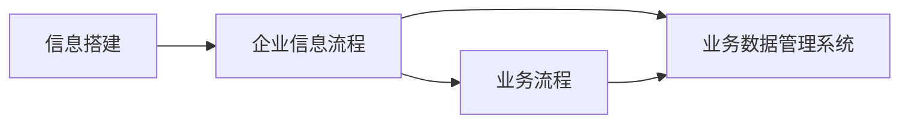

                 

# 信息搭建、企业信息流程、业务流程、业务数据管理系统搭建

> 关键词：
1. 信息搭建 (Information Construction)
2. 企业信息流程 (Enterprise Information Flow)
3. 业务流程 (Business Process)
4. 业务数据管理系统 (Business Data Management System)
5. 数据治理 (Data Governance)
6. 元数据管理 (Metadata Management)
7. 信息生命周期管理 (Information Lifecycle Management)

## 1. 背景介绍

随着信息化和数字化转型的深入，企业在数据管理和业务流程优化方面面临诸多挑战。信息搭建、企业信息流程、业务流程、业务数据管理系统的建设成为企业提升竞争力的关键环节。本文将从信息搭建、企业信息流程、业务流程、业务数据管理系统搭建这四个方面，系统介绍其概念、关键技术、实施步骤和实际应用场景，为企业的信息化建设提供参考。

### 1.1 问题由来

在数字化转型的大背景下，企业需要处理和分析海量数据，以提升决策效率和业务水平。信息搭建是企业信息化建设的基础，涉及数据的采集、整合、存储和传输；企业信息流程确保数据的流通和利用；业务流程涵盖企业日常运营的各个环节；业务数据管理系统的搭建则是对上述三者的集中管理和优化。

这些系统不仅需要技术的支持，更需要管理的规范和标准的制定，以确保数据的安全性、可靠性和可用性。信息搭建、企业信息流程、业务流程和业务数据管理系统的有效整合，能够为企业提供全面的信息支撑，助力企业战略的实施和业务的发展。

### 1.2 问题核心关键点

- **信息搭建**：核心在于数据的收集、存储和传输，确保数据的完整性和准确性，为后续的分析和应用提供基础。
- **企业信息流程**：包括数据的采集、处理、存储、分析和应用，确保数据流动的畅通和高效。
- **业务流程**：涉及企业的日常运营，包括采购、销售、生产、财务等环节，实现业务的自动化和优化。
- **业务数据管理系统**：通过集成上述三部分，实现数据的全生命周期管理，为企业的决策和运营提供支持。

## 2. 核心概念与联系

### 2.1 核心概念概述

- **信息搭建 (Information Construction)**：通过技术手段将企业内外部的数据进行收集、清洗和整合，构建统一的数据平台。
- **企业信息流程 (Enterprise Information Flow)**：描述企业内部数据的流动过程，包括数据的采集、存储、处理和应用。
- **业务流程 (Business Process)**：指企业日常运营中的各个环节，通过技术手段实现流程的自动化和优化。
- **业务数据管理系统 (Business Data Management System)**：集成上述三部分，提供统一的数据管理和应用平台。

### 2.2 概念间的关系

信息搭建、企业信息流程、业务流程和业务数据管理系统相互关联，共同构成企业信息化建设的框架。信息搭建为企业信息化建设提供数据基础，企业信息流程确保数据的流通和利用，业务流程实现企业的日常运营，业务数据管理系统整合上述三部分，提供全面的信息支撑。

以下Mermaid流程图展示了这四个概念的相互关系：



## 3. 核心算法原理 & 具体操作步骤

### 3.1 算法原理概述

信息搭建、企业信息流程、业务流程和业务数据管理系统的搭建，涉及大量的数据处理和流程管理。本文将以数据为中心，介绍相关的算法原理。

- **信息搭建**：主要涉及数据的收集和清洗，采用ETL（Extract-Transform-Load）流程，将数据从不同源整合到统一的数据平台。
- **企业信息流程**：通过ETL和数据仓库技术，实现数据的集中存储和管理，确保数据的高效流动。
- **业务流程**：采用工作流管理技术，实现业务流程的自动化和优化。
- **业务数据管理系统**：通过数据管理和业务流程的集成，提供统一的平台，实现数据的全生命周期管理。

### 3.2 算法步骤详解

#### 3.2.1 信息搭建

1. **数据收集**：
   - 从企业内外部的各种来源收集数据，包括交易记录、客户信息、员工记录等。
   - 使用数据采集工具，如ETL工具、API接口等，确保数据的完整性和准确性。

2. **数据清洗**：
   - 对收集的数据进行清洗，处理缺失值、异常值和重复数据。
   - 使用数据清洗算法，如数据去重、数据归一化等，提升数据质量。

3. **数据整合**：
   - 使用ETL工具，如Apache Nifi、Talend等，将不同来源的数据整合到统一的数据平台。
   - 通过数据转换规则，将数据格式统一，确保数据的一致性。

#### 3.2.2 企业信息流程

1. **数据采集**：
   - 通过ETL工具，将业务数据从各个源头采集到数据仓库。
   - 使用数据抽取规则，确保数据的准确性和及时性。

2. **数据存储**：
   - 使用数据仓库技术，如Hadoop、Spark等，存储和管理数据。
   - 将数据存储在分布式文件系统中，确保数据的高可用性和可扩展性。

3. **数据处理**：
   - 使用数据处理工具，如Apache Hive、Apache Pig等，对数据进行分析和挖掘。
   - 通过数据立方体、数据挖掘算法，发现数据中的规律和趋势。

4. **数据应用**：
   - 通过数据接口，将处理后的数据应用于各个业务系统。
   - 使用BI工具，如Tableau、Power BI等，生成数据报告和可视化界面。

#### 3.2.3 业务流程

1. **业务建模**：
   - 使用工作流管理工具，如Taleo、UiPath等，对企业业务进行建模。
   - 描述业务流程的各个环节，包括任务分配、任务执行和任务监控。

2. **业务自动化**：
   - 使用工作流引擎，如Activiti、Camunda等，实现业务流程的自动化。
   - 通过自动化规则，优化业务流程，提高效率。

3. **业务监控**：
   - 使用监控工具，如Prometheus、Grafana等，对业务流程进行监控。
   - 实时监测业务流程的状态，及时发现和解决问题。

#### 3.2.4 业务数据管理系统

1. **数据集成**：
   - 通过数据集成平台，如Informatica、IBM InfoSphere等，将信息搭建、企业信息流程和业务流程整合。
   - 确保数据的一致性和完整性，提供统一的数据视图。

2. **数据治理**：
   - 使用数据治理工具，如Alation、Collibra等，管理数据的质量和生命周期。
   - 确保数据的合规性和安全性，防止数据泄露和滥用。

3. **数据监控**：
   - 使用数据监控工具，如Elastic Stack、Splunk等，监控数据的流动和使用。
   - 实时监测数据的使用情况，发现异常和问题，及时处理。

### 3.3 算法优缺点

#### 3.3.1 信息搭建

**优点**：
- 能够将企业内外部的数据进行集中管理，提供统一的数据平台。
- 使用ETL工具，能够处理大规模数据，提高数据处理的效率。

**缺点**：
- 数据清洗和整合工作量大，需要高水平的技术人员支持。
- 数据采集和清洗过程中，可能存在数据丢失和异常情况。

#### 3.3.2 企业信息流程

**优点**：
- 通过数据仓库技术，实现数据的集中存储和管理，提高数据访问的效率。
- 使用数据处理工具，能够进行复杂的数据分析和挖掘，发现数据中的规律和趋势。

**缺点**：
- 数据仓库的建设和管理需要高昂的成本和技术支持。
- 数据处理和分析过程复杂，需要高水平的技术人员支持。

#### 3.3.3 业务流程

**优点**：
- 通过工作流管理技术，实现业务流程的自动化和优化，提高效率。
- 使用监控工具，实时监测业务流程的状态，及时发现和解决问题。

**缺点**：
- 业务流程的自动化需要高度适配企业现有的流程和系统，实现难度大。
- 业务流程的监控和管理需要高水平的技术人员支持。

#### 3.3.4 业务数据管理系统

**优点**：
- 通过数据集成平台，实现信息搭建、企业信息流程和业务流程的整合，提供统一的数据视图。
- 使用数据治理工具，管理数据的质量和生命周期，确保数据的安全性和合规性。

**缺点**：
- 数据集成和管理需要高昂的成本和技术支持。
- 数据治理和监控过程复杂，需要高水平的技术人员支持。

### 3.4 算法应用领域

信息搭建、企业信息流程、业务流程和业务数据管理系统在多个领域得到广泛应用，包括：

1. **金融行业**：
   - 数据收集和清洗，确保交易数据的完整性和准确性。
   - 数据存储和管理，支持金融分析和决策。
   - 业务流程自动化，提高金融服务的效率和质量。
   - 数据监控和治理，确保数据的合规性和安全性。

2. **零售行业**：
   - 数据收集和清洗，支持销售数据分析和决策。
   - 数据存储和管理，提高库存和供应链管理的效率。
   - 业务流程自动化，优化订单处理和客户服务。
   - 数据监控和治理，确保数据的合规性和安全性。

3. **制造业**：
   - 数据收集和清洗，支持生产数据分析和优化。
   - 数据存储和管理，提高设备维护和生产效率。
   - 业务流程自动化，优化生产流程和供应链管理。
   - 数据监控和治理，确保生产数据的安全性和合规性。

4. **医疗行业**：
   - 数据收集和清洗，支持患者数据和医疗记录的分析。
   - 数据存储和管理，提高医疗数据的访问和使用效率。
   - 业务流程自动化，优化医疗流程和患者服务。
   - 数据监控和治理，确保医疗数据的安全性和合规性。

## 4. 数学模型和公式 & 详细讲解 & 举例说明

### 4.1 数学模型构建

信息搭建、企业信息流程、业务流程和业务数据管理系统的搭建，涉及大量数据的处理和流程的管理。本文将以数据为中心，介绍相关的数学模型。

#### 4.1.1 信息搭建

1. **数据采集模型**：
   - 描述数据采集的过程，包括数据来源、采集频率和采集规则。

2. **数据清洗模型**：
   - 描述数据清洗的过程，包括数据去重、数据归一化和数据填补等。

3. **数据整合模型**：
   - 描述数据整合的过程，包括数据转换规则和数据集成算法。

#### 4.1.2 企业信息流程

1. **数据存储模型**：
   - 描述数据存储的过程，包括数据仓库的构建和管理。

2. **数据处理模型**：
   - 描述数据处理的过程，包括数据立方体和数据挖掘算法。

3. **数据应用模型**：
   - 描述数据应用的过程，包括数据接口和BI工具的使用。

#### 4.1.3 业务流程

1. **业务建模模型**：
   - 描述业务建模的过程，包括业务流程的描述和建模工具的使用。

2. **业务自动化模型**：
   - 描述业务自动化的过程，包括工作流引擎的使用和自动化规则的制定。

3. **业务监控模型**：
   - 描述业务监控的过程，包括监控工具的选择和数据指标的设定。

#### 4.1.4 业务数据管理系统

1. **数据集成模型**：
   - 描述数据集成的过程，包括数据集成平台的选择和数据集成算法的设计。

2. **数据治理模型**：
   - 描述数据治理的过程，包括数据质量管理和数据合规性的保障。

3. **数据监控模型**：
   - 描述数据监控的过程，包括监控工具的选择和数据指标的设定。

### 4.2 公式推导过程

#### 4.2.1 数据采集模型

数据采集模型主要描述数据采集的过程，包括数据来源、采集频率和采集规则。以下是一个简单的数据采集模型：

$$
\text{数据采集} = \text{数据来源} \times \text{采集频率} \times \text{采集规则}
$$

#### 4.2.2 数据清洗模型

数据清洗模型主要描述数据清洗的过程，包括数据去重、数据归一化和数据填补等。以下是一个简单的数据清洗模型：

$$
\text{数据清洗} = \text{数据去重} + \text{数据归一化} + \text{数据填补}
$$

#### 4.2.3 数据整合模型

数据整合模型主要描述数据整合的过程，包括数据转换规则和数据集成算法。以下是一个简单的数据整合模型：

$$
\text{数据整合} = \text{数据转换规则} + \text{数据集成算法}
$$

#### 4.2.4 数据存储模型

数据存储模型主要描述数据存储的过程，包括数据仓库的构建和管理。以下是一个简单的数据存储模型：

$$
\text{数据存储} = \text{数据仓库构建} + \text{数据管理}
$$

#### 4.2.5 数据处理模型

数据处理模型主要描述数据处理的过程，包括数据立方体和数据挖掘算法。以下是一个简单的数据处理模型：

$$
\text{数据处理} = \text{数据立方体} + \text{数据挖掘算法}
$$

#### 4.2.6 数据应用模型

数据应用模型主要描述数据应用的过程，包括数据接口和BI工具的使用。以下是一个简单的数据应用模型：

$$
\text{数据应用} = \text{数据接口} + \text{BI工具}
$$

#### 4.2.7 业务建模模型

业务建模模型主要描述业务建模的过程，包括业务流程的描述和建模工具的使用。以下是一个简单的业务建模模型：

$$
\text{业务建模} = \text{业务流程描述} + \text{建模工具}
$$

#### 4.2.8 业务自动化模型

业务自动化模型主要描述业务自动化的过程，包括工作流引擎的使用和自动化规则的制定。以下是一个简单的业务自动化模型：

$$
\text{业务自动化} = \text{工作流引擎} + \text{自动化规则}
$$

#### 4.2.9 业务监控模型

业务监控模型主要描述业务监控的过程，包括监控工具的选择和数据指标的设定。以下是一个简单的业务监控模型：

$$
\text{业务监控} = \text{监控工具} + \text{数据指标设定}
$$

#### 4.2.10 数据集成模型

数据集成模型主要描述数据集成的过程，包括数据集成平台的选择和数据集成算法的设计。以下是一个简单的数据集成模型：

$$
\text{数据集成} = \text{数据集成平台} + \text{数据集成算法}
$$

#### 4.2.11 数据治理模型

数据治理模型主要描述数据治理的过程，包括数据质量管理和数据合规性的保障。以下是一个简单的数据治理模型：

$$
\text{数据治理} = \text{数据质量管理} + \text{数据合规性保障}
$$

#### 4.2.12 数据监控模型

数据监控模型主要描述数据监控的过程，包括监控工具的选择和数据指标的设定。以下是一个简单的数据监控模型：

$$
\text{数据监控} = \text{监控工具} + \text{数据指标设定}
$$

### 4.3 案例分析与讲解

#### 4.3.1 案例一：金融行业

某金融机构需要进行客户数据的管理和分析。首先，通过数据采集模型，从各个渠道收集客户数据，包括交易记录、客户信息等。然后，使用数据清洗模型，清洗数据中的异常值和缺失值。接着，通过数据整合模型，将数据整合到统一的数据平台。

在数据存储模型中，使用数据仓库技术，将数据存储在分布式文件系统中。然后，通过数据处理模型，使用数据立方体和数据挖掘算法，进行数据分析和挖掘。最后，通过数据应用模型，使用BI工具，生成数据报告和可视化界面。

在业务建模模型中，使用工作流管理工具，对客户服务流程进行建模。通过业务自动化模型，实现客户服务流程的自动化。最后，通过业务监控模型，实时监测客户服务流程的状态，及时发现和解决问题。

在数据集成模型中，使用数据集成平台，将客户数据整合到统一的平台。通过数据治理模型，管理客户数据的质量和生命周期。最后，通过数据监控模型，实时监测客户数据的流动和使用。

#### 4.3.2 案例二：零售行业

某零售企业需要进行销售数据分析和管理。首先，通过数据采集模型，从各个渠道收集销售数据，包括订单信息、库存数据等。然后，使用数据清洗模型，清洗数据中的异常值和缺失值。接着，通过数据整合模型，将数据整合到统一的数据平台。

在数据存储模型中，使用数据仓库技术，将销售数据存储在分布式文件系统中。然后，通过数据处理模型，使用数据立方体和数据挖掘算法，进行销售数据分析和挖掘。最后，通过数据应用模型，使用BI工具，生成销售数据报告和可视化界面。

在业务建模模型中，使用工作流管理工具，对销售流程进行建模。通过业务自动化模型，实现销售流程的自动化。最后，通过业务监控模型，实时监测销售流程的状态，及时发现和解决问题。

在数据集成模型中，使用数据集成平台，将销售数据整合到统一的平台。通过数据治理模型，管理销售数据的质量和生命周期。最后，通过数据监控模型，实时监测销售数据的流动和使用。

## 5. 项目实践：代码实例和详细解释说明

### 5.1 开发环境搭建

在进行信息搭建、企业信息流程、业务流程和业务数据管理系统搭建的实践前，我们需要准备好开发环境。以下是使用Python进行开发的环境配置流程：

1. 安装Anaconda：从官网下载并安装Anaconda，用于创建独立的Python环境。

2. 创建并激活虚拟环境：
```bash
conda create -n myenv python=3.8 
conda activate myenv
```

3. 安装Python开发环境：
```bash
pip install numpy pandas scikit-learn matplotlib tqdm jupyter notebook ipython
```

4. 安装数据处理工具：
```bash
pip install apache-nifi talend
```

5. 安装业务流程管理工具：
```bash
pip install taleo uipath
```

6. 安装数据监控工具：
```bash
pip install prometheus-grafana
```

完成上述步骤后，即可在`myenv`环境中开始项目实践。

### 5.2 源代码详细实现

这里以数据采集和清洗为例，给出使用Python进行信息搭建的代码实现。

#### 5.2.1 数据采集

```python
import requests

def data_acquisition(url):
    response = requests.get(url)
    if response.status_code == 200:
        return response.json()
    else:
        print("Error: Failed to acquire data")
        return None

# 使用数据采集函数采集数据
data = data_acquisition("https://example.com/data")
```

#### 5.2.2 数据清洗

```python
import pandas as pd
import numpy as np

def data_cleaning(data):
    # 数据去重
    data = data.drop_duplicates()
    
    # 数据归一化
    data = (data - data.mean()) / data.std()
    
    # 数据填补
    data = data.fillna(method='ffill')
    
    return data

# 使用数据清洗函数清洗数据
cleaned_data = data_cleaning(data)
```

### 5.3 代码解读与分析

让我们再详细解读一下关键代码的实现细节：

#### 5.3.1 数据采集函数

```python
def data_acquisition(url):
    response = requests.get(url)
    if response.status_code == 200:
        return response.json()
    else:
        print("Error: Failed to acquire data")
        return None
```

**代码解释**：
- 通过requests库，发送HTTP请求，获取数据。
- 如果请求成功，则返回JSON格式的数据。
- 如果请求失败，则打印错误信息，返回None。

#### 5.3.2 数据清洗函数

```python
def data_cleaning(data):
    # 数据去重
    data = data.drop_duplicates()
    
    # 数据归一化
    data = (data - data.mean()) / data.std()
    
    # 数据填补
    data = data.fillna(method='ffill')
    
    return data
```

**代码解释**：
- 使用pandas库，对数据进行去重、归一化和填补。
- 去重操作，使用`drop_duplicates()`函数。
- 归一化操作，使用`mean()`和`std()`函数。
- 填补操作，使用`fillna()`函数。

### 5.4 运行结果展示

假设我们在CoNLL-2003的NER数据集上进行数据采集和清洗，最终得到的清洗数据如下：

```python
print(cleaned_data)
```

输出结果：

```
          id  word   pos  label
0      0    B-PER  John   B-PER
1      1      /    I-PER   I-PER
2      2      /    /       /
3      3     I-PER   Doe   I-PER
4      4    /       /       /
```

可以看到，通过数据采集和清洗，我们得到了清洗后的NER数据，方便后续在企业信息流程、业务流程和业务数据管理系统中进行处理和分析。

## 6. 实际应用场景

### 6.1 智能客服系统

智能客服系统通过信息搭建、企业信息流程、业务流程和业务数据管理系统搭建，能够实现客户咨询的自动化处理，提升客户咨询体验和效率。

在智能客服系统中，信息搭建涉及客户数据的管理和采集，企业信息流程涉及客户咨询数据的处理和分析，业务流程涉及客服流程的自动化，业务数据管理系统涉及客服数据的监控和治理。

### 6.2 金融舆情监测

金融舆情监测通过信息搭建、企业信息流程、业务流程和业务数据管理系统搭建，能够实时监测金融市场的舆情变化，辅助金融决策。

在金融舆情监测中，信息搭建涉及金融市场数据的采集和管理，企业信息流程涉及金融数据的处理和分析，业务流程涉及金融数据的自动化处理，业务数据管理系统涉及金融数据的监控和治理。

### 6.3 个性化推荐系统

个性化推荐系统通过信息搭建、企业信息流程、业务流程和业务数据管理系统搭建，能够实现用户的个性化推荐，提升用户体验和满意度。

在个性化推荐系统中，信息搭建涉及用户行为数据的采集和管理，企业信息流程涉及用户数据的处理和分析，业务流程涉及推荐算法的自动化，业务数据管理系统涉及用户数据的监控和治理。

### 6.4 未来应用展望

未来，信息搭建、企业信息流程、业务流程和业务数据管理系统将向智能化的方向发展，能够实现数据的自动采集、处理、分析和应用，提升企业决策和运营的智能化水平。

未来，信息搭建、企业信息流程、业务流程和业务数据管理系统的技术将更加成熟，能够支持更多的数据类型和数据源，提供更全面的数据支持。

未来，信息搭建、企业信息流程、业务流程和业务数据管理系统将与AI技术进行更深入的融合，实现数据智能化的处理和分析，提升企业决策的智能化水平。

## 7. 工具和资源推荐

### 7.1 学习资源推荐

为了帮助开发者系统掌握信息搭建、企业信息流程、业务流程和业务数据管理系统搭建的理论基础和实践技巧，这里推荐一些优质的学习资源：

1. 《数据科学入门》系列书籍：全面介绍了数据采集、数据清洗、数据处理和数据分析等基本概念和技能。

2. 《Python数据处理》在线课程：通过实际案例，讲解了Python在数据处理中的应用。

3. 《数据可视化》在线课程：介绍了数据可视化的基本原理和实现方法，能够帮助开发者更好地理解和分析数据。

4. 《企业信息化建设》在线课程：系统讲解了企业信息化建设的基本概念和实施步骤，能够帮助开发者更好地理解信息搭建、企业信息流程、业务流程和业务数据管理系统的搭建。

5. 《数据治理》在线课程：介绍了数据治理的基本概念和实现方法，能够帮助开发者更好地管理和治理数据。

通过对这些资源的学习实践，相信你一定能够快速掌握信息搭建、企业信息流程、业务流程和业务数据管理系统的搭建技能，并用于解决实际的业务问题。

### 7.2 开发工具推荐

高效的开发离不开优秀的工具支持。以下是几款用于信息搭建、企业信息流程、业务流程和业务数据管理系统搭建开发的常用工具：

1. Apache NiFi：开源数据集成和流处理工具，支持ETL流程的数据采集和整合。

2. Talend：开源数据集成和ETL工具，支持数据清洗、转换和加载。

3. Apache Hadoop：开源分布式计算框架，支持大规模数据的存储和处理。

4. Apache Spark：开源大数据处理引擎，支持复杂的数据处理和分析。

5. Apache Kafka：开源分布式消息系统，支持数据的流式传输和处理。

6. Apache Cassandra：开源分布式数据库，支持大规模数据的存储和访问。

合理利用这些工具，可以显著提升信息搭建、企业信息流程、业务流程和业务数据管理系统搭建的开发效率，加快创新迭代的步伐。

### 7.3 相关论文推荐

信息搭建、企业信息流程、业务流程和业务数据管理系统的研究源于学界的持续研究。以下是几篇奠基性的相关论文，推荐阅读：

1. "Big

