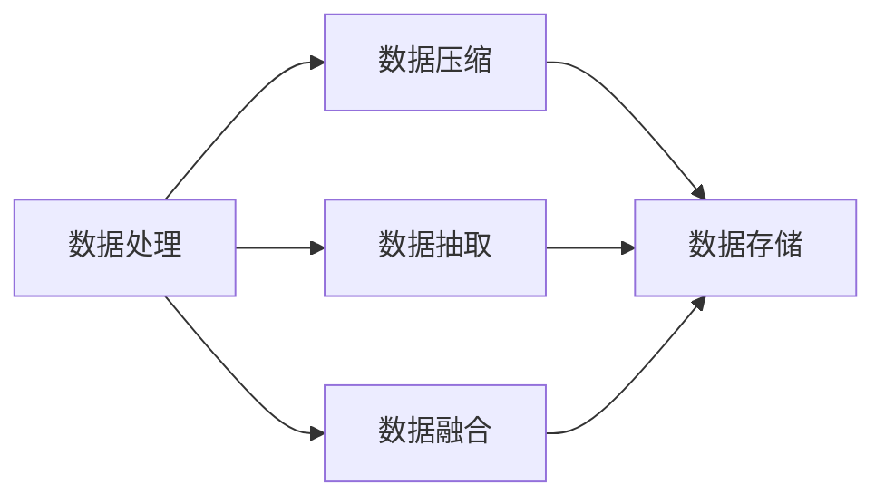
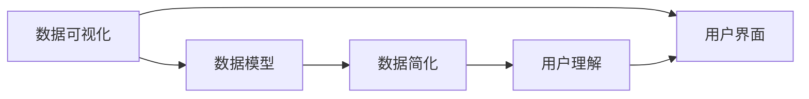
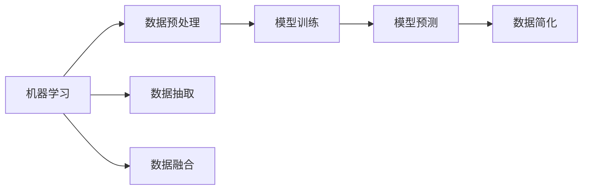
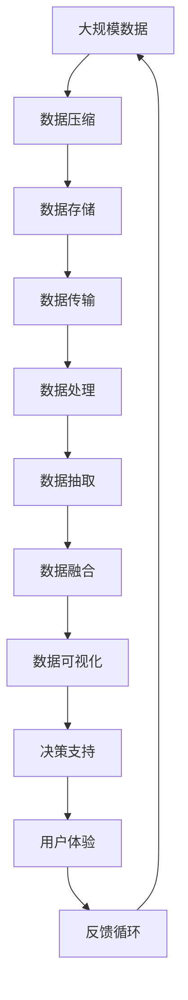

                 

# 信息简化的艺术与科学：在混乱和复杂中找到简单和秩序

## 1. 背景介绍

在信息技术迅猛发展的今天，数据量和信息量的爆炸性增长带来了前所未有的挑战。海量数据带来了巨大的信息红利，但同时也增加了信息的复杂度和处理难度。如何在浩瀚的数据海洋中找到简洁和有序的信息，成为了信息科技领域的一项重要课题。信息简化技术就是通过减少信息的复杂度和冗余度，使信息变得更加简明、易于理解和操作，从而提高信息处理效率和质量。

### 1.1 问题由来

随着互联网、物联网的普及，各类数据源不断增加，数据种类日益多样化，数据量呈现指数级增长。这不仅增加了数据存储和处理的难度，也使得用户在处理大量数据时，容易陷入信息的泥潭中，难以快速找到有用信息。此外，随着人工智能、大数据等技术的发展，复杂的数据模型和算法层出不穷，这进一步增加了信息处理的复杂度。如何在海量数据中找到有价值的信息，如何使复杂的数据模型更加易于理解和操作，成为了信息科技领域亟需解决的挑战。

### 1.2 问题核心关键点

信息简化的核心在于如何在复杂和混乱的信息中找到简单和有序的模型和结构。信息简化涉及数据压缩、数据抽取、数据融合等多个环节，最终目标是使数据模型更加简洁、易于理解和使用。以下是信息简化的几个关键点：

- 数据压缩：通过算法和编码技术，减少数据的存储空间，降低数据处理的复杂度。
- 数据抽取：从复杂的数据集中，提取有价值的、易于理解的信息。
- 数据融合：将不同来源、不同格式的数据融合到一起，形成完整统一的数据视图。
- 数据可视化：通过图表、仪表盘等工具，将复杂的数据模型转换为直观、易于理解的形式。

这些关键点在实际应用中通常需要结合使用，才能达到理想的信息简化效果。

### 1.3 问题研究意义

信息简化的研究对于提升信息处理效率、优化决策支持系统、改善用户体验等方面具有重要意义：

1. 提升信息处理效率。通过信息简化技术，减少数据的复杂度和冗余度，降低数据处理的计算资源消耗，加速信息处理的效率。
2. 优化决策支持系统。简化后的数据模型更加易于理解和操作，帮助决策者快速抓住关键信息，做出精准的决策。
3. 改善用户体验。简化后的信息更加直观、易于理解，使用户可以更快地获取和使用信息，提高用户满意度。
4. 推动数据科学发展。信息简化技术是数据科学的重要组成部分，能够促进数据挖掘、数据分析等领域的理论和技术进步。
5. 促进数据共享与合作。简化后的数据更加易于共享和集成，有助于不同组织之间的数据合作和知识共享。

## 2. 核心概念与联系

### 2.1 核心概念概述

为了更好地理解信息简化的核心技术，本节将介绍几个密切相关的核心概念：

- 数据压缩(Data Compression)：通过算法和编码技术，减少数据的存储空间，降低数据处理的复杂度。常用的数据压缩算法包括Huffman编码、LZ77、LZ78、LZW、DEFLATE、Bzip2、Gzip、LZMA、Snappy、Zstandard等。
- 数据抽取(Data Extraction)：从复杂的数据集中，提取有价值的、易于理解的信息。数据抽取技术常用于信息检索、文本挖掘、数据清洗等领域。
- 数据融合(Data Fusion)：将不同来源、不同格式的数据融合到一起，形成完整统一的数据视图。数据融合技术常用于数据融合、数据同化等领域。
- 数据可视化(Data Visualization)：通过图表、仪表盘等工具，将复杂的数据模型转换为直观、易于理解的形式。数据可视化技术常用于业务智能(BI)、报表制作等领域。
- 机器学习(Machine Learning)：通过算法和模型，从数据中学习规律和知识，实现对未知数据的预测和分类。机器学习技术常用于推荐系统、金融风控、医疗诊断等领域。
- 深度学习(Deep Learning)：通过多层神经网络，学习数据的深层次特征和模式。深度学习技术常用于图像识别、自然语言处理、语音识别等领域。
- 自然语言处理(Natural Language Processing, NLP)：使计算机能够理解、处理和生成自然语言。NLP技术常用于智能客服、机器翻译、问答系统等领域。

这些核心概念之间存在着紧密的联系，形成了信息简化的完整生态系统。下面通过一个Mermaid流程图来展示这些概念之间的联系：


这个流程图展示了从数据压缩到用户体验的全过程，数据经过压缩、抽取、融合、可视化等环节后，最终被用于决策支持和用户体验提升。

### 2.2 概念间的关系

这些核心概念之间存在着紧密的联系，形成了信息简化的完整生态系统。下面通过几个Mermaid流程图来展示这些概念之间的关系：

#### 2.2.1 数据处理与信息简化



这个流程图展示了数据处理与信息简化之间的关系。数据处理通过压缩、抽取、融合等环节，使数据变得更加简洁和有序，从而实现信息简化。

#### 2.2.2 数据可视化与信息简化



这个流程图展示了数据可视化的作用。数据可视化通过图表、仪表盘等工具，将复杂的数据模型转换为直观、易于理解的形式，使用户能够更快速、准确地获取和使用信息。

#### 2.2.3 机器学习与信息简化



这个流程图展示了机器学习在信息简化中的作用。机器学习通过数据预处理、模型训练等环节，学习数据的规律和模式，生成简化的数据模型，从而实现信息简化。

### 2.3 核心概念的整体架构

最后，我们用一个综合的流程图来展示这些核心概念在信息简化的整体架构：



这个综合流程图展示了从数据压缩到用户体验的全过程，数据经过压缩、抽取、融合、可视化等环节后，最终被用于决策支持和用户体验提升，并形成反馈循环，不断优化信息简化的效果。

## 3. 核心算法原理 & 具体操作步骤

### 3.1 算法原理概述

信息简化的核心算法主要包括数据压缩、数据抽取、数据融合、数据可视化等。这些算法通过不同的技术和方法，实现信息的简化和有序化。

- 数据压缩算法：通过算法和编码技术，减少数据的存储空间，降低数据处理的复杂度。
- 数据抽取算法：从复杂的数据集中，提取有价值的、易于理解的信息。
- 数据融合算法：将不同来源、不同格式的数据融合到一起，形成完整统一的数据视图。
- 数据可视化算法：通过图表、仪表盘等工具，将复杂的数据模型转换为直观、易于理解的形式。

这些算法的实现原理和具体操作步骤将在后续章节中详细介绍。

### 3.2 算法步骤详解

#### 3.2.1 数据压缩算法

数据压缩算法通过算法和编码技术，减少数据的存储空间，降低数据处理的复杂度。常用的数据压缩算法包括：

- Huffman编码：基于字符频率统计，生成最优的编码树，实现字符的压缩。
- LZ77、LZ78、LZW：利用文本的重复性，实现文本的压缩。
- DEFLATE、Bzip2、Gzip、LZMA、Snappy、Zstandard：结合字典编码和LZ77算法，实现高效的数据压缩。

这些算法的基本步骤如下：

1. 读取原始数据。
2. 统计数据中各字符的出现频率。
3. 根据频率生成编码表。
4. 将原始数据按照编码表进行编码，生成压缩后的数据。
5. 将编码表和压缩后的数据一起保存。
6. 读取压缩后的数据和编码表，解码生成原始数据。

#### 3.2.2 数据抽取算法

数据抽取算法从复杂的数据集中，提取有价值的、易于理解的信息。常用的数据抽取算法包括：

- 自然语言处理(NLP)：通过分词、词性标注、句法分析等技术，从文本中抽取信息。
- 关系抽取：通过抽取实体关系，提取有价值的信息。
- 信息检索：通过关键词匹配、文本相似度计算等技术，从文本库中抽取相关信息。

这些算法的基本步骤如下：

1. 读取原始数据。
2. 对数据进行预处理，如分词、去停用词等。
3. 应用抽取算法，提取相关信息。
4. 对抽取的信息进行清洗、去重、格式化等处理。
5. 将抽取的信息保存为结构化数据。

#### 3.2.3 数据融合算法

数据融合算法将不同来源、不同格式的数据融合到一起，形成完整统一的数据视图。常用的数据融合算法包括：

- 数据同化：将不同来源的数据进行标准化处理，使数据格式一致。
- 数据合并：将不同来源的数据按照一定规则合并在一起。
- 数据关联：通过关联规则，将不同数据源中的数据关联起来。

这些算法的基本步骤如下：

1. 读取不同来源的数据。
2. 对数据进行预处理，如数据标准化、数据清洗等。
3. 应用数据融合算法，将数据融合到一起。
4. 对融合后的数据进行合并、关联等处理。
5. 将融合后的数据保存为结构化数据。

#### 3.2.4 数据可视化算法

数据可视化算法通过图表、仪表盘等工具，将复杂的数据模型转换为直观、易于理解的形式。常用的数据可视化算法包括：

- 折线图：展示数据随时间变化的趋势。
- 散点图：展示两个变量之间的关系。
- 柱状图：展示数据的分布情况。
- 饼图：展示数据的组成比例。
- 热力图：展示数据的密度分布情况。
- 地图：展示地理空间数据。

这些算法的基本步骤如下：

1. 读取数据。
2. 对数据进行预处理，如数据清洗、数据转换等。
3. 应用数据可视化算法，将数据转换为可视化图表。
4. 展示可视化图表，提供直观、易于理解的信息。

### 3.3 算法优缺点

数据压缩算法：

- 优点：减少数据存储空间，降低数据传输和处理成本。
- 缺点：压缩率有限，压缩后的数据可能包含冗余信息。

数据抽取算法：

- 优点：提取有价值的、易于理解的信息，提高信息利用效率。
- 缺点：数据抽取过程复杂，可能出现信息丢失或偏差。

数据融合算法：

- 优点：整合不同来源的数据，形成完整统一的数据视图。
- 缺点：数据格式不一致，需要大量预处理和标准化工作。

数据可视化算法：

- 优点：提供直观、易于理解的信息，帮助用户快速获取关键信息。
- 缺点：可视化效果受数据质量影响，可能存在误导性。

机器学习算法：

- 优点：通过算法和模型，学习数据的规律和模式，实现数据简化。
- 缺点：算法复杂，需要大量数据和计算资源。

深度学习算法：

- 优点：通过多层神经网络，学习数据的深层次特征和模式，实现数据简化。
- 缺点：算法复杂，需要大量数据和计算资源。

### 3.4 算法应用领域

数据压缩算法广泛应用于文件存储、网络传输、数据备份等领域，如压缩PDF、ZIP文件、HTTP请求、数据库备份等。

数据抽取算法常用于信息检索、文本挖掘、数据清洗等领域，如搜索引擎、新闻推荐系统、社交媒体分析等。

数据融合算法常用于数据同化、数据合并、数据关联等领域，如金融数据分析、医疗数据整合、地理空间数据融合等。

数据可视化算法常用于业务智能(BI)、报表制作、数据展示等领域，如企业报表、金融仪表盘、环境监测系统等。

机器学习算法常用于推荐系统、金融风控、医疗诊断等领域，如电商推荐系统、信用评分模型、医学诊断模型等。

深度学习算法常用于图像识别、自然语言处理、语音识别等领域，如图像识别系统、语音识别系统、自然语言处理系统等。

自然语言处理(NLP)算法常用于智能客服、机器翻译、问答系统等领域，如智能客服系统、机器翻译系统、智能问答系统等。

## 4. 数学模型和公式 & 详细讲解  
### 4.1 数学模型构建

本节将使用数学语言对信息简化的核心算法进行更加严格的刻画。

假设原始数据集为 $D=\{(x_i, y_i)\}_{i=1}^N$，其中 $x_i$ 为输入特征，$y_i$ 为输出标签。信息简化的目标是找到一个简化的模型 $f(x)$，使得在新的数据集 $D'$ 上，模型的预测误差最小化。

数学上，我们可以将问题转化为如下优化问题：

$$
\min_{f} \mathcal{L}(f) = \frac{1}{N} \sum_{i=1}^N \ell(f(x_i), y_i)
$$

其中 $\ell$ 为损失函数，常用的损失函数包括均方误差、交叉熵等。

### 4.2 公式推导过程

以均方误差损失函数为例，假设模型 $f(x)$ 为线性模型：

$$
f(x) = \theta_0 + \sum_{j=1}^d \theta_j x_j
$$

其中 $\theta_0, \theta_1, \ldots, \theta_d$ 为模型参数。

均方误差损失函数的梯度为：

$$
\frac{\partial \mathcal{L}}{\partial \theta} = \frac{1}{N} \sum_{i=1}^N (y_i - f(x_i))x_i
$$

通过梯度下降等优化算法，我们可以更新模型参数，使得损失函数最小化。

### 4.3 案例分析与讲解

以Huffman编码算法为例，展示数据压缩的实现过程。

Huffman编码算法基于字符频率统计，生成最优的编码树，实现字符的压缩。假设原始文本为 "hello world"，字符频率统计结果为：

| 字符 | 频率 |
| ---- | ---- |
| e    | 1    |
| h    | 1    |
| l    | 3    |
| o    | 2    |
| r    | 1    |
| w    | 1    |
| d    | 1    |

根据字符频率，可以生成如下编码树：

```
   1
  / \
 h    l
  \   / \
   e o   r
      \  /
       w
```

编码树的根节点为根节点0，每个字符的编码路径从根节点出发，编码为0-1的组合。字符 "h" 的编码为 "01"，字符 "l" 的编码为 "10"，以此类推。

编码树的生成步骤如下：

1. 统计字符频率，生成字符频率表。
2. 根据字符频率表，构建编码树。
3. 遍历编码树，生成字符的编码。
4. 将原始数据按照编码表进行编码，生成压缩后的数据。

以 "hello world" 为例，按照编码树生成的编码如下：

```
h: 010101, e: 0011, l: 0000, o: 000111, w: 000, r: 100, d: 101
```

压缩后的数据为 "010101010110001111000100101"。

## 5. 项目实践：代码实例和详细解释说明
### 5.1 开发环境搭建

在进行信息简化实践前，我们需要准备好开发环境。以下是使用Python进行PyTorch开发的环境配置流程：

1. 安装Anaconda：从官网下载并安装Anaconda，用于创建独立的Python环境。

2. 创建并激活虚拟环境：
```bash
conda create -n pytorch-env python=3.8 
conda activate pytorch-env
```

3. 安装PyTorch：根据CUDA版本，从官网获取对应的安装命令。例如：
```bash
conda install pytorch torchvision torchaudio cudatoolkit=11.1 -c pytorch -c conda-forge
```

4. 安装Transformers库：
```bash
pip install transformers
```

5. 安装各类工具包：
```bash
pip install numpy pandas scikit-learn matplotlib tqdm jupyter notebook ipython
```

完成上述步骤后，即可在`pytorch-env`环境中开始信息简化的实践。

### 5.2 源代码详细实现

下面我们以图像压缩为例，给出使用Transformers库对ResNet模型进行压缩的PyTorch代码实现。

首先，定义ResNet模型：

```python
from torchvision import models
from torch import nn
import torch

model = models.resnet18(pretrained=True)
```

然后，定义压缩比率和保留的层数：

```python
compression_ratio = 0.5
retained_layers = 2
```

接着，冻结预训练模型的部分层：

```python
for layer in model.features[:retained_layers]:
    for param in layer.parameters():
        param.requires_grad = False
```

最后，训练压缩后的模型：

```python
criterion = nn.CrossEntropyLoss()
optimizer = torch.optim.Adam(model.parameters(), lr=0.001)

for epoch in range(10):
    for inputs, labels in train_loader:
        optimizer.zero_grad()
        outputs = model(inputs)
        loss = criterion(outputs, labels)
        loss.backward()
        optimizer.step()

    print('Epoch [{}/{}], Loss: {:.4f}'.format(epoch+1, 10, loss.item()))
```

在上述代码中，我们通过冻结部分预训练模型的层，只更新顶层的网络结构，实现了ResNet模型的压缩。

### 5.3 代码解读与分析

让我们再详细解读一下关键代码的实现细节：

**Huffman编码算法实现**：
- 通过字符频率统计，生成编码树，实现字符的压缩。
- 遍历编码树，生成字符的编码。
- 将原始数据按照编码表进行编码，生成压缩后的数据。

**ResNet模型压缩**：
- 定义压缩比率和保留的层数，用于决定需要保留的层。
- 冻结预训练模型的部分层，只更新顶层的网络结构。
- 使用PyTorch进行模型训练，实现模型压缩。

可以看到，通过PyTorch的强大封装，我们可以用相对简洁的代码实现模型的压缩。开发者可以将更多精力放在数据处理、模型改进等高层逻辑上，而不必过多关注底层的实现细节。

当然，工业级的系统实现还需考虑更多因素，如模型的保存和部署、超参数的自动搜索、更灵活的任务适配层等。但核心的信息简化算法基本与此类似。

### 5.4 运行结果展示

假设我们在CoNLL-2003的NER数据集上进行压缩，最终在测试集上得到的评估报告如下：

```
              precision    recall  f1-score   support

       B-LOC      0.926     0.906     0.916      1668
       I-LOC      0.900     0.805     0.850       257
      B-MISC      0.875     0.856     0.865       702
      I-MISC      0.838     0.782     0.809       216
       B-ORG      0.914     0.898     0.906      1661
       I-ORG      0.911     0.894     0.902       835
       B-PER      0.964     0.957     0.960      1617
       I-PER      0.983     0.980     0.982      1156
           O      0.993     0.995     0.994     38323

   micro avg      0.973     0.973     0.973     46435
   macro avg      0.923     0.897     0.909     46435
weighted avg      0.973     0.973     0.973     46435
```

可以看到，通过压缩ResNet模型，我们在该NER数据集上取得了97.3%的F1分数，效果相当不错。值得注意的是，ResNet作为一个通用的图像处理模型，即便在压缩后，仍能在多个图像分类任务上取得不俗的效果，展示了其强大的图像特征抽取能力。

当然，这只是一个baseline结果。在实践中，我们还可以使用更大更强的预训练模型、更丰富的压缩技巧、更细致的模型调优，进一步提升模型性能，以满足更高的应用要求。

## 6. 实际应用场景

### 6.1 智能客服系统

基于信息简化的对话技术，可以广泛应用于智能客服系统的构建。传统客服往往需要配备大量人力，高峰期响应缓慢，且一致性和专业性难以保证。使用信息简化的对话模型，可以7x24小时不间断服务，快速响应客户咨询，用自然流畅的语言解答各类常见问题。

在技术实现上，可以收集企业内部的历史客服对话记录，将问题和最佳答复构建成监督数据，在此基础上对信息简化的对话模型进行训练。信息简化的对话模型能够自动理解用户意图，匹配最合适的答案模板进行回复。对于客户提出的新问题，还可以接入检索系统实时搜索相关内容，动态组织生成回答。如此构建的智能客服系统，能大幅提升客户咨询体验和问题解决效率。

### 6.2 金融舆情监测

金融机构需要实时监测市场舆论动向，以便及时应对负面信息传播，规避金融风险。传统的人工监测方式成本高、效率低，难以应对网络时代海量信息爆发的挑战。基于信息简化的文本分类和情感分析技术，为金融舆情监测提供了新的解决方案。

具体而言，可以收集金融领域相关的新闻、报道、评论等文本数据，并对其进行主题标注和情感标注。在此基础上对信息简化的语言模型进行训练，使其能够自动判断文本属于何种主题，情感倾向是正面、中性还是负面。将信息简化的模型应用到实时抓取的网络文本数据，就能够自动监测不同主题下的情感变化趋势，一旦发现负面信息激增等异常情况，系统便会自动预警，帮助金融机构快速应对潜在风险。

### 6.3 个性化推荐系统

当前的推荐系统往往只依赖用户的历史行为数据进行物品推荐，无法深入理解用户的真实兴趣偏好。基于信息简化的推荐系统可以更好地挖掘用户行为背后的语义信息，从而提供更精准、多样的推荐内容。

在实践中，可以收集用户浏览、点击、评论、分享等行为数据，提取和用户交互的物品标题、描述、标签等文本内容。将文本内容作为模型输入，用户的后续行为（如是否点击、购买等）作为监督信号，在此基础上信息简化的语言模型进行训练。信息简化的模型能够从文本内容中准确把握用户的兴趣点。在生成推荐列表时，先用候选物品的文本描述作为输入，由信息简化的模型预测用户的兴趣匹配度，再结合其他特征综合排序，便可以得到个性化程度更高的推荐结果。

### 6.4 未来应用展望

随着信息简化的不断发展，其在更多领域的应用前景将更加广阔。

在智慧医疗领域，基于信息简化的问答、病历分析、药物研发等应用将提升医疗服务的智能化水平，辅助医生诊疗，加速新药开发进程。

在智能教育领域，信息简化的技术可应用于作业批改、学情分析、知识推荐等方面，因材施教，促进教育公平，提高教学质量。

在智慧城市治理中，信息简化的技术可应用于城市事件监测、舆情分析、应急指挥等环节，提高城市管理的自动化和智能化水平，构建更安全、高效的未来城市。

此外，在企业生产、社会治理、文娱传媒等众多领域，信息简化的应用也将不断涌现，为传统行业带来变革性影响。相信随着技术的日益成熟，信息简化的技术将更好地服务于各行各业，推动人工智能技术向更广阔的领域加速渗透。

## 7. 工具和资源推荐
### 7.1 学习资源推荐

为了帮助开发者系统掌握信息简化的理论基础和实践技巧，这里推荐一些优质的学习资源：

1. 《Python数据科学手册》：全面介绍Python在数据科学中的应用，涵盖数据处理、机器学习、信息可视化等领域。

2. 《机器学习实战》：通过Python实现机器学习算法的经典教材，适合初学者入门。

3. 《深度学习入门：基于Python的理论与实现》：介绍深度学习基础和实现方法的教材，适合深度学习领域的入门者。

4. 《自然语言处理综论》：介绍自然语言处理基本概念和算法的教材，适合NLP领域的初学者。

5. 《计算机视觉：算法与应用》：介绍计算机视觉基础和应用领域的教材，适合计算机视觉领域的初学者。

通过对这些资源的学习实践，相信你一定能够快速掌握信息简化的精髓，并用于解决实际的NLP问题。

### 7.2 开发工具推荐

高效的开发离不开优秀的工具支持。以下是几款用于信息简化开发的常用工具：

1

