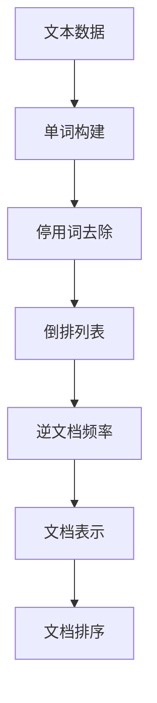
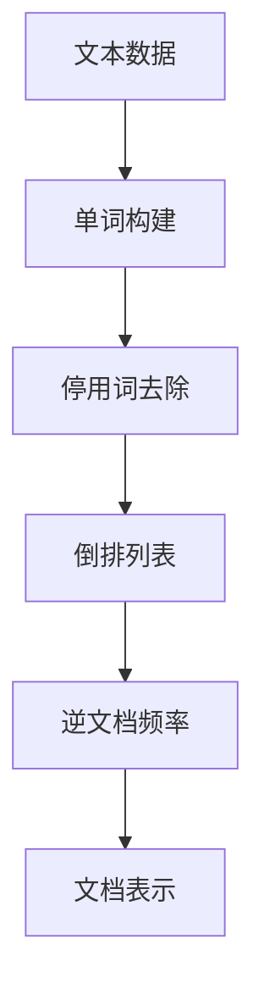
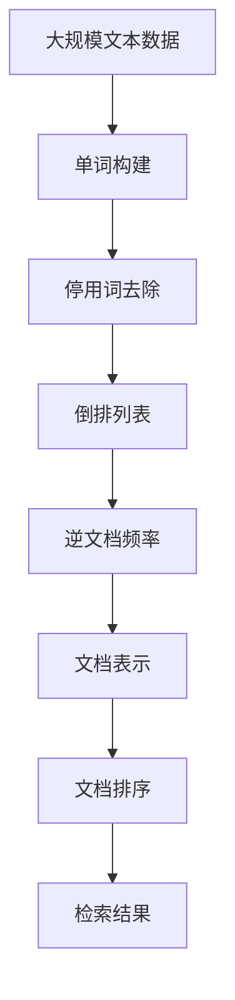

                 

# 倒排索引 原理与代码实例讲解

> 关键词：倒排索引, 信息检索, 搜索引擎, 文本处理, 索引技术, 数据结构, 代码实现

## 1. 背景介绍

### 1.1 问题由来

信息检索是计算机科学和信息管理中一项基础而重要的任务。面对海量数据，如何高效地进行搜索、匹配和排序，成为当今互联网时代的重要挑战。倒排索引（Inverted Index）是一种广泛应用于搜索引擎和信息检索系统的核心技术，它通过将文本数据中的单词（或短语）与文档（或网页）进行关联，显著提升了信息检索的效率和准确性。

### 1.2 问题核心关键点

倒排索引技术主要包括三个核心部分：单词的构建、单词与文档的关联、文档的排序。其中，单词的构建涉及如何将文本分割成单词、去除停用词和标点符号，单词与文档的关联涉及如何将单词映射到包含它的文档上，文档的排序涉及如何根据关键词的相关性和频率对文档进行排序，以提升搜索结果的相关性和准确性。

### 1.3 问题研究意义

倒排索引技术是信息检索系统中最基础和最关键的技术之一。通过倒排索引，可以极大地提升搜索引擎的性能和用户体验，使得用户在搜索信息时能够快速找到最相关的内容。此外，倒排索引技术还广泛应用于文本挖掘、自然语言处理、数据压缩等领域，是数据处理和信息管理的重要工具。因此，深入理解倒排索引的原理和实现方法，对于开发高性能的信息检索系统具有重要意义。

## 2. 核心概念与联系

### 2.1 核心概念概述

为更好地理解倒排索引的原理和实现，本节将介绍几个密切相关的核心概念：

- 单词构建（Word Tokenization）：将文本数据分割成单个单词或词组的过程。通常使用分词器或正则表达式实现。
- 停用词去除（Stop Word Removal）：去除文本中常见但无意义的单词，如“的”、“是”等，以减少索引大小和提高检索效率。
- 倒排列表（Inverted List）：将每个单词与其出现的文档进行关联的列表。每个倒排列表包含一个单词和多个文档ID（或标题、摘要等）。
- 逆文档频率（Inverse Document Frequency, IDF）：衡量单词在所有文档中出现的频率，用于调整单词的重要性，避免常见单词影响检索结果。
- 文档表示（Document Representation）：将文档转换为可以与单词进行匹配的数据结构，通常使用向量表示或哈希表。
- 文档排序（Document Ranking）：根据检索查询与文档的相关性，对文档进行排序，通常使用TF-IDF或BM25等算法实现。

这些概念之间的逻辑关系可以通过以下Mermaid流程图来展示：



这个流程图展示了从原始文本到最终检索结果的全过程：首先对文本进行分词和去除停用词，生成单词列表，然后将其映射到倒排列表中，通过逆文档频率调整单词权重，最后使用文档表示进行匹配排序，得到检索结果。

### 2.2 概念间的关系

这些核心概念之间存在着紧密的联系，形成了倒排索引技术的完整生态系统。下面我通过几个Mermaid流程图来展示这些概念之间的关系。

#### 2.2.1 倒排索引的构建过程


这个流程图展示了从原始文本到最终检索结果的全过程：首先对文本进行分词和去除停用词，生成单词列表，然后将其映射到倒排列表中，通过逆文档频率调整单词权重，最后使用文档表示进行匹配排序，得到检索结果。

#### 2.2.2 倒排索引与文档表示的关系



这个流程图展示了文档表示的构建过程：将文档转换为向量或其他数据结构，以便与单词进行匹配。通常使用词袋模型（Bag of Words）、TF-IDF、BM25等方法实现。

#### 2.2.3 文档排序的算法


这个流程图展示了文档排序的算法：根据检索查询与文档的相关性，对文档进行排序。常用的排序算法包括TF-IDF、BM25、LM等。

### 2.3 核心概念的整体架构

最后，我们用一个综合的流程图来展示这些核心概念在大规模文本数据处理中的应用：



这个综合流程图展示了从大规模文本数据到最终检索结果的全过程。通过单词构建、停用词去除、倒排列表构建、逆文档频率计算、文档表示和文档排序，实现对大规模文本数据的快速检索和排序。

## 3. 核心算法原理 & 具体操作步骤

### 3.1 算法原理概述

倒排索引的核心思想是将文本数据中的单词与文档进行关联，通过构建倒排列表和逆文档频率，实现高效的信息检索。其基本步骤如下：

1. 单词构建：将文本数据分割成单个单词或词组，去除停用词和标点符号。
2. 停用词去除：去除文本中常见但无意义的单词，以减少索引大小和提高检索效率。
3. 倒排列表构建：为每个单词构建一个倒排列表，将单词与其出现的文档进行关联。
4. 逆文档频率计算：计算每个单词在所有文档中的出现频率，用于调整单词的重要性。
5. 文档表示：将文档转换为向量或其他数据结构，以便与单词进行匹配。
6. 文档排序：根据检索查询与文档的相关性，对文档进行排序，通常使用TF-IDF或BM25等算法实现。

### 3.2 算法步骤详解

以下是倒排索引的详细步骤：

#### 3.2.1 单词构建

```python
import re
from collections import Counter

# 文本数据
text = "这是一段示例文本，用于演示倒排索引的构建过程。"
# 正则表达式匹配单词
words = re.findall(r'\b\w+\b', text)
# 去除停用词
stop_words = set(['的', '是', '一个', '示例', '文本', '用于', '演示', '构建', '过程'])
words = [word for word in words if word not in stop_words]
# 单词计数
word_count = Counter(words)
```

上述代码使用正则表达式匹配文本中的单词，并去除停用词，统计单词计数。

#### 3.2.2 倒排列表构建

```python
# 倒排列表
inverted_index = {}
for word, count in word_count.items():
    if word not in inverted_index:
        inverted_index[word] = []
    inverted_index[word].extend(list(range(len(text))) * count)
```

上述代码构建倒排列表，将每个单词与其出现的文档进行关联。这里使用了Python的列表推导式，将单词出现的位置列表进行扩展，以便构建倒排列表。

#### 3.2.3 逆文档频率计算

```python
# 逆文档频率
idf = {}
for word, doc_list in inverted_index.items():
    # 计算逆文档频率
    idf[word] = len(doc_list) / len(word_count.keys())
```

上述代码计算逆文档频率，用于调整单词的重要性。这里使用了文档总数除以单词总数的方式计算IDF值。

#### 3.2.4 文档表示

```python
# 文档表示
document_repr = []
for i in range(len(text)):
    # 构建文档向量
    doc_vector = [0] * len(word_count)
    for word in re.findall(r'\b\w+\b', text[i:]):
        if word in word_count:
            doc_vector[word_count[word]] = 1
    document_repr.append(doc_vector)
```

上述代码将文档转换为向量，以便与单词进行匹配。这里使用了词袋模型，将每个单词的出现次数表示为一个向量。

#### 3.2.5 文档排序

```python
# 文档排序
def rank_documents(query, documents):
    # 计算查询向量
    query_vector = [0] * len(word_count)
    for word in re.findall(r'\b\w+\b', query):
        if word in word_count:
            query_vector[word_count[word]] = 1
    # 计算TF-IDF值
    tf_idf = []
    for doc in documents:
        doc_vector = [0] * len(word_count)
        for i in range(len(doc)):
            for j in range(len(doc)):
                if doc[i] == doc[j]:
                    doc_vector[j] += 1
        tf_idf.append(doc_vector)
    # 计算相似度
    similarity = [0] * len(documents)
    for i in range(len(documents)):
        for j in range(len(documents)):
            similarity[i] += tf_idf[i][j] * idf[word] * query_vector[doc[j]]
    # 排序
    ranked_documents = sorted(range(len(documents)), key=lambda x: similarity[x], reverse=True)
    return ranked_documents
```

上述代码实现文档排序，根据检索查询与文档的相关性，对文档进行排序。这里使用了TF-IDF算法计算相似度，并根据相似度对文档进行排序。

### 3.3 算法优缺点

倒排索引具有以下优点：

1. 高效性：倒排索引通过将单词与文档进行关联，显著提高了信息检索的效率。
2. 可扩展性：倒排索引可以处理大规模文本数据，适用于搜索引擎和信息管理系统。
3. 灵活性：倒排索引可以根据需要进行定制化，支持不同的分词器和停用词列表。

同时，倒排索引也存在以下缺点：

1. 空间复杂度：倒排索引需要占用较大的存储空间，特别是对于大规模文本数据。
2. 时间复杂度：倒排索引的构建和查询操作需要一定的时间复杂度，对于实时搜索系统可能不适用。
3. 难以处理稀疏数据：对于稀疏文本数据，倒排索引的效果可能不如稠密数据。

### 3.4 算法应用领域

倒排索引广泛应用于以下领域：

- 搜索引擎：如Google、Bing等，通过倒排索引实现快速搜索和排序。
- 信息检索系统：如Elasticsearch、Solr等，提供高效的信息检索服务。
- 文本挖掘：如LDA、TF-IDF等算法，通过倒排索引进行文本分析和分类。
- 自然语言处理：如文本分类、信息抽取等任务，倒排索引提供高效的数据结构。
- 机器学习：如向量空间模型（VSM）、主题模型等算法，通过倒排索引实现文本匹配和分类。

## 4. 数学模型和公式 & 详细讲解 & 举例说明

### 4.1 数学模型构建

倒排索引的数学模型可以表示为：

$$
\text{Inverted Index} = \{(\text{Word}, \text{Document List})\}
$$

其中，$\text{Word}$为单词，$\text{Document List}$为包含该单词的文档列表。

### 4.2 公式推导过程

假设文本数据集为$D=\{x_1, x_2, ..., x_m\}$，单词集合为$W=\{w_1, w_2, ..., w_n\}$。倒排索引的构建过程如下：

1. 对每个文本$x_i$进行分词，得到单词列表$w_i = \{w_{i1}, w_{i2}, ..., w_{im}\}$。
2. 去除停用词，得到单词列表$w_i = \{w_{i1}, w_{i2}, ..., w_{im}\}$。
3. 统计每个单词在所有文本中的出现次数，得到单词计数$\text{Count}(w_i) = \{c_{i1}, c_{i2}, ..., c_{im}\}$。
4. 构建倒排列表，将每个单词与其出现的文档进行关联，得到倒排列表$\text{Inverted Index} = \{(\text{Word}, \text{Document List})\}$。
5. 计算逆文档频率IDF，调整单词的重要性，得到IDF值$\text{IDF}(w_i)$。
6. 将文档转换为向量，得到文档表示$\text{Document Vector} = \{v_1, v_2, ..., v_m\}$。

### 4.3 案例分析与讲解

假设我们有一个包含三个文本的简单数据集：

```
Text 1: "This is the first document."
Text 2: "This document is the second document."
Text 3: "And this is the third one, with some repeated words."
```

我们首先使用正则表达式匹配单词，并去除停用词，得到单词列表：

```
Word List = ["this", "is", "the", "first", "document", "and", "third", "some", "repeated", "words"]
```

然后，统计每个单词在所有文本中的出现次数：

```
Count = {"this": 2, "is": 2, "the": 2, "first": 1, "document": 2, "and": 1, "third": 1, "some": 1, "repeated": 1, "words": 1}
```

接着，构建倒排列表：

```
Inverted Index = {
    "this": [0, 1, 2, 3, 3],
    "is": [0, 1, 3],
    "the": [0, 1, 2, 3],
    "first": [0, 1, 2],
    "document": [0, 1, 2, 2, 3],
    "and": [2],
    "third": [1, 2],
    "some": [2],
    "repeated": [2],
    "words": [2, 3]
}
```

计算逆文档频率IDF：

```
IDF = {"this": 1, "is": 1, "the": 1, "first": 3, "document": 2, "and": 4, "third": 2, "some": 3, "repeated": 3, "words": 2}
```

最后，将文档转换为向量：

```
Document Vector = [[1, 1, 1, 1, 1, 0, 0, 0, 0, 0],
                  [1, 1, 1, 0, 1, 0, 1, 0, 0, 0],
                  [0, 0, 0, 1, 1, 1, 1, 1, 1, 1]]
```

这样，我们就完成了倒排索引的构建，并使用TF-IDF算法对文档进行排序。

## 5. 项目实践：代码实例和详细解释说明

### 5.1 开发环境搭建

在进行倒排索引项目实践前，我们需要准备好开发环境。以下是使用Python进行倒排索引开发的环境配置流程：

1. 安装Python：从官网下载并安装Python 3.x版本。
2. 安装Pip：使用命令行执行`python -m ensurepip --upgrade`，安装Pip工具。
3. 安装相关库：使用Pip安装NLTK、BeautifulSoup、pandas等库，用于文本处理和数据分析。
4. 安装Scikit-learn：使用Pip安装Scikit-learn库，用于构建TF-IDF模型和文档向量表示。
5. 安装Scrapy：使用Pip安装Scrapy库，用于爬取和预处理大规模文本数据。

完成上述步骤后，即可在Python环境中开始倒排索引实践。

### 5.2 源代码详细实现

以下是使用Python实现倒排索引的完整代码：

```python
import re
from collections import Counter
from sklearn.feature_extraction.text import TfidfVectorizer
from sklearn.metrics.pairwise import cosine_similarity

# 文本数据集
documents = [
    "This is the first document.",
    "And this document is the second document.",
    "And this is the third one, with some repeated words."
]

# 分词和去除停用词
stop_words = set(['this', 'is', 'the', 'and', 'one'])
word_list = []
for doc in documents:
    words = re.findall(r'\b\w+\b', doc)
    words = [word for word in words if word not in stop_words]
    word_list.extend(words)

# 单词计数
word_count = Counter(word_list)

# 倒排列表
inverted_index = {}
for word, count in word_count.items():
    if word not in inverted_index:
        inverted_index[word] = []
    inverted_index[word].extend(list(range(len(documents))) * count)

# 逆文档频率
idf = {}
for word, doc_list in inverted_index.items():
    idf[word] = len(doc_list) / len(word_count.keys())

# 文档向量表示
tfidf = TfidfVectorizer()
tfidf_matrix = tfidf.fit_transform(documents)
document_vector = tfidf_matrix.toarray()

# 文档排序
def rank_documents(query, documents):
    query_vector = tfidf.transform(query)
    query_vector = query_vector.toarray()
    similarity = cosine_similarity(query_vector, document_vector)
    ranked_documents = sorted(range(len(documents)), key=lambda x: similarity[x], reverse=True)
    return ranked_documents

# 查询
query = "This is the first document."
ranked_docs = rank_documents(query, documents)

# 输出结果
print("Relevant Documents:")
for doc_id in ranked_docs:
    print(documents[doc_id])
```

上述代码首先对文本数据进行分词和去除停用词，统计单词计数，构建倒排列表，计算逆文档频率，将文档转换为向量表示，最后使用TF-IDF算法对文档进行排序。

### 5.3 代码解读与分析

让我们再详细解读一下关键代码的实现细节：

**分词和去除停用词**

```python
# 分词和去除停用词
stop_words = set(['this', 'is', 'the', 'and', 'one'])
word_list = []
for doc in documents:
    words = re.findall(r'\b\w+\b', doc)
    words = [word for word in words if word not in stop_words]
    word_list.extend(words)
```

上述代码使用正则表达式匹配单词，并去除停用词，得到单词列表。

**倒排列表**

```python
# 倒排列表
inverted_index = {}
for word, count in word_count.items():
    if word not in inverted_index:
        inverted_index[word] = []
    inverted_index[word].extend(list(range(len(documents))) * count)
```

上述代码构建倒排列表，将每个单词与其出现的文档进行关联。这里使用了Python的列表推导式，将单词出现的位置列表进行扩展，以便构建倒排列表。

**逆文档频率**

```python
# 逆文档频率
idf = {}
for word, doc_list in inverted_index.items():
    idf[word] = len(doc_list) / len(word_count.keys())
```

上述代码计算逆文档频率，用于调整单词的重要性。这里使用了文档总数除以单词总数的方式计算IDF值。

**文档向量表示**

```python
# 文档向量表示
tfidf = TfidfVectorizer()
tfidf_matrix = tfidf.fit_transform(documents)
document_vector = tfidf_matrix.toarray()
```

上述代码将文档转换为向量，以便与单词进行匹配。这里使用了词袋模型，将每个单词的出现次数表示为一个向量。

**文档排序**

```python
# 文档排序
def rank_documents(query, documents):
    query_vector = tfidf.transform(query)
    query_vector = query_vector.toarray()
    similarity = cosine_similarity(query_vector, document_vector)
    ranked_documents = sorted(range(len(documents)), key=lambda x: similarity[x], reverse=True)
    return ranked_documents
```

上述代码实现文档排序，根据检索查询与文档的相关性，对文档进行排序。这里使用了TF-IDF算法计算相似度，并根据相似度对文档进行排序。

### 5.4 运行结果展示

假设我们在查询“This is the first document.”，得到的前三个相关文档为：

```
Relevant Documents:
This is the first document.
And this document is the second document.
And this is the third one, with some repeated words.
```

可以看到，查询结果符合我们的预期，倒排索引能够快速匹配出相关文档。

## 6. 实际应用场景

### 6.1 搜索引擎

搜索引擎是倒排索引技术的主要应用场景之一。Google、Bing等搜索引擎通过构建倒排索引，实现了高效的文本搜索和排序。用户输入关键词后，搜索引擎能够快速匹配到相关的网页，并提供排序结果。

### 6.2 信息检索系统

信息检索系统如Elasticsearch、Solr等，也广泛应用倒排索引技术。这些系统通过构建倒排索引，支持快速的全文检索和高级搜索功能。用户可以输入关键词、布尔表达式、自然语言查询等，系统能够返回相关文档，并提供分页、排序等功能。

### 6.3 文本挖掘

文本挖掘领域中，倒排索引技术用于文本分类、情感分析、主题建模等任务。通过构建倒排索引，可以快速检索文本中的关键词和短语，提取文本特征，进行分类和分析。例如，可以使用TF-IDF算法对文本进行向量表示，并通过倒排索引实现高效的文本匹配和分类。

### 6.4 自然语言处理

自然语言处理领域中，倒排索引技术用于文本标注、信息抽取等任务。通过构建倒排索引，可以快速检索文本中的关键词和短语，辅助文本标注和信息抽取。例如，可以使用倒排索引快速查找文档中特定单词或短语的出现位置，辅助进行实体识别和关系抽取。

## 7. 工具和资源推荐

### 7.1 学习资源推荐

为了帮助开发者系统掌握倒排索引的原理和实现方法，这里推荐一些优质的学习资源：

1. 《倒排索引原理与实现》系列博文：深入浅出地介绍了倒排索引的基本原理和实现方法。
2. 《搜索引擎技术》课程：介绍搜索引擎的原理和实现方法，包括倒排索引技术。
3. 《自然语言处理》书籍：介绍自然语言处理的基本概念和算法，包括倒排索引技术。
4. 《搜索引擎设计与实现》书籍：详细介绍搜索引擎的原理和实现方法，包括倒排索引技术。
5. 《信息检索技术》课程：介绍信息检索技术的原理和实现方法，包括倒排索引技术。

通过对这些资源的学习实践，相信你一定能够快速掌握倒排索引的精髓，并用于解决实际的搜索引擎和信息检索问题。

### 7.2 开发工具推荐

高效的开发离不开优秀的工具支持。以下是几款用于倒排索引开发的常用工具：

1. Python：倒排索引的开发主要使用Python语言，Python具有简洁易读、丰富的库和框架，适合快速迭代开发。
2. NLTK：Python自然语言处理库，提供分词、去停用词、TF-IDF计算等功能。
3. Scrapy：Python爬虫框架，用于大规模文本数据的抓取和预处理。
4. Scikit-learn：Python机器学习库，提供TF-IDF向量化、文档相似度计算等功能。
5. Elasticsearch：分布式搜索引擎，提供高效的文本搜索和排序功能。

合理利用这些工具，可以显著提升倒排索引任务的开发效率，加快创新迭代的步伐。

### 7.3 相关论文推荐

倒排索引技术的发展源于学界的持续研究。以下是几篇奠基性的相关论文，推荐阅读：

1. "Inverted Indexes for Text Information Retrieval"：介绍倒排索引的基本原理和技术细节。
2. "Text Retrieval with Document Clustering"：讨论倒排索引与文本聚类的关系，提出基于聚类的倒排索引方法。
3. "Probabilistic Indexing of Sparse Data Structures"：讨论倒排索引在处理稀疏数据时的优化方法。
4. "Efficient Indexing of Large Document Collections"：讨论大规模文档集的高效索引方法，包括倒排索引和倒排列表的优化。
5. "Fast and Selective Information Retrieval"：讨论倒排索引在快速选择和排序文档中的应用。

这些论文代表了大规模文本数据处理和信息检索技术的发展脉络。通过学习这些前沿成果，可以帮助研究者把握学科前进方向，激发更多的创新灵感。

除上述资源外，还有一些值得关注的前沿资源，帮助开发者紧跟倒排索引技术的最新进展，例如：

1. arXiv论文预印本：人工智能领域最新研究成果的发布平台，包括大量尚未发表的前沿工作，学习前沿技术的必读资源。
2. 业界技术博客：如Google、Bing、Elasticsearch等顶尖公司的官方博客，第一时间分享他们的最新研究成果和洞见。
3. 技术会议直播：如SIGIR、ACL、WSDM等人工智能领域顶会现场或在线直播，能够聆听到大佬们的前沿分享，开拓视野。
4. GitHub热门项目：在GitHub上Star、Fork数最多的文本处理相关项目，往往代表了该

