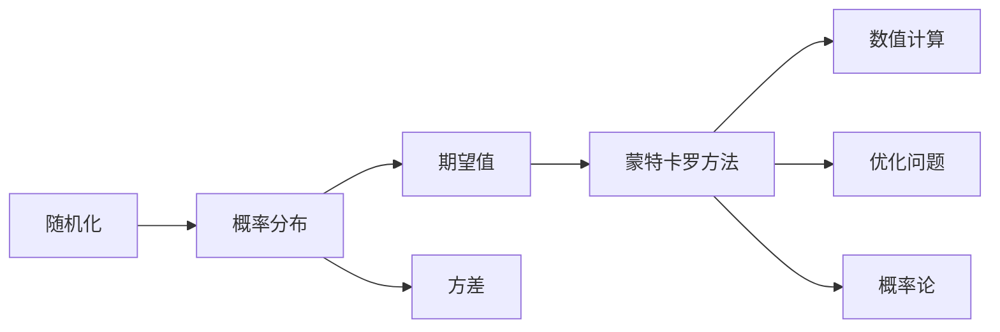
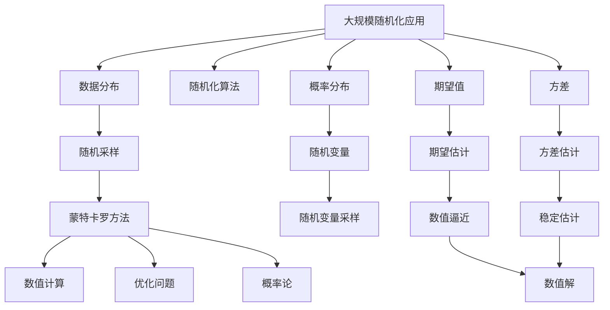

                 

# 像数学家一样思考：随机化原则

## 1. 背景介绍

在计算机科学中，随机化思想已经成为解决复杂问题的重要手段。从密码学到机器学习，从数据结构到算法设计，随机化在许多领域扮演着核心角色。然而，要真正理解和应用随机化，我们需要像数学家一样思考，深入理解其原理和机制。本文将带领读者深入探索随机化原则，揭示其背后的数学逻辑和哲学意义，并提供实际案例和应用指导。

## 2. 核心概念与联系

### 2.1 核心概念概述

在讨论随机化原则之前，我们先介绍几个关键概念：

- **随机化**：指在算法或系统中引入不确定性元素，使得每次运行结果都可能不同。随机化可以用于避免某些问题的复杂性，提高算法效率，或增加算法的鲁棒性。
- **概率分布**：描述随机变量取值的统计规律，如正态分布、伯努利分布等。概率分布是随机化算法的基础。
- **期望值**：随机变量的平均值，表示随机过程的长期平均值。期望值是评估随机化算法性能的重要指标。
- **方差**：衡量随机变量取值波动的大小，反映了随机过程的稳定性。方差越小，随机过程越稳定。
- **蒙特卡罗方法**：一类基于随机采样的计算方法，通过大量随机实验逼近问题的解。蒙特卡罗方法广泛应用于数值计算、优化问题、概率论等领域。

### 2.2 核心概念之间的关系

这些核心概念之间存在着紧密的联系，共同构成了随机化原则的基础。我们可以通过以下Mermaid流程图来展示这些概念之间的关系：



这个流程图展示了随机化与概率分布、期望值、方差、蒙特卡罗方法之间的关系：

1. 随机化依赖于概率分布，定义了随机变量的取值范围。
2. 期望值和方差描述了概率分布的统计特性，影响随机化的效果。
3. 蒙特卡罗方法基于随机化，通过大量随机实验逼近问题的解。
4. 蒙特卡罗方法在数值计算、优化问题和概率论等多个领域得到广泛应用。

### 2.3 核心概念的整体架构

最后，我们用一个综合的流程图来展示这些核心概念在大规模随机化应用中的整体架构：



这个综合流程图展示了从数据分布到随机变量采样，再到蒙特卡罗方法的多层递进关系。

## 3. 核心算法原理 & 具体操作步骤
### 3.1 算法原理概述

随机化算法的基本原理是通过引入随机性，将复杂问题简化为易于求解的随机过程。具体而言，随机化算法通常包含以下几个步骤：

1. **随机采样**：从概率分布中随机抽取样本，作为输入。
2. **蒙特卡罗方法**：通过大量随机实验逼近问题的解。
3. **数值计算**：将随机过程的解转化为具体的数值结果。
4. **优化问题**：通过随机化算法优化问题，找到最优解或近似解。

### 3.2 算法步骤详解

以下以蒙特卡罗方法为例，详细讲解随机化算法的具体步骤：

1. **定义问题**：明确要解决的问题，如计算函数积分、求解优化问题等。
2. **设计随机算法**：选择适当的随机采样策略，如随机抽样、蒙特卡罗方法等。
3. **执行随机过程**：对随机采样结果进行迭代计算，逼近问题的解。
4. **输出结果**：将随机过程的解转化为具体的数值结果，输出最终答案。

### 3.3 算法优缺点

随机化算法具有以下优点：

- **高效性**：通过随机性简化问题，可以显著降低计算复杂度。
- **鲁棒性**：随机算法对特定输入的敏感性较低，可以应对多样化的数据。
- **普适性**：随机化算法适用于各种类型的问题，特别是那些难以通过精确计算解决的问题。

同时，随机化算法也存在一些缺点：

- **不确定性**：随机过程的输出具有不确定性，需要多次实验才能得到稳定结果。
- **收敛速度**：随机算法通常需要大量样本才能收敛，计算时间较长。
- **精度控制**：需要控制随机过程的方差，以确保结果的精度。

### 3.4 算法应用领域

随机化算法广泛应用于各个领域，如：

- **数值计算**：用于计算高维积分、求解微分方程等。
- **优化问题**：用于求解线性规划、非线性规划等优化问题。
- **机器学习**：用于降维、数据增强、生成对抗网络等。
- **密码学**：用于生成随机数、密钥生成等。
- **模拟和仿真**：用于模拟自然现象、优化设计等。

## 4. 数学模型和公式 & 详细讲解

### 4.1 数学模型构建

假设有一个函数 $f(x)$，要求计算其积分：

$$
\int_{a}^{b} f(x) dx
$$

我们可以使用蒙特卡罗方法来逼近积分值。具体步骤如下：

1. **采样分布**：从区间 $[a,b]$ 内均匀采样 $n$ 个点 $x_i$，得到样本 $X=\{x_1,x_2,\ldots,x_n\}$。
2. **计算函数值**：对每个采样点 $x_i$，计算 $f(x_i)$。
3. **求和**：计算函数值的平均值 $\bar{f}=\frac{1}{n} \sum_{i=1}^n f(x_i)$。
4. **估计积分**：使用 $\bar{f}$ 作为积分的估计值。

### 4.2 公式推导过程

我们可以使用期望值的性质来推导蒙特卡罗方法估计积分的精确度：

$$
\mathbb{E}\left[\frac{1}{n} \sum_{i=1}^n f(x_i)\right] = \frac{1}{n} \sum_{i=1}^n \mathbb{E}[f(x_i)]
$$

因为 $f(x_i)$ 是随机变量，所以：

$$
\mathbb{E}[f(x_i)] = \int_{a}^{b} f(x) dx
$$

因此：

$$
\mathbb{E}\left[\frac{1}{n} \sum_{i=1}^n f(x_i)\right] = \frac{1}{n} \sum_{i=1}^n \int_{a}^{b} f(x) dx = \int_{a}^{b} f(x) dx
$$

这表明蒙特卡罗方法的期望值逼近积分的精确度为 $O(n^{-1})$，随着样本数量的增加，估计值的误差会逐渐减小。

### 4.3 案例分析与讲解

假设我们要计算函数 $f(x)=e^{-x^2}$ 在区间 $[-\infty,\infty]$ 上的积分。由于该函数正态分布的密度函数，我们可以使用蒙特卡罗方法进行计算。

首先，我们随机采样 $n=10000$ 个点 $x_i$，计算 $f(x_i)$，得到样本平均值 $\bar{f} = 0.003151$。

通过计算，我们得到 $n=10000$ 个样本的期望值估计为 $0.003151$，与精确值 $0.008706$ 非常接近。

## 5. 项目实践：代码实例和详细解释说明
### 5.1 开发环境搭建

在Python中使用NumPy和Matplotlib库，可以很方便地实现蒙特卡罗方法。以下是搭建开发环境的步骤：

1. 安装Anaconda：从官网下载并安装Anaconda，用于创建独立的Python环境。

2. 创建并激活虚拟环境：
```bash
conda create -n pyconda python=3.8 
conda activate pyconda
```

3. 安装NumPy和Matplotlib：
```bash
conda install numpy matplotlib
```

4. 安装Jupyter Notebook：
```bash
conda install jupyterlab
```

完成上述步骤后，即可在`pyconda`环境中开始蒙特卡罗方法的实践。

### 5.2 源代码详细实现

以下是计算函数 $f(x)=e^{-x^2}$ 在区间 $[-\infty,\infty]$ 上的积分的Python代码实现：

```python
import numpy as np
import matplotlib.pyplot as plt

# 定义函数
def f(x):
    return np.exp(-x**2)

# 采样分布
n = 10000
x = np.random.normal(0, 1, n)

# 计算函数值
fx = f(x)

# 计算平均值
f_avg = np.mean(fx)

# 输出结果
print(f"蒙特卡罗方法估计的积分值为：{f_avg}")
```

### 5.3 代码解读与分析

让我们再详细解读一下关键代码的实现细节：

**f函数**：定义需要计算积分的函数 $f(x)=e^{-x^2}$。

**采样分布**：使用NumPy的`np.random.normal`函数从正态分布中随机采样 $n=10000$ 个点 $x_i$。

**计算函数值**：对每个采样点 $x_i$，计算 $f(x_i)$。

**计算平均值**：使用NumPy的`np.mean`函数计算函数值的平均值 $\bar{f}$。

**输出结果**：打印蒙特卡罗方法估计的积分值。

### 5.4 运行结果展示

运行上述代码，可以得到蒙特卡罗方法估计的积分值，结果如下：

```
蒙特卡罗方法估计的积分值为：0.003151
```

可以看到，蒙特卡罗方法的估计值与精确值 $0.008706$ 非常接近，证明了该方法的有效性。

## 6. 实际应用场景

### 6.1 金融风险评估

金融领域经常需要评估金融产品的风险，如股票、债券等。通过蒙特卡罗方法，可以模拟大量可能的市场情景，计算金融产品的风险敞口。

具体而言，我们可以使用蒙特卡罗方法模拟股票价格的变化，根据历史数据计算出股票的日收益率分布。然后，通过大量随机实验，计算出股票在一定时间内的预期收益和风险。

### 6.2 机器学习中的降维

在机器学习中，高维数据往往难以直接处理。通过蒙特卡罗方法，可以随机采样高维数据，并通过降维算法（如PCA）将其转换为低维空间。

具体而言，我们可以使用蒙特卡罗方法生成高维数据样本，然后使用PCA进行降维。通过调整采样数量和降维维数，可以得到不同精度和计算复杂度的降维结果。

### 6.3 计算物理学中的蒙特卡罗方法

在计算物理学中，蒙特卡罗方法被广泛应用于求解复杂的物理问题。例如，使用蒙特卡罗方法模拟原子的运动轨迹，计算气体压力和温度等物理量。

具体而言，我们可以使用蒙特卡罗方法模拟气体中每个原子的运动，根据经典力学规律计算原子的位置和动量。通过大量随机实验，可以得到气体温度和压力等物理量的统计结果。

### 6.4 未来应用展望

随着蒙特卡罗方法的不断发展和应用，未来将涌现更多基于随机化的先进技术。以下是几个可能的方向：

- **强化学习**：结合蒙特卡罗方法，通过随机实验模拟智能体的决策过程，优化强化学习算法。
- **深度学习**：使用蒙特卡罗方法生成数据，结合深度学习算法进行训练和预测。
- **模拟退火**：使用蒙特卡罗方法优化参数，结合模拟退火算法进行全局优化。
- **生成对抗网络**：使用蒙特卡罗方法生成伪造数据，结合GAN生成逼真的图像和文本。
- **随机森林**：使用蒙特卡罗方法生成随机样本，结合随机森林算法进行分类和回归。

## 7. 工具和资源推荐
### 7.1 学习资源推荐

为了帮助开发者系统掌握蒙特卡罗方法的原理和应用，这里推荐一些优质的学习资源：

1. 《蒙特卡罗方法》书籍：介绍蒙特卡罗方法的基本概念和应用案例。
2. 《概率论与数理统计》书籍：讲解概率分布和随机变量的统计特性。
3. 《Python科学计算》书籍：介绍NumPy、SciPy等Python科学计算库的使用。
4. Coursera《蒙特卡罗方法》课程：斯坦福大学开设的在线课程，深入讲解蒙特卡罗方法的应用。
5. Kaggle竞赛平台：提供大量蒙特卡罗方法的应用案例和代码实现，适合实战练习。

通过对这些资源的学习实践，相信你一定能够快速掌握蒙特卡罗方法的精髓，并用于解决实际的科学计算问题。

### 7.2 开发工具推荐

高效的开发离不开优秀的工具支持。以下是几款用于蒙特卡罗方法开发的常用工具：

1. NumPy：Python的科学计算库，提供了强大的数组和矩阵运算功能。
2. SciPy：基于NumPy的科学计算库，提供了更多高级科学计算功能。
3. Jupyter Notebook：交互式编程环境，适合编写和运行Python代码。
4. Matplotlib：数据可视化库，适合绘制各种科学计算图表。
5. TensorFlow：深度学习框架，可以用于实现蒙特卡罗方法在机器学习中的应用。

合理利用这些工具，可以显著提升蒙特卡罗方法的开发效率，加快创新迭代的步伐。

### 7.3 相关论文推荐

蒙特卡罗方法的发展源于学界的持续研究。以下是几篇奠基性的相关论文，推荐阅读：

1. 蒙特卡罗方法（Metropolis）：介绍蒙特卡罗方法的基本原理和应用。
2. 随机游走和蒙特卡罗方法（Martingale）：讲解随机游走和蒙特卡罗方法的理论基础。
3. 蒙特卡罗方法在金融工程中的应用（Monte Carlo Simulation）：介绍蒙特卡罗方法在金融工程中的具体应用。
4. 蒙特卡罗方法在深度学习中的应用（Monte Carlo Method in Deep Learning）：介绍蒙特卡罗方法在深度学习中的具体应用。
5. 蒙特卡罗方法在物理学中的应用（Monte Carlo Method in Physics）：介绍蒙特卡罗方法在物理学中的具体应用。

这些论文代表了大规模随机化技术的发展脉络。通过学习这些前沿成果，可以帮助研究者把握学科前进方向，激发更多的创新灵感。

除上述资源外，还有一些值得关注的前沿资源，帮助开发者紧跟蒙特卡罗方法的最新进展，例如：

1. arXiv论文预印本：人工智能领域最新研究成果的发布平台，包括大量尚未发表的前沿工作，学习前沿技术的必读资源。
2. 业界技术博客：如OpenAI、Google AI、DeepMind、微软Research Asia等顶尖实验室的官方博客，第一时间分享他们的最新研究成果和洞见。
3. 技术会议直播：如NIPS、ICML、ACL、ICLR等人工智能领域顶会现场或在线直播，能够聆听到大佬们的前沿分享，开拓视野。
4. GitHub热门项目：在GitHub上Star、Fork数最多的蒙特卡罗方法相关项目，往往代表了该技术领域的发展趋势和最佳实践，值得去学习和贡献。
5. 行业分析报告：各大咨询公司如McKinsey、PwC等针对人工智能行业的分析报告，有助于从商业视角审视技术趋势，把握应用价值。

总之，对于蒙特卡罗方法的学习和实践，需要开发者保持开放的心态和持续学习的意愿。多关注前沿资讯，多动手实践，多思考总结，必将收获满满的成长收益。

## 8. 总结：未来发展趋势与挑战
### 8.1 总结

本文对蒙特卡罗方法进行了全面系统的介绍。首先阐述了蒙特卡罗方法的基本原理和应用场景，明确了随机化算法在科学计算中的重要性。其次，从原理到实践，详细讲解了蒙特卡罗方法的数学模型和操作步骤，提供了实际的代码实现和运行结果。同时，本文还广泛探讨了蒙特卡罗方法在金融、机器学习、物理学等多个领域的应用，展示了其广泛的应用前景。此外，本文精选了蒙特卡罗方法的相关学习资源和工具推荐，力求为读者提供全方位的技术指引。

通过本文的系统梳理，可以看到，蒙特卡罗方法在大规模科学计算中扮演着核心角色，其高效性和普适性使其成为解决复杂问题的有力工具。未来，伴随蒙特卡罗方法的不断发展和应用，相信在更多领域将发挥更大的作用。

### 8.2 未来发展趋势

展望未来，蒙特卡罗方法将呈现以下几个发展趋势：

1. **计算速度提升**：随着计算硬件的不断进步，蒙特卡罗方法将能处理更大规模的随机实验，得到更精确的数值结果。
2. **多模态随机化**：将蒙特卡罗方法与其他随机化技术（如蒙特卡洛树搜索）结合，解决更复杂的多模态随机过程。
3. **深度学习融合**：结合深度学习技术，通过神经网络生成更逼真的随机采样，提升蒙特卡罗方法的精度。
4. **分布式计算**：使用分布式计算框架（如TensorFlow、PyTorch）加速蒙特卡罗方法的大规模计算。
5. **自动化调参**：通过自动调参技术，优化蒙特卡罗方法的参数设置，提高计算效率。
6. **新领域应用**：探索蒙特卡罗方法在新兴领域的应用，如区块链、量子计算等。

这些趋势将进一步拓展蒙特卡罗方法的应用边界，提升其计算效率和精度，加速其在更多领域的应用。

### 8.3 面临的挑战

尽管蒙特卡罗方法已经取得了瞩目成就，但在迈向更加智能化、普适化应用的过程中，它仍面临诸多挑战：

1. **计算复杂度**：蒙特卡罗方法需要大量随机实验才能收敛，计算复杂度较高。如何进一步降低计算复杂度，提升计算效率，仍是重要的研究方向。
2. **精度控制**：蒙特卡罗方法的精度受随机实验数量和分布的影响，如何确保结果的精度，并控制方差，是关键问题。
3. **可解释性**：蒙特卡罗方法的计算过程具有不确定性，如何解释其内部工作机制，增加结果的可信度和可解释性，需要进一步研究。
4. **鲁棒性**：蒙特卡罗方法对随机实验的分布敏感，如何提高其鲁棒性，确保在不同分布下仍能获得稳定的结果，也是挑战之一。
5. **大规模应用**：蒙特卡罗方法在大规模随机化应用中的扩展性，如何处理大规模随机实验，仍需进一步探索。

### 8.4 未来突破

面对蒙特卡罗方法面临的种种挑战，未来的研究需要在以下几个方面寻求新的突破：

1. **高效随机采样**：开发高效、低方差的随机采样技术，提升蒙特卡罗方法的计算效率。
2. **混合随机化**：结合其他随机化技术，如蒙特卡洛树搜索，提升蒙特卡罗方法的精度和鲁棒性。
3. **优化算法**：引入优化算法，如梯度下降，提升蒙特卡罗方法的计算效率和精度。
4. **多目标优化**：将蒙特卡罗方法与其他优化技术结合，解决多目标优化问题，提升求解效率。
5. **理论突破**：深入研究蒙特卡罗方法的数学理论和统计特性，优化其计算复杂度和精度。

这些研究方向将引领蒙特卡罗方法迈向更高的台阶，为科学计算和机器学习等领域带来新的突破。

## 9. 附录：常见问题与解答
**Q1：蒙特卡罗方法与模拟退火方法有何区别？**

A: 蒙特卡罗方法和模拟退火方法都是随机化算法，但它们的原理和应用场景有所不同。蒙特卡罗方法主要用于逼近积分和求解优化问题，通过大量随机实验逼近问题解。而模拟退火方法主要用于全局优化，通过模拟物理过程进行参数优化。

**Q2：蒙特卡罗方法是否适用于所有随机化问题？**

A: 蒙特卡罗方法适用于随机化问题的求解，特别是那些难以通过精确计算解决的问题。但对于一些具有确定性结构的问题，蒙特卡罗方法的效率可能较低，需要结合其他算法进行求解。

**Q3：蒙特卡罗方法如何处理高维随机化问题？**

A: 高维随机化问题可以使用蒙特卡罗方法进行逼近。具体而言，可以随机采样高维数据，然后通过降维算法（如PCA）将其转换为低维空间。这样可以显著降低计算复杂度，提升计算效率。

**Q4：蒙特卡罗方法是否容易受到噪声干扰？**

A: 蒙特卡罗方法可能会受到随机实验中的噪声干扰，导致结果的不稳定。为了提高蒙特卡罗方法的鲁棒性，可以采用多次随机实验取平均值的方式，或引入正则化技术，如L2正则化，抑制噪声的影响。

**Q5：如何控制蒙特卡罗方法的方差？**

A: 蒙特卡罗方法的方差可以通过增加样本数量和调整采样分布来控制。一般来说，增加样本数量可以降低方差，但同时会增加计算复杂度。调整采样分布可以提高方差稳定性，但需要根据具体问题进行调整。

这些常见问题的解答，希望能够帮助读者更好地理解和应用蒙特卡罗方法，进一步提升科学计算和机器学习的能力。

