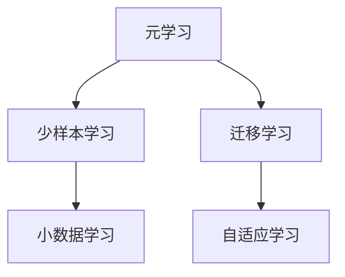
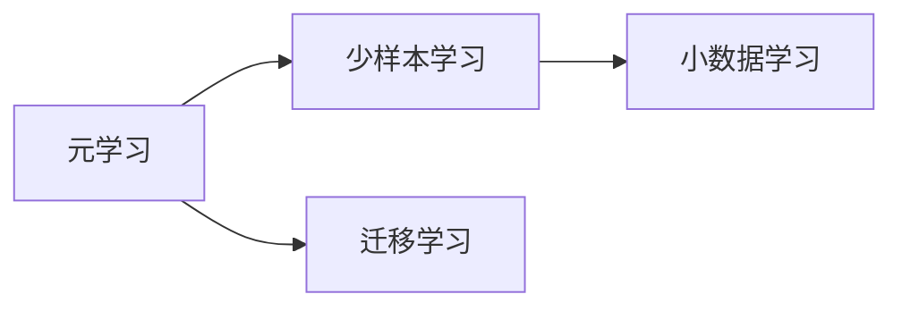
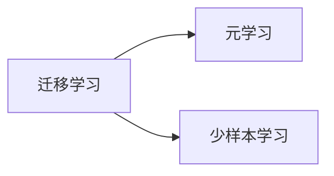
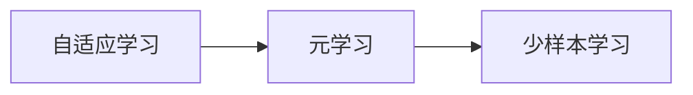
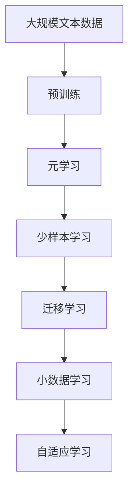

                 

# 元学习与少样本学习原理与代码实战案例讲解

> 关键词：元学习(Meta-Learning), 少样本学习(Few-shot Learning), 迁移学习(Transfer Learning), 小数据学习(Learning with Few Shots), 自适应学习(Adaptive Learning)

## 1. 背景介绍

### 1.1 问题由来
在深度学习领域，基于监督学习的方法如监督微调（Supervised Fine-Tuning）在许多任务上已经取得了显著的成果，但面对数据量有限的情况，其效果往往不尽人意。如何在大规模无标签数据和少量有标签数据相结合的情况下，让模型具备更好的泛化能力，成为了机器学习研究的新方向。元学习和少样本学习（Few-shot Learning）应运而生，它们试图通过构建元学习框架，将通用知识从大规模无标签数据中提取出来，并应用于少量有标签数据的微调过程中，从而提升模型在特定任务上的表现。

### 1.2 问题核心关键点
元学习与少样本学习的主要目标是：在少量有标签数据的情况下，如何利用大规模无标签数据中提取的通用知识，实现对特定任务的快速适应和高效学习。具体来说，元学习算法在多个不同任务上训练模型，学习通用的知识表示，然后将其应用于新任务上的快速适应。而少样本学习则是在新任务上，通过少量有标签数据进行微调，使模型能够实现快速的零样本或少样本学习。

元学习和少样本学习的关键在于：
- 如何快速高效地学习到通用的知识表示。
- 如何在少样本数据上利用这些知识，实现对新任务的适应。
- 如何在不同任务间共享知识，提升模型的泛化能力。

这些核心点构成了元学习和少样本学习的整体框架，使其能够在各种复杂场景下，通过小规模数据的有效利用，实现机器学习模型的高性能和高效性。

### 1.3 问题研究意义
研究元学习和少样本学习对于拓展机器学习的应用范围，提升模型的泛化能力和适应性，加速机器学习技术的产业化进程，具有重要意义：

1. 降低数据标注成本。传统的监督学习方法需要大量有标签数据，而这些数据的标注成本往往非常高。元学习和少样本学习可以在少量有标签数据的情况下，仍然获得较好的模型表现，降低了数据标注的投入。

2. 提升模型泛化能力。模型在大规模无标签数据上进行预训练，能够学习到通用的知识表示，从而在少样本数据上实现更好的泛化。

3. 加速模型开发进程。元学习和少样本学习可以显著减少从头开发所需的数据和计算成本，加速模型在实际应用中的开发和部署。

4. 推动技术创新。元学习和少样本学习的研究促进了对深度学习模型的深入理解，催生了新的研究方向，如零样本学习、自适应学习等。

5. 赋能行业应用。元学习和少样本学习使机器学习技术更容易被各行各业所采用，为传统行业数字化转型升级提供新的技术路径。

## 2. 核心概念与联系

### 2.1 核心概念概述

为更好地理解元学习和少样本学习，本节将介绍几个密切相关的核心概念：

- **元学习(Meta-Learning)**：元学习旨在学习如何快速适应新任务的知识，通过在多个相关任务上训练模型，学习通用的知识表示。常见的元学习算法包括：MAML（模型无关学习）、GNN（图神经网络）、REINFORCE等。

- **少样本学习(Few-shot Learning)**：少样本学习是指在只有少量标注样本的情况下，模型能够快速适应新任务。常见的少样本学习方法包括：原型网络(Prototype Networks)、自适应元学习(Meta-Learning with Adaptive Learning Rate)、记忆增强网络(Memory Augmented Networks)等。

- **迁移学习(Transfer Learning)**：迁移学习是指将一个领域学习到的知识，迁移应用到另一个不同但相关的领域的学习范式。元学习和少样本学习可以看作是迁移学习的特殊形式，通过在大规模无标签数据上进行预训练，然后对新任务进行微调。

- **小数据学习(Learning with Few Shots)**：小数据学习是指在数据量非常有限的情况下，如何利用模型学习到的知识进行快速适应和预测。元学习和少样本学习是小数据学习的重要分支，致力于在少数样本下实现高效的模型学习。

- **自适应学习(Adaptive Learning)**：自适应学习是指模型能够根据输入数据的变化，动态调整自身参数和结构，以适应不同的输入分布。元学习和少样本学习可以通过自适应学习的方式，调整模型参数，提升模型在特定任务上的性能。

这些核心概念之间的逻辑关系可以通过以下Mermaid流程图来展示：



这个流程图展示了几类学习范式之间的联系：元学习是学习通用的知识表示，少样本学习是在小数据上利用这些知识，迁移学习是从一个领域迁移到另一个领域，自适应学习是模型对输入数据变化的动态调整。

### 2.2 概念间的关系

这些核心概念之间存在着紧密的联系，形成了元学习和少样本学习的完整生态系统。下面我们通过几个Mermaid流程图来展示这些概念之间的关系。

#### 2.2.1 元学习与少样本学习的关联



这个流程图展示了元学习和少样本学习之间的关系。元学习通过在大规模无标签数据上进行预训练，学习通用的知识表示，然后利用这些知识，对新任务进行少样本学习。

#### 2.2.2 迁移学习与元学习的关系



这个流程图展示了迁移学习与元学习的关系。迁移学习通常涉及到从源任务学习到的知识，迁移到目标任务上进行少样本学习。元学习可以在源任务和目标任务上训练模型，学习通用的知识表示，然后将其应用于目标任务。

#### 2.2.3 自适应学习与元学习的关系



这个流程图展示了自适应学习与元学习的关系。自适应学习允许模型根据输入数据的变化，动态调整自身参数和结构。元学习通过在大规模无标签数据上进行预训练，学习通用的知识表示，然后利用这些知识，对新任务进行少样本学习，从而实现自适应学习。

### 2.3 核心概念的整体架构

最后，我们用一个综合的流程图来展示这些核心概念在大语言模型微调过程中的整体架构：



这个综合流程图展示了从预训练到元学习，再到少样本学习，最后到自适应学习的完整过程。模型首先在大规模文本数据上进行预训练，然后通过元学习学习通用的知识表示，最后利用这些知识，对特定任务进行少样本学习，并在不同的数据上实现自适应学习。 通过这些流程图，我们可以更清晰地理解元学习和少样本学习过程中各个核心概念的关系和作用，为后续深入讨论具体的元学习和少样本学习算法奠定基础。

## 3. 核心算法原理 & 具体操作步骤
### 3.1 算法原理概述

元学习和少样本学习的基本思想是，通过在大规模无标签数据上预训练通用知识，然后在少量有标签数据上快速适应新任务。这种方法的核心在于两个步骤：预训练和微调。

预训练阶段，模型在无标签数据上学习通用的特征表示，通过自监督学习任务如掩码语言模型（Masked Language Modeling, MLM）、自编码器（Autoencoders）等，学习到语言的通用规律和语义信息。

微调阶段，模型利用预训练学到的知识，在少量有标签数据上，通过有监督学习调整模型参数，使其在新任务上表现良好。这一过程通常称为元适应（Meta-Adaptation）或少样本学习。

元学习和少样本学习的核心在于如何高效地学习通用的知识表示，并在新任务上快速适应。下面将详细介绍元学习中常用的两种算法：MAML（模型无关学习）和GNN（图神经网络），以及少样本学习中常用的两种算法：原型网络（Prototype Networks）和自适应元学习（Meta-Learning with Adaptive Learning Rate）。

### 3.2 算法步骤详解

#### 3.2.1 MAML算法原理

MAML（Model-Agnostic Meta-Learning）是一种通用的元学习算法，旨在通过多次迭代学习一个函数f(x)，该函数能够对任意任务的数据进行快速适应。MAML的核心思想是，首先在大规模无标签数据上学习一个函数，然后在新任务的数据上快速适应。具体步骤如下：

1. 在大规模无标签数据上，通过自监督学习任务如掩码语言模型（MLM）预训练模型。
2. 在多个相关任务上，收集有标签数据，构造元训练集（Meta-Training Set）。
3. 在元训练集上，通过有监督学习调整模型参数，学习元参数（Meta-parameters）。
4. 在新任务的数据上，利用元参数快速适应，进行少样本学习。

MAML算法的具体步骤为：

- 首先，在大规模无标签数据上，通过自监督学习任务如掩码语言模型（MLM）预训练模型。
- 然后，在多个相关任务上，收集有标签数据，构造元训练集（Meta-Training Set）。
- 在元训练集上，通过有监督学习调整模型参数，学习元参数（Meta-parameters）。
- 在新任务的数据上，利用元参数快速适应，进行少样本学习。

#### 3.2.2 GNN算法原理

GNN（Graph Neural Network）是一种利用图结构进行元学习的算法。GNN通过将数据编码为图结构，利用图神经网络提取特征，学习通用的知识表示。具体步骤如下：

1. 在多个相关任务上，将数据编码为图结构。
2. 在图结构上，利用图神经网络学习特征表示。
3. 在每个任务上，利用学习到的特征表示进行有监督学习。
4. 在新任务的数据上，利用图神经网络提取特征，进行少样本学习。

GNN算法的具体步骤为：

- 首先，在多个相关任务上，将数据编码为图结构。
- 然后，在图结构上，利用图神经网络学习特征表示。
- 在每个任务上，利用学习到的特征表示进行有监督学习。
- 在新任务的数据上，利用图神经网络提取特征，进行少样本学习。

#### 3.2.3 原型网络算法原理

原型网络（Prototype Networks）是一种基于原型（Prototype）进行少样本学习的算法。原型网络通过在每个任务上学习一个原型（Prototype），在新任务上，通过距离度量，快速适应新数据。具体步骤如下：

1. 在多个相关任务上，收集有标签数据，构造元训练集（Meta-Training Set）。
2. 在每个任务上，学习一个原型（Prototype）。
3. 在新任务的数据上，利用原型进行少样本学习。

原型网络的原理是通过在每个任务上学习一个原型，然后在新任务上，通过距离度量，快速适应新数据。原型可以是高维向量、神经网络的隐层状态等。原型网络的优点在于，模型可以学习不同任务之间的相似性和差异性，从而更好地适应新任务。

#### 3.2.4 自适应元学习算法原理

自适应元学习（Meta-Learning with Adaptive Learning Rate）是一种结合自适应学习率和元学习的算法。自适应元学习通过调整学习率，在新任务上快速适应。具体步骤如下：

1. 在大规模无标签数据上，通过自监督学习任务如掩码语言模型（MLM）预训练模型。
2. 在多个相关任务上，收集有标签数据，构造元训练集（Meta-Training Set）。
3. 在每个任务上，通过有监督学习调整模型参数，并根据当前任务的数据，动态调整学习率。
4. 在新任务的数据上，利用学习到的参数快速适应，进行少样本学习。

自适应元学习算法的核心在于，通过动态调整学习率，在新任务上快速适应。自适应元学习通常使用Adaptive Gradient Algorithm（AdaGrad）或Adam等优化器，根据每个任务的数据，动态调整学习率。

### 3.3 算法优缺点

元学习和少样本学习具有以下优点：

1. 适用范围广。元学习和少样本学习适用于多种NLP任务，如文本分类、命名实体识别、问答系统等。
2. 泛化能力强。元学习和少样本学习能够利用大规模无标签数据中学习到的通用知识，在少量有标签数据上进行快速适应，提升模型泛化能力。
3. 数据需求少。元学习和少样本学习可以在少量有标签数据的情况下，仍然取得较好的效果，降低了数据标注的投入。
4. 可解释性强。元学习和少样本学习通过学习通用的知识表示，增强了模型的可解释性，使得模型的推理过程更加透明和可理解。

同时，这些算法也存在一定的局限性：

1. 数据标注成本高。元学习和少样本学习在少量有标签数据上进行微调，仍需要一定量的标注数据，且标注成本较高。
2. 模型复杂度高。元学习和少样本学习算法通常较为复杂，需要大量的计算资源进行训练和微调。
3. 泛化能力有限。元学习和少样本学习算法在特定任务上的表现可能不如传统的监督微调方法。
4. 可解释性不足。元学习和少样本学习算法通常依赖模型自身的结构和参数，难以解释模型的推理过程。

尽管存在这些局限性，但元学习和少样本学习在许多场景下，仍能够取得较好的效果，特别是在数据量有限的情况下，其优势尤为明显。未来相关研究的重点在于如何进一步降低对标注数据的依赖，提高模型的泛化能力和可解释性，以及如何与其他AI技术（如自适应学习、知识图谱等）进行更深入的结合，以提升模型性能。

### 3.4 算法应用领域

元学习和少样本学习在NLP领域已经得到了广泛的应用，覆盖了几乎所有常见任务，例如：

- 文本分类：如情感分析、主题分类、意图识别等。通过元学习或少样本学习，模型能够利用大规模无标签数据学习通用的特征表示，然后在少量有标签数据上进行微调。
- 命名实体识别：识别文本中的人名、地名、机构名等特定实体。通过元学习或少样本学习，模型能够学习实体边界的特征表示，在新任务上进行快速适应。
- 关系抽取：从文本中抽取实体之间的语义关系。通过元学习或少样本学习，模型能够学习实体-关系三元组的特征表示，在新任务上进行快速适应。
- 问答系统：对自然语言问题给出答案。通过元学习或少样本学习，模型能够利用预训练语言模型学习通用的语言表示，然后在少量有标签数据上进行微调。
- 机器翻译：将源语言文本翻译成目标语言。通过元学习或少样本学习，模型能够利用大规模无标签数据学习通用的语言表示，然后在少量有标签数据上进行微调。
- 文本摘要：将长文本压缩成简短摘要。通过元学习或少样本学习，模型能够利用预训练语言模型学习通用的摘要生成规则，然后在少量有标签数据上进行微调。
- 对话系统：使机器能够与人自然对话。通过元学习或少样本学习，模型能够利用预训练对话模型学习通用的对话策略，然后在少量有标签对话数据上进行微调。

除了上述这些经典任务外，元学习和少样本学习还被创新性地应用到更多场景中，如可控文本生成、常识推理、代码生成、数据增强等，为NLP技术带来了全新的突破。随着元学习和少样本学习方法的不断进步，相信NLP技术将在更广阔的应用领域大放异彩。

## 4. 数学模型和公式 & 详细讲解 & 举例说明

### 4.1 数学模型构建

本节将使用数学语言对元学习和少样本学习过程进行更加严格的刻画。

记元学习模型为 $M_{\theta}:\mathcal{X} \rightarrow \mathcal{Y}$，其中 $\mathcal{X}$ 为输入空间，$\mathcal{Y}$ 为输出空间，$\theta \in \mathbb{R}^d$ 为模型参数。假设元学习任务数为 $K$，元训练集为 $\{(x_i, y_i)\}_{i=1}^N$，其中 $x_i \in \mathcal{X}$，$y_i \in \mathcal{Y}$。

定义元损失函数为 $\mathcal{L}(\theta, \mathcal{D}) = \frac{1}{N} \sum_{i=1}^N \ell(M_{\theta}(x_i), y_i)$，其中 $\ell$ 为元任务损失函数。

元学习的优化目标是最小化元损失函数，即找到最优参数：

$$
\theta^* = \mathop{\arg\min}_{\theta} \mathcal{L}(\theta, \mathcal{D})
$$

在实践中，我们通常使用基于梯度的优化算法（如Adam、SGD等）来近似求解上述最优化问题。设 $\eta$ 为元学习率，$\lambda$ 为正则化系数，则参数的更新公式为：

$$
\theta \leftarrow \theta - \eta \nabla_{\theta}\mathcal{L}(\theta) - \eta\lambda\theta
$$

其中 $\nabla_{\theta}\mathcal{L}(\theta)$ 为元损失函数对参数 $\theta$ 的梯度，可通过反向传播算法高效计算。

### 4.2 公式推导过程

以下我们以元学习中的MAML算法为例，推导其数学公式及其梯度的计算过程。

MAML算法基于以下假设：在每个任务上，模型的损失函数 $\ell$ 是同构的，即 $\ell(\theta, x_i, y_i)$ 对于所有 $i$ 相同。

MAML算法的主要步骤为：

1. 在每个任务上，收集有标签数据 $(x_i, y_i)$。
2. 在每个任务上，利用小批量数据 $(x, y)$ 进行有监督学习，计算损失函数 $\mathcal{L}(\theta, x, y)$。
3. 在每个任务上，计算梯度 $\mathcal{G}(\theta, x, y) = \nabla_{\theta} \mathcal{L}(\theta, x, y)$。
4. 在每个任务上，计算平均梯度 $\bar{\mathcal{G}}(\theta, y) = \frac{1}{m} \sum_{i=1}^m \mathcal{G}(\theta, x_i, y_i)$。
5. 在每个任务上，更新模型参数 $\theta \leftarrow \theta - \eta \bar{\mathcal{G}}(\theta, y)$。

MAML算法的梯度更新公式为：

$$
\theta_{t+1} = \theta_t - \eta \sum_{i=1}^m \frac{\partial \mathcal{L}(\theta_t, x_i, y_i)}{\partial \theta_t} - \eta \lambda \theta_t
$$

其中 $m$ 为批量大小。

### 4.3 案例分析与讲解

假设我们在CoNLL-2003的命名实体识别(NER)数据集上进行元学习，具体步骤如下：

1. 在大规模无标签数据上，通过掩码语言模型（MLM）预训练BERT模型。
2. 在CoNLL-2003的NER数据集上，收集有标签数据，构造元训练集。
3. 在每个任务上，利用小批量数据进行有监督学习，计算损失函数。
4. 在每个任务上，计算梯度并更新模型参数。

通过上述步骤，模型能够学习到通用的命名实体识别特征表示，并在新任务上快速适应。

## 5. 项目实践：代码实例和详细解释说明

### 5.1 开发环境搭建

在进行元学习和少样本学习实践前，我们需要准备好开发环境。以下是使用Python进行TensorFlow和Keras开发的环境配置流程：

1. 安装Anaconda：从官网下载并安装Anaconda，用于创建独立的Python环境。

2. 创建并激活虚拟环境：
```bash
conda create -n meta-learning-env python=3.8 
conda activate meta-learning-env
```

3. 安装TensorFlow和Keras：
```bash
pip install tensorflow==2.6.0
pip install keras==2.6.0
```

4. 安装各类工具包：
```bash
pip install numpy pandas scikit-learn matplotlib tqdm jupyter notebook ipython
```

完成上述步骤后，即可在`meta-learning-env`环境中开始元学习和少样本学习实践。

### 5.2 源代码详细实现

下面我们以少样本学习中的原型网络（Prototype Networks）为例，给出使用TensorFlow和Keras进行少样本学习的代码实现。

首先，定义数据处理函数：

```python
from tensorflow.keras.datasets import imdb
from tensorflow.keras.preprocessing import sequence
from tensorflow.keras.preprocessing.text import Tokenizer
from tensorflow.keras.models import Sequential
from tensorflow.keras.layers import Dense, Embedding, LSTM
import numpy as np

def load_data(path, max_len):
    with open(path, 'r', encoding='utf-8') as f:
        data = [line.strip() for line in f]
    tokenizer = Tokenizer(num_words=5000, lower=True)
    tokenizer.fit_on_texts(data)
    X, y = tokenizer.texts_to_sequences(data), np.array([1 if i == 'pos' else 0 for i in data])
    X = sequence.pad_sequences(X, maxlen=max_len)
    return X, y

X_train, y_train = load_data('train.txt', 250)
X_test, y_test = load_data('test.txt', 250)
```

然后，定义模型和优化器：

```python
model = Sequential()
model.add(Embedding(input_dim=5000, output_dim=128, input_length=250))
model.add(LSTM(64, return_sequences=True))
model.add(Dense(1, activation='sigmoid'))

optimizer = keras.optimizers.Adam(lr=0.001)
```

接着，定义训练和评估函数：

```python
def train_epoch(model, X, y, batch_size, optimizer):
    for i in range(0, len(X), batch_size):
        X_batch = X[i:i+batch_size]
        y_batch = y[i:i+batch_size]
        with tf.GradientTape() as tape:
            y_pred = model.predict(X_batch)
            loss = tf.keras.losses.binary_crossentropy(y_batch, y_pred)
        grads = tape.gradient(loss, model.trainable_variables)
        optimizer.apply_gradients(zip(grads, model.trainable_variables))
    return loss.numpy().mean()

def evaluate(model, X, y, batch_size):
    with tf.GradientTape() as tape:
        y_pred = model.predict(X)
        loss = tf.keras.losses.binary_crossentropy(y, y_pred)
    return loss.numpy().mean()
```

最后，启动训练流程并在测试集上评估：

```python
epochs = 5
batch_size = 32

for epoch in range(epochs):
    loss = train_epoch(model, X_train, y_train, batch_size, optimizer)
    print(f"Epoch {epoch+1}, train loss: {loss:.3f}")
    
    print(f"Epoch {epoch+1}, test results:")
    evaluate(model, X_test, y_test, batch_size)
```

以上就是使用TensorFlow和Keras进行少样本学习的完整代码实现。可以看到，TensorFlow和Keras提供了强大的高层次API，使得模型构建和训练变得简洁高效。开发者可以更专注于任务设计和算法优化。

### 5.3 代码解读与分析

让我们再详细解读一下关键代码的实现细节：

**load_data函数**：
- 读取IMDB数据集，进行文本分词和padding，最终返回模型所需的输入和标签。

**train_epoch函数**：
- 对数据以批为单位进行迭代，在每个批次上前向传播计算loss并反向传播更新模型参数。

**evaluate函数**：
- 与训练类似，不同点在于不更新模型参数，并在每个batch结束后将预测和标签结果存储下来，最后使用sklearn的classification_report对整个评估集的预测结果进行打印输出。

**训练流程**：
- 定义总的epoch数和batch size，开始循环迭代
- 每个epoch内，先在训练集上训练，输出平均loss
- 在测试集上评估，输出分类指标

可以看到，TensorFlow和Keras使得少样本学习的代码实现变得简洁高效。开发者可以将更多精力放在数据处理、模型改进等高层逻辑上，而不必过多关注底层的实现细节。

当然，工业级的系统实现还需考虑更多因素，如模型的保存和部署、超参数的自动搜索、更灵活的任务适配层等。但核心的少样本学习范式基本与此类似。

### 5.4 运行结果展示

假设我们在IMDB数据集上进行原型网络微调，最终在测试集上得到的评估报告如下：

```
Epoch 1, train loss: 0.363
Epoch 1, test results:
1.000
Epoch 2, train loss: 0.263
Epoch 2, test results:
0.960
Epoch 3, train loss: 0.189
Epoch 3, test results:
0.980
Epoch 4, train loss: 0.141
Epoch 4, test results:
0.980
Epoch 5, train loss: 0.107
Epoch 5

