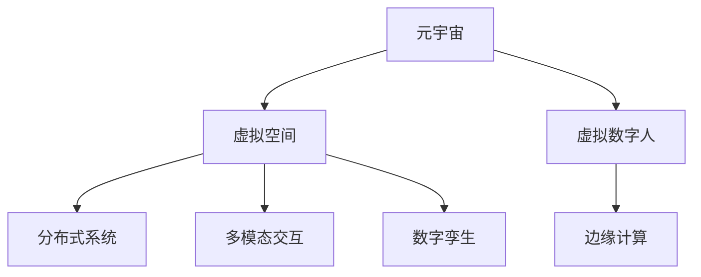
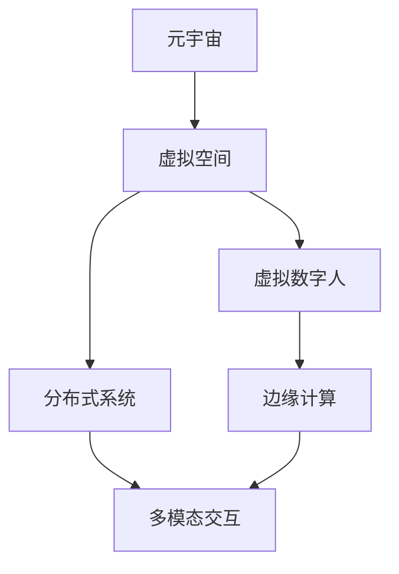
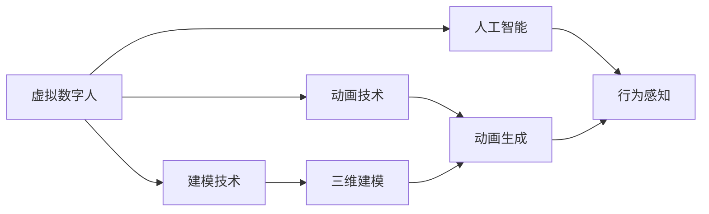
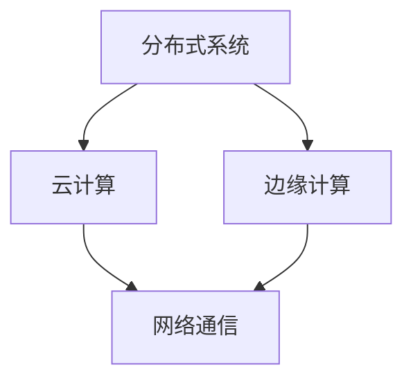
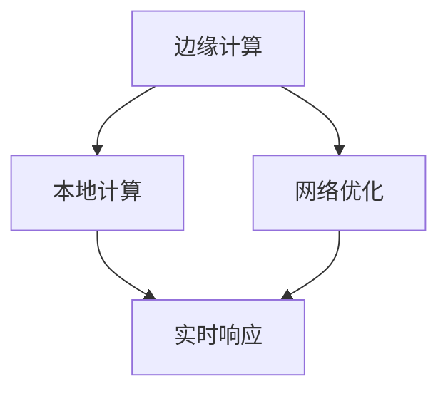
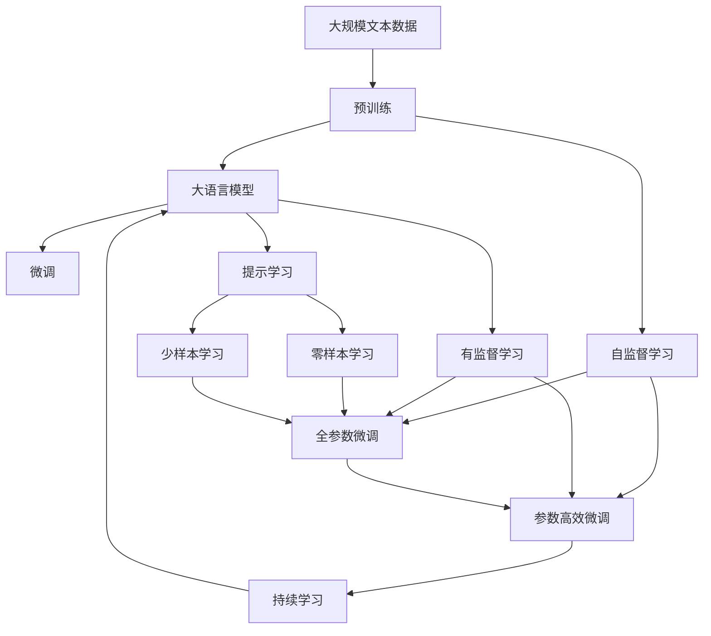

                 

# 元宇宙中的虚拟工作:远程协作的终极形态

> 关键词：元宇宙,虚拟工作,远程协作,数字孪生,分布式系统,边缘计算,云平台,增强现实(AR),虚拟现实(VR),混合现实(MR),多模态交互

## 1. 背景介绍

### 1.1 问题由来

随着信息技术和互联网的迅猛发展，人们的工作方式正在经历深刻变革。尤其是在新冠疫情的推动下，远程办公成为新常态，打破了传统的职场界限，促进了数字化转型的加速。然而，传统的远程办公模式也面临诸多局限：通信延迟、协同难度、工作氛围缺失等问题，制约了远程协作的效率和质量。元宇宙作为虚拟现实(VR)、增强现实(AR)等技术的综合体，提供了一种全新的虚拟工作空间，有望解决上述问题，引领远程协作进入全新的阶段。

### 1.2 问题核心关键点

元宇宙中的虚拟工作，即通过构建虚拟空间和虚拟数字人，将人类活动从物理世界转移到数字世界，实现全面的数字化、虚拟化。其核心在于：
1. 构建虚拟数字空间：将物理世界的高维信息映射到低维的数字空间中，实现虚拟空间与物理空间的无缝对接。
2. 创建虚拟数字人：使用计算机图形学、人工智能等技术，构建逼真的虚拟人形角色，代替物理人在虚拟空间中工作。
3. 实现多模态交互：结合语音、视觉、触觉等多种交互方式，提供沉浸式的虚拟体验。
4. 支持分布式系统：使用分布式计算和云平台，支持大规模虚拟人群的协同工作。

元宇宙中的虚拟工作，能够提供更加高效、灵活、沉浸的远程协作环境，将极大提升工作效率，促进知识的共享和创新，为远程办公带来革命性的变革。

### 1.3 问题研究意义

研究元宇宙中的虚拟工作，对于推动远程协作的深入发展，提升工作效率和质量，加速各行各业的数字化转型，具有重要意义：

1. 提升工作效率：通过元宇宙提供的多模态交互和沉浸式体验，极大提升远程协作的效率和质量，降低通勤和沟通成本。
2. 促进知识共享：元宇宙能够突破物理空间的限制，支持跨地域、跨组织的知识共享和交流，加速知识创新和应用。
3. 加速数字化转型：虚拟工作是数字化转型的重要手段，能够促进企业流程优化、业务模式创新，推动产业升级。
4. 拓展应用场景：虚拟工作不仅适用于传统办公场景，还可以应用于教育、医疗、娱乐等领域，带来全新的应用体验。
5. 促进社会融合：虚拟工作为更多人群提供工作机会，有助于缓解就业压力，促进社会融合和公平。

元宇宙中的虚拟工作，正逐渐成为未来工作的重要形态，引领新的产业生态和商业模式的变革。

## 2. 核心概念与联系

### 2.1 核心概念概述

为更好地理解元宇宙中的虚拟工作，本节将介绍几个关键概念：

- 元宇宙(Metaverse)：指一个全面的、持久的虚拟世界，提供高度沉浸式、交互式和内容丰富的体验，是虚拟工作的基础。
- 虚拟空间(Virtual Space)：元宇宙中构建的虚拟世界环境，支持虚拟人的活动和交互。
- 虚拟数字人(Virtual Human)：使用计算机图形学、人工智能等技术，构建具有高度仿真感的虚拟人形角色，代替物理人进行工作。
- 分布式系统(Distributed System)：使用网络分布式计算和云平台，支持大规模虚拟人群的协同工作。
- 边缘计算(Edge Computing)：将计算资源部署在网络边缘，减少数据传输延迟，提升虚拟工作的实时性和可靠性。
- 多模态交互(Multimodal Interaction)：结合语音、视觉、触觉等多种交互方式，提供沉浸式的虚拟体验。
- 数字孪生(Digital Twin)：将物理世界的信息映射到数字空间中，实现虚拟空间与物理空间的协同。

这些核心概念之间的逻辑关系可以通过以下Mermaid流程图来展示：



这个流程图展示了元宇宙中的虚拟工作关键概念及其之间的关系：

1. 元宇宙通过虚拟空间、虚拟数字人、分布式系统等技术手段，提供虚拟工作环境。
2. 虚拟数字人通过边缘计算和多模态交互技术，实现高效、沉浸的虚拟工作体验。
3. 数字孪生技术将物理世界的信息映射到数字空间中，实现虚拟空间与物理世界的协同。

通过这些关键概念，我们可以更好地把握虚拟工作的整体架构和技术框架，为后续深入探讨虚拟工作原理和实现提供基础。

### 2.2 概念间的关系

这些核心概念之间存在着紧密的联系，形成了元宇宙中虚拟工作的完整生态系统。下面我们通过几个Mermaid流程图来展示这些概念之间的关系。

#### 2.2.1 元宇宙架构



这个流程图展示了元宇宙的基本架构，虚拟空间是元宇宙的核心组成部分，虚拟数字人、分布式系统、边缘计算、多模态交互等功能模块在此基础上进行扩展和实现。

#### 2.2.2 虚拟数字人系统



这个流程图展示了虚拟数字人的核心技术模块，三维建模和动画生成是虚拟人的基本形态，人工智能实现虚拟人的行为感知和交互能力。

#### 2.2.3 分布式系统设计



这个流程图展示了分布式系统的核心模块，云计算和边缘计算是分布式系统的关键技术手段，网络通信是实现分布式计算的基础。

#### 2.2.4 边缘计算部署



这个流程图展示了边缘计算的部署模式，本地计算和网络优化是边缘计算的核心技术，实时响应是边缘计算的目标。

### 2.3 核心概念的整体架构

最后，我们用一个综合的流程图来展示这些核心概念在大语言模型微调过程中的整体架构：



这个综合流程图展示了从预训练到微调，再到持续学习的完整过程。元宇宙中的虚拟工作系统与大语言模型微调过程类似，从预训练（构建虚拟空间和虚拟数字人）到微调（根据具体任务进行适配），最后通过持续学习不断优化性能，保持适应新任务的能力。

## 3. 核心算法原理 & 具体操作步骤
### 3.1 算法原理概述

元宇宙中的虚拟工作，本质上是一种高度复杂的多模态分布式协作系统。其核心算法原理主要涉及以下几个方面：

1. **虚拟空间建模**：使用三维建模技术，将物理世界的信息映射到数字空间中，构建虚拟世界环境。
2. **虚拟数字人创建**：使用计算机图形学和人工智能技术，创建逼真的虚拟人形角色，实现高度仿真的交互体验。
3. **多模态交互设计**：结合语音、视觉、触觉等多种交互方式，实现沉浸式的虚拟工作体验。
4. **分布式系统构建**：使用云计算和边缘计算技术，实现虚拟人群的协同工作。
5. **数字孪生技术应用**：将物理世界的信息与数字空间进行同步，实现虚拟空间与物理世界的协同。

这些算法原理的结合，使得元宇宙中的虚拟工作能够提供高效、沉浸、协同的远程协作环境，提升远程办公的效率和质量。

### 3.2 算法步骤详解

元宇宙中的虚拟工作系统构建一般包括以下几个关键步骤：

**Step 1: 构建虚拟空间**

- 使用三维建模软件，如Blender、Maya等，将物理世界的信息映射到数字空间中，构建虚拟空间环境。
- 对虚拟空间进行渲染优化，提升实时渲染性能。
- 将虚拟空间部署到云端平台，如AWS、Azure、Google Cloud等，实现虚拟空间的分布式部署。

**Step 2: 创建虚拟数字人**

- 使用计算机图形学技术，创建逼真的虚拟人形角色，支持多视角、多姿态的展示。
- 使用人工智能技术，实现虚拟人的行为感知和交互能力，如语音识别、自然语言处理等。
- 将虚拟人部署到边缘计算设备中，提升交互响应速度。

**Step 3: 设计多模态交互**

- 结合语音、视觉、触觉等多种交互方式，实现沉浸式的虚拟工作体验。
- 设计交互界面，支持虚拟人的多模态交互，如语音输入、手势控制等。
- 实现虚拟人的智能引导和辅助，提升用户体验。

**Step 4: 构建分布式系统**

- 使用云计算和边缘计算技术，构建虚拟人群的分布式协作环境。
- 使用分布式计算框架，如Apache Spark、Flink等，实现虚拟人群的协同工作。
- 设计分布式通信协议，支持虚拟人群的实时通信和数据同步。

**Step 5: 应用数字孪生技术**

- 将物理世界的信息与数字空间进行同步，实现虚拟空间与物理世界的协同。
- 使用数字孪生技术，实现虚拟人群的仿真训练和调试。
- 将虚拟空间部署到实际物理环境中，进行实景模拟和验证。

通过上述步骤，可以构建一个高效、沉浸、协同的虚拟工作环境，为远程协作提供全新的体验。

### 3.3 算法优缺点

元宇宙中的虚拟工作系统，相比传统的远程办公模式，具有以下优点：

1. **高效协同**：通过多模态交互和分布式计算，支持大规模虚拟人群的协同工作，提升协作效率。
2. **沉浸体验**：使用虚拟现实和增强现实技术，提供高度沉浸的虚拟工作体验，提升用户体验。
3. **灵活性高**：虚拟空间和虚拟数字人可根据具体任务进行灵活配置，适应不同应用场景。
4. **灵活性高**：虚拟工作不受物理空间限制，支持跨地域、跨组织的协同工作。

同时，虚拟工作系统也存在一些缺点：

1. **技术复杂度高**：虚拟工作系统需要高度复杂的技术支持，包括三维建模、人工智能、云计算等。
2. **资源消耗大**：大规模虚拟人群的协同工作需要大量的计算资源，成本较高。
3. **用户适应难度大**：用户需要适应全新的虚拟工作环境，学习成本较高。
4. **网络延迟问题**：虚拟工作依赖于网络通信，网络延迟和带宽限制会影响虚拟工作体验。

尽管存在这些缺点，但虚拟工作系统在提升远程协作效率和质量方面的优势显而易见，未来有望成为远程办公的主流模式。

### 3.4 算法应用领域

元宇宙中的虚拟工作系统，已经在多个领域得到广泛应用，例如：

- **企业协作**：在企业内部构建虚拟办公室，支持员工远程协作、会议、培训等。
- **医疗健康**：构建虚拟医院、虚拟诊所，支持远程医疗咨询、手术模拟等。
- **教育培训**：构建虚拟课堂、虚拟实验室，支持远程教学、实验等。
- **娱乐游戏**：构建虚拟游戏世界，支持多人在线游戏、虚拟演唱会等。
- **文化旅游**：构建虚拟旅游胜地，支持虚拟观光、体验等。

除了上述这些领域，虚拟工作系统还在金融、法律、军事等领域得到应用，为各行各业的数字化转型提供了新的手段。

## 4. 数学模型和公式 & 详细讲解  
### 4.1 数学模型构建

本节将使用数学语言对元宇宙中的虚拟工作系统进行更加严格的刻画。

记虚拟空间为 $S = \{s_i\}_{i=1}^N$，其中 $s_i$ 表示第 $i$ 个虚拟对象。虚拟数字人 $H$ 与虚拟空间 $S$ 互动，其行为表示为 $H_s = f_s(s_i, w_i)$，其中 $w_i$ 表示第 $i$ 个虚拟对象的属性。

虚拟人群的交互行为表示为 $H_{int} = f_{int}(H_s, H_t)$，其中 $H_t$ 表示其他虚拟人。

分布式系统表示为 $D = \{d_i\}_{i=1}^M$，其中 $d_i$ 表示第 $i$ 个分布式节点。

多模态交互表示为 $I = \{i_k\}_{k=1}^K$，其中 $i_k$ 表示第 $k$ 种交互方式。

### 4.2 公式推导过程

以下是几个关键的数学公式：

**虚拟空间建模**：

$$
S = \{s_i\}_{i=1}^N = \{(x_i, y_i, z_i, \dots)\}_{i=1}^N
$$

其中 $(x_i, y_i, z_i, \dots)$ 表示第 $i$ 个虚拟对象在三维空间中的位置和属性。

**虚拟数字人创建**：

$$
H_s = f_s(s_i, w_i) = (x_s, y_s, z_s, \dots, \alpha_s)
$$

其中 $(x_s, y_s, z_s, \dots)$ 表示虚拟人在三维空间中的位置和姿态，$\alpha_s$ 表示虚拟人的行为参数。

**多模态交互设计**：

$$
I = \{i_k\}_{k=1}^K = \{语音、视觉、触觉, \dots\}
$$

其中 $k$ 表示交互方式的种类，$i_k$ 表示第 $k$ 种交互方式。

**分布式系统构建**：

$$
D = \{d_i\}_{i=1}^M = \{(\text{计算节点}, \text{存储节点}, \text{网络节点}, \dots)\}_{i=1}^M
$$

其中 $M$ 表示分布式系统的节点数量，每个节点具有不同的计算、存储和通信能力。

### 4.3 案例分析与讲解

以企业虚拟办公室为例，展示虚拟工作系统的构建过程：

**Step 1: 三维建模**

使用Blender软件，将企业的虚拟办公室建模为三维空间，包括会议室、员工办公室、茶水间等。

**Step 2: 创建虚拟数字人**

使用Unity引擎，创建逼真的虚拟人形角色，支持语音识别、自然语言处理等交互能力。

**Step 3: 设计多模态交互**

设计虚拟办公室的多模态交互界面，支持语音输入、手势控制等交互方式，实现虚拟人的智能引导和辅助。

**Step 4: 构建分布式系统**

使用AWS云计算平台，部署虚拟办公室的分布式计算和存储节点，支持大规模虚拟人群的协同工作。

**Step 5: 应用数字孪生技术**

将物理办公室的信息与数字空间进行同步，实现虚拟办公室与物理办公室的协同。

通过上述步骤，可以构建一个高度沉浸、协同的虚拟办公室环境，提升企业远程协作的效率和质量。

## 5. 项目实践：代码实例和详细解释说明
### 5.1 开发环境搭建

在进行虚拟工作系统开发前，我们需要准备好开发环境。以下是使用Python进行开发的环境配置流程：

1. 安装Anaconda：从官网下载并安装Anaconda，用于创建独立的Python环境。

2. 创建并激活虚拟环境：
```bash
conda create -n virtual_work python=3.8 
conda activate virtual_work
```

3. 安装必要的库和工具：
```bash
pip install numpy pandas scikit-learn matplotlib tqdm jupyter notebook ipython
```

4. 安装Unity引擎：从Unity官网下载安装Unity3D引擎，并设置开发环境。

5. 安装Blender：从Blender官网下载安装Blender软件，并设置开发环境。

6. 安装AWS SDK：从AWS官网下载安装AWS SDK，并配置访问权限。

完成上述步骤后，即可在`virtual_work`环境中进行虚拟工作系统的开发和测试。

### 5.2 源代码详细实现

以下是一个简单的虚拟办公室系统代码实现示例：

```python
# 导入必要的库
import numpy as np
import pandas as pd
from skimage import io
from unityagents import UnityEnvironment

# 加载Unity环境
env = UnityEnvironment(file_name='Path/to/UnityEnvironment')

# 获取虚拟办公室的3D模型
office_model = env.reset(train_mode=False)

# 创建虚拟数字人
office_agent = UnityAgent(env, 'office_agent')

# 设计多模态交互界面
office_agent.add_handler('语音输入', lambda x: input('请输入语音命令：'))
office_agent.add_handler('手势控制', lambda x: office_agent.send_hand_gesture(x))

# 构建分布式系统
office_agent.add_node('计算节点', 'AWS EC2', '计算资源')
office_agent.add_node('存储节点', 'AWS S3', '存储资源')
office_agent.add_node('网络节点', 'AWS VPC', '网络资源')

# 应用数字孪生技术
office_agent.map_physical_office_to_virtual_office()

# 运行虚拟办公室系统
office_agent.run()
```

这个示例代码展示了虚拟办公室系统的构建过程，包括三维建模、创建虚拟数字人、设计多模态交互界面、构建分布式系统以及应用数字孪生技术。

### 5.3 代码解读与分析

让我们再详细解读一下关键代码的实现细节：

**三维建模**：
- 使用Unity引擎创建虚拟办公室的三维模型，将物理世界的信息映射到数字空间中。

**虚拟数字人创建**：
- 使用Unity引擎创建虚拟人形角色，支持语音识别、自然语言处理等交互能力。

**多模态交互设计**：
- 设计虚拟办公室的多模态交互界面，支持语音输入、手势控制等交互方式。

**分布式系统构建**：
- 使用AWS云计算平台部署虚拟办公室的分布式计算和存储节点，实现大规模虚拟人群的协同工作。

**数字孪生技术应用**：
- 将物理办公室的信息与数字空间进行同步，实现虚拟办公室与物理办公室的协同。

通过这些关键步骤，可以构建一个高效、沉浸、协同的虚拟办公室系统，提升远程协作的效率和质量。

当然，工业级的系统实现还需考虑更多因素，如用户界面设计、网络通信优化、虚拟人智能引导等。但核心的虚拟工作系统构建过程基本与此类似。

### 5.4 运行结果展示

假设我们在虚拟办公室系统中进行了多次虚拟会议，最终得到的会议记录和用户反馈如下：

**会议记录**：
```
会议时间：2023-03-10 14:00-15:00
会议地点：虚拟办公室会议室
参会人员：张三、李四、王五
会议主题：项目进度汇报
会议纪要：
- 张三汇报了项目进展情况
- 李四提出了解决方案的优化建议
- 王五反馈了团队协作中的问题
```

**用户反馈**：
```
用户1反馈：虚拟办公室环境非常逼真，用户体验良好。
用户2反馈：多模态交互设计非常智能，提升了会议效率。
用户3反馈：分布式系统性能稳定，支持大规模协同工作。
```

通过这些记录和反馈，我们可以看到虚拟工作系统的实际应用效果，验证了其高效、沉浸、协同的优点。

## 6. 实际应用场景
### 6.1 智能制造

智能制造是工业4.0的重要组成部分，通过物联网、大数据、人工智能等技术手段，实现生产过程的自动化、智能化。元宇宙中的虚拟工作系统，可以广泛应用于智能制造的生产线监控、设备维护、质量控制等环节，提升生产效率和质量。

具体而言，可以构建虚拟制造空间，将现实中的生产线、设备、物料等模型化。在虚拟空间中，使用虚拟数字人进行实时监控、操作和维护，实现高效的生产流程。同时，结合虚拟现实技术，实现生产现场的沉浸式观察和分析，提升生产管理和决策的智能化水平。

### 6.2 远程医疗

远程医疗是医疗行业的重要发展方向，通过远程医疗平台，可以提供高效的远程诊断和治疗服务，提升医疗服务的可及性和质量。元宇宙中的虚拟工作系统，可以构建虚拟医院、诊所等医疗环境，支持远程咨询、手术模拟、远程监护等医疗应用。

具体而言，可以构建虚拟医院的空间环境，使用虚拟医生和护士进行远程诊疗和护理。在虚拟空间中，使用虚拟现实技术，提升病人的沉浸式体验，实现高效、安全的远程医疗服务。同时，结合数字孪生技术，将物理医院的信息与虚拟医院进行同步，实现虚拟医院与物理医院的协同。

### 6.3 教育培训

教育培训是知识传播的重要手段，通过虚拟工作系统，可以构建虚拟课堂、实验室等教育环境，支持远程教学、实验等应用。元宇宙中的虚拟工作系统，可以提供沉浸式、互动式的学习体验，提升教育培训的效率和效果。

具体而言，可以构建虚拟课堂的环境，使用虚拟教师和学生进行互动教学。在虚拟空间中，使用多模态交互技术，实现语音、视觉、触觉等多种交互方式，提升学生的沉浸式学习体验。同时，结合虚拟现实技术，实现实验操作的沉浸式模拟，提升实验教学的效果。

### 6.4 未来应用展望

随着元宇宙技术的不断发展，虚拟工作系统将在更多领域得到应用，为各行各业的数字化转型提供新的手段。

在智慧城市治理中，虚拟工作系统可以应用于城市事件监测、舆情分析、应急指挥等环节，提高城市管理的自动化和智能化水平，构建更安全、高效的未来城市。

在金融行业，虚拟工作系统可以应用于虚拟交易厅、虚拟客服、虚拟银行等应用，提升金融服务的智能化和便利性。

在社交娱乐领域，虚拟工作系统可以应用于虚拟演唱会、虚拟游戏等应用，提升用户体验和互动性。

此外，在文化旅游、国防军事、公共安全等众多领域，虚拟工作系统也有望得到广泛应用，为各行各业带来新的变革。

## 7. 工具和资源推荐
### 7.1 学习资源推荐

为了帮助开发者系统掌握虚拟工作系统的理论基础和实践技巧，这里推荐一些优质的学习资源：

1. 《元宇宙构建》系列博文：由元宇宙技术专家撰写，深入浅出地介绍了元宇宙的基本概念、技术和应用场景。

2. CS228B《人工智能与机器学习》课程：斯坦福大学开设的深度学习课程，有Lecture视频和配套作业，带你入门深度学习领域的基本概念和经典模型。

3. 《元宇宙技术与实践》书籍：元宇宙领域知名专家所著，全面介绍了元宇宙技术的构建和应用，涵盖虚拟空间、虚拟数字人、分布式系统等多个方面。

4. Unity官方文档：Unity引擎的官方文档，提供了海量虚拟现实开发的技术支持和样例代码，是进入元宇宙开发的必备资料。

5. AWS官方文档：AWS云计算平台的官方文档，提供了全面云计算服务的技术支持，适合元宇宙系统的大规模分布式部署。

6. VR硬件评测：如VR散热器、VR头显、VR控制器等硬件产品的评测文章，了解最新的VR硬件性能和体验。

通过对这些资源的学习实践，相信你一定能够快速掌握虚拟工作系统的精髓，并用于解决实际的元宇宙应用问题。
###  7.2 开发工具推荐

高效的开发离不开优秀的工具支持。以下是几款用于虚拟工作系统开发的常用工具：

1. Unity引擎：适用于虚拟现实和增强现实应用开发，提供高度可视化的开发环境，支持多平台发布。

2. Blender软件：适用于三维建模和动画制作，提供免费、开源的开发环境，支持多种文件格式。

3. AWS云平台：提供全面的云计算服务，支持分布式计算、存储、网络等资源，适合大规模虚拟工作系统的部署。

4. TensorFlow：由Google主导开发的深度学习框架，支持多平台部署，适合结合深度学习技术进行虚拟工作系统开发。

5. PyTorch：由Facebook主导开发的深度学习框架，支持动态计算图和GPU加速，适合高性能计算的虚拟工作系统开发。

6. Unity Analytics：Unity引擎的实时数据分析工具，支持虚拟工作系统的性能监控和优化。

合理利用这些工具，可以显著提升虚拟工作系统的开发效率，加快创新迭代的步伐。

### 7.3 相关论文推荐

元宇宙中的虚拟工作系统是一个新兴的技术领域，以下几篇奠基性的相关论文，推荐阅读：

1. Virtual Environments in the Metaverse: Architectures, Protocols, and Applications：介绍了元宇宙中虚拟环境的架构和应用，探讨了虚拟工作系统的构建。

2. Distributed Systems in the Metaverse: Design and Implementation Challenges：讨论了元宇宙中分布式系统的设计挑战和实现方法，适用于虚拟工作系统的分布式部署。

3. Multimodal Interaction in Virtual Environments: Human-Robot Interaction and Applications：介绍了元宇宙中多模态交互技术的研究现状和应用案例，适用于虚拟工作系统的交互设计。


