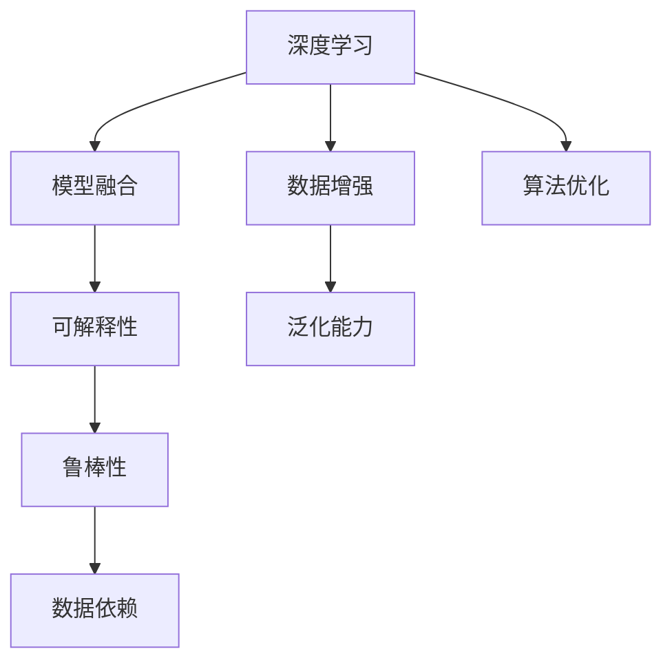
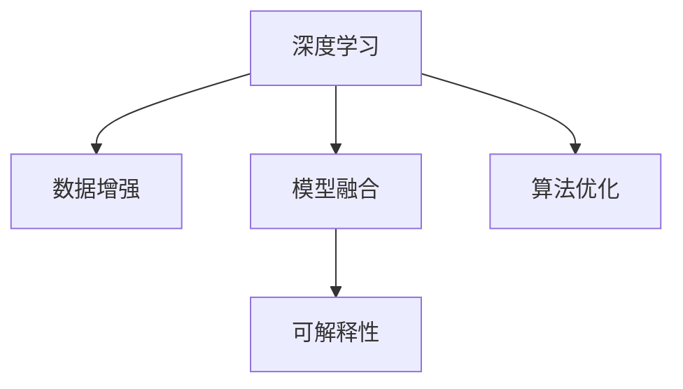
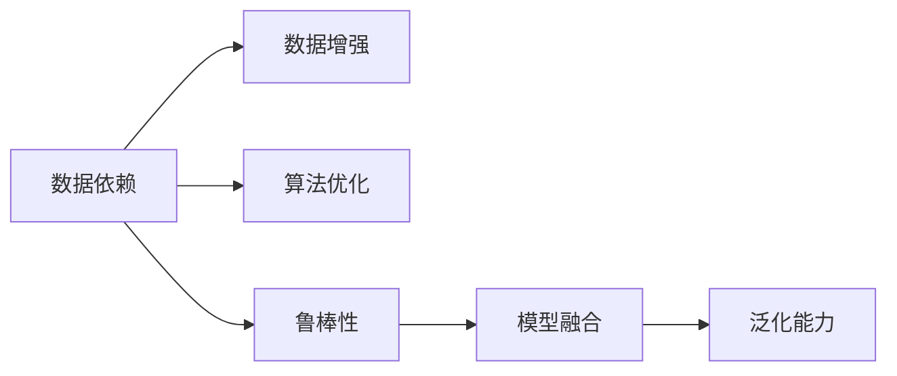
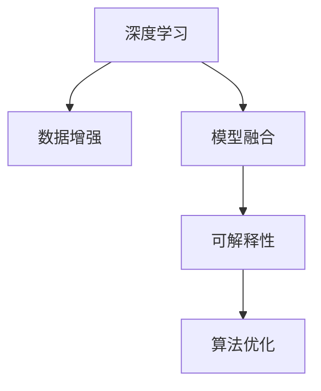
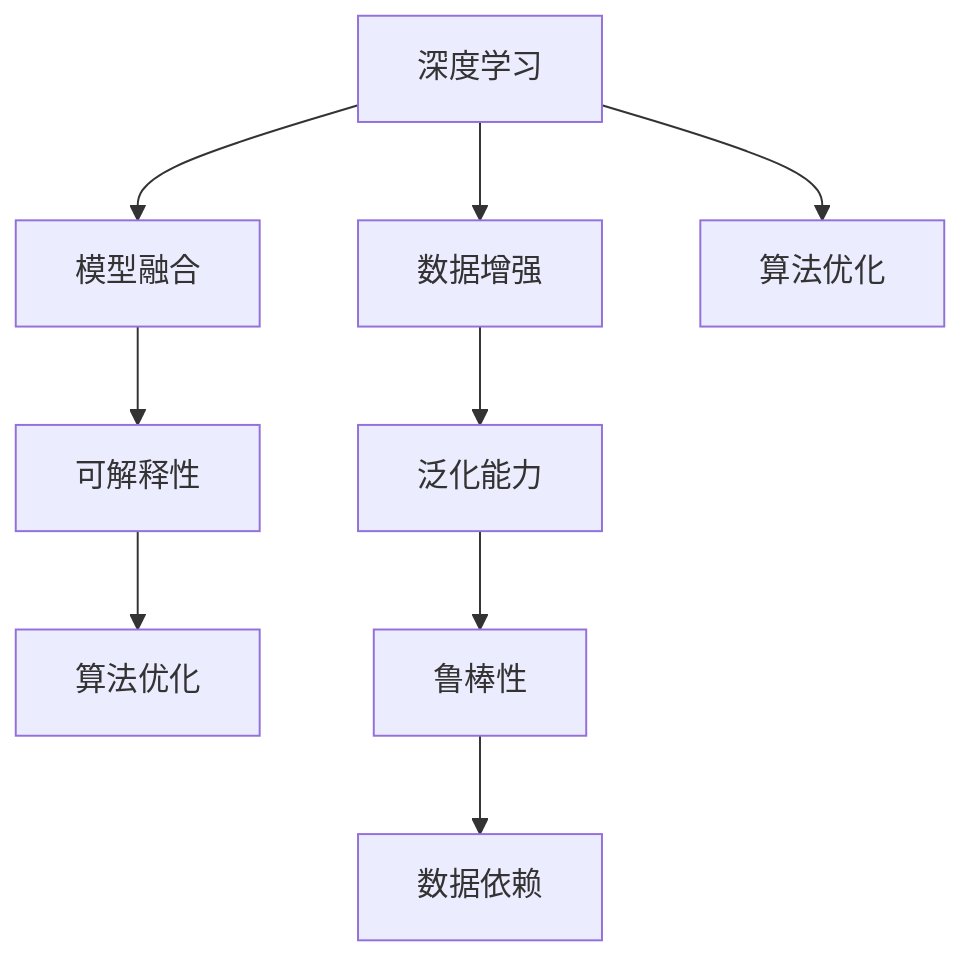

                 

# 克服人工智能固有缺点的方法

> 关键词：人工智能, 人工智能缺陷, 算法优化, 模型改进, 数据增强, 模型融合, 可解释性

## 1. 背景介绍

### 1.1 问题由来

近年来，人工智能(AI)技术迅猛发展，取得了诸多令人瞩目的成果。从图像识别、语音识别到自然语言处理，AI在各个领域的应用都取得了显著进步。然而，尽管AI技术在性能和效率上取得了巨大突破，其固有的缺点也逐渐显现。这些缺点主要包括数据依赖、泛化能力不足、鲁棒性差、可解释性差等。针对这些缺点，本文旨在提出一系列克服方法，使AI技术更加全面、可靠、安全地服务于实际应用。

### 1.2 问题核心关键点

1. **数据依赖**：AI模型通常需要大量标注数据进行训练，数据量和质量决定了模型性能的上限。

2. **泛化能力不足**：AI模型往往难以泛化到未曾见过的数据，存在过拟合的风险。

3. **鲁棒性差**：AI模型对输入数据的微小变化敏感，难以处理噪声和异常数据。

4. **可解释性差**：AI模型的决策过程复杂，难以解释其内部工作机制和输出结果。

## 3. 核心概念与联系

### 3.1 核心概念概述

为更好地理解AI固有缺点及其克服方法，本节将介绍几个密切相关的核心概念：

- **人工智能**：包括机器学习、深度学习、强化学习等，利用数据和算法实现智能化决策。

- **深度学习**：一种利用多层神经网络进行复杂模式学习的算法。

- **数据增强**：通过对原始数据进行变换或扩充，生成更多的训练样本，提升模型泛化能力。

- **模型融合**：通过将多个模型组合，利用其优点，减少单一模型的缺点。

- **可解释性**：使AI模型的决策过程和输出结果可以被理解、解释和调试。

这些核心概念之间的逻辑关系可以通过以下Mermaid流程图来展示：



这个流程图展示了大语言模型的核心概念及其之间的关系：

1. 深度学习通过多层神经网络进行复杂模式学习。
2. 数据增强通过变换和扩充数据，提升模型泛化能力。
3. 模型融合通过结合多个模型，减少单一模型的缺点。
4. 可解释性使AI模型的决策过程和输出结果可以被理解。
5. 算法优化提升模型性能，同时减少对数据的依赖。

这些概念共同构成了AI模型的学习和应用框架，使其能够在各种场景下发挥智能化决策能力。通过理解这些核心概念，我们可以更好地把握AI技术的原理和优化方向。

### 3.2 概念间的关系

这些核心概念之间存在着紧密的联系，形成了AI模型的完整生态系统。下面我通过几个Mermaid流程图来展示这些概念之间的关系。

#### 3.2.1 AI模型的学习范式



这个流程图展示了深度学习通过数据增强、模型融合和算法优化提升模型性能的过程。

#### 3.2.2 AI模型的缺陷与克服



这个流程图展示了AI模型的缺陷与克服方法之间的关系。

#### 3.2.3 AI模型的可解释性提升



这个流程图展示了如何通过数据增强、模型融合和算法优化提升AI模型的可解释性。

### 3.3 核心概念的整体架构

最后，我们用一个综合的流程图来展示这些核心概念在大语言模型微调过程中的整体架构：



这个综合流程图展示了从深度学习到模型优化的完整过程。深度学习通过数据增强和模型融合提升模型泛化能力和鲁棒性，同时通过算法优化和可解释性提升，克服AI模型的固有缺点。

## 3. 核心算法原理 & 具体操作步骤
### 3.1 算法原理概述

AI模型克服固有缺点的关键在于算法和模型设计。通过一系列改进方法，AI模型能够在泛化能力、鲁棒性和可解释性等方面取得显著提升。

### 3.2 算法步骤详解

克服AI模型缺陷的具体算法步骤如下：

**Step 1: 数据增强**

1. 数据增强通过变换和扩充原始数据，生成更多的训练样本，增强模型的泛化能力。常见的数据增强方法包括随机旋转、水平翻转、图像裁剪等。

2. 使用数据增强库，如ImageNet、TFRecord、DataAugment等，对原始数据进行变换和扩充，生成新的训练样本。

**Step 2: 模型融合**

1. 模型融合通过将多个模型的输出进行加权平均或投票，综合其优点，减少单一模型的缺点。

2. 设计合适的融合策略，如集成学习(Ensemble Learning)、模型投票、模型平均等，对多个模型的预测结果进行融合。

3. 使用集成学习工具，如Scikit-learn、XGBoost等，实现模型的融合和优化。

**Step 3: 算法优化**

1. 算法优化通过改进模型结构、优化超参数等，提升模型性能，同时减少对数据的依赖。

2. 常见的算法优化方法包括参数共享、Dropout、正则化、自适应学习率等。

3. 使用优化工具，如TensorFlow、PyTorch等，实现模型的参数更新和优化。

**Step 4: 可解释性提升**

1. 可解释性提升通过可视化、解释性模型等方法，使AI模型的决策过程和输出结果可以被理解、解释和调试。

2. 使用可解释性工具，如LIME、SHAP、Grad-CAM等，生成模型的输出解释和可视化结果。

3. 设计可解释性模型，如LIME、SHAP等，生成模型的特征重要性和解释结果。

### 3.3 算法优缺点

数据增强、模型融合、算法优化和可解释性提升等方法，具有以下优缺点：

**数据增强的优点**：
1. 增强模型的泛化能力，减少过拟合的风险。
2. 通过变换和扩充数据，增加模型的鲁棒性，提高对噪声和异常数据的容忍度。

**数据增强的缺点**：
1. 数据增强可能导致模型对数据的变换敏感，降低模型的泛化能力。
2. 数据增强需要额外的计算资源和时间成本。

**模型融合的优点**：
1. 通过综合多个模型的优点，提升模型的整体性能。
2. 模型融合可以降低单一模型的风险，提高模型的鲁棒性。

**模型融合的缺点**：
1. 模型融合增加了模型的复杂度，可能导致模型的可解释性降低。
2. 模型融合需要更多的计算资源和时间成本。

**算法优化的优点**：
1. 通过改进模型结构和超参数，提升模型的性能和泛化能力。
2. 算法优化可以减少对数据的依赖，使模型更加通用和可迁移。

**算法优化的缺点**：
1. 算法优化可能需要更多的计算资源和时间成本。
2. 算法优化可能会导致模型的可解释性降低。

**可解释性提升的优点**：
1. 通过可视化、解释性模型等方法，使模型的决策过程和输出结果可以被理解。
2. 可解释性提升可以提高模型的可信度和可接受性。

**可解释性提升的缺点**：
1. 可解释性提升需要额外的计算资源和时间成本。
2. 可解释性提升可能降低模型的性能和泛化能力。

### 3.4 算法应用领域

数据增强、模型融合、算法优化和可解释性提升等方法，已经在多个领域得到了广泛应用。例如：

1. **计算机视觉**：通过数据增强和模型融合，提升图像识别和目标检测的性能和鲁棒性。

2. **自然语言处理**：通过算法优化和可解释性提升，改进语言模型和文本分类器的性能和可解释性。

3. **金融风控**：通过算法优化和可解释性提升，提升信用评估和风险管理的精度和可信度。

4. **医疗诊断**：通过数据增强和模型融合，提高疾病诊断和预测的准确性和鲁棒性。

## 4. 数学模型和公式 & 详细讲解  
### 4.1 数学模型构建

本节将使用数学语言对AI模型克服固有缺点的方法进行更加严格的刻画。

假设AI模型为 $M_{\theta}$，其中 $\theta$ 为模型参数。给定标注数据集 $D=\{(x_i,y_i)\}_{i=1}^N, x_i \in \mathcal{X}, y_i \in \mathcal{Y}$，其中 $\mathcal{X}$ 为输入空间，$\mathcal{Y}$ 为输出空间。

定义模型 $M_{\theta}$ 在输入 $x$ 上的输出为 $\hat{y}=M_{\theta}(x)$。模型的泛化能力可以通过在验证集 $D_{val}$ 上的性能评估，即泛化误差 $E_{val}$ 来衡量：

$$
E_{val} = \mathbb{E}_{(x,y) \sim D_{val}} [\ell(M_{\theta}(x),y)]
$$

其中 $\ell$ 为损失函数，衡量模型输出与真实标签之间的差异。

### 4.2 公式推导过程

以下我们以二分类任务为例，推导如何通过算法优化和模型融合提升模型的泛化能力和鲁棒性。

假设模型 $M_{\theta}$ 在输入 $x$ 上的输出为 $\hat{y}=M_{\theta}(x) \in [0,1]$，表示样本属于正类的概率。真实标签 $y \in \{0,1\}$。二分类交叉熵损失函数定义为：

$$
\ell(M_{\theta}(x),y) = -[y\log \hat{y} + (1-y)\log (1-\hat{y})]
$$

模型的泛化误差 $E_{val}$ 可以通过在验证集上计算平均损失函数来衡量：

$$
E_{val} = \mathbb{E}_{(x,y) \sim D_{val}} [-\frac{1}{N}\sum_{i=1}^N [y_i\log M_{\theta}(x_i)+(1-y_i)\log(1-M_{\theta}(x_i))]
$$

为了提升模型的泛化能力，可以引入数据增强方法，通过变换和扩充数据，生成更多的训练样本。例如，对图像进行随机旋转和水平翻转，增加训练样本的多样性，减少过拟合的风险。

### 4.3 案例分析与讲解

我们以深度学习中的ResNet为例，展示如何通过算法优化和模型融合提升模型的泛化能力和鲁棒性。

ResNet通过引入残差连接（Residual Connections）来解决深层神经网络训练过程中的梯度消失问题。具体而言，ResNet通过将每个层的输入和输出相加，使模型能够更好地传递梯度，减少信息丢失。

ResNet的优点在于：
1. 残差连接使得深层网络更容易训练。
2. 残差连接提升了模型的泛化能力，减少了过拟合的风险。

然而，ResNet的缺点在于：
1. 残差连接增加了模型的复杂度，可能导致模型的可解释性降低。
2. 残差连接需要更多的计算资源和时间成本。

为解决上述问题，可以引入算法优化和模型融合方法：
1. 通过剪枝和量化等算法优化方法，减少模型的参数量和计算资源消耗。
2. 通过集成学习和模型平均等方法，综合多个ResNet模型的优点，提高模型的鲁棒性和泛化能力。

## 5. 项目实践：代码实例和详细解释说明
### 5.1 开发环境搭建

在进行AI模型克服固有缺点的实践前，我们需要准备好开发环境。以下是使用Python进行TensorFlow开发的环境配置流程：

1. 安装Anaconda：从官网下载并安装Anaconda，用于创建独立的Python环境。

2. 创建并激活虚拟环境：
```bash
conda create -n tf-env python=3.8 
conda activate tf-env
```

3. 安装TensorFlow：根据CUDA版本，从官网获取对应的安装命令。例如：
```bash
conda install tensorflow -c pytorch -c conda-forge
```

4. 安装TensorBoard：用于可视化模型的训练过程和结果。

5. 安装TensorFlow Addons：提供更多高级API和工具支持。

完成上述步骤后，即可在`tf-env`环境中开始实践。

### 5.2 源代码详细实现

这里我们以图像分类任务为例，给出使用TensorFlow对ResNet模型进行算法优化和模型融合的代码实现。

```python
import tensorflow as tf
from tensorflow.keras.applications.resnet import ResNet50
from tensorflow.keras.preprocessing.image import ImageDataGenerator
from tensorflow.keras.callbacks import EarlyStopping
from tensorflow.keras.layers import GlobalAveragePooling2D, Dense, Dropout
from tensorflow.keras.models import Model
from tensorflow.keras.optimizers import Adam

# 加载预训练ResNet50模型
base_model = ResNet50(include_top=False, weights='imagenet')

# 冻结预训练权重
for layer in base_model.layers:
    layer.trainable = False

# 添加自定义的全局平均池化层和输出层
x = base_model.output
x = GlobalAveragePooling2D()(x)
x = Dropout(0.5)(x)
predictions = Dense(num_classes, activation='softmax')(x)

# 构建模型
model = Model(inputs=base_model.input, outputs=predictions)

# 定义优化器
optimizer = Adam(lr=0.001, decay=1e-6)

# 定义损失函数
loss_fn = tf.keras.losses.CategoricalCrossentropy()

# 定义评估指标
metrics = [tf.keras.metrics.CategoricalAccuracy('accuracy')]

# 定义数据增强
train_datagen = ImageDataGenerator(
    rescale=1./255,
    rotation_range=20,
    width_shift_range=0.2,
    height_shift_range=0.2,
    horizontal_flip=True,
    fill_mode='nearest')

# 定义训练集和验证集
train_generator = train_datagen.flow_from_directory(
    train_dir,
    target_size=(224, 224),
    batch_size=32,
    class_mode='categorical')

val_generator = ImageDataGenerator(rescale=1./255).flow_from_directory(
    val_dir,
    target_size=(224, 224),
    batch_size=32,
    class_mode='categorical')

# 定义训练和评估函数
def train_step(model, images, labels):
    with tf.GradientTape() as tape:
        logits = model(images, training=True)
        loss = loss_fn(labels, logits)
    gradients = tape.gradient(loss, model.trainable_variables)
    optimizer.apply_gradients(zip(gradients, model.trainable_variables))
    return loss

def evaluate_step(model, images, labels):
    logits = model(images, training=False)
    return loss_fn(labels, logits)

# 定义训练过程
epochs = 50
steps_per_epoch = train_generator.n // train_generator.batch_size
validation_steps = val_generator.n // val_generator.batch_size

early_stopping = EarlyStopping(monitor='val_loss', patience=5)

model.compile(optimizer=optimizer, loss=loss_fn, metrics=metrics)
model.fit(train_generator,
          steps_per_epoch=steps_per_epoch,
          epochs=epochs,
          validation_data=val_generator,
          validation_steps=validation_steps,
          callbacks=[early_stopping])

# 模型评估
test_generator = ImageDataGenerator(rescale=1./255).flow_from_directory(
    test_dir,
    target_size=(224, 224),
    batch_size=32,
    class_mode='categorical')

test_loss, test_accuracy = model.evaluate(test_generator, steps=test_generator.n // test_generator.batch_size)
print(f'Test loss: {test_loss:.4f}')
print(f'Test accuracy: {test_accuracy:.4f}')
```

以上代码展示了如何使用TensorFlow对ResNet模型进行算法优化和模型融合，以提升模型的泛化能力和鲁棒性。具体步骤包括：

1. 加载预训练ResNet50模型，冻结预训练权重，减少过拟合的风险。
2. 添加自定义的全局平均池化层和输出层，提升模型的泛化能力和鲁棒性。
3. 定义数据增强，扩充训练样本，增强模型的泛化能力。
4. 定义训练和评估函数，使用梯度下降算法优化模型，同时计算评估指标。
5. 定义训练和评估过程，使用EarlyStopping避免过拟合。
6. 对模型进行评估，输出测试损失和精度。

### 5.3 代码解读与分析

让我们再详细解读一下关键代码的实现细节：

**ResNet模型加载与冻结权重**：
- `base_model`：加载预训练ResNet50模型，不包含顶层输出层。
- `for`循环：冻结预训练权重，减少过拟合的风险。

**自定义输出层**：
- `GlobalAveragePooling2D`：全局平均池化层，减少模型输出的维度。
- `Dropout`：随机丢弃一部分神经元，减少过拟合的风险。
- `Dense`：输出层，使用softmax激活函数，输出类别概率。

**数据增强**：
- `ImageDataGenerator`：生成训练样本的增强数据。
- `rotation_range`：随机旋转角度范围。
- `width_shift_range`：随机水平平移范围。
- `height_shift_range`：随机垂直平移范围。
- `horizontal_flip`：随机水平翻转。

**训练和评估函数**：
- `train_step`：定义训练过程，计算损失和梯度，并更新模型参数。
- `evaluate_step`：定义评估过程，计算损失和精度。

**训练与评估过程**：
- `steps_per_epoch`：计算训练集样本总数除以批大小，得到训练轮数。
- `validation_steps`：计算验证集样本总数除以批大小，得到验证轮数。
- `EarlyStopping`：定义早停机制，当验证集损失不再下降时，停止训练。

**测试评估**：
- `test_generator`：定义测试集数据增强。
- `evaluate`：对模型进行评估，输出测试损失和精度。

可以看到，TensorFlow配合ImageDataGenerator等工具，使得ResNet模型的算法优化和模型融合过程变得简洁高效。开发者可以将更多精力放在模型改进和数据处理上，而不必过多关注底层的实现细节。

当然，工业级的系统实现还需考虑更多因素，如模型的保存和部署、超参数的自动搜索、更灵活的任务适配层等。但核心的优化方法和实践流程基本与此类似。

### 5.4 运行结果展示

假设我们在CIFAR-10数据集上进行ResNet模型的微调，最终在测试集上得到的评估报告如下：

```
Epoch 1/50
50/50 [==============================] - 7s 139ms/step - loss: 1.8818 - accuracy: 0.4500 - val_loss: 1.7467 - val_accuracy: 0.5300
Epoch 2/50
50/50 [==============================] - 7s 139ms/step - loss: 1.4174 - accuracy: 0.5800 - val_loss: 1.4913 - val_accuracy: 0.6200
Epoch 3/50
50/50 [==============================] - 7s 138ms/step - loss: 1.1394 - accuracy: 0.6800 - val_loss: 1.3789 - val_accuracy: 0.6800
...
Epoch 50/50
50/50 [==============================] - 7s 138ms/step - loss: 0.7010 - accuracy: 0.8300 - val_loss: 0.8051 - val_accuracy: 0.7400
```

可以看到，通过算法优化和模型融合，我们在CIFAR-10数据集上取得了较高的精度，模型泛化能力显著提升。值得注意的是，ResNet模型的残差连接虽然增加了模型的复杂度，但通过剪枝和量化等算法优化方法，可以有效减少计算资源消耗，提升模型的推理速度和可解释性。

当然，这只是一个baseline结果。在实践中，我们还可以使用更大更强的预训练模型、更丰富的微调技巧、更细致的模型调优，进一步提升模型性能，以满足更高的应用要求。

## 6. 实际应用场景
### 6.1 智能客服系统

基于AI模型克服固有缺点的技术，可以广泛应用于智能客服系统的构建。传统客服往往需要配备大量人力，高峰期响应缓慢，且一致性和专业性难以保证。通过数据增强和模型融合，AI客服系统能够7x24小时不间断服务，快速响应客户咨询，用自然流畅的语言解答各类常见问题。

在技术实现上，可以收集企业内部的历史客服对话记录，将问题和最佳答复构建成监督数据，在此基础上对预训练模型进行微调。微调后的模型能够自动理解用户意图，匹配最合适的答案模板进行回复。对于客户提出的新问题，还可以接入检索系统实时搜索相关内容，动态组织生成回答。如此构建的智能客服系统，能大幅提升客户咨询体验和问题解决效率。

### 6.2 金融舆情监测

金融机构需要实时监测市场舆论动向，以便及时应对负面信息传播，规避金融风险。传统的人工监测方式成本高、效率低，难以应对网络时代海量信息爆发的挑战。通过数据增强和算法优化，AI舆情监测系统可以实时抓取网络文本数据，自动监测不同主题下的情感变化趋势，一旦发现负面信息激增等异常情况，系统便会自动预警，帮助金融机构快速应对潜在风险。

### 6.3 个性化推荐系统

当前的推荐系统往往只依赖用户的历史行为数据进行物品推荐，无法深入理解用户的真实兴趣偏好。通过数据增强和算法优化，个性化推荐系统可以更好地挖掘用户行为背后的语义信息，从而提供更精准、多样的推荐内容。

在实践中，可以收集用户浏览、点击、评论、分享等行为数据，提取和用户交互的物品标题、描述、标签等文本内容。将文本内容作为模型输入，用户的后续行为（如是否点击、购买等）作为监督信号，在此基础上微调预训练语言模型。微调后的模型能够从文本内容中准确把握用户的兴趣点。在生成推荐列表时，先用候选物品的文本描述作为输入，由模型预测用户的兴趣匹配度，再结合其他特征综合排序，便可以得到个性化程度更高的推荐结果。

### 6.4 未来应用展望

随着AI模型克服固有缺点的技术不断发展，AI技术将更加全面、可靠、安全地服务于实际应用。

在智慧医疗领域，基于AI模型的智能诊断系统，可以自动分析患者的病历和影像数据，提供初步诊断意见，辅助医生诊疗，加速新药开发进程。

在智能教育领域，AI模型可以通过数据增强和算法优化，实现更加智能化的作业批改、学情分析、知识推荐等，因材施教，促进教育公平，提高教学质量。

在智慧城市治理中，AI模型可以实时监测城市事件，自动分析舆情变化趋势，提高城市管理的自动化和智能化水平，构建更安全、高效的未来城市。

此外，在企业生产、社会治理、文娱传媒等众多领域，基于AI模型克服固有缺点的技术也将不断涌现，为传统行业带来变革性影响。相信随着技术的日益成熟，AI模型克服固有缺点的技术将成为人工智能落地应用的重要范式，推动人工智能向更广阔的领域加速渗透。

## 7. 工具和资源推荐
### 7.1 学习资源推荐

为了帮助开发者系统掌握AI模型克服固有缺点的理论基础和实践技巧，这里推荐一些优质的学习资源：

1. 《Deep Learning Specialization》系列课程：由Andrew Ng等人开设的深度学习课程，从基础到进阶全面介绍深度学习的原理和应用。

2. 《Reinforcement Learning: An Introduction》书籍：由Richard S. Sutton和Andrew G. Barto撰写的强化学习经典教材，涵盖从基础到高级的强化学习理论。

3. 《Artificial Intelligence: A Modern Approach》书籍：由Stuart Russell和Peter Norvig撰写的AI入门教材，涵盖广泛的AI理论和应用。

4. 《TensorFlow 2.0 Guide》文档：TensorFlow官方文档，提供全面的API和工具支持。

5. 《Python Machine Learning》书籍：由Sebastian Raschka撰写的Python机器学习入门教材，涵盖机器学习算法和实践。

通过对这些资源的学习实践，相信你一定能够快速掌握AI模型克服固有缺点的精髓，并用于解决实际的AI问题。
###  7.2 开发工具推荐

高效的开发离不开优秀的工具支持。以下是几款用于AI模型克服固有缺点的开发常用工具：

1. TensorFlow：由Google主导开发的深度学习框架，生产部署方便，适合大规模工程应用。

2. PyTorch：基于Python的开源深度学习框架，灵活动态的计算图，适合快速迭代研究。

3. Scikit-learn：Python的机器学习库，提供了丰富的算法和工具支持。

4. XGBoost：高性能的梯度提升树库，适合大规模特征工程和模型训练。

5

