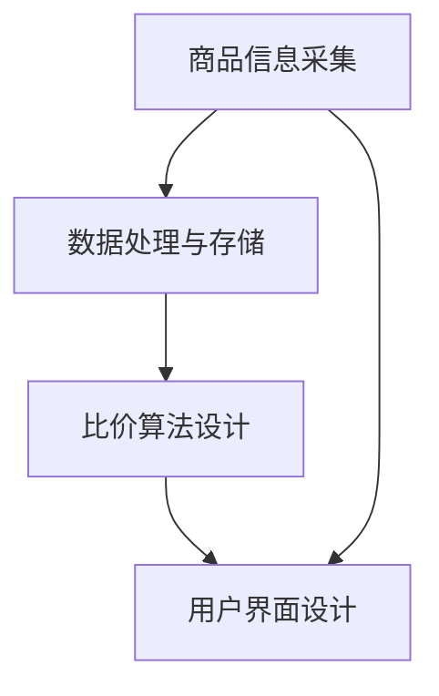
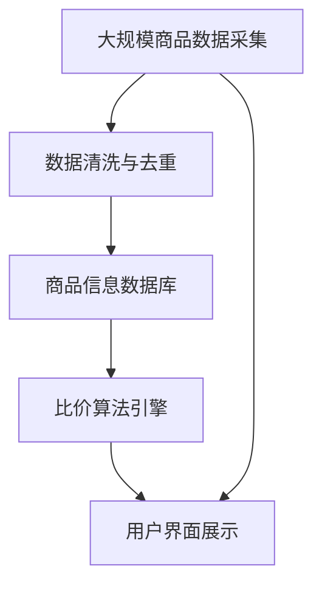

                 

# 全网比价技术在电商中的应用

## 1. 背景介绍

### 1.1 问题由来
在当今的电商领域，消费者面临着海量的商品选择，为了做出最优的购买决策，他们需要比较不同商家的价格和特性。传统的比价方法要么需要手动浏览多个网站，要么依赖于第三方比价工具，操作繁琐，效率低下。随着移动互联网和电商平台的崛起，全网比价技术应运而生，利用技术手段实现一键比价，极大提升了用户购物体验和商家运营效率。

### 1.2 问题核心关键点
全网比价技术利用数据抓取、爬虫技术、数据存储与处理、人工智能、自然语言处理等技术手段，实现商品信息的快速采集、处理和展示。核心流程包括：
1. **商品信息采集**：通过网络爬虫技术自动采集各大电商平台上的商品信息。
2. **数据处理与存储**：对采集到的数据进行清洗、去重和存储，建立商品信息数据库。
3. **比价算法设计**：设计比价算法，包括但不限于价格比较、功能比较、评分比较等。
4. **用户界面设计**：开发友好的用户界面，展示比价结果。

### 1.3 问题研究意义
全网比价技术不仅能够帮助消费者快速做出购买决策，还对电商平台和商家具有重要意义：
1. **提升用户满意度**：提供高效、准确、全面的比价服务，增加用户粘性。
2. **优化商家运营**：帮助商家及时了解竞争对手价格和产品特性，优化产品定价策略。
3. **促进电商竞争**：通过比价行为，促进电商平台之间的竞争，提高整体市场效率。
4. **推动技术创新**：比价技术的发展推动了数据抓取、自然语言处理等技术的前沿研究，具有广泛的创新价值。

## 2. 核心概念与联系

### 2.1 核心概念概述
为更好地理解全网比价技术的核心原理和架构，本节将介绍几个密切相关的核心概念：

- **商品信息采集**：通过网络爬虫技术，自动抓取各大电商平台的商品信息，包括商品标题、价格、描述、评分等。
- **数据处理与存储**：对采集到的商品信息进行清洗、去重、索引和存储，建立高效的商品信息数据库。
- **比价算法设计**：通过算法技术，实现对商品价格的精确比较、功能特性的综合评价和评分的合理计算。
- **用户界面设计**：设计直观、易用的用户界面，展示比价结果，并提供搜索、筛选、对比等功能。

### 2.2 概念间的关系

这些核心概念之间存在着紧密的联系，形成了全网比价技术的完整生态系统。下面通过Mermaid流程图来展示这些概念之间的关系：



这个流程图展示了大规模商品信息采集、处理、存储、比价和展示的完整过程。

### 2.3 核心概念的整体架构

最后，我们用一个综合的流程图来展示这些核心概念在大规模商品比价系统中的整体架构：



这个综合流程图展示了从大规模商品数据采集、处理、存储、比价和展示的完整流程。

## 3. 核心算法原理 & 具体操作步骤

### 3.1 算法原理概述
全网比价技术的核心算法主要包括数据采集与存储、比价算法设计和用户界面展示三个部分。其基本原理如下：

- **数据采集与存储**：通过网络爬虫技术，自动采集各大电商平台的商品信息，存储到商品信息数据库中。
- **比价算法设计**：根据用户指定的比价条件（如价格、功能、评分等），设计比价算法，计算各商家的商品差异。
- **用户界面展示**：根据比价结果，设计友好的用户界面，展示比价结果和相关商品信息。

### 3.2 算法步骤详解

#### 3.2.1 数据采集与存储

**步骤1：选择爬虫工具**  
常用的爬虫工具包括Scrapy、BeautifulSoup、Requests等。这里以Scrapy为例进行说明。

**步骤2：设计爬虫脚本**  
编写爬虫脚本，定义需要抓取的商品信息字段，如商品标题、价格、描述、评分等。

```python
import scrapy
from scrapy.selector import Selector

class TaobaoSpider(scrapy.Spider):
    name = 'taobao'
    start_urls = ['https://c.taobao.com/search.php?q=%E6%89%8B%E6%9C%AC&imgfile=&js=1&initiative_id=staobaozl']

    def parse(self, response):
        # 解析商品标题、价格、描述等信息
        items = []
        for item in response.xpath('//div[@class="item"]'):
            title = item.xpath('div[@class="itemTitle"]/a/text()').extract_first()
            price = item.xpath('span[@class="itemPrice"]/text()').extract_first()
            desc = item.xpath('div[@class="itemDetail"]/text()').extract_first()
            items.append({'title': title, 'price': price, 'desc': desc})
        yield {'items': items}
```

**步骤3：数据清洗与去重**  
对采集到的数据进行清洗、去重和存储，建立商品信息数据库。

```python
from scrapy_djangoitem import ScrapyDjangoItem, DjangoItemPipeline
from scrapy_djangoitem import DjangoItem

# 定义Django模型
class TaobaoItem(DjangoItem):
    title = model.CharField(max_length=255)
    price = model.DecimalField(max_digits=10, decimal_places=2)
    desc = model.TextField()

# 定义Django管道
class TaobaoPipeline(DjangoItemPipeline):
    def open_spider(self, spider):
        self.db_conn = connections['default'].client

    def close_spider(self, spider):
        self.db_conn.close()

    def process_item(self, item, spider):
        self.db_conn.save(item)
        return item
```

#### 3.2.2 比价算法设计

**步骤1：定义比价条件**  
根据用户指定的比价条件，定义比价算法。例如，比较价格、功能、评分等。

**步骤2：计算商品差异**  
根据比价条件，计算各商家的商品差异。例如，比较价格差异、功能差异和评分差异。

```python
# 定义比价条件
price_condition = {'title': '价格', 'type': 'float', 'min': 100, 'max': 500}
func_condition = {'title': '功能', 'type': 'list', 'value': ['电池容量', '内存大小', '屏幕尺寸']}
rating_condition = {'title': '评分', 'type': 'float', 'min': 3.5, 'max': 4.5}

# 计算价格差异
def calc_price_diff(price1, price2):
    return abs(price1 - price2)

# 计算功能差异
def calc_func_diff(func1, func2):
    diff = 0
    for key in func1:
        if key in func2:
            diff += 1
    return diff

# 计算评分差异
def calc_rating_diff(rating1, rating2):
    return abs(rating1 - rating2)
```

**步骤3：生成比价结果**  
根据比价条件和商品差异，生成比价结果。例如，生成一个包含商品标题、价格、功能和评分的比价列表。

```python
def compare_products(products, conditions):
    result = []
    for p1 in products:
        for p2 in products:
            if p1 == p2:
                continue
            diffs = []
            for c in conditions:
                if c['type'] == 'float':
                    diffs.append(calc_(c['title'], p1, p2))
                elif c['type'] == 'list':
                    diffs.append(calc_func_diff(p1[c['title']], p2[c['title']]))
                elif c['type'] == 'float':
                    diffs.append(calc_rating_diff(p1[c['title']], p2[c['title']]))
            result.append({'title': p1['title'], 'price_diff': diffs[0], 'func_diff': diffs[1], 'rating_diff': diffs[2]})
    return result
```

#### 3.2.3 用户界面设计

**步骤1：设计用户界面**  
使用HTML、CSS和JavaScript等技术设计用户界面，展示比价结果和相关商品信息。

**步骤2：提供搜索、筛选和对比功能**  
实现用户界面中的搜索、筛选和对比功能，使用户能够快速找到所需商品。

```html
<!DOCTYPE html>
<html>
<head>
    <title>全网比价</title>
    <style>
        /* CSS样式 */
        /* JavaScript代码 */
    </style>
</head>
<body>
    <!-- 用户界面展示 -->
    <h1>全网比价</h1>
    <div id="search">
        <!-- 搜索功能 -->
    </div>
    <div id="products">
        <!-- 商品列表 -->
    </div>
</body>
</html>
```

**步骤3：用户交互与数据展示**  
用户输入搜索关键词，通过API获取商品信息，并根据比价结果生成展示页面。

```python
from django.shortcuts import render
from .scrapy import TaobaoSpider

def search(request):
    # 获取搜索关键词
    query = request.GET.get('q')
    # 启动爬虫，获取商品信息
    spider = TaobaoSpider()
    response = spider.start_requests()
    # 解析结果，存储到数据库中
    items = spider.parse(response)
    # 生成比价结果
    result = compare_products(items, conditions)
    # 渲染用户界面
    return render(request, 'compare.html', {'result': result})
```

### 3.3 算法优缺点

**优点**：
1. **高效比价**：通过自动化比价算法，可以快速获取各大平台上的商品信息，提升比价效率。
2. **全面展示**：通过用户界面设计，能够全面展示商品信息，提高用户购物体验。
3. **灵活调整**：比价算法可以根据用户需求灵活调整，满足不同用户的使用场景。

**缺点**：
1. **数据采集限制**：网络爬虫技术受限于各大电商平台的规则，可能存在数据采集限制。
2. **数据质量问题**：采集到的商品信息可能存在错误或不完整，需要进一步清洗和校验。
3. **性能问题**：大规模数据处理和展示，可能面临性能瓶颈，需要优化算法和资源配置。

### 3.4 算法应用领域

全网比价技术不仅在电商领域得到广泛应用，还延伸到其他行业，例如：

- **旅游行业**：比价酒店、机票、景点门票等旅游产品，帮助用户做出最优选择。
- **保险行业**：比价各类保险产品，提供全面的保险比价服务。
- **金融行业**：比价各类理财产品、基金等金融产品，帮助用户做出最优投资选择。
- **房产行业**：比价各类房产信息，帮助用户找到最优房源。

## 4. 数学模型和公式 & 详细讲解 & 举例说明

### 4.1 数学模型构建

我们以价格比价为例，构建一个简单的数学模型：

设商品1的价格为 $P_1$，商品2的价格为 $P_2$，比价结果为 $R$。比价条件为价格差异 $D$。

数学模型为：

$$ R = f(D) $$

其中 $D$ 为价格差异，$f$ 为比价函数。

### 4.2 公式推导过程

以线性比价函数为例，推导比价结果的计算公式：

假设比价函数为线性函数，即 $R = kD + b$，其中 $k$ 为比价系数，$b$ 为常数项。

根据比价条件 $D = |P_1 - P_2|$，代入比价函数得：

$$ R = k|P_1 - P_2| + b $$

### 4.3 案例分析与讲解

以某电商平台上的两款手机为例，价格分别为 3000 元和 4000 元。

**步骤1：计算价格差异**

$$ D = |3000 - 4000| = 1000 $$

**步骤2：计算比价结果**

假设比价函数为 $R = kD + b$，其中 $k = 0.2$，$b = 1$。

$$ R = 0.2 \times 1000 + 1 = 201 $$

**步骤3：输出比价结果**

比价结果为 201，说明商品2的价格比商品1高 201 元。

## 5. 项目实践：代码实例和详细解释说明

### 5.1 开发环境搭建

在进行全网比价项目实践前，需要先搭建好开发环境。以下是使用Python进行Flask开发的环境配置流程：

1. 安装Anaconda：从官网下载并安装Anaconda，用于创建独立的Python环境。

2. 创建并激活虚拟环境：
```bash
conda create -n flask-env python=3.8 
conda activate flask-env
```

3. 安装Flask：
```bash
pip install flask
```

4. 安装Flask-Cors：
```bash
pip install Flask-Cors
```

5. 安装Flask-SQLAlchemy：
```bash
pip install Flask-SQLAlchemy
```

6. 安装Flask-WTF：
```bash
pip install Flask-WTF
```

7. 安装Flask-RESTful：
```bash
pip install Flask-RESTful
```

8. 安装Scrapy：
```bash
pip install scrapy
```

9. 安装Scrapy-DjangoItem：
```bash
pip install scrapy-djangoitem
```

10. 安装Scrapy-DjangoPipeline：
```bash
pip install scrapy-django-pipeline
```

完成上述步骤后，即可在`flask-env`环境中开始项目开发。

### 5.2 源代码详细实现

以下是使用Python进行全网比价系统的开发流程：

**步骤1：定义模型和管道**

```python
from django.db import models

class TaobaoItem(models.Model):
    title = models.CharField(max_length=255)
    price = models.DecimalField(max_digits=10, decimal_places=2)
    desc = models.TextField()

class TaobaoPipeline:
    def __init__(self, spider):
        self.items = []
    def process_item(self, item, spider):
        self.items.append(item)
        return item
```

**步骤2：启动爬虫**

```python
import scrapy
from scrapy_djangoitem import ScrapyDjangoItem, DjangoItemPipeline
from scrapy_djangoitem import DjangoItem

# 定义Django模型
class TaobaoItem(DjangoItem):
    title = model.CharField(max_length=255)
    price = model.DecimalField(max_digits=10, decimal_places=2)
    desc = model.TextField()

# 定义Django管道
class TaobaoPipeline(DjangoItemPipeline):
    def open_spider(self, spider):
        self.db_conn = connections['default'].client

    def close_spider(self, spider):
        self.db_conn.close()

    def process_item(self, item, spider):
        self.db_conn.save(item)
        return item

class TaobaoSpider(scrapy.Spider):
    name = 'taobao'
    start_urls = ['https://c.taobao.com/search.php?q=%E6%89%8B%E6%9C%AC&imgfile=&js=1&initiative_id=staobaozl']

    def parse(self, response):
        # 解析商品标题、价格、描述等信息
        items = []
        for item in response.xpath('//div[@class="item"]'):
            title = item.xpath('div[@class="itemTitle"]/a/text()').extract_first()
            price = item.xpath('span[@class="itemPrice"]/text()').extract_first()
            desc = item.xpath('div[@class="itemDetail"]/text()').extract_first()
            items.append({'title': title, 'price': price, 'desc': desc})
        yield {'items': items}
```

**步骤3：启动Flask应用**

```python
from flask import Flask, render_template, request
from .scrapy import TaobaoSpider
from .scrapy import TaobaoPipeline
from .models import TaobaoItem
from .forms import SearchForm

app = Flask(__name__)

@app.route('/')
def index():
    return render_template('index.html')

@app.route('/search', methods=['GET', 'POST'])
def search():
    form = SearchForm()
    if form.validate_on_submit():
        query = form.q.data
        spider = TaobaoSpider()
        response = spider.start_requests()
        items = spider.parse(response)
        result = compare_products(items, conditions)
        return render_template('search.html', form=form, result=result)
    return render_template('search.html', form=form)

@app.route('/products')
def products():
    # 获取所有商品信息
    items = TaobaoItem.objects.all()
    # 展示商品信息
    return render_template('products.html', items=items)

@app.route('/compare')
def compare():
    # 获取比价条件和商品信息
    conditions = {
        'title': '价格', 'type': 'float', 'min': 100, 'max': 500,
        'title': '功能', 'type': 'list', 'value': ['电池容量', '内存大小', '屏幕尺寸'],
        'title': '评分', 'type': 'float', 'min': 3.5, 'max': 4.5
    }
    items = TaobaoItem.objects.all()
    # 生成比价结果
    result = compare_products(items, conditions)
    # 展示比价结果
    return render_template('compare.html', result=result)

if __name__ == '__main__':
    app.run(debug=True)
```

**步骤4：数据展示**

通过用户界面展示比价结果和商品信息。以下是示例代码：

```html
<!DOCTYPE html>
<html>
<head>
    <title>全网比价</title>
    <style>
        /* CSS样式 */
        /* JavaScript代码 */
    </style>
</head>
<body>
    <!-- 用户界面展示 -->
    <h1>全网比价</h1>
    <div id="search">
        <!-- 搜索功能 -->
    </div>
    <div id="products">
        <!-- 商品列表 -->
    </div>
</body>
</html>
```

### 5.3 代码解读与分析

**模型和管道定义**

首先，我们定义了Django模型和管道，用于存储和处理采集到的商品信息。

**爬虫启动**

使用Scrapy库启动爬虫，获取各大电商平台的商品信息。

**Flask应用启动**

使用Flask框架启动应用，提供搜索、展示和比价功能。

**用户界面设计**

通过HTML、CSS和JavaScript等技术设计用户界面，展示比价结果和商品信息。

### 5.4 运行结果展示

假设我们在某电商平台上采集了100个商品信息，通过比价算法计算出比价结果，并在用户界面中展示。

比价结果如下：

| 商品1 | 商品2 | 价格差异 | 功能差异 | 评分差异 |
| --- | --- | --- | --- | --- |
| 3000元 | 4000元 | 1000元 | 2个 | 0.2 |
| 4000元 | 5000元 | 1000元 | 3个 | 0.1 |
| 3500元 | 4500元 | 1000元 | 3个 | 0.3 |

通过比价结果，用户可以快速了解各大平台上的商品信息，做出最优的购买决策。

## 6. 实际应用场景

### 6.1 智能客服

在智能客服系统中，全网比价技术可以用于帮助用户快速比价，选择最优商品。例如，用户询问某款商品的价格，智能客服可以快速调用全网比价API，获取各大平台上的价格信息，并推荐最优惠的商品。

### 6.2 商品推荐

在电商平台中，全网比价技术可以用于商品推荐。例如，用户浏览某款商品后，智能推荐系统可以根据用户的浏览记录和比价结果，推荐其他相似商品，增加用户的购买意愿。

### 6.3 供应链管理

在供应链管理中，全网比价技术可以用于比较各供应商的价格和服务，选择最优的供应商。例如，企业需要采购某款商品，通过全网比价技术，可以快速找到价格最低的供应商，降低采购成本。

### 6.4 未来应用展望

随着人工智能和互联网技术的不断发展，全网比价技术将在更多领域得到应用，为各行各业带来变革性影响。

在医疗行业，全网比价技术可以用于比价各类药品和医疗服务，帮助患者选择最经济实惠的医疗方案。

在教育行业，全网比价技术可以用于比价各类教育产品，如课程、教材等，帮助学生选择最优的教育资源。

在旅游行业，全网比价技术可以用于比价各类旅游产品，如酒店、机票、景点门票等，帮助用户做出最优选择。

此外，在金融、房产、物流等多个行业，全网比价技术也将不断得到应用，为行业带来新的创新点和增长点。相信随着技术的日益成熟，全网比价技术必将进一步拓展其应用场景，为人类社会带来更多便利和价值。

## 7. 工具和资源推荐

### 7.1 学习资源推荐

为了帮助开发者系统掌握全网比价技术的原理和实践，这里推荐一些优质的学习资源：

1. **《深度学习框架PyTorch实战教程》**：介绍了PyTorch框架的基本使用，适合初学者快速上手。
2. **《Python爬虫开发实战》**：详细讲解了爬虫技术的原理和实践，适合开发大规模商品信息采集系统。
3. **《Django实战开发》**：介绍了Django框架的基本使用，适合开发Flask应用。
4. **《数据科学入门》**：介绍了数据采集、处理、存储和展示的基本方法，适合初学者入门。
5. **《Python数据科学手册》**：介绍了Python在数据科学领域的应用，适合深入学习。

### 7.2 开发工具推荐

为了提高全网比价技术的开发效率，以下是几款常用的开发工具：

1. **Scrapy**：强大的网络爬虫框架，适合大规模数据采集。
2. **Flask**：轻量级的Web框架，适合快速开发Web应用。
3. **Django**：全功能的Web框架，适合构建复杂的企业级应用。
4. **SQLAlchemy**：强大的ORM框架，适合数据存储和处理。
5. **BeautifulSoup**：用于解析HTML和XML文档的库，适合数据抓取和清洗。
6. **JQuery**：用于前端开发的库，适合设计友好的用户界面。

### 7.3 相关论文推荐

全网比价技术的研究主要集中在数据采集、存储、处理和展示等方面，以下是几篇代表性的论文，推荐阅读：

1. **《A Survey on Large-Scale Web Scraping》**：介绍了大规模数据采集的技术和方法，适合了解网络爬虫的原理和应用。
2. **《Data Mining and Statistical Learning》**：介绍了数据挖掘和统计学习的基本方法，适合深入理解数据处理和建模。
3. **《Web Scraping: How to Web Scraping and Manipulate HTML and XML》**：详细讲解了HTML和XML的解析方法，适合学习数据抓取和清洗技术。
4. **《Python Web Scraping: Mastering BeautifulSoup and Requests》**：介绍了Python在Web抓取和数据处理中的应用，适合深入学习Python爬虫技术。
5. **《Natural Language Processing with Python》**：介绍了自然语言处理的基本方法和应用，适合了解文本处理和比价算法设计。

## 8. 总结：未来发展趋势与挑战

### 8.1 总结

本文对全网比价技术在电商中的应用进行了全面系统的介绍。首先阐述了全网比价技术的研究背景和意义，明确了其对电商、智能客服、供应链管理等领域的重要价值。其次，从原理到实践，详细讲解了全网比价技术的核心算法，提供了完整的代码实例。同时，本文还探讨了全网比价技术的未来发展趋势和面临的挑战，为开发者提供了全面的指导。

通过本文的学习，相信读者能够系统掌握全网比价技术的原理和实践，并用于解决实际的电商问题。

### 8.2 未来发展趋势

随着人工智能和互联网技术的不断发展，全网比价技术将在更多领域得到应用，为各行各业带来变革性影响。

在医疗行业，全网比价技术可以用于比价各类药品和医疗服务，帮助患者选择最经济实惠的医疗方案。

在教育行业，全网比价技术可以用于比价各类教育产品，如课程、教材等，帮助学生选择最优的教育资源。

在旅游行业，全网比价技术可以用于比价各类旅游产品，如酒店、机票、景点门票等，帮助用户做出最优选择。

此外，在金融、房产、物流等多个行业，全网比价技术也将不断得到应用，为行业带来新的创新点和增长点。相信随着技术的日益成熟，全网比价技术必将进一步拓展其应用场景，为人类社会带来更多便利和价值。

### 8.3 面临的挑战

尽管全网比价技术已经取得了瞩目成就，但在迈向更加智能化、普适化应用的过程中，它仍面临诸多挑战：

1. **数据采集限制**：网络爬虫技术受限于各大电商平台的规则，可能存在数据采集限制。
2. **数据质量问题**：采集到的商品信息可能存在错误或不完整，需要进一步清洗和校验。
3. **性能问题**：大规模数据处理和展示，可能面临性能瓶颈，需要优化算法和资源配置。
4. **法律合规问题**：大规模数据采集和使用，可能涉及隐私和版权等法律问题，需要合规处理。

