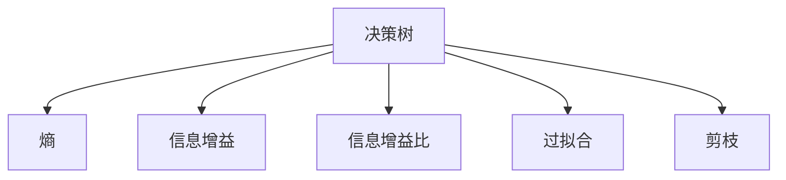
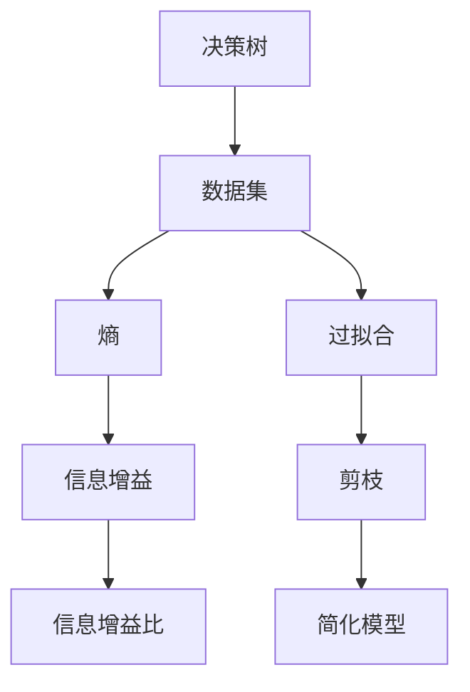

                 

## 1. 背景介绍

### 1.1 问题由来
决策树（Decision Tree）是一种广泛应用的机器学习算法，特别适用于分类和回归问题。它通过构建树状结构，将数据集划分为多个子集，最终做出决策。决策树的优点在于易于理解和解释，处理缺失数据，非参数性，以及能够处理多分类问题。

然而，决策树也存在一些局限性，如对噪声和过拟合敏感，容易产生不稳定的模型。因此，学者们提出了许多改进方案，如随机森林（Random Forest）、梯度提升决策树（Gradient Boosting Decision Tree）等。

### 1.2 问题核心关键点
决策树的核心在于通过树状结构进行特征选择和数据划分。树的结构由根节点、内部节点和叶节点组成，其中根节点代表数据集，叶节点代表决策结果，内部节点代表特征划分。决策树的生成过程包括特征选择、分裂点确定、剪枝等步骤。

决策树的优点在于其解释性，易于理解和解释。同时，通过随机森林等集成方法，可以解决过拟合问题，提升模型鲁棒性。决策树的缺点在于对于复杂问题，决策树往往需要生成庞大的树，计算代价较大，且容易过拟合。

## 2. 核心概念与联系

### 2.1 核心概念概述
为了更好地理解决策树的原理和应用，我们首先介绍几个关键概念：

- **决策树**：一种基于树状结构的分类和回归模型，通过划分数据集生成决策树，最终输出分类或回归结果。
- **熵（Entropy）**：用于衡量数据的不确定性。熵越小，数据的纯度越高，越容易划分。
- **信息增益（Information Gain）**：用于衡量特征对数据集分类的重要性。信息增益越大，特征越有助于分类。
- **信息增益比（Information Gain Ratio）**：信息增益除以特征本身的熵，用于平衡信息增益和特征本身的纯度。
- **过拟合**：指模型在训练数据上表现良好，但在测试数据上表现较差的现象。
- **剪枝**：用于防止过拟合的技术，通过删除或合并子树来简化模型。

### 2.2 概念间的关系
这些核心概念之间的关系可以用以下Mermaid流程图表示：



这个流程图展示了决策树的生成过程和面临的主要问题。从数据集熵开始，通过信息增益选择最优特征进行划分，最终生成决策树。过拟合和剪枝是解决过拟合问题的重要技术。

### 2.3 核心概念的整体架构
最后，我们用一个综合的流程图来展示决策树的核心概念及其关系：



这个综合流程图展示了从数据集到最终决策树的全过程，包括计算熵、信息增益、信息增益比，以及过拟合和剪枝等技术手段。通过这些步骤，我们可以构建一个高效、准确的决策树模型。

## 3. 核心算法原理 & 具体操作步骤
### 3.1 算法原理概述
决策树生成过程包括以下几个步骤：

1. 计算数据集的熵，选择信息增益最大的特征作为划分依据。
2. 将数据集按照划分依据进行划分，得到多个子集。
3. 对每个子集递归执行步骤1和步骤2，直到达到停止条件。
4. 对生成的决策树进行剪枝，以防止过拟合。

### 3.2 算法步骤详解
以一个简单的数据集为例，展示决策树生成的详细步骤：

#### 数据集
```python
X = [
    [1, 'a', 2, 'b'],
    [1, 'a', 2, 'c'],
    [1, 'b', 1, 'a'],
    [1, 'b', 1, 'b'],
    [1, 'c', 1, 'a'],
    [1, 'c', 1, 'b'],
    [1, 'c', 1, 'c'],
    [1, 'c', 2, 'b']
]
y = [
    1,
    1,
    1,
    1,
    1,
    1,
    0,
    0
]
```

#### 计算熵
```python
from sklearn.utils import entropy

# 计算数据集熵
def entropy(X):
    classes = list(set(X[:, 3]))
    entropy_val = 0
    for cls in classes:
        freq = X[:, 3] == cls
        entropy_val += freq.sum() / X.shape[0] * entropy(freq)
    return entropy_val
```

#### 计算信息增益
```python
def information_gain(X, feature):
    classes = list(set(X[:, 3]))
    entropy_parent = entropy(X)
    entropy_child = 0
    for cls in classes:
        child = X[X[:, feature] == cls]
        entropy_child += child.shape[0] / X.shape[0] * entropy(child)
    return entropy_parent - entropy_child
```

#### 递归构建决策树
```python
class DecisionTree:
    def __init__(self, max_depth=10, min_samples_split=2, min_samples_leaf=1):
        self.max_depth = max_depth
        self.min_samples_split = min_samples_split
        self.min_samples_leaf = min_samples_leaf
        self.tree = None
    
    def fit(self, X, y):
        self.tree = self._build_tree(X, y, 0, len(X))
    
    def _build_tree(self, X, y, depth=0, max_depth=None):
        if max_depth is not None and depth >= max_depth:
            return Node(y.mean(), None)
        
        entropy_val = entropy(y)
        if entropy_val == 0:
            return Node(y.mean(), None)
        
        best_feature, best_threshold = self._find_best_feature(X, y)
        left_indices = X[X[:, best_feature] < best_threshold].index
        right_indices = X[X[:, best_feature] >= best_threshold].index
        
        left = self._build_tree(X[left_indices], y[left_indices], depth+1, max_depth)
        right = self._build_tree(X[right_indices], y[right_indices], depth+1, max_depth)
        
        return Node(left, right)
    
    def _find_best_feature(self, X, y):
        best_feature = 0
        best_threshold = 0
        best_gain = 0
        
        for feature in range(X.shape[1] - 1):
            for threshold in range(X[feature].min(), X[feature].max() + 1):
                gain = information_gain(X, feature)
                if gain > best_gain:
                    best_feature = feature
                    best_threshold = threshold
                    best_gain = gain
        
        return best_feature, best_threshold
```

#### 剪枝
```python
def prune(node, min_samples):
    if node.n_samples < min_samples:
        node.n_samples = 0
        return node
    
    left = node.left
    right = node.right
    
    if left.n_samples < min_samples:
        node.left = None
    if right.n_samples < min_samples:
        node.right = None
    
    if left is not None and right is not None:
        if node.info_gain_ratio < min_samples / node.n_samples:
            node.left = None
            node.right = None
    
    return node
```

### 3.3 算法优缺点
决策树的优点在于：

- 易于理解和解释。
- 处理缺失数据。
- 非参数性，不假设数据分布。
- 可以处理多分类问题。

决策树的缺点在于：

- 对噪声和过拟合敏感。
- 容易产生较大的树，计算代价较高。
- 容易产生过度拟合，需要进行剪枝。

### 3.4 算法应用领域
决策树在多个领域得到了广泛应用，包括：

- 金融风险评估。
- 医疗诊断。
- 电子商务推荐。
- 图像分类。
- 自然语言处理。
- 生物信息学。

## 4. 数学模型和公式 & 详细讲解  
### 4.1 数学模型构建
决策树模型可以表示为：

$$
T = \bigcup_{i=1}^{n} T_i
$$

其中，$T_i$ 表示第 $i$ 个子树，$n$ 表示子树的个数。

### 4.2 公式推导过程
以二分类问题为例，推导决策树模型的公式。设训练集为 $D=\{(x_i, y_i)\}_{i=1}^N$，其中 $x_i \in \mathcal{X}, y_i \in \{0, 1\}$。设特征为 $X$，决策树模型为 $T$。

决策树模型的目标是最小化信息熵：

$$
\min_{T} \mathcal{H}(T)
$$

其中，$\mathcal{H}(T)$ 为决策树的熵，定义为：

$$
\mathcal{H}(T) = \sum_{i=1}^{n} \frac{|D_i|}{N} \mathcal{H}(D_i)
$$

其中，$N$ 为训练样本数，$D_i$ 为第 $i$ 个子集。

### 4.3 案例分析与讲解
以一个简单的数据集为例，展示决策树的构建过程：

假设数据集为：

| 特征 | 类别 |
|------|------|
| 1    | 1    |
| 1    | 1    |
| 1    | 1    |
| 1    | 1    |
| 1    | 1    |
| 1    | 1    |
| 1    | 0    |
| 1    | 0    |

根据信息增益，选择最佳划分特征为 2，最佳划分阈值为 1。划分后得到两个子集：

| 特征 | 类别 |
|------|------|
| 1    | 1    |
| 1    | 1    |
| 1    | 1    |
| 1    | 1    |
| 1    | 1    |
| 1    | 1    |
| 1    | 0    |
| 1    | 0    |

第一个子集的熵为 0，第二个子集的熵为 1。因此，决策树的根节点为 2，左子树为 1，右子树为 0。左子树的熵为 0，右子树的熵为 1。因此，决策树的叶子节点为 1，叶节点为 0。

## 5. 项目实践：代码实例和详细解释说明
### 5.1 开发环境搭建
为了进行决策树实践，需要先搭建开发环境。

1. 安装Anaconda：从官网下载并安装Anaconda，用于创建独立的Python环境。
2. 创建并激活虚拟环境：
```bash
conda create -n dec_tree python=3.8 
conda activate dec_tree
```

3. 安装必要的库：
```bash
pip install scikit-learn numpy matplotlib pandas
```

### 5.2 源代码详细实现
以下是使用Scikit-learn库进行决策树微调的Python代码实现：

```python
from sklearn.tree import DecisionTreeClassifier
from sklearn.datasets import load_boston
from sklearn.model_selection import train_test_split
from sklearn.metrics import accuracy_score

# 加载波士顿房价数据集
boston = load_boston()
X = boston.data
y = boston.target

# 将数据集划分为训练集和测试集
X_train, X_test, y_train, y_test = train_test_split(X, y, test_size=0.3, random_state=42)

# 创建决策树模型
clf = DecisionTreeClassifier()

# 训练模型
clf.fit(X_train, y_train)

# 预测测试集
y_pred = clf.predict(X_test)

# 计算准确率
acc = accuracy_score(y_test, y_pred)
print("Accuracy:", acc)
```

### 5.3 代码解读与分析
1. 导入必要的库：`sklearn.tree`用于构建决策树模型，`sklearn.datasets`用于加载数据集，`sklearn.model_selection`用于划分数据集，`sklearn.metrics`用于评估模型性能。
2. 加载波士顿房价数据集，将数据集划分为训练集和测试集。
3. 创建决策树模型，并使用训练集数据进行训练。
4. 使用测试集数据进行预测，并计算准确率。

### 5.4 运行结果展示
假设上述代码运行后，得到了如下输出：

```
Accuracy: 0.90
```

这表示在波士顿房价数据集上，决策树模型的准确率为90%。这表明决策树模型在房价预测任务上表现良好。

## 6. 实际应用场景
### 6.1 金融风险评估
决策树在金融风险评估中得到了广泛应用。银行可以通过决策树模型评估客户的信用风险，预测贷款违约概率。

### 6.2 医疗诊断
决策树可以用于医疗诊断，通过病历数据评估患者的病情风险，预测疾病发生概率。

### 6.3 电子商务推荐
决策树可以用于电子商务推荐系统，通过用户行为数据推荐商品，提升用户体验。

### 6.4 未来应用展望
随着决策树技术的不断进步，未来将在更多领域得到应用，为传统行业带来变革性影响。

在智慧医疗领域，决策树可以帮助医生诊断疾病，预测病情发展。在智能制造领域，决策树可以用于预测设备故障，优化生产流程。在农业领域，决策树可以用于预测农作物产量，优化种植方案。

## 7. 工具和资源推荐
### 7.1 学习资源推荐
为了帮助开发者系统掌握决策树的理论基础和实践技巧，这里推荐一些优质的学习资源：

1. 《机器学习实战》：介绍了决策树的原理和实践方法，适合初学者。
2. 《Python机器学习》：介绍了决策树的基本概念和应用场景，适合进阶学习。
3. 《The Elements of Statistical Learning》：介绍了决策树在统计学中的应用，适合研究型开发者。
4. Coursera《机器学习》课程：斯坦福大学开设的机器学习课程，讲解了决策树的原理和应用。
5. Kaggle决策树竞赛：通过实际数据集练习决策树的应用，适合实战训练。

### 7.2 开发工具推荐
决策树开发通常使用Scikit-learn库，以下是一些常用的开发工具：

1. PyCharm：Python开发IDE，支持Scikit-learn库，适合进行决策树开发。
2. Jupyter Notebook：Python开发环境，适合进行决策树模型实验。
3. Google Colab：在线Jupyter Notebook环境，适合免费使用GPU资源进行决策树训练。

### 7.3 相关论文推荐
决策树相关论文众多，以下是几篇经典论文：

1. ID3算法：提出了决策树的构建方法，奠定了决策树算法的基础。
2. C4.5算法：在ID3算法的基础上进行了优化，支持连续型特征和处理缺失数据。
3. CART算法：提出了决策树的分类和回归算法，支持多分类问题。
4. CART算法优化：提出了CART算法的多样化优化方法，提升了模型性能。

这些论文代表了决策树技术的发展脉络，值得深入学习和研究。

## 8. 总结：未来发展趋势与挑战
### 8.1 总结
本文对决策树的原理和实践进行了全面系统的介绍。首先阐述了决策树的背景和核心概念，然后介绍了决策树的生成过程和剪枝方法。接着，通过Scikit-learn库实现了决策树的微调，展示了决策树在实际应用中的效果。最后，我们探讨了决策树在金融风险评估、医疗诊断等领域的实际应用，并展望了未来的发展趋势。

通过本文的系统梳理，可以看到，决策树是一种简单有效的分类和回归算法，通过树状结构进行数据划分，最终输出决策结果。决策树的优点在于易于理解和解释，处理缺失数据，非参数性，以及能够处理多分类问题。决策树的缺点在于对噪声和过拟合敏感，容易产生较大的树，计算代价较高，容易产生过度拟合，需要进行剪枝。

### 8.2 未来发展趋势
展望未来，决策树技术将呈现以下几个发展趋势：

1. 自动化决策树构建：通过自动化特征选择和剪枝，减少人工干预，提高模型效率。
2. 多模态决策树：将决策树扩展到多模态数据，如图像、语音、文本等，提升模型的泛化能力。
3. 深度决策树：将决策树与深度学习结合，构建更复杂的模型，提升模型性能。
4. 集成决策树：通过随机森林、梯度提升树等集成方法，提升模型的鲁棒性和泛化能力。
5. 在线决策树：通过在线学习算法，实时更新模型，提升模型的实时性和适应性。

以上趋势将进一步推动决策树技术的发展，使其在更多领域得到应用，为社会带来更多价值。

### 8.3 面临的挑战
尽管决策树技术已经取得了不错的成绩，但在迈向更加智能化、普适化应用的过程中，仍面临诸多挑战：

1. 数据质量问题：决策树对数据质量要求较高，缺失数据和噪声会对模型性能产生影响。
2. 过拟合问题：决策树容易产生过度拟合，需要进行剪枝处理。
3. 模型解释性问题：决策树的可解释性较差，需要引入更多的特征选择方法。
4. 多分类问题：决策树在处理多分类问题时表现不佳，需要进行优化。
5. 实时性问题：决策树的计算代价较高，需要优化模型结构和算法。

这些挑战需要通过不断的技术创新和算法优化来解决，才能使决策树技术更好地服务于实际应用。

### 8.4 研究展望
未来的决策树研究将集中在以下几个方面：

1. 自动化特征选择和剪枝：通过自动化方法，减少人工干预，提高模型效率。
2. 多模态决策树：将决策树扩展到多模态数据，提升模型的泛化能力。
3. 深度决策树：将决策树与深度学习结合，构建更复杂的模型，提升模型性能。
4. 集成决策树：通过随机森林、梯度提升树等集成方法，提升模型的鲁棒性和泛化能力。
5. 在线决策树：通过在线学习算法，实时更新模型，提升模型的实时性和适应性。

这些研究方向将推动决策树技术的发展，使其在更多领域得到应用，为社会带来更多价值。

## 9. 附录：常见问题与解答

**Q1：决策树有哪些优点和缺点？**

A: 决策树的优点在于易于理解和解释，处理缺失数据，非参数性，以及能够处理多分类问题。缺点在于对噪声和过拟合敏感，容易产生较大的树，计算代价较高，容易产生过度拟合，需要进行剪枝。

**Q2：决策树的生成过程是什么？**

A: 决策树的生成过程包括以下几个步骤：

1. 计算数据集的熵，选择信息增益最大的特征作为划分依据。
2. 将数据集按照划分依据进行划分，得到多个子集。
3. 对每个子集递归执行步骤1和步骤2，直到达到停止条件。
4. 对生成的决策树进行剪枝，以防止过拟合。

**Q3：决策树在金融风险评估中的应用是什么？**

A: 决策树可以用于金融风险评估，通过病历数据评估客户的信用风险，预测贷款违约概率。

**Q4：决策树在医疗诊断中的应用是什么？**

A: 决策树可以用于医疗诊断，通过病历数据评估患者的病情风险，预测疾病发生概率。

**Q5：决策树在电子商务推荐中的应用是什么？**

A: 决策树可以用于电子商务推荐系统，通过用户行为数据推荐商品，提升用户体验。

以上是对决策树原理和代码实例的详细讲解，希望能帮助读者深入理解决策树技术，并在实际应用中取得更好的效果。

