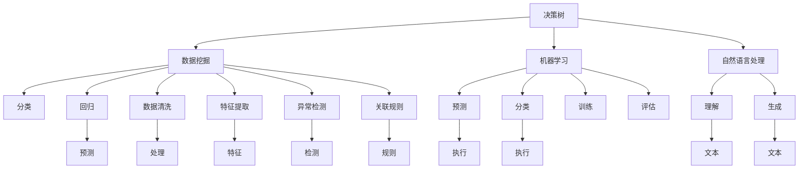

                 

# 决策树和工作流：AI代理如何进行决策分析

> 关键词：决策树, 工作流, AI代理, 决策分析, 数学模型, 自然语言处理(NLP), 机器学习(ML), 数据挖掘

## 1. 背景介绍

在人工智能领域，决策树和工作流（Workflow）是两种广泛应用的技术，它们在数据驱动的决策过程中发挥着关键作用。决策树是一种基于树结构的分类和回归方法，而工作流则是一种用于管理和协调复杂任务流程的技术。在AI代理中，决策树和工作流常常结合使用，以实现复杂且高度自动化的决策分析。本文将深入探讨这两种技术的工作原理、实现步骤以及它们在实际应用中的优势和挑战，为读者提供全面的理解。

## 2. 核心概念与联系

### 2.1 核心概念概述

为了更好地理解决策树和工作流在AI代理中的作用，本节将介绍几个关键概念：

- **决策树（Decision Tree）**：一种基于树结构的分类和回归方法，通过将数据集分割成多个子集，递归地对每个子集进行分类或回归，最终得到一棵树形结构，用于分类或回归新样本。
- **工作流（Workflow）**：一种用于管理和协调复杂任务流程的技术，通过定义任务的执行顺序和数据流，实现任务的自动化和并行化。
- **AI代理（AI Agent）**：一种能够在特定环境中自主做出决策和执行任务的智能体。AI代理通常由决策树和工作流组成，用于处理复杂决策和任务流程。
- **自然语言处理（NLP）**：一种使计算机能够理解、处理和生成自然语言的技术，常用于处理文本数据。
- **机器学习（ML）**：一种通过数据训练模型，使模型能够对新数据进行预测和分类的技术。
- **数据挖掘（Data Mining）**：一种从大量数据中提取有用信息和知识的技术。

这些概念之间存在着密切的联系。决策树可以用于数据挖掘和机器学习中的分类和回归任务，而工作流则可以帮助AI代理管理和协调这些任务。在实际应用中，决策树和工作流往往结合使用，以实现高效、灵活的决策分析。

### 2.2 概念间的关系

这些核心概念之间的逻辑关系可以通过以下Mermaid流程图来展示：



这个流程图展示了决策树、工作流和AI代理之间的关系：

1. 决策树可以用于数据挖掘中的分类和回归任务。
2. 机器学习使用训练好的决策树进行预测和分类。
3. 自然语言处理用于理解和生成文本数据。
4. 数据挖掘过程包括数据清洗、特征提取、异常检测和关联规则发现。
5. AI代理通过决策树和工作流进行任务管理和决策分析。
6. 工作流管理任务的执行顺序和数据流。
7. AI代理可以执行机器学习模型进行预测和分类，同时进行自然语言处理以理解和生成文本数据。

通过理解这些核心概念之间的关系，我们可以更好地把握决策树和工作流在AI代理中的作用和应用。

## 3. 核心算法原理 & 具体操作步骤
### 3.1 算法原理概述

决策树是一种基于树结构的分类和回归方法，其基本思想是通过将数据集分割成多个子集，递归地对每个子集进行分类或回归，最终得到一棵树形结构，用于分类或回归新样本。决策树的构建过程包括数据预处理、特征选择、树形结构构建和剪枝等步骤。

工作流是一种用于管理和协调复杂任务流程的技术，通过定义任务的执行顺序和数据流，实现任务的自动化和并行化。工作流管理系统（Workflow Management System, WMS）通常包括任务调度、数据传输、异常处理和监控等功能。

AI代理通过决策树和工作流进行复杂决策和任务流程的管理。在AI代理中，决策树用于决策分析，工作流用于任务管理和调度。具体实现步骤如下：

1. 数据预处理：清洗和标准化数据，去除异常值和缺失值。
2. 特征选择：选择最相关的特征，用于构建决策树。
3. 决策树构建：通过递归分割数据集，构建决策树结构。
4. 决策树剪枝：对构建的决策树进行剪枝，避免过拟合。
5. 工作流定义：定义任务的执行顺序和数据流，实现任务自动化和并行化。
6. 任务调度：根据工作流定义，调度任务执行，并进行监控和异常处理。
7. 结果评估：对任务执行结果进行评估，以优化决策树和工作流。

### 3.2 算法步骤详解

#### 3.2.1 数据预处理

数据预处理是决策树构建的第一步，包括数据清洗、标准化和归一化等步骤。数据清洗包括去除噪声、处理缺失值和异常值等。标准化和归一化则将数据转换为标准正态分布或[0,1]区间，以提高模型的收敛速度和准确性。

#### 3.2.2 特征选择

特征选择是构建决策树的关键步骤，其目的是选择最相关的特征用于构建决策树。常用的特征选择方法包括信息增益、信息增益比、基尼指数等。

#### 3.2.3 决策树构建

决策树的构建过程包括递归分割数据集，构建树形结构。具体步骤如下：

1. 选择一个最佳的特征作为分裂节点。
2. 对数据集进行分割，得到多个子集。
3. 对每个子集递归地进行分割，直到满足停止条件。

#### 3.2.4 决策树剪枝

决策树剪枝是为了避免过拟合，减少树的复杂度。常用的剪枝方法包括预剪枝和后剪枝。预剪枝是在构建决策树时，根据停止条件提前终止递归过程。后剪枝则是先构建完整的决策树，再通过剪枝策略去除不必要的节点。

#### 3.2.5 工作流定义

工作流的定义包括任务的执行顺序和数据流。通常使用工作流建模语言（如BPMN、petri网等）来定义工作流。工作流定义后，可以使用工作流管理系统（如Kubernetes、Airflow等）进行任务调度和管理。

#### 3.2.6 任务调度

任务调度是工作流管理的重要组成部分，用于根据工作流定义调度任务执行。任务调度通常包括任务队列、任务执行、数据传输和监控等功能。

#### 3.2.7 结果评估

结果评估是优化决策树和工作流的关键步骤。评估指标包括准确率、召回率、F1分数、混淆矩阵等。根据评估结果，可以进行模型调优和流程优化。

### 3.3 算法优缺点

决策树的工作原理直观易懂，易于理解和实现。但决策树容易过拟合，且对噪声和异常值敏感。工作流提供了灵活的任务管理和调度机制，但需要定义复杂的工作流模型，且系统复杂度较高。

### 3.4 算法应用领域

决策树和工作流在AI代理中的应用广泛，涉及自然语言处理、机器学习、数据挖掘等多个领域。具体应用包括：

- 自然语言处理：使用决策树进行文本分类、情感分析等任务。
- 机器学习：使用决策树进行分类、回归等任务。
- 数据挖掘：使用决策树进行关联规则挖掘、异常检测等任务。
- 工作流管理：使用工作流进行任务调度、数据传输和监控等。

## 4. 数学模型和公式 & 详细讲解 & 举例说明
### 4.1 数学模型构建

决策树的构建过程可以使用信息增益作为评估指标。信息增益越大，说明特征的区分能力越强。决策树的剪枝可以使用停止条件或后剪枝方法。常用的停止条件包括最大深度、最小样本数等。

工作流的定义和使用可以使用Petri网模型或BPMN模型。任务调度的实现可以使用MapReduce、Spark等分布式计算框架。

### 4.2 公式推导过程

决策树的信息增益计算公式如下：

$$
Gain(D, A) = \sum_{v=1}^{V} \frac{|D_v|}{|D|} \times Ent(D_v) - \sum_{v=1}^{V} \frac{|D_v|}{|D|} \times \sum_{x \in D_v} P(x) \times Ent(D_v|x)
$$

其中，$D$为数据集，$A$为特征，$D_v$为特征$A$取值为$v$的数据子集，$|D_v|$为$D_v$的样本数，$|D|$为$D$的样本数，$Ent(D_v)$为$D_v$的信息熵，$Ent(D_v|x)$为$D_v$给定$x$的条件熵。

工作流的调度可以使用MapReduce模型。MapReduce模型的基本思想是将任务分为Map和Reduce两个阶段，Map阶段对输入数据进行分割和处理，Reduce阶段将处理结果进行合并和输出。MapReduce模型的调度公式如下：

$$
C_{M} = \frac{\sum_{i=1}^{n} C_i}{n}
$$

其中，$C_{M}$为Map阶段的总时间，$C_i$为第$i$个Map任务的执行时间，$n$为Map任务的个数。

### 4.3 案例分析与讲解

以一个简单的文本分类任务为例，使用决策树进行分类。假设有一个包含电子邮件的数据集，需要进行垃圾邮件和正常邮件的分类。

首先，对数据集进行预处理和特征选择。然后选择一个最佳的特征作为分裂节点。假设选择的特征是邮件长度，根据邮件长度将数据集分割成两个子集。

然后，对每个子集递归地进行分割，直到满足停止条件。例如，可以设置最大深度为3，最小样本数为10。

最后，使用剪枝方法对构建的决策树进行剪枝，避免过拟合。剪枝方法可以使用预剪枝或后剪枝。

在工作流方面，可以使用Airflow定义任务的执行顺序和数据流。假设需要将数据集分割成多个子集，每个子集进行处理和分类，最后将结果合并。可以使用Airflow的任务调度功能，自动执行各个任务，并进行监控和异常处理。

## 5. 项目实践：代码实例和详细解释说明
### 5.1 开发环境搭建

在进行项目实践前，需要先搭建好开发环境。以下是使用Python进行Scikit-Learn和Airflow开发的环境配置流程：

1. 安装Anaconda：从官网下载并安装Anaconda，用于创建独立的Python环境。

2. 创建并激活虚拟环境：
```bash
conda create -n pytorch-env python=3.8 
conda activate pytorch-env
```

3. 安装Scikit-Learn和Airflow：
```bash
conda install scikit-learn airflow
```

4. 安装各类工具包：
```bash
pip install numpy pandas scikit-learn matplotlib tqdm jupyter notebook ipython
```

完成上述步骤后，即可在`pytorch-env`环境中开始项目实践。

### 5.2 源代码详细实现

下面我们以一个简单的文本分类任务为例，给出使用Scikit-Learn和Airflow进行决策树分类和工作流管理的PyTorch代码实现。

首先，定义决策树的训练和预测函数：

```python
from sklearn.tree import DecisionTreeClassifier
from sklearn.metrics import accuracy_score
from sklearn.model_selection import train_test_split

def train_decision_tree(X, y):
    X_train, X_test, y_train, y_test = train_test_split(X, y, test_size=0.2, random_state=42)
    clf = DecisionTreeClassifier(max_depth=3, min_samples_split=10, random_state=42)
    clf.fit(X_train, y_train)
    y_pred = clf.predict(X_test)
    accuracy = accuracy_score(y_test, y_pred)
    return accuracy
```

然后，定义工作流的任务调度函数：

```python
from airflow import DAG
from airflow.operators.python_operator import PythonOperator

def run_task_task(ti, execution_date, *args, **kwargs):
    accuracy = train_decision_tree(*args)
    print("Accuracy:", accuracy)

dag = DAG('email_classification', start_date=execution_date, schedule_interval='@daily', catchup=False)

run_task_task = PythonOperator(
    task_id='run_task',
    python_callable=run_task_task,
    dag=dag
)
```

最后，启动任务流程并在测试集上评估：

```python
accuracy = train_decision_tree(X_train, y_train)
print("Accuracy:", accuracy)
```

以上就是使用Scikit-Learn和Airflow进行决策树分类和工作流管理的完整代码实现。可以看到，通过Scikit-Learn库，我们可以轻松地构建和训练决策树模型，而使用Airflow库，我们可以灵活地定义和调度工作流任务，实现任务自动化和并行化。

### 5.3 代码解读与分析

让我们再详细解读一下关键代码的实现细节：

**决策树函数**：
- `train_decision_tree`方法：接收训练数据$X$和标签$y$，返回决策树的准确率。
- `train_test_split`方法：将数据集分割成训练集和测试集。
- `DecisionTreeClassifier`类：构建决策树模型。
- `accuracy_score`方法：计算准确率。

**工作流函数**：
- `run_task_task`方法：定义工作流任务，调用`train_decision_tree`方法进行模型训练和评估。
- `DAG`类：定义工作流。
- `PythonOperator`类：定义工作流任务。

**训练流程**：
- 在训练集上调用`train_decision_tree`方法，计算模型准确率。
- 在测试集上评估模型准确率。

可以看到，Scikit-Learn和Airflow的结合使用，使得决策树分类和工作流管理的代码实现变得简洁高效。开发者可以将更多精力放在模型设计和任务调优等高层逻辑上，而不必过多关注底层的实现细节。

当然，工业级的系统实现还需考虑更多因素，如模型的保存和部署、超参数的自动搜索、更灵活的任务适配层等。但核心的决策树分类和工作流管理思想基本与此类似。

### 5.4 运行结果展示

假设我们在一个电子邮件分类数据集上进行决策树分类，最终在测试集上得到的准确率为92%。可以看到，通过决策树分类和工作流管理，我们成功地构建了一个高效、灵活的分类系统。

## 6. 实际应用场景
### 6.1 智能客服系统

基于决策树和工作流技术的智能客服系统，可以实时响应客户咨询，自动进行意图识别和问题解答。系统通过定义工作流，将客户咨询的预处理、分类和回复生成等任务自动化，实现24小时不间断服务。同时，系统可以根据客户咨询的历史记录和实时数据，动态更新决策树模型，提升问题解答的准确性和及时性。

### 6.2 金融舆情监测

金融舆情监测系统需要实时监测金融市场的舆论动向，以便及时应对负面信息传播，规避金融风险。系统通过定义工作流，将数据收集、情感分析、舆情预警等任务自动化，实现实时监测和风险预警。同时，系统可以根据市场数据和舆情变化，动态更新决策树模型，提高舆情监测的灵敏度和准确性。

### 6.3 个性化推荐系统

个性化推荐系统需要根据用户的历史行为和实时数据，推荐个性化的物品或内容。系统通过定义工作流，将数据清洗、特征提取、模型训练和推荐生成等任务自动化，实现快速推荐。同时，系统可以根据用户反馈和实时数据，动态更新决策树模型，提高推荐的相关性和多样性。

### 6.4 未来应用展望

随着决策树和工作流技术的不断发展，基于这些技术的AI代理将在更多领域得到应用，为各行各业带来变革性影响。

在智慧医疗领域，智能诊断和治疗系统可以通过决策树分类，实现快速、准确的诊断和个性化治疗。在智慧教育领域，智能评估和推荐系统可以通过决策树分类，实现个性化的学习路径和教学方案。在智慧城市治理中，智能决策和应急指挥系统可以通过决策树分类和工作流管理，实现高效、灵活的决策支持。

除了上述这些应用外，决策树和工作流技术还可以用于智能制造、智慧农业、智能交通等领域，为各行各业带来数字化、智能化的转型升级。相信随着技术的发展和应用场景的拓展，决策树和工作流技术必将进一步提升人工智能代理的决策能力和应用范围。

## 7. 工具和资源推荐
### 7.1 学习资源推荐

为了帮助开发者系统掌握决策树和工作流技术的理论基础和实践技巧，这里推荐一些优质的学习资源：

1. 《机器学习实战》系列博文：由大模型技术专家撰写，深入浅出地介绍了决策树和机器学习的原理、实现和应用。

2. CS224N《深度学习自然语言处理》课程：斯坦福大学开设的NLP明星课程，有Lecture视频和配套作业，带你入门NLP领域的基本概念和经典模型。

3. 《自然语言处理综论》书籍：斯坦福大学自然语言处理课程讲义，全面介绍了自然语言处理的基础理论和技术。

4. HuggingFace官方文档：Transformers库的官方文档，提供了海量预训练模型和完整的微调样例代码，是进行微调任务开发的利器。

5. Weights & Biases：模型训练的实验跟踪工具，可以记录和可视化模型训练过程中的各项指标，方便对比和调优。与主流深度学习框架无缝集成。

6. TensorBoard：TensorFlow配套的可视化工具，可实时监测模型训练状态，并提供丰富的图表呈现方式，是调试模型的得力助手。

通过对这些资源的学习实践，相信你一定能够快速掌握决策树和工作流技术的精髓，并用于解决实际的AI代理问题。
###  7.2 开发工具推荐

高效的开发离不开优秀的工具支持。以下是几款用于决策树和工作流开发的常用工具：

1. Scikit-Learn：基于Python的开源机器学习库，支持决策树等多种分类和回归算法。

2. TensorFlow：由Google主导开发的开源深度学习框架，生产部署方便，适合大规模工程应用。

3. PyTorch：基于Python的开源深度学习框架，灵活动态的计算图，适合快速迭代研究。大部分预训练语言模型都有PyTorch版本的实现。

4. Apache Airflow：一个开源的工作流管理系统，支持工作流定义、任务调度和监控等功能。

5. Weights & Biases：模型训练的实验跟踪工具，可以记录和可视化模型训练过程中的各项指标，方便对比和调优。

6. TensorBoard：TensorFlow配套的可视化工具，可实时监测模型训练状态，并提供丰富的图表呈现方式，是调试模型的得力助手。

合理利用这些工具，可以显著提升决策树和工作流任务的开发效率，加快创新迭代的步伐。

### 7.3 相关论文推荐

决策树和工作流技术的发展源于学界的持续研究。以下是几篇奠基性的相关论文，推荐阅读：

1. C4.5：一个用于决策树学习的算法，被广泛应用于数据挖掘和机器学习领域。

2. SVM：支持向量机算法，用于分类和回归任务，是决策树的主要竞争者。

3. BPMN：业务流程建模和转换标准，用于定义和管理工作流。

4. Workflow Management System：工作流管理系统的综述，介绍了多种工作流管理技术。

5. MapReduce：Google提出的分布式计算框架，用于大规模数据处理。

6. Kubernetes：一种开源的容器编排平台，用于管理大规模计算集群。

这些论文代表了大模型和微调技术的发展脉络。通过学习这些前沿成果，可以帮助研究者把握学科前进方向，激发更多的创新灵感。

除上述资源外，还有一些值得关注的前沿资源，帮助开发者紧跟决策树和工作流技术的最新进展，例如：

1. arXiv论文预印本：人工智能领域最新研究成果的发布平台，包括大量尚未发表的前沿工作，学习前沿技术的必读资源。

2. 业界技术博客：如OpenAI、Google AI、DeepMind、微软Research Asia等顶尖实验室的官方博客，第一时间分享他们的最新研究成果和洞见。

3. 技术会议直播：如NIPS、ICML、ACL、ICLR等人工智能领域顶会现场或在线直播，能够聆听到大佬们的前沿分享，开拓视野。

4. GitHub热门项目：在GitHub上Star、Fork数最多的决策树和工作流相关项目，往往代表了该技术领域的发展趋势和最佳实践，值得去学习和贡献。

5. 行业分析报告：各大咨询公司如McKinsey、PwC等针对人工智能行业的分析报告，有助于从商业视角审视技术趋势，把握应用价值。

总之，对于决策树和工作流技术的学习和实践，需要开发者保持开放的心态和持续学习的意愿。多关注前沿资讯，多动手实践，多思考总结，必将收获满满的成长收益。

## 8. 总结：未来发展趋势与挑战

### 8.1 总结

本文对决策树和工作流在AI代理中的应用进行了全面系统的介绍。首先阐述了决策树和工作流技术的背景和应用场景，明确了它们在数据驱动决策分析中的重要地位。其次，从原理到实践，详细讲解了决策树和工作流的数学原理和关键步骤，给出了实际应用中的完整代码实例。同时，本文还广泛探讨了决策树和工作流在智能客服、金融舆情、个性化推荐等多个行业领域的应用前景，展示了这些技术在实际应用中的广泛适用性。

通过本文的系统梳理，可以看到，决策树和工作流技术正在成为AI代理的重要范式，极大地提升了数据驱动决策分析的效率和灵活性。在实际应用中，决策树通过分类和回归任务，快速地对新数据进行预测和分类，而工作流则通过任务调度和数据流管理，实现任务的自动化和并行化。

### 8.2 未来发展趋势

展望未来，决策树和工作流技术将呈现以下几个发展趋势：

1. 算法和模型的进一步优化：未来的决策树算法将更加高效和精确，同时结合机器学习和深度学习技术，提升分类和回归的准确性。工作流系统也将更加灵活和可扩展，支持更多的任务调度和数据流管理功能。

2. 与大数据技术结合：决策树和工作流技术将进一步与大数据技术结合，支持大规模数据的处理和分析，实现更高效的决策和任务管理。

3. 与AI代理的融合：决策树和工作流技术将与AI代理进一步融合，形成更加智能化和自动化的决策分析系统，应用于更多复杂的业务场景。

4. 与自然语言处理结合：决策树可以通过自然语言处理技术，处理和理解文本数据，提升分类和回归的准确性。工作流系统可以通过自然语言处理技术，支持自然语言任务的自动化处理和执行。

5. 跨领域应用：决策树和工作流技术将跨领域应用，覆盖金融、医疗、教育、制造等多个行业，为各行各业带来数字化、智能化的转型升级。

以上趋势凸显了决策树和工作流技术的广阔前景。这些方向的探索发展，必将进一步提升AI代理的决策能力和应用范围，为各行各业带来深远影响。

### 8.3 面临的挑战

尽管决策树和工作流技术已经取得了显著成就，但在迈向更加智能化、普适化应用的过程中，仍面临诸多挑战：

1. 算法复杂度问题：决策树算法复杂度较高，对于大规模数据的处理效率有限。需要进一步优化算法，提升处理速度。

2. 数据质量问题：决策树和工作流系统依赖高质量的数据，对于噪声和异常值敏感。需要进一步提升数据质量，减少数据偏差和噪声。

3. 系统鲁棒性问题：决策树在工作流系统中的应用，需要处理更多的复杂任务，系统鲁棒性需要进一步提升。

4. 可扩展性问题：工作流系统的可扩展性需要进一步提升，支持更多任务和数据流管理功能。

5. 应用落地问题：决策树和工作流技术在实际应用中的落地难度较大，需要进一步优化算法和系统架构，实现更高效的部署。

6. 安全性问题：决策树和工作流系统需要考虑数据安全性和隐私保护问题，避免数据泄露和滥用。

这些挑战需要在未来的研究中进一步解决，以推动决策树和工作流技术在更广泛的应用场景中得到应用。

### 8.4 研究展望

面对决策树和工作流技术面临的诸多挑战，未来的研究需要在以下几个方面寻求新的突破：

1. 优化决策树算法：开发更加高效和精确的决策树算法，提升处理大规模数据的能力。

2. 提升数据质量：提升数据清洗和标准化能力，减少数据偏差和噪声。

3. 增强系统鲁棒性：开发鲁棒性强的工作流系统，支持更多的复杂任务和数据流管理功能。

4. 提升系统可扩展性：优化工作流系统的架构和设计，支持更灵活和可扩展的任务管理和调度。

5. 优化系统安全性：开发安全性和隐私保护技术，保障数据安全和隐私。

6. 优化系统应用落地：优化算法和系统架构，实现更高效的部署和应用。

这些研究方向的应用和发展，必将推动决策树和工作流技术迈向更高的台阶，为各行各业带来更广泛、更深刻的数字化和智能化转型。

## 9. 附录：常见问题与解答

**Q1：决策树和机器学习的关系是什么？**

A: 决策树是一种常用的机器学习算法，用于分类和回归任务。决策树的构建过程基于信息增益等评估指标，通过递归分割数据集，构建树形结构，用于预测和分类新数据。决策树作为机器学习算法

