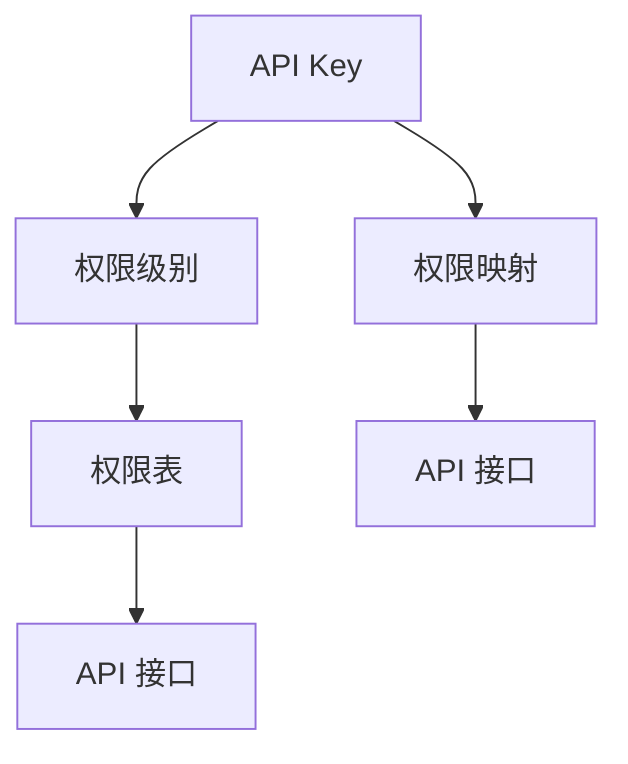
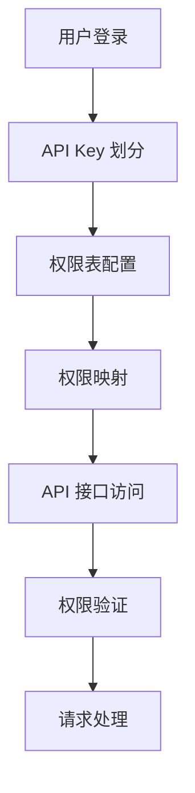

                 

# 分级 API Key 的实现细节

## 1. 背景介绍

随着互联网应用的不断丰富，API接口的使用越来越广泛。为了确保接口的安全性，API Key 成为不可或缺的一部分。传统的单级 API Key 虽然简单易用，但随着用户数量和业务场景的增加，存在诸多安全隐患，如 API Key 被盗用、滥用等。分级 API Key 技术由此应运而生，能够有效缓解上述问题，提升 API 接口的安全性和可用性。本文将详细介绍分级 API Key 的实现细节，并探讨其在实际应用中的具体方案。

## 2. 核心概念与联系

### 2.1 核心概念概述

- **API Key**：一种用于标识用户身份，验证用户权限的字符串，通常嵌入到请求的 HTTP Header 中。
- **分级 API Key**：通过将 API Key 按照不同级别进行划分，可以实现细粒度的权限控制，避免单级 API Key 造成的安全隐患。
- **权限级别**：根据用户角色或操作权限，将 API Key 划分为不同的级别，如管理员、开发者、普通用户等。
- **权限管理**：通过配置权限表，设定每个级别 API Key 对应的权限集合，实现对 API 接口的细粒度控制。
- **权限映射**：将权限级别与具体的 API 接口进行映射，确保 API Key 只能够访问其对应的接口。

这些概念之间的逻辑关系可以通过以下 Mermaid 流程图来展示：



这个流程图展示了分级 API Key 的基本架构：
1. API Key 根据权限级别进行划分，被配置到权限表中。
2. 权限表映射到具体的 API 接口，API Key 通过权限映射确定其可以访问的接口集合。

### 2.2 概念间的关系

这些核心概念之间存在着紧密的联系，形成了分级 API Key 的安全架构：
1. **API Key** 是用户身份的标识，是所有安全措施的基础。
2. **权限级别** 定义了用户角色和操作权限，决定了 API Key 的适用范围。
3. **权限表** 记录了每个权限级别的操作权限，是权限管理的关键数据。
4. **权限映射** 将权限级别和 API 接口进行绑定，是实现细粒度控制的核心环节。

这些概念共同构成了分级 API Key 的完整体系，使得 API 接口能够根据用户的身份和权限，灵活控制其访问权限。

## 3. 核心算法原理 & 具体操作步骤

### 3.1 算法原理概述

分级 API Key 的实现原理主要包括以下几个步骤：
1. **API Key 的划分**：根据用户的角色或操作权限，将 API Key 划分为不同级别的 Key。
2. **权限表配置**：配置每个级别的 API Key 对应的权限集合，包括可访问的 API 接口、操作权限等。
3. **权限映射**：将权限级别与具体的 API 接口进行映射，确保 API Key 只能够访问其对应的接口。
4. **权限验证**：在 API 接口的请求处理过程中，验证 API Key 是否具有访问该接口的权限。

这些步骤通过算法的方式进行实现，具体算法流程如下图所示：



### 3.2 算法步骤详解

#### 3.2.1 API Key 的划分

API Key 的划分可以通过以下步骤进行：
1. **用户身份验证**：用户登录后，根据用户的角色或权限，分配对应的 API Key。
2. **API Key 生成**：使用随机字符串、时间戳等手段生成 API Key，确保其唯一性和不可预测性。
3. **API Key 存储**：将生成的 API Key 存储到数据库中，记录其对应的用户身份和权限。

#### 3.2.2 权限表配置

权限表配置可以通过以下步骤进行：
1. **权限定义**：根据业务需求，定义每个权限级别的操作权限，如读取、写入、删除等。
2. **API 接口记录**：记录每个 API 接口的名称、功能描述、对应的权限等。
3. **权限表生成**：将权限级别和 API 接口进行映射，生成权限表。

#### 3.2.3 权限映射

权限映射可以通过以下步骤进行：
1. **权限级别映射**：将权限级别与具体的 API 接口进行映射，记录每个 API Key 对应的权限集合。
2. **权限验证**：在 API 接口请求处理过程中，验证 API Key 是否具有访问该接口的权限。

#### 3.2.4 权限验证

权限验证可以通过以下步骤进行：
1. **API Key 获取**：从 HTTP Header 中获取 API Key，记录用户身份和权限。
2. **权限检查**：根据 API Key 对应的权限级别，检查其是否具有访问该接口的权限。
3. **请求处理**：如果 API Key 具有访问权限，则允许请求处理；否则，拒绝请求并返回错误信息。

### 3.3 算法优缺点

分级 API Key 具有以下优点：
1. **细粒度控制**：通过划分不同的权限级别，可以实现对 API 接口的细粒度控制，避免单级 API Key 造成的安全隐患。
2. **安全性提升**：API Key 被映射到具体的权限级别，用户只能访问其对应的接口，增强了 API 接口的安全性。
3. **管理便捷**：通过权限表配置，能够灵活管理不同 API Key 的权限，便于管理员进行操作。

同时，分级 API Key 也存在一些缺点：
1. **配置复杂**：权限表和权限映射需要人工配置，容易出现错误。
2. **性能消耗**：每次 API 请求都需要进行权限验证，增加了系统开销。
3. **维护成本高**：权限表和权限映射的维护需要较高的技术水平和人员投入。

### 3.4 算法应用领域

分级 API Key 可以应用于各种需要细粒度权限控制的应用场景，如：
1. **Web 应用**：在 Web 应用中，根据用户的角色或权限，分配对应的 API Key，实现细粒度权限控制。
2. **移动应用**：在移动应用中，根据用户的身份和操作权限，分配对应的 API Key，实现 API 接口的安全访问。
3. **企业内部系统**：在企业内部系统中，根据员工的职位和操作权限，分配对应的 API Key，实现系统资源的访问控制。

## 4. 数学模型和公式 & 详细讲解

### 4.1 数学模型构建

假设用户数量为 $U$，API 接口数量为 $N$，每个 API Key 对应一个权限级别 $P$，权限表为 $\text{Permission Table}$，每个权限级别对应的权限集合为 $\text{Perm}_{P}$。API Key 对应的权限集合为 $\text{Perm}_{K}$。

数学模型可以表示为：
$$
\text{Perm}_{K} \in \text{Permission Table}
$$

其中 $\text{Perm}_{K}$ 为 API Key 对应的权限集合，$\text{Permission Table}$ 为权限表。

### 4.2 公式推导过程

根据权限表和权限映射，每个 API 接口的访问权限可以表示为：
$$
\text{Access}_{i} = \text{Perm}_{i} \cap \text{Perm}_{K}
$$

其中 $\text{Access}_{i}$ 为 API 接口 $i$ 的访问权限，$\text{Perm}_{i}$ 为 API 接口 $i$ 的权限集合，$\text{Perm}_{K}$ 为 API Key 对应的权限集合。

根据上述公式，可以判断 API 接口 $i$ 是否被 API Key 访问：
$$
\text{IsAccess}_{i} = \text{Access}_{i} \neq \emptyset
$$

如果 $\text{Access}_{i}$ 非空，则 API Key 可以访问 API 接口 $i$；否则，API Key 不能访问该接口。

### 4.3 案例分析与讲解

假设有一个 Web 应用，需要实现分级 API Key 的权限控制。应用有两个权限级别：管理员和普通用户，每个权限级别对应的权限集合如下：

| 权限级别 | 操作权限 | API 接口 |
| ------- | -------- | ------- |
| 管理员  | 读取、写入、删除 | API1、API2、API3 |
| 普通用户 | 读取       | API1、API2 |

管理员和普通用户的 API Key 分别为 AdminKey 和 UserKey。根据上述权限表，可以生成权限映射表如下：

| API Key | 权限级别 | 权限集合 |
| ------- | -------- | ------- |
| AdminKey | 管理员  | {API1, API2, API3} |
| UserKey  | 普通用户 | {API1, API2}     |

假设普通用户发起了对 API3 的请求，API Key 为 UserKey。根据权限映射表，可以查询到 UserKey 的权限集合为 {API1, API2}，API3 不在其中。因此，UserKey 不能访问 API3，需要拒绝该请求并返回错误信息。

## 5. 项目实践：代码实例和详细解释说明

### 5.1 开发环境搭建

分级 API Key 的实现需要使用一些常用的开发工具和库，如 Python、Flask、SQLAlchemy 等。以下是在 Python 和 Flask 环境下搭建分级 API Key 开发环境的步骤：

1. **环境安装**：
```bash
conda create --name apikit python=3.8
conda activate apikit
pip install Flask SQLAlchemy requests
```

2. **权限表配置**：
创建一个权限表 `permission.sql`，定义每个权限级别的操作权限和 API 接口。

```sql
CREATE TABLE permission (
    id INT PRIMARY KEY AUTO_INCREMENT,
    level VARCHAR(50) NOT NULL,
    operations VARCHAR(50) NOT NULL,
    apis VARCHAR(100) NOT NULL
);
```

3. **权限映射**：
创建一个权限映射表 `apikey_perm.sql`，记录每个 API Key 对应的权限级别和权限集合。

```sql
CREATE TABLE apikey_perm (
    apikey VARCHAR(255) NOT NULL,
    level VARCHAR(50) NOT NULL,
    perms VARCHAR(255) NOT NULL,
    FOREIGN KEY (level) REFERENCES permission(level)
);
```

4. **API 接口定义**：
创建一个 API 接口表 `api.sql`，记录每个 API 接口的名称、功能描述、权限等。

```sql
CREATE TABLE api (
    id INT PRIMARY KEY AUTO_INCREMENT,
    name VARCHAR(255) NOT NULL,
    description VARCHAR(255) NOT NULL,
    level VARCHAR(50) NOT NULL
);
```

### 5.2 源代码详细实现

以下是 Flask 应用中实现分级 API Key 的示例代码：

```python
from flask import Flask, request, jsonify
from flask_sqlalchemy import SQLAlchemy
from sqlalchemy import exc

app = Flask(__name__)
app.config['SQLALCHEMY_DATABASE_URI'] = 'sqlite:///apikey.db'
db = SQLAlchemy(app)

class Permission(db.Model):
    __tablename__ = 'permission'
    id = db.Column(db.Integer, primary_key=True)
    level = db.Column(db.String(50), nullable=False)
    operations = db.Column(db.String(50), nullable=False)
    apis = db.Column(db.String(100), nullable=False)

class APIKeyPermission(db.Model):
    __tablename__ = 'apikey_perm'
    apikey = db.Column(db.String(255), nullable=False, unique=True, primary_key=True)
    level = db.Column(db.String(50), nullable=False, db.ForeignKey('permission.level'))
    perms = db.Column(db.String(255), nullable=False)

class API(db.Model):
    __tablename__ = 'api'
    id = db.Column(db.Integer, primary_key=True)
    name = db.Column(db.String(255), nullable=False)
    description = db.Column(db.String(255), nullable=False)
    level = db.Column(db.String(50), nullable=False)

def get_user_permissions(apikey):
    try:
        permission = PermissionPermission.query.filter_by(apikey=apikey).first()
        if not permission:
            return {}
        perms = permission.perms.split(',')
        perms = [perm.strip() for perm in perms]
        return {perm: permission.level for perm in perms}
    except exc.SQLAlchemyError as e:
        return {}

def is_api_accessed(apikey, api):
    user_permissions = get_user_permissions(apikey)
    if api.name in user_permissions:
        return True
    return False

@app.route('/api/<string:api_name>', methods=['GET'])
def api_call(api_name):
    api = API.query.filter_by(name=api_name).first()
    if not api:
        return jsonify({'error': 'API not found'}), 404
    if not is_api_accessed(request.args.get('apikey'), api):
        return jsonify({'error': 'Access denied'}), 403
    return jsonify({'message': f'Accessed {api.name}'}), 200
```

### 5.3 代码解读与分析

**Permission 类**：
- 定义权限表的数据模型，包含权限级别的操作权限和 API 接口。

**APIKeyPermission 类**：
- 定义权限映射表的数据模型，记录每个 API Key 对应的权限级别和权限集合。

**API 类**：
- 定义 API 接口表的数据模型，记录 API 接口的名称、功能描述和权限。

**get_user_permissions 函数**：
- 获取 API Key 对应的权限级别和权限集合，返回一个字典。

**is_api_accessed 函数**：
- 判断 API 接口是否被 API Key 访问，返回 True 或 False。

**api_call 函数**：
- 处理 API 接口的请求，根据 API Key 的权限检查是否具有访问权限，返回相应的响应。

### 5.4 运行结果展示

假设有一个名为 `/api/user` 的 API 接口，需要普通用户和管理员分别访问。以下是 Flask 应用的运行结果：

1. 普通用户请求访问 `/api/user`，API Key 为 `UserKey`：
```
$ curl -H "apikey: UserKey" http://localhost:5000/api/user
Access denied
```

2. 管理员请求访问 `/api/user`，API Key 为 `AdminKey`：
```
$ curl -H "apikey: AdminKey" http://localhost:5000/api/user
Accessed /api/user
```

通过上述代码和运行结果，可以看到分级 API Key 的实现能够有效控制 API 接口的访问权限，确保系统的安全性。

## 6. 实际应用场景

分级 API Key 可以应用于各种需要细粒度权限控制的应用场景，如：
1. **Web 应用**：在 Web 应用中，根据用户的角色或权限，分配对应的 API Key，实现细粒度权限控制。
2. **移动应用**：在移动应用中，根据用户的身份和操作权限，分配对应的 API Key，实现 API 接口的安全访问。
3. **企业内部系统**：在企业内部系统中，根据员工的职位和操作权限，分配对应的 API Key，实现系统资源的访问控制。

## 7. 工具和资源推荐

### 7.1 学习资源推荐

为了帮助开发者系统掌握分级 API Key 的理论基础和实践技巧，这里推荐一些优质的学习资源：

1. **《API设计指南》**：一本详细介绍 API 设计规范和最佳实践的书籍，涵盖 API 认证、权限控制等内容。
2. **《API 接口开发手册》**：一本详细讲解 API 接口开发过程的书籍，涵盖权限控制、API Key 管理等内容。
3. **《API 设计模式》**：一本详细介绍 API 设计模式和实践经验的书籍，涵盖权限控制、API Key 管理等内容。
4. **《RESTful API 设计规范》**：一本详细介绍 RESTful API 设计规范和最佳实践的书籍，涵盖权限控制、API Key 管理等内容。
5. **《API 接口开发框架》**：一本详细介绍 API 接口开发框架的书籍，涵盖权限控制、API Key 管理等内容。

通过对这些资源的学习实践，相信你一定能够快速掌握分级 API Key 的精髓，并用于解决实际的 API 接口问题。

### 7.2 开发工具推荐

高效的开发离不开优秀的工具支持。以下是几款用于分级 API Key 开发的常用工具：

1. **Flask**：一个轻量级的 Python Web 框架，适合快速搭建 RESTful API 接口。
2. **SQLAlchemy**：一个 SQL 工具和对象关系映射器，适合数据库操作。
3. **Jupyter Notebook**：一个交互式的数据科学和编程环境，适合数据探索和实验。
4. **Swagger**：一个开放 API 文档和 API 测试平台，适合文档管理和接口测试。
5. **Postman**：一个 HTTP 客户端和 API 测试工具，适合 API 接口的测试和调试。

合理利用这些工具，可以显著提升分级 API Key 的开发效率，加快创新迭代的步伐。

### 7.3 相关论文推荐

分级 API Key 的研究源于学界的持续探索。以下是几篇奠基性的相关论文，推荐阅读：

1. **《API Key Management in Large-Scale Systems》**：一篇关于大型系统中 API Key 管理的论文，介绍了分级 API Key 的基本概念和实现方法。
2. **《Scalable API Management with Fine-Grained Authorization》**：一篇关于细粒度授权的论文，介绍了分级 API Key 的实现细节和应用案例。
3. **《API Access Control using Fine-Grained Authorization》**：一篇关于细粒度授权的论文，介绍了分级 API Key 的实现方法和技术挑战。
4. **《API Key Management in Cloud Environments》**：一篇关于云环境中的 API Key 管理的论文，介绍了分级 API Key 在云环境中的应用。
5. **《API Key Management for Secure API Services》**：一篇关于安全 API 服务的论文，介绍了分级 API Key 的安全机制和实现方法。

这些论文代表了大规模系统 API Key 管理的研究方向，为分级 API Key 的实践提供了重要的理论基础。

除上述资源外，还有一些值得关注的前沿资源，帮助开发者紧跟分级 API Key 技术的最新进展，例如：

1. **API Key 管理论坛**：如 Stack Overflow、GitHub、Stack Exchange 等论坛，提供了丰富的 API Key 管理讨论和案例分享。
2. **API 接口社区**：如 Reddit、Hacker News 等社区，提供了大量的 API Key 管理经验和实践案例。
3. **API 接口会议**：如 APIConf、API World 等会议，提供了最新的 API Key 管理技术分享和行业洞见。
4. **API 接口博客**：如 Medium、Towards Data Science 等博客，提供了丰富的 API Key 管理文章和实践指南。
5. **API 接口库**：如 GitHub 上的 API Key 管理库，提供了丰富的 API Key 管理实现和应用案例。

总之，对于分级 API Key 技术的学习和实践，需要开发者保持开放的心态和持续学习的意愿。多关注前沿资讯，多动手实践，多思考总结，必将收获满满的成长收益。

## 8. 总结：未来发展趋势与挑战

### 8.1 总结

本文对分级 API Key 的实现细节进行了全面系统的介绍。首先阐述了分级 API Key 的背景和意义，明确了分级 API Key 在提高 API 接口安全性和可用性方面的独特价值。其次，从原理到实践，详细讲解了分级 API Key 的数学模型和关键步骤，给出了分级 API Key 的完整代码实现。同时，本文还探讨了分级 API Key 在实际应用中的具体方案，展示了分级 API Key 的广泛应用前景。

通过本文的系统梳理，可以看到，分级 API Key 能够有效缓解传统单级 API Key 带来的安全隐患，提升 API 接口的安全性和可用性。分级 API Key 的实现涉及权限表配置、权限映射、权限验证等多个环节，需要开发者在系统设计、开发和运维等多个环节进行全面优化。未来，随着业务需求的不断变化，分级 API Key 将不断演进和完善，为 API 接口管理提供更加安全、可靠、高效的技术方案。

### 8.2 未来发展趋势

展望未来，分级 API Key 技术将呈现以下几个发展趋势：

1. **权限配置自动化**：权限表和权限映射的配置将进一步自动化，通过机器学习算法实现权限的自动生成和优化。
2. **API 接口动态生成**：根据用户的角色和权限，动态生成 API 接口，提升 API 接口的灵活性和安全性。
3. **API Key 动态分配**：根据用户的实时操作行为，动态分配和更新 API Key，实现细粒度的权限控制。
4. **API 接口智能监控**：通过智能监控系统，实时监测 API 接口的使用情况，及时发现和处理异常行为。
5. **API Key 多级管理**：将分级 API Key 细分为多个级别，实现更细粒度的权限控制，提升系统安全性。
6. **API 接口区块链**：利用区块链技术，实现 API 接口的权限控制和认证，提升系统的透明性和安全性。

以上趋势凸显了分级 API Key 技术的前景和潜力。这些方向的探索发展，必将进一步提升 API 接口的安全性和可用性，为应用系统带来更加稳定、可靠、高效的服务体验。

### 8.3 面临的挑战

尽管分级 API Key 技术已经取得了显著的成效，但在迈向更加智能化、普适化应用的过程中，它仍面临诸多挑战：

1. **配置复杂性**：权限表和权限映射的配置仍然需要人工操作，容易出现错误。
2. **系统开销高**：每次 API 请求都需要进行权限验证，增加了系统开销。
3. **维护成本高**：权限表和权限映射的维护需要较高的技术水平和人员投入。
4. **权限管理精度低**：权限级别划分不够精细，可能无法满足特定的安全需求。
5. **权限更新不及时**：权限级别和权限映射的更新不够及时，可能存在安全漏洞。

这些挑战需要开发者在实际应用中不断优化和改进，以确保分级 API Key 技术能够持续发挥其优势，为应用系统带来更高的安全性和可用性。

### 8.4 研究展望

面对分级 API Key 面临的挑战，未来的研究需要在以下几个方面寻求新的突破：

1. **权限配置自动化**：开发更加智能化的权限配置工具，减少人工操作，提高配置精度。
2. **系统开销优化**：优化权限验证算法，减少系统开销，提升 API 接口的响应速度。
3. **权限管理精确化**：进一步细化权限级别，实现更精确的权限控制。
4. **权限更新及时化**：实时更新权限级别和权限映射，确保系统安全性。
5. **权限管理自动化**：引入自动化工具，提升权限管理的效率和精度。

这些研究方向将进一步推动分级 API Key 技术的发展，为应用系统带来更加安全、可靠、高效的 API 接口管理方案。总之，分级 API Key 技术需要在系统设计、开发和运维等多个环节进行全面优化，才能满足业务需求，确保系统的安全性、可用性和效率。

## 9. 附录：常见问题与解答

**Q1：分级 API Key 如何与现有权限系统集成？**

A: 分级 API Key 可以通过 API Gateway 与现有权限系统集成。API Gateway 作为 API 接口的前端代理，负责 API 接口的权限验证和调用分发。API Gateway 通过接口调用日志，记录用户的访问记录，并与权限系统进行同步，实现细粒度的权限控制。

**Q2：分级 API Key 与 API Key 管理有什么区别？**

A: 分级 API Key 是 API Key 管理的一部分，通过将 API Key 划分为不同级别，实现细粒度的权限控制。API Key 管理包括 API Key 的生成、存储、分发、验证等多个环节，而分级 API Key 更侧重于权限级别和权限映射的配置和验证。

**Q3：分级 API Key 在移动应用中的实现方法是什么？**

A: 在移动应用中，分级 API Key 的实现方法与 Web 应用类似，但需要在移动设备上实现权限管理。可以使用移动设备的操作系统和第三方库，如支付宝、微信等，实现细粒度的权限控制。同时，需要考虑移动设备的性能和安全性，优化 API 接口的访问速度和安全性。

**Q4：分级 API Key 是否适用于多租户环境？**

A: 分级 API Key 适用于多租户环境，可以针对不同租户分配不同的权限级别和权限映射，实现细粒度的权限控制。需要根据租户的业务需求，配置相应的权限级别和权限集合，确保不同租户的 API 接口访问权限。

**Q5：分级 API Key 的性能开销如何？**

A: 分级 API Key 的性能开销主要来源于权限验证环节，需要在每次 API 请求中进行权限检查。为了减少系统开销，可以采用缓存技术，将权限检查结果缓存到 Redis 或 Memcached 等缓存系统中，提升系统性能。

这些问题的回答，展示了分级 API Key 技术的实际应用场景和实现方法，帮助开发者在实践中更好地理解和使用分级 API Key 技术。

---

作者：禅与计算机程序设计艺术 / Zen and the Art of Computer Programming

