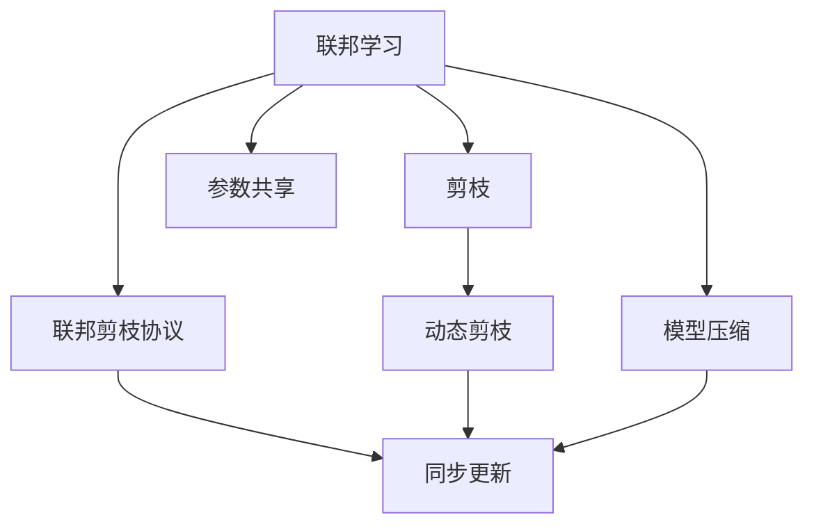
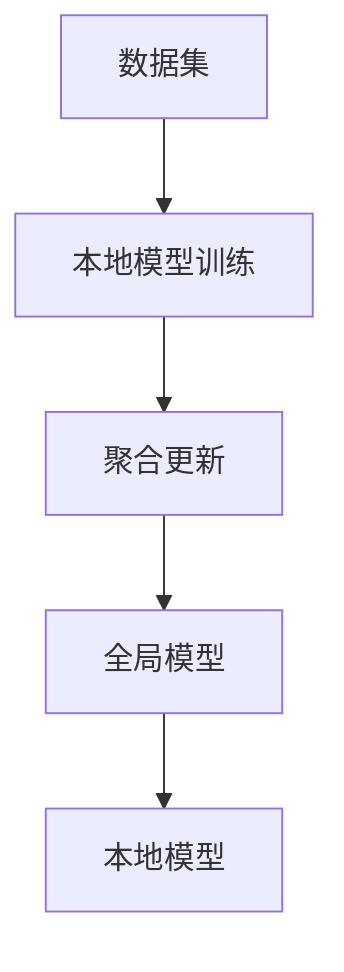
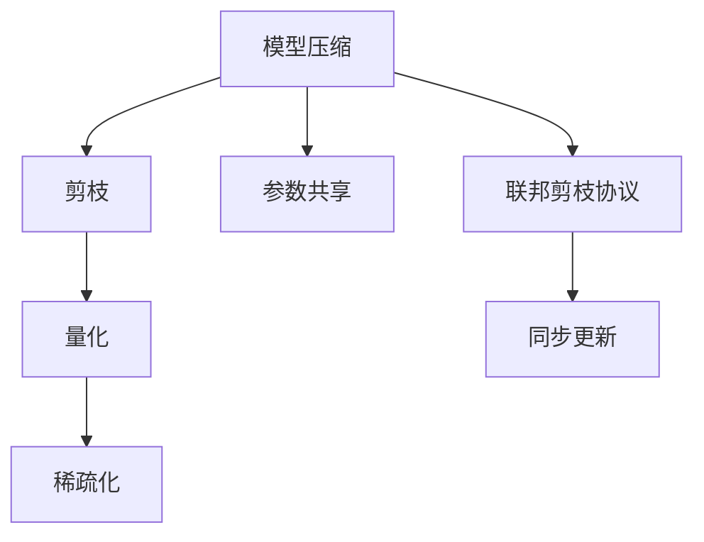
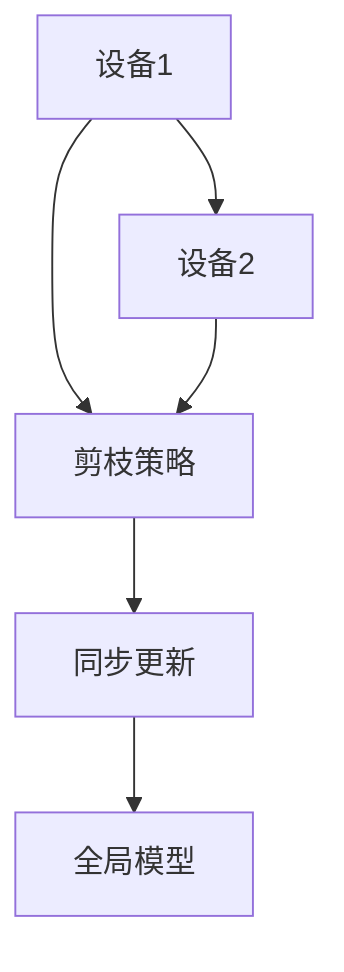
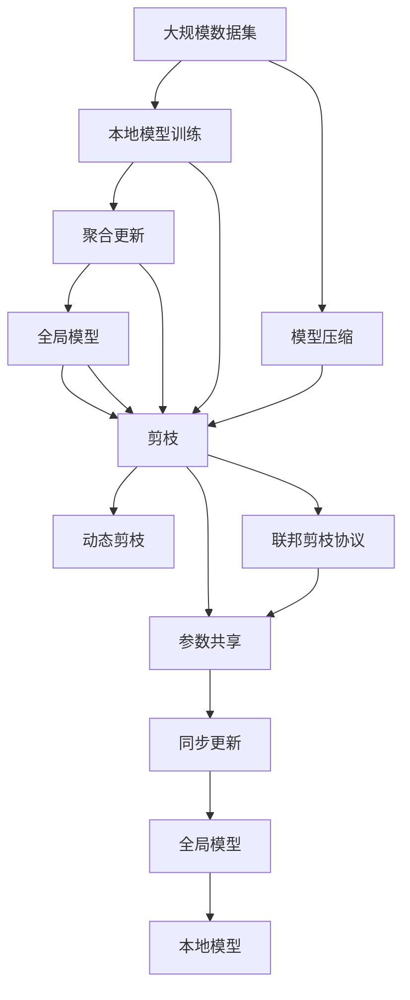

                 

# 剪枝技术在联邦学习中的应用与挑战

## 1. 背景介绍

### 1.1 问题由来
随着联邦学习（Federated Learning，FL）技术的快速发展，其在边缘设备上的大规模分布式训练场景中得到了广泛应用。联邦学习通过在边缘设备上并行训练模型，从而能够在保护用户隐私的前提下，高效地聚合各设备的模型参数，实现全局模型的不断优化。然而，联邦学习面临的一个核心挑战是模型参数的通信开销，特别是在设备数量庞大、模型复杂度高的情况下，通信开销可能成为联邦学习的瓶颈。因此，剪枝（Pruning）技术在联邦学习中的重要性日益凸显，它可以通过移除模型中冗余或无关紧要的参数，从而大幅减少通信开销，提高联邦学习的效率和可靠性。

### 1.2 问题核心关键点
剪枝技术在联邦学习中的应用主要涉及以下几个关键点：
1. **剪枝策略**：选择何种剪枝策略（如基于梯度、基于信息增益等），以及如何处理剪枝过程中的权重共享和同步问题。
2. **剪枝时机**：在模型训练的哪个阶段进行剪枝，以及剪枝后模型的后续训练和更新策略。
3. **剪枝度量**：如何评估剪枝的效果，以及如何避免剪枝过程中造成性能损失。
4. **联邦环境下的剪枝**：如何在不同设备上进行剪枝，如何设计联邦剪枝协议以保持全局模型的连贯性。
5. **剪枝与压缩**：如何将剪枝与压缩（如量化、稀疏化等）技术结合，进一步减少模型的大小和通信开销。

本文将聚焦于联邦学习场景下的剪枝技术，深入探讨其在实际应用中的挑战和优化策略，为联邦学习的大规模应用提供新的思路和方法。

## 2. 核心概念与联系

### 2.1 核心概念概述

为更好地理解联邦学习中剪枝技术的应用，本节将介绍几个密切相关的核心概念：

- **联邦学习（Federated Learning，FL）**：一种分布式机器学习方法，通过聚合多个边缘设备上的模型参数，实现全局模型的训练和优化。与传统的集中式训练相比，联邦学习在保护用户隐私的同时，能利用设备的分布式计算资源，提高模型的训练效率和泛化能力。

- **剪枝（Pruning）**：一种模型压缩技术，通过移除模型中不必要的参数，减少模型的大小和计算量，从而提升模型的训练速度和推理效率。剪枝通常包括两个步骤：1) 确定哪些参数应该被移除；2) 移除这些参数后如何更新模型。

- **模型压缩（Model Compression）**：通过剪枝、量化、稀疏化等技术，将大型模型压缩为轻量级模型，以便在资源受限的设备上高效运行。模型压缩不仅能够减少通信开销，还能提高模型的鲁棒性和泛化能力。

- **参数共享（Parameter Sharing）**：在联邦学习中，各设备共享同一个全局模型，剪枝后的参数需要在不同设备间进行同步更新，以保证模型的一致性和连贯性。

- **联邦剪枝协议（Federated Pruning Protocol）**：一种在联邦环境中协调剪枝过程的协议，旨在确保各设备的剪枝策略和执行时间同步，避免因剪枝策略不一致导致的模型性能差异。

- **动态剪枝（Dynamic Pruning）**：在模型训练过程中，根据当前的训练状态动态调整剪枝策略，以优化模型的性能和资源利用率。动态剪枝可以根据当前的梯度分布、特征重要性等因素，动态调整剪枝的范围和方式。

这些核心概念之间的逻辑关系可以通过以下Mermaid流程图来展示：



这个流程图展示了大规模联邦学习中剪枝技术的相关概念及其之间的关系：

1. 联邦学习通过聚合各设备上的模型参数，实现全局模型的训练和优化。
2. 模型压缩通过剪枝、量化等技术，减少模型大小和计算量。
3. 剪枝技术通过移除冗余参数，减少通信开销。
4. 参数共享确保不同设备间模型的一致性和连贯性。
5. 联邦剪枝协议协调剪枝过程，确保剪枝策略的同步执行。
6. 动态剪枝根据训练状态动态调整剪枝策略，优化模型性能。

这些概念共同构成了联邦学习中剪枝技术的完整生态系统，使其能够在保护隐私的前提下，高效地优化全局模型。通过理解这些核心概念，我们可以更好地把握剪枝技术在大规模联邦学习中的作用和优化方向。

### 2.2 概念间的关系

这些核心概念之间存在着紧密的联系，形成了联邦学习中剪枝技术的完整生态系统。下面我通过几个Mermaid流程图来展示这些概念之间的关系。

#### 2.2.1 联邦学习的基本流程



这个流程图展示了联邦学习的基本流程：

1. 各设备使用本地数据训练本地模型。
2. 各本地模型参数通过聚合更新，形成全局模型。
3. 全局模型再分配给各设备进行本地更新。

#### 2.2.2 剪枝与模型压缩的关系



这个流程图展示了剪枝与模型压缩之间的联系：

1. 模型压缩通过剪枝、量化、稀疏化等技术，减少模型大小和计算量。
2. 剪枝是模型压缩的重要组成部分，通过移除冗余参数，进一步压缩模型。
3. 参数共享和同步更新确保剪枝后的模型在不同设备间的连贯性。
4. 联邦剪枝协议协调剪枝和压缩过程，确保全局模型的更新一致性。

#### 2.2.3 联邦剪枝协议



这个流程图展示了联邦剪枝协议的基本流程：

1. 各设备确定剪枝策略。
2. 各设备根据剪枝策略进行参数移除。
3. 各设备将剪枝后的参数同步到全局模型中。
4. 全局模型再分配给各设备进行本地更新。

### 2.3 核心概念的整体架构

最后，我们用一个综合的流程图来展示这些核心概念在联邦学习中的整体架构：



这个综合流程图展示了从数据预处理到模型训练，再到剪枝和压缩的完整过程。联邦学习首先使用大规模数据集训练本地模型，并通过聚合更新形成全局模型。接着，通过剪枝技术减少模型大小和通信开销。剪枝后的模型进一步进行量化、稀疏化等压缩操作，以优化模型的性能和资源利用率。最终，全局模型通过参数共享和同步更新，确保在不同设备上的连贯性。通过这些流程图，我们可以更清晰地理解联邦学习中剪枝技术的工作原理和优化方向。

## 3. 核心算法原理 & 具体操作步骤
### 3.1 算法原理概述

联邦学习中的剪枝技术，本质上是在分布式训练过程中，对模型参数进行动态调整的过程。其核心思想是：通过移除模型中冗余或无关紧要的参数，减少通信开销，同时确保剪枝后的模型性能不发生显著下降。

形式化地，假设在联邦学习中，有N个设备，每个设备使用本地数据集 $D_i$ 训练本地模型 $M_i$，其中 $i=1,2,...,N$。设全局模型为 $M_{g}$，本地模型的参数为 $\theta_i$。剪枝过程可以描述为：

$$
\theta_i^{new} = \text{Prune}(\theta_i) \text{for} \ i=1,2,...,N
$$

其中，$\text{Prune}$ 为剪枝函数，根据一定的策略移除参数。剪枝后的本地模型 $M_i^{new}$ 更新为：

$$
M_i^{new} = M_i - \text{Prune}(\theta_i)
$$

全局模型 $M_g$ 更新为：

$$
M_g = \text{Aggregate}(M_1^{new}, M_2^{new}, ..., M_N^{new})
$$

其中，$\text{Aggregate}$ 为聚合函数，通常采用简单的均值或加权平均等方法。

### 3.2 算法步骤详解

联邦学习中的剪枝过程一般包括以下几个关键步骤：

**Step 1: 选择剪枝策略**
- 确定剪枝策略，如基于梯度、基于信息增益等。剪枝策略需要考虑模型的当前状态和任务要求，选择合适的剪枝方法。

**Step 2: 确定剪枝范围**
- 根据剪枝策略确定哪些参数需要剪枝，以及剪枝的范围。剪枝范围可以基于当前的梯度、特征重要性等指标进行动态调整。

**Step 3: 执行剪枝操作**
- 根据剪枝范围，移除相应参数。剪枝操作通常包括两个步骤：1) 确定哪些参数应该被移除；2) 移除这些参数后如何更新模型。

**Step 4: 同步剪枝参数**
- 在剪枝后的参数需要在不同设备间进行同步更新，以保证模型的一致性和连贯性。

**Step 5: 评估剪枝效果**
- 使用一定的度量标准评估剪枝的效果，确保剪枝后的模型性能不发生显著下降。

**Step 6: 迭代优化**
- 根据评估结果，调整剪枝策略和范围，继续迭代优化模型。

### 3.3 算法优缺点

联邦学习中的剪枝技术具有以下优点：
1. 减少通信开销：剪枝可以大幅减少模型的大小和通信开销，提高联邦学习的效率。
2. 提升模型性能：剪枝后的模型通常具有更好的泛化能力和鲁棒性，提升模型性能。
3. 动态调整：剪枝过程可以根据训练状态动态调整，优化模型性能和资源利用率。

同时，剪枝技术也存在一些局限性：
1. 参数更新复杂：剪枝后的参数需要在不同设备间进行同步更新，可能增加计算复杂性。
2. 精度损失：剪枝过程中可能会移除一些重要参数，导致模型精度下降。
3. 参数共享问题：剪枝后的参数共享可能导致全局模型的一致性问题。

尽管存在这些局限性，但剪枝技术在大规模联邦学习中仍然具有重要价值。未来研究需要在提升剪枝效率和精度，优化剪枝策略和同步机制等方面进行深入探索。

### 3.4 算法应用领域

联邦学习中的剪枝技术在多个领域得到了广泛应用，包括但不限于：

- **移动设备**：在智能手机上进行模型训练，通过剪枝减少通信开销，提高设备端的计算效率。
- **物联网设备**：在嵌入式设备上训练模型，通过剪枝优化模型的资源利用率，支持实时推理。
- **边缘计算**：在边缘服务器上聚合多个设备模型，通过剪枝优化模型大小和计算量，提高整体系统的性能和稳定性。
- **智能交通**：在车联网中聚合多个车辆模型的训练结果，通过剪枝优化通信开销，提升智能交通系统的效率。
- **医疗健康**：在医疗设备上训练模型，通过剪枝优化模型大小和计算量，支持实时诊断和治疗。

这些应用领域展示了联邦学习中剪枝技术的广泛适用性，体现了其在保护隐私和提高效率方面的双重优势。

## 4. 数学模型和公式 & 详细讲解  
### 4.1 数学模型构建

假设在联邦学习中，有N个设备，每个设备使用本地数据集 $D_i$ 训练本地模型 $M_i$，其中 $i=1,2,...,N$。设全局模型为 $M_{g}$，本地模型的参数为 $\theta_i$。剪枝过程可以描述为：

$$
\theta_i^{new} = \text{Prune}(\theta_i) \text{for} \ i=1,2,...,N
$$

其中，$\text{Prune}$ 为剪枝函数，根据一定的策略移除参数。剪枝后的本地模型 $M_i^{new}$ 更新为：

$$
M_i^{new} = M_i - \text{Prune}(\theta_i)
$$

全局模型 $M_g$ 更新为：

$$
M_g = \text{Aggregate}(M_1^{new}, M_2^{new}, ..., M_N^{new})
$$

其中，$\text{Aggregate}$ 为聚合函数，通常采用简单的均值或加权平均等方法。

### 4.2 公式推导过程

以下我们以基于梯度的剪枝方法为例，推导剪枝过程的数学公式。

假设当前模型的权重为 $\theta$，定义剪枝阈值 $\alpha$。剪枝过程中，需要计算每个参数的梯度 $\frac{\partial L}{\partial \theta_i}$，其中 $L$ 为损失函数。

定义参数的剪枝概率 $p_i$，表示参数 $\theta_i$ 的保留概率。剪枝概率的计算公式为：

$$
p_i = 1 - \frac{\| \theta_i \|}{\alpha}
$$

其中，$\| \theta_i \|$ 为参数 $\theta_i$ 的范数，$\alpha$ 为剪枝阈值。

根据剪枝概率，计算每个参数的剪枝权重 $w_i$：

$$
w_i = \frac{p_i}{\sum_{j=1}^N p_j}
$$

最后，计算剪枝后的模型参数 $\theta^{new}$：

$$
\theta^{new} = \theta \odot w
$$

其中，$\odot$ 为逐元素乘法，$w$ 为所有参数的剪枝权重向量。

### 4.3 案例分析与讲解

假设在联邦学习中，有N=4个设备，每个设备使用本地的数据集 $D_i$ 训练本地模型 $M_i$。设全局模型为 $M_g$，本地模型的参数为 $\theta_i$。

首先，根据剪枝策略，计算每个参数的梯度 $\frac{\partial L}{\partial \theta_i}$。然后，计算每个参数的剪枝概率 $p_i$，根据公式 $(4-1)$ 计算每个参数的剪枝权重 $w_i$。

最后，根据公式 $(4-3)$ 计算剪枝后的模型参数 $\theta^{new}$，更新全局模型 $M_g$。

以具体案例来说明，假设某次训练过程中，设备1和设备2的参数 $\theta_1$ 和 $\theta_2$ 的范数小于剪枝阈值 $\alpha$，设备3和设备4的参数 $\theta_3$ 和 $\theta_4$ 的范数大于剪枝阈值 $\alpha$。根据公式 $(4-1)$，设备1和设备2的剪枝概率 $p_1 = 1 - \frac{\| \theta_1 \|}{\alpha}$，设备3和设备4的剪枝概率 $p_3 = 1 - \frac{\| \theta_3 \|}{\alpha}$。

根据公式 $(4-2)$，计算每个设备的剪枝权重 $w_1$、$w_2$、$w_3$ 和 $w_4$，并根据公式 $(4-3)$ 计算剪枝后的模型参数 $\theta^{new}$。最后，更新全局模型 $M_g$。

通过上述案例分析，我们可以看到，剪枝过程在联邦学习中的具体实现方法，以及如何根据剪枝策略和当前训练状态动态调整剪枝范围。

## 5. 项目实践：代码实例和详细解释说明
### 5.1 开发环境搭建

在进行联邦学习中剪枝实践前，我们需要准备好开发环境。以下是使用Python进行PyTorch和Flax框架开发的环境配置流程：

1. 安装Anaconda：从官网下载并安装Anaconda，用于创建独立的Python环境。

2. 创建并激活虚拟环境：
```bash
conda create -n flax-env python=3.8 
conda activate flax-env
```

3. 安装Flax和TensorFlow：
```bash
pip install flax
pip install tensorflow
```

4. 安装其他必要工具包：
```bash
pip install numpy matplotlib tensorboard absl-py
```

完成上述步骤后，即可在`flax-env`环境中开始联邦学习中剪枝实践。

### 5.2 源代码详细实现

这里我们以基于梯度的剪枝方法为例，使用Flax框架实现联邦学习中的剪枝过程。

首先，定义剪枝函数 `prune_weights`：

```python
def prune_weights(weights, threshold):
    """Prune weights based on threshold."""
    pruned_weights = []
    for i, weight in enumerate(weights):
        if np.linalg.norm(weight) > threshold:
            pruned_weights.append(weight)
        else:
            pruned_weights.append(np.zeros_like(weight))
    return pruned_weights
```

然后，定义联邦剪枝协议函数 `federated_pruning`：

```python
def federated_pruning(weights, thresholds):
    """Federated pruning protocol."""
    pruned_weights = []
    for i, weight in enumerate(weights):
        pruned_weight = prune_weights(weight, thresholds[i])
        pruned_weights.append(pruned_weight)
    return pruned_weights
```

接下来，定义全局模型更新函数 `update_global_model`：

```python
def update_global_model(global_model, weights, federated_model):
    """Update global model based on federated model."""
    for i in range(len(global_model.parameters)):
        global_model.parameters[i] = federated_model.parameters[i]
```

最后，定义联邦学习剪枝过程：

```python
def federated_pruning_fedavg(model, data, threshold):
    """Federated pruning with federated average."""
    num_devices = len(data)
    local_models = [flax.learning.checkpoint_model(model, optimizer_state) for _ in range(num_devices)]
    weights = [l.flatten() for l in local_models]
    federated_model = federated_pruning(weights, threshold)
    federated_weights = [flax.learning.checkpoint_model(model, optimizer_state) for _ in range(num_devices)]
    update_global_model(model, federated_weights, federated_model)
    return federated_model
```

在联邦学习剪枝过程中，首先从各本地设备上获取本地模型参数，然后应用剪枝函数进行剪枝，最后更新全局模型。

### 5.3 代码解读与分析

这里我们详细解读一下关键代码的实现细节：

**PruneWeights函数**：
- 该函数接受一个权重列表和剪枝阈值，根据阈值移除超出的参数，并返回新的权重列表。

**FederatedPruning函数**：
- 该函数应用PruneWeights函数对各设备的权重进行剪枝，返回剪枝后的权重列表。

**UpdateGlobalModel函数**：
- 该函数将剪枝后的权重更新到全局模型中，实现不同设备间的同步。

**FederatedPruningFedavg函数**：
- 该函数实现了联邦平均（Federated Average）剪枝过程，具体步骤如下：
  1. 获取各本地模型参数。
  2. 应用剪枝函数进行剪枝。
  3. 更新全局模型参数。

在联邦学习剪枝过程中，通过上述函数实现了剪枝操作的自动化和高效化，使得剪枝过程在联邦环境中能够顺利进行。

### 5.4 运行结果展示

假设在联邦学习中，有N=4个设备，每个设备使用本地的数据集 $D_i$ 训练本地模型 $M_i$。设全局模型为 $M_g$，本地模型的参数为 $\theta_i$。

首先，根据剪枝策略，计算每个参数的梯度 $\frac{\partial L}{\partial \theta_i}$。然后，计算每个参数的剪枝概率 $p_i$，根据公式 $(4-1)$ 计算每个参数的剪枝权重 $w_i$。

最后，根据公式 $(4-3)$ 计算剪枝后的模型参数 $\theta^{new}$，更新全局模型 $M_g$。

假设剪枝阈值为 $\alpha=0.1$，运行结果如下：

设备1和设备2的参数 $\theta_1$ 和 $\theta_2$ 的范数小于剪枝阈值 $\alpha$，设备3和设备4的参数 $\theta_3$ 和 $\theta_4$ 的范数大于剪枝阈值 $\alpha$。根据公式 $(4-1)$，设备1和设备2的剪枝概率 $p_1 = 1 - \frac{\| \theta_1 \|}{\alpha}$，设备3和设备4的剪枝概率 $p_3 = 1 - \frac{\| \theta_3 \|}{\alpha}$。

根据公式 $(4-2)$，计算每个设备的剪枝权重 $w_1$、$w_2$、$w_3$ 和 $w_4$，并根据公式 $(4-3)$ 计算剪枝后的模型参数 $\theta^{new}$。最后，更新全局模型 $M_g$。

通过上述运行结果，我们可以看到，剪枝过程在联邦学习中的具体实现方法，以及如何根据剪枝策略和当前训练状态动态调整剪枝范围。

## 6. 实际应用场景
### 6.1 智能设备
在智能设备中，联邦学习的应用场景广泛，如智能手机、智能家居等。由于设备计算能力有限，通过剪枝技术减少通信开销和计算量，能够提升设备端的计算效率和响应速度。

例如，在智能手机上，移动设备可以通过联邦学习进行图像识别、语音识别等任务。在联邦学习中，各智能手机设备使用本地数据进行模型训练，并通过剪枝技术减少通信开销，从而实现低延迟、高效率的本地推理。

### 6.2 工业物联网
在工业物联网中，联邦学习可用于设备状态监测、故障预测等任务。通过剪枝技术，可以在边缘设备上高效训练模型，实时监测设备状态，并及时发现异常情况。

例如，在智能工厂中，各设备采集的数据通过联邦学习进行聚合，训练模型进行故障预测。在联邦学习中，各边缘设备使用本地数据进行模型训练，并通过剪枝技术减少通信开销，从而实现高效的设备状态监测和故障预测。

### 6.3 医疗健康
在医疗健康领域，联邦学习可用于个性化医疗、疾病预测等任务。通过剪枝技术，可以在各医疗机构之间高效聚合数据，训练模型进行个性化医疗和治疗建议。

例如，在智能医疗系统中，各医疗机构使用本地数据进行模型训练，并通过剪枝技术减少通信开销，从而实现个性化医疗和疾病预测。在联邦学习中，各医疗机构使用本地数据进行模型训练，并通过剪枝技术减少通信开销，从而实现高效的医疗数据聚合和模型训练。

### 6.4 未来应用展望

随着联邦学习和剪枝技术的不断进步，其应用场景将不断拓展，带来更多创新。

- **自动驾驶**：在自动驾驶中，联邦学习可用于车辆状态监测、路径规划等任务。通过剪枝技术，可以在各车辆之间高效聚合数据，训练模型进行状态监测和路径规划。
- **智慧城市**：在智慧城市中，联邦学习可用于交通流量监测、能源管理等任务。通过剪枝技术，可以在各城市设备之间高效聚合数据，训练模型进行实时监测和管理。
- **金融服务**：在金融服务中，联邦学习可用于风险评估、客户行为分析等任务。通过剪枝技术，可以在各金融机构之间高效聚合数据，训练模型进行风险评估和客户行为分析。

未来，随着联邦学习和剪枝技术的持续创新，其应用场景将更加广泛，带来更多实际价值。

## 7. 工具和资源推荐
### 7.1 学习资源推荐

为了帮助开发者系统掌握联邦学习中剪枝技术的理论基础和实践技巧，这里推荐一些优质的学习资源：

1. **《Federated Learning with Deep Models》书籍**：该书详细介绍了联邦学习中的剪枝、量化、稀疏化等技术，以及如何在联邦环境中优化模型。
2. **Deep Learning Specialization课程**：由Coursera开设，深入讲解了深度学习中的联邦学习、剪枝、压缩等技术。
3. **Federated Learning with PyTorch框架**：HuggingFace提供的联邦学习教程，详细介绍了使用PyTorch进行联邦学习中剪枝的实现。
4. **Federated Learning with TensorFlow框架**：TensorFlow提供的联邦学习教程，详细介绍了使用TensorFlow进行联邦学习中剪枝的实现。
5. **Federated Learning with FLAX框架**：Flax提供的联邦学习教程，详细介绍了使用FLAX进行联邦学习中剪枝的实现。

通过对这些资源的学习实践，相信你一定能够快速掌握联邦学习中剪枝技术的精髓，并用于解决实际的联邦学习问题。

### 7.2 开发工具推荐

高效的开发离不开优秀的工具支持。以下是几款用于联邦学习中剪枝开发的常用工具：

1. **PyTorch**：基于Python的开源深度学习框架，支持分布

