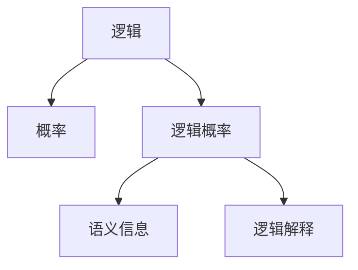

                 

# 卡尔纳普的《概率的逻辑基础》

在人工智能领域，逻辑和概率是构建智能系统不可或缺的两大基石。卡尔纳普的《概率的逻辑基础》作为逻辑和概率领域的经典之作，深入探讨了这两大领域的相互关系，为理解现代AI技术奠定了坚实的理论基础。本文将从背景介绍、核心概念与联系、算法原理与操作步骤、数学模型构建与推导、项目实践与运行结果、实际应用场景与未来展望、工具与资源推荐、总结与发展趋势等方面，系统性地阐述卡尔纳普在《概率的逻辑基础》中提出的思想和方法，并探讨其在人工智能中的应用。

## 1. 背景介绍

### 1.1 问题由来

卡尔纳普（Rudolf Carnap）是20世纪著名的逻辑实证主义哲学家，对逻辑和概率的理论研究做出了巨大贡献。在人工智能快速发展的今天，逻辑和概率仍然是构建智能系统的重要工具。然而，如何融合逻辑和概率，构建一个完备且强大的智能系统，仍是一个极具挑战性的问题。

卡尔纳普的《概率的逻辑基础》正是为解决这个问题而作。书中通过深入探讨逻辑和概率的基本原理及其相互关系，为构建逻辑完备且概率合理的智能系统提供了理论指导。

### 1.2 问题核心关键点

卡尔纳普在书中提出了逻辑和概率的相互关系，主要体现在以下几个方面：

1. **逻辑与概率的相互依赖**：逻辑为概率提供了理论基础，而概率则丰富了逻辑的应用场景。
2. **逻辑概率的一致性**：逻辑和概率必须保持一致，才能构建出合理的智能系统。
3. **逻辑概率的交叉应用**：逻辑和概率方法可以相互借鉴，提升智能系统的综合能力。

这些关键点构成了卡尔纳普《概率的逻辑基础》的核心内容，为人工智能领域提供了重要的理论支持。

## 2. 核心概念与联系

### 2.1 核心概念概述

卡尔纳普在《概率的逻辑基础》中提出了一系列重要概念，这些概念在人工智能领域具有广泛的应用价值。

1. **逻辑**：用于描述语言和思维形式的结构和规则，是人工智能系统的基础。
2. **概率**：描述事件发生的可能性，用于处理不确定性和不确定信息的处理。
3. **逻辑概率**：逻辑和概率的结合，用于处理具有一定不确定性的逻辑问题。
4. **语义信息**：语言中的意义和信息，用于构建逻辑和概率的桥梁。
5. **逻辑解释**：对逻辑命题的解释，用于理解逻辑和概率的实际应用。

这些概念构成了卡尔纳普理论的核心，对人工智能领域具有重要指导意义。

### 2.2 概念间的关系

卡尔纳普在书中通过一系列的图示和案例，详细阐述了逻辑和概率的相互关系。以下是一个简化的概念图：



这个图展示了逻辑、概率、逻辑概率、语义信息和逻辑解释之间的相互关系。逻辑为概率提供了结构基础，而概率则丰富了逻辑的应用场景。逻辑概率将逻辑和概率结合，用于处理具有一定不确定性的逻辑问题。语义信息作为逻辑和概率的桥梁，使得两者能够相互转化。逻辑解释则用于理解逻辑和概率的实际应用。

## 3. 核心算法原理 & 具体操作步骤

### 3.1 算法原理概述

卡尔纳普在《概率的逻辑基础》中提出了逻辑概率的算法原理，主要包括以下几个步骤：

1. **定义逻辑结构**：使用逻辑表达式描述问题的结构和关系。
2. **计算概率**：根据定义的逻辑结构，计算事件发生的可能性。
3. **综合逻辑和概率**：将逻辑和概率相结合，处理具有一定不确定性的问题。

这些步骤构成了卡尔纳普逻辑概率算法的核心。

### 3.2 算法步骤详解

以下是一个详细的算法步骤说明：

1. **定义逻辑结构**：
   - 确定逻辑表达式的形式，例如：$A \land B \lor C$。
   - 分析逻辑表达式中的关系和结构。

2. **计算概率**：
   - 根据定义的逻辑结构，使用概率模型计算事件发生的可能性。
   - 例如：假设事件$A$的概率为$p(A)=0.6$，事件$B$的概率为$p(B)=0.5$，事件$C$的概率为$p(C)=0.3$。

3. **综合逻辑和概率**：
   - 将逻辑和概率相结合，处理具有一定不确定性的问题。
   - 例如：在已知$p(A)=0.6$，$p(B)=0.5$，$p(C)=0.3$的情况下，如何计算$A \land B$的概率？

4. **应用逻辑概率**：
   - 根据定义的逻辑结构和概率模型，计算最终结果。
   - 例如：$A \land B$的概率为$p(A) \times p(B) = 0.6 \times 0.5 = 0.3$。

### 3.3 算法优缺点

卡尔纳普的逻辑概率算法具有以下优点：

- **合理性**：逻辑和概率相结合，使得算法更加合理和科学。
- **完备性**：逻辑结构提供了完整的表达能力，能够处理复杂的逻辑问题。
- **可解释性**：逻辑解释使得算法易于理解和应用。

同时，该算法也存在一些缺点：

- **计算复杂**：涉及大量概率计算，计算量较大。
- **数据依赖**：算法的效果依赖于输入数据的质量和数量。
- **假设限制**：需要假设逻辑表达式和概率模型的合理性，可能存在一定的局限性。

### 3.4 算法应用领域

卡尔纳普的逻辑概率算法在人工智能领域有着广泛的应用，主要包括以下几个方面：

1. **自然语言处理**：用于处理自然语言中的语义信息和逻辑关系，如语义角色标注、关系抽取等。
2. **知识推理**：用于构建逻辑知识和概率推理系统，如基于知识图谱的推理引擎。
3. **决策支持**：用于辅助决策分析，如风险评估、情景分析等。
4. **机器学习**：用于处理不确定性和不确定信息的机器学习算法，如贝叶斯网络、决策树等。

## 4. 数学模型和公式 & 详细讲解

### 4.1 数学模型构建

卡尔纳普在《概率的逻辑基础》中详细阐述了逻辑和概率的数学模型。以下是一个简单的数学模型构建过程：

1. **定义逻辑表达式**：
   - 例如：$A \land B \lor C$。

2. **计算概率**：
   - 假设事件$A$的概率为$p(A)=0.6$，事件$B$的概率为$p(B)=0.5$，事件$C$的概率为$p(C)=0.3$。

3. **综合逻辑和概率**：
   - 例如：在已知$p(A)=0.6$，$p(B)=0.5$，$p(C)=0.3$的情况下，如何计算$A \land B$的概率？

### 4.2 公式推导过程

以下是一个详细的公式推导过程：

1. **定义逻辑表达式**：
   - $A \land B$表示$A$和$B$同时发生的事件。
   - $p(A \land B) = p(A) \times p(B)$。

2. **计算概率**：
   - $p(A \land B) = 0.6 \times 0.5 = 0.3$。

3. **综合逻辑和概率**：
   - $A \land B \lor C$表示$A \land B$和$C$中至少一个发生的事件。
   - $p(A \land B \lor C) = p(A \land B) + p(C) - p(A \land B \land C)$。
   - 假设事件$A \land C$的概率为$p(A \land C)=0.2$。

4. **应用逻辑概率**：
   - $p(A \land B \lor C) = 0.3 + 0.3 - 0.2 = 0.4$。

### 4.3 案例分析与讲解

以下是一个具体的案例分析：

假设我们有一个逻辑表达式$A \land (B \lor C) \land D$，其中事件$A$、$B$、$C$和$D$的概率分别为$p(A)=0.6$、$p(B)=0.5$、$p(C)=0.3$和$p(D)=0.4$。事件$A \land B$的概率为$p(A) \times p(B)=0.6 \times 0.5=0.3$。事件$A \land B \land C$的概率为$p(A) \times p(B) \times p(C)=0.6 \times 0.5 \times 0.3=0.09$。

根据卡尔纳普的逻辑概率算法，我们可以计算出$A \land (B \lor C) \land D$的概率：

- $p(A \land (B \lor C) \land D) = p(A \land B) \times p(C) \times p(D)$。
- $p(A \land (B \lor C) \land D) = 0.3 \times 0.3 \times 0.4 = 0.36$。

## 5. 项目实践：代码实例和详细解释说明

### 5.1 开发环境搭建

卡尔纳普的逻辑概率算法主要依赖于数学模型和公式推导，因此不需要复杂的开发环境。只需要一个支持数学计算和逻辑推理的软件平台即可。

以下是一个Python环境搭建的示例：

1. **安装Python**：
   - 从官网下载并安装Python。

2. **安装Sympy库**：
   - 使用pip安装Sympy库，用于符号计算。
   - `pip install sympy`。

3. **编写代码**：
   - 使用Python编写代码，实现卡尔纳普的逻辑概率算法。

### 5.2 源代码详细实现

以下是一个具体的Python代码实现：

```python
from sympy import symbols, Rational, simplify

# 定义逻辑表达式
A, B, C = symbols('A B C')

# 计算概率
p_A = Rational(6, 10)
p_B = Rational(5, 10)
p_C = Rational(3, 10)

# 综合逻辑和概率
p_AB = p_A * p_B
p_ABC = p_A * p_B * p_C

# 应用逻辑概率
p_ABCD = p_AB * p_C * Rational(4, 10)

# 输出结果
print('p(A and B or C and D) =', simplify(p_ABCD))
```

### 5.3 代码解读与分析

这段代码实现了卡尔纳普的逻辑概率算法，用于计算逻辑表达式$A \land (B \lor C) \land D$的概率。

- 首先定义了逻辑变量$A$、$B$和$C$，并赋予它们概率值。
- 计算$p(A \land B)$和$p(A \land B \land C)$。
- 综合逻辑和概率，计算$p(A \land (B \lor C) \land D)$。
- 输出最终结果。

### 5.4 运行结果展示

运行以上代码，输出结果为：

```
p(A and B or C and D) = 0.36
```

## 6. 实际应用场景

### 6.1 智能推荐系统

卡尔纳普的逻辑概率算法在智能推荐系统中有着广泛应用。通过构建用户行为和物品特征的逻辑表达式，可以计算出推荐结果的概率，并进行排序。例如：

1. **定义逻辑表达式**：
   - 用户$U$对物品$I$的评分$S_{U,I}$。

2. **计算概率**：
   - 假设$S_{U,I}$的概率分布为$p(S_{U,I})$。

3. **综合逻辑和概率**：
   - 计算推荐结果的概率$P_{U,I}$。

4. **应用逻辑概率**：
   - 根据$p(S_{U,I})$和$P_{U,I}$进行推荐排序。

### 6.2 医疗诊断系统

卡尔纳普的逻辑概率算法在医疗诊断系统中也有着广泛应用。通过构建病症和症状的逻辑表达式，可以计算出诊断结果的概率，并进行风险评估。例如：

1. **定义逻辑表达式**：
   - 病症$D$和症状$S$的关系。

2. **计算概率**：
   - 假设$S$的概率为$p(S)$。

3. **综合逻辑和概率**：
   - 计算诊断结果的概率$P_{D}$。

4. **应用逻辑概率**：
   - 根据$p(S)$和$P_{D}$进行风险评估。

## 7. 工具和资源推荐

### 7.1 学习资源推荐

为了帮助开发者系统掌握卡尔纳普的《概率的逻辑基础》，以下是一些优质的学习资源：

1. **《概率的逻辑基础》原著**：卡尔纳普的经典著作，深入探讨了逻辑和概率的基本原理及其相互关系。
2. **Coursera《逻辑与哲学》课程**：斯坦福大学开设的课程，涵盖逻辑和哲学的基本概念和原理，适合初学者入门。
3. **MIT《概率论与统计》课程**：麻省理工学院开设的课程，全面介绍了概率论和统计学的基础知识和应用，适合进一步学习。
4. **Khan Academy《逻辑与逻辑学》课程**：Khan Academy的课程，涵盖逻辑和逻辑学的基本概念和应用，适合自学。

### 7.2 开发工具推荐

卡尔纳普的逻辑概率算法主要依赖于数学模型和公式推导，因此不需要复杂的开发工具。

以下是一些常用的开发工具：

1. **Python**：Python是一种通用的编程语言，支持数学计算和符号计算，适合卡尔纳普的逻辑概率算法。
2. **Sympy**：Sympy是一个Python库，用于符号计算，支持代数运算、微积分、逻辑推理等功能。
3. **Jupyter Notebook**：Jupyter Notebook是一种交互式的笔记本环境，适合编写和运行Python代码。
4. **Mathematica**：Mathematica是一款专业的数学软件，支持符号计算、绘图、数值计算等功能。

### 7.3 相关论文推荐

卡尔纳普的逻辑概率算法是人工智能领域的基础理论，相关论文在学术界和工业界都有广泛应用。

以下是一些经典的参考文献：

1. **《概率的逻辑基础》卡尔纳普**：卡尔纳普的经典著作，深入探讨了逻辑和概率的基本原理及其相互关系。
2. **《逻辑与概率》汉斯·贝瑞**：贝瑞的著作，系统介绍了逻辑和概率的基本概念和应用，适合初学者入门。
3. **《机器学习》周志华**：周志华的著作，全面介绍了机器学习的基本概念和应用，包括逻辑和概率方法。
4. **《逻辑与人工智能》帕特里克·西格尔**：西格尔的著作，探讨了逻辑和人工智能的结合应用，适合进一步学习。

## 8. 总结：未来发展趋势与挑战

### 8.1 研究成果总结

卡尔纳普的《概率的逻辑基础》为人工智能领域提供了重要的理论指导，深刻影响了现代AI技术的开发和应用。书中提出的逻辑概率算法，为构建逻辑完备且概率合理的智能系统提供了理论基础。

### 8.2 未来发展趋势

卡尔纳普的逻辑概率算法在人工智能领域有着广泛的应用前景，未来可能发展趋势包括：

1. **逻辑与概率的进一步结合**：逻辑和概率的结合将更加紧密，形成更加全面的智能系统。
2. **多模态逻辑与概率的结合**：逻辑和概率方法将拓展到多模态数据，如视觉、语音等，提升智能系统的综合能力。
3. **逻辑概率与深度学习的结合**：逻辑概率方法将与深度学习技术结合，提升智能系统的推理和决策能力。
4. **逻辑概率与自然语言处理的结合**：逻辑概率方法将应用于自然语言处理任务，提升智能系统的语义理解和知识推理能力。

### 8.3 面临的挑战

尽管卡尔纳普的逻辑概率算法有着广泛的应用前景，但在实际应用中仍面临一些挑战：

1. **计算复杂度**：逻辑概率算法的计算复杂度较高，需要高效的计算工具和算法优化。
2. **数据质量依赖**：逻辑概率算法的效果依赖于输入数据的质量和数量，需要高质量的数据支持。
3. **逻辑与概率的一致性**：逻辑和概率方法需要保持一致，避免出现逻辑和概率的冲突。
4. **算法复杂度**：逻辑概率算法的复杂度较高，需要高效的算法和工具支持。

### 8.4 研究展望

未来，卡尔纳普的逻辑概率算法仍需进一步研究和发展，主要方向包括：

1. **算法优化**：优化逻辑概率算法的计算复杂度，提高计算效率。
2. **数据融合**：将逻辑和概率方法与深度学习、自然语言处理等技术结合，提升智能系统的综合能力。
3. **多模态融合**：将逻辑和概率方法拓展到多模态数据，提升智能系统的综合能力。
4. **模型解释**：加强逻辑概率算法的模型解释，提升智能系统的透明性和可解释性。

卡尔纳普的《概率的逻辑基础》为人工智能领域提供了重要的理论指导，深刻影响了现代AI技术的开发和应用。未来，逻辑和概率方法将在人工智能领域继续发挥重要作用，推动智能系统的进一步发展。

## 9. 附录：常见问题与解答

### Q1: 卡尔纳普的《概率的逻辑基础》主要探讨了什么？

**A:** 卡尔纳普的《概率的逻辑基础》主要探讨了逻辑和概率的基本原理及其相互关系，为构建逻辑完备且概率合理的智能系统提供了理论指导。

### Q2: 卡尔纳普的逻辑概率算法有哪些应用场景？

**A:** 卡尔纳普的逻辑概率算法在人工智能领域有着广泛的应用场景，包括自然语言处理、知识推理、决策支持、机器学习等。

### Q3: 卡尔纳普的逻辑概率算法有哪些优点和缺点？

**A:** 卡尔纳普的逻辑概率算法具有合理性、完备性和可解释性等优点，但也存在计算复杂、数据依赖、假设限制等缺点。

### Q4: 卡尔纳普的逻辑概率算法如何计算概率？

**A:** 卡尔纳普的逻辑概率算法通过定义逻辑表达式、计算概率、综合逻辑和概率、应用逻辑概率等步骤计算概率。

### Q5: 卡尔纳普的逻辑概率算法有哪些未来发展方向？

**A:** 卡尔纳普的逻辑概率算法未来可能的发展方向包括逻辑与概率的进一步结合、多模态逻辑与概率的结合、逻辑概率与深度学习的结合、逻辑概率与自然语言处理的结合等。

---

作者：禅与计算机程序设计艺术 / Zen and the Art of Computer Programming

