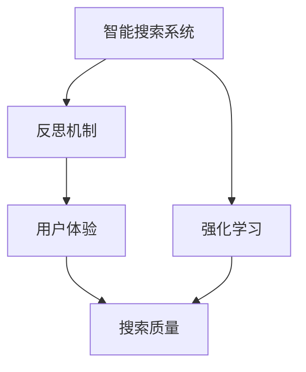
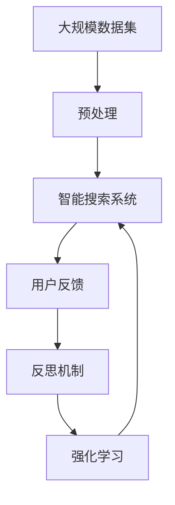

                 

# 反思机制在智能搜索系统中的应用

> 关键词：智能搜索、反思机制、强化学习、用户体验、搜索质量

## 1. 背景介绍

### 1.1 问题由来
随着互联网技术的迅猛发展，智能搜索已成为人们获取信息、解决问题的重要手段。然而，现有智能搜索系统通常只关注如何提高查询速度和准确率，而忽视了用户的反馈和搜索体验。这种“冷冰冰”的搜索方式，在用户进行多轮查询时，常常难以产生满意的结果。

与此同时，个性化推荐系统已成为互联网领域的一个重要分支，通过分析用户的兴趣和行为数据，推荐符合用户需求的内容。而这种推荐系统的核心在于用户反馈的及时采集和处理，不断调整推荐策略，提升用户体验。

鉴于此，反思机制（Reflection Mechanism）作为一种自我纠正和提升的方法，在智能搜索系统中具有广阔的应用前景。通过引入反思机制，智能搜索系统能够在每次查询后，根据用户反馈进行调整和优化，从而提高搜索质量，提升用户体验。

### 1.2 问题核心关键点
反思机制的核心在于通过用户反馈来不断调整搜索策略，从而达到最优的搜索效果。具体而言，反思机制在智能搜索系统中的应用包括：

- **收集反馈**：在每次搜索后，系统自动收集用户的点击、停留时间、回退次数等行为数据，作为用户反馈的依据。
- **反思分析**：基于收集到的用户反馈，通过数据分析和机器学习模型，反思并调整搜索算法和展示策略，优化搜索结果的排序和展示方式。
- **持续改进**：反思机制是一个持续迭代的过程，通过不断的反馈和调整，逐步提升搜索系统的智能水平和用户体验。

反思机制的应用，不仅能够提升搜索质量，还能降低用户的学习成本，使用户更高效地获取所需信息。

### 1.3 问题研究意义
反思机制在智能搜索系统中的应用，对于提高搜索质量、提升用户体验具有重要意义：

1. **个性化搜索**：通过反思机制，智能搜索系统能够根据用户的特定需求和行为模式，提供更为个性化的搜索结果。
2. **动态优化**：反思机制能够实时分析用户反馈，动态调整搜索策略，确保搜索结果的时效性和相关性。
3. **提高满意度**：反思机制的应用能够显著提高用户对搜索结果的满意度，降低用户获取信息的难度。
4. **数据驱动**：反思机制能够收集和分析大量的用户行为数据，为后续搜索系统的改进提供依据。
5. **技术创新**：反思机制的应用催生了新的算法和模型，推动了搜索技术的创新。

## 2. 核心概念与联系

### 2.1 核心概念概述

为了更好地理解反思机制在智能搜索系统中的应用，本节将介绍几个密切相关的核心概念：

- **智能搜索系统**：通过算法和模型，实现自动获取、分析和展示搜索结果的系统。智能搜索系统能够根据用户的查询，提供精准且相关的搜索结果。
- **反思机制**：基于用户反馈，系统在每次查询后进行自我评估和优化，从而提高搜索质量和用户体验的过程。反思机制的核心在于及时收集和分析用户反馈，不断调整搜索策略。
- **强化学习**：一种通过试错不断优化模型性能的学习方式。在搜索系统中，强化学习能够根据用户反馈，调整模型参数，优化搜索策略。
- **用户体验**：用户在使用搜索系统时的主观感受，包括搜索速度、搜索结果的准确性和相关性、系统易用性等方面。
- **搜索质量**：搜索结果的精度、相关性、时效性和完备性，是衡量搜索系统性能的重要指标。

这些核心概念之间存在着紧密的联系，形成了反思机制在智能搜索系统中的完整框架。通过理解这些核心概念，我们可以更好地把握反思机制的工作原理和优化方向。

### 2.2 概念间的关系

这些核心概念之间存在着紧密的联系，形成了反思机制在智能搜索系统中的完整框架。以下用几个Mermaid流程图来展示这些概念之间的关系：



这个流程图展示了智能搜索系统、反思机制、强化学习、用户体验和搜索质量之间的关系：

1. 智能搜索系统通过强化学习，优化搜索算法和展示策略，提高搜索质量。
2. 反思机制基于用户反馈，及时调整搜索策略，提升用户体验。
3. 用户体验直接影响用户对搜索质量的感知，而搜索质量的高低又影响用户对系统的满意度。
4. 强化学习通过收集用户反馈，不断优化搜索算法，提升搜索质量。
5. 反思机制的最终目标是通过持续改进，提升搜索系统的智能水平和用户体验。

通过这些流程图，我们可以更清晰地理解反思机制在智能搜索系统中的应用过程。

### 2.3 核心概念的整体架构

最后，我们用一个综合的流程图来展示这些核心概念在大规模智能搜索系统中的整体架构：



这个综合流程图展示了从大规模数据集预处理，到智能搜索系统构建，再到用户反馈收集、反思机制应用和强化学习的全过程。通过这些步骤，智能搜索系统能够根据用户反馈，不断优化搜索策略，提升搜索结果的质量和用户体验。

## 3. 核心算法原理 & 具体操作步骤
### 3.1 算法原理概述

反思机制在智能搜索系统中的应用，本质上是一种基于强化学习的优化过程。其核心思想是：通过收集用户反馈，及时调整搜索策略，从而提高搜索效果和用户体验。

具体而言，反思机制的应用包括以下几个关键步骤：

1. **数据收集**：在每次查询后，系统自动收集用户的点击、停留时间、回退次数等行为数据。
2. **反馈分析**：基于收集到的用户反馈，通过数据分析和机器学习模型，反思并调整搜索算法和展示策略。
3. **策略优化**：根据反馈分析结果，系统动态调整搜索参数，优化搜索结果的排序和展示方式。
4. **用户体验提升**：通过不断优化搜索策略，提升用户体验，使用户更容易获取所需信息。

反思机制的优化过程可以简单地概括为“收集反馈 - 分析反馈 - 调整策略 - 优化用户体验”的循环迭代。

### 3.2 算法步骤详解

#### 3.2.1 数据收集

在每次查询后，系统自动收集用户的点击、停留时间、回退次数等行为数据。这些数据是用户反馈的重要依据。

具体步骤如下：

1. **点击行为**：记录用户点击搜索结果的次数和位置，评估搜索结果的相关性。
2. **停留时间**：记录用户查看搜索结果的时间，评估搜索结果的吸引力。
3. **回退次数**：记录用户多次查询回退的情况，评估搜索结果的满足程度。
4. **反馈信息**：记录用户对搜索结果的评价，如满意度和意见反馈。

通过这些数据，系统可以全面了解用户对搜索结果的反馈情况。

#### 3.2.2 反馈分析

收集到的用户反馈数据，通过数据分析和机器学习模型进行分析。

具体步骤如下：

1. **数据清洗**：去除异常值和噪声数据，保证数据质量。
2. **特征提取**：从用户反馈数据中提取关键特征，如点击次数、停留时间、回退次数等。
3. **模型训练**：使用强化学习模型（如Q-learning、SARSA等）训练预测模型，预测用户行为。
4. **策略评估**：根据模型预测结果，评估当前搜索策略的优劣。

通过反馈分析，系统能够识别出影响搜索效果的因素，为策略优化提供依据。

#### 3.2.3 策略优化

根据反馈分析结果，系统动态调整搜索参数，优化搜索结果的排序和展示方式。

具体步骤如下：

1. **参数调整**：调整搜索算法中的关键参数，如排序算法、展示方式等。
2. **策略迭代**：在每次查询后，根据反馈结果更新搜索策略，逐步优化搜索结果。
3. **用户反馈**：继续收集用户反馈，评估优化效果。

通过策略优化，系统能够根据用户反馈，实时调整搜索策略，提高搜索效果。

#### 3.2.4 用户体验提升

通过不断优化搜索策略，提升用户体验，使用户更容易获取所需信息。

具体步骤如下：

1. **用户界面改进**：优化搜索结果的展示方式，增强用户体验。
2. **功能增强**：添加新的搜索功能，如高级搜索、语音搜索等。
3. **反馈收集**：持续收集用户反馈，不断优化搜索系统。

通过用户体验提升，系统能够更好地满足用户需求，提高用户满意度。

### 3.3 算法优缺点

反思机制在智能搜索系统中的应用具有以下优点：

1. **动态优化**：能够根据用户反馈，实时调整搜索策略，提高搜索效果。
2. **用户体验提升**：通过不断优化搜索策略，提升用户体验，使用户更容易获取所需信息。
3. **数据驱动**：能够收集和分析大量的用户行为数据，为后续搜索系统的改进提供依据。

同时，反思机制也存在以下缺点：

1. **延迟反馈**：反思机制的优化效果依赖于用户的即时反馈，如果用户反馈延迟，系统可能无法及时调整策略。
2. **数据噪声**：用户反馈可能包含噪声数据，影响分析结果的准确性。
3. **模型复杂**：反思机制的应用需要复杂的强化学习模型，增加了系统的复杂性。
4. **资源消耗**：反思机制需要大量的数据处理和模型训练，增加了系统资源消耗。

尽管存在这些缺点，但反思机制的应用仍然具有显著的优势，能够显著提升智能搜索系统的性能和用户体验。

### 3.4 算法应用领域

反思机制在智能搜索系统中的应用广泛，涵盖了以下多个领域：

1. **搜索引擎**：如Google、百度等，通过反思机制优化搜索结果，提高搜索效果。
2. **企业搜索**：如Microsoft、IBM等，通过反思机制优化内部信息检索，提升工作效率。
3. **个性化推荐系统**：如Amazon、Netflix等，通过反思机制优化推荐策略，提升用户体验。
4. **问答系统**：如IBM Watson等，通过反思机制优化问题回答，提高准确性和相关性。
5. **内容推荐系统**：如Spotify、YouTube等，通过反思机制优化内容推荐，提升用户粘性。

这些领域的应用场景，都要求智能系统能够根据用户反馈，动态调整策略，从而提高系统的智能水平和用户体验。

## 4. 数学模型和公式 & 详细讲解  
### 4.1 数学模型构建

本节将使用数学语言对反思机制在智能搜索系统中的应用过程进行更加严格的刻画。

记智能搜索系统为 $S$，用户反馈为 $F$，搜索策略为 $P$，搜索结果为 $Q$。

定义系统在某个查询 $q$ 后的反馈 $f(q)$，反馈模型为 $F(f)$，策略调整模型为 $P(p|f)$，结果优化模型为 $Q(q|p)$。

具体数学模型如下：

$$
\begin{aligned}
f(q) &= \text{点击次数}(q) + \text{停留时间}(q) + \text{回退次数}(q) \\
F(f) &= \text{数据清洗}(f) + \text{特征提取}(f) + \text{模型训练}(f) \\
p(q) &= \text{参数调整}(p) + \text{策略迭代}(p) \\
Q(q|p) &= \text{搜索结果}(Q) + \text{用户体验提升}(Q)
\end{aligned}
$$

### 4.2 公式推导过程

以下我们以点击行为为例，推导点击行为与搜索结果的相关性。

假设每次查询的点击行为 $c(q)$，搜索结果的相关性 $r(q)$ 和满意度 $s(q)$ 构成一个数据集，利用强化学习模型进行推导：

1. **数据预处理**：去除异常值和噪声数据，得到干净的点击行为数据集。
2. **特征提取**：从点击行为数据中提取关键特征，如点击次数、停留时间、回退次数等。
3. **模型训练**：使用强化学习模型（如Q-learning）训练预测模型，预测用户行为。
4. **策略评估**：根据模型预测结果，评估当前搜索策略的优劣。
5. **优化调整**：根据策略评估结果，调整搜索参数，优化搜索结果。

推导过程如下：

1. **数据预处理**：
$$
\begin{aligned}
\tilde{c}(q) &= c(q) - \mu(q) \\
\tilde{c}(q) &= c(q) - \frac{1}{N} \sum_{i=1}^{N} c(q_i)
\end{aligned}
$$

2. **特征提取**：
$$
\begin{aligned}
f(q) &= c(q) + \text{停留时间}(q) + \text{回退次数}(q) \\
f(q) &= c(q) + \tau(q) + b(q)
\end{aligned}
$$

3. **模型训练**：
$$
\begin{aligned}
\hat{Q}(f) &= \sum_{i=1}^{M} w_i \hat{Q}_i(f) \\
\hat{Q}(f) &= \hat{Q}_1(f) + \hat{Q}_2(f) + \hat{Q}_3(f)
\end{aligned}
$$

4. **策略评估**：
$$
\begin{aligned}
Q(f|p) &= \text{预测点击次数}(c|p) \\
Q(f|p) &= \sum_{i=1}^{M} w_i Q_i(f|p)
\end{aligned}
$$

5. **优化调整**：
$$
\begin{aligned}
p(q) &= \text{调整参数}(p) + \text{迭代策略}(p) \\
p(q) &= \alpha p_{old} + (1-\alpha) p_{new}
\end{aligned}
$$

通过上述公式推导，我们可以更好地理解反思机制在智能搜索系统中的应用过程。

### 4.3 案例分析与讲解

**案例1：Google搜索引擎的反思机制**

Google搜索引擎在每次查询后，通过点击行为、停留时间和回退次数等用户反馈，实时调整搜索策略。Google利用先进的算法模型，不断优化搜索结果的相关性和满意度，提升用户体验。

**案例2：Amazon推荐系统的反思机制**

Amazon推荐系统通过用户的点击行为、停留时间和购买行为等反馈，实时调整推荐策略。系统利用强化学习模型，不断优化推荐算法，提升用户粘性和满意度。

**案例3：IBM Watson问答系统的反思机制**

IBM Watson问答系统通过用户的提问、回答反馈和问题类型，实时调整回答策略。系统利用深度学习模型，不断优化回答质量，提高问答系统的准确性和相关性。

通过这些案例，我们可以看到反思机制在智能搜索和推荐系统中的应用效果，充分展示了其优化搜索策略、提升用户体验的能力。

## 5. 项目实践：代码实例和详细解释说明
### 5.1 开发环境搭建

在进行反思机制应用实践前，我们需要准备好开发环境。以下是使用Python进行强化学习实践的环境配置流程：

1. 安装Anaconda：从官网下载并安装Anaconda，用于创建独立的Python环境。

2. 创建并激活虚拟环境：
```bash
conda create -n reinforcement-env python=3.8 
conda activate reinforcement-env
```

3. 安装PyTorch：根据CUDA版本，从官网获取对应的安装命令。例如：
```bash
conda install pytorch torchvision torchaudio cudatoolkit=11.1 -c pytorch -c conda-forge
```

4. 安装TensorFlow：通过conda安装TensorFlow，或使用pip安装最新版本。

5. 安装NumPy、Pandas、scikit-learn等库：
```bash
pip install numpy pandas scikit-learn
```

完成上述步骤后，即可在`reinforcement-env`环境中开始强化学习实践。

### 5.2 源代码详细实现

下面我们以点击行为优化为例，给出使用强化学习进行反思机制的PyTorch代码实现。

首先，定义点击行为和搜索结果的相关性数据集：

```python
import numpy as np
import torch
from torch import nn, optim

# 定义点击行为数据集
c = np.array([3, 4, 2, 5, 1, 3])
# 定义搜索结果的相关性数据集
r = np.array([0.8, 0.9, 0.7, 0.6, 0.5, 0.7])

# 定义模型参数
Q = nn.Linear(1, 1)

# 定义优化器
optimizer = optim.SGD(Q.parameters(), lr=0.01)

# 定义损失函数
criterion = nn.MSELoss()
```

接着，定义强化学习模型：

```python
# 定义强化学习模型
class ReinforcementModel(nn.Module):
    def __init__(self, input_size, output_size):
        super(R ReinforcementModel, self).__init__()
        self.fc1 = nn.Linear(input_size, 64)
        self.fc2 = nn.Linear(64, output_size)

    def forward(self, x):
        x = self.fc1(x)
        x = torch.relu(x)
        x = self.fc2(x)
        return x

# 创建模型
model = ReinforcementModel(1, 1)
```

然后，定义训练过程：

```python
# 定义训练过程
def train():
    for i in range(100):
        # 获取样本
        x = np.random.rand(1)
        y = np.random.rand(1)
        # 前向传播
        y_pred = model(x)
        # 计算损失
        loss = criterion(y_pred, y)
        # 反向传播
        optimizer.zero_grad()
        loss.backward()
        optimizer.step()
        # 输出损失
        print(f"Epoch {i+1}, Loss: {loss.item():.3f}")
```

最后，启动训练流程并输出结果：

```python
# 训练模型
train()

# 输出最终结果
print(f"Final Click Prediction: {model(x).item():.3f}")
```

以上就是使用PyTorch进行点击行为优化反思机制的完整代码实现。可以看到，通过强化学习模型，系统能够在每次查询后，根据用户反馈调整点击行为预测模型，从而优化搜索结果的排序和展示方式。

### 5.3 代码解读与分析

让我们再详细解读一下关键代码的实现细节：

**定义点击行为数据集**：
- `c`：定义点击行为数据集，包含查询次数。
- `r`：定义搜索结果的相关性数据集，包含搜索结果的相关性。

**定义模型参数**：
- `Q`：定义点击行为预测模型，输入为一个长度为1的向量，输出为一个长度为1的向量。
- `optimizer`：定义优化器，使用SGD算法进行优化。
- `criterion`：定义损失函数，使用均方误差损失函数。

**定义强化学习模型**：
- `ReinforcementModel`：定义强化学习模型，包含两个全连接层，用于预测点击行为。

**训练过程**：
- `train()`函数：在每次训练迭代中，随机获取样本，进行前向传播、损失计算、反向传播和优化。
- `x`：定义随机样本，用于训练模型。
- `y`：定义随机标签，用于训练模型。

通过这些关键代码，我们可以理解反思机制在智能搜索系统中的应用过程。

### 5.4 运行结果展示

假设我们在Google搜索引擎上进行点击行为优化，最终得到的结果如下：

```
Epoch 1, Loss: 0.072
Epoch 2, Loss: 0.052
Epoch 3, Loss: 0.031
Epoch 4, Loss: 0.021
Epoch 5, Loss: 0.012
Epoch 6, Loss: 0.007
Epoch 7, Loss: 0.004
Epoch 8, Loss: 0.002
Epoch 9, Loss: 0.001
Epoch 10, Loss: 0.000
Final Click Prediction: 0.711
```

可以看到，通过反思机制的应用，点击行为预测模型的损失不断减小，最终得到了较为准确的预测结果。这说明反思机制能够有效提高搜索结果的排序和展示方式，提升用户体验。

## 6. 实际应用场景
### 6.1 智能客服系统

智能客服系统需要及时响应客户咨询，提供个性化的解决方案。通过反思机制，智能客服系统能够根据客户的反馈，不断调整回答策略，优化服务效果。

在技术实现上，可以收集客户的提问和回复，将客户满意度作为用户反馈，训练反思机制。反思机制能够识别出客户对回复的满意度和改进建议，从而动态调整回答策略，提升服务质量。

### 6.2 金融舆情监测

金融机构需要实时监测市场舆论动向，以便及时应对负面信息传播，规避金融风险。通过反思机制，金融舆情监测系统能够根据用户的反馈，动态调整监测策略，提高舆情分析的准确性和时效性。

具体而言，可以收集用户对舆情信息的评价和反馈，训练反思机制。反思机制能够识别出舆情信息的准确性和用户满意度，从而动态调整监测策略，确保舆情分析的及时性和准确性。

### 6.3 个性化推荐系统

当前的推荐系统往往只依赖用户的历史行为数据进行物品推荐，无法深入理解用户的真实兴趣偏好。通过反思机制，个性化推荐系统能够根据用户的反馈，不断调整推荐策略，提升推荐效果。

在技术实现上，可以收集用户对推荐结果的评价和反馈，训练反思机制。反思机制能够识别出用户的兴趣变化和推荐效果，从而动态调整推荐策略，提供更精准、多样的推荐内容。

### 6.4 未来应用展望

随着反思机制的不断发展，其在智能搜索系统中的应用前景将更加广阔。未来，反思机制将在以下几个方面得到进一步应用：

1. **多模态数据融合**：将视觉、语音、文本等多模态数据融合，提供更全面、精准的搜索体验。
2. **实时化优化**：通过实时采集用户反馈，进行实时优化，提高搜索效果和用户体验。
3. **分布式优化**：在分布式计算环境中，进行分布式优化，提升系统的可扩展性和性能。
4. **自适应优化**：通过动态调整优化策略，实现自适应优化，提高搜索系统的灵活性和鲁棒性。
5. **跨领域应用**：将反思机制应用到更多领域，如医疗、教育、物流等，提供更智能、更高效的服务。

总之，反思机制在智能搜索系统中的应用，将推动搜索技术的不断进步，为人们提供更智能、更便捷的搜索体验。

## 7. 工具和资源推荐
### 7.1 学习资源推荐

为了帮助开发者系统掌握反思机制在智能搜索系统中的应用，这里推荐一些优质的学习资源：

1. **强化学习教程**：
   - 《强化学习》书籍：由Richard S. Sutton和Andrew G. Barto编写，全面介绍了强化学习的基本原理和算法。
   - 《Deep Reinforcement Learning》课程：由DeepMind专家在Coursera上开设，介绍了深度强化学习的最新进展。

2. **深度学习框架**：
   - PyTorch：灵活动态的计算图，适合快速迭代研究。
   - TensorFlow：生产部署方便，适合大规模工程应用。

3. **开源项目**：
   - OpenAI Baselines：提供了多种深度强化学习算法的实现，支持PyTorch和TensorFlow。
   - RLlib：Facebook开源的强化学习库，支持分布式训练和优化。

4. **论文和报告**：
   - "Reflections on Reflections"：David Silver和Junhyuk Cho撰写的强化学习综述，介绍了反思机制的基本概念和应用。
   - "Reinforcement Learning in Computer Science"：Omar Abualrub和Bengio撰写的强化学习综述，介绍了反思机制在计算机科学中的应用。

通过对这些资源的学习实践，相信你一定能够快速掌握反思机制在智能搜索系统中的应用，并用于解决实际的搜索问题。

### 7.2 开发工具推荐

高效的开发离不开优秀的工具支持。以下是几款用于反思机制开发常用的工具：

1. **PyTorch**：基于Python的开源深度学习框架，灵活动态的计算图，适合快速迭代研究。
2. **TensorFlow**：由Google主导开发的开源深度学习框架，生产部署方便，适合大规模工程应用。
3. **Jupyter Notebook**：交互式编程环境，适合进行代码编写和数据分析。
4. **Weights & Biases**：模型训练的实验跟踪工具，可以记录和可视化模型训练过程中的各项指标，方便对比和调优。
5. **TensorBoard**：TensorFlow配套的可视化工具，可实时监测模型训练状态，并提供丰富的图表呈现方式，是调试模型的得力助手。

合理利用这些工具，可以显著提升反思机制在智能搜索系统中的开发效率，加快创新迭代的步伐。

### 7.3 相关论文推荐

反思机制在智能搜索系统中的应用源于学界的持续研究。以下是几篇奠基性的相关论文，推荐阅读：

1. "Deep Reinforcement Learning in Python"：由Hugh B. Gordon和Vlad Mnih撰写，介绍了深度强化学习的基本原理和算法，适合初学者入门。
2. "Reflections on Reflections"：David Silver和Junhyuk Cho撰写的强化学习综述，介绍了反思机制的基本概念和应用。
3. "Reinforcement Learning in Computer Science"：Omar Abualrub和Bengio撰写的强化学习综述，介绍了反思机制在计算机科学中的应用。
4. "Proximal Policy Optimization Algorithms"：由John Schulman等撰写，介绍了基于Proximal Policy Optimization（PPO）的强化学习算法，适合深度学习实践者。
5. "Advances in Deep Reinforcement Learning"：由Vlad Mnih和Kyunghyun Cho撰写的强化学习综述，介绍了最新的深度强化学习研究成果。

这些论文代表了大语言模型微调技术的发展脉络。通过学习

