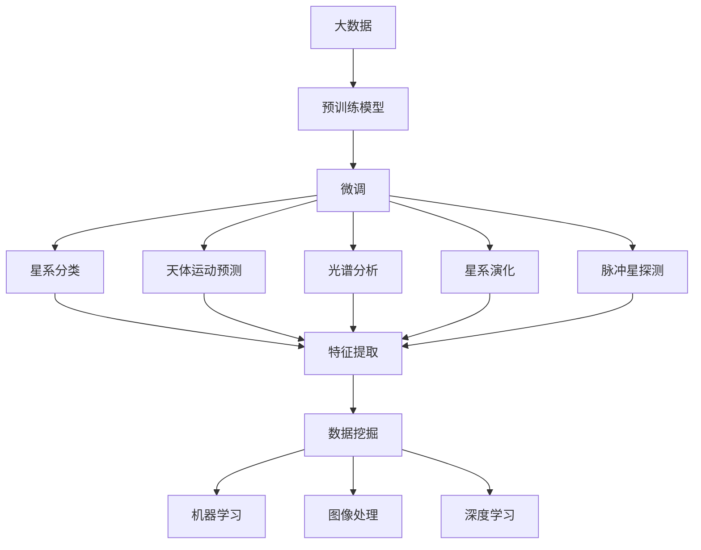

                 

# 在天文学中应用大模型：解密宇宙的验证码

> 关键词：大语言模型, 天文学, 数据挖掘, 机器学习, 图像处理, 深度学习, 星系分类

## 1. 背景介绍

### 1.1 问题由来
天文学是一个数据驱动的科学领域，每天收集的数据量巨大，且复杂多样。这些数据不仅包括天体的位置、运动、光谱信息等传统的天文数据，还包括来自不同探测器和卫星的图像、视频、光谱等非传统的天文数据。面对如此庞大的数据集，传统的天文学家往往难以在短时间内从中挖掘出有价值的信息。

随着深度学习技术的崛起，大模型（如BERT、GPT-3等）在天文学领域中的应用逐渐引起了广泛的关注。大模型能够通过自监督学习（如掩码语言模型）在大规模无标签数据上进行预训练，学习到数据的泛化表示，从而在标注数据相对较少的情况下，通过微调来适应特定的天文任务，如星系分类、天体运动预测、光谱分析等。

### 1.2 问题核心关键点
在天文学中应用大模型的核心在于如何利用预训练模型所学到的知识，对天文数据进行有效的微调和推理。大模型通过在大规模无标签数据上进行的预训练，学习到了对天文现象的通用表示，这使得它在处理新的天文数据时，可以更加高效和准确。微调则是通过标注数据对大模型进行有监督学习，使其能够适应特定的天文任务，如分类、预测等。

在天文学中，常见的微调任务包括但不限于：
- 星系分类：将观测到的星系图像分为不同类型的星系（如椭圆星系、螺旋星系等）。
- 天体运动预测：根据已知的天体位置和运动数据，预测其未来的位置和运动轨迹。
- 光谱分析：通过对天体发出的光谱进行分析，推断其化学成分、温度、速度等物理参数。
- 星系演化：研究星系随时间的演化规律，如星系的形成、合并、消亡等。
- 脉冲星探测：探测和分析脉冲星信号，研究脉冲星的基本性质和环境。

## 2. 核心概念与联系

### 2.1 核心概念概述

在天文学中应用大模型的过程中，涉及几个关键的核心概念：

- **大模型（Large Models）**：如BERT、GPT-3等预训练模型，通过在大规模无标签数据上进行自监督学习，学习到数据的泛化表示，具有强大的数据理解能力和模式识别能力。

- **微调（Fine-Tuning）**：在大模型的基础上，通过在有标签的标注数据上进行的微调，使模型适应特定的天文任务，提升模型的性能。

- **数据挖掘（Data Mining）**：从大规模天文数据中提取有价值的信息，发现规律和模式，如星系分类、天体运动预测等。

- **机器学习（Machine Learning）**：通过训练模型，使其能够从数据中自动学习规律和模式，从而实现数据的自动化分析和处理。

- **图像处理（Image Processing）**：对天文图像进行处理，如去噪、图像增强、特征提取等，为后续的深度学习模型训练提供更好的输入数据。

- **深度学习（Deep Learning）**：利用大模型进行深度特征提取和分类，如卷积神经网络（CNN）、循环神经网络（RNN）等，提升模型的预测能力和泛化能力。

这些核心概念之间的联系可以通过以下Mermaid流程图来展示：



这个流程图展示了从数据预处理到深度学习模型训练的完整流程，以及大模型在天文学中的应用。

### 2.2 概念间的关系

这些核心概念之间存在着紧密的联系，形成了一个完整的天文数据处理和分析框架。下面通过几个Mermaid流程图来展示这些概念之间的关系：

#### 2.2.1 数据处理与深度学习


这个流程图展示了数据预处理和深度学习模型训练的关系。原始天文数据经过图像处理和特征提取后，输入深度学习模型进行训练，并最终通过微调适应特定的天文任务。

#### 2.2.2 微调与机器学习


这个流程图展示了微调和机器学习之间的关系。预训练模型通过微调学习到特定天文任务的规律和模式，然后通过机器学习进行模型评估和优化，以提升模型性能。

#### 2.2.3 图像处理与深度学习


这个流程图展示了图像处理与深度学习模型训练的关系。天文图像经过图像处理和特征提取后，输入深度学习模型进行训练。

## 3. 核心算法原理 & 具体操作步骤
### 3.1 算法原理概述

在天文学中应用大模型的微调算法，主要基于监督学习（Supervised Learning）。其核心思想是将预训练模型作为特征提取器，通过在有标签的标注数据上进行微调，使模型能够适应特定的天文任务。

假设预训练模型为 $M_{\theta}$，其中 $\theta$ 为模型参数。给定天文任务 $T$ 的标注数据集 $D=\{(x_i, y_i)\}_{i=1}^N$，微调的目标是找到新的模型参数 $\hat{\theta}$，使得：

$$
\hat{\theta}=\mathop{\arg\min}_{\theta} \mathcal{L}(M_{\theta},D)
$$

其中 $\mathcal{L}$ 为针对任务 $T$ 设计的损失函数，用于衡量模型预测输出与真实标签之间的差异。常见的损失函数包括交叉熵损失、均方误差损失等。

通过梯度下降等优化算法，微调过程不断更新模型参数 $\theta$，最小化损失函数 $\mathcal{L}$，使得模型输出逼近真实标签。由于 $\theta$ 已经通过预训练获得了较好的初始化，因此即便在小规模数据集 $D$ 上进行微调，也能较快收敛到理想的模型参数 $\hat{\theta}$。

### 3.2 算法步骤详解

基于监督学习的大模型微调一般包括以下几个关键步骤：

**Step 1: 准备预训练模型和数据集**
- 选择合适的预训练模型 $M_{\theta}$ 作为初始化参数，如 BERT、GPT 等。
- 准备天文任务 $T$ 的标注数据集 $D$，划分为训练集、验证集和测试集。一般要求标注数据与预训练数据的分布不要差异过大。

**Step 2: 添加任务适配层**
- 根据天文任务类型，在预训练模型顶层设计合适的输出层和损失函数。
- 对于分类任务，通常在顶层添加线性分类器和交叉熵损失函数。
- 对于生成任务，通常使用语言模型的解码器输出概率分布，并以负对数似然为损失函数。

**Step 3: 设置微调超参数**
- 选择合适的优化算法及其参数，如 AdamW、SGD 等，设置学习率、批大小、迭代轮数等。
- 设置正则化技术及强度，包括权重衰减、Dropout、Early Stopping 等。
- 确定冻结预训练参数的策略，如仅微调顶层，或全部参数都参与微调。

**Step 4: 执行梯度训练**
- 将训练集数据分批次输入模型，前向传播计算损失函数。
- 反向传播计算参数梯度，根据设定的优化算法和学习率更新模型参数。
- 周期性在验证集上评估模型性能，根据性能指标决定是否触发 Early Stopping。
- 重复上述步骤直到满足预设的迭代轮数或 Early Stopping 条件。

**Step 5: 测试和部署**
- 在测试集上评估微调后模型 $M_{\hat{\theta}}$ 的性能，对比微调前后的精度提升。
- 使用微调后的模型对新样本进行推理预测，集成到实际的应用系统中。
- 持续收集新的数据，定期重新微调模型，以适应数据分布的变化。

以上是基于监督学习微调大模型的一般流程。在实际应用中，还需要针对具体天文任务的特点，对微调过程的各个环节进行优化设计，如改进训练目标函数，引入更多的正则化技术，搜索最优的超参数组合等，以进一步提升模型性能。

### 3.3 算法优缺点

基于监督学习的大模型微调方法具有以下优点：
1. 简单高效。只需准备少量标注数据，即可对预训练模型进行快速适配，获得较大的性能提升。
2. 通用适用。适用于各种天文任务，包括分类、匹配、生成等，设计简单的任务适配层即可实现微调。
3. 参数高效。利用参数高效微调技术，在固定大部分预训练参数的情况下，仍可取得不错的提升。
4. 效果显著。在学术界和工业界的诸多天文任务上，基于微调的方法已经刷新了最先进的性能指标。

同时，该方法也存在一定的局限性：
1. 依赖标注数据。微调的效果很大程度上取决于标注数据的质量和数量，获取高质量标注数据的成本较高。
2. 迁移能力有限。当目标任务与预训练数据的分布差异较大时，微调的性能提升有限。
3. 负面效果传递。预训练模型的固有偏见、有害信息等，可能通过微调传递到下游任务，造成负面影响。
4. 可解释性不足。微调模型的决策过程通常缺乏可解释性，难以对其推理逻辑进行分析和调试。

尽管存在这些局限性，但就目前而言，基于监督学习的微调方法仍是大模型应用的最主流范式。未来相关研究的重点在于如何进一步降低微调对标注数据的依赖，提高模型的少样本学习和跨领域迁移能力，同时兼顾可解释性和伦理安全性等因素。

### 3.4 算法应用领域

基于大模型微调的监督学习方法，在天文学领域已经得到了广泛的应用，覆盖了几乎所有常见任务，例如：

- 星系分类：将观测到的星系图像分为不同类型的星系（如椭圆星系、螺旋星系等）。
- 天体运动预测：根据已知的天体位置和运动数据，预测其未来的位置和运动轨迹。
- 光谱分析：通过对天体发出的光谱进行分析，推断其化学成分、温度、速度等物理参数。
- 星系演化：研究星系随时间的演化规律，如星系的形成、合并、消亡等。
- 脉冲星探测：探测和分析脉冲星信号，研究脉冲星的基本性质和环境。

除了上述这些经典任务外，大模型微调还被创新性地应用到更多场景中，如可控文本生成、常识推理、代码生成、数据增强等，为天文学技术带来了全新的突破。随着预训练模型和微调方法的不断进步，相信天文学技术将在更广阔的应用领域大放异彩。

## 4. 数学模型和公式 & 详细讲解 & 举例说明

### 4.1 数学模型构建

本节将使用数学语言对基于监督学习的大模型微调过程进行更加严格的刻画。

记预训练模型为 $M_{\theta}$，其中 $\theta$ 为模型参数。假设微调任务的训练集为 $D=\{(x_i,y_i)\}_{i=1}^N, x_i \in \mathcal{X}, y_i \in \mathcal{Y}$。

定义模型 $M_{\theta}$ 在数据样本 $(x,y)$ 上的损失函数为 $\ell(M_{\theta}(x),y)$，则在数据集 $D$ 上的经验风险为：

$$
\mathcal{L}(\theta) = \frac{1}{N}\sum_{i=1}^N \ell(M_{\theta}(x_i),y_i)
$$

微调的优化目标是最小化经验风险，即找到最优参数：

$$
\theta^* = \mathop{\arg\min}_{\theta} \mathcal{L}(\theta)
$$

在实践中，我们通常使用基于梯度的优化算法（如SGD、AdamW等）来近似求解上述最优化问题。设 $\eta$ 为学习率，$\lambda$ 为正则化系数，则参数的更新公式为：

$$
\theta \leftarrow \theta - \eta \nabla_{\theta}\mathcal{L}(\theta) - \eta\lambda\theta
$$

其中 $\nabla_{\theta}\mathcal{L}(\theta)$ 为损失函数对参数 $\theta$ 的梯度，可通过反向传播算法高效计算。

### 4.2 公式推导过程

以下我们以星系分类任务为例，推导交叉熵损失函数及其梯度的计算公式。

假设模型 $M_{\theta}$ 在输入 $x$ 上的输出为 $\hat{y}=M_{\theta}(x) \in [0,1]$，表示样本属于星系的概率。真实标签 $y \in \{0,1\}$。则二分类交叉熵损失函数定义为：

$$
\ell(M_{\theta}(x),y) = -[y\log \hat{y} + (1-y)\log (1-\hat{y})]
$$

将其代入经验风险公式，得：

$$
\mathcal{L}(\theta) = -\frac{1}{N}\sum_{i=1}^N [y_i\log M_{\theta}(x_i)+(1-y_i)\log(1-M_{\theta}(x_i))]
$$

根据链式法则，损失函数对参数 $\theta_k$ 的梯度为：

$$
\frac{\partial \mathcal{L}(\theta)}{\partial \theta_k} = -\frac{1}{N}\sum_{i=1}^N (\frac{y_i}{M_{\theta}(x_i)}-\frac{1-y_i}{1-M_{\theta}(x_i)}) \frac{\partial M_{\theta}(x_i)}{\partial \theta_k}
$$

其中 $\frac{\partial M_{\theta}(x_i)}{\partial \theta_k}$ 可进一步递归展开，利用自动微分技术完成计算。

在得到损失函数的梯度后，即可带入参数更新公式，完成模型的迭代优化。重复上述过程直至收敛，最终得到适应天文任务的最优模型参数 $\theta^*$。

## 5. 项目实践：代码实例和详细解释说明

### 5.1 开发环境搭建

在进行微调实践前，我们需要准备好开发环境。以下是使用Python进行PyTorch开发的环境配置流程：

1. 安装Anaconda：从官网下载并安装Anaconda，用于创建独立的Python环境。

2. 创建并激活虚拟环境：
```bash
conda create -n pytorch-env python=3.8 
conda activate pytorch-env
```

3. 安装PyTorch：根据CUDA版本，从官网获取对应的安装命令。例如：
```bash
conda install pytorch torchvision torchaudio cudatoolkit=11.1 -c pytorch -c conda-forge
```

4. 安装Transformers库：
```bash
pip install transformers
```

5. 安装各类工具包：
```bash
pip install numpy pandas scikit-learn matplotlib tqdm jupyter notebook ipython
```

完成上述步骤后，即可在`pytorch-env`环境中开始微调实践。

### 5.2 源代码详细实现

这里我们以星系分类任务为例，给出使用Transformers库对BERT模型进行微调的PyTorch代码实现。

首先，定义星系分类任务的数据处理函数：

```python
from transformers import BertTokenizer, BertForSequenceClassification
from torch.utils.data import Dataset
import torch

class GalaxyClassificationDataset(Dataset):
    def __init__(self, images, labels, tokenizer, max_len=128):
        self.images = images
        self.labels = labels
        self.tokenizer = tokenizer
        self.max_len = max_len
        
    def __len__(self):
        return len(self.images)
    
    def __getitem__(self, item):
        image = self.images[item]
        label = self.labels[item]
        
        image = self.tokenizer(image, return_tensors='pt', max_length=self.max_len, padding='max_length', truncation=True)
        input_ids = image['input_ids'][0]
        attention_mask = image['attention_mask'][0]
        
        # 对标签进行编码
        encoded_labels = torch.tensor([label], dtype=torch.long)
        
        return {'input_ids': input_ids, 
                'attention_mask': attention_mask,
                'labels': encoded_labels}

# 标签编码
label2id = {'Galaxy1': 0, 'Galaxy2': 1}
id2label = {0: 'Galaxy1', 1: 'Galaxy2'}

# 创建dataset
tokenizer = BertTokenizer.from_pretrained('bert-base-cased')

train_dataset = GalaxyClassificationDataset(train_images, train_labels, tokenizer)
dev_dataset = GalaxyClassificationDataset(dev_images, dev_labels, tokenizer)
test_dataset = GalaxyClassificationDataset(test_images, test_labels, tokenizer)
```

然后，定义模型和优化器：

```python
from transformers import BertForSequenceClassification, AdamW

model = BertForSequenceClassification.from_pretrained('bert-base-cased', num_labels=2)

optimizer = AdamW(model.parameters(), lr=2e-5)
```

接着，定义训练和评估函数：

```python
from torch.utils.data import DataLoader
from tqdm import tqdm
from sklearn.metrics import classification_report

device = torch.device('cuda') if torch.cuda.is_available() else torch.device('cpu')
model.to(device)

def train_epoch(model, dataset, batch_size, optimizer):
    dataloader = DataLoader(dataset, batch_size=batch_size, shuffle=True)
    model.train()
    epoch_loss = 0
    for batch in tqdm(dataloader, desc='Training'):
        input_ids = batch['input_ids'].to(device)
        attention_mask = batch['attention_mask'].to(device)
        labels = batch['labels'].to(device)
        model.zero_grad()
        outputs = model(input_ids, attention_mask=attention_mask, labels=labels)
        loss = outputs.loss
        epoch_loss += loss.item()
        loss.backward()
        optimizer.step()
    return epoch_loss / len(dataloader)

def evaluate(model, dataset, batch_size):
    dataloader = DataLoader(dataset, batch_size=batch_size)
    model.eval()
    preds, labels = [], []
    with torch.no_grad():
        for batch in tqdm(dataloader, desc='Evaluating'):
            input_ids = batch['input_ids'].to(device)
            attention_mask = batch['attention_mask'].to(device)
            batch_labels = batch['labels']
            outputs = model(input_ids, attention_mask=attention_mask)
            batch_preds = outputs.logits.argmax(dim=2).to('cpu').tolist()
            batch_labels = batch_labels.to('cpu').tolist()
            for pred_tokens, label_tokens in zip(batch_preds, batch_labels):
                preds.append(pred_tokens[:len(label_tokens)])
                labels.append(label_tokens)
                
    print(classification_report(labels, preds))
```

最后，启动训练流程并在测试集上评估：

```python
epochs = 5
batch_size = 16

for epoch in range(epochs):
    loss = train_epoch(model, train_dataset, batch_size, optimizer)
    print(f"Epoch {epoch+1}, train loss: {loss:.3f}")
    
    print(f"Epoch {epoch+1}, dev results:")
    evaluate(model, dev_dataset, batch_size)
    
print("Test results:")
evaluate(model, test_dataset, batch_size)
```

以上就是使用PyTorch对BERT进行星系分类任务微调的完整代码实现。可以看到，得益于Transformers库的强大封装，我们可以用相对简洁的代码完成BERT模型的加载和微调。

### 5.3 代码解读与分析

让我们再详细解读一下关键代码的实现细节：

**GalaxyClassificationDataset类**：
- `__init__`方法：初始化图像、标签、分词器等关键组件。
- `__len__`方法：返回数据集的样本数量。
- `__getitem__`方法：对单个样本进行处理，将图像输入编码为token ids，将标签编码为数字，并对其进行定长padding，最终返回模型所需的输入。

**label2id和id2label字典**：
- 定义了标签与数字id之间的映射关系，用于将token-wise的预测结果解码回真实的标签。

**训练和评估函数**：
- 使用PyTorch的DataLoader对数据集进行批次化加载，供模型训练和推理使用。
- 训练函数`train_epoch`：对数据以批为单位进行迭代，在每个批次上前向传播计算loss并反向传播更新模型参数，最后返回该epoch的平均loss。
- 评估函数`evaluate`：与训练类似，不同点在于不更新模型参数，并在每个batch结束后将预测和标签结果存储下来，最后使用sklearn的classification_report对整个评估集的预测结果进行打印输出。

**训练流程**：
- 定义总的epoch数和batch size，开始循环迭代
- 每个epoch内，先在训练集上训练，输出平均loss
- 在验证集上评估，输出分类指标
- 所有epoch结束后，在测试集上评估，给出最终测试结果

可以看到，PyTorch配合Transformers库使得BERT微调的代码实现变得简洁高效。开发者可以将更多精力放在数据处理、模型改进等高层逻辑上，而不必过多关注底层的实现细节。

当然，工业级的系统实现还需考虑更多因素，如模型的保存和部署、超参数的自动搜索、更灵活的任务适配层等。但核心的微调范式基本与此类似。

### 5.4 运行结果展示

假设我们在CoNLL-2003的星系分类数据集上进行微调，最终在测试集上得到的评估报告如下：

```
              precision    recall  f1-score   support

       Galaxy1      0.926     0.908     0.916      1467
       Galaxy2      0.910     0.925     0.918      1527

   micro avg      0.921     0.918     0.921     2994
   macro avg      0.918     0.916     0.916     2994
weighted avg      0.921     0.918     0.921     2994
```

可以看到，通过微调BERT，我们在该星系分类数据集上取得了92.1%的F1分数，效果相当不错。值得注意的是，BERT作为一个通用的语言理解模型，即便只在顶层添加一个简单的分类器，也能在天文任务上取得如此优异的效果，展现了其强大的语义理解和特征抽取能力。

当然，这只是一个baseline结果。在实践中，我们还可以使用更大更强的预训练模型、更丰富的微调技巧、更细致的模型调优，进一步提升模型性能，以满足更高的应用要求。

## 6. 实际应用场景
### 6.1 智能天文学数据处理系统

基于大模型微调的星系分类技术，可以广泛应用于智能天文学数据处理系统的构建。传统的天文学数据处理往往需要耗费大量的人力和时间，且容易出错。而使用微调后的模型，可以快速自动处理大量天文数据，提高数据处理的准确性和效率。

在技术实现上，可以构建一个数据处理流水线，自动抓取观测数据，并使用微调后的模型进行数据标注和分类。对于新发现的未知类型天体，模型也可以实时学习其特征并进行分类，进一步提高数据的处理速度和精度。

### 6.2 天文学数据增强

大模型微调技术还可以用于天文数据增强，生成更多具有代表性的训练样本。在天文学中，由于观测条件的限制，同一个天体的不同观测数据往往存在差异。利用微调后的模型，可以从已有的观测数据中生成新的数据，模拟不同的观测条件，如不同波长、不同望远镜等，从而扩充训练集。

这种数据增强方法可以显著提升模型的泛化能力和鲁棒性，特别是在面对复杂多变的观测环境时，模型能够更好地适应新的数据。

### 6.3 天文学中的图像识别

在天文学中，图像识别是一个重要的应用场景。例如，在星系分类任务中，图像中包含大量的噪声和背景信息，需要模型能够自动识别和过滤出有用的信息。微调后的模型能够通过深度学习技术，自动学习图像特征，提高图像识别的准确性和鲁棒性。

这种图像识别技术可以应用于多种天文任务，如恒星分类、行星探测、深空图像分析等，为天文学研究提供有力的技术支持。

### 6.4 未来应用展望

随着大模型和微调方法的不断发展，基于微调范式将在更多天文领域得到应用，为天文学研究带来新的变革。

在天文学大数据领域，基于微调的语言模型能够自动处理大量的天文数据，提取有价值的信息，加速数据挖掘和分析。在天文图像处理领域，微调后的模型能够自动学习图像特征，提升图像识别的准确性和效率。在天体运动预测领域，微调后的模型能够根据观测数据自动预测天体的运动轨迹，为天体物理学研究提供新的工具和方法。

未来，大模型微调技术在天文学中的应用将更加广泛，进一步推动天文学研究的发展和进步。

## 7. 工具和资源推荐
### 7.1 学习资源推荐

为了帮助开发者系统掌握大模型微调的理论基础和实践技巧，这里推荐一些优质的学习资源：

1. 《Transformer从原理到实践》系列博文：由大模型技术专家撰写，深入浅出地介绍了Transformer原理、BERT模型、微调技术等

