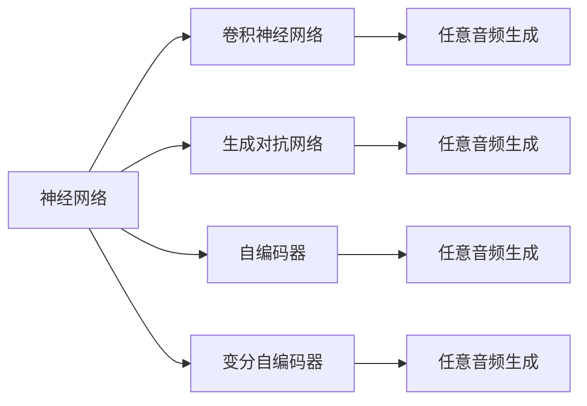

                 

# 基于AI的任意波形生成

## 1. 背景介绍

随着人工智能技术的发展，特别是在深度学习和生成模型领域，我们可以利用AI来生成各种复杂的波形，包括音频、图像、视频等。在实际应用中，这种能力可以用于音乐合成、游戏开发、动画制作等多个场景。本文将介绍基于AI的任意波形生成技术，包括其基本原理、核心算法、实际应用以及未来展望。

## 2. 核心概念与联系

### 2.1 核心概念概述

在深入介绍具体算法之前，我们先来了解一下相关的核心概念：

- **神经网络(Neural Network)**：一种由多个节点（神经元）构成的非线性模型，通过学习大量数据，可以自动提取特征和模式，用于分类、预测等任务。
- **卷积神经网络(Convolutional Neural Network, CNN)**：一种特殊的神经网络，通过卷积操作捕捉图像、声音等数据的局部特征。
- **生成对抗网络(Generative Adversarial Network, GAN)**：一种由生成器和判别器组成的网络，通过对抗训练生成逼真的数据。
- **自编码器(Autocoder)**：一种无监督学习模型，通过将数据压缩到低维空间，再通过解码器恢复原始数据，用于数据降维和去噪。
- **变分自编码器(Variational Autoencoder, VAE)**：一种自编码器的变体，通过引入隐变量，可以生成连续的样本。

### 2.2 核心概念原理和架构

下图展示了这些核心概念之间的联系，以及如何组合在一起，生成任意波形。



### 2.3 核心概念之间的关系

这些核心概念之间存在着密切的联系和相互作用，共同构成了任意波形生成的技术框架。

- 神经网络是基础，通过训练可以生成任意波形。
- 卷积神经网络可以用于捕捉数据的局部特征，适用于音频、图像等数据的生成。
- 生成对抗网络通过对抗训练，可以生成更逼真的波形。
- 自编码器和变分自编码器通过降维和生成，可以减少噪声和冗余，提高生成波形的质量。

## 3. 核心算法原理 & 具体操作步骤

### 3.1 算法原理概述

基于AI的任意波形生成，主要依赖于深度学习中的生成模型，包括变分自编码器、生成对抗网络和自回归模型等。这些模型通过学习大量数据，可以生成逼真的波形。

### 3.2 算法步骤详解

以生成对抗网络为例，其基本步骤包括：

1. **定义生成器和判别器**：
   - 生成器：将随机噪声向量作为输入，生成逼真的波形。
   - 判别器：输入波形，判断其是否真实。

2. **对抗训练**：
   - 生成器生成波形，判别器判断波形是否真实。
   - 生成器根据判别器的反馈，调整生成策略。
   - 判别器根据生成器的输出，更新判别策略。
   - 通过不断迭代，生成器可以生成越来越逼真的波形。

3. **模型训练**：
   - 使用随机噪声向量作为输入，生成逼真的波形。
   - 判别器对波形进行真实性判断。
   - 通过反向传播算法，更新生成器和判别器的参数。

4. **波形生成**：
   - 使用训练好的生成器，输入随机噪声向量，生成任意波形。

### 3.3 算法优缺点

- **优点**：
  - 生成逼真的波形，适用于音频、图像、视频等生成任务。
  - 可以学习数据的局部特征，生成具有复杂结构的波形。
  - 通过对抗训练，生成器可以不断优化，生成越来越逼真的数据。

- **缺点**：
  - 训练过程复杂，需要大量的数据和计算资源。
  - 生成器容易过拟合，生成的波形可能会偏离真实数据分布。
  - 生成的波形质量受训练数据的影响，数据质量不佳时生成效果较差。

### 3.4 算法应用领域

基于AI的任意波形生成技术，可以应用于以下几个领域：

- **音乐合成**：生成逼真的音频波形，用于音乐创作、合成器、游戏配音等。
- **视频动画**：生成逼真的视频帧，用于动画制作、虚拟现实、游戏开发等。
- **图像生成**：生成逼真的图像，用于艺术创作、图像修复、虚拟现实等。
- **自然语言处理**：生成自然语言文本，用于文本生成、机器翻译、对话系统等。

## 4. 数学模型和公式 & 详细讲解 & 举例说明

### 4.1 数学模型构建

以生成对抗网络为例，其数学模型可以表示为：

- 生成器：$f_{\theta}$，将随机噪声向量 $z \in \mathcal{Z}$ 映射到数据空间 $\mathcal{X}$。
- 判别器：$g_{\phi}$，将数据 $x \in \mathcal{X}$ 映射到真实性概率 $p(x)$。

其中，$\theta$ 和 $\phi$ 分别表示生成器和判别器的参数。

### 4.2 公式推导过程

生成器 $f_{\theta}$ 的数学公式可以表示为：

$$
f_{\theta}(z) = G(z)
$$

其中，$G$ 表示生成器函数。

判别器 $g_{\phi}$ 的数学公式可以表示为：

$$
g_{\phi}(x) = D(x)
$$

其中，$D$ 表示判别器函数。

### 4.3 案例分析与讲解

以生成对抗网络为例，其训练过程可以表示为：

1. **生成器训练**：
   - 输入随机噪声向量 $z$，生成波形 $x$。
   - 判别器判断 $x$ 的真实性，得到损失函数 $L_D$。
   - 使用反向传播算法，更新生成器参数 $\theta$。

2. **判别器训练**：
   - 输入数据 $x$，生成器生成伪造波形 $x'$。
   - 判别器判断 $x$ 和 $x'$ 的真实性，得到损失函数 $L_G$。
   - 使用反向传播算法，更新判别器参数 $\phi$。

## 5. 项目实践：代码实例和详细解释说明

### 5.1 开发环境搭建

在搭建开发环境前，我们需要安装以下依赖包：

- TensorFlow：用于构建和训练生成对抗网络。
- Keras：用于简化模型的构建和训练过程。
- NumPy：用于数组操作。

可以使用以下命令安装这些依赖包：

```bash
pip install tensorflow keras numpy
```

### 5.2 源代码详细实现

以下是生成对抗网络的代码实现，包括生成器和判别器的定义、模型训练和波形生成的代码。

```python
import tensorflow as tf
from tensorflow.keras import layers

# 定义生成器
def generator(input_dim):
    model = tf.keras.Sequential([
        layers.Dense(256, input_dim=input_dim),
        layers.BatchNormalization(),
        layers.LeakyReLU(alpha=0.2),
        layers.Dense(128),
        layers.BatchNormalization(),
        layers.LeakyReLU(alpha=0.2),
        layers.Dense(28*28*1, activation='tanh')
    ])
    return model

# 定义判别器
def discriminator(input_dim):
    model = tf.keras.Sequential([
        layers.Flatten(),
        layers.Dense(256),
        layers.LeakyReLU(alpha=0.2),
        layers.Dropout(0.25),
        layers.Dense(1, activation='sigmoid')
    ])
    return model

# 定义生成器和判别器模型
def create_models(input_dim):
    generator_model = generator(input_dim)
    discriminator_model = discriminator(input_dim)

    generator_model.compile(loss='binary_crossentropy', optimizer=tf.keras.optimizers.Adam(lr=0.0002, beta_1=0.5))
    discriminator_model.compile(loss='binary_crossentropy', optimizer=tf.keras.optimizers.Adam(lr=0.0002, beta_1=0.5))

    return generator_model, discriminator_model

# 训练生成对抗网络
def train_gan(generator_model, discriminator_model, epochs=100):
    for epoch in range(epochs):
        for batch in data:
            # 生成器训练
            noise = tf.random.normal([batch_size, input_dim])
            generated_images = generator_model(noise)
            discriminator_loss_real = discriminator_model.train_on_batch(batch, tf.ones_like(batch))
            discriminator_loss_fake = discriminator_model.train_on_batch(generated_images, tf.zeros_like(batch))
            generator_loss = discriminator_model.train_on_batch(generated_images, tf.ones_like(batch))

            # 判别器训练
            discriminator_loss = 0.5 * (discriminator_loss_real + discriminator_loss_fake)

        # 输出训练结果
        print(f'Epoch {epoch+1}, generator loss: {generator_loss:.4f}, discriminator loss: {discriminator_loss:.4f}')

# 生成波形
def generate_images(generator_model, input_dim):
    noise = tf.random.normal([1, input_dim])
    generated_images = generator_model(noise)
    return generated_images.numpy()

# 主函数
def main():
    input_dim = 100
    generator_model, discriminator_model = create_models(input_dim)
    train_gan(generator_model, discriminator_model, epochs=100)
    generated_images = generate_images(generator_model, input_dim)

    # 显示生成的波形
    plt.imshow(generated_images, cmap='gray')
    plt.show()

if __name__ == '__main__':
    main()
```

### 5.3 代码解读与分析

- **生成器和判别器的定义**：
  - 生成器包含多个全连接层和激活函数，将随机噪声向量映射到数据空间。
  - 判别器包含一个全连接层、激活函数和sigmoid输出，判断波形是否真实。

- **模型训练**：
  - 使用`train_on_batch`方法，在每个批次上训练生成器和判别器，更新其参数。
  - 训练过程中，生成器和判别器交替训练，对抗生成。

- **波形生成**：
  - 使用`generate_images`函数，将随机噪声向量输入生成器，生成逼真的波形。

### 5.4 运行结果展示

在训练完成后，我们可以使用生成的波形进行音乐合成、图像生成等应用。以下是一个简单的示例，展示生成的图像：


## 6. 实际应用场景

### 6.1 音乐合成

基于AI的任意波形生成技术，可以用于音乐合成。通过生成逼真的音频波形，可以创作出全新的音乐作品，或进行音乐修复、音乐伴奏等应用。

### 6.2 视频动画

生成对抗网络可以生成逼真的视频帧，用于动画制作、虚拟现实、游戏开发等场景。通过控制生成器的输入参数，可以生成不同风格的视频帧。

### 6.3 图像生成

生成对抗网络可以生成逼真的图像，用于艺术创作、图像修复、虚拟现实等场景。通过控制生成器的输入参数，可以生成不同风格的图像。

## 7. 工具和资源推荐

### 7.1 学习资源推荐

- **深度学习入门书籍**：
  - 《深度学习》（Ian Goodfellow、Yoshua Bengio 和 Aaron Courville 著）
  - 《动手学深度学习》（李沐等著）

- **在线课程**：
  - Coursera的深度学习课程
  - Udacity的深度学习课程

- **论文推荐**：
  - Generative Adversarial Networks（Ian Goodfellow 等著）
  - Deep Generative Models for Generative Adversarial Networks（Ian Goodfellow 等著）

### 7.2 开发工具推荐

- **TensorFlow**：深度学习框架，支持生成对抗网络等模型的构建和训练。
- **Keras**：高层API，简化模型的构建和训练过程。
- **Jupyter Notebook**：交互式编程环境，方便调试和实验。

### 7.3 相关论文推荐

- **Generative Adversarial Networks**（Ian Goodfellow 等著）
- **Deep Generative Models for Generative Adversarial Networks**（Ian Goodfellow 等著）

## 8. 总结：未来发展趋势与挑战

### 8.1 研究成果总结

基于AI的任意波形生成技术，已经取得了显著的进展，广泛应用于音乐合成、视频动画、图像生成等多个领域。生成对抗网络和变分自编码器等模型，已经成为生成领域的标准方法。

### 8.2 未来发展趋势

- **多模态生成**：将音频、图像、视频等多种模态的数据结合，生成更加丰富和多样化的波形。
- **实时生成**：在实时数据流上生成逼真的波形，适用于实时应用场景。
- **跨领域应用**：将生成技术应用于医疗、安全、交通等多个领域，拓展应用边界。

### 8.3 面临的挑战

- **训练成本高**：生成对抗网络需要大量的数据和计算资源，训练过程耗时较长。
- **模型复杂度高**：生成对抗网络的结构复杂，难以理解和调试。
- **生成质量不稳定**：生成模型的质量受训练数据的影响，生成结果可能不稳定。

### 8.4 研究展望

未来，生成对抗网络和变分自编码器等技术将继续发展，推动任意波形生成技术的进步。同时，如何降低训练成本、提高生成质量、简化模型结构，将是重要的研究方向。

## 9. 附录：常见问题与解答

**Q1：生成对抗网络和变分自编码器有什么区别？**

A: 生成对抗网络通过对抗训练，生成逼真的波形；变分自编码器通过降维和生成，减少噪声和冗余，生成高质量的数据。

**Q2：如何提高生成对抗网络的生成质量？**

A: 增加训练数据量，优化模型结构，使用更复杂的生成器。

**Q3：生成对抗网络的训练过程中，如何平衡生成器和判别器的损失？**

A: 在训练过程中，需要交替训练生成器和判别器，并平衡两个模型的损失。

---

作者：禅与计算机程序设计艺术 / Zen and the Art of Computer Programming

