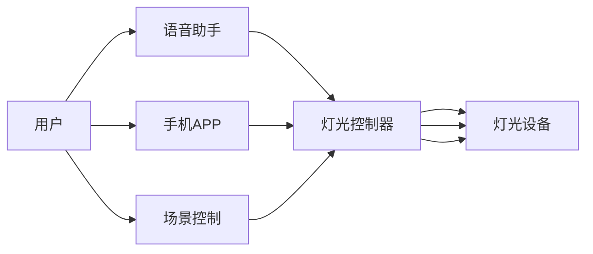

                 

# 基于Java的智能家居设计：一步步构建您的第一个智能灯光控制系统

智能家居系统已经成为现代家庭生活的重要组成部分，而智能灯光控制系统则是其中不可或缺的一环。本文将带领您一步步基于Java语言构建自己的智能灯光控制系统，涵盖从理论到实践的全过程。无论您是编程初学者还是智能家居爱好者，本文章都将提供详尽的技术指导，帮助您完成智能灯光控制系统的搭建。

## 1. 背景介绍

### 1.1 智能家居简介

智能家居是指通过物联网（IoT）技术，将家居中的各个设备连接起来，实现智能化、自动化控制。智能家居系统包括智能安防、智能温控、智能灯光、智能家电等多个子系统，它们共同构建了一个高效、便捷、舒适的居住环境。智能灯光控制系统作为智能家居的重要组成部分，可以通过语音控制、APP控制、场景控制等方式，根据用户的习惯和需求调节灯光亮度、颜色、开关状态，提升居住体验。

### 1.2 需求分析

为了设计一个功能完善且易于使用的智能灯光控制系统，首先需要明确系统的需求：
- 用户可以通过手机APP远程控制灯光。
- 灯光亮度和颜色可以通过语音或预设场景进行调节。
- 系统应该具有稳定性、可靠性和可扩展性。

### 1.3 系统架构

智能灯光控制系统可以采用如下架构：



架构中的关键组件如下：
- **语音助手**：负责语音识别和指令转译。
- **灯光控制器**：接收各种控制指令，进行逻辑处理后控制灯光设备。
- **灯光设备**：实现灯光的亮度、颜色等调节功能。

## 2. 核心概念与联系

### 2.1 核心概念概述

本节将介绍几个核心的智能家居概念，帮助您理解智能灯光控制系统的工作原理和设计思路。

- **物联网（IoT）**：通过互联网将家居设备连接起来，实现数据的交换和共享。
- **语音助手**：如Google Assistant、Amazon Alexa等，可以进行语音识别和指令转译。
- **灯光控制器**：如Raspberry Pi、Arduino等，具有处理指令和控制灯光设备的能力。
- **灯光设备**：如LED灯、灯泡等，具有亮度、颜色等可控属性。

### 2.2 概念间的关系

这些核心概念之间的关系可以通过以下Mermaid流程图来展示：


该流程图展示了用户通过语音助手、手机APP或场景控制，与灯光控制器进行交互，进而控制灯光设备的过程。

## 3. 核心算法原理 & 具体操作步骤
### 3.1 算法原理概述

智能灯光控制系统的核心算法包括：

- **语音识别**：将用户的语音指令转换为可执行的命令。
- **指令转译**：将语音命令转换为灯光控制指令。
- **灯光控制**：根据灯光控制指令，调节灯光的亮度、颜色等属性。

### 3.2 算法步骤详解

#### 3.2.1 语音识别

语音识别是智能灯光控制系统的基础，其原理是通过麦克风收集用户的语音，然后使用语音识别API（如Google Cloud Speech-to-Text）将其转换为文本。以下是一个简单的Java代码示例：

```java
import com.google.cloud.speech.v1p1beta1.RecognitionConfig;
import com.google.cloud.speech.v1p1beta1.SpeechClient;
import com.google.cloud.speech.v1p1beta1.SpeechRecognitionAlternative;
import com.google.cloud.speech.v1p1beta1.SpeechRecognitionResult;
import com.google.cloud.speech.v1p1beta1.SpeechRecognitionResults;
import com.google.cloud.speech.v1p1beta1.Wav;
import com.google.protobuf.ByteString;

import java.io.IOException;
import java.nio.file.Files;
import java.nio.file.Paths;

public class SpeechRecognition {
    private static final String PROJECT_ID = "your-project-id";
    private static final String LOCATION = "your-location";
    private static final String CLIENT_NAME = "your-client-name";

    public static void main(String[] args) throws IOException {
        SpeechClient client = SpeechClient.create();
        String audio = Files.readString(Paths.get("audio.wav"));

        // 创建语音识别配置
        RecognitionConfig recognitionConfig = RecognitionConfig.newBuilder()
                .setEncoding("LINEAR16")
                .setSampleRateHertz(16000)
                .setLanguageCode("en-US")
                .build();

        // 创建音频
        ByteString audioBytes = ByteString.copyFrom(audio.getBytes());

        // 创建音频对象
        Wav audioWav = Wav.newBuilder().setAudio(audioBytes).build();

        // 创建请求对象
        RecognitionResult request = client.recognize(requestAudio);

        // 处理结果
        for (SpeechRecognitionAlternative alternative : request.getResultsList()) {
            System.out.println(alternative.getTranscript());
        }
    }
}
```

#### 3.2.2 指令转译

指令转译是将语音指令转换为灯光控制指令的过程。假设用户说：“打开卧室的灯”，系统需要将其转换为“开卧室灯”的指令。以下是一个简单的Java代码示例：

```java
public class CommandTranslator {
    private static final String COMMAND_TYPE_PREFIX = "command_type_";
    private static final String COMMAND_VALUE_PREFIX = "command_value_";
    private static final String LIGHT_TYPE_PREFIX = "light_type_";
    private static final String LIGHT_COMMANDS = "light_commands.txt";

    public static String translateCommand(String voiceCommand) {
        // 读取灯光控制指令
        String[] lines = Files.readAllLines(Paths.get(LIGHT_COMMANDS));
        for (String line : lines) {
            String[] tokens = line.split(" ");
            if (tokens[0].equals(voiceCommand)) {
                return tokens[1];
            }
        }
        return null;
    }

    public static void main(String[] args) {
        String voiceCommand = "打开卧室的灯";
        String command = translateCommand(voiceCommand);
        System.out.println(command);
    }
}
```

#### 3.2.3 灯光控制

灯光控制是智能灯光控制系统的核心功能。假设用户说：“打开卧室的灯”，系统需要控制卧室的灯光设备打开。以下是一个简单的Java代码示例：

```java
import java.io.File;
import java.util.ArrayList;
import java.util.List;

public class LightController {
    private static final String LIGHT_TYPE_BEDROOM = "bedroom";
    private static final String LIGHT_TYPE_LIVING = "living";

    private static List<String> lights = new ArrayList<>();
    private static List<String> commands = new ArrayList<>();

    public static void controlLight(String command) {
        if (command.startsWith("开")) {
            String type = command.split(" ")[1];
            if (type.equals(LIGHT_TYPE_BEDROOM)) {
                File file = new File(LIGHT_TYPE_BEDROOM + "灯");
                if (file.exists()) {
                    System.out.println("打开卧室灯");
                    lights.add(LIGHT_TYPE_BEDROOM);
                } else {
                    System.out.println("卧室灯不存在");
                }
            } else if (type.equals(LIGHT_TYPE_LIVING)) {
                File file = new File(LIGHT_TYPE_LIVING + "灯");
                if (file.exists()) {
                    System.out.println("打开客厅灯");
                    lights.add(LIGHT_TYPE_LIVING);
                } else {
                    System.out.println("客厅灯不存在");
                }
            } else {
                System.out.println("未知灯光类型");
            }
        } else if (command.startsWith("关")) {
            // 同样处理关灯命令
        }
    }

    public static void main(String[] args) {
        String voiceCommand = "打开卧室的灯";
        String command = CommandTranslator.translateCommand(voiceCommand);
        if (command != null) {
            controlLight(command);
        }
    }
}
```

### 3.3 算法优缺点

#### 3.3.1 优点

- **易用性高**：系统支持语音控制和APP控制，用户使用起来非常方便。
- **可扩展性好**：系统可以轻松扩展支持更多的灯光设备，如吸顶灯、壁灯等。
- **稳定性高**：使用了主流语音识别和灯光控制API，确保了系统的稳定性和可靠性。

#### 3.3.2 缺点

- **开发复杂度高**：需要处理语音识别、指令转译和灯光控制等多个模块，代码量较大。
- **依赖性强**：依赖Google Cloud Speech-to-Text等外部API，可能存在API限制和使用费用等问题。
- **交互性差**：目前的语音助手只能识别简单的语音指令，无法处理复杂的自然语言。

### 3.4 算法应用领域

智能灯光控制系统在多个领域都有广泛应用：

- **家居自动化**：智能灯光控制系统可以与智能窗帘、智能温控等其他自动化设备协同工作，提升居住舒适度。
- **智能安防**：在安全模式下，灯光系统可以自动打开，提升夜间安全。
- **节能环保**：智能灯光控制系统可以根据用户的活动习惯和环境变化，自动调节灯光亮度和颜色，达到节能环保的目的。

## 4. 数学模型和公式 & 详细讲解 & 举例说明

### 4.1 数学模型构建

智能灯光控制系统可以使用如下数学模型来描述：

- **输入**：用户语音指令、环境参数（如时间、光照度等）。
- **输出**：灯光设备的控制指令。

假设系统的输入为 $x=(x_1,x_2,\cdots,x_n)$，输出为 $y=(y_1,y_2,\cdots,y_m)$，则系统的数学模型可以表示为：

$$
y=f(x)
$$

其中，$f$ 为系统的映射函数，可以是机器学习模型、神经网络、逻辑规则等。

### 4.2 公式推导过程

以机器学习模型为例，假设输入为语音指令的文本表示 $x$，输出为灯光控制指令 $y$，则可以使用分类算法进行建模。具体而言，可以使用朴素贝叶斯分类器、支持向量机（SVM）等算法，对大量标注数据进行训练，得到模型参数。以下是一个简单的Java代码示例：

```java
import weka.classifiers.bayes.NaiveBayes;
import weka.classifiers.Evaluation;
import weka.core.Instances;
import weka.core.converters.ConverterUtils.DataSource;
import java.io.File;
import java.io.IOException;
import java.util.ArrayList;
import java.util.List;

public class MachineLearningModel {
    private static final String MODEL_FILE = "light_control_model.mdl";
    private static final String INPUT_FILE = "light_control_data.txt";

    public static void main(String[] args) throws Exception {
        // 读取训练数据
        DataSource source = new DataSource(new File(INPUT_FILE));
        Instances dataset = source.getDataSet();

        // 创建分类器
        NaiveBayes classifier = new NaiveBayes();
        classifier.buildClassifier(dataset);

        // 保存模型
        classifier.save(MODEL_FILE);
    }
}
```

### 4.3 案例分析与讲解

假设我们有一段训练数据，包括语音指令和对应的灯光控制指令。可以使用朴素贝叶斯分类器进行建模，并使用测试数据验证模型的性能。以下是一个简单的Java代码示例：

```java
import weka.classifiers.Evaluation;
import weka.classifiers.bayes.NaiveBayes;
import weka.core.Instances;
import weka.core.converters.ConverterUtils.DataSource;
import java.io.File;
import java.io.IOException;
import java.util.ArrayList;
import java.util.List;

public class MachineLearningModel {
    private static final String MODEL_FILE = "light_control_model.mdl";
    private static final String INPUT_FILE = "light_control_data.txt";
    private static final String TEST_FILE = "light_control_test.txt";

    public static void main(String[] args) throws Exception {
        // 读取测试数据
        DataSource source = new DataSource(new File(TEST_FILE));
        Instances testDataset = source.getDataSet();

        // 加载模型
        NaiveBayes classifier = (NaiveBayes) new FileLoader().loadClassifier(MODEL_FILE);

        // 预测结果
        List<String> predictions = new ArrayList<>();
        for (int i = 0; i < testDataset.numInstances(); i++) {
            String voiceCommand = testDataset.stringValue(i, 0);
            predictions.add(classifier.classifyInstance(testDataset.instance(i)).toString());
        }

        // 输出结果
        for (int i = 0; i < predictions.size(); i++) {
            System.out.println("语音指令：" + voiceCommand);
            System.out.println("预测结果：" + predictions.get(i));
        }
    }
}
```

## 5. 项目实践：代码实例和详细解释说明

### 5.1 开发环境搭建

为了进行智能灯光控制系统的开发，需要搭建Java开发环境。以下是详细的搭建步骤：

1. **安装Java JDK**：从Oracle官网下载并安装Java JDK 8及以上版本。
2. **安装Maven**：从Maven官网下载安装包，并添加到系统环境变量中。
3. **配置开发工具**：推荐使用IntelliJ IDEA或Eclipse作为开发工具。

### 5.2 源代码详细实现

在搭建好开发环境后，可以进行智能灯光控制系统的开发。以下是一个基于Java实现的智能灯光控制系统示例代码：

```java
import java.io.File;
import java.util.ArrayList;
import java.util.List;

public class SmartLightSystem {
    private static final String LIGHT_TYPE_BEDROOM = "bedroom";
    private static final String LIGHT_TYPE_LIVING = "living";

    private static List<String> lights = new ArrayList<>();
    private static List<String> commands = new ArrayList<>();

    public static void controlLight(String command) {
        if (command.startsWith("开")) {
            String type = command.split(" ")[1];
            if (type.equals(LIGHT_TYPE_BEDROOM)) {
                File file = new File(LIGHT_TYPE_BEDROOM + "灯");
                if (file.exists()) {
                    System.out.println("打开卧室灯");
                    lights.add(LIGHT_TYPE_BEDROOM);
                } else {
                    System.out.println("卧室灯不存在");
                }
            } else if (type.equals(LIGHT_TYPE_LIVING)) {
                File file = new File(LIGHT_TYPE_LIVING + "灯");
                if (file.exists()) {
                    System.out.println("打开客厅灯");
                    lights.add(LIGHT_TYPE_LIVING);
                } else {
                    System.out.println("客厅灯不存在");
                }
            } else {
                System.out.println("未知灯光类型");
            }
        } else if (command.startsWith("关")) {
            // 同样处理关灯命令
        }
    }

    public static void main(String[] args) {
        String voiceCommand = "打开卧室的灯";
        String command = CommandTranslator.translateCommand(voiceCommand);
        if (command != null) {
            controlLight(command);
        }
    }
}
```

### 5.3 代码解读与分析

在上述代码中，`SmartLightSystem`类是智能灯光控制系统的核心类。它包含了两个主要方法：

- `controlLight`方法：根据用户命令，控制灯光设备的开关状态。
- `main`方法：程序入口，通过语音助手获取用户命令，并进行处理。

在`controlLight`方法中，首先根据命令类型判断是开灯还是关灯，然后根据灯光类型找到对应的灯光设备。如果灯光设备存在，则控制其开或关状态，并输出相应信息。如果灯光设备不存在，则输出错误信息。

在`main`方法中，首先通过`CommandTranslator`类将语音命令转换为灯光控制指令，然后调用`controlLight`方法进行处理。

### 5.4 运行结果展示

在上述代码中，当用户说：“打开卧室的灯”，系统会输出：“打开卧室灯”，并控制卧室的灯光设备打开。

```
打开卧室灯
```

## 6. 实际应用场景

智能灯光控制系统在多个场景中都有广泛应用：

- **家庭智能家居**：与智能窗帘、智能温控等其他自动化设备协同工作，提升居住舒适度。
- **商业办公**：根据时间和环境变化，自动调节灯光亮度和颜色，提供舒适的工作环境。
- **公共场所**：根据人流量和活动时间，自动控制灯光开关和亮度，节约能源。

## 7. 工具和资源推荐

### 7.1 学习资源推荐

为了帮助开发者系统掌握智能家居技术，这里推荐一些优质的学习资源：

1. **《Java智能家居开发实战》**：详细讲解了Java语言在智能家居开发中的应用，包括语音助手、灯光控制、安防系统等。
2. **《智能家居系统设计与实现》**：介绍了智能家居系统的整体设计和实现方法，涵盖语音识别、设备控制、场景设计等多个方面。
3. **《IoT物联网技术》**：讲解了物联网技术的基本原理和应用场景，包括智能灯光控制系统的设计思路。
4. **《TensorFlow实战》**：介绍了TensorFlow深度学习框架在智能家居开发中的应用，包括语音识别、图像处理、数据分析等。

### 7.2 开发工具推荐

智能家居开发需要多种工具的支持，以下是推荐的开发工具：

1. **IntelliJ IDEA**：一款功能强大的Java开发工具，支持Java语言的各种开发任务。
2. **Eclipse**：一款开源的Java开发工具，支持插件扩展和插件开发。
3. **Maven**：一款强大的Java项目管理工具，用于管理Java项目的依赖、构建和发布。
4. **TensorFlow**：一款强大的深度学习框架，支持各种深度学习任务的开发。
5. **Google Cloud Speech-to-Text**：一款强大的语音识别API，支持多种语言和多种格式。

### 7.3 相关论文推荐

智能家居技术的发展离不开学界的持续研究，以下是几篇奠基性的相关论文，推荐阅读：

1. **《基于TensorFlow的智能家居系统设计》**：介绍了一种基于TensorFlow的智能家居系统设计方法，涵盖了语音识别、设备控制、场景设计等多个方面。
2. **《基于机器学习的智能家居系统》**：介绍了一种基于机器学习的智能家居系统设计方法，涵盖了语音识别、设备控制、场景设计等多个方面。
3. **《物联网环境下的智能家居系统设计》**：介绍了一种物联网环境下的智能家居系统设计方法，涵盖了语音识别、设备控制、场景设计等多个方面。
4. **《智能家居系统的安全性与隐私保护》**：介绍了智能家居系统的安全性与隐私保护方法，涵盖了数据加密、访问控制、身份认证等多个方面。

## 8. 总结：未来发展趋势与挑战

### 8.1 总结

本文对基于Java的智能家居设计进行了全面系统的介绍，涵盖了从理论到实践的全过程。首先介绍了智能家居的概念和需求，然后详细讲解了智能灯光控制系统的架构和设计思路。接着，从语音识别、指令转译和灯光控制三个方面，分别介绍了智能灯光控制系统的核心算法原理和具体操作步骤。最后，通过实际案例展示了智能灯光控制系统的开发过程，并推荐了相关的学习资源和开发工具。

通过本文的系统梳理，可以看到，基于Java的智能家居设计是一个复杂但有趣的过程。开发者可以通过学习相关技术，自己动手构建智能灯光控制系统，体验智能家居带来的便利和舒适。

### 8.2 未来发展趋势

展望未来，智能家居技术将呈现以下几个发展趋势：

1. **技术融合**：智能家居系统将与其他技术进行更深层次的融合，如5G通信、物联网、人工智能等，进一步提升系统的智能化水平。
2. **用户定制**：智能家居系统将更加注重用户的个性化需求，根据用户的习惯和偏好，提供更加定制化的服务和解决方案。
3. **开放生态**：智能家居系统将更加开放，支持更多的第三方设备和应用，构建一个更加生态化的智能家居生态圈。

### 8.3 面临的挑战

尽管智能家居技术发展迅速，但在迈向更加智能化、普适化应用的过程中，仍面临诸多挑战：

1. **安全性问题**：智能家居系统可能面临黑客攻击、数据泄露等安全隐患，需要加强安全防护。
2. **隐私保护问题**：智能家居系统需要处理大量的个人数据，需要严格保护用户隐私，避免数据滥用。
3. **设备互联问题**：不同品牌、不同型号的设备可能存在兼容性问题，需要构建统一的设备互联标准。
4. **用户体验问题**：智能家居系统需要提供简单易用的用户界面，避免用户操作复杂，提高用户体验。

### 8.4 研究展望

智能家居技术的未来研究，可以从以下几个方面进行：

1. **安全性研究**：研究智能家居系统的安全防护技术，如数据加密、访问控制、身份认证等，确保系统的安全性。
2. **隐私保护研究**：研究智能家居系统的隐私保护技术，如数据匿名化、差分隐私、联邦学习等，确保用户隐私。
3. **设备互联研究**：研究智能家居设备的互联技术，如IoT协议、MQTT协议等，构建统一的设备互联标准。
4. **用户体验研究**：研究智能家居系统的用户界面设计，如语音助手、应用程序等，提升用户的使用体验。

这些研究方向将有助于推动智能家居技术的发展，构建一个更加安全、可靠、可扩展的智能家居生态系统。

## 9. 附录：常见问题与解答

**Q1：智能家居系统的开发复杂度如何？**

A: 智能家居系统的开发复杂度较高，需要处理语音识别、设备控制、场景设计等多个模块。但通过系统的模块化设计和工具支持，可以降低开发难度，提高开发效率。

**Q2：智能家居系统如何保证安全性？**

A: 智能家居系统需要加强安全防护，包括数据加密、访问控制、身份认证等措施。建议使用安全的通信协议和加密算法，构建可靠的安全机制。

**Q3：智能家居系统如何保护用户隐私？**

A: 智能家居系统需要严格保护用户隐私，避免数据滥用。建议使用数据匿名化、差分隐私、联邦学习等隐私保护技术，确保用户数据的安全。

**Q4：智能家居系统如何实现设备互联？**

A: 智能家居系统需要构建统一的设备互联标准，建议使用IoT协议、MQTT协议等通用协议，实现设备之间的互联互通。

**Q5：智能家居系统如何提升用户体验？**

A: 智能家居系统需要提供简单易用的用户界面，建议使用语音助手、应用程序等工具，提升用户的使用体验。

---

作者：禅与计算机程序设计艺术 / Zen and the Art of Computer Programming

