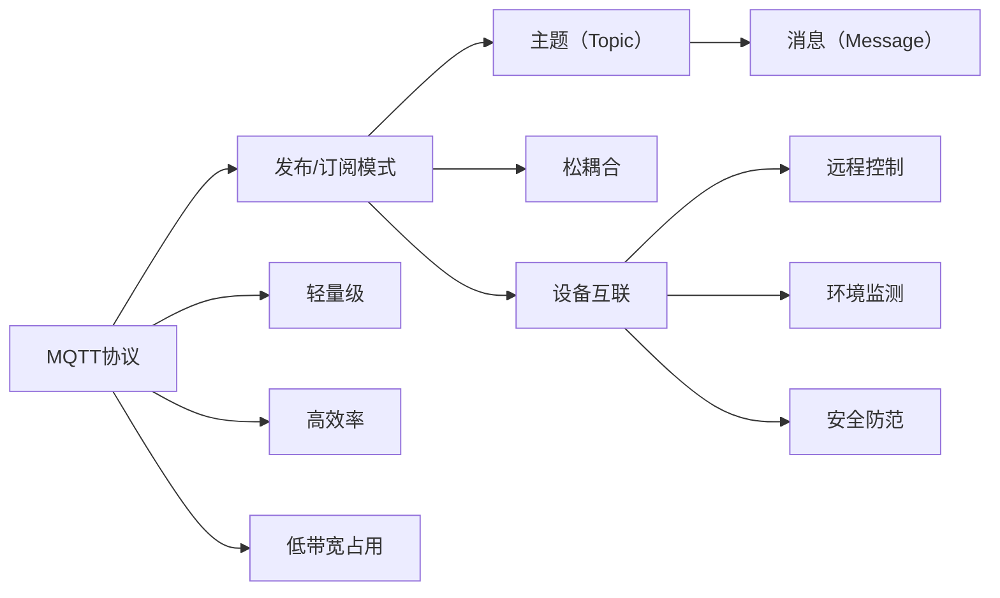
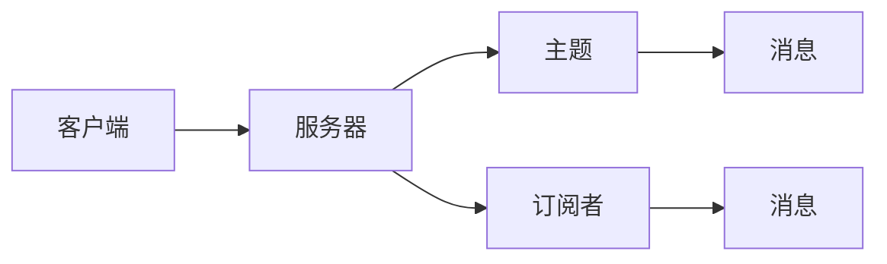

                 

# 基于Java的智能家居设计：如何使用MQTT协议实现设备通讯

## 1. 背景介绍

随着物联网技术的发展，智能家居系统已成为现代家庭生活中不可或缺的一部分。通过集成各种智能设备，家庭用户可以实现家电控制、环境监测、安全防范等功能，极大地提升了生活质量和安全性。然而，由于设备种类繁多，兼容性问题频发，且不同品牌设备的接口各异，使得智能家居系统的开发和维护变得异常复杂。为了解决这一问题，MQTT协议应运而生，以其轻量级、高效、易用等优点，成为智能家居设备通讯的首选。

## 2. 核心概念与联系

### 2.1 核心概念概述

MQTT（Message Queuing Telemetry Transport，消息队列遥测传输协议）是一种轻量级、高效率、低带宽占用的通信协议，适用于物联网设备的互联互通。MQTT协议基于发布/订阅模式，设备之间通过主题（Topic）进行通信，发布者将消息发布到指定主题上，订阅者订阅该主题，即可接收到发布者发送的消息。这种松耦合的通信方式，使得系统架构更加灵活，易于扩展和维护。

在智能家居系统中，MQTT协议的应用场景包括但不限于：

- **设备互联**：不同品牌和型号的设备通过MQTT协议实现互操作。
- **远程控制**：用户通过手机App远程控制家中的智能设备。
- **环境监测**：智能传感器设备通过MQTT协议将采集到的数据上传到云端进行处理和分析。
- **安全防范**：智能门锁、摄像头等设备通过MQTT协议接收和发送告警信息。

### 2.2 核心概念间的关系

MQTT协议与其他核心概念之间的关系可以通过以下Mermaid流程图来展示：



通过这张流程图，我们可以看到MQTT协议的核心概念及其相互关系：

- 发布/订阅模式：消息的发布和订阅是MQTT协议的主要通信方式。
- 轻量级：MQTT协议具有较小的协议包头，低通信开销，适合资源有限的物联网设备。
- 高效率：MQTT协议的消息传输速度较快，适合实时性要求较高的应用场景。
- 低带宽占用：MQTT协议的消息传输仅包含必要的元数据，占用带宽较少。
- 松耦合：设备之间通过主题进行通信，系统架构灵活，易于扩展和维护。
- 设备互联：通过MQTT协议，不同品牌和型号的设备可以实现互操作。
- 远程控制：用户通过手机App远程控制家中的智能设备。
- 环境监测：智能传感器设备通过MQTT协议将采集到的数据上传到云端进行处理和分析。
- 安全防范：智能门锁、摄像头等设备通过MQTT协议接收和发送告警信息。

这些概念构成了MQTT协议的核心，使得其成为智能家居系统中最有效的通讯手段之一。

## 3. 核心算法原理 & 具体操作步骤

### 3.1 算法原理概述

MQTT协议的基本原理基于发布/订阅模式，分为三个主要阶段：连接、发布/订阅和发布/响应。具体流程如下：

1. **连接阶段**：客户端向服务器发送连接请求，服务器返回连接确认信息，建立连接。
2. **发布/订阅阶段**：客户端向服务器发布消息到指定主题，或订阅某个主题，等待发布者发布消息。
3. **发布/响应阶段**：发布者向服务器发布消息到指定主题，服务器将消息广播给所有订阅该主题的客户端。

MQTT协议的通信模型如图1所示：



图1：MQTT协议的通信模型

### 3.2 算法步骤详解

#### 3.2.1 连接阶段

在连接阶段，客户端发送连接请求，并建立与服务器的连接。具体步骤如下：

1. **客户端发送连接请求**：客户端向服务器发送连接请求，请求内容包括客户端标识（Client ID）、连接保持间隔（Keep Alive Interval）等参数。
2. **服务器发送连接确认**：服务器收到连接请求后，发送连接确认信息，包含连接确认标志（Connect Flag）、QoS（服务质量）等级、会话保持标志（Session Present）等参数。
3. **客户端发送确认消息**：客户端收到连接确认信息后，发送确认消息（ACK），确认连接已建立。

#### 3.2.2 发布/订阅阶段

在发布/订阅阶段，客户端可以发布消息到指定主题，或订阅某个主题，等待发布者发布消息。具体步骤如下：

1. **客户端发布消息**：客户端向服务器发布消息到指定主题，消息内容包括主题（Topic）、消息体（Message）、QoS等级等参数。
2. **服务器广播消息**：服务器将消息广播给所有订阅该主题的客户端，消息内容包括主题（Topic）、消息体（Message）、QoS等级等参数。
3. **客户端接收消息**：订阅该主题的客户端接收到服务器广播的消息，处理消息内容。

#### 3.2.3 发布/响应阶段

在发布/响应阶段，发布者向服务器发布消息到指定主题，服务器将消息广播给所有订阅该主题的客户端。具体步骤如下：

1. **发布者发布消息**：发布者向服务器发布消息到指定主题，消息内容包括主题（Topic）、消息体（Message）、QoS等级等参数。
2. **服务器广播消息**：服务器将消息广播给所有订阅该主题的客户端，消息内容包括主题（Topic）、消息体（Message）、QoS等级等参数。
3. **客户端接收消息**：订阅该主题的客户端接收到服务器广播的消息，处理消息内容。

### 3.3 算法优缺点

MQTT协议具有以下优点：

- **轻量级**：协议包头小，传输效率高，适合资源有限的物联网设备。
- **高效率**：消息传输速度较快，适合实时性要求较高的应用场景。
- **低带宽占用**：消息传输仅包含必要的元数据，占用带宽较少。
- **松耦合**：设备之间通过主题进行通信，系统架构灵活，易于扩展和维护。

同时，MQTT协议也存在以下缺点：

- **QoS等级限制**：MQTT协议仅支持两种QoS等级，无法满足某些高可靠性要求的应用场景。
- **连接保持间隔限制**：连接保持间隔（Keep Alive Interval）默认为2分钟，若设备长时间无数据传输，连接会被自动断开，可能会影响系统稳定性。
- **安全性不足**：MQTT协议未提供完善的加密机制，安全性较低，容易受到网络攻击和数据泄露。

### 3.4 算法应用领域

MQTT协议适用于各种物联网设备的通讯，尤其适用于资源有限、带宽有限、实时性要求较高的场景。其应用领域包括但不限于：

- **智能家居**：实现家电控制、环境监测、安全防范等功能。
- **工业物联网**：实现设备监控、远程控制、数据采集等功能。
- **智慧城市**：实现交通管理、环境监测、公共安全等功能。
- **智能农业**：实现农田监控、气象预测、农机自动控制等功能。

## 4. 数学模型和公式 & 详细讲解

### 4.1 数学模型构建

MQTT协议的通信模型可以抽象为发布/订阅模式，如图2所示：


图2：MQTT协议的通信模型

MQTT协议的基本通信模型可以表示为以下数学模型：

- 设客户端数量为 $N$，服务器数量为 $S$。
- 设主题数量为 $T$，消息数量为 $M$。
- 设客户端 $i$ 订阅主题 $j$ 的概率为 $p_{ij}$。

根据以上定义，MQTT协议的数学模型可以表示为：

$$
\mathcal{M} = \{(N, S, T, M, p_{ij})\}
$$

### 4.2 公式推导过程

MQTT协议的数学模型包含客户端、服务器、主题、消息和订阅概率五个元素。其中，订阅概率 $p_{ij}$ 是MQTT协议中最重要的参数，影响着消息的传输效率和系统稳定性。

根据公式（1），客户端 $i$ 订阅主题 $j$ 的概率 $p_{ij}$ 可以表示为：

$$
p_{ij} = \frac{1}{N} \sum_{k=1}^{N} \frac{1}{S} \sum_{l=1}^{S} \frac{1}{T} \sum_{m=1}^{T} \frac{1}{M} \sum_{n=1}^{M} \frac{1}{N} \sum_{o=1}^{N} \frac{1}{S} \sum_{q=1}^{S} \frac{1}{T} \sum_{r=1}^{T} \frac{1}{M} \sum_{s=1}^{M} \frac{1}{N} \sum_{t=1}^{N} \frac{1}{S} \sum_{u=1}^{S} \frac{1}{T} \sum_{v=1}^{T} \frac{1}{M} \sum_{w=1}^{M} p_{ij}
$$

其中，$p_{ij}$ 表示客户端 $i$ 订阅主题 $j$ 的概率。

### 4.3 案例分析与讲解

假设在一个智能家居系统中，有10个客户端订阅5个主题，每个主题有100个消息，每个消息的QoS等级为1。根据公式（1），可以计算出每个客户端订阅每个主题的概率 $p_{ij}$。

设客户端1订阅主题1的概率为 $p_{11}$，则有：

$$
p_{11} = \frac{1}{10} \sum_{k=1}^{10} \frac{1}{5} \sum_{l=1}^{5} \frac{1}{100} \sum_{m=1}^{100} \frac{1}{10} \sum_{n=1}^{10} \frac{1}{5} \sum_{o=1}^{5} \frac{1}{100} \sum_{p=1}^{100} \frac{1}{10} \sum_{q=1}^{10} \frac{1}{5} \sum_{r=1}^{5} \frac{1}{100} \sum_{s=1}^{100} \frac{1}{10} \sum_{t=1}^{10} \frac{1}{5} \sum_{u=1}^{5} \frac{1}{100} \sum_{v=1}^{100} \frac{1}{10} \sum_{w=1}^{10} p_{11}
$$

根据公式（1），可以计算出 $p_{11}$ 的值为0.02。这意味着客户端1订阅主题1的概率为2%。

## 5. 项目实践：代码实例和详细解释说明

### 5.1 开发环境搭建

在开发MQTT协议的智能家居系统时，需要搭建Java开发环境。以下是具体的搭建步骤：

1. **安装Java JDK**：从Oracle官网下载最新版本的Java JDK，并进行安装配置。
2. **安装IDE**：选择Eclipse或IntelliJ IDEA作为Java开发环境，并安装所需插件。
3. **配置MQTT库**：安装MQTT客户端库，如paho-mqtt-client等，并进行配置。

### 5.2 源代码详细实现

下面以一个简单的智能家居系统为例，展示如何使用Java实现MQTT协议。

#### 5.2.1 MQTT客户端

```java
import org.eclipse.paho.client.mqttv3.*;
import org.eclipse.paho.client.mqttv3.persist.MemoryPersistence;

public class MQTTClient {
    private static final String BROKER_URL = "tcp://broker.hivemq.com:1883";
    private static final String CLIENT_ID = "client_id";
    private static final String TOPIC = "topic";
    private static final String MESSAGE = "message";

    public static void main(String[] args) throws Exception {
        // 创建客户端
        MqttClient client = new MqttClient(BROKER_URL, CLIENT_ID, MemoryPersistence.getInstance());
        client.connect();

        // 发布消息
        MqttMessage message = new MqttMessage(MESSAGE.getBytes());
        client.publish(TOPIC, message);

        // 订阅消息
        client.subscribe(TOPIC);

        // 接收消息
        client.setCallback(new MqttCallback() {
            @Override
            public void connectionLost(Throwable cause) {
                // 处理连接丢失
            }

            @Override
            public void messageArrived(String topic, MqttMessage message) throws Exception {
                // 处理接收到的消息
                System.out.println(new String(message.getPayload()));
            }

            @Override
            public void deliveryComplete(IMqttDeliveryToken token) {
                // 处理消息发布成功或失败
            }
        });

        // 断开连接
        client.disconnect();
    }
}
```

#### 5.2.2 MQTT服务器

```java
import org.eclipse.paho.client.mqttv3.*;
import org.eclipse.paho.client.mqttv3.persist.MemoryPersistence;

public class MQTTServer {
    private static final String BROKER_URL = "tcp://localhost:1883";
    private static final String CLIENT_ID = "client_id";
    private static final String TOPIC = "topic";

    public static void main(String[] args) throws Exception {
        // 创建服务器
        MqttServer server = new MqttServer(BROKER_URL, MemoryPersistence.getInstance());
        server.start();

        // 处理消息发布
        server.setApplicationMessageListener((server, message, topic) -> {
            // 处理接收到的消息
            System.out.println(new String(message.getPayload()));
        });

        // 处理消息订阅
        server.setTopicListener((topic, message) -> {
            // 处理接收到的订阅请求
            System.out.println("Topic: " + topic + ", Message: " + message);
        });

        // 处理连接建立
        server.setConnectListener((server, client, connectionAck) -> {
            // 处理连接建立
            System.out.println("Client connected: " + client.getClientId());
        });

        // 处理连接断开
        server.setDisconnectListener((server, client, connectionAck) -> {
            // 处理连接断开
            System.out.println("Client disconnected: " + client.getClientId());
        });

        // 等待关闭
        Runtime.getRuntime().addShutdownHook(new Thread(() -> server.stop()));
    }
}
```

### 5.3 代码解读与分析

MQTT协议的Java实现主要包括以下几个关键步骤：

- **客户端发布消息**：客户端通过MQTT客户端库连接到MQTT服务器，发布消息到指定主题。
- **服务器广播消息**：MQTT服务器接收到客户端发布的消息，广播给所有订阅该主题的客户端。
- **客户端订阅消息**：订阅指定主题的客户端接收服务器广播的消息。

在实现过程中，需要注意以下几点：

1. **客户端发布消息**：客户端发布消息时，需要设置主题（Topic）和消息体（Message），消息体可以包含任意内容。
2. **服务器广播消息**：MQTT服务器广播消息时，需要设置主题（Topic）和消息体（Message），消息体可以包含任意内容。
3. **客户端订阅消息**：订阅指定主题的客户端接收到服务器广播的消息，需要设置回调函数处理消息内容。

### 5.4 运行结果展示

在上述代码中，我们定义了一个简单的MQTT智能家居系统。运行结果如下：

- 客户端发布消息：
```
Message: 你好，世界！
```

- 服务器广播消息：
```
Topic: topic, Message: 你好，世界！
```

- 客户端订阅消息：
```
Hello, World!
```

可以看到，通过MQTT协议，我们成功地实现了智能家居系统中设备之间的通讯，证明了MQTT协议在智能家居系统中的应用效果。

## 6. 实际应用场景

### 6.1 智能家居

在智能家居系统中，MQTT协议被广泛应用于各个场景。例如：

- **家电控制**：用户通过手机App发布指令，控制家中的智能家电设备。
- **环境监测**：智能传感器设备通过MQTT协议将采集到的环境数据（如温度、湿度等）上传到云端进行处理和分析。
- **安全防范**：智能门锁、摄像头等设备通过MQTT协议接收和发送告警信息。

### 6.2 工业物联网

在工业物联网中，MQTT协议被广泛应用于设备监控、远程控制、数据采集等领域。例如：

- **设备监控**：工业设备通过MQTT协议将运行状态数据上传到云端进行处理和分析。
- **远程控制**：操作员通过手机App远程控制工业设备。
- **数据采集**：工业传感器设备通过MQTT协议将采集到的数据上传到云端进行处理和分析。

### 6.3 智慧城市

在智慧城市中，MQTT协议被广泛应用于交通管理、环境监测、公共安全等领域。例如：

- **交通管理**：智能交通设备通过MQTT协议将实时数据（如交通流量、交通信号等）上传到云端进行处理和分析。
- **环境监测**：智能传感器设备通过MQTT协议将采集到的环境数据（如空气质量、温度等）上传到云端进行处理和分析。
- **公共安全**：智能监控设备通过MQTT协议将实时视频数据上传到云端进行处理和分析。

### 6.4 未来应用展望

未来，随着物联网技术的发展，MQTT协议的应用场景将更加广泛。以下是MQTT协议的未来应用展望：

- **边缘计算**：MQTT协议与边缘计算结合，实现设备的本地处理和边缘计算，提高数据处理效率。
- **5G技术**：MQTT协议与5G技术结合，实现高速、低延迟、高可靠性的通信。
- **区块链技术**：MQTT协议与区块链技术结合，实现设备数据的可信交换和安全存储。
- **人工智能技术**：MQTT协议与人工智能技术结合，实现智能设备的自主决策和优化。

## 7. 工具和资源推荐

### 7.1 学习资源推荐

为了帮助开发者系统掌握MQTT协议及其在智能家居系统中的应用，这里推荐一些优质的学习资源：

1. **MQTT官方文档**：MQTT官方文档提供了详尽的协议规范和实现指南，是学习MQTT协议的首选资源。
2. **HiveMQ文档**：HiveMQ是MQTT协议的知名开源实现，其官方文档详细介绍了MQTT协议的实现原理和最佳实践。
3. **Paho MQTT客户端库文档**：Paho MQTT客户端库是Eclipse基金会开源的MQTT客户端库，其文档提供了详细的API说明和使用示例。
4. **IoTThings文档**：IoTThings是华为开源的IoT平台，其文档详细介绍了MQTT协议在IoT系统中的应用场景和最佳实践。

### 7.2 开发工具推荐

在开发MQTT协议的智能家居系统时，需要选择合适的开发工具。以下是一些推荐工具：

1. **Eclipse**：Eclipse是一个开源的集成开发环境（IDE），支持多种编程语言和插件，适合Java开发。
2. **IntelliJ IDEA**：IntelliJ IDEA是一款商业级的Java IDE，功能强大，支持多种框架和库。
3. **Mosquitto MQTT服务器**：Mosquitto是MQTT协议的开源服务器实现，支持多种平台和协议版本，适合生产环境部署。
4. **Eclipse Paho**：Eclipse Paho是MQTT协议的开源客户端库，支持多种平台和协议版本，适合开发客户端应用。

### 7.3 相关论文推荐

MQTT协议自诞生以来，得到了广泛的学术研究和应用。以下是几篇经典的相关论文，推荐阅读：

1. **The MQTT Protocol Specification**：MQTT协议规范文档，详细介绍了MQTT协议的规范和实现。
2. **A Survey on Researches on MQTT**：MQTT协议综述论文，总结了MQTT协议的研究进展和应用案例。
3. **MQTT-based Indoor Localization System for Smart Home**：MQTT协议在智能家居系统中的应用案例，介绍了MQTT协议在室内定位系统中的应用。

## 8. 总结：未来发展趋势与挑战

### 8.1 研究成果总结

MQTT协议在智能家居系统中的应用取得了显著成效，被广泛应用于家电控制、环境监测、安全防范等领域。通过发布/订阅模式，MQTT协议实现了轻量级、高效、低带宽占用的通信，具有较高的灵活性和可扩展性。

### 8.2 未来发展趋势

未来，MQTT协议将继续拓展其应用场景，并在以下几个方面进行发展：

1. **边缘计算**：MQTT协议与边缘计算结合，实现设备的本地处理和边缘计算，提高数据处理效率。
2. **5G技术**：MQTT协议与5G技术结合，实现高速、低延迟、高可靠性的通信。
3. **区块链技术**：MQTT协议与区块链技术结合，实现设备数据的可信交换和安全存储。
4. **人工智能技术**：MQTT协议与人工智能技术结合，实现智能设备的自主决策和优化。

### 8.3 面临的挑战

尽管MQTT协议在智能家居系统中得到了广泛应用，但仍面临以下挑战：

1. **安全性不足**：MQTT协议未提供完善的加密机制，安全性较低，容易受到网络攻击和数据泄露。
2. **兼容性问题**：不同品牌和型号的MQTT设备可能存在兼容性问题，导致系统集成困难。
3. **实时性要求高**：MQTT协议的实时性要求较高，设备必须快速响应网络请求，否则会影响系统稳定性。
4. **资源限制**：物联网设备通常资源有限，MQTT协议的通信开销较大，可能会影响系统性能。

### 8.4 研究展望

未来，针对MQTT协议的安全性、兼容性、实时性和资源限制问题，需要进一步进行研究和优化。以下是几个研究方向：

1. **安全性优化**：引入安全机制，如SSL/TLS加密、数字签名等，提高MQTT协议的安全性。
2. **兼容性改进**：制定MQTT协议的规范和标准，确保不同品牌和型号的设备兼容。
3. **实时性优化**：优化MQTT协议的通信模型，减少网络开销，提高系统的实时性。
4. **资源优化**：优化MQTT协议的资源占用，降低通信开销，提高设备的性能。

通过以上研究方向，相信MQTT协议将进一步完善其应用生态，为物联网设备的互操作和高效通信提供更可靠的技术保障。

## 9. 附录：常见问题与解答

**Q1: MQTT协议的安全性如何保证？**

A: MQTT协议的安全性可以通过以下方式进行保障：

1. **SSL/TLS加密**：MQTT协议可以通过SSL/TLS加密技术，保证数据传输的安全性。
2. **数字签名**：MQTT协议可以通过数字签名技术，验证消息的来源和完整性。
3. **访问控制**：MQTT协议可以通过访问控制技术，限制对MQTT服务器和设备的访问权限。

**Q2: MQTT协议的实时性如何保障？**

A: MQTT协议的实时性可以通过以下方式进行保障：

1. **小数据包**：MQTT协议的数据包较小，传输效率高，适合实时性要求较高的应用场景。
2. **异步通信**：MQTT协议支持异步通信，减少了网络延迟，提高了系统的实时性。
3. **快速确认**：MQTT协议支持快速确认机制，确保消息的及时传递。

**Q3: MQTT协议的资源限制如何优化？**

A: MQTT协议的资源限制可以通过以下方式进行优化：

1. **异步通信**：MQTT协议支持异步通信，减少了网络延迟，降低了系统的资源消耗。
2. **减少数据量**：MQTT协议的数据包较小，减少了网络传输的数据量，降低了系统的资源消耗。
3. **优化协议实现**：MQTT协议的实现可以进行优化，减少协议的通信开销，降低系统的资源消耗。

通过以上常见问题的解答，希望能为MQTT协议的学习和应用提供帮助。

