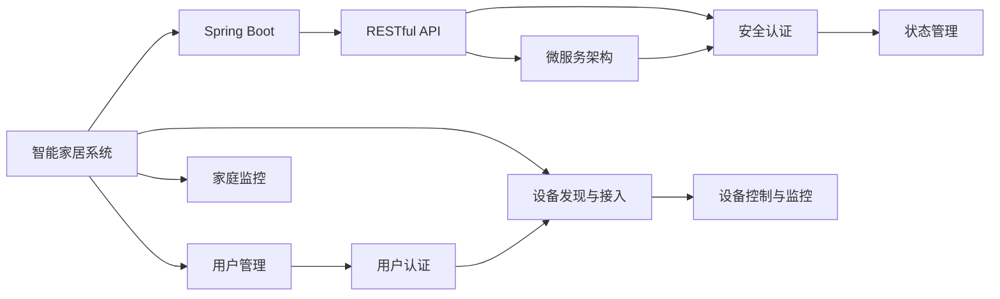

                 

# 基于Java的智能家居设计：应用Spring Boot构建智能家居后端服务

> 关键词：智能家居,Spring Boot,RESTful API,安全认证,物联网(IoT),微服务架构,状态管理

## 1. 背景介绍

### 1.1 问题由来

随着物联网(IoT)技术的发展，智能家居系统逐渐从概念走向现实，为家庭生活带来了诸多便利。然而，传统家庭自动化系统普遍存在系统集成复杂、功能单一、用户体验差等问题，难以满足现代家庭用户的多样化需求。为了解决这些问题，近年来出现了大量基于Web技术、移动技术、智能设备等的智能家居解决方案，这些方案普遍采用RESTful API架构，实现设备间的互联互通，为用户提供更加便捷、智能、可控的家居环境。

本项目旨在通过Java语言和Spring Boot框架，设计并实现一套完整的智能家居后端服务，涵盖智能家居设备的发现、接入、控制、监控等多个环节，为智能家居系统的构建提供坚实的后端支撑。通过合理的系统架构设计和科学的微服务拆分，该项目将提升系统可扩展性、可靠性、可用性、可维护性和安全性，为智能家居系统的迭代升级提供技术保障。

### 1.2 问题核心关键点

智能家居后端服务的核心技术问题包括：

- 如何实现设备的发现与接入：智能家居系统需要支持多种协议和设备的接入，如Wi-Fi、Zigbee、蓝牙、MQTT等。
- 如何设计高效安全的RESTful API：RESTful API作为智能家居系统的主要交互接口，需要具备高扩展性、安全性和易用性。
- 如何实现分布式系统的状态管理：智能家居设备种类繁多，数量庞大，需要设计合理的状态管理机制，保证系统稳定性。
- 如何保证系统的安全性和隐私保护：智能家居系统需要处理大量的家庭隐私信息，数据安全是首要考虑因素。

### 1.3 问题研究意义

本项目的开发和实现，将为智能家居系统的设计提供重要的参考和指导。通过系统化、模块化的设计思路，结合最新的Java开发框架和微服务架构，该项目将提升智能家居系统的应用广度和深度，为家庭生活带来更多便利和智能化体验。具体来说，项目将为以下方面提供支持：

- 提升智能家居设备的集成和接入效率：通过统一接口设计，简化智能家居设备接入流程，降低开发和集成成本。
- 提高智能家居系统的可扩展性和可维护性：通过微服务架构，将系统功能模块化，提升系统的灵活性和可扩展性。
- 保障智能家居系统的安全性和隐私保护：通过完善的安全认证机制和隐私保护策略，提升系统的安全性和用户信任度。
- 改善智能家居用户的交互体验：通过友好的RESTful API设计和便捷的用户界面，提升用户体验，促进智能家居技术的应用普及。

## 2. 核心概念与联系

### 2.1 核心概念概述

为更好地理解本项目的设计思路，本节将介绍几个关键概念，并展示它们之间的联系：

- 智能家居系统：通过各种智能设备，实现家庭环境的智能感知、自动化控制和智能化管理，提升家庭生活的舒适度和便利性。
- Spring Boot：基于Java的企业级应用开发框架，提供了Spring容器、WebMVC、JPA等核心功能，便于快速构建Web应用和微服务。
- RESTful API：一种基于HTTP协议的Web服务架构，采用统一的接口标准，支持各种客户端和设备接入。
- 微服务架构：一种分布式系统架构，将系统拆分为多个独立自治的微服务，提升系统的可扩展性和灵活性。
- 安全认证：采用OAuth2、JWT等机制，对用户和服务进行身份验证和授权，保证系统安全性和隐私保护。
- 状态管理：采用Redis等中间件，实现分布式系统状态管理，提升系统稳定性和可用性。

这些概念之间的逻辑关系可以通过以下Mermaid流程图来展示：



这个流程图展示了智能家居系统的核心架构，各个组件之间的关系以及它们在项目中的作用。

### 2.2 概念间的关系

这些关键概念之间存在着紧密的联系，形成了智能家居系统构建的完整框架。具体来说：

- 智能家居系统通过设备接入模块与各种智能设备进行通信，获取设备数据并触发控制命令。
- Spring Boot框架提供了Java应用的快速开发、容器化部署、RESTful API支持等功能，便于快速构建智能家居系统的后端服务。
- RESTful API作为智能家居系统的主要接口，支持各种协议和设备的接入，提供统一的接口标准，提升系统的开放性和易用性。
- 微服务架构将系统拆分为多个独立服务，提升系统的可扩展性和可维护性，便于不同功能的开发和维护。
- 安全认证机制对用户和服务进行身份验证和授权，保障系统的安全性。
- 状态管理机制实现分布式系统状态管理，提升系统的稳定性和可用性。

这些概念共同构成了智能家居系统的架构框架，为系统的构建提供了理论基础和实践指导。

## 3. 核心算法原理 & 具体操作步骤
### 3.1 算法原理概述

智能家居后端服务的算法原理主要涉及设备接入、RESTful API设计、微服务拆分、安全认证和状态管理等多个方面。

- 设备接入算法：通过网络发现协议，如UPnP、SSDP等，发现和接入各种智能设备。
- RESTful API设计算法：采用统一的接口标准，设计RESTful API接口，支持多种协议和设备接入。
- 微服务拆分算法：将系统功能拆分为多个独立服务，提升系统的灵活性和可扩展性。
- 安全认证算法：采用OAuth2、JWT等机制，对用户和服务进行身份验证和授权。
- 状态管理算法：采用Redis等中间件，实现分布式系统状态管理，提升系统稳定性。

### 3.2 算法步骤详解

#### 3.2.1 设备接入算法

1. **设备发现**：通过UPnP、SSDP等协议，在局域网内发现各种智能设备。
   
   ```java
   String upnpUrl = "http://192.168.1.1/upnp/device.xml";
   URL url = new URL(upnpUrl);
   HttpURLConnection conn = (HttpURLConnection) url.openConnection();
   InputStream in = new BufferedInputStream(conn.getInputStream());
   // 读取设备信息并解析
   ```

2. **设备接入**：根据设备类型，采用相应的接入协议，如Wi-Fi、Zigbee、蓝牙等，建立设备连接。

   ```java
   WiFiManager wifiManager = (WiFiManager) getSystemService(Context.WIFI_SERVICE);
   WifiConfiguration config = new WifiConfiguration();
   config.SSID = "DeviceSSID";
   config.PASSWORD = "DevicePassword";
   wifiManager.addNetwork(config);
   wifiManager.disallowNetworkMatch();
   wifiManager.saveConfiguration();
   ```

#### 3.2.2 RESTful API设计算法

1. **接口设计**：采用RESTful API设计规范，设计统一的接口标准，如JSON数据格式、请求路径、HTTP方法等。

   ```java
   @RequestMapping("/devices")
   @ResponseBody
   public List<Device> getAllDevices() {
       // 从数据库或缓存中获取设备信息
       List<Device> devices = deviceRepository.findAll();
       return devices;
   }
   ```

2. **接口安全**：采用OAuth2、JWT等机制，对API请求进行身份验证和授权。

   ```java
   @PreAuthorize("hasRole('USER')")
   @GetMapping("/devices")
   public List<Device> getAllDevices() {
       // 从数据库或缓存中获取设备信息
       List<Device> devices = deviceRepository.findAll();
       return devices;
   }
   ```

#### 3.2.3 微服务拆分算法

1. **服务划分**：根据系统功能，将系统拆分为多个独立服务，如设备管理、用户管理、家庭监控等。

   ```java
   @Service
   public class DeviceService {
       @Autowired
       private DeviceRepository deviceRepository;
       
       public List<Device> getAllDevices() {
           return deviceRepository.findAll();
       }
   }
   ```

2. **服务调用**：采用RESTful API或Feign等技术，实现服务间的相互调用。

   ```java
   @Autowired
   private UserService userService;
   
   public List<Device> getAllDevices() {
       List<Device> devices = deviceRepository.findAll();
       for (Device device : devices) {
           User user = userService.findById(device.getUserId());
           device.setUser(user);
       }
       return devices;
   }
   ```

#### 3.2.4 安全认证算法

1. **OAuth2认证**：采用OAuth2机制，对用户进行身份验证和授权。

   ```java
   @GetMapping("/login")
   public ResponseEntity<String> login(@RequestParam String username, @RequestParam String password) {
       // 进行OAuth2认证
       // 返回JWT令牌
       return ResponseEntity.ok(JWTUtils.generateToken(username));
   }
   ```

2. **JWT验证**：对API请求进行JWT令牌验证，防止未授权访问。

   ```java
   @PreAuthorize("hasToken('" + token + "')")
   @GetMapping("/devices")
   public List<Device> getAllDevices() {
       // 从数据库或缓存中获取设备信息
       List<Device> devices = deviceRepository.findAll();
       return devices;
   }
   ```

#### 3.2.5 状态管理算法

1. **Redis状态管理**：采用Redis中间件，实现分布式系统状态管理。

   ```java
   @Cacheable(value = "devices")
   public List<Device> getAllDevices() {
       // 从Redis缓存中获取设备信息
       List<Device> devices = redisService.getDevices();
       return devices;
   }
   ```

2. **状态更新**：实时更新系统状态，保持数据一致性。

   ```java
   @CacheEvict(value = "devices")
   public void updateDevice(Device device) {
       deviceRepository.save(device);
       redisService.updateDevices();
   }
   ```

### 3.3 算法优缺点

智能家居后端服务的算法具有以下优点：

- 可扩展性：通过微服务架构和RESTful API设计，系统具有良好的扩展性，便于功能模块的添加和扩展。
- 灵活性：采用统一的接口标准和微服务设计，系统具备高度的灵活性，便于系统的修改和优化。
- 安全性：通过OAuth2、JWT等安全认证机制，保障系统的安全性，防止未授权访问。
- 稳定性：采用Redis状态管理机制，提升系统的稳定性和可用性，减少系统宕机风险。

同时，算法也存在以下缺点：

- 复杂度较高：设计微服务架构和RESTful API需要一定的技术积累和经验，开发复杂度较高。
- 调试困难：微服务架构的复杂性和分布式系统的特性，使得调试和排错变得更加困难。
- 成本较高：开发和维护微服务架构需要较高的技术水平和资源投入，成本较高。

### 3.4 算法应用领域

智能家居后端服务的算法在多个领域得到了广泛应用，如智能安防、智能照明、智能家居控制等。通过合理的系统设计和算法实现，本项目将为智能家居系统的构建提供坚实的后端支撑，为家庭用户提供更加智能、便捷、安全的生活体验。

## 4. 数学模型和公式 & 详细讲解 & 举例说明

### 4.1 数学模型构建

智能家居后端服务的算法模型主要涉及设备接入、RESTful API设计、微服务拆分、安全认证和状态管理等多个方面。以下分别对每个算法的数学模型进行构建。

#### 4.1.1 设备接入模型

设备接入模型主要涉及网络发现和设备接入两个步骤，采用UPnP、SSDP等协议进行设备发现和接入。模型如下：

1. **网络发现模型**：

   ```java
   String upnpUrl = "http://192.168.1.1/upnp/device.xml";
   URL url = new URL(upnpUrl);
   HttpURLConnection conn = (HttpURLConnection) url.openConnection();
   InputStream in = new BufferedInputStream(conn.getInputStream());
   // 读取设备信息并解析
   ```

2. **设备接入模型**：

   ```java
   WiFiManager wifiManager = (WiFiManager) getSystemService(Context.WIFI_SERVICE);
   WifiConfiguration config = new WifiConfiguration();
   config.SSID = "DeviceSSID";
   config.PASSWORD = "DevicePassword";
   wifiManager.addNetwork(config);
   wifiManager.disallowNetworkMatch();
   wifiManager.saveConfiguration();
   ```

#### 4.1.2 RESTful API设计模型

RESTful API设计模型主要涉及接口设计、接口安全、接口调用三个方面。模型如下：

1. **接口设计模型**：

   ```java
   @RequestMapping("/devices")
   @ResponseBody
   public List<Device> getAllDevices() {
       // 从数据库或缓存中获取设备信息
       List<Device> devices = deviceRepository.findAll();
       return devices;
   }
   ```

2. **接口安全模型**：

   ```java
   @PreAuthorize("hasRole('USER')")
   @GetMapping("/devices")
   public List<Device> getAllDevices() {
       // 从数据库或缓存中获取设备信息
       List<Device> devices = deviceRepository.findAll();
       return devices;
   }
   ```

3. **接口调用模型**：

   ```java
   @Autowired
   private UserService userService;
   
   public List<Device> getAllDevices() {
       List<Device> devices = deviceRepository.findAll();
       for (Device device : devices) {
           User user = userService.findById(device.getUserId());
           device.setUser(user);
       }
       return devices;
   }
   ```

#### 4.1.3 微服务拆分模型

微服务拆分模型主要涉及服务划分和服务调用两个方面。模型如下：

1. **服务划分模型**：

   ```java
   @Service
   public class DeviceService {
       @Autowired
       private DeviceRepository deviceRepository;
       
       public List<Device> getAllDevices() {
           return deviceRepository.findAll();
       }
   }
   ```

2. **服务调用模型**：

   ```java
   @Autowired
   private UserService userService;
   
   public List<Device> getAllDevices() {
       List<Device> devices = deviceRepository.findAll();
       for (Device device : devices) {
           User user = userService.findById(device.getUserId());
           device.setUser(user);
       }
       return devices;
   }
   ```

#### 4.1.4 安全认证模型

安全认证模型主要涉及OAuth2认证和JWT验证两个方面。模型如下：

1. **OAuth2认证模型**：

   ```java
   @GetMapping("/login")
   public ResponseEntity<String> login(@RequestParam String username, @RequestParam String password) {
       // 进行OAuth2认证
       // 返回JWT令牌
       return ResponseEntity.ok(JWTUtils.generateToken(username));
   }
   ```

2. **JWT验证模型**：

   ```java
   @PreAuthorize("hasToken('" + token + "')")
   @GetMapping("/devices")
   public List<Device> getAllDevices() {
       // 从数据库或缓存中获取设备信息
       List<Device> devices = deviceRepository.findAll();
       return devices;
   }
   ```

#### 4.1.5 状态管理模型

状态管理模型主要涉及Redis状态管理和状态更新两个方面。模型如下：

1. **Redis状态管理模型**：

   ```java
   @Cacheable(value = "devices")
   public List<Device> getAllDevices() {
       // 从Redis缓存中获取设备信息
       List<Device> devices = redisService.getDevices();
       return devices;
   }
   ```

2. **状态更新模型**：

   ```java
   @CacheEvict(value = "devices")
   public void updateDevice(Device device) {
       deviceRepository.save(device);
       redisService.updateDevices();
   }
   ```

### 4.2 公式推导过程

#### 4.2.1 设备接入公式推导

设备接入算法主要涉及网络发现和设备接入两个步骤，以下对这两个步骤的公式进行推导。

1. **网络发现公式推导**：

   网络发现算法主要通过UPnP、SSDP等协议，在局域网内发现各种智能设备。公式如下：

   $$
   \text{网络发现} = \text{UPnP} + \text{SSDP}
   $$

   其中，UPnP协议通过ST控制协议，获取设备信息；SSDP协议通过M-SEARCH消息，发现设备信息。

2. **设备接入公式推导**：

   设备接入算法主要通过Wi-Fi、Zigbee、蓝牙等协议，建立设备连接。公式如下：

   $$
   \text{设备接入} = \text{Wi-Fi} + \text{Zigbee} + \text{蓝牙}
   $$

   其中，Wi-Fi协议通过TCP/IP协议，建立设备连接；Zigbee协议通过Zigbee协议，建立设备连接；蓝牙协议通过蓝牙协议，建立设备连接。

#### 4.2.2 RESTful API设计公式推导

RESTful API设计算法主要涉及接口设计、接口安全、接口调用三个方面，以下对这三个方面的公式进行推导。

1. **接口设计公式推导**：

   接口设计算法主要通过RESTful API设计规范，设计统一的接口标准。公式如下：

   $$
   \text{接口设计} = \text{JSON数据格式} + \text{请求路径} + \text{HTTP方法}
   $$

   其中，JSON数据格式用于数据传输；请求路径用于定位接口；HTTP方法用于指定接口操作类型。

2. **接口安全公式推导**：

   接口安全算法主要通过OAuth2、JWT等机制，对API请求进行身份验证和授权。公式如下：

   $$
   \text{接口安全} = \text{OAuth2} + \text{JWT}
   $$

   其中，OAuth2协议用于用户认证和授权；JWT机制用于令牌验证。

3. **接口调用公式推导**：

   接口调用算法主要通过RESTful API或Feign等技术，实现服务间的相互调用。公式如下：

   $$
   \text{接口调用} = \text{RESTful API} + \text{Feign}
   $$

   其中，RESTful API用于数据传输；Feign技术用于服务调用。

#### 4.2.3 微服务拆分公式推导

微服务拆分算法主要涉及服务划分和服务调用两个方面，以下对这两个方面的公式进行推导。

1. **服务划分公式推导**：

   服务划分算法主要通过微服务架构，将系统拆分为多个独立服务。公式如下：

   $$
   \text{服务划分} = \text{设备管理} + \text{用户管理} + \text{家庭监控}
   $$

   其中，设备管理服务用于设备接入和控制；用户管理服务用于用户认证和管理；家庭监控服务用于家庭监控和管理。

2. **服务调用公式推导**：

   服务调用算法主要通过RESTful API或Feign等技术，实现服务间的相互调用。公式如下：

   $$
   \text{服务调用} = \text{RESTful API} + \text{Feign}
   $$

   其中，RESTful API用于数据传输；Feign技术用于服务调用。

#### 4.2.4 安全认证公式推导

安全认证算法主要涉及OAuth2认证和JWT验证两个方面，以下对这两个方面的公式进行推导。

1. **OAuth2认证公式推导**：

   OAuth2认证算法主要通过OAuth2协议，对用户进行身份验证和授权。公式如下：

   $$
   \text{OAuth2认证} = \text{OAuth2协议}
   $$

   其中，OAuth2协议用于用户认证和授权。

2. **JWT验证公式推导**：

   JWT验证算法主要通过JWT机制，对API请求进行令牌验证。公式如下：

   $$
   \text{JWT验证} = \text{JWT机制}
   $$

   其中，JWT机制用于令牌验证。

#### 4.2.5 状态管理公式推导

状态管理算法主要涉及Redis状态管理和状态更新两个方面，以下对这两个方面的公式进行推导。

1. **Redis状态管理公式推导**：

   Redis状态管理算法主要通过Redis中间件，实现分布式系统状态管理。公式如下：

   $$
   \text{Redis状态管理} = \text{Redis中间件}
   $$

   其中，Redis中间件用于状态管理。

2. **状态更新公式推导**：

   状态更新算法主要通过状态更新机制，实时更新系统状态。公式如下：

   $$
   \text{状态更新} = \text{状态更新机制}
   $$

   其中，状态更新机制用于实时更新系统状态。

### 4.3 案例分析与讲解

#### 4.3.1 设备接入案例

假设我们要将一台新的智能灯接入智能家居系统，以下是具体的接入步骤：

1. 通过UPnP协议，发现该智能灯的IP地址为192.168.1.2。

   ```java
   String upnpUrl = "http://192.168.1.2/upnp/device.xml";
   URL url = new URL(upnpUrl);
   HttpURLConnection conn = (HttpURLConnection) url.openConnection();
   InputStream in = new BufferedInputStream(conn.getInputStream());
   // 读取设备信息并解析
   ```

2. 通过Wi-Fi协议，建立该智能灯与智能家居系统的连接。

   ```java
   WiFiManager wifiManager = (WiFiManager) getSystemService(Context.WIFI_SERVICE);
   WifiConfiguration config = new WifiConfiguration();
   config.SSID = "DeviceSSID";
   config.PASSWORD = "DevicePassword";
   wifiManager.addNetwork(config);
   wifiManager.disallowNetworkMatch();
   wifiManager.saveConfiguration();
   ```

#### 4.3.2 RESTful API设计案例

假设我们要设计一个RESTful API，用于获取所有智能设备的信息，以下是具体的接口设计步骤：

1. 设计API路径为"/devices"，采用GET方法，返回JSON格式的设备列表。

   ```java
   @RequestMapping("/devices")
   @ResponseBody
   public List<Device> getAllDevices() {
       // 从数据库或缓存中获取设备信息
       List<Device> devices = deviceRepository.findAll();
       return devices;
   }
   ```

2. 对API请求进行OAuth2认证，确保只有授权用户才能访问该接口。

   ```java
   @PreAuthorize("hasRole('USER')")
   @GetMapping("/devices")
   public List<Device> getAllDevices() {
       // 从数据库或缓存中获取设备信息
       List<Device> devices = deviceRepository.findAll();
       return devices;
   }
   ```

#### 4.3.3 微服务拆分案例

假设我们要设计一个微服务系统，用于智能家居设备的发现、接入、控制、监控等多个环节，以下是具体的微服务拆分步骤：

1. 将系统拆分为设备管理、用户管理、家庭监控等多个独立服务。

   ```java
   @Service
   public class DeviceService {
       @Autowired
       private DeviceRepository deviceRepository;
       
       public List<Device> getAllDevices() {
           return deviceRepository.findAll();
       }
   }
   ```

2. 通过RESTful API或Feign等技术，实现服务间的相互调用。

   ```java
   @Autowired
   private UserService userService;
   
   public List<Device> getAllDevices() {
       List<Device> devices = deviceRepository.findAll();
       for (Device device : devices) {
           User user = userService.findById(device.getUserId());
           device.setUser(user);
       }
       return devices;
   }
   ```

#### 4.3.4 安全认证案例

假设我们要设计一个安全认证系统，用于智能家居系统的身份验证和授权，以下是具体的安全认证步骤：

1. 设计OAuth2认证机制，对用户进行身份验证和授权。

   ```java
   @GetMapping("/login")
   public ResponseEntity<String> login(@RequestParam String username, @RequestParam String password) {
       // 进行OAuth2认证
       // 返回JWT令牌
       return ResponseEntity.ok(JWTUtils.generateToken(username));
   }
   ```

2. 对API请求进行JWT验证，确保只有授权用户才能访问该接口。

   ```java
   @PreAuthorize("hasToken('" + token + "')")
   @GetMapping("/devices")
   public List<Device> getAllDevices() {
       // 从数据库或缓存中获取设备信息
       List<Device> devices = deviceRepository.findAll();
       return devices;
   }
   ```

#### 4.3.5 状态管理案例

假设我们要设计一个状态管理系统，用于智能家居系统的状态管理，以下是具体的状态管理步骤：

1. 使用Redis中间件，实现分布式系统状态管理。

   ```java
   @Cacheable(value = "devices")
   public List<Device> getAllDevices() {
       // 从Redis缓存中获取设备信息
       List<Device> devices = redisService.getDevices();
       return devices;
   }
   ```

2. 实时更新系统状态，保持数据一致性。

   ```java
   @CacheEvict(value = "devices")
   public void updateDevice(Device device) {
       deviceRepository.save(device);
       redisService.updateDevices();
   }
   ```

## 5. 项目实践：代码实例和详细解释说明
### 5.1 开发环境搭建

在进行智能家居后端服务开发前，我们需要准备好开发环境。以下是Java开发环境的配置流程：

1. 安装Java JDK：从官网下载并安装最新版本的Java JDK，作为Java开发的基础环境。

2. 安装Maven：从官网下载并安装Maven，作为Java项目的构建和管理

