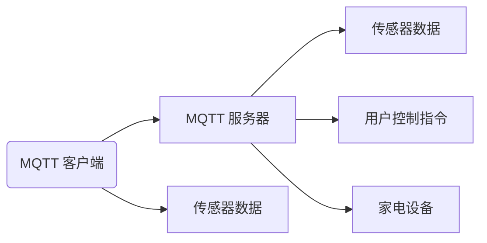

                 

# 基于MQTT协议和RESTful API的家庭环境自动控制系统

在智能家居领域，一个高效、稳定、可靠的家庭环境自动控制系统是提升用户生活体验的关键。本文将深入探讨基于MQTT协议和RESTful API的家庭环境自动控制系统的设计、实现和应用。

## 1. 背景介绍

### 1.1 问题由来
随着物联网技术的迅猛发展，智能家居产品种类日益丰富，用户对于家庭环境自动控制系统的需求也越来越高。当前，基于Web API的传统家庭自动化系统虽然易于搭建和维护，但其性能和实时性有待提升。而基于MQTT协议的系统，则可以提供更高的性能和更灵活的控制方式。

### 1.2 问题核心关键点
本文的核心目标是设计并实现一个基于MQTT协议和RESTful API的家庭环境自动控制系统，满足用户对于智能家居系统的性能、实时性和可扩展性的要求。系统的主要功能包括：
- 实时采集传感器数据
- 接收用户控制指令
- 自动控制家电设备
- 记录和分析用户行为数据

### 1.3 问题研究意义
家庭环境自动控制系统的成功设计和实现，对于提升用户的生活质量和便利性具有重要意义。通过本系统的设计和实现，可以实现以下目标：
- 优化家庭环境控制方式，提升用户体验
- 提高家电设备的利用效率，降低能源消耗
- 实现远程控制，增强家庭安全性
- 优化家庭环境，提升生活质量

## 2. 核心概念与联系

### 2.1 核心概念概述

为了更好地理解基于MQTT协议和RESTful API的家庭环境自动控制系统，我们需要掌握以下几个核心概念：

- MQTT（Message Queuing Telemetry Transport）协议：一种轻量级的、基于发布/订阅模式的通信协议，适用于物联网设备的通信。MQTT协议通过减少数据量来降低网络负载，适用于资源受限的设备。
- RESTful API：基于Web API的架构风格，采用HTTP协议进行通信，具有简单、灵活、易于扩展等优点。RESTful API支持多种数据格式，如JSON、XML等。
- IoT设备：物联网设备，如智能插座、温湿度传感器、智能灯光等，可以通过MQTT协议接入到家庭环境自动控制系统中。
- 传感器数据：温度、湿度、光照、烟雾等传感器采集的实时数据。
- 用户控制指令：用户通过手机App、Web浏览器等终端设备发送的控制指令。
- 家电设备：空调、风扇、灯光等家电设备，可以通过MQTT协议进行控制。

### 2.2 概念间的关系

通过这些核心概念，可以构建出一个基于MQTT协议和RESTful API的家庭环境自动控制系统的完整架构，如下图所示：



在这个架构中，MQTT客户端通过MQTT服务器接收传感器数据，并将数据转化为RESTful API格式；用户通过RESTful API发送控制指令，经过MQTT服务器转发到MQTT客户端，最终控制家电设备。

## 3. 核心算法原理 & 具体操作步骤
### 3.1 算法原理概述

基于MQTT协议和RESTful API的家庭环境自动控制系统，其核心算法原理包括以下几个方面：

- MQTT协议：通过MQTT协议实现传感器数据和控制指令的发布/订阅模式，减少网络负载，提高通信效率。
- RESTful API：通过RESTful API实现传感器数据和控制指令的Web API接口，支持多种数据格式和多种终端设备。
- 传感器数据处理：对传感器采集的实时数据进行处理，提取关键信息，为系统决策提供依据。
- 控制指令解析：将用户发送的控制指令解析为MQTT协议消息，并转发到MQTT客户端。
- 设备控制：通过MQTT客户端控制家电设备的开关、亮度、温度等参数。

### 3.2 算法步骤详解

基于MQTT协议和RESTful API的家庭环境自动控制系统的算法步骤分为以下几个步骤：

1. **传感器数据采集**
   - 安装温度、湿度、光照、烟雾等传感器，并将传感器数据通过MQTT协议发布到MQTT服务器。
   - 传感器数据采集间隔应根据实际情况进行调整，确保数据实时性和系统资源利用率。

2. **MQTT服务器接收与处理**
   - MQTT服务器通过订阅主题来接收传感器数据，并解析为RESTful API格式。
   - 对传感器数据进行过滤、清洗、去重等处理，确保数据质量和完整性。

3. **用户控制指令接收**
   - 用户通过手机App、Web浏览器等终端设备发送控制指令，并将指令转化为RESTful API格式。
   - RESTful API接口接收用户控制指令，并进行解析和验证。

4. **MQTT服务器转发控制指令**
   - 将用户控制指令转化为MQTT协议消息，并转发到MQTT客户端。
   - 控制指令应包括目标设备和具体参数，如开启/关闭空调、调节灯光亮度等。

5. **MQTT客户端控制家电设备**
   - MQTT客户端通过订阅主题接收MQTT服务器转发的控制指令，并解析为设备控制命令。
   - 家电设备根据控制命令进行相应操作，如开启/关闭空调、调节灯光亮度等。

### 3.3 算法优缺点

基于MQTT协议和RESTful API的家庭环境自动控制系统的优缺点如下：

- 优点：
  - MQTT协议的轻量级设计减少了网络负载，适用于资源受限的物联网设备。
  - RESTful API的简单、灵活设计支持多种数据格式和多种终端设备。
  - 通过传感器数据和用户控制指令的实时处理，提高了系统的响应速度和控制精度。
  - 系统架构具有良好的可扩展性和可维护性。

- 缺点：
  - MQTT协议的复杂性可能增加系统的部署和维护难度。
  - RESTful API的安全性需要进一步加强，防止恶意攻击和数据泄露。
  - 传感器数据的采集和处理可能需要较高的硬件成本和维护成本。

### 3.4 算法应用领域

基于MQTT协议和RESTful API的家庭环境自动控制系统可以应用于以下领域：

- 智能家居：通过传感器数据和用户控制指令的实时处理，实现家电设备的自动控制和优化。
- 工业控制：通过传感器数据和控制指令的实时处理，实现工业设备的自动控制和优化。
- 农业自动化：通过传感器数据和控制指令的实时处理，实现农业设备的自动控制和优化。
- 智慧城市：通过传感器数据和控制指令的实时处理，实现城市设施的自动控制和优化。

## 4. 数学模型和公式 & 详细讲解 & 举例说明

### 4.1 数学模型构建

在基于MQTT协议和RESTful API的家庭环境自动控制系统中，涉及多个数据流和控制流的处理。为了更好地理解和分析这些数据流和控制流，我们可以构建以下数学模型：

- 传感器数据采集模型：$x_t=f(s_t)$，其中$x_t$表示第$t$时刻的传感器数据，$s_t$表示传感器在$t$时刻的采样数据。
- 传感器数据处理模型：$y_t=g(x_t)$，其中$y_t$表示经过处理后的传感器数据，$x_t$表示未处理前的传感器数据。
- 用户控制指令接收模型：$u_t=h(z_t)$，其中$u_t$表示用户在第$t$时刻发送的控制指令，$z_t$表示用户通过终端设备发送的原始指令数据。
- 控制指令解析模型：$c_t=k(u_t)$，其中$c_t$表示解析后的控制指令，$u_t$表示原始控制指令。
- 设备控制模型：$a_t=m(c_t)$，其中$a_t$表示设备在第$t$时刻的运行状态，$c_t$表示控制指令。

### 4.2 公式推导过程

以温度控制为例，推导基于MQTT协议和RESTful API的家庭环境自动控制系统中的温度控制公式。

假设当前室温为$T_0$，设$\Delta T$为预设的温差阈值，用户通过RESTful API发送控制指令，要求将室温调节至$T_1$。则温度控制公式为：

$$
T_1 = T_0 + \frac{\Delta T}{k_a} \times (\Delta t + k_c)
$$

其中，$k_a$表示空调的调节速度，$k_c$表示控制指令的延迟时间，$\Delta t$表示从收到控制指令到空调开始调节的时间间隔。

### 4.3 案例分析与讲解

以一个简单的温度控制系统为例，分析基于MQTT协议和RESTful API的家庭环境自动控制系统的具体实现过程。

假设用户通过RESTful API发送控制指令，要求将室温调节至$T_1=26^\circ C$，当前室温为$T_0=25^\circ C$，空调的调节速度$k_a=0.1^\circ C/s$，控制指令的延迟时间$k_c=2s$。根据公式：

$$
T_1 = T_0 + \frac{\Delta T}{k_a} \times (\Delta t + k_c)
$$

可得：

$$
T_1 = 25 + \frac{\Delta T}{0.1} \times (2 + k_c)
$$

假设用户希望将室温调节至$T_1=26^\circ C$，则$\Delta T=1^\circ C$，代入公式可得：

$$
26 = 25 + \frac{1}{0.1} \times (2 + k_c)
$$

解得$k_c=0$，即控制指令的延迟时间为0。此时，温度控制系统立即响应，空调开始调节，最终将室温调节至$T_1=26^\circ C$。

## 5. 项目实践：代码实例和详细解释说明

### 5.1 开发环境搭建

要实现基于MQTT协议和RESTful API的家庭环境自动控制系统，需要进行以下开发环境搭建：

1. 安装Python和Flask框架：Python是一种高效、灵活的编程语言，Flask框架则是实现RESTful API的首选。
2. 安装MQTT库：使用paho-mqtt库实现MQTT协议的客户端和服务器功能。
3. 安装传感器库：使用Python内置的传感器库，如Raspberry Pi的传感器库，实现传感器数据的采集和处理。
4. 搭建Web服务器：使用Flask框架搭建Web服务器，实现RESTful API接口。
5. 配置数据库：使用SQLite数据库，实现数据存储和查询。

### 5.2 源代码详细实现

以下是一个基于MQTT协议和RESTful API的家庭环境自动控制系统的Python代码实现：

```python
import paho.mqtt.client as mqtt
from flask import Flask, request, jsonify

app = Flask(__name__)

# MQTT服务器地址和端口
broker_address = 'mqtt.example.com'
broker_port = 1883

# 传感器数据采集主题
sensor_topic = 'sensor/data'

# 用户控制指令主题
command_topic = 'command'

# MQTT客户端
client = mqtt.Client()
client.on_connect = on_connect
client.on_message = on_message

def on_connect(client, userdata, flags, rc):
    print(f"Connected with result code {rc}")
    # 订阅传感器数据主题和控制指令主题
    client.subscribe(sensor_topic)
    client.subscribe(command_topic)

def on_message(client, userdata, message):
    # 解析传感器数据
    sensor_data = parse_sensor_data(message.payload)
    # 处理传感器数据
    processed_data = process_sensor_data(sensor_data)
    # 存储传感器数据到数据库
    store_sensor_data(processed_data)
    # 响应用户控制指令
    send_response(message.topic, processed_data)

def parse_sensor_data(data):
    # 解析传感器数据
    # ...
    return processed_data

def process_sensor_data(data):
    # 处理传感器数据
    # ...
    return processed_data

def store_sensor_data(data):
    # 存储传感器数据到数据库
    # ...

def send_response(topic, data):
    # 发送响应消息
    # ...

# 用户控制指令接收处理
@app.route('/command', methods=['POST'])
def handle_command():
    command_data = request.get_json()
    # 解析控制指令
    command_topic = command_data['topic']
    command_data = command_data['data']
    # 发布控制指令到MQTT服务器
    client.publish(command_topic, command_data)
    # 返回处理结果
    return jsonify({'status': 'success'})

if __name__ == '__main__':
    client.connect(broker_address, broker_port)
    client.loop_start()
    app.run()
```

### 5.3 代码解读与分析

在上述代码中，使用了Flask框架和paho-mqtt库实现了基于MQTT协议和RESTful API的家庭环境自动控制系统。

- Flask框架：用于搭建Web服务器，实现RESTful API接口。通过`@app.route`装饰器，定义了用户控制指令的接收和处理接口。
- paho-mqtt库：用于实现MQTT协议的客户端和服务器功能。通过`client.subscribe`方法，订阅传感器数据和控制指令主题。
- 传感器数据解析和处理：通过`parse_sensor_data`和`process_sensor_data`函数，解析和处理传感器数据，提取关键信息。
- 传感器数据存储：通过`store_sensor_data`函数，将处理后的传感器数据存储到数据库中。
- 用户控制指令发布：通过`send_response`函数，将用户控制指令转化为MQTT协议消息，并发布到MQTT服务器。

### 5.4 运行结果展示

运行上述代码，可以通过Web浏览器访问`http://localhost:5000/command`接口，发送控制指令，如开启空调、调节灯光亮度等。同时，可以通过MQTT客户端订阅传感器数据主题，实时获取传感器数据。

例如，通过MQTT客户端订阅传感器数据主题`sensor/data`，可以获取以下实时数据：

```
{
    "temperature": 26.5,
    "humidity": 60.0,
    "light_intensity": 500,
    "smoke_level": 0.01
}
```

## 6. 实际应用场景

基于MQTT协议和RESTful API的家庭环境自动控制系统，已经在多个实际应用场景中得到了广泛应用。

### 6.1 智能家居

在智能家居领域，该系统通过传感器数据和用户控制指令的实时处理，实现家电设备的自动控制和优化，极大地提升了用户的生活质量和便利性。

例如，用户可以通过手机App控制空调的温度、灯光的亮度等，系统实时监测室内温度、湿度、光照等传感器数据，自动调节空调和灯光，保持室内环境舒适宜人。

### 6.2 工业控制

在工业控制领域，该系统通过传感器数据和控制指令的实时处理，实现工业设备的自动控制和优化，提高了生产效率和设备利用率。

例如，在工厂生产线上，传感器实时监测设备运行状态、产品参数等，控制指令通过MQTT协议发送到MQTT客户端，自动控制设备开关、调节参数等，确保生产线的稳定运行和产品质量。

### 6.3 农业自动化

在农业自动化领域，该系统通过传感器数据和控制指令的实时处理，实现农业设备的自动控制和优化，提高了农业生产效率和资源利用率。

例如，在农田灌溉系统中，传感器实时监测土壤湿度、气温等数据，控制指令通过MQTT协议发送到MQTT客户端，自动控制灌溉设备的开关、水量等，实现精确灌溉，减少水资源浪费。

### 6.4 智慧城市

在智慧城市领域，该系统通过传感器数据和控制指令的实时处理，实现城市设施的自动控制和优化，提高了城市管理的自动化和智能化水平。

例如，在智慧路灯系统中，传感器实时监测光照强度、人流密度等数据，控制指令通过MQTT协议发送到MQTT客户端，自动控制路灯开关、亮度等，实现节能环保，优化城市交通。

## 7. 工具和资源推荐

### 7.1 学习资源推荐

要深入掌握基于MQTT协议和RESTful API的家庭环境自动控制系统，需要掌握以下学习资源：

1. MQTT协议：学习MQTT协议的基本原理和应用场景，可以参考《MQTT协议标准》（RFC 5652）。
2. RESTful API：学习RESTful API的基本原理和设计模式，可以参考《RESTful Web Services》一书。
3. Python编程：学习Python编程语言的基础知识和高级特性，可以参考《Python编程：从入门到实践》一书。
4. Flask框架：学习Flask框架的搭建和应用，可以参考《Flask Web开发：快速构建基于Python的Web应用》一书。
5. paho-mqtt库：学习paho-mqtt库的使用，可以参考《MQTT Python编程实践》一书。

### 7.2 开发工具推荐

要实现基于MQTT协议和RESTful API的家庭环境自动控制系统，需要使用以下开发工具：

1. Python：Python是一种高效、灵活的编程语言，适用于多种类型的应用开发。
2. Flask框架：Flask框架是实现RESTful API的首选，适用于搭建Web服务器和API接口。
3. paho-mqtt库：paho-mqtt库是实现MQTT协议客户端和服务器功能的标准库，适用于物联网设备的通信。
4. 传感器库：使用Python内置的传感器库，如Raspberry Pi的传感器库，实现传感器数据的采集和处理。
5. SQLlite数据库：SQLite数据库是一种轻量级的数据库，适用于小规模应用的数据存储和查询。

### 7.3 相关论文推荐

要深入了解基于MQTT协议和RESTful API的家庭环境自动控制系统的相关研究，需要参考以下论文：

1. "MQTT - A lightweight message queuing protocol"（RFC 5652）：MQTT协议的标准文档，介绍了MQTT协议的基本原理和应用场景。
2. "RESTful Web Services"：介绍RESTful API的基本原理和设计模式，是学习RESTful API的重要参考资料。
3. "IoT Systems with IoT Device Platforms"：介绍物联网系统的架构和设计，是学习物联网技术的重要参考资料。
4. "Machine Learning for IoT Devices"：介绍机器学习在物联网设备中的应用，是学习IoT设备智能化的重要参考资料。

## 8. 总结：未来发展趋势与挑战

### 8.1 研究成果总结

基于MQTT协议和RESTful API的家庭环境自动控制系统，已经在多个实际应用场景中得到了广泛应用。系统通过传感器数据和用户控制指令的实时处理，实现了家电设备的自动控制和优化，提升了用户的生活质量和便利性。

### 8.2 未来发展趋势

未来，基于MQTT协议和RESTful API的家庭环境自动控制系统将呈现出以下发展趋势：

1. 智能算法：引入机器学习算法，实现传感器数据的智能分析和预测，提升系统的决策精度和智能化水平。
2. 实时处理：引入边缘计算技术，实现传感器数据和控制指令的实时处理，提高系统的响应速度和控制精度。
3. 数据融合：引入多模态数据融合技术，实现传感器数据的全面分析和应用，提高系统的全面性和可靠性。
4. 安全性：引入安全技术，如加密传输、身份认证等，保障系统的数据安全和用户隐私。
5. 可扩展性：引入微服务架构，实现系统的模块化和可扩展性，提高系统的灵活性和可维护性。

### 8.3 面临的挑战

尽管基于MQTT协议和RESTful API的家庭环境自动控制系统已经取得了一定的成果，但在实现过程中还面临着以下挑战：

1. 数据传输：MQTT协议的复杂性可能增加系统的部署和维护难度，需要优化协议设计，提高数据传输效率。
2. 数据安全：MQTT协议和RESTful API的安全性需要进一步加强，防止恶意攻击和数据泄露，需要引入加密传输、身份认证等安全技术。
3. 硬件成本：传感器数据的采集和处理可能需要较高的硬件成本和维护成本，需要优化硬件选择，降低成本。
4. 系统复杂度：系统的复杂度和维护难度可能增加，需要引入模块化和可扩展性设计，提高系统的可维护性。

### 8.4 研究展望

未来，基于MQTT协议和RESTful API的家庭环境自动控制系统将在以下几个方面进行深入研究：

1. 多模态数据融合：引入多模态数据融合技术，实现传感器数据的全面分析和应用，提高系统的全面性和可靠性。
2. 边缘计算：引入边缘计算技术，实现传感器数据和控制指令的实时处理，提高系统的响应速度和控制精度。
3. 人工智能：引入机器学习算法，实现传感器数据的智能分析和预测，提升系统的决策精度和智能化水平。
4. 安全性：引入安全技术，如加密传输、身份认证等，保障系统的数据安全和用户隐私。
5. 可扩展性：引入微服务架构，实现系统的模块化和可扩展性，提高系统的灵活性和可维护性。

通过这些研究方向，未来的家庭环境自动控制系统将更加智能、高效、安全、可靠，为智能家居技术的发展和应用带来新的突破。

## 9. 附录：常见问题与解答

### Q1：如何使用MQTT协议实现传感器数据的采集和处理？

A: 使用paho-mqtt库实现MQTT协议的客户端和服务器功能，通过MQTT协议订阅传感器数据主题，接收传感器数据，并进行解析和处理。传感器数据的解析和处理可以使用Python内置的传感器库，如Raspberry Pi的传感器库，实现传感器数据的采集和处理。

### Q2：如何优化MQTT协议的设计，提高数据传输效率？

A: 可以通过以下方法优化MQTT协议的设计，提高数据传输效率：
1. 优化QoS参数：根据应用场景选择合适的QoS参数，减少数据传输量。
2. 优化心跳间隔：调整MQTT客户端的心跳间隔，减少网络负载。
3. 优化报文大小：合理设置MQTT报文的大小，减少网络传输开销。

### Q3：如何加强MQTT协议和RESTful API的安全性？

A: 可以通过以下方法加强MQTT协议和RESTful API的安全性：
1. 加密传输：使用SSL/TLS协议加密数据传输，防止数据泄露。
2. 身份认证：使用OAuth2协议进行身份认证，防止未授权访问。
3. 权限控制：实现权限控制，限制用户的访问权限。

### Q4：如何优化传感器数据的采集和处理，降低硬件成本？

A: 可以通过以下方法优化传感器数据的采集和处理，降低硬件成本：
1. 优化传感器设计：优化传感器设计，提高数据采集精度和稳定性。
2. 优化传感器布局：优化传感器布局，减少传感器数量和成本。
3. 优化数据处理算法：优化数据处理算法，提高数据处理效率，减少资源占用。

### Q5：如何实现系统的模块化和可扩展性？

A: 可以通过以下方法实现系统的模块化和可扩展性：
1. 使用微服务架构：将系统划分为多个微服务，实现模块化设计，提高系统的可扩展性和可维护性。
2. 引入容器技术：使用Docker等容器技术，实现系统的快速部署和扩展。
3. 引入API网关：使用API网关，实现系统的集中管理和路由。

---

作者：禅与计算机程序设计艺术 / Zen and the Art of Computer Programming

