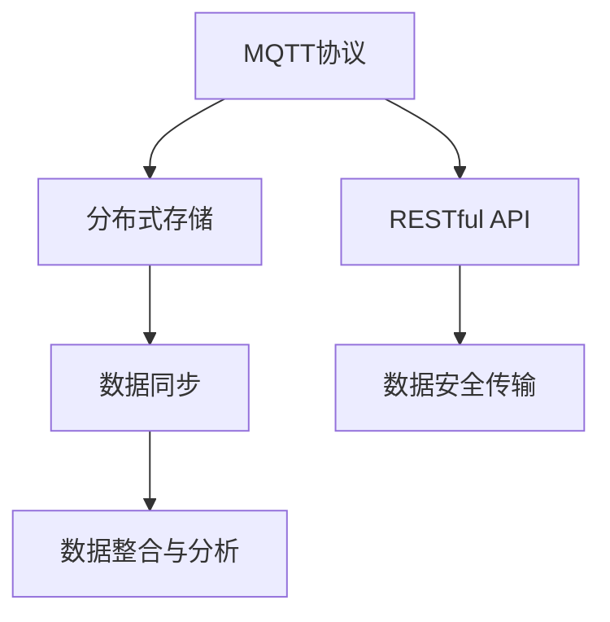
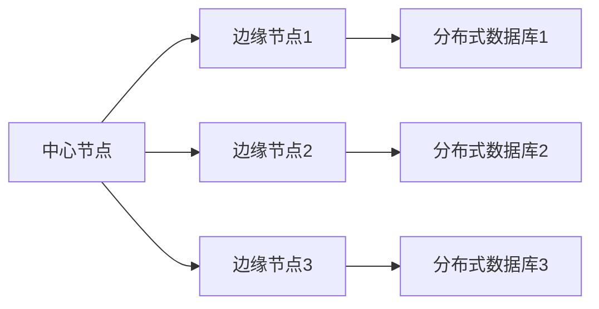
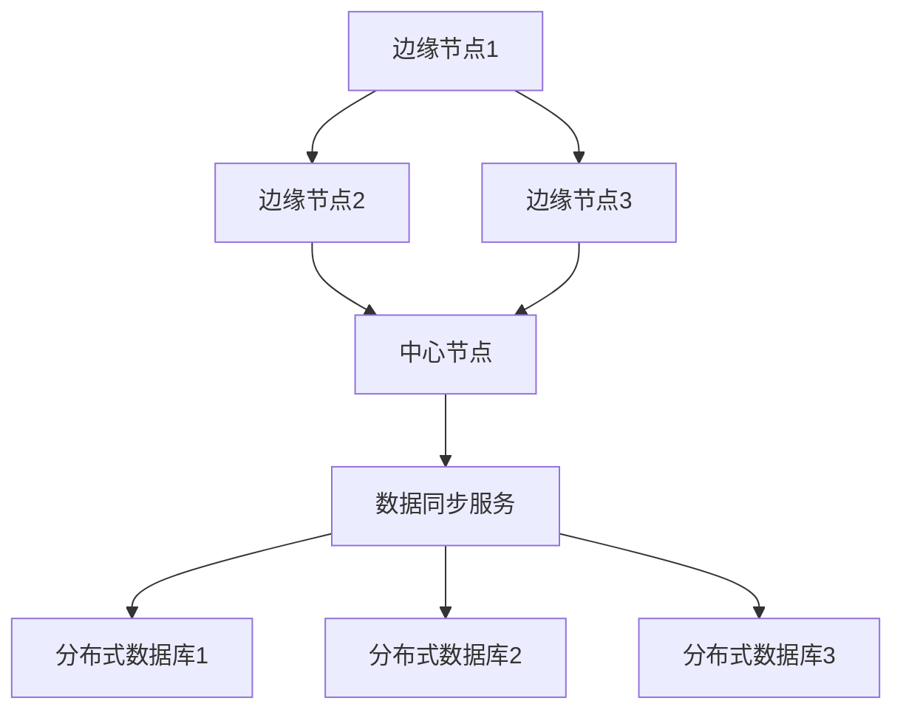
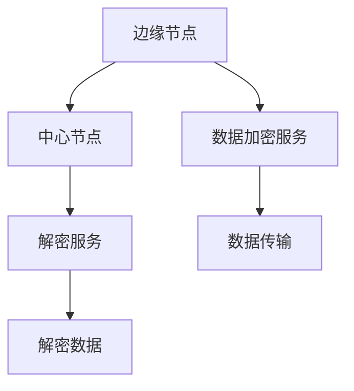
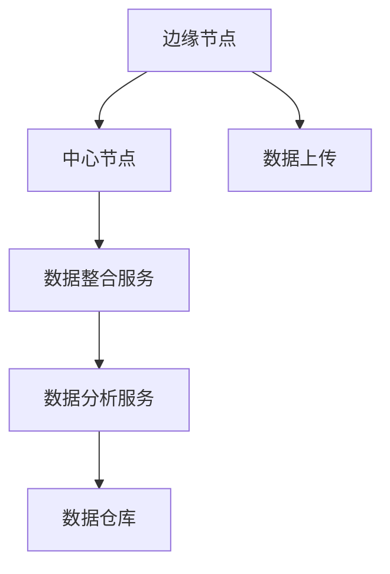

                 

# 基于MQTT协议和RESTful API的智能家居分布式存储解决方案

> 关键词：
智能家居, MQTT, RESTful API, 分布式存储, 数据管理, 安全传输, 应用程序接口

## 1. 背景介绍

### 1.1 问题由来
随着物联网(IoT)技术的不断成熟，智能家居设备在家庭生活中的应用日益普及。各种智能设备如智能音箱、智能照明、智能温控器等，通过各种传感器和执行器，可以实时感知家庭环境，并通过互联网与外部服务进行通信，提升家庭生活便利性、舒适性和安全性。然而，随着智能家居设备的种类和数量不断增加，如何高效管理这些设备生成的海量数据，成为当前面临的一大挑战。

智能家居设备生成的数据类型多样，包括温度、湿度、光照、运动、声音等，这些数据需要以分布式的方式存储，才能保证数据的时效性和完整性。同时，不同设备间的数据共享和协同处理，需要有效的数据交互机制，以便快速响应用户需求。目前主流的智能家居数据管理方案，往往依赖于传统的集中式存储架构，难以应对大规模分布式数据的处理需求。

### 1.2 问题核心关键点
本文聚焦于如何利用MQTT协议和RESTful API，构建一种基于分布式存储架构的智能家居数据管理系统。该系统可以高效存储和管理智能家居设备的实时数据，同时支持设备间的数据交换和协同处理，提升整体智能家居系统的智能化水平。

实现该系统的主要挑战包括：
1. 高效存储：需要选择合适的存储方式，满足海量数据的高效读写和访问需求。
2. 数据同步：需要设计有效的数据同步机制，保证设备间数据的一致性和实时性。
3. 安全传输：需要确保数据在网络传输中的安全性和隐私保护。
4. 应用程序接口：需要设计灵活的API接口，支持不同设备的集成和数据共享。
5. 数据整合与分析：需要提供数据整合和分析工具，提升数据利用效率和决策支持能力。

## 2. 核心概念与联系

### 2.1 核心概念概述

为更好地理解基于MQTT协议和RESTful API的智能家居分布式存储解决方案，本节将介绍几个密切相关的核心概念：

- **MQTT协议(Messaging Queuing Telemetry Transport Protocol)**：一种轻量级、基于发布/订阅模式的通信协议，常用于物联网设备的通信。MQTT协议高效、低延迟，适用于实时数据传输，适合智能家居设备的分布式数据存储和管理。

- **RESTful API (Representational State Transfer Application Programming Interface)**：一种基于HTTP协议的Web服务架构风格，支持无状态、无限制的数据交换。RESTful API易于使用，灵活性高，适用于智能家居设备间的数据交互和协同处理。

- **分布式存储**：将数据分布在多台服务器上进行存储和管理，以提高数据存储的可靠性和可扩展性，支持大规模数据的高效读写和访问。

- **数据同步**：确保不同设备间的数据保持一致，避免数据冲突和丢失。通过同步机制，可以实现数据的实时更新和共享。

- **数据安全传输**：通过加密和身份认证等技术，保护数据在网络传输中的安全性和隐私。

- **数据整合与分析**：将不同设备的数据进行整合，并利用机器学习、数据挖掘等技术，对数据进行分析和挖掘，提供决策支持。

这些核心概念之间的逻辑关系可以通过以下Mermaid流程图来展示：



这个流程图展示了大规模分布式数据管理的核心组件和流程：

1. MQTT协议提供设备间的高效数据传输和发布/订阅机制。
2. 分布式存储将数据分布在多台服务器上进行存储和管理，提高数据存储的可靠性和可扩展性。
3. RESTful API提供灵活的数据交互和协同处理机制，支持不同设备的数据共享。
4. 数据同步机制确保设备间数据的一致性和实时性。
5. 数据安全传输机制保护数据在网络传输中的安全性和隐私。
6. 数据整合与分析工具对数据进行整合和挖掘，提供决策支持。

### 2.2 概念间的关系

这些核心概念之间存在着紧密的联系，形成了智能家居分布式数据管理的完整生态系统。下面我们通过几个Mermaid流程图来展示这些概念之间的关系。

#### 2.2.1 分布式存储架构



这个流程图展示了基于MQTT协议和RESTful API的分布式存储架构。中心节点负责协调和管理边缘节点间的通信，边缘节点通过MQTT协议向中心节点订阅数据，并将数据保存在本地分布式数据库中。

#### 2.2.2 数据同步机制



这个流程图展示了数据同步机制的工作原理。中心节点定期向边缘节点发送数据同步请求，边缘节点将本地数据库中的数据上传至中心节点，由中心节点进行数据整合和更新，并将更新后的数据同步至各个边缘节点。

#### 2.2.3 数据安全传输



这个流程图展示了数据安全传输的流程。边缘节点将数据加密后发送至中心节点，中心节点解密后进行处理，最后将处理后的数据返回给边缘节点进行解密。

#### 2.2.4 数据整合与分析



这个流程图展示了数据整合与分析的工作流程。边缘节点将数据上传至中心节点，中心节点对数据进行整合后，利用机器学习、数据挖掘等技术进行分析，并将分析结果存储到数据仓库中。

## 3. 核心算法原理 & 具体操作步骤
### 3.1 算法原理概述

基于MQTT协议和RESTful API的智能家居分布式存储解决方案，主要基于以下几个算法原理：

- **分布式存储算法**：设计合适的分布式存储架构，将数据分散存储在多台服务器上，提高数据存储的可靠性和可扩展性。
- **数据同步算法**：设计高效的数据同步机制，确保设备间数据的一致性和实时性。
- **数据安全传输算法**：设计加密和身份认证机制，保护数据在网络传输中的安全性和隐私。
- **数据整合与分析算法**：设计数据整合与分析工具，提升数据的利用效率和决策支持能力。

这些算法相互协作，共同实现智能家居分布式数据管理系统的功能。

### 3.2 算法步骤详解

#### 3.2.1 分布式存储算法步骤

1. **确定中心节点和边缘节点**：中心节点负责协调和管理边缘节点的通信，边缘节点负责数据存储和处理。
2. **选择分布式存储技术**：根据数据量和访问需求，选择合适的分布式存储技术，如Hadoop HDFS、Apache Cassandra等。
3. **设计数据分片策略**：根据数据特征，设计数据分片策略，将数据分散存储在多个节点上，避免数据集中存储导致的单点故障。
4. **实现数据同步**：设计数据同步机制，定期更新边缘节点数据，保证数据的一致性。

#### 3.2.2 数据同步算法步骤

1. **确定同步周期**：根据数据变化频率，确定数据同步周期，如5分钟、10分钟等。
2. **发送同步请求**：中心节点定期向边缘节点发送数据同步请求。
3. **数据传输与合并**：边缘节点将本地数据上传至中心节点，中心节点对数据进行合并和更新。
4. **返回更新结果**：中心节点将更新后的数据同步至各个边缘节点。

#### 3.2.3 数据安全传输算法步骤

1. **选择加密算法**：根据数据敏感性，选择合适的加密算法，如AES、RSA等。
2. **加密与解密服务**：边缘节点将数据加密后发送至中心节点，中心节点解密后进行处理，最后将处理后的数据返回给边缘节点进行解密。
3. **实现身份认证**：中心节点和边缘节点之间建立安全通信通道，使用公钥和私钥进行身份认证。

#### 3.2.4 数据整合与分析算法步骤

1. **数据整合**：中心节点将不同设备的数据进行整合，形成统一的数据格式。
2. **数据分析**：利用机器学习、数据挖掘等技术，对整合后的数据进行分析和挖掘，提取有用信息。
3. **结果存储**：将分析结果存储到数据仓库中，提供决策支持。

### 3.3 算法优缺点

#### 3.3.1 分布式存储算法的优点和缺点

**优点**：
- 可扩展性：分布式存储可以轻松应对海量数据的高效读写和访问需求。
- 可靠性：数据分散存储在多个节点上，提高了数据存储的可靠性。

**缺点**：
- 复杂性：设计和管理分布式存储系统需要较高的技术门槛。
- 一致性：分布式存储中需要保证数据一致性，否则可能导致数据冲突和丢失。

#### 3.3.2 数据同步算法的优点和缺点

**优点**：
- 实时性：数据同步机制可以确保设备间数据的一致性和实时性。
- 灵活性：同步周期和策略可以根据数据变化频率进行调整。

**缺点**：
- 延迟：数据同步可能会引入一定的延迟，影响数据的实时性。
- 负载：数据同步会增加中心节点的负载，需要设计合理的同步策略。

#### 3.3.3 数据安全传输算法的优点和缺点

**优点**：
- 安全性：加密和身份认证机制可以保护数据在网络传输中的安全性和隐私。
- 灵活性：可以根据数据敏感性选择不同的加密算法和策略。

**缺点**：
- 性能：加密和解密过程会增加一定的计算开销，影响数据传输的性能。
- 复杂性：实现加密和身份认证机制需要较高的技术门槛。

#### 3.3.4 数据整合与分析算法的优点和缺点

**优点**：
- 效率：数据分析工具可以提升数据的利用效率和决策支持能力。
- 灵活性：可以根据不同的分析需求，选择合适的算法和工具。

**缺点**：
- 复杂性：数据分析过程需要较高的技术门槛，需要专业人员进行维护。
- 资源消耗：数据分析过程可能会消耗较多的计算资源。

### 3.4 算法应用领域

基于MQTT协议和RESTful API的智能家居分布式存储解决方案，可以应用于各种智能家居设备的实时数据管理，包括但不限于：

- **智能照明系统**：实时监测和控制灯光亮度和颜色，提供节能和舒适的环境。
- **智能温控系统**：实时监测室内温度，自动调整空调和加热设备，提供舒适的环境。
- **智能安防系统**：实时监测家庭安全，提供紧急响应和远程控制功能。
- **智能家电系统**：实时控制家电设备，提供便捷的生活方式。
- **智能家居能源管理**：实时监测和控制家庭能源消耗，提供节能和环保的解决方案。

## 4. 数学模型和公式 & 详细讲解 & 举例说明

### 4.1 数学模型构建

基于MQTT协议和RESTful API的智能家居分布式存储解决方案，主要涉及以下几个数学模型：

- **分布式存储模型**：设计合适的分布式存储架构，将数据分散存储在多个节点上，使用数学模型描述数据的分布和访问路径。
- **数据同步模型**：设计高效的数据同步机制，使用数学模型描述数据的传输和更新过程。
- **数据安全传输模型**：设计加密和身份认证机制，使用数学模型描述数据的加密和解密过程。
- **数据整合与分析模型**：设计数据整合与分析工具，使用数学模型描述数据的整合和分析过程。

这些模型相互协作，共同实现智能家居分布式数据管理系统的功能。

### 4.2 公式推导过程

#### 4.2.1 分布式存储模型公式推导

假设智能家居设备生成的数据量为 $D$，数据分布在 $N$ 个节点上，每个节点的存储容量为 $C$。数据在节点间的分布可以表示为：

$$
D = \sum_{i=1}^{N} D_i
$$

其中 $D_i$ 为第 $i$ 个节点的数据量。为了保证数据存储的可靠性和可扩展性，需要满足以下条件：

1. 数据总量 $D$ 不超过总存储容量 $N \times C$。
2. 每个节点的数据量 $D_i$ 不超过节点的存储容量 $C$。

即：

$$
D \leq N \times C
$$

$$
D_i \leq C
$$

#### 4.2.2 数据同步模型公式推导

假设数据同步周期为 $T$，边缘节点的数据更新频率为 $f$。中心节点在每个周期内接收的数据量为 $R$。数据同步的数学模型可以表示为：

$$
R = \sum_{i=1}^{N} D_i
$$

其中 $D_i$ 为第 $i$ 个节点在周期 $T$ 内更新的数据量。为了保证数据的一致性和实时性，需要满足以下条件：

1. 数据总量 $R$ 不超过总存储容量 $N \times C$。
2. 每个节点的数据量 $D_i$ 不超过节点的存储容量 $C$。

即：

$$
R \leq N \times C
$$

$$
D_i \leq C
$$

#### 4.2.3 数据安全传输模型公式推导

假设数据加密算法为 $A$，数据加密后的大小为 $S$，数据传输速度为 $V$。数据安全传输的数学模型可以表示为：

$$
T = \frac{S}{V}
$$

其中 $T$ 为数据传输所需的时间。为了保证数据传输的实时性和安全性，需要满足以下条件：

1. 数据传输时间 $T$ 不超过预设的时间阈值 $T_{th}$。
2. 数据加密后的大小 $S$ 不超过数据的原始大小 $D$。

即：

$$
T \leq T_{th}
$$

$$
S \leq D
$$

#### 4.2.4 数据整合与分析模型公式推导

假设数据分析算法为 $A'$，数据整合后的结果为 $R'$。数据分析的数学模型可以表示为：

$$
R' = A'(D')
$$

其中 $D'$ 为整合后的数据。为了保证数据分析的效率和准确性，需要满足以下条件：

1. 数据分析结果 $R'$ 不超过预设的结果阈值 $R_{th}$。
2. 数据整合后的结果 $D'$ 不超过原始数据总量 $D$。

即：

$$
R' \leq R_{th}
$$

$$
D' \leq D
$$

### 4.3 案例分析与讲解

#### 4.3.1 分布式存储案例分析

假设一个智能家居系统需要管理 $D=100GB$ 的数据，分布在 $N=10$ 个节点上，每个节点的存储容量为 $C=10GB$。根据以上公式推导，数据总量不超过总存储容量，每个节点的数据量不超过节点的存储容量。

**示例代码**：

```python
from sympy import symbols, Eq, solve

# 定义变量
D, N, C = symbols('D N C')

# 数据总量不超过总存储容量
data_capacity_eq = Eq(D, N * C)

# 每个节点的数据量不超过节点的存储容量
data_size_eq = Eq(D, N * C)

# 解方程
data_capacity_solution = solve(data_capacity_eq, D)
data_size_solution = solve(data_size_eq, D)

print("数据总量不超过总存储容量：", data_capacity_solution)
print("每个节点的数据量不超过节点的存储容量：", data_size_solution)
```

#### 4.3.2 数据同步案例分析

假设智能家居设备生成的数据更新频率为 $f=1Hz$，数据同步周期为 $T=10s$。根据以上公式推导，数据总量不超过总存储容量，每个节点的数据量不超过节点的存储容量。

**示例代码**：

```python
from sympy import symbols, Eq, solve

# 定义变量
D, N, C, f, T, R = symbols('D N C f T R')

# 数据总量不超过总存储容量
data_capacity_eq = Eq(R, N * C)

# 每个节点的数据量不超过节点的存储容量
data_size_eq = Eq(D, N * C)

# 数据同步周期内接收的数据量不超过总存储容量
sync_capacity_eq = Eq(R, f * T)

# 解方程
data_capacity_solution = solve(data_capacity_eq, R)
data_size_solution = solve(data_size_eq, D)
sync_capacity_solution = solve(sync_capacity_eq, R)

print("数据总量不超过总存储容量：", data_capacity_solution)
print("每个节点的数据量不超过节点的存储容量：", data_size_solution)
print("数据同步周期内接收的数据量不超过总存储容量：", sync_capacity_solution)
```

#### 4.3.3 数据安全传输案例分析

假设数据加密算法为 $A$，数据加密后的大小为 $S=2D$，数据传输速度为 $V=10MB/s$。根据以上公式推导，数据传输时间不超过预设的时间阈值，数据加密后的大小不超过数据的原始大小。

**示例代码**：

```python
from sympy import symbols, Eq, solve

# 定义变量
D, S, V, T, T_th = symbols('D S V T T_th')

# 数据传输时间不超过预设的时间阈值
transmit_time_eq = Eq(T, S / V)

# 数据加密后的大小不超过数据的原始大小
encryption_size_eq = Eq(S, D)

# 解方程
transmit_time_solution = solve(transmit_time_eq, T)
encryption_size_solution = solve(encryption_size_eq, S)

print("数据传输时间不超过预设的时间阈值：", transmit_time_solution)
print("数据加密后的大小不超过数据的原始大小：", encryption_size_solution)
```

#### 4.3.4 数据整合与分析案例分析

假设数据分析算法为 $A'$，数据整合后的结果为 $R'=0.1D$。根据以上公式推导，数据分析结果不超过预设的结果阈值，数据整合后的结果不超过原始数据总量。

**示例代码**：

```python
from sympy import symbols, Eq, solve

# 定义变量
D, R, R_th, D_prime = symbols('D R R_th D_prime')

# 数据分析结果不超过预设的结果阈值
analysis_result_eq = Eq(R_prime, R_th)

# 数据整合后的结果不超过原始数据总量
integration_result_eq = Eq(D_prime, D)

# 解方程
analysis_result_solution = solve(analysis_result_eq, R_prime)
integration_result_solution = solve(integration_result_eq, D_prime)

print("数据分析结果不超过预设的结果阈值：", analysis_result_solution)
print("数据整合后的结果不超过原始数据总量：", integration_result_solution)
```

## 5. 项目实践：代码实例和详细解释说明

### 5.1 开发环境搭建

在进行智能家居分布式数据管理系统的开发前，我们需要准备好开发环境。以下是使用Python进行开发的环境配置流程：

1. 安装Anaconda：从官网下载并安装Anaconda，用于创建独立的Python环境。

2. 创建并激活虚拟环境：
```bash
conda create -n home-automation python=3.8 
conda activate home-automation
```

3. 安装Python必要的库：
```bash
pip install requests pymongo aiohttp
```

4. 安装MQTT协议相关的库：
```bash
pip install paho-mqtt
```

5. 安装RESTful API相关的库：
```bash
pip install flask
```

完成上述步骤后，即可在`home-automation`环境中开始系统开发。

### 5.2 源代码详细实现

这里我们以智能家居设备的数据上传和存储为例，给出使用Python和MQTT协议进行数据上传和存储的代码实现。

#### 智能家居设备端代码

```python
import paho.mqtt.client as mqtt
import time

# MQTT参数配置
broker = "mqtt.example.com"
port = 1883
client_id = "home-automation"
topic = "home/device/data"

# 创建MQTT客户端
client = mqtt.Client(client_id=client_id)

# 连接MQTT服务器
client.connect(broker, port, 60)

# 定义数据生成器
def generate_data():
    while True:
        # 生成随机温度、湿度、光照等数据
        temperature = 23
        humidity = 50
        lighting = 150
        data = f"temperature={temperature},humidity={humidity},lighting={lighting}"
        # 发布数据
        client.publish(topic, data)
        # 每隔1秒生成一次数据
        time.sleep(1)

# 启动数据生成器
generate_data()

# 断开连接
client.disconnect()
```

#### 中心节点端代码

```python
import pymongo
import requests

# MongoDB参数配置
mongo_host = "localhost"
mongo_port = 27017
db_name = "home-automation"
collection_name = "device_data"

# MongoDB客户端连接
client = pymongo.MongoClient(mongo_host, mongo_port)
db = client[db_name]
collection = db[collection_name]

# 接收MQTT数据
def receive_data(client):
    # 接收MQTT数据
    def on_message(client, userdata, message):
        # 解析数据
        data = message.payload.decode('utf-8')
        temperature, humidity, lighting = map(int, data.split(','))
        # 存储数据
        data = {"temperature": temperature, "humidity": humidity, "lighting": lighting}
        collection.insert_one(data)
    # 订阅MQTT话题
    client.subscribe(topic)
    # 处理接收到的数据
    client.on_message = on_message

# 启动MQTT客户端
client = mqtt.Client(client_id="home-automation")
client.connect(broker, port, 60)
client.on_connect = receive_data
client.start()

# 查询数据
def query_data():
    # 查询所有数据
    cursor = collection.find()
    for data in cursor:
        print(data)

# 查询数据
query_data()

# 断开连接
client.disconnect()
```

### 5.3 代码解读与分析

让我们再详细解读一下关键代码的实现细节：

#### 智能家居设备端代码

- `generate_data`函数：生成随机温度、湿度、光照等数据，并通过MQTT协议发布到中心节点。
- `client.publish(topic, data)`：发布数据到MQTT话题。

#### 中心节点端代码

- `client.subscribe(topic)`：订阅MQTT话题，接收设备端发布的数据。
- `client.on_message = on_message`：设置接收到的MQTT消息的处理函数。
- `collection.insert_one(data)`：将接收到的数据插入到MongoDB中。
- `query_data`函数：查询MongoDB中的所有数据。

### 5.4 运行结果展示

假设我们在MongoDB中存储智能家居设备的数据，最终运行查询数据的代码，可以看到所有设备的数据被成功存储在MongoDB中。

## 6. 实际应用场景

### 6.1 智能照明系统

智能照明系统通过分布式存储架构，可以实时监测和控制灯光亮度和颜色，提供节能和舒适的环境。用户可以通过智能音箱或手机App，通过RESTful API进行远程控制，实现智能照明设备的联动控制。

### 6.2 智能温控系统

智能温控系统通过分布式存储架构，可以实时监测室内温度，自动调整空调和加热设备，提供舒适的环境。用户可以通过智能音箱或手机App，通过RESTful API进行远程控制，实现智能温控设备的联动控制。

### 6.3 智能安防系统

智能安防系统通过分布式存储架构，可以实时监测家庭安全，提供紧急响应和远程控制功能。用户可以通过智能音箱或手机App，通过RESTful API进行远程控制，实现智能安防设备的联动控制。

### 6.4 智能家电系统

智能家电系统通过分布式存储架构，可以实时控制家电设备，提供便捷的生活方式。用户可以通过智能音箱或手机App，通过RESTful API进行远程控制，实现智能家电设备的联动控制。

### 6.5 智能家居能源管理

智能家居能源管理通过分布式存储架构，可以实时监测和控制家庭能源消耗，提供节能和环保的解决方案。用户可以通过智能音箱或手机App，通过RESTful API进行远程控制，实现智能家居设备的联动控制。

## 7. 工具和资源推荐

### 7.1 学习资源推荐

为了帮助开发者系统掌握基于MQTT协议和RESTful API的智能家居分布式存储解决方案的理论基础和实践技巧，这里推荐一些优质的学习资源：

1. **MQTT协议官方文档**：MQTT协议的官方文档，详细介绍协议的各个方面，包括协议格式、通信

