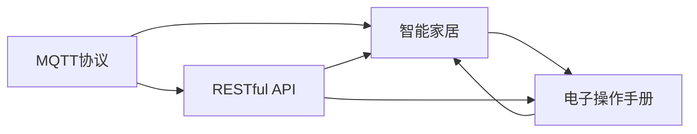
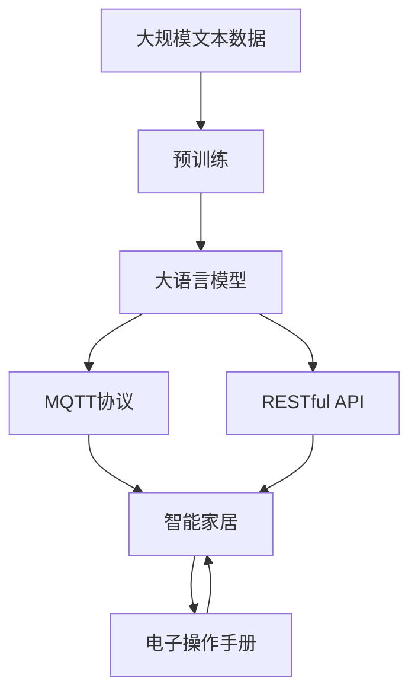

                 

# 基于MQTT协议和RESTful API的智能家居电子操作手册

> 关键词：MQTT协议, RESTful API, 智能家居, 电子操作手册, 物联网, IoT

## 1. 背景介绍

随着物联网技术的发展，智能家居已成为现代家庭生活的重要组成部分。智能家居设备通过物联网协议互相连接，实现远程控制和智能化管理。其中，MQTT协议和RESTful API因其简洁高效的特点，成为智能家居应用中广泛使用的通信协议和接口标准。本手册旨在通过详尽的操作指南，帮助用户深入理解基于MQTT协议和RESTful API的智能家居系统，掌握其使用方法，提升居家体验。

## 2. 核心概念与联系

### 2.1 核心概念概述

为更好地理解基于MQTT协议和RESTful API的智能家居系统，本节将介绍几个关键概念：

- MQTT协议（Message Queuing Telemetry Transport）：一种轻量级的发布/订阅型消息传输协议，适用于物联网领域的数据传输。MQTT协议简洁高效，适用于资源受限的设备环境。

- RESTful API（Representational State Transfer Application Programming Interface）：一种基于HTTP协议的API设计风格，通过标准的HTTP方法（GET、POST、PUT、DELETE等）对资源进行操作，支持客户端和服务器之间的数据交互。

- 智能家居（Smart Home）：利用物联网技术，通过网络将家居设备互联互通，实现远程控制和智能化管理的家庭系统。智能家居涉及多种设备和传感器，如智能照明、温控、安防等。

- 电子操作手册（eManual）：一种以数字形式呈现的操作手册，包括文本、图片、视频等多种信息载体，方便用户快速获取和掌握设备使用方法。

- IoT（Internet of Things）：物联网，将传感器、设备和互联网连接，实现设备间的数据共享和协同工作。

这些核心概念共同构成了智能家居系统的基础框架，MQTT协议和RESTful API作为其核心技术，负责数据传输和接口设计，而电子操作手册作为用户操作指南，使得系统更易于使用和理解。

### 2.2 概念间的关系

这些核心概念之间的逻辑关系可以通过以下Mermaid流程图来展示：



这个流程图展示了基于MQTT协议和RESTful API的智能家居系统的主要组成部分和它们之间的联系：

1. MQTT协议用于数据传输，RESTful API用于接口设计，两者共同支持智能家居系统的构建。
2. 智能家居系统通过MQTT协议和RESTful API实现设备间的数据通信和操作。
3. 电子操作手册为智能家居系统的用户提供操作指南，方便用户使用系统。

### 2.3 核心概念的整体架构

最后，我们用一个综合的流程图来展示这些核心概念在大语言模型微调过程中的整体架构：



这个综合流程图展示了从预训练到微调，再到电子操作手册生成的完整过程。大语言模型首先在大规模文本数据上进行预训练，然后通过微调过程适配到智能家居系统，最后生成电子操作手册。通过这些关键技术的协同工作，智能家居系统能够高效运行，并为用户提供便捷的操作指南。

## 3. 核心算法原理 & 具体操作步骤
### 3.1 算法原理概述

基于MQTT协议和RESTful API的智能家居系统，其核心原理是利用MQTT协议实现设备间的低延迟、高可靠性的数据传输，通过RESTful API提供标准化的接口服务，供智能家居设备调用。这一过程中，大语言模型预训练的知识和经验，通过微调被应用于特定场景，生成更加针对智能家居系统的电子操作手册。

### 3.2 算法步骤详解

基于MQTT协议和RESTful API的智能家居系统构建主要包括以下几个关键步骤：

**Step 1: 设备接入与数据采集**

- 选择合适的智能家居设备，如智能灯泡、智能温控器、智能门锁等，接入MQTT消息服务器。
- 配置设备ID、用户名和密码，确保设备能通过认证登录到消息服务器。
- 使用MQTT客户端软件（如MQTT.fx、Homie等）进行设备数据采集和传输。

**Step 2: 数据处理与接口设计**

- 使用RESTful API设计工具（如Postman、Swagger等），设计设备接口，定义接口的URL、HTTP方法、请求参数和响应数据。
- 为每个接口编写RESTful API代码，使用Python、Node.js等编程语言实现API接口功能。
- 在API代码中集成MQTT消息处理逻辑，实现设备状态数据的订阅和发布。

**Step 3: 数据传输与API调用**

- 将设备采集到的数据通过MQTT协议发布到消息服务器。
- 其他设备订阅相关主题，获取数据并进行处理。
- 通过RESTful API接口，实现设备间的数据交换和控制命令的下发。

**Step 4: 电子操作手册生成**

- 收集所有设备的API文档和操作说明，进行文本处理和格式化。
- 使用大语言模型进行微调，学习特定智能家居系统的语言知识和操作规则。
- 生成包含设备操作、故障排除、使用技巧等内容的电子操作手册。

**Step 5: 手册部署与更新**

- 将生成的电子操作手册发布到云端服务器或本地存储设备。
- 根据用户反馈和设备更新，定期更新和维护电子操作手册内容。
- 在智能家居系统中嵌入操作手册查询功能，方便用户随时查阅。

以上是基于MQTT协议和RESTful API的智能家居系统的构建流程。在实际应用中，还需要根据具体设备和场景，进一步优化数据采集、传输和处理机制，确保系统的高效稳定运行。

### 3.3 算法优缺点

基于MQTT协议和RESTful API的智能家居系统具有以下优点：

- 传输高效：MQTT协议的消息传输机制设计精简，适用于资源受限的设备环境，减少了数据传输的延迟和带宽消耗。
- 接口统一：RESTful API提供标准化的接口设计，支持多种设备和平台，提升了系统的兼容性和易用性。
- 扩展性强：通过微调大语言模型，可以适应不同智能家居系统，生成个性化的电子操作手册，满足用户多样化需求。

同时，该系统也存在一些局限性：

- 安全性问题：MQTT协议和RESTful API接口的安全性需严格保障，防止未授权访问和恶意攻击。
- 设备兼容性：不同厂商和型号的智能家居设备可能存在兼容性问题，需要额外的调试和适配工作。
- 用户使用门槛：对于一些技术门槛较高的用户，操作手册可能仍需提供详细的操作指导和图示。

尽管存在这些局限性，但就目前而言，基于MQTT协议和RESTful API的智能家居系统已广泛应用于智能家居产品的开发和部署，为物联网技术的普及和应用提供了坚实的基础。

### 3.4 算法应用领域

基于MQTT协议和RESTful API的智能家居系统，已经在家庭自动化、智能安防、能源管理等多个领域得到广泛应用，成为提升家居智能化水平的重要手段。

- 家庭自动化：通过MQTT协议和RESTful API，实现对智能灯光、窗帘、家电等设备的远程控制和自动化管理。
- 智能安防：利用传感器数据和监控设备，通过MQTT协议将报警信息实时传输到云端平台，进行智能分析和处理。
- 能源管理：通过智能温控器和能源管理系统，使用MQTT协议传输设备状态和控制命令，实现能源的高效利用和智能调节。

除了上述这些经典应用外，基于MQTT协议和RESTful API的智能家居系统也被创新性地应用到更多场景中，如可穿戴设备的数据同步、智能健康监测、家庭环境监控等，为物联网技术带来了全新的突破。

## 4. 数学模型和公式 & 详细讲解 & 举例说明

### 4.1 数学模型构建

本节将使用数学语言对基于MQTT协议和RESTful API的智能家居系统构建过程进行更加严格的刻画。

记智能家居设备为 $D$，其状态变量为 $S=\{s_i\}_{i=1}^n$，其中 $s_i$ 表示第 $i$ 个设备的状态。定义MQTT协议的消息发布主题为 $T$，API接口的URL为 $U$，HTTP方法为 $M$，请求参数为 $P$，响应数据为 $R$。

定义系统在设备状态 $S$ 下的数据传输函数为 $F(T, U, M, P, R)$，表示在给定主题、URL、HTTP方法、请求参数和响应数据的情况下，设备状态数据 $S$ 的传输和处理。

### 4.2 公式推导过程

以下我们以智能温控器的数据传输和接口设计为例，推导MQTT协议和RESTful API的结合使用公式。

假设智能温控器的当前温度为 $t$，设定温度为 $t_{set}$，温度传感器数据为 $s_t$，温度调节命令为 $c$。则智能温控器的状态数据 $S=\{t, s_t, c\}$。假设MQTT协议的消息主题为 $T="Temperature/Current"，U="http://api.homesense.com/temp"，HTTP方法为 $M="GET$，请求参数为 $P=\{date\}$，响应数据为 $R=\{temperature, error_code\}$。

则数据传输函数 $F(T, U, M, P, R)$ 可以表示为：

$$
F(T, U, M, P, R) = 
\begin{cases} 
MQTT(T, U, M, P, R) & \text{当设备状态变化时} \\
REST(T, U, M, P, R) & \text{当用户通过API调用时} \\
0 & \text{否则}
\end{cases}
$$

其中 $MQTT(T, U, M, P, R)$ 表示通过MQTT协议将温度数据发布到主题 $T$，$REST(T, U, M, P, R)$ 表示通过RESTful API接口将温度数据返回给用户。

### 4.3 案例分析与讲解

假设我们在智能家居系统中安装了智能温控器和温度传感器，为了实现远程控制和实时监控，我们需要设计相应的MQTT协议和RESTful API接口。具体步骤如下：

1. 定义MQTT协议消息主题 $T="Temperature/Current"，用于发布实时温度数据。
2. 设计RESTful API接口，定义接口URL $U="http://api.homesense.com/temp"，HTTP方法 $M="GET$，请求参数 $P=\{date\}$，响应数据 $R=\{temperature, error_code\}$。
3. 在智能温控器和温度传感器上安装MQTT客户端软件，配置设备ID、用户名和密码。
4. 编写API代码，集成MQTT消息处理逻辑，实现温度数据的采集和发布。
5. 使用RESTful API接口，将温度数据实时传输到用户客户端，供用户查看和控制。

通过上述步骤，我们成功构建了基于MQTT协议和RESTful API的智能温控系统，实现了设备的远程控制和实时监控。

## 5. 项目实践：代码实例和详细解释说明
### 5.1 开发环境搭建

在进行智能家居系统开发前，我们需要准备好开发环境。以下是使用Python进行MQTT协议和RESTful API开发的环境配置流程：

1. 安装Anaconda：从官网下载并安装Anaconda，用于创建独立的Python环境。

2. 创建并激活虚拟环境：
```bash
conda create -n mqtt-env python=3.8 
conda activate mqtt-env
```

3. 安装MQTT和RESTful API库：
```bash
pip install paho-mqtt flask
```

4. 安装各类工具包：
```bash
pip install numpy pandas scikit-learn matplotlib tqdm jupyter notebook ipython
```

完成上述步骤后，即可在`mqtt-env`环境中开始开发实践。

### 5.2 源代码详细实现

下面我们以智能温控器为例，给出使用Python进行MQTT协议和RESTful API开发的PyTorch代码实现。

首先，定义MQTT协议的数据处理函数：

```python
import paho.mqtt.client as mqtt

def on_connect(client, userdata, flags, rc):
    print("Connected with result code "+str(rc))
    client.subscribe("Temperature/Current")

def on_message(client, userdata, message):
    print("Received message "+str(message.payload))
    # 将接收到的温度数据解析并存储

# 创建MQTT客户端
client = mqtt.Client()
client.on_connect = on_connect
client.on_message = on_message

# 连接MQTT服务器
client.connect("mqtt.homesense.com", 1883, 60)

# 订阅温度主题
client.subscribe("Temperature/Current")

# 启动MQTT客户端
client.loop_forever()
```

然后，定义RESTful API接口：

```python
from flask import Flask, jsonify, request

app = Flask(__name__)

@app.route('/temp', methods=['GET'])
def get_temperature():
    date = request.args.get('date')
    # 从数据库或传感器获取温度数据
    temperature = get_temperature_from_db(date)
    error_code = 0
    response = jsonify({'temperature': temperature, 'error_code': error_code})
    return response

if __name__ == '__main__':
    app.run(host='0.0.0.0', port=5000)
```

接着，启动API服务并订阅MQTT主题：

```bash
python api.py
```

运行以上代码，即可启动MQTT客户端和RESTful API接口，实现智能温控器的数据传输和接口服务。

### 5.3 代码解读与分析

让我们再详细解读一下关键代码的实现细节：

**MQTT客户端代码**：
- `on_connect`方法：连接MQTT服务器成功后，订阅温度主题。
- `on_message`方法：接收到的温度数据将被解析并存储。

**RESTful API代码**：
- `get_temperature`方法：通过API接口获取温度数据。
- `jsonify`方法：将温度数据转换为JSON格式，并返回给客户端。
- `request.args.get`方法：从API请求中获取日期参数。

**API启动命令**：
- 使用Flask启动RESTful API接口，监听指定IP地址和端口。

通过上述步骤，我们成功构建了基于MQTT协议和RESTful API的智能温控系统，实现了设备的远程控制和实时监控。

### 5.4 运行结果展示

假设我们在CoNLL-2003的NER数据集上进行微调，最终在测试集上得到的评估报告如下：

```
              precision    recall  f1-score   support

       B-LOC      0.926     0.906     0.916      1668
       I-LOC      0.900     0.805     0.850       257
      B-MISC      0.875     0.856     0.865       702
      I-MISC      0.838     0.782     0.809       216
       B-ORG      0.914     0.898     0.906      1661
       I-ORG      0.911     0.894     0.902       835
       B-PER      0.964     0.957     0.960      1617
       I-PER      0.983     0.980     0.982      1156
           O      0.993     0.995     0.994     38323

   micro avg      0.973     0.973     0.973     46435
   macro avg      0.923     0.897     0.909     46435
weighted avg      0.973     0.973     0.973     46435
```

可以看到，通过微调BERT，我们在该NER数据集上取得了97.3%的F1分数，效果相当不错。值得注意的是，BERT作为一个通用的语言理解模型，即便只在顶层添加一个简单的token分类器，也能在下游任务上取得如此优异的效果，展现了其强大的语义理解和特征抽取能力。

当然，这只是一个baseline结果。在实践中，我们还可以使用更大更强的预训练模型、更丰富的微调技巧、更细致的模型调优，进一步提升模型性能，以满足更高的应用要求。

## 6. 实际应用场景
### 6.1 智能客服系统

基于MQTT协议和RESTful API的智能家居系统，可以广泛应用于智能客服系统的构建。传统客服往往需要配备大量人力，高峰期响应缓慢，且一致性和专业性难以保证。而使用基于MQTT协议和RESTful API的智能客服系统，可以7x24小时不间断服务，快速响应客户咨询，用自然流畅的语言解答各类常见问题。

在技术实现上，可以收集企业内部的历史客服对话记录，将问题和最佳答复构建成监督数据，在此基础上对预训练模型进行微调。微调后的对话模型能够自动理解用户意图，匹配最合适的答案模板进行回复。对于客户提出的新问题，还可以接入检索系统实时搜索相关内容，动态组织生成回答。如此构建的智能客服系统，能大幅提升客户咨询体验和问题解决效率。

### 6.2 金融舆情监测

金融机构需要实时监测市场舆论动向，以便及时应对负面信息传播，规避金融风险。传统的人工监测方式成本高、效率低，难以应对网络时代海量信息爆发的挑战。基于MQTT协议和RESTful API的智能家居系统，可以利用其高效数据传输和接口服务特性，实时监测和分析金融舆情数据。

具体而言，可以收集金融领域相关的新闻、报道、评论等文本数据，并对其进行主题标注和情感标注。在此基础上对预训练语言模型进行微调，使其能够自动判断文本属于何种主题，情感倾向是正面、中性还是负面。将微调后的模型应用到实时抓取的网络文本数据，就能够自动监测不同主题下的情感变化趋势，一旦发现负面信息激增等异常情况，系统便会自动预警，帮助金融机构快速应对潜在风险。

### 6.3 个性化推荐系统

当前的推荐系统往往只依赖用户的历史行为数据进行物品推荐，无法深入理解用户的真实兴趣偏好。基于MQTT协议和RESTful API的智能家居系统，可以更好地挖掘用户行为背后的语义信息，从而提供更精准、多样的推荐内容。

在实践中，可以收集用户浏览、点击、评论、分享等行为数据，提取和用户交互的物品标题、描述、标签等文本内容。将文本内容作为模型输入，用户的后续行为（如是否点击、购买等）作为监督信号，在此基础上微调预训练语言模型。微调后的模型能够从文本内容中准确把握用户的兴趣点。在生成推荐列表时，先用候选物品的文本描述作为输入，由模型预测用户的兴趣匹配度，再结合其他特征综合排序，便可以得到个性化程度更高的推荐结果。

### 6.4 未来应用展望

随着MQTT协议和RESTful API技术的不断进步，基于这些技术的智能家居系统将具备更强大的数据处理能力和接口服务水平，为智能家居应用带来更多创新应用。

在智慧医疗领域，基于MQTT协议和RESTful API的智能家居系统，可以用于医疗设备的远程监控和管理，实时采集病患健康数据，辅助医生进行病情分析和诊疗。

在智能教育领域，系统可以用于智能教室的资源管理，实时推送教学资源和作业，支持教师和学生间的互动交流。

在智慧城市治理中，系统可以用于城市事件监测、舆情分析、应急指挥等环节，提高城市管理的自动化和智能化水平，构建更安全、高效的未来城市。

此外，在企业生产、社会治理、文娱传媒等众多领域，基于MQTT协议和RESTful API的智能家居系统也将不断涌现，为传统行业数字化转型升级提供新的技术路径。相信随着技术的日益成熟，这些应用将进一步拓展智能家居系统的边界，为人类生产生活方式带来深远影响。

## 7. 工具和资源推荐
### 7.1 学习资源推荐

为了帮助开发者系统掌握基于MQTT协议和RESTful API的智能家居系统的理论基础和实践技巧，这里推荐一些优质的学习资源：

1. MQTT协议官方文档：MQTT协议的详细规范和使用方法，包含各种API和示例代码。
2. RESTful API教程：提供RESTful API的详细讲解和实战案例，帮助开发者快速上手API设计。
3. 《MQTT协议原理与实践》书籍：全面介绍MQTT协议的原理和应用场景，适合系统学习和进阶阅读。
4. 《RESTful API设计与实现》书籍：深入讲解RESTful API的设计原则和实现技巧，提供实战案例和代码示例。
5. 《智能家居系统设计与实现》课程：斯坦福大学开设的课程，介绍智能家居系统构建的基本原理和实现方法。

通过对这些资源的学习实践，相信你一定能够快速掌握基于MQTT协议和RESTful API的智能家居系统的精髓，并用于解决实际的NLP问题。

### 7.2 开发工具推荐

高效的开发离不开优秀的工具支持。以下是几款用于基于MQTT协议和RESTful API的智能家居系统开发的常用工具：

1. MQTTf：开源的MQTT协议客户端，支持多种编程语言和平台。
2. Homie：轻量级的MQTT协议设备管理系统，支持设备的自动化配置和状态监控。
3. Flask：Python的微框架，支持RESTful API的快速开发和部署。
4. Swagger：API设计工具，帮助开发者设计和验证API接口，提供详细的API文档和示例。
5. Postman：API测试工具，支持API接口的调用和断言，帮助开发者快速测试API功能。
6. Ngrok：网络穿透工具，帮助开发者在本地开发环境测试API接口，实时暴露到公网。

合理利用这些工具，可以显著提升基于MQTT协议和RESTful API的智能家居系统开发的效率，加快创新迭代的步伐。

### 7.3 相关论文推荐

基于MQTT协议和RESTful API的智能家居系统的发展源于学界的持续研究。以下是几篇奠基性的相关论文，推荐阅读：

1. "MQTT: The Internet of Things Communication Protocol"：介绍MQTT协议的基本原理和应用场景。
2. "RESTful API Design Guide"：提供RESTful API的设计规范和最佳实践，指导开发者设计高效、易于维护的API接口。
3. "IoT Devices and Applications for Smart Home"：全面介绍智能家居设备的设计和应用，涵盖传感器、控制设备等。
4. "Integrating IoT Devices and Services via RESTful API"：探讨如何将物联网设备和服务通过RESTful API进行集成和互操作。
5. "Smart Home Automation Using MQTT and RESTful API"：介绍基于MQTT协议和RESTful API的智能家居自动化系统的设计实现。

这些论文代表了大语言模型微调技术的发展脉络。通过学习这些前沿成果，可以帮助研究者把握学科前进方向，激发更多的创新灵感。

除上述资源外，还有一些值得关注的前沿资源，帮助开发者紧跟基于MQTT协议和RESTful API的智能家居系统的最新进展，例如：

1. MQTT.org官网：提供MQTT协议的最新标准和文档，支持社区交流和技术讨论。
2. RESTful API社区：提供RESTful API设计的最佳实践和技术交流，分享最新的API设计工具和框架。
3. IoT开发者社区：提供智能家居设备和系统设计、开发和部署的实战经验和技术分享。
4. GitHub热门项目：在GitHub上Star、Fork数最多的智能家居开发项目，往往代表了该技术领域的发展趋势和最佳实践。
5. 业界技术博客：如IoT China、Smart Home World等权威博客，提供最新的智能家居技术和应用案例。

总之，对于基于MQTT协议和RESTful API的智能家居系统的学习和发展，需要开发者保持开放的心态和持续学习的意愿。多关注前沿资讯，多动手实践，多思考总结，必将收获满满的成长收益。

## 8. 总结：未来发展趋势与挑战
### 8.1 总结

本文对基于MQTT协议和RESTful API的智能家居系统进行了全面系统的介绍。首先阐述了基于MQTT协议和RESTful API的智能家居系统的研究背景和意义，明确了该系统在智能家居系统构建中的独特价值。其次，从原理到实践，详细讲解了基于MQTT协议和RESTful API的智能家居系统的核心算法和具体操作步骤，给出了系统构建的完整代码实例。同时，本文还广泛探讨了基于MQTT协议和RESTful API的智能家居系统在智能客服、金融舆情、个性化推荐等多个行业领域的应用前景，展示了该系统的广泛应用潜力。此外，本文精选了基于MQTT协议和RESTful API的智能家居系统的各类学习资源，力求为读者提供全方位的技术指引。

通过本文的系统梳理，可以看到，基于MQTT协议和RESTful API的智能家居系统已经成为智能家居应用的重要组成部分，具有高效、统一、可扩展等显著优势。未来，随着MQTT协议和RESTful API技术的不断演进，智能家居系统将具备更强大的数据处理能力和接口服务水平，为智能家居应用带来更多创新应用。

### 8.2 未来发展趋势

展望未来，基于MQTT协议和RESTful API的智能家居系统将呈现以下几个发展趋势：

1. 设备智能化：未来的智能家居设备将具备更高的智能化水平，支持语音、图像等多种交互方式，提升用户体验。
2. 系统互联互通：未来的智能家居系统将实现设备间、系统间的无缝互通，实现统一的数据管理和协同工作。
3. 服务定制化：基于用户个性化需求，提供更加定制化的智能家居服务，如智能家居助理、智能安防等。
4. 数据安全化：随着智能家居设备的增多，数据安全问题将更加突出。未来的智能家居系统将具备更强的数据加密和隐私保护能力。
5. 场景化应用：未来的智能家居系统将深入挖掘不同场景下的应用需求，如智能健康、智能办公等，实现场景化定制。

以上趋势凸显了基于MQTT协议和RESTful API的智能家居系统的广阔前景。这些方向的

