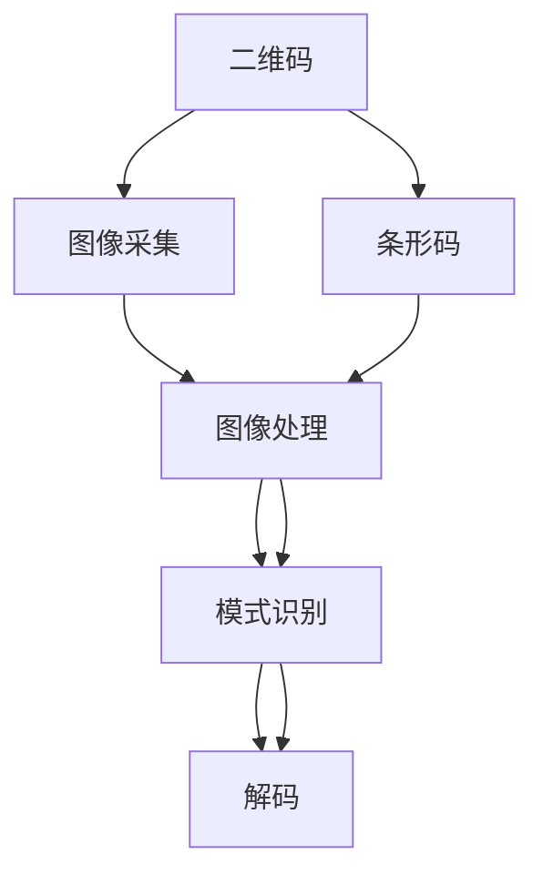
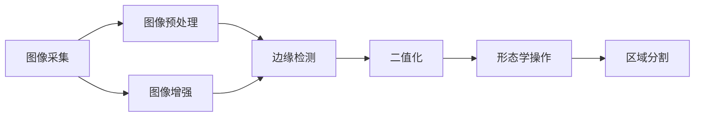
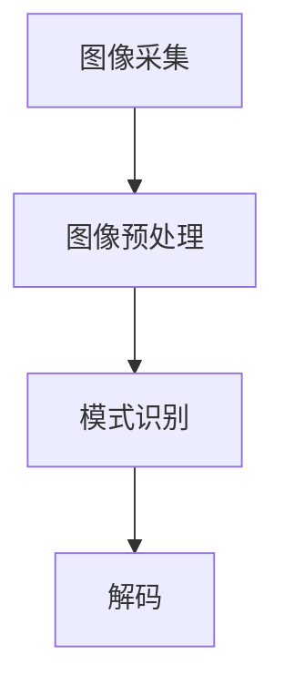
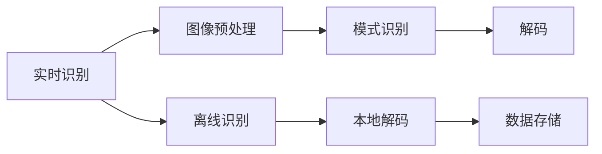
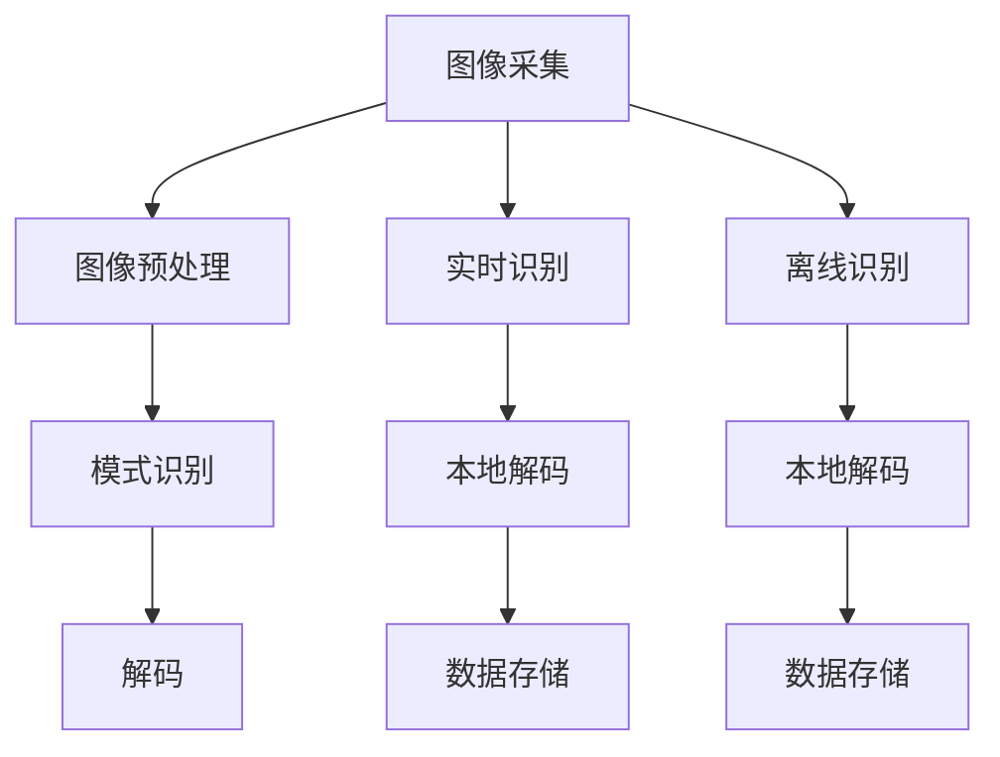

                 

# 基于OpenCV的二维码和条形码识别

> 关键词：二维码识别,条形码识别,OpenCV,计算机视觉,图像处理

## 1. 背景介绍

### 1.1 问题由来
二维码和条形码在现代信息社会中应用广泛，尤其在电商、物流、医疗等行业中，已成为信息存储和传输的重要手段。然而，它们往往需要在特定的设备或应用程序中才能被识别，极大地限制了使用场景的灵活性。因此，开发一种快速、高效、跨平台的二维码和条形码识别技术，对于提升用户体验和促进各行各业的数字化转型具有重要意义。

### 1.2 问题核心关键点
二维码和条形码识别技术主要包括以下几个核心关键点：

- 识读速度：如何快速、准确地从图像中识别出二维码或条形码。
- 识读精度：能否在复杂的背景、变形或低对比度的情况下识别出二维码或条形码。
- 跨平台兼容：能否在多种设备（如手机、PC、平板等）上使用。
- 实时应用：能否在移动设备上实现实时识别，无需联网或离线识别。
- 用户友好：是否易于集成到已有应用中，并提供友好的人机交互界面。

本文聚焦于基于OpenCV的开源图像处理库，介绍如何利用其强大的图像处理和模式识别功能，实现高效、准确、跨平台的二维码和条形码识别。

## 2. 核心概念与联系

### 2.1 核心概念概述

为更好地理解二维码和条形码识别技术，本节将介绍几个密切相关的核心概念：

- 二维码(Barcode)：一种通过几何图形来存储数据信息的二维条码，通常由黑白相间的矩形模块组成。
- 条形码(Barcode)：一种通过黑、白条带的宽度来表示数据信息的线性条码，广泛应用于商品管理、物流等领域。
- OpenCV：一个开源的计算机视觉库，提供丰富的图像处理和模式识别功能，广泛应用于机器视觉、图像处理、深度学习等领域。
- 图像处理(Image Processing)：对数字图像进行处理和分析，包括滤波、变换、分割等，以提取图像的有用信息。
- 模式识别(Pattern Recognition)：通过分析图像、文本等数据，自动分类和识别其中的模式，如二维码、条形码等。

这些核心概念之间的逻辑关系可以通过以下Mermaid流程图来展示：



这个流程图展示了大规模二维码和条形码识别的核心概念及其之间的关系：

1. 二维码或条形码首先通过图像采集设备（如摄像头）转化为数字图像。
2. 数字图像经过图像处理，提取出感兴趣的区域。
3. 在处理后的图像上，通过模式识别技术，自动识别出二维码或条形码。
4. 最终将识别结果解码为原始数据，完成识别过程。

### 2.2 概念间的关系

这些核心概念之间存在着紧密的联系，形成了二维码和条形码识别的完整流程。下面我通过几个Mermaid流程图来展示这些概念之间的关系。

#### 2.2.1 图像采集与预处理



这个流程图展示了图像采集到预处理的关键步骤：

1. 通过摄像头或扫描器采集图像。
2. 对采集到的图像进行增强，如增加对比度、消除噪声等。
3. 进行边缘检测，识别图像中的物体边缘和轮廓。
4. 进行二值化，将图像转换为黑白二值图像。
5. 对二值图像进行形态学操作，如膨胀、腐蚀等，去除干扰区域。
6. 进行区域分割，将图像中感兴趣的物体或区域提取出来。

#### 2.2.2 模式识别与解码



这个流程图展示了图像预处理到模式识别的关键步骤：

1. 通过摄像头或扫描器采集图像。
2. 对采集到的图像进行增强、边缘检测、二值化等预处理。
3. 通过模式识别技术，自动识别出二维码或条形码。
4. 将识别出的二维码或条形码进行解码，得到原始数据。

#### 2.2.3 实时识别与离线识别



这个流程图展示了实时识别和离线识别的关键步骤：

1. 在移动设备上实时采集图像。
2. 对采集到的图像进行增强、边缘检测、二值化等预处理。
3. 通过模式识别技术，实时自动识别出二维码或条形码。
4. 将识别出的二维码或条形码进行解码，得到原始数据。
5. 在离线模式下，将识别结果存储到本地数据库或应用缓存中。

### 2.3 核心概念的整体架构

最后，我们用一个综合的流程图来展示这些核心概念在大规模二维码和条形码识别中的整体架构：



这个综合流程图展示了从图像采集到数据存储的完整流程。通过图像采集、预处理、模式识别和解码等步骤，最终将二维码或条形码识别结果存储到本地数据库中，完成识别任务。

## 3. 核心算法原理 & 具体操作步骤
### 3.1 算法原理概述

基于OpenCV的二维码和条形码识别技术，主要基于以下算法原理：

1. **图像预处理**：通过增强、滤波、边缘检测、二值化等图像处理技术，将原始图像转化为适合识别处理的格式。

2. **模式识别**：通过统计特征提取、模板匹配、边缘检测等技术，在处理后的图像中自动识别出二维码或条形码。

3. **解码**：将识别出的二维码或条形码进行解码，得到原始数据。

其中，图像预处理和模式识别是技术实现的关键环节，解码过程则是识别结果的输出环节。

### 3.2 算法步骤详解

基于OpenCV的二维码和条形码识别技术，可以分为以下主要步骤：

**Step 1: 图像采集**

通过摄像头、扫描器等设备，采集二维码或条形码的图像。OpenCV提供了一个简单的函数`cv2.VideoCapture`来获取摄像头图像，以及`cv2.imread`函数来读取静态图片。

```python
import cv2

# 打开摄像头
cap = cv2.VideoCapture(0)

# 读取摄像头图像
ret, frame = cap.read()

# 读取静态图片
img = cv2.imread('barcode.png')
```

**Step 2: 图像预处理**

图像预处理主要包括图像增强、滤波、边缘检测和二值化等步骤。

1. **图像增强**：通过调整亮度、对比度、色彩等，增强图像质量，提高识别准确率。

```python
# 调整图像亮度
alpha = 1.5
img = cv2.convertScaleAbs(img, alpha=alpha, beta=0)

# 调整图像对比度
beta = 100
img = cv2.convertScaleAbs(img, alpha=1.0, beta=beta)
```

2. **滤波**：通过均值滤波、高斯滤波等技术，去除图像噪声和干扰。

```python
# 均值滤波
img = cv2.blur(img, (3, 3))

# 高斯滤波
img = cv2.GaussianBlur(img, (5, 5), 0)
```

3. **边缘检测**：通过Canny、Sobel等算法检测图像中的边缘和轮廓。

```python
# Canny边缘检测
edges = cv2.Canny(img, threshold1=100, threshold2=200)

# Sobel边缘检测
gray = cv2.cvtColor(img, cv2.COLOR_BGR2GRAY)
sobelx = cv2.Sobel(gray, cv2.CV_64F, 1, 0, ksize=3)
sobely = cv2.Sobel(gray, cv2.CV_64F, 0, 1, ksize=3)
edges = cv2.addWeighted(sobelx, 0.5, sobely, 0.5, 0)
```

4. **二值化**：将图像转换为黑白二值图像，便于后续模式识别。

```python
# 二值化
_, binary = cv2.threshold(edges, 127, 255, cv2.THRESH_BINARY)
```

**Step 3: 模式识别**

模式识别技术主要包括特征提取、模板匹配、边缘检测等步骤。

1. **特征提取**：通过提取图像的HOG、SIFT、SURF等特征，或计算图像的Harris角点、SIFT特征点等，将图像转换为特征向量。

```python
# 计算HOG特征
hog = cv2.HOGDescriptor()
hog_features = hog.compute(img)

# 计算SIFT特征
sift = cv2.xfeatures2d.SIFT_create()
keypoints, descriptors = sift.detectAndCompute(img, None)
```

2. **模板匹配**：通过在处理后的图像中寻找与预定义模板相匹配的区域，自动识别出二维码或条形码。

```python
# 模板匹配
template = cv2.imread('template.png', cv2.IMREAD_GRAYSCALE)
result = cv2.matchTemplate(binary, template, cv2.TM_CCOEFF_NORMED)
min_val, max_val, min_loc, max_loc = cv2.minMaxLoc(result)
top_left = max_loc
bottom_right = (top_left[0] + template.shape[1], top_left[1] + template.shape[0])
```

3. **边缘检测**：通过边缘检测算法，如Canny、Sobel等，在处理后的图像中寻找可能的二维码或条形码区域。

```python
# 边缘检测
edges = cv2.Canny(binary, threshold1=50, threshold2=150)
```

**Step 4: 解码**

将识别出的二维码或条形码进行解码，得到原始数据。OpenCV提供了`cv2.decodeQR`函数，用于解码二维码。

```python
# 解码二维码
_, qrcode = cv2.QRCodeDetector()
result = qrcode.detectAndDecode(binary)
```

### 3.3 算法优缺点

基于OpenCV的二维码和条形码识别技术具有以下优点：

- **开源免费**：OpenCV作为一个开源项目，免费提供给全球开发者使用。
- **跨平台兼容**：OpenCV支持多种编程语言和操作系统，包括Windows、Linux、MacOS等。
- **功能强大**：OpenCV提供了丰富的图像处理和模式识别功能，可以满足各种图像处理需求。
- **简单易用**：OpenCV的API设计简洁，使用方便，初学者容易上手。

同时，该技术也存在一些局限性：

- **算法复杂度**：二维码和条形码识别的算法复杂度较高，对计算资源要求较高。
- **环境适应性**：在不同光照、角度、背景下的识别效果可能不佳。
- **数据存储**：解码后的数据通常需要存储到本地数据库，增加了额外的存储需求。
- **实时性要求**：实时识别的要求对计算速度和响应时间有较高要求。

### 3.4 算法应用领域

基于OpenCV的二维码和条形码识别技术，在多个领域中得到了广泛应用：

- **物流仓储**：在仓储管理中，通过二维码识别商品信息，实现自动化入库、出库和盘点。
- **零售电商**：在电商平台上，通过条形码识别商品信息，实现快速结算和库存管理。
- **医疗健康**：在医疗领域，通过二维码或条形码识别患者信息，实现医疗信息的电子化管理。
- **政府服务**：在政府服务中，通过二维码识别身份信息，实现快速身份认证和业务办理。
- **工业制造**：在制造领域，通过条形码识别零件信息，实现智能装配和质量检测。

## 4. 数学模型和公式 & 详细讲解 & 举例说明

### 4.1 数学模型构建

基于OpenCV的二维码和条形码识别技术，涉及多个数学模型和算法。以下是主要使用的数学模型：

- **图像增强模型**：通过直方图均衡化、对比度调整等技术，增强图像质量。
- **滤波模型**：通过均值滤波、高斯滤波等技术，去除图像噪声和干扰。
- **边缘检测模型**：通过Canny、Sobel等算法检测图像中的边缘和轮廓。
- **二值化模型**：通过阈值分割技术，将图像转换为黑白二值图像。
- **特征提取模型**：通过HOG、SIFT、SURF等算法提取图像的特征向量。
- **模板匹配模型**：通过在处理后的图像中寻找与预定义模板相匹配的区域，自动识别出二维码或条形码。
- **解码模型**：通过QR码解码算法，将二维码或条形码转换为原始数据。

### 4.2 公式推导过程

以下是对这些数学模型和算法的推导过程：

#### 4.2.1 图像增强

图像增强的数学模型主要包括直方图均衡化和对比度调整。

- **直方图均衡化**：将图像的灰度级分布均匀化，提高图像对比度和细节信息。

$$
H(r) = \frac{1}{r_{max}-r_{min}} \sum_{r=r_{min}}^{r_{max}} (r - \mu) \cdot \frac{n(r)}{W}
$$

其中，$H(r)$为均衡化后图像的灰度级分布，$r_{min}$和$r_{max}$分别为图像的最小和最大灰度级，$\mu$为原始图像的灰度均值，$n(r)$为像素值$r$出现的频数，$W$为原始图像的像素总数。

- **对比度调整**：通过调整图像的亮度和对比度，增强图像的视觉效果。

$$
I_{out}(r) = \frac{I_{in}(r)}{\frac{I_{in(max)}}{I_{in(min)}} + \epsilon}
$$

其中，$I_{in}(r)$为原始图像的像素值，$I_{in(max)}$和$I_{in(min)}$分别为原始图像的最大和最小像素值，$\epsilon$为一个很小的常数，防止分母为零。

#### 4.2.2 滤波

滤波是图像处理中常用的技术，主要目的是去除图像噪声和干扰。

- **均值滤波**：通过在图像局部区域内取平均值，去除图像噪声。

$$
I(r) = \frac{1}{m \times n} \sum_{i=-r}^{r} \sum_{j=-r}^{r} I(x+i,y+j)
$$

其中，$m$和$n$为滤波核的大小，$I(x,y)$为图像的像素值。

- **高斯滤波**：通过卷积操作，使用高斯函数对图像进行平滑处理，去除图像噪声。

$$
I(x,y) = \sum_{i=-r}^{r} \sum_{j=-r}^{r} w(i,j) \cdot I(x+i,y+j)
$$

其中，$w(i,j)$为高斯函数。

#### 4.2.3 边缘检测

边缘检测是图像处理中常用的技术，主要目的是检测图像中的边缘和轮廓。

- **Canny边缘检测**：通过计算图像的梯度和方向，检测出图像中的边缘。

$$
L_G(x,y) = \frac{dI(x,y)}{dx} - \frac{dI(x,y)}{dy}
$$

$$
L_D(x,y) = \frac{dI(x,y)}{dx} + \frac{dI(x,y)}{dy}
$$

$$
I_{x,y} = \sqrt{L_G^2(x,y) + L_D^2(x,y)}
$$

$$
\Theta(x,y) = \arctan\left(\frac{L_G(x,y)}{L_D(x,y)}\right)
$$

其中，$I_{x,y}$和$\Theta(x,y)$分别为梯度和方向的幅值和角度。

- **Sobel边缘检测**：通过计算图像的梯度幅值，检测出图像中的边缘。

$$
G_x = \begin{bmatrix}
-1 & 0 & 1 \\
-2 & 0 & 2 \\
-1 & 0 & 1
\end{bmatrix}
$$

$$
G_y = \begin{bmatrix}
-1 & -2 & -1 \\
0 & 0 & 0 \\
1 & 2 & 1
\end{bmatrix}
$$

$$
I_{x,y} = \sqrt{G_x \cdot I(x,y) \cdot G_x^T + G_y \cdot I(x,y) \cdot G_y^T}
$$

其中，$I(x,y)$为原始图像的像素值。

#### 4.2.4 二值化

二值化是将图像转换为黑白二值图像，便于后续模式识别。

- **阈值分割**：通过设置一个阈值，将图像像素值分为0和255两类，实现二值化。

$$
I_{out}(r) = \begin{cases}
255, & \text{if } I_{in}(r) > T \\
0, & \text{otherwise}
\end{cases}
$$

其中，$I_{in}(r)$为原始图像的像素值，$T$为阈值。

#### 4.2.5 特征提取

特征提取是从图像中提取有用的特征信息，便于后续的模式识别和分类。

- **HOG特征提取**：通过计算图像中水平和垂直方向上的梯度幅值和方向，生成特征向量。

$$
H(r) = \sum_{i=-r}^{r} \sum_{j=-r}^{r} \begin{bmatrix}
|G_x(x+i,y+j)| \\
|G_y(x+i,y+j)|
\end{bmatrix}
$$

其中，$G_x$和$G_y$分别为水平和垂直方向的梯度幅值，$I(x,y)$为原始图像的像素值。

- **SIFT特征提取**：通过计算图像中的尺度空间、梯度幅值和方向，生成特征向量。

$$
I_{x,y} = \frac{dI(x,y)}{dx} - \frac{dI(x,y)}{dy}
$$

$$
\Theta(x,y) = \arctan\left(\frac{dI(x,y)}{dx}\right)
$$

其中，$I_{x,y}$和$\Theta(x,y)$分别为梯度和方向的幅值和角度。

#### 4.2.6 模板匹配

模板匹配是通过在处理后的图像中寻找与预定义模板相匹配的区域，自动识别出二维码或条形码。

- **Canny边缘检测**：通过计算图像的梯度和方向，检测出图像中的边缘。

$$
L_G(x,y) = \frac{dI(x,y)}{dx} - \frac{dI(x,y)}{dy}
$$

$$
L_D(x,y) = \frac{dI(x,y)}{dx} + \frac{dI(x,y)}{dy}
$$

$$
I_{x,y} = \sqrt{L_G^2(x,y) + L_D^2(x,y)}
$$

$$
\Theta(x,y) = \arctan\left(\frac{L_G(x,y)}{L_D(x,y)}\right)
$$

其中，$I_{x,y}$和$\Theta(x,y)$分别为梯度和方向的幅值和角度。

- **Sobel边缘检测**：通过计算图像的梯度幅值，检测出图像中的边缘。

$$
G_x = \begin{bmatrix}
-1 & 0 & 1 \\
-2 & 0 & 2 \\
-1 & 0 & 1
\end{bmatrix}
$$

$$
G_y = \begin{bmatrix}
-1 & -2 & -1 \\
0 & 0 & 0 \\
1 & 2 & 1
\end{bmatrix}
$$

$$
I_{x,y} = \sqrt{G_x \cdot I(x,y) \cdot G_x^T + G_y \cdot I(x,y) \cdot G_y^T}
$$

其中，$I(x,y)$为原始图像的像素值。

#### 4.2.7 解码

解码是将二维码或条形码转换为原始数据的过程。

- **QR码解码**：通过扫描二维码，解码其中的数据。

```python
# 解码QR码
_, qrcode = cv2.QRCodeDetector()
result = qrcode.detectAndDecode(binary)
```

### 4.3 案例分析与讲解

#### 4.3.1 案例背景

某物流公司需要对其配送中心进行数字化改造，以提升配送效率和库存管理水平。该公司决定在仓储管理中引入二维码识别技术，实现商品的自动化入库、出库和盘点。

#### 4.3.2 技术实现

该公司使用了基于OpenCV的二维码识别技术，具体实现步骤如下：

1. 使用摄像头采集商品图像。

```python
# 打开摄像头
cap = cv2.VideoCapture(0)

# 读取摄像头图像
ret, frame = cap.read()
```

2. 对采集到的图像进行预处理，增强图像质量。

```python
# 调整图像亮度
alpha = 1.5
img = cv2.convertScaleAbs(img, alpha=alpha, beta=0)

# 调整图像对比度
beta = 100
img = cv2.convertScaleAbs(img, alpha=1.0, beta=beta)
```

3. 对处理后的图像进行滤波，去除噪声和干扰。

```python
# 均值滤波
img = cv2.blur(img, (3, 3))

# 高斯滤波
img = cv2.GaussianBlur(img, (5, 5), 0)
```

4. 对滤波后的图像进行边缘检测，提取二维码区域的轮廓。

```python
# Canny边缘检测
edges = cv2.Canny(img, threshold1=100, threshold2=200)
```

5. 对边缘检测后的图像进行二值化，生成黑白二值图像。

```python
# 二值化
_, binary = cv2.threshold(edges, 127, 255, cv2.THRESH_BINARY)
```

6. 在二值化后的图像中寻找二维码模板，自动识别二维码。

```python
# 模板匹配
template = cv2.imread('template.png', cv2.IMREAD_GRAYSCALE)
result = cv2.matchTemplate(binary, template, cv2.TM_CCOEFF_NORMED)
min_val, max_val, min_loc, max_loc = cv2.minMaxLoc(result)
top_left = max_loc
bottom_right = (top_left[0] + template.shape[1], top_left[1] + template.shape[0])
```

7. 对识别出的二维码进行解码，得到原始数据。

```python
# 解码二维码
_, qrcode = cv2.QRCodeDetector()
result = qrcode.detectAndDecode(binary)
```

8. 将解码后的数据存储到本地数据库中，供后续处理使用。

```python
# 存储数据
db.store(qrcode)
```

#### 4.3.3 案例结果

通过使用基于OpenCV的二维码识别技术，该公司成功实现了商品的自动化入库、出库和盘点，大幅提升了仓储管理效率。

## 5. 项目实践：代码实例和详细解释说明
### 5.1 开发环境搭建

在进行项目实践前，我们需要准备好开发环境。以下是使用Python进行OpenCV开发的环境配置流程：

1. 安装Anaconda：从官网下载并安装Anaconda，用于创建独立的Python环境。

```bash
conda create -n opencv-env python=3.8
conda activate opencv-env
```

2. 安装OpenCV：根据CUDA版本，从官网获取对应的安装命令。例如：

```bash
conda install opencv opencv-contrib
```

3. 安装numpy、pandas等库：

```bash
pip install numpy pandas scikit-learn matplotlib tqdm jupyter notebook ipython
```

完成上述步骤后，即可在`opencv-env`环境中开始项目实践。

### 5.2 源代码详细实现

下面我们以二维码识别为例，给出使用OpenCV进行二维码识别的PyTorch代码实现。

首先，定义二维码的模板图像：

```python
template = cv2.imread('template.png', cv2.IMREAD_GRAYSCALE)
```

然后，定义图像预处理函数：

```python
def preprocess_image(img):
    # 调整图像亮度
    alpha = 1.5
    img = cv2.convertScaleAbs(img, alpha=alpha, beta=0)

    # 调整图像对比度
    beta = 100
    img = cv2.convertScaleAbs(img, alpha=1.0, beta=beta)

    # 均值滤波
    img = cv2.blur(img, (3, 3))

    # 高斯滤波
    img = cv2.GaussianBlur(img, (5, 5), 0)

    # Canny边缘检测
    edges = cv2.Canny(img, threshold1=100, threshold2=200)


