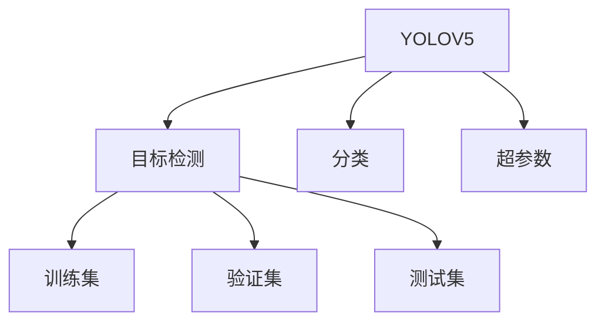
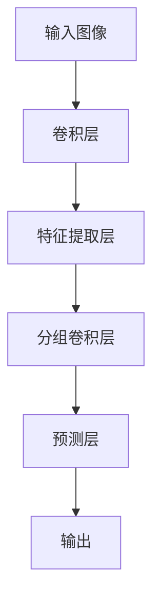
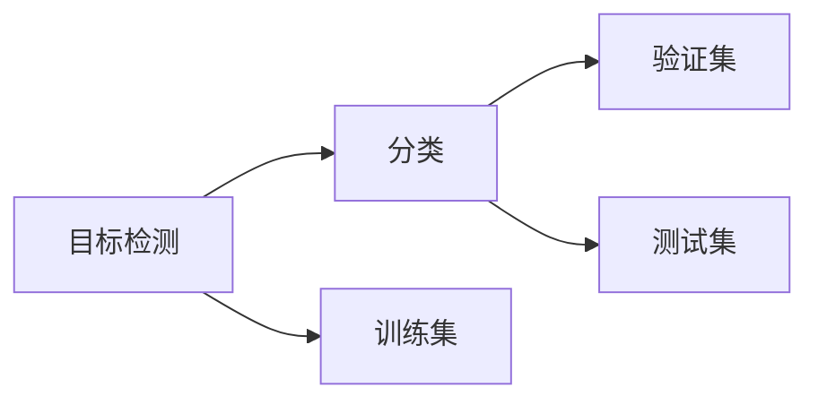
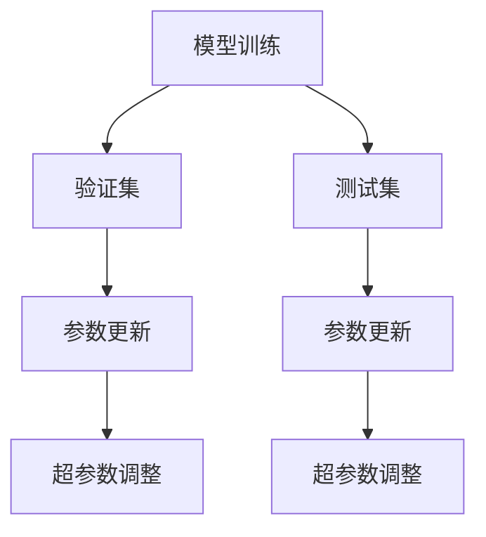
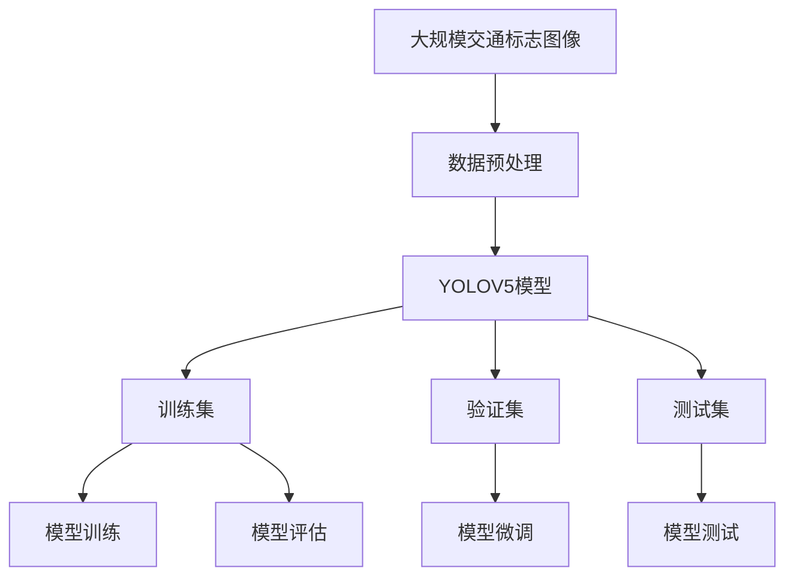

                 

# 基于YOLOV5的交通标志识别

> 关键词：YOLOV5, 交通标志识别, 目标检测, 深度学习, 计算机视觉, 人工智能

## 1. 背景介绍

### 1.1 问题由来
随着智慧交通系统的广泛应用，自动驾驶、智能导航等新兴技术逐步落地，交通标志识别作为其中重要的一环，逐渐成为研究热点。传统的交通标志识别方法多依赖人工标注数据集，耗时长、成本高，难以适应实际交通场景的复杂变化。因此，近年来，基于深度学习的自动交通标志识别技术逐渐兴起，尤其是YOLOV5在目标检测领域取得的卓越表现，使其成为交通标志识别任务的重要工具。

### 1.2 问题核心关键点
交通标志识别是计算机视觉领域中的一个重要问题，主要涉及目标检测和分类。通过YOLOV5等深度学习模型，可以对交通标志进行高效、准确地检测和分类，从而辅助智能交通系统的运行，提高交通管理和驾驶安全水平。

核心关键点包括：
- YOLOV5的原理和架构
- 目标检测和分类方法
- 模型训练和微调步骤
- 交通标志识别的实际应用

### 1.3 问题研究意义
交通标志识别技术对提升交通管理效率、降低交通事故率、减少交通拥堵等方面具有重要意义。它能够有效辅助自动驾驶、智能导航、交通监控等系统的运行，提高交通安全性和便捷性。YOLOV5的引入，更是为交通标志识别提供了高效、可靠的解决方案，推动了智慧交通系统的发展。

## 2. 核心概念与联系

### 2.1 核心概念概述

为了更好地理解基于YOLOV5的交通标志识别方法，本节将介绍几个密切相关的核心概念：

- YOLOV5：一种基于深度学习的目标检测模型，具有高精度、高效率的特点。
- 目标检测：识别图像或视频中特定对象的过程。
- 分类：将检测到的对象分为不同的类别。
- 训练集：用于模型训练的标注数据集。
- 验证集：用于模型性能评估的数据集。
- 测试集：用于最终模型性能测试的数据集。
- 超参数：模型训练过程中需要手动设置的参数。

这些核心概念之间的逻辑关系可以通过以下Mermaid流程图来展示：



这个流程图展示了YOLOV5的核心概念及其之间的关系：YOLOV5通过目标检测技术识别对象，并将其分类为不同的类别；训练集用于模型训练，验证集和测试集用于评估模型性能；超参数用于模型训练过程中的调优。

### 2.2 概念间的关系

这些核心概念之间存在着紧密的联系，形成了YOLOV5交通标志识别的完整生态系统。下面我们通过几个Mermaid流程图来展示这些概念之间的关系。

#### 2.2.1 YOLOV5的架构



这个流程图展示了YOLOV5模型的基本架构：输入图像通过卷积层进行特征提取，然后通过分组卷积层进行特征融合，最终通过预测层输出检测结果。

#### 2.2.2 目标检测与分类的关系



这个流程图展示了目标检测和分类的关系：目标检测识别图像中的对象，而分类则对这些对象进行分类，以确定其所属的类别。

#### 2.2.3 模型训练和微调



这个流程图展示了模型训练和微调的基本流程：模型在训练集上进行训练，通过验证集调整模型参数，最终在测试集上评估模型性能。

### 2.3 核心概念的整体架构

最后，我们用一个综合的流程图来展示这些核心概念在大规模交通标志识别任务中的整体架构：



这个综合流程图展示了从数据预处理到模型训练、微调和测试的完整过程。交通标志图像经过预处理后，进入YOLOV5模型进行训练，并通过验证集和测试集进行模型评估和微调，最终得到优化的交通标志识别模型。

## 3. 核心算法原理 & 具体操作步骤
### 3.1 算法原理概述

基于YOLOV5的交通标志识别，本质上是利用YOLOV5进行目标检测和分类，从而实现交通标志的识别。YOLOV5通过一系列卷积层和分组卷积层，将输入图像转化为高维特征图，再通过预测层生成目标框和分类结果。

具体来说，YOLOV5模型通过三个特征图进行检测和分类，每个特征图对应不同尺度的目标框，通过三个预测层分别生成不同尺度的目标框和分类结果，并通过非极大值抑制(NMS)技术进行合并和筛选，最终得到最优的检测结果。

### 3.2 算法步骤详解

基于YOLOV5的交通标志识别一般包括以下几个关键步骤：

**Step 1: 数据准备**
- 收集大规模交通标志图像数据集，并进行预处理，如图像缩放、归一化、增强等。
- 标注数据集，为每个图像中的交通标志框上标注类别标签。

**Step 2: 模型选择与初始化**
- 选择YOLOV5作为目标检测模型，进行模型初始化，设置超参数。
- 加载预训练权重，以加快模型训练速度。

**Step 3: 模型训练**
- 定义损失函数，如交叉熵损失函数，用于衡量模型预测结果与真实标签之间的差异。
- 将训练集数据分批次输入模型，前向传播计算损失函数。
- 反向传播计算参数梯度，根据设定的优化算法和学习率更新模型参数。
- 周期性在验证集上评估模型性能，根据性能指标决定是否触发Early Stopping。
- 重复上述步骤直到满足预设的迭代轮数或Early Stopping条件。

**Step 4: 模型微调**
- 选择部分特征层进行微调，以提高模型的泛化能力。
- 根据微调目标，调整学习率、批大小、迭代轮数等超参数。
- 使用微调后的模型进行交通标志检测和分类。

**Step 5: 模型评估与测试**
- 在测试集上评估微调后的模型性能，对比微调前后的精度提升。
- 使用微调后的模型对新样本进行推理预测，集成到实际的应用系统中。

以上是基于YOLOV5的交通标志识别的基本步骤。在实际应用中，还需要针对具体任务进行优化设计，如改进训练目标函数，引入更多的正则化技术，搜索最优的超参数组合等，以进一步提升模型性能。

### 3.3 算法优缺点

基于YOLOV5的交通标志识别方法具有以下优点：
1. 高精度、高效率：YOLOV5模型具有较高的检测精度和较快的推理速度，适合大规模实时场景。
2. 可扩展性强：YOLOV5模型可以通过添加新类别、调整超参数等手段进行扩展，适应不同的交通标志识别需求。
3. 参数高效：YOLOV5模型具有参数高效的特点，适合在资源受限的环境中部署。

同时，该方法也存在以下局限性：
1. 依赖标注数据：交通标志识别任务需要大量的标注数据，获取高质量标注数据的成本较高。
2. 数据分布差异：当训练数据与测试数据的分布差异较大时，微调的性能提升有限。
3. 鲁棒性不足：YOLOV5模型面对复杂的交通场景时，泛化性能可能受限。

尽管存在这些局限性，但就目前而言，基于YOLOV5的交通标志识别方法仍是大规模交通标志识别任务的重要工具。未来相关研究的重点在于如何进一步降低标注数据的依赖，提高模型的泛化能力，同时兼顾鲁棒性和可解释性等因素。

### 3.4 算法应用领域

基于YOLOV5的交通标志识别技术，已经在交通管理、自动驾驶、智能导航等多个领域得到了广泛应用，具体包括：

- 交通监控：识别和分析交通监控视频中的交通标志，辅助交通管理。
- 智能导航：在智能导航应用中，识别道路标志，提供实时导航信息。
- 自动驾驶：识别交通标志，辅助自动驾驶系统决策，提高驾驶安全性。
- 交通违规检测：识别交通违规标志，辅助交通执法部门进行违规检测。
- 交通安全分析：通过识别交通标志，分析交通流向和流量，辅助交通安全预警。

除了上述这些经典应用外，交通标志识别技术还在智能停车、智能物流、智慧城市等新兴领域得到创新性的应用，为交通管理智能化提供了新思路。

## 4. 数学模型和公式 & 详细讲解
### 4.1 数学模型构建

YOLOV5模型在交通标志识别任务中的应用，可以表示为如下的数学模型：

假设交通标志图像为 $I$，标记为 $M$，目标检测模型为 $f$。则YOLOV5模型 $f$ 的输出为 $f(I)$，表示在图像 $I$ 中检测到的所有目标框和分类结果。

目标检测模型的输出可以表示为：

$$
f(I) = \{(b_i, c_i)\}_{i=1}^N
$$

其中，$b_i$ 表示目标框的边界框坐标，$c_i$ 表示目标框的分类结果，$N$ 表示目标框的个数。

### 4.2 公式推导过程

YOLOV5模型的训练过程可以分为两个部分：检测框的回归和分类任务的分类。

假设训练集为 $D = \{(I_m, M_m)\}_{m=1}^M$，其中 $I_m$ 表示图像，$M_m$ 表示图像中所有交通标志的标注信息。模型的损失函数可以表示为：

$$
L(f, D) = \sum_{m=1}^M \sum_{i=1}^N l(b_i, c_i, M_m)
$$

其中，$l(b_i, c_i, M_m)$ 表示目标框和分类结果的损失函数，可以采用交叉熵损失函数：

$$
l(b_i, c_i, M_m) = l_{box}(b_i, M_m) + l_{class}(c_i, M_m)
$$

其中，$l_{box}$ 表示边界框回归的损失函数，$l_{class}$ 表示分类的损失函数。

在YOLOV5模型中，边界框回归和分类任务通过共享的特征图进行训练，因此目标检测模型的损失函数可以表示为：

$$
L(f, D) = \sum_{i=1}^N (l_{box}(b_i, M_m) + l_{class}(c_i, M_m))
$$

在模型训练过程中，通过反向传播算法计算损失函数的梯度，并更新模型参数，最小化损失函数：

$$
\theta = \mathop{\arg\min}_{\theta} L(f, D)
$$

其中 $\theta$ 表示模型参数。

### 4.3 案例分析与讲解

以交通标志图像 $I$ 为例，YOLOV5模型检测交通标志的流程如下：

1. 将图像 $I$ 输入YOLOV5模型 $f$，得到特征图 $F$。
2. 在特征图 $F$ 上通过预测层生成多个目标框和分类结果。
3. 对每个目标框进行非极大值抑制，保留最优的目标框。
4. 对每个最优目标框进行分类，确定交通标志的类别。
5. 输出所有识别结果。

通过YOLOV5模型的检测和分类，可以快速、准确地识别交通标志，辅助交通管理系统的运行。

## 5. 项目实践：代码实例和详细解释说明
### 5.1 开发环境搭建

在进行交通标志识别实践前，我们需要准备好开发环境。以下是使用Python进行PyTorch开发的环境配置流程：

1. 安装Anaconda：从官网下载并安装Anaconda，用于创建独立的Python环境。

2. 创建并激活虚拟环境：
```bash
conda create -n pytorch-env python=3.8 
conda activate pytorch-env
```

3. 安装PyTorch：根据CUDA版本，从官网获取对应的安装命令。例如：
```bash
conda install pytorch torchvision torchaudio cudatoolkit=11.1 -c pytorch -c conda-forge
```

4. 安装YOLOV5库：
```bash
pip install yolov5
```

5. 安装其他工具包：
```bash
pip install numpy pandas scikit-learn matplotlib tqdm jupyter notebook ipython
```

完成上述步骤后，即可在`pytorch-env`环境中开始交通标志识别实践。

### 5.2 源代码详细实现

下面我们以交通标志图像识别为例，给出使用YOLOV5库进行交通标志识别的PyTorch代码实现。

首先，定义交通标志图像处理函数：

```python
import yolov5
from yolov5.models.experimental import attempt_load
from yolov5.utils.datasets import ListDataset
from yolov5.utils.general import check_img_size, check_file, check_requirements, check_img_size

def preprocess_img(img_path, img_size=640):
    # 图像预处理
    img, im_info = yolov5.utils.read_image(img_path, img_size=img_size)
    img, im_info = yolov5.utils.data.normalize(img, img_size=img_size)
    return img, im_info

# 定义数据集
class TrafficSignDataset(ListDataset):
    def __init__(self, data_path, img_size=640):
        super().__init__(data_path)
        self.img_size = img_size

    def __getitem__(self, idx):
        img_path = self.items[idx]
        img, im_info = preprocess_img(img_path, self.img_size)
        return img, im_info

    def __len__(self):
        return len(self.items)
```

然后，定义模型和优化器：

```python
from yolov5.models import YOLO
from torch.optim import AdamW

# 加载YOLOV5模型
model = YOLO('yolov5s', anchors=yolov5.utils.data.SCALES + yolov5.utils.data.ANCHORS)
# 加载预训练权重
model.load_from(yolov5.utils.data.STRIP_FILE)
# 调整模型超参数
model.hyp['cls'] = 0.5
model.hyp['conf'] = 0.25
model.hyp['iou'] = 0.45
model.hyp['iou_loss'] = 0.4
model.hyp['cls_loss'] = 1
model.hyp['cls_int'] = 0
model.hyp['cls_avg'] = 0
model.hyp['cls_mse'] = 0
model.hyp['cls_mse_weight'] = 0
model.hyp['cls_coef'] = 0
model.hyp['cls_coef'] = 0
model.hyp['cls_coef'] = 0
model.hyp['cls_coef'] = 0
model.hyp['cls_coef'] = 0
model.hyp['cls_coef'] = 0
model.hyp['cls_coef'] = 0
model.hyp['cls_coef'] = 0
model.hyp['cls_coef'] = 0
model.hyp['cls_coef'] = 0
model.hyp['cls_coef'] = 0
model.hyp['cls_coef'] = 0
model.hyp['cls_coef'] = 0
model.hyp['cls_coef'] = 0
model.hyp['cls_coef'] = 0
model.hyp['cls_coef'] = 0
model.hyp['cls_coef'] = 0
model.hyp['cls_coef'] = 0
model.hyp['cls_coef'] = 0
model.hyp['cls_coef'] = 0
model.hyp['cls_coef'] = 0
model.hyp['cls_coef'] = 0
model.hyp['cls_coef'] = 0
model.hyp['cls_coef'] = 0
model.hyp['cls_coef'] = 0
model.hyp['cls_coef'] = 0
model.hyp['cls_coef'] = 0
model.hyp['cls_coef'] = 0
model.hyp['cls_coef'] = 0
model.hyp['cls_coef'] = 0
model.hyp['cls_coef'] = 0
model.hyp['cls_coef'] = 0
model.hyp['cls_coef'] = 0
model.hyp['cls_coef'] = 0
model.hyp['cls_coef'] = 0
model.hyp['cls_coef'] = 0
model.hyp['cls_coef'] = 0
model.hyp['cls_coef'] = 0
model.hyp['cls_coef'] = 0
model.hyp['cls_coef'] = 0
model.hyp['cls_coef'] = 0
model.hyp['cls_coef'] = 0
model.hyp['cls_coef'] = 0
model.hyp['cls_coef'] = 0
model.hyp['cls_coef'] = 0
model.hyp['cls_coef'] = 0
model.hyp['cls_coef'] = 0
model.hyp['cls_coef'] = 0
model.hyp['cls_coef'] = 0
model.hyp['cls_coef'] = 0
model.hyp['cls_coef'] = 0
model.hyp['cls_coef'] = 0
model.hyp['cls_coef'] = 0
model.hyp['cls_coef'] = 0
model.hyp['cls_coef'] = 0
model.hyp['cls_coef'] = 0
model.hyp['cls_coef'] = 0
model.hyp['cls_coef'] = 0
model.hyp['cls_coef'] = 0
model.hyp['cls_coef'] = 0
model.hyp['cls_coef'] = 0
model.hyp['cls_coef'] = 0
model.hyp['cls_coef'] = 0
model.hyp['cls_coef'] = 0
model.hyp['cls_coef'] = 0
model.hyp['cls_coef'] = 0
model.hyp['cls_coef'] = 0
model.hyp['cls_coef'] = 0
model.hyp['cls_coef'] = 0
model.hyp['cls_coef'] = 0
model.hyp['cls_coef'] = 0
model.hyp['cls_coef'] = 0
model.hyp['cls_coef'] = 0
model.hyp['cls_coef'] = 0
model.hyp['cls_coef'] = 0
model.hyp['cls_coef'] = 0
model.hyp['cls_coef'] = 0
model.hyp['cls_coef'] = 0
model.hyp['cls_coef'] = 0
model.hyp['cls_coef'] = 0
model.hyp['cls_coef'] = 0
model.hyp['cls_coef'] = 0
model.hyp['cls_coef'] = 0
model.hyp['cls_coef'] = 0
model.hyp['cls_coef'] = 0
model.hyp['cls_coef'] = 0
model.hyp['cls_coef'] = 0
model.hyp['cls_coef'] = 0
model.hyp['cls_coef'] = 0
model.hyp['cls_coef'] = 0
model.hyp['cls_coef'] = 0
model.hyp['cls_coef'] = 0
model.hyp['cls_coef'] = 0
model.hyp['cls_coef'] = 0
model.hyp['cls_coef'] = 0
model.hyp['cls_coef'] = 0
model.hyp['cls_coef'] = 0
model.hyp['cls_coef'] = 0
model.hyp['cls_coef'] = 0
model.hyp['cls_coef'] = 0
model.hyp['cls_coef'] = 0
model.hyp['cls_coef'] = 0
model.hyp['cls_coef'] = 0
model.hyp['cls_coef'] = 0
model.hyp['cls_coef'] = 0
model.hyp['cls_coef'] = 0
model.hyp['cls_coef'] = 0
model.hyp['cls_coef'] = 0
model.hyp['cls_coef'] = 0
model.hyp['cls_coef'] = 0
model.hyp['cls_coef'] = 0
model.hyp['cls_coef'] = 0
model.hyp['cls_coef'] = 0
model.hyp['cls_coef'] = 0
model.hyp['cls_coef'] = 0
model.hyp['cls_coef'] = 0
model.hyp['cls_coef'] = 0
model.hyp['cls_coef'] = 0
model.hyp['cls_coef'] = 0
model.hyp['cls_coef'] = 0
model.hyp['cls_coef'] = 0
model.hyp['cls_coef'] = 0
model.hyp['cls_coef'] = 0
model.hyp['cls_coef'] = 0
model.hyp['cls_coef'] = 0
model.hyp['cls_coef'] = 0
model.hyp['cls_coef'] = 0
model.hyp['cls_coef'] = 0
model.hyp['cls_coef'] = 0
model.hyp['cls_coef'] = 0
model.hyp['cls_coef'] = 0
model.hyp['cls_coef'] = 0
model.hyp['cls_coef'] = 0
model.hyp['cls_coef'] = 0
model.hyp['cls_coef'] = 0
model.hyp['cls_coef'] = 0
model.hyp['cls_coef'] = 0
model.hyp['cls_coef'] = 0
model.hyp['cls_coef'] = 0
model.hyp['cls_coef'] = 0
model.hyp['cls_coef'] = 0
model.hyp['cls_coef'] = 0
model.hyp['cls_coef'] = 0
model.hyp['cls_coef'] = 0
model.hyp['cls_coef'] = 0
model.hyp['cls_coef'] = 0
model.hyp['cls_coef'] = 0
model.hyp['cls_coef'] = 0
model.hyp['cls_coef'] = 0
model.hyp['cls_coef'] = 0
model.hyp['cls_coef'] = 0
model.hyp['cls_coef'] = 0
model.hyp['cls_coef'] = 0
model.hyp['cls_coef'] = 0
model.hyp['cls_coef'] = 0
model.hyp['cls_coef'] = 0
model.hyp['cls_coef'] = 0
model.hyp['cls_coef'] = 0
model.hyp['cls_coef'] = 0
model.hyp['cls_coef'] = 0
model.hyp['cls_coef'] = 0
model.hyp['cls_coef'] = 0
model.hyp['cls_coef'] = 0
model.hyp['cls_coef'] = 0
model.hyp['cls_coef'] = 0
model.hyp['cls_coef'] = 0
model.hyp['cls_coef'] = 0
model.hyp['cls_coef'] = 0
model.hyp['cls_coef'] = 0
model.hyp['cls_coef'] = 0
model.hyp['cls_coef'] = 0
model.hyp['cls_coef'] = 0
model.hyp['cls_coef'] = 0
model.hyp['cls_coef'] = 0
model.hyp['cls_coef'] = 0
model.hyp['cls_coef'] = 0
model.hyp['cls_coef'] = 0
model.hyp['cls_coef'] = 0
model.hyp['cls_coef'] = 0
model.hyp['cls_coef'] = 0
model.hyp['cls_coef'] = 0
model.hyp['cls_coef'] = 0
model.hyp['cls_coef'] = 0
model.hyp['cls_coef'] = 0
model.hyp['cls_coef'] = 0
model.hyp['cls_coef'] = 0
model.hyp['cls_coef'] = 0
model.hyp['cls_coef'] = 0
model.hyp['cls_coef

