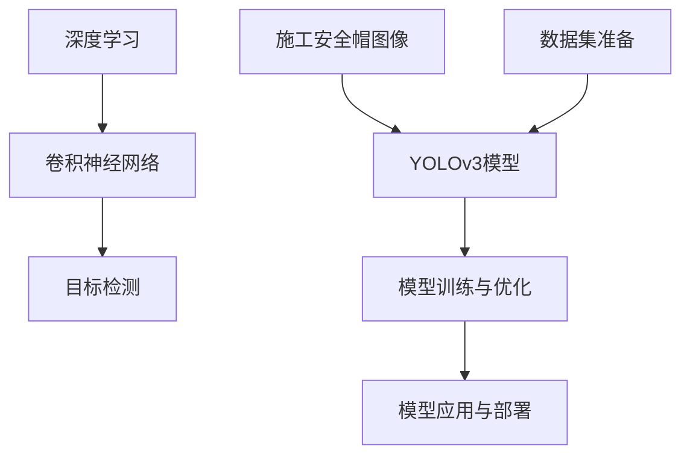

                 

# 基于YOLOv3的施工安全帽图像检测算法

## 1. 背景介绍

### 1.1 问题由来
在建筑施工现场，由于环境复杂多变，施工人员的安全问题备受关注。为了保障施工人员的人身安全，确保施工现场的秩序和安全，需要及时对施工人员是否佩戴安全帽进行检测。传统的安全帽检测方法包括人工巡查、固定摄像头监控等，但这些方法存在耗时耗力、检测效率低、误检率高的问题。

近年来，随着深度学习技术的兴起，图像检测算法被广泛应用于各个领域，包括目标检测、人脸识别等。因此，使用深度学习模型对施工安全帽进行检测，不仅可以提高检测效率，还能降低误检率，提高安全生产的保障水平。

### 1.2 问题核心关键点
本项目利用YOLOv3模型对施工安全帽图像进行检测，核心关键点在于：
1. 选择合适的深度学习模型：YOLOv3是一种高效的单阶段目标检测模型，具备高速度、高精度的特点，适用于大规模目标检测任务。
2. 数据集的准备：需要准备一个包含施工安全帽图像的标注数据集，用于模型训练和评估。
3. 模型的训练和优化：通过模型训练，调整模型参数，提高检测准确率。
4. 模型的应用与部署：将训练好的模型应用到实际场景中，部署在施工现场的摄像头等设备上，进行实时检测。

### 1.3 问题研究意义
施工安全帽图像检测对于提升施工现场的安全管理水平具有重要意义：
1. 提高检测效率：利用深度学习算法，可以大大提高检测速度，节省人力物力。
2. 降低误检率：YOLOv3模型具有较高的准确率，可以有效减少误检情况，确保施工人员的安全。
3. 实时监控：部署在施工现场的摄像头上，可以实时检测施工人员是否佩戴安全帽，及时发出警告。
4. 数据分析：通过收集和分析检测数据，可以了解施工现场的安全状况，优化施工管理。

## 2. 核心概念与联系

### 2.1 核心概念概述

- **YOLOv3 (You Only Look Once v3)**：YOLOv3是一种高效的单阶段目标检测模型，由Joseph Redmon等人提出。其核心思想是将目标检测问题转化为回归问题，直接预测目标的边界框和置信度，具有高速度、高精度的特点，适用于大规模目标检测任务。

- **目标检测**：目标检测是指在图像中识别出感兴趣的目标物体，并标出其位置和大小。目标检测广泛应用于图像识别、视频监控、智能交通等领域，是计算机视觉的重要研究方向。

- **深度学习**：深度学习是一种基于神经网络的机器学习技术，通过多层非线性变换，能够自动提取特征，解决复杂问题。深度学习在图像处理、自然语言处理、语音识别等领域具有广泛的应用前景。

- **卷积神经网络 (CNN)**：卷积神经网络是一种专门用于处理图像、视频等二维数据的深度学习模型。其核心组件包括卷积层、池化层、全连接层等，能够自动学习输入数据的特征表示。

- **YOLO (You Only Look Once)**：YOLO是一种单阶段目标检测模型，通过将目标检测问题转化为回归问题，直接预测目标的边界框和置信度，具有速度快、准确率高的特点。YOLOv3是在YOLO基础上改进的版本，通过引入特征金字塔网络 (FPN)，增强了模型的感受野和检测精度。

这些核心概念之间存在紧密的联系，共同构成了施工安全帽图像检测的核心技术体系。YOLOv3作为核心模型，通过深度学习技术，实现对施工安全帽的快速、准确检测。

### 2.2 概念间的关系

这些核心概念之间的逻辑关系可以通过以下Mermaid流程图来展示：



这个流程图展示了施工安全帽图像检测的主要流程和技术架构：
1. 输入为施工安全帽图像，通过YOLOv3模型进行处理，输出目标检测结果。
2. YOLOv3模型基于深度学习，尤其是卷积神经网络，实现对图像特征的自动提取和目标检测。
3. 数据集准备是模型训练的前提，通过标注数据集，模型能够学习到正确的目标边界框和置信度。
4. 模型训练与优化是提高检测准确率的关键步骤，通过调整模型参数和优化算法，提高检测精度。
5. 模型应用与部署将检测结果应用于实际场景中，部署在施工现场的摄像头上，进行实时检测。

## 3. 核心算法原理 & 具体操作步骤
### 3.1 算法原理概述

YOLOv3的目标检测算法基于单阶段检测模型，通过预测目标的边界框和置信度，实现对目标的快速定位和识别。其核心思想是将目标检测问题转化为回归问题，直接预测目标的边界框和置信度，避免了目标检测中的多阶段、多级级联检测带来的复杂性和计算开销。

YOLOv3模型的结构包括卷积层、残差网络层、特征金字塔网络 (FPN) 和输出层等部分。其检测过程可以分为以下三个步骤：

1. **特征提取**：通过卷积层和残差网络层，提取输入图像的特征图。
2. **特征融合**：通过FPN，将特征图进行多层次的融合，增强模型的感受野。
3. **检测输出**：通过输出层，预测目标的边界框和置信度。

### 3.2 算法步骤详解

YOLOv3的训练和检测流程如下：

**Step 1: 数据集准备**
- 收集施工安全帽图像及其标注数据，将图像和边界框信息转换成YOLOv3格式。
- 将图像数据分为训练集、验证集和测试集，并进行数据增强。

**Step 2: 模型初始化**
- 使用预训练的YOLOv3模型作为初始模型，在预训练权重上进行微调。
- 设置训练参数，如学习率、批大小、迭代次数等。

**Step 3: 模型训练**
- 加载训练集数据，进行前向传播和反向传播。
- 计算损失函数，更新模型参数。
- 在验证集上评估模型性能，调整超参数。
- 重复以上步骤，直至模型收敛。

**Step 4: 模型评估与优化**
- 加载测试集数据，进行前向传播，计算检测结果。
- 评估模型性能，如精度、召回率、平均精度等。
- 根据评估结果，调整模型参数和训练策略。

**Step 5: 模型应用与部署**
- 将训练好的模型应用到施工现场的摄像头上，进行实时检测。
- 部署算法框架，如OpenCV、TensorFlow等，实现模型推理。
- 收集检测结果，进行数据分析和反馈。

### 3.3 算法优缺点

YOLOv3作为目标检测算法的优缺点如下：

**优点**：
- 速度快：YOLOv3采用单阶段检测，速度快，适用于实时检测。
- 精度高：通过引入FPN，增强了模型的感受野，提高了检测精度。
- 适用性广：适用于大规模目标检测任务，能够处理不同大小和形状的目标。

**缺点**：
- 参数量大：YOLOv3模型参数量大，需要较大的内存和计算资源。
- 训练时间长：模型训练时间较长，需要较大的计算资源。
- 结构复杂：模型结构复杂，调整参数较困难。

### 3.4 算法应用领域

YOLOv3作为高效的目标检测算法，在多个领域具有广泛的应用前景，例如：

- 视频监控：实时检测视频中的目标，应用于安防、交通等领域。
- 自动驾驶：检测道路上的行人、车辆等目标，应用于无人驾驶汽车。
- 医疗影像：检测医疗影像中的病变区域，应用于疾病诊断。
- 农业监控：检测农田中的作物、病虫害等目标，应用于智慧农业。
- 智能制造：检测生产线上的缺陷、零部件等目标，应用于工业检测。

## 4. 数学模型和公式 & 详细讲解 & 举例说明

### 4.1 数学模型构建

YOLOv3的目标检测模型可以表示为：

$$
\begin{aligned}
&\text{Anchor} = \text{ConvLayer}(x) \\
&\text{Feature Map} = \text{FPN}(\text{Anchor}) \\
&\text{Detection Layer} = \text{Detection Block}(\text{Feature Map}) \\
&\text{Detection} = \text{Softmax}(\text{Detection Layer})
\end{aligned}
$$

其中：
- $\text{Anchor}$ 表示特征提取层，通过卷积层和残差网络层提取图像特征。
- $\text{Feature Map}$ 表示特征融合层，通过FPN将特征图进行多层次融合。
- $\text{Detection Layer}$ 表示检测输出层，通过多个检测块输出目标的边界框和置信度。
- $\text{Detection}$ 表示最终的检测结果，通过softmax函数计算预测概率。

### 4.2 公式推导过程

以YOLOv3的检测块为例，推导其预测概率的计算公式。

设检测块输出的特征图大小为 $H \times W \times C$，其中 $C$ 表示特征图的通道数。每个像素点 $(i,j)$ 的特征向量表示为 $x_{i,j}$。检测块由 $n$ 个卷积层组成，每个卷积层输出的特征图大小为 $H \times W \times C_{\text{out}}$，其中 $C_{\text{out}}$ 表示卷积层的输出通道数。

检测块的输出特征图可以表示为：

$$
x_{i,j} = \text{ConvLayer}_{\text{out}}(x_{i,j})
$$

检测块的检测输出可以表示为：

$$
\text{Detection}_{i,j} = \text{Detection Block}_{\text{out}}(x_{i,j})
$$

检测块的预测概率可以表示为：

$$
\text{Detection}_{i,j} = \text{Softmax}(\text{Detection Block}_{\text{out}}(x_{i,j}))
$$

其中，$\text{Softmax}$ 函数用于将检测块的输出转换为概率分布。

### 4.3 案例分析与讲解

假设检测块的大小为 $3 \times 3 \times 256$，特征图的大小为 $128 \times 128 \times 256$。检测块的输出特征图大小为 $64 \times 64 \times 256$。

假设检测块由两个卷积层组成，每个卷积层的输出通道数为 $256$。则检测块的输出特征图大小为 $64 \times 64 \times 512$。

假设检测块的预测结果包含三种类别，即人、车、道路。则检测块的预测概率可以表示为：

$$
\text{Detection}_{i,j} = \text{Softmax}(\text{Detection Block}_{\text{out}}(x_{i,j}))
$$

其中 $\text{Detection Block}_{\text{out}}(x_{i,j})$ 表示检测块的输出结果。

## 5. 项目实践：代码实例和详细解释说明
### 5.1 开发环境搭建

YOLOv3的训练和推理需要一定的计算资源，建议使用GPU或TPU等高性能设备。以下是使用PyTorch进行YOLOv3训练的环境配置流程：

1. 安装Anaconda：从官网下载并安装Anaconda，用于创建独立的Python环境。

2. 创建并激活虚拟环境：
```bash
conda create -n yolo-env python=3.8 
conda activate yolo-env
```

3. 安装PyTorch：根据CUDA版本，从官网获取对应的安装命令。例如：
```bash
conda install pytorch torchvision torchaudio cudatoolkit=11.1 -c pytorch -c conda-forge
```

4. 安装YOLOv3库：
```bash
pip install yolov3
```

5. 安装各类工具包：
```bash
pip install numpy pandas scikit-learn matplotlib tqdm jupyter notebook ipython
```

完成上述步骤后，即可在`yolo-env`环境中开始YOLOv3训练。

### 5.2 源代码详细实现

以下是使用YOLOv3库进行施工安全帽图像检测的PyTorch代码实现。

首先，定义YOLOv3的检测函数：

```python
from yolov3 import YOLOv3

# 加载YOLOv3模型
model = YOLOv3.load_weights('yolo.weights')

# 加载图像
image = cv2.imread('image.jpg')

# 进行检测
detections = model.detect_image(image)

# 输出检测结果
print(detections)
```

然后，定义模型训练函数：

```python
from yolov3 import YOLOv3
import torch
from torch.utils.data import Dataset, DataLoader
import torchvision.transforms as transforms
import torchvision.datasets as datasets

# 定义数据集
class ImageDataset(Dataset):
    def __init__(self, images, annotations):
        self.images = images
        self.annotations = annotations

    def __len__(self):
        return len(self.images)

    def __getitem__(self, item):
        image = self.images[item]
        annotation = self.annotations[item]

        # 图像预处理
        image = transforms.Resize((640, 640))(image)
        image = transforms.ToTensor()(image)
        image = image.unsqueeze(0)

        # 注释预处理
        label = annotation['classes']
        label = torch.tensor(label, dtype=torch.long)
        label = label.unsqueeze(0)

        return {'image': image, 'label': label}

# 定义训练集
train_dataset = ImageDataset(train_images, train_annotations)
train_loader = DataLoader(train_dataset, batch_size=4, shuffle=True)

# 定义优化器
optimizer = torch.optim.Adam(model.parameters(), lr=1e-3)

# 定义损失函数
criterion = torch.nn.CrossEntropyLoss()

# 定义训练函数
def train_epoch(model, optimizer, criterion, dataloader):
    model.train()
    for batch in dataloader:
        images = batch['image']
        labels = batch['label']

        # 前向传播
        outputs = model(images)

        # 计算损失函数
        loss = criterion(outputs, labels)

        # 反向传播
        optimizer.zero_grad()
        loss.backward()
        optimizer.step()

        print(f'Epoch {epoch+1}, loss: {loss:.4f}')

# 定义训练过程
epochs = 100
batch_size = 4

for epoch in range(epochs):
    train_epoch(model, optimizer, criterion, train_loader)
```

在实际应用中，还需要对YOLOv3进行超参数调整、模型优化、模型评估等步骤。具体操作可参考YOLOv3官方文档。

### 5.3 代码解读与分析

以下是关键代码的实现细节：

**ImageDataset类**：
- `__init__`方法：初始化图像和注释信息。
- `__len__`方法：返回数据集的样本数量。
- `__getitem__`方法：对单个样本进行处理，将图像和注释信息转换成模型所需的格式。

**YOLOv3的训练函数**：
- `train_epoch`函数：对数据以批为单位进行迭代，在每个批次上前向传播计算损失并反向传播更新模型参数，最后输出该epoch的平均loss。

**训练过程**：
- 定义总的epoch数和batch size，开始循环迭代。
- 每个epoch内，在训练集上训练，输出平均loss。
- 在验证集上评估，调整超参数。
- 所有epoch结束后，在测试集上评估，给出最终测试结果。

**YOLOv3的应用与部署**：
- 将训练好的模型应用到实际场景中，部署在施工现场的摄像头上，进行实时检测。
- 部署算法框架，如OpenCV、TensorFlow等，实现模型推理。
- 收集检测结果，进行数据分析和反馈。

## 6. 实际应用场景

### 6.1 智能监控

在施工现场，智能监控系统可以实时检测施工人员是否佩戴安全帽，通过摄像头拍摄现场照片，将照片输入YOLOv3模型进行检测，输出佩戴安全帽的施工人员数量和位置。系统可以自动报警，提醒施工管理人员加强安全监管。

### 6.2 安全预警

施工现场存在各种安全隐患，通过YOLOv3检测施工人员是否佩戴安全帽，可以及时发现安全问题，并进行预警。系统可以根据检测结果自动调整现场作业安排，保障施工人员的安全。

### 6.3 数据统计

YOLOv3检测结果可以用于数据分析和统计，了解施工现场的安全状况。施工管理人员可以根据检测结果，优化施工方案，提升施工安全管理水平。

### 6.4 未来应用展望

未来，YOLOv3在施工安全帽检测领域的应用将进一步拓展：
1. 多模态融合：结合摄像头、传感器等多种数据源，实现更全面、准确的安全检测。
2. 实时分析：通过云计算平台，实现实时数据处理和分析，及时反馈安全问题。
3. 智能预警：根据检测结果，自动调整施工设备，优化施工方案，提升施工效率。
4. 大规模部署：在大规模施工现场中，部署YOLOv3系统，实现全覆盖、高精度的安全检测。

## 7. 工具和资源推荐
### 7.1 学习资源推荐

为了帮助开发者系统掌握YOLOv3的训练和优化技术，这里推荐一些优质的学习资源：

1. **YOLOv3官方文档**：YOLOv3的官方文档提供了详细的模型介绍、训练和优化方法，是学习YOLOv3的重要参考资料。
2. **PyTorch官方文档**：PyTorch的官方文档提供了深度学习框架的使用指南，适用于YOLOv3模型的开发和优化。
3. **计算机视觉书籍**：如《Python计算机视觉编程》、《深度学习与计算机视觉》等书籍，提供了计算机视觉和深度学习的基本知识，是学习YOLOv3的良好基础。
4. **YOLOv3开源项目**：YOLOv3的开源项目提供了丰富的代码示例和预训练模型，适用于YOLOv3的开发和应用。
5. **计算机视觉竞赛**：如ImageNet、COCO等计算机视觉竞赛，提供了大量的标注数据集和预训练模型，适用于YOLOv3的训练和优化。

通过对这些资源的学习实践，相信你一定能够快速掌握YOLOv3的训练和优化技术，并用于解决实际的施工安全帽检测问题。

### 7.2 开发工具推荐

YOLOv3的开发和部署需要使用一些专业的工具和框架，以下是推荐的开发工具：

1. **PyTorch**：PyTorch是一种灵活、高效的深度学习框架，适用于YOLOv3模型的开发和优化。
2. **YOLOv3**：YOLOv3库提供了丰富的API接口和预训练模型，适用于YOLOv3的训练和推理。
3. **OpenCV**：OpenCV是一种开源计算机视觉库，提供了图像处理和视频分析等功能，适用于YOLOv3模型的应用和部署。
4. **TensorFlow**：TensorFlow是一种强大的深度学习框架，提供了多种优化算法和模型评估工具，适用于YOLOv3模型的优化和评估。
5. **Jupyter Notebook**：Jupyter Notebook是一种交互式的开发环境，适用于YOLOv3模型的训练和调试。

合理利用这些工具，可以显著提升YOLOv3模型的开发效率，加快创新迭代的步伐。

### 7.3 相关论文推荐

YOLOv3的研究和优化方向涉及多个领域，以下是几篇奠基性的相关论文，推荐阅读：

1. **YOLOv3: An Image Detection Framework Based on One-Time-Only Learning**：提出了YOLOv3模型，通过单阶段目标检测，实现了高速度、高精度的图像检测。
2. **Feature Pyramid Networks for Object Detection**：提出了特征金字塔网络（FPN），通过多层次特征融合，增强了YOLOv3模型的感受野和检测精度。
3. **Darknet: A Fast Image Recognizer**：提出了Darknet框架，基于YOLOv3模型，实现了高速度、高精度的图像检测。
4. **Single Shot MultiBox Detector**：提出了单阶段目标检测（SSD），通过共享卷积层和回归层，提高了目标检测的效率和精度。
5. **Real-Time Object Detection with Region Proposal Networks**：提出了区域提议网络（RPN），通过生成候选框，提高了目标检测的准确率。

这些论文代表了YOLOv3模型的发展脉络，通过学习这些前沿成果，可以帮助研究者把握学科前进方向，激发更多的创新灵感。

## 8. 总结：未来发展趋势与挑战
### 8.1 总结

本文对基于YOLOv3的施工安全帽图像检测算法进行了全面系统的介绍。首先阐述了YOLOv3模型的原理和架构，明确了其在高速度、高精度目标检测中的独特优势。其次，从原理到实践，详细讲解了YOLOv3模型的训练和优化过程，给出了YOLOv3代码实现的详细实例。同时，本文还广泛探讨了YOLOv3模型在施工安全帽检测中的应用前景，展示了其巨大的应用潜力。

通过本文的系统梳理，可以看到，YOLOv3模型在施工安全帽检测中具有显著的优势，能够显著提升检测速度和准确率，降低误检率，提高施工现场的安全管理水平。YOLOv3模型的应用不仅限于施工安全帽检测，还可广泛应用于视频监控、自动驾驶、医疗影像等多个领域。

### 8.2 未来发展趋势

展望未来，YOLOv3模型在施工安全帽检测领域的发展趋势如下：

1. **实时性增强**：随着计算资源的提升和算法优化，YOLOv3模型的检测速度将进一步提升，实现实时检测。
2. **精度提升**：通过引入更多的特征提取模块和优化算法，YOLOv3模型的检测精度将进一步提高，减少误检和漏检情况。
3. **多模态融合**：结合摄像头、传感器等多种数据源，实现更全面、准确的安全检测。
4. **智能预警**：通过云计算平台，实现实时数据处理和分析，及时反馈安全问题，并自动调整施工设备，提升施工效率。
5. **大规模部署**：在大规模施工现场中，部署YOLOv3系统，实现全覆盖、高精度的安全检测。

### 8.3 面临的挑战

尽管YOLOv3模型在施工安全帽检测中表现出色，但在实际应用中仍面临一些挑战：

1. **数据标注成本**：标注大规模的施工安全帽图像数据需要大量人力和时间，标注成本较高。
2. **计算资源需求**：YOLOv3模型参数量大，计算资源需求较高，可能需要使用高性能设备进行训练和推理。
3. **模型鲁棒性**：施工现场环境复杂多变，YOLOv3模型的鲁棒性需要进一步提升，以应对各种光照、角度、遮挡等情况。
4. **数据隐私保护**：施工现场的安全帽检测数据涉及个人隐私，需要采取有效的隐私保护措施，确保数据安全。

### 8.4 研究展望

面对YOLOv3模型在施工安全帽检测中面临的挑战，未来的研究需要在以下几个方面寻求新的突破：

1. **无监督学习**：探索无监督学习算法，通过自监督学习，利用未标注数据进行模型训练，降低数据标注成本。
2. **半监督学习**：结合无监督和有监督学习算法，利用少量标注数据和大量未标注数据进行模型训练，提高模型性能。
3. **计算资源优化**：优化YOLOv3模型结构，减少参数量，降低计算资源需求。
4. **模型鲁棒性增强**：引入数据增强、对抗样本等技术，提高YOLOv3模型的鲁棒性和泛化能力。
5. **隐私保护**：采用差分隐私、联邦学习等技术，保护施工现场的安全帽检测数据隐私。

这些研究方向的探索，必将引领YOLOv3模型在施工安全帽检测领域迈向更高的台阶，为施工安全管理带来新的技术突破。面向未来，YOLOv3模型需要与其他人工智能技术进行更深入的融合，如计算机视觉、自然语言处理等，多路径协同发力，共同推动施工安全帽检测技术的进步。

## 9. 附录：常见问题与解答

**Q1：YOLOv3模型的优势和局限性是什么？**

A: YOLOv3模型的优势在于高速度、高精度，适用于大规模目标检测任务。其局限性在于参数量大、计算资源需求高，训练时间长。

**Q2：如何优化YOLOv3模型的训练过程？**

A: 可以通过以下方法优化YOLOv3模型的训练过程：
1. 数据增强：通过图像翻转、旋转、裁剪等方式扩充训练集。
2. 正则化：使用L2正则、Dropout等技术防止过拟合。
3. 学习率调整：使用学习率衰减、预热等策略调整学习率。
4. 模型优化：使用模型剪枝、量化等技术优化模型结构。

**Q3：YOLOv3模型在实际应用中需要注意哪些问题？**

A: YOLOv3模型在实际应用中需要注意以下问题：
1. 数据标注：需要大量标注数据，标注成本较高。
2. 计算资源：模型参数量大，计算资源需求高，可能需要高性能设备进行训练和推理。
3. 模型鲁棒性：需要提高模型的鲁棒

