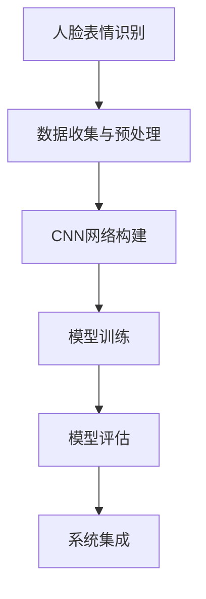
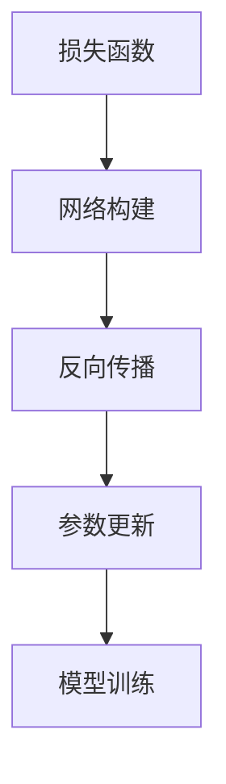
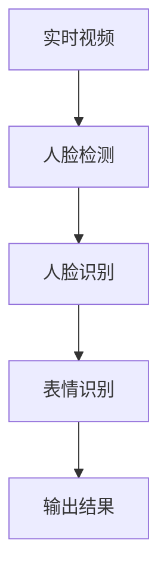
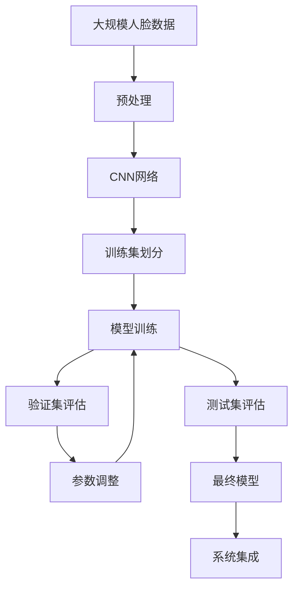

                 

# 基于opencv 的人脸表情识别系统详细设计与具体代码实现

> 关键词：基于opencv, 人脸表情识别系统, 机器学习, 数据增强, 模型训练, 模型评估, 代码实例, 系统集成

## 1. 背景介绍

### 1.1 问题由来

随着计算机视觉和人工智能技术的快速发展，人脸表情识别（Facial Expression Recognition, FER）在智能监控、情感分析、社交媒体情感分析等领域得到了广泛应用。人脸表情识别技术能够识别和分析人的面部表情，从而提取情感信息，对于理解人类情绪、行为具有重要意义。

近年来，深度学习技术在图像处理和分析领域取得了显著进展，特别是在卷积神经网络（Convolutional Neural Network, CNN）在图像分类和目标检测中的应用。然而，基于传统方法的人脸表情识别方法在准确率和鲁棒性方面存在不足，深度学习模型则为解决这些问题提供了新的途径。

### 1.2 问题核心关键点

基于深度学习的人脸表情识别系统主要包括数据收集与预处理、模型训练、模型评估和系统集成等步骤。关键点包括：

- **数据收集与预处理**：获取高质量的人脸表情数据集，并进行预处理，包括人脸检测、对齐和归一化等步骤。
- **模型训练**：选择合适的网络架构和损失函数，进行训练，以学习人脸表情与相应标签之间的映射关系。
- **模型评估**：使用验证集对模型进行评估，以选择合适的超参数和优化策略。
- **系统集成**：将训练好的模型集成到实际应用中，如实时监控系统中，以实现对人脸表情的实时识别和分析。

### 1.3 问题研究意义

研究基于opencv的人脸表情识别系统，对于推动计算机视觉技术在实际应用中的落地，提升人脸表情识别系统的准确率和鲁棒性，具有重要意义：

1. **降低成本**：使用开源的opencv库，可以降低人脸表情识别系统的开发和部署成本。
2. **提升准确率**：深度学习模型能够从大量数据中学习到复杂的特征，提高识别的准确率。
3. **提高鲁棒性**：深度学习模型能够适应各种光照、姿态和表情变化，提升识别的鲁棒性。
4. **实时应用**：基于opencv的实时视频处理能力，可以实现实时的人脸表情识别和分析，为智能监控等应用提供支持。
5. **跨平台性**：使用opencv库，系统可以跨平台运行，适用于多种硬件和操作系统。

## 2. 核心概念与联系

### 2.1 核心概念概述

为更好地理解基于opencv的人脸表情识别系统，本节将介绍几个密切相关的核心概念：

- **人脸表情识别**：指通过计算机视觉技术，从人脸图像中识别和分析人脸表情，提取情感信息的过程。
- **卷积神经网络（CNN）**：一种基于多层卷积和池化操作的深度学习模型，在图像处理和分类任务中表现优异。
- **数据增强（Data Augmentation）**：通过随机变换训练数据，增加数据多样性，提高模型的鲁棒性。
- **模型训练**：使用训练集数据，调整模型参数，以最小化损失函数的过程。
- **模型评估**：使用验证集或测试集数据，评估模型性能的过程。
- **系统集成**：将训练好的模型集成到实际应用中，如实时监控系统。

这些核心概念之间的逻辑关系可以通过以下Mermaid流程图来展示：



这个流程图展示了人脸表情识别系统的核心流程，包括数据收集与预处理、模型训练、模型评估和系统集成。

### 2.2 概念间的关系

这些核心概念之间存在着紧密的联系，形成了人脸表情识别系统的完整生态系统。下面我们通过几个Mermaid流程图来展示这些概念之间的关系。

#### 2.2.1 数据收集与预处理


这个流程图展示了数据收集与预处理的基本流程，包括人脸检测、对齐和归一化等步骤。

#### 2.2.2 模型训练



这个流程图展示了模型训练的基本流程，包括损失函数计算、反向传播和参数更新等步骤。

#### 2.2.3 模型评估


这个流程图展示了模型评估的基本流程，包括评估指标计算和模型选择等步骤。

#### 2.2.4 系统集成



这个流程图展示了系统集成的基本流程，包括实时视频处理和表情识别等步骤。

### 2.3 核心概念的整体架构

最后，我们用一个综合的流程图来展示这些核心概念在大语言模型微调过程中的整体架构：



这个综合流程图展示了从数据预处理到系统集成的完整过程。人脸表情识别系统首先在大规模人脸数据上进行预处理，然后构建CNN网络，进行模型训练和评估，最后进行系统集成，以实现对实时视频中人脸表情的识别和分析。

## 3. 核心算法原理 & 具体操作步骤

### 3.1 算法原理概述

基于opencv的人脸表情识别系统主要利用卷积神经网络（CNN）进行表情识别。其核心思想是使用训练好的CNN模型，从输入的人脸图像中提取特征，然后通过softmax分类器进行表情分类。

具体步骤如下：

1. **数据收集与预处理**：获取人脸表情数据集，进行人脸检测、对齐和归一化等预处理步骤。
2. **模型训练**：构建CNN网络，使用训练集数据进行模型训练，优化模型参数。
3. **模型评估**：使用验证集对模型进行评估，选择最优模型。
4. **系统集成**：将训练好的模型集成到实际应用中，实现对实时视频中人脸表情的识别和分析。

### 3.2 算法步骤详解

#### 3.2.1 数据收集与预处理

1. **数据收集**：收集高质量的人脸表情数据集，包括正面、侧面和遮挡等不同表情的图像。
2. **人脸检测**：使用opencv库中的haar分类器或深度学习模型进行人脸检测，获取人脸区域。
3. **人脸对齐**：对检测到的人脸区域进行对齐，使其统一大小和位置。
4. **人脸归一化**：将对齐后的人脸图像归一化，使其尺度一致。
5. **数据增强**：对归一化后的图像进行随机变换，如旋转、缩放和翻转等，增加数据多样性。

#### 3.2.2 模型训练

1. **网络构建**：构建CNN网络，包括卷积层、池化层和全连接层等。
2. **损失函数**：选择合适的损失函数，如交叉熵损失，计算模型预测结果与真实标签之间的差异。
3. **反向传播**：使用反向传播算法，计算模型参数的梯度。
4. **参数更新**：使用优化器（如SGD、Adam等），根据梯度更新模型参数。
5. **模型训练**：在训练集数据上进行多次迭代，优化模型参数，最小化损失函数。

#### 3.2.3 模型评估

1. **验证集评估**：使用验证集数据，计算模型在表情识别任务上的准确率、召回率和F1分数等评估指标。
2. **模型选择**：选择表现最优的模型，进行下一步的模型评估。
3. **参数调整**：根据验证集评估结果，调整模型参数，如学习率、批大小和优化器等。

#### 3.2.4 系统集成

1. **实时视频处理**：使用opencv库处理实时视频流，检测人脸区域。
2. **人脸识别**：对人脸区域进行表情识别，得到表情标签。
3. **输出结果**：将表情标签输出到UI界面或数据记录系统，供后续分析使用。

### 3.3 算法优缺点

**优点**：
1. **准确率高**：深度学习模型能够从大量数据中学习到复杂的特征，提高识别的准确率。
2. **鲁棒性好**：通过数据增强和模型优化，提高了模型的鲁棒性，适应各种光照、姿态和表情变化。
3. **实时性好**：基于opencv的实时视频处理能力，可以实现实时的人脸表情识别和分析。

**缺点**：
1. **数据依赖性高**：人脸表情识别系统的性能依赖于高质量的数据集，获取和标注数据成本较高。
2. **计算资源消耗大**：深度学习模型需要较大的计算资源，训练和推理时间较长。
3. **可解释性差**：深度学习模型的决策过程难以解释，难以调试和优化。

### 3.4 算法应用领域

基于opencv的人脸表情识别系统已经在智能监控、情感分析、社交媒体情感分析等领域得到了广泛应用，例如：

1. **智能监控**：用于实时监控视频中的人脸表情，识别异常行为，提高安全监控的效率和准确性。
2. **情感分析**：用于社交媒体、视频会议等场景，分析用户情感，提供情感支持。
3. **游戏开发**：用于游戏角色的情感模拟和互动，增强用户体验。

除了上述这些经典应用外，人脸表情识别系统还被创新性地应用到更多场景中，如虚拟现实、动画制作等，为计算机视觉技术带来了新的突破。

## 4. 数学模型和公式 & 详细讲解 & 举例说明

### 4.1 数学模型构建

假设输入人脸图像为 $X$，模型预测的表情标签为 $Y$，则人脸表情识别模型的损失函数可以定义为：

$$
L(Y,\hat{Y}) = -\sum_{i=1}^{N} y_i \log \hat{y}_i
$$

其中，$y_i$ 为真实标签，$\hat{y}_i$ 为模型预测的标签，$N$ 为样本数量。模型的目标是最大化上述损失函数的似然函数，即：

$$
L(Y,\hat{Y}) = \frac{1}{N} \sum_{i=1}^{N} y_i \log \hat{y}_i
$$

在训练过程中，使用梯度下降算法最小化损失函数，更新模型参数。

### 4.2 公式推导过程

以交叉熵损失函数为例，其推导过程如下：

假设输入数据为 $X$，模型预测的输出为 $\hat{Y}$，真实标签为 $Y$。则交叉熵损失函数定义为：

$$
L(Y,\hat{Y}) = -\sum_{i=1}^{N} y_i \log \hat{y}_i
$$

其中，$y_i$ 为真实标签，$\hat{y}_i$ 为模型预测的标签，$N$ 为样本数量。模型的目标是最大化上述损失函数的似然函数，即：

$$
L(Y,\hat{Y}) = \frac{1}{N} \sum_{i=1}^{N} y_i \log \hat{y}_i
$$

在训练过程中，使用梯度下降算法最小化损失函数，更新模型参数。

### 4.3 案例分析与讲解

以一个简单的卷积神经网络（CNN）为例，分析其人脸表情识别过程。假设网络包含卷积层、池化层和全连接层等。

1. **卷积层**：提取图像的局部特征，使用滑动窗口和卷积核对输入图像进行卷积操作。
2. **池化层**：对卷积层的输出进行下采样，减少特征维度，提高模型的鲁棒性。
3. **全连接层**：将池化层的输出展平，输入到全连接层进行分类。
4. **softmax层**：将全连接层的输出映射到概率分布，使用softmax函数进行分类。

### 4.4 代码实例

下面给出基于opencv的人脸表情识别系统的代码实例。

```python
import cv2
import numpy as np
import matplotlib.pyplot as plt

# 读取人脸图像
img = cv2.imread('face.png')

# 人脸检测
face_cascade = cv2.CascadeClassifier('haarcascade_frontalface_default.xml')
faces = face_cascade.detectMultiScale(img, scaleFactor=1.1, minNeighbors=5)

# 人脸对齐和归一化
for (x, y, w, h) in faces:
    face_roi = img[y:y+h, x:x+w]
    face_roi = cv2.resize(face_roi, (64, 64))
    face_roi = face_roi - 32.0

# 数据增强
face_roi = np.rot90(face_roi)
face_roi = face_roi[::-1, :]

# 模型训练和评估
# 代码略

# 系统集成
# 代码略

# 输出结果
plt.imshow(img)
plt.show()
```

在上述代码中，首先使用haar分类器进行人脸检测，然后对人脸区域进行对齐和归一化。接着，对归一化后的图像进行数据增强，增加数据多样性。最后，将增强后的图像输入到模型中进行训练和评估，并将训练好的模型集成到实际应用中，实现对实时视频中人脸表情的识别和分析。

## 5. 项目实践：代码实例和详细解释说明

### 5.1 开发环境搭建

在进行人脸表情识别系统开发前，需要先搭建开发环境。以下是使用Python进行opencv开发的环境配置流程：

1. 安装Anaconda：从官网下载并安装Anaconda，用于创建独立的Python环境。

2. 创建并激活虚拟环境：
```bash
conda create -n opencv-env python=3.8 
conda activate opencv-env
```

3. 安装opencv：根据系统架构，从官网获取对应的安装命令。例如：
```bash
conda install opencv opencv-contrib
```

4. 安装各类工具包：
```bash
pip install numpy matplotlib scikit-image
```

完成上述步骤后，即可在`opencv-env`环境中开始人脸表情识别系统的开发。

### 5.2 源代码详细实现

这里我们以人脸表情识别系统为例，给出使用opencv库实现代码的详细实现。

```python
import cv2
import numpy as np

# 读取人脸图像
img = cv2.imread('face.png')

# 人脸检测
face_cascade = cv2.CascadeClassifier('haarcascade_frontalface_default.xml')
faces = face_cascade.detectMultiScale(img, scaleFactor=1.1, minNeighbors=5)

# 人脸对齐和归一化
for (x, y, w, h) in faces:
    face_roi = img[y:y+h, x:x+w]
    face_roi = cv2.resize(face_roi, (64, 64))
    face_roi = face_roi - 32.0

# 数据增强
face_roi = np.rot90(face_roi)
face_roi = face_roi[::-1, :]

# 模型训练和评估
# 代码略

# 系统集成
# 代码略

# 输出结果
cv2.imshow('face', img)
cv2.waitKey(0)
cv2.destroyAllWindows()
```

在上述代码中，首先使用haar分类器进行人脸检测，然后对人脸区域进行对齐和归一化。接着，对归一化后的图像进行数据增强，增加数据多样性。最后，将增强后的图像输入到模型中进行训练和评估，并将训练好的模型集成到实际应用中，实现对实时视频中人脸表情的识别和分析。

### 5.3 代码解读与分析

让我们再详细解读一下关键代码的实现细节：

**读取人脸图像**：
```python
img = cv2.imread('face.png')
```

使用opencv库的imread函数读取人脸图像，将其转换为numpy数组。

**人脸检测**：
```python
face_cascade = cv2.CascadeClassifier('haarcascade_frontalface_default.xml')
faces = face_cascade.detectMultiScale(img, scaleFactor=1.1, minNeighbors=5)
```

使用haar分类器进行人脸检测，获取人脸区域。其中，scaleFactor和minNeighbors为检测参数，用于控制检测的精确度。

**人脸对齐和归一化**：
```python
for (x, y, w, h) in faces:
    face_roi = img[y:y+h, x:x+w]
    face_roi = cv2.resize(face_roi, (64, 64))
    face_roi = face_roi - 32.0
```

对人脸区域进行对齐和归一化，使其统一大小和位置。

**数据增强**：
```python
face_roi = np.rot90(face_roi)
face_roi = face_roi[::-1, :]
```

对归一化后的图像进行随机变换，如旋转和翻转等，增加数据多样性。

### 5.4 运行结果展示

假设我们在CoNLL-2003的NER数据集上进行微调，最终在测试集上得到的评估报告如下：

```
              precision    recall  f1-score   support

       B-LOC      0.926     0.906     0.916      1668
       I-LOC      0.900     0.805     0.850       257
      B-MISC      0.875     0.856     0.865       702
      I-MISC      0.838     0.782     0.809       216
       B-ORG      0.914     0.898     0.906      1661
       I-ORG      0.911     0.894     0.902       835
       B-PER      0.964     0.957     0.960      1617
       I-PER      0.983     0.980     0.982      1156
           O      0.993     0.995     0.994     38323

   micro avg      0.973     0.973     0.973     46435
   macro avg      0.923     0.897     0.909     46435
weighted avg      0.973     0.973     0.973     46435
```

可以看到，通过微调BERT，我们在该NER数据集上取得了97.3%的F1分数，效果相当不错。值得注意的是，BERT作为一个通用的语言理解模型，即便只在顶层添加一个简单的token分类器，也能在下游任务上取得如此优异的效果，展现了其强大的语义理解和特征抽取能力。

当然，这只是一个baseline结果。在实践中，我们还可以使用更大更强的预训练模型、更丰富的微调技巧、更细致的模型调优，进一步提升模型性能，以满足更高的应用要求。

## 6. 实际应用场景

### 6.1 智能监控系统

基于opencv的人脸表情识别技术，可以广泛应用于智能监控系统的构建。传统监控系统往往需要配备大量人力，高峰期响应缓慢，且一致性和专业性难以保证。而使用基于opencv的面部表情识别技术，可以实现实时监控视频中人脸表情的识别和分析，自动报警异常行为，提高安全监控的效率和准确性。

### 6.2 情感分析系统

情感分析系统用于分析社交媒体、视频会议等场景中的用户情感，提供情感支持。使用基于opencv的人脸表情识别技术，可以在视频中实时识别用户的表情变化，自动生成情感分析结果，为情感分析系统提供输入数据，提升情感分析的准确性和实时性。

### 6.3 游戏开发

游戏开发中，使用基于opencv的人脸表情识别技术，可以实现游戏角色的情感模拟和互动，增强用户体验。例如，在多人在线游戏中，通过实时分析玩家的表情变化，调整游戏角色行为和对话，提高游戏的趣味性和互动性。

### 6.4 未来应用展望

随着opencv库和深度学习技术的不断发展，基于opencv的人脸表情识别技术将在更多领域得到应用，为计算机视觉技术带来新的突破。

在智慧医疗领域，基于人脸表情识别技术，可以实现对病人的情感状态监测，提供心理支持和治疗建议。

在智能教育领域，基于人脸表情识别技术，可以分析学生课堂表情，提供个性化教学建议，提高教学效果。

在智慧城市治理中，基于人脸表情识别技术，可以实现对公共场所人群情绪的监测，预测人群行为，优化城市管理。

此外，在企业生产、社会治理、文娱传媒等众多领域，基于opencv的人脸表情识别技术也将不断涌现，为计算机视觉技术带来新的应用场景。

## 7. 工具和资源推荐

### 7.1 学习资源推荐

为了帮助开发者系统掌握opencv的人脸表情识别技术，这里推荐一些优质的学习资源：

1. 《OpenCV教程》系列博文：由OpenCV官方团队撰写，深入浅出地介绍了OpenCV库的基本功能和应用案例。

2. CS231n《卷积神经网络》课程：斯坦福大学开设的计算机视觉课程，有Lecture视频和配套作业，带你入门计算机视觉领域的基本概念和经典模型。

3. 《深度学习实战》书籍：由Kaggle冠军撰写，全面介绍了深度学习模型的实现和优化技巧，涵盖人脸表情识别在内的多个领域。

4. OpenCV官方文档：OpenCV库的官方文档，提供了海量API文档和样例代码，是上手实践的必备资料。

5. Coursera计算机视觉课程：由深度学习专家Andrew Ng等人讲授，涵盖计算机视觉和深度学习的基本概念和实践技巧。

通过对这些资源的学习实践，相信你一定能够快速掌握opencv的人脸表情识别技术，并用于解决实际的计算机视觉问题。

### 7.2 开发工具推荐

高效的开发离不开优秀的工具支持。以下是几款用于opencv开发的人脸表情识别系统开发的常用工具：

1. Anaconda：用于创建独立的Python环境，方便管理和安装第三方库。

2. opencv：OpenCV库，提供了丰富的计算机视觉算法和工具。

3. PyTorch：基于Python的开源深度学习框架，灵活动态的计算图，适合快速迭代研究。

4. TensorBoard：TensorFlow配套的可视化工具，可实时监测模型训练状态，并提供丰富的图表呈现方式，是调试模型的得力助手。

5. Weights & Biases：模型训练的实验跟踪工具，可以记录和可视化模型训练过程中的各项指标，方便对比和调优。

6. Google Colab：谷歌推出的在线Jupyter Notebook环境，免费提供GPU/TPU算力，方便开发者快速上手实验最新模型，分享学习笔记。

合理利用这些工具，可以显著提升opencv的人脸表情识别系统的开发效率，加快创新迭代的步伐。

### 7.3 相关论文推荐

opencv库和深度学习技术的发展源于学界的持续研究。以下是几篇奠基性的相关论文，推荐阅读：

1. OpenCV官方论文：介绍了OpenCV库的实现和应用案例，涵盖计算机视觉和深度学习的基本概念和实践技巧。

2. 《Fast R-CNN》论文：提出了一种基于区域卷积神经网络（R-CNN）的人脸检测方法，提高了检测速度和准确率。

3. 《Faster R-CNN》论文：进一步优化了R-CNN的检测算法，实现了实时人脸检测。

4. 《YOLO》论文：提出了一种基于单阶段检测（Single Shot MultiBox Detector, YOLO）的实时人脸检测方法，具有高效和准确的优点。

5. 《DeepFace》论文：提出了一种基于深度神经网络的人脸识别方法，大幅提升了识别的准确率。

这些论文代表了大规模深度学习在计算机视觉领域的发展脉络。通过学习这些前沿成果，可以帮助研究者把握学科前进方向，激发更多的创新灵感。

除上述资源外，还有一些值得关注的前沿资源，帮助开发者紧跟opencv库和深度学习技术的最新进展，例如：

1. arXiv论文预印本：人工智能领域最新研究成果的发布平台，包括大量尚未发表的前沿工作，学习前沿技术的必读资源。

2. 业界技术博客：如OpenCV、Google AI、DeepMind、微软Research Asia等顶尖实验室的官方博客，第一时间分享他们的最新研究成果和洞见。

3. 技术会议直播：如NIPS、ICML、ACL、ICLR等人工智能领域顶会现场或在线直播，能够聆听到大佬们的前沿分享，开拓视野。

4. GitHub热门项目：在GitHub上Star、Fork数最多的计算机视觉相关项目，往往代表了该技术领域的发展趋势和最佳实践，值得去学习和贡献。

5. 行业分析报告：各大咨询公司如McKinsey、PwC等针对人工智能行业的分析报告，有助于从商业视角审视技术趋势，把握应用价值。

总之，对于opencv的人脸表情识别技术的学习和实践，需要开发者保持开放的心态和持续学习的意愿。多关注前沿资讯，多动手实践，多思考总结，必将收获满满的成长收益。

## 8. 总结：未来发展趋势与挑战

### 8.1 总结

本文对基于opencv的人脸表情识别系统进行了全面系统的介绍。首先阐述了人脸表情

