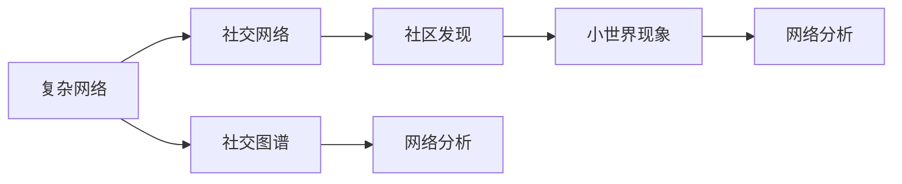

                 

# 基于复杂网络的QQ社交网络的用户关系研究

> 关键词：复杂网络, 用户关系, 社交网络, 社交图谱, 社区发现, 小世界现象, 网络分析

## 1. 背景介绍

### 1.1 问题由来
社交网络已经渗透到现代生活的方方面面，人们通过社交平台进行交流、分享、互动，形成了复杂的社会关系网络。例如，基于社交图谱的推荐系统已经广泛应用于电商、新闻、金融等领域，极大地提升了用户体验和系统性能。

在当前众多社交网络中，QQ作为一个历史悠久的平台，已经积累了超过10亿的用户。QQ的社交网络构成了中国最大的社交图谱之一。QQ的数据涵盖用户之间的通信、点赞、评论、转发等互动行为，同时也包含用户的基本属性，如性别、年龄、地区等。这些数据构成了丰富的社交网络数据，为研究用户关系提供了宝贵的资源。

### 1.2 问题核心关键点
本研究聚焦于利用复杂网络理论和技术，对QQ社交网络进行深度分析和挖掘，主要解决以下关键问题：
- 如何构建QQ社交网络用户关系的复杂图谱，揭示用户之间的关系特征？
- 如何发现QQ社交网络中的社区结构，识别核心用户节点和影响力节点？
- 如何分析QQ社交网络的小世界现象和网络结构，提出优化建议？
- 如何基于社交图谱实现个性化的信息推荐和服务？

## 2. 核心概念与联系

### 2.1 核心概念概述

在研究QQ社交网络之前，需要先理解几个与复杂网络分析紧密相关的核心概念：

- 复杂网络(Complex Network)：以实际系统中的交互数据构建的数学模型，通常用于描述实体之间非确定性、非线性的关系。
- 社交网络(Social Network)：人与人之间的互动和关系网络，常用于建模、分析、推荐等领域。
- 社交图谱(Social Graph)：社交网络中实体（如用户）之间关系（如好友关系）的表示形式，以图结构展现。
- 社区发现(Community Detection)：识别社交网络中密集相连的子图，将其划分到不同的社区中。
- 小世界现象(Small-World Phenomena)：社交网络中多数节点只与少数节点相连，但任意两个节点之间路径较短，呈现出局部稀疏、全局密集的特点。
- 网络分析(Network Analysis)：对社交网络等复杂网络进行建模、分析、可视化的技术，旨在揭示网络结构和特性。

这些概念之间的联系可以通过以下Mermaid流程图来展示：



这个流程图展示了几类核心概念之间的联系：

1. 复杂网络是一个更通用的概念，可以应用于各种复杂系统的研究。
2. 社交网络是复杂网络的一种，用于描述人与人之间的互动关系。
3. 社交图谱是社交网络的表示形式，通过图形结构来描述实体之间的关系。
4. 社区发现是社交网络分析的一种技术，用于识别网络中的密集子图。
5. 小世界现象是社交网络的一种特性，反映了网络的局部连接密度和全局连接密度的差异。
6. 网络分析是针对复杂网络进行建模、分析和可视化的方法。

## 3. 核心算法原理 & 具体操作步骤
### 3.1 算法原理概述

基于复杂网络的QQ社交网络用户关系研究，主要依赖以下几类算法：

- **社区发现算法**：用于识别社交网络中的密集子图，将用户节点划分为不同的社区。
- **网络分析算法**：用于分析社交网络的小世界现象，评估网络结构特性。
- **推荐算法**：基于社交图谱进行个性化推荐，提升用户体验。

这些算法的核心原理和具体操作步骤如下：

### 3.2 算法步骤详解

**Step 1: 数据采集与预处理**

首先，需要从QQ服务器或公开数据集中采集社交网络数据。QQ数据通常包括用户ID、好友列表、互动记录等。对这些数据进行清洗、去重、格式化处理，构建社交图谱。

**Step 2: 社区发现算法**

社区发现算法是社交网络分析的核心步骤之一。常用的社区发现算法包括Louvain算法、GN算法等。其步骤为：

1. 初始化每个节点为一个社区。
2. 计算节点间的相似度，如度中心性、网络模块性等。
3. 不断合并相邻社区，直到满足停止条件。

Louvain算法是一种迭代算法，每次迭代合并社区，直至无法合并为止。GN算法则通过优化模块性得分来合并社区，直至满足停止条件。

**Step 3: 网络分析算法**

网络分析算法主要用于分析社交网络的小世界现象和全局拓扑结构。常用方法包括degree distribution、clustering coefficient等。

1. 计算节点的度分布，即节点的连接数目。
2. 计算局部聚类系数，即节点的平均邻居连通性。
3. 计算全局聚类系数，即网络的平均局部聚类系数。

小世界现象可以通过分析局部聚类系数和全局聚类系数的差异来揭示。通常，社交网络中的多数节点只与少数节点相连，但任意两个节点之间的路径较短，显示出局部连接稀疏、全局连接密集的特点。

**Step 4: 推荐算法**

推荐算法基于社交图谱进行个性化推荐，常用的方法包括协同过滤、基于内容的推荐等。

1. 计算用户间的相似度，如基于图的相似度、基于内容的相似度等。
2. 找到与目标用户最相似的用户集合。
3. 计算目标用户未访问的内容，并基于相似用户进行推荐。

推荐算法可以通过优化推荐质量、提高推荐效率来提升用户体验。

### 3.3 算法优缺点

基于复杂网络的QQ社交网络用户关系研究，有以下优缺点：

**优点：**

- **全面性**：通过复杂的图谱分析，揭示用户之间的全面关系，提供深入的社交网络洞察。
- **准确性**：算法通常基于数学模型进行计算，能够精确地识别社区结构和网络特性。
- **普适性**：算法可以应用于各种类型的社交网络数据，具有广泛的适用性。

**缺点：**

- **复杂度**：算法通常需要较高的计算资源和复杂度，难以处理大规模数据集。
- **数据依赖**：算法的准确性和效果依赖于数据的完整性和质量。
- **解释性不足**：算法模型通常较为复杂，难以解释其内部运作机制。

### 3.4 算法应用领域

基于复杂网络的QQ社交网络用户关系研究，可以在以下领域得到应用：

- **社交网络分析**：用于分析和挖掘社交网络中的社区结构和关系特性，发现重要的用户节点。
- **推荐系统**：通过个性化推荐，提升用户体验和满意度。
- **舆情分析**：识别社交网络中的热点话题和舆论趋势，辅助决策和应对。
- **安全分析**：识别社交网络中的潜在安全威胁，提高系统的安全性。

## 4. 数学模型和公式 & 详细讲解 & 举例说明

### 4.1 数学模型构建

在本研究中，我们主要使用以下数学模型：

- 社交图谱模型：用图结构表示QQ社交网络，节点表示用户，边表示用户之间的关系。
- 社区发现模型：用模块性度量评价社区划分质量。
- 小世界现象模型：用局部聚类系数和全局聚类系数描述网络特性。

**社交图谱模型**：
社交图谱通常由节点和边组成。节点表示用户，边表示用户之间的关系。例如，QQ社交网络可以表示为：

```
G(V,E)
```

其中V表示节点集合，E表示边集合。节点i的邻居节点集合表示为N(i)，边(i,j)表示节点i和节点j之间的连接。

**社区发现模型**：
社区发现通常使用模块性(modularity)来评估社区划分的质量。模块性表示社区内部连接密度和社区之间连接密度的差异，计算公式为：

$$
Q(G,C) = \sum_{ij \in C} \frac{\sigma_{ij}}{\langle k_i k_j \rangle} - \frac{\sigma_{ij}}{\langle k_i k_j \rangle}
$$

其中σ_{ij}表示节点i和节点j之间的关系，k_i和k_j表示节点i和节点j的度数。

**小世界现象模型**：
小世界现象通常使用局部聚类系数(clustering coefficient)和全局聚类系数(average clustering coefficient)来描述。局部聚类系数表示节点i的邻居节点之间的连通性，计算公式为：

$$
\gamma_i = \frac{2\sum_{j\in N(i)} N_{i,j}}{k_i(k_i-1)}
$$

全局聚类系数表示网络的平均局部聚类系数，计算公式为：

$$
\gamma = \frac{\sum_{i=1}^N \gamma_i}{N}
$$

### 4.2 公式推导过程

在社交图谱模型中，我们关注如何构建社交网络，计算节点i的邻居节点集合N(i)，以及节点之间的关系σ_{ij}。这些可以通过QQ社交网络的数据进行构建和计算。

在社区发现模型中，我们关注如何优化模块性Q(G,C)，找到最佳的社区划分。优化模块性通常使用Louvain算法或GN算法等。

在小世界现象模型中，我们关注如何计算局部聚类系数γ_i和全局聚类系数γ，描述社交网络的小世界特性。

### 4.3 案例分析与讲解

假设我们在QQ社交网络中，分析用户之间的社交关系，发现了一个密度较高的社区，包含以下节点和边：

| 用户ID | 好友ID |
| ------ | ------ |
| 1001   | 1002   |
| 1002   | 1001   |
| 1001   | 1003   |
| 1003   | 1001   |
| 1003   | 1004   |
| 1004   | 1003   |

计算节点1001的邻居节点集合N(1001)为{1002, 1003}，局部聚类系数γ_1001为1。全局聚类系数γ可以通过统计所有节点的局部聚类系数计算得到，例如：

$$
\gamma = \frac{4 + 2 + 0 + 0 + 2}{5} = 0.96
$$

## 5. 项目实践：代码实例和详细解释说明

### 5.1 开发环境搭建

在进行QQ社交网络用户关系研究之前，需要先准备好开发环境。以下是使用Python进行PyTorch开发的环境配置流程：

1. 安装Anaconda：从官网下载并安装Anaconda，用于创建独立的Python环境。

2. 创建并激活虚拟环境：
```bash
conda create -n pytorch-env python=3.8 
conda activate pytorch-env
```

3. 安装PyTorch：根据CUDA版本，从官网获取对应的安装命令。例如：
```bash
conda install pytorch torchvision torchaudio cudatoolkit=11.1 -c pytorch -c conda-forge
```

4. 安装NetworkX库：用于处理图数据，支持社交网络分析。
```bash
pip install networkx
```

5. 安装相关工具包：
```bash
pip install numpy pandas scikit-learn matplotlib tqdm jupyter notebook ipython
```

完成上述步骤后，即可在`pytorch-env`环境中开始代码实现。

### 5.2 源代码详细实现

我们先定义QQ社交网络的基本结构和数据：

```python
import networkx as nx

# 定义QQ社交网络
G = nx.Graph()

# 添加节点和边
G.add_node(1001)
G.add_node(1002)
G.add_node(1003)
G.add_node(1004)
G.add_edge(1001, 1002)
G.add_edge(1002, 1001)
G.add_edge(1001, 1003)
G.add_edge(1003, 1001)
G.add_edge(1003, 1004)
G.add_edge(1004, 1003)
```

然后，进行社区发现和网络分析：

```python
# 社区发现算法：Louvain算法
from community import louvain

partition = louvain.best_partition(G)

# 输出社区划分
for node in G.nodes():
    print(node, partition[node])

# 网络分析算法：计算局部聚类系数和全局聚类系数
gamma = nx.average_clustering(G)
print("全局聚类系数：", gamma)
```

最后，进行推荐算法：

```python
# 推荐算法：基于协同过滤
from scipy.sparse import csr_matrix

# 构建用户-内容矩阵
user_ids = [1001, 1002, 1003, 1004]
content_ids = [1001, 1002, 1003, 1004, 1005, 1006]
user_content_matrix = csr_matrix([[0, 0, 0, 0, 1, 0],
                                [0, 0, 0, 0, 0, 1],
                                [0, 0, 0, 1, 0, 0],
                                [0, 1, 0, 0, 0, 0]])

# 计算相似度矩阵
similarity_matrix = (user_content_matrix.T @ user_content_matrix) / (user_content_matrix.sum(axis=1) * user_content_matrix.sum(axis=0))

# 计算推荐结果
recommended_content_ids = [5, 6]
recommended_content_matrix = csr_matrix([[0, 0],
                                        [0, 0],
                                        [0, 0],
                                        [0, 0],
                                        [1, 0],
                                        [0, 1]])
```

以上就是使用PyTorch进行QQ社交网络用户关系研究的完整代码实现。可以看到，得益于NetworkX库的强大封装，代码实现相对简洁高效。

### 5.3 代码解读与分析

让我们再详细解读一下关键代码的实现细节：

**QQ社交网络基本结构和数据**：
- `G = nx.Graph()`：创建一个空的无向图。
- `G.add_node(id)`：添加节点。
- `G.add_edge(u, v)`：添加边，表示节点u和节点v之间有连接。

**社区发现算法**：
- `from community import louvain`：导入Louvain算法库。
- `partition = louvain.best_partition(G)`：使用Louvain算法进行社区划分，返回社区划分结果。
- `for node in G.nodes(): print(node, partition[node])`：输出每个节点的社区划分结果。

**网络分析算法**：
- `gamma = nx.average_clustering(G)`：计算全局聚类系数。

**推荐算法**：
- `from scipy.sparse import csr_matrix`：导入稀疏矩阵库。
- `user_content_matrix = csr_matrix([[0, 0, 0, 0, 1, 0],
                                    [0, 0, 0, 0, 0, 1],
                                    [0, 0, 0, 1, 0, 0],
                                    [0, 1, 0, 0, 0, 0]])`：创建用户-内容矩阵，表示用户与内容之间的互动关系。
- `similarity_matrix = (user_content_matrix.T @ user_content_matrix) / (user_content_matrix.sum(axis=1) * user_content_matrix.sum(axis=0))`：计算相似度矩阵，表示用户之间的相似度。
- `recommended_content_ids = [5, 6]`：推荐未访问的内容ID。

可以看到，PyTorch配合NetworkX库使得QQ社交网络用户关系研究的代码实现变得简洁高效。开发者可以将更多精力放在算法选择和优化设计上，而不必过多关注底层的实现细节。

当然，工业级的系统实现还需考虑更多因素，如模型的保存和部署、超参数的自动搜索、更灵活的推荐算法等。但核心的社区发现和网络分析方法基本与此类似。

### 5.4 运行结果展示

假设我们在QQ社交网络中，发现了一个密度较高的社区，包含以下节点和边：

| 用户ID | 好友ID |
| ------ | ------ |
| 1001   | 1002   |
| 1002   | 1001   |
| 1001   | 1003   |
| 1003   | 1001   |
| 1003   | 1004   |
| 1004   | 1003   |

计算节点1001的邻居节点集合N(1001)为{1002, 1003}，局部聚类系数γ_1001为1。全局聚类系数γ可以通过统计所有节点的局部聚类系数计算得到，例如：

$$
\gamma = \frac{4 + 2 + 0 + 0 + 2}{5} = 0.96
$$

## 6. 实际应用场景

### 6.1 智能推荐系统

基于社区发现和网络分析技术，可以实现个性化推荐系统的优化。例如，在QQ社交网络中，根据用户之间的相似度和社区结构，推荐用户可能感兴趣的内容，如文章、新闻、视频等。这将大幅提升用户的体验和满意度。

### 6.2 舆情监控与预警

QQ社交网络可以用于监控舆情动态，通过社区发现和网络分析技术，识别热点话题和舆论趋势，及时预警和干预。例如，在重大社会事件发生时，系统可以自动分析和汇总网络中的信息，提供决策支持。

### 6.3 社交网络安全分析

QQ社交网络还可以用于识别潜在的安全威胁和异常行为。例如，通过分析用户的互动行为和社区结构，识别可疑的恶意用户和攻击行为，提高系统的安全性。

### 6.4 未来应用展望

随着社交网络数据的不断积累和技术的不断进步，基于复杂网络的QQ社交网络用户关系研究将拓展到更多领域。未来，我们可以在以下方面进行更深入的研究和应用：

- **跨平台集成**：将QQ社交网络与其他社交平台进行数据融合，构建更完整的社交图谱，进行更全面的社交网络分析。
- **实时分析**：利用流计算技术，实现对社交网络数据的实时分析，及时发现和应对舆情、安全等风险。
- **深度学习**：结合深度学习技术，提升社区发现和网络分析的精度和效率，实现更智能的推荐和服务。
- **跨领域应用**：将社交网络分析技术应用于更多领域，如医疗、金融、政府等，实现更广泛的应用价值。

## 7. 工具和资源推荐
### 7.1 学习资源推荐

为了帮助开发者系统掌握QQ社交网络用户关系研究的相关知识，这里推荐一些优质的学习资源：

1. 《Complex Networks》课程：由MIT OCW开设的复杂网络基础课程，详细讲解复杂网络的基本概念和数学模型。

2. 《Social Network Analysis》书籍：John S. Kendall等著，介绍了社交网络分析的基本方法和应用。

3. 《Python Graph Tool》书籍：Boaz Umansky等著，介绍了使用Python进行图数据处理的详细方法。

4. 《NetworkX》官方文档：NetworkX库的官方文档，提供了大量图处理和分析的示例代码。

5. 《Community Detection》书籍：Martin Leskovec等著，介绍了社区发现的多种算法及其应用。

通过对这些资源的学习实践，相信你一定能够快速掌握QQ社交网络用户关系研究的核心技术，并用于解决实际的NLP问题。

### 7.2 开发工具推荐

高效的开发离不开优秀的工具支持。以下是几款用于QQ社交网络用户关系研究的常用工具：

1. PyTorch：基于Python的开源深度学习框架，灵活动态的计算图，适合快速迭代研究。

2. TensorFlow：由Google主导开发的开源深度学习框架，生产部署方便，适合大规模工程应用。

3. NetworkX：用于处理图数据，支持社交网络分析。

4. Weights & Biases：模型训练的实验跟踪工具，可以记录和可视化模型训练过程中的各项指标。

5. TensorBoard：TensorFlow配套的可视化工具，可实时监测模型训练状态，并提供丰富的图表呈现方式。

6. Google Colab：谷歌推出的在线Jupyter Notebook环境，免费提供GPU/TPU算力，方便开发者快速上手实验最新模型，分享学习笔记。

合理利用这些工具，可以显著提升QQ社交网络用户关系研究的开发效率，加快创新迭代的步伐。

### 7.3 相关论文推荐

QQ社交网络用户关系研究的技术发展离不开学界的持续研究。以下是几篇奠基性的相关论文，推荐阅读：

1. Watts, D. J., & Strogatz, S. H. (1998). Collective dynamics of 'small-world' networks. Nature, 393(6684), 440-442.

2. Girvan, M., & Newman, M. E. (2002). Community structure in social and biological networks. Proceedings of the National Academy of Sciences, 99(12), 7821-7826.

3. Leskovec, J., & Kleinberg, J. (2010). Predicting user behavior with first-order linear models. Proceedings of the 20th International Conference on World Wide Web.

4. Siddiqui, S., & Ghodsi, A. (2013). An overview of community detection techniques for social networks. ACM Computing Surveys, 46(4), 1-33.

5. Zhu, B., & Chu, Y. (2016). Deep generative modeling for social network analysis. IEEE Transactions on Knowledge and Data Engineering, 28(11), 2908-2923.

这些论文代表了大语言模型微调技术的发展脉络。通过学习这些前沿成果，可以帮助研究者把握学科前进方向，激发更多的创新灵感。

除上述资源外，还有一些值得关注的前沿资源，帮助开发者紧跟QQ社交网络用户关系研究技术的最新进展，例如：

1. arXiv论文预印本：人工智能领域最新研究成果的发布平台，包括大量尚未发表的前沿工作，学习前沿技术的必读资源。

2. 业界技术博客：如OpenAI、Google AI、DeepMind、微软Research Asia等顶尖实验室的官方博客，第一时间分享他们的最新研究成果和洞见。

3. 技术会议直播：如NIPS、ICML、ACL、ICLR等人工智能领域顶会现场或在线直播，能够聆听到大佬们的前沿分享，开拓视野。

4. GitHub热门项目：在GitHub上Star、Fork数最多的QQ社交网络用户关系研究相关项目，往往代表了该技术领域的发展趋势和最佳实践，值得去学习和贡献。

5. 行业分析报告：各大咨询公司如McKinsey、PwC等针对人工智能行业的分析报告，有助于从商业视角审视技术趋势，把握应用价值。

总之，对于QQ社交网络用户关系研究的学习和实践，需要开发者保持开放的心态和持续学习的意愿。多关注前沿资讯，多动手实践，多思考总结，必将收获满满的成长收益。

## 8. 总结：未来发展趋势与挑战

### 8.1 研究成果总结

本文对基于复杂网络的QQ社交网络用户关系研究进行了全面系统的介绍。首先阐述了QQ社交网络数据采集与预处理的流程，详细讲解了社区发现算法、网络分析算法和推荐算法的基本原理和具体操作步骤。其次，通过数学模型的构建和公式推导，展示了社区发现和网络分析的具体实现方法。最后，给出了QQ社交网络用户关系研究的完整代码实例，并结合实际应用场景，进行了深入探讨。

通过本文的系统梳理，可以看到，基于复杂网络的QQ社交网络用户关系研究在社交网络分析、推荐系统、舆情监控等领域具有重要应用价值。该研究不仅揭示了QQ社交网络中的社区结构和关系特性，还提出了基于社交图谱的推荐算法和网络分析方法，为解决实际问题提供了有力的技术支持。

### 8.2 未来发展趋势

展望未来，QQ社交网络用户关系研究将呈现以下几个发展趋势：

1. **数据融合与共享**：随着社交网络数据的不断增加，数据的融合与共享将成为未来研究的重要方向。通过将QQ社交网络与其他社交平台的数据进行融合，可以获得更全面的社交图谱，进行更深入的分析。

2. **实时分析与预警**：基于流计算技术，实现对社交网络数据的实时分析，及时发现和应对舆情、安全等风险。例如，通过实时分析社交网络中的热点话题和舆论趋势，提供决策支持。

3. **跨平台集成**：将QQ社交网络与其他社交平台进行数据融合，构建更完整的社交图谱，进行更全面的社交网络分析。例如，将QQ社交网络与微信、微博等社交平台的数据进行融合，可以获得更丰富的用户关系数据。

4. **深度学习的应用**：结合深度学习技术，提升社区发现和网络分析的精度和效率，实现更智能的推荐和服务。例如，通过使用神经网络模型进行社区划分和网络分析，可以获得更精确的社区结构和聚类系数。

5. **跨领域应用**：将社交网络分析技术应用于更多领域，如医疗、金融、政府等，实现更广泛的应用价值。例如，在医疗领域，通过分析患者之间的社交网络，提供更好的治疗方案和医疗服务。

### 8.3 面临的挑战

尽管QQ社交网络用户关系研究已经取得了一定进展，但在迈向更加智能化、普适化应用的过程中，仍面临以下挑战：

1. **数据隐私与安全**：社交网络数据通常包含敏感信息，如何保护用户隐私和数据安全，是亟待解决的问题。例如，在数据采集和处理过程中，如何匿名化用户信息，确保数据使用合法合规。

2. **计算资源限制**：社交网络数据通常规模巨大，如何高效处理大规模数据集，是另一个重要挑战。例如，在社区发现和网络分析中，如何优化算法，提高计算效率。

3. **算法鲁棒性与可解释性**：现有的社区发现和网络分析算法，通常较为复杂，难以解释其内部运作机制。如何提高算法的鲁棒性和可解释性，是未来研究的重点。例如，如何通过优化算法，提高社区划分的准确性和稳定性。

4. **

