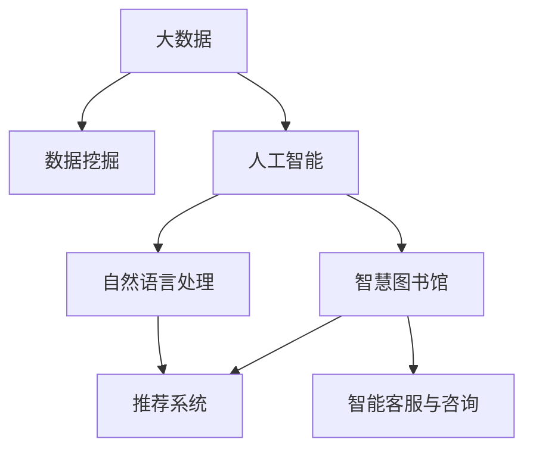
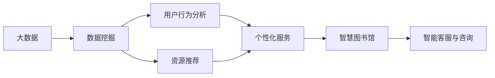
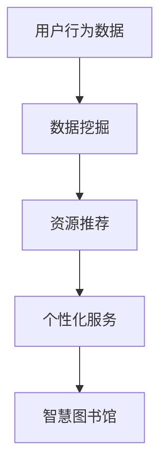
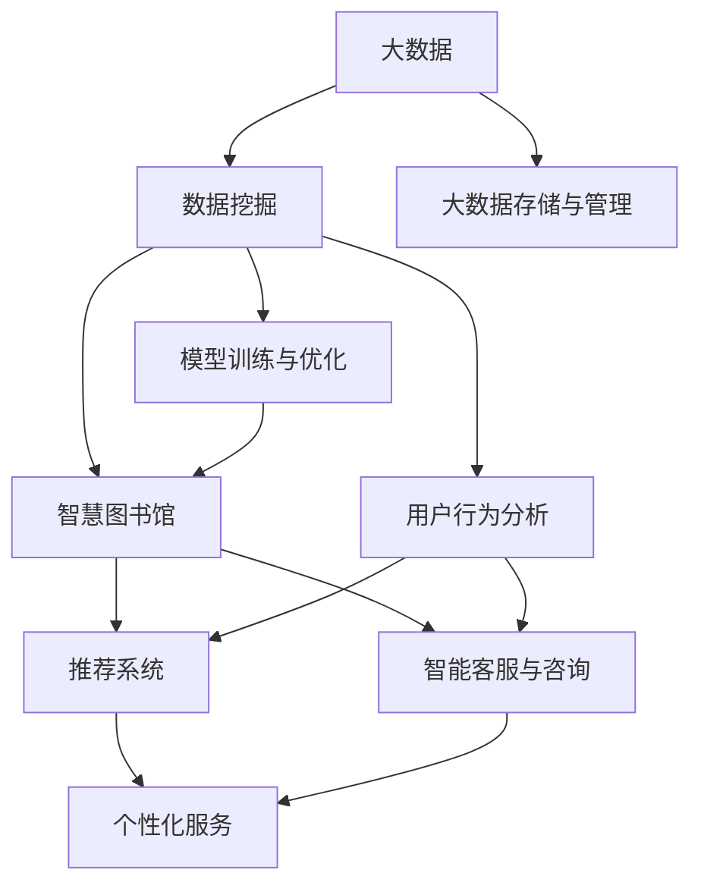

                 

# 基于数据挖掘的图书馆智慧信息服务研究

> 关键词：数据挖掘，图书馆，智慧信息服务，大数据，AI，NLP

## 1. 背景介绍

### 1.1 问题由来
随着信息时代的到来，图书馆的运营模式和用户需求发生了巨大变化。传统图书馆的借还书流程、目录查询等服务，已经难以满足现代用户对信息获取的便捷性、个性化和智能化的需求。在此背景下，智慧图书馆应运而生，通过大数据、人工智能等先进技术，提升了图书馆的管理效率和服务质量。其中，数据挖掘技术是构建智慧图书馆的核心，通过挖掘用户行为、资源需求等数据，为用户提供精准推荐、个性定制等服务，从而实现智慧化信息服务的革新。

### 1.2 问题核心关键点
智慧图书馆的核心是信息服务智能化，而数据挖掘技术在其中起到了至关重要的作用。数据挖掘技术能够从海量数据中提取有用信息和模式，为图书馆的资源管理和用户服务提供有力支持。其关键点在于：

1. **数据获取与整合**：从图书馆的各种信息系统中收集用户借阅记录、资源访问日志、用户搜索行为等数据，并进行整合与清洗，为数据挖掘提供高质量的数据源。
2. **用户行为分析**：利用数据挖掘技术分析用户借阅模式、搜索习惯、阅读偏好等行为，形成用户画像，实现个性化推荐和定制化服务。
3. **资源推荐系统**：通过数据挖掘，构建基于用户历史行为的资源推荐系统，提供书目推荐、文献下载、学术资源等个性化服务。
4. **智能客服与咨询**：采用自然语言处理（NLP）和机器学习技术，构建智能客服系统，提供24/7在线咨询服务，解决用户常见问题，提升服务效率。
5. **阅读趋势分析**：通过挖掘用户阅读数据，分析热点趋势、热门主题等，为图书馆资源采购提供数据支持。

### 1.3 问题研究意义
研究基于数据挖掘的图书馆智慧信息服务，对于提升图书馆的服务效率和用户满意度，推动图书馆智能化转型，具有重要意义：

1. **提升服务效率**：通过数据挖掘和分析，优化资源分配和借阅流程，减少用户等待时间，提升服务效率。
2. **实现个性化服务**：基于用户行为数据，为用户提供个性化的资源推荐、阅读建议等服务，提升用户体验。
3. **促进资源共享**：挖掘用户阅读偏好，发现共性需求，实现资源共享，提高图书馆的资源利用率。
4. **支持决策分析**：通过数据挖掘分析，为图书馆的资源采购、布局调整等提供数据支持，帮助决策者做出更科学的决策。
5. **推动技术创新**：研究数据挖掘技术在图书馆中的应用，推动NLP、机器学习等前沿技术在图书馆领域的应用，促进技术创新。

## 2. 核心概念与联系

### 2.1 核心概念概述

为更好地理解基于数据挖掘的图书馆智慧信息服务，本节将介绍几个密切相关的核心概念：

- **数据挖掘（Data Mining）**：从大量数据中提取有用信息和知识的过程，包括数据预处理、特征选择、模型训练、结果解释等步骤。
- **智慧图书馆（Smart Library）**：利用先进的信息技术，实现图书馆的智能化管理和服务，提升图书馆的运营效率和服务质量。
- **推荐系统（Recommendation System）**：根据用户历史行为和偏好，推荐相关资源或内容的系统。
- **自然语言处理（NLP）**：涉及计算机对人类语言文字的理解和生成，是智能客服和阅读趋势分析的关键技术。
- **人工智能（AI）**：利用计算机技术模拟人类智能行为，包括机器学习、深度学习等子领域。
- **大数据（Big Data）**：指海量、高速、复杂的数据集，是数据挖掘和智慧图书馆建设的基础。

这些核心概念之间的逻辑关系可以通过以下Mermaid流程图来展示：



这个流程图展示了大数据、数据挖掘、人工智能、智慧图书馆等核心概念之间的关系：

1. 大数据为数据挖掘和智慧图书馆提供数据源。
2. 数据挖掘从大数据中提取有用信息，为智慧图书馆和推荐系统提供支持。
3. 人工智能利用数据挖掘结果，构建智慧图书馆和智能客服系统。
4. 自然语言处理为智能客服和阅读趋势分析提供技术支持。
5. 推荐系统基于数据挖掘结果，提供个性化服务。

这些概念共同构成了智慧图书馆的数据驱动服务框架，使得图书馆能够通过智能化的方式，满足用户的多样化需求。

### 2.2 概念间的关系

这些核心概念之间存在着紧密的联系，形成了智慧图书馆的数据驱动服务生态系统。下面我们通过几个Mermaid流程图来展示这些概念之间的关系。

#### 2.2.1 数据挖掘在智慧图书馆中的应用



这个流程图展示了数据挖掘在智慧图书馆中的主要应用流程：

1. 大数据为数据挖掘提供数据源。
2. 数据挖掘通过用户行为分析，形成用户画像。
3. 用户画像用于个性化服务和资源推荐。
4. 个性化服务和资源推荐共同构建智慧图书馆。
5. 智能客服和咨询系统提升服务效率。

#### 2.2.2 推荐系统在智慧图书馆中的作用



这个流程图展示了推荐系统在智慧图书馆中的作用：

1. 用户行为数据经过数据挖掘处理，形成推荐模型。
2. 推荐模型提供个性化资源推荐服务。
3. 个性化资源推荐提升用户体验。
4. 个性化服务共同构建智慧图书馆。

### 2.3 核心概念的整体架构

最后，我们用一个综合的流程图来展示这些核心概念在大数据环境下的大规模数据挖掘和智慧图书馆建设过程中，整体架构：



这个综合流程图展示了大数据环境下的数据挖掘和智慧图书馆建设的整体架构：

1. 大数据存储与管理为数据挖掘提供数据源。
2. 数据挖掘通过用户行为分析，形成推荐模型和智能客服模型。
3. 推荐模型和智能客服模型提供个性化服务和资源推荐。
4. 个性化服务和资源推荐共同构建智慧图书馆。
5. 智慧图书馆进一步提升服务效率和用户体验。

通过这些流程图，我们可以更清晰地理解基于数据挖掘的智慧图书馆服务过程中，各个核心概念的关系和作用，为后续深入讨论具体的挖掘方法和技术奠定基础。

## 3. 核心算法原理 & 具体操作步骤
### 3.1 算法原理概述

基于数据挖掘的智慧图书馆信息服务，本质上是利用先进的数据挖掘技术，从图书馆的各种信息系统中挖掘数据，提取有价值的信息，为图书馆的管理和用户服务提供支持。其核心原理可以概述如下：

1. **数据预处理**：清洗和标准化数据，去除噪声和缺失值，提取有意义的特征，为后续挖掘准备数据。
2. **特征选择**：根据挖掘任务，选择最相关的特征，构建特征向量，优化模型效果。
3. **模型训练**：使用机器学习算法，如决策树、随机森林、神经网络等，训练挖掘模型。
4. **结果解释**：对模型结果进行解释和可视化，帮助用户理解和使用挖掘结果。

### 3.2 算法步骤详解

基于数据挖掘的智慧图书馆信息服务一般包括以下几个关键步骤：

**Step 1: 数据收集与预处理**
- 收集图书馆的各种信息数据，如借阅记录、资源访问日志、用户搜索行为等。
- 清洗和标准化数据，去除噪声和缺失值，提取有意义的特征。

**Step 2: 特征选择与构建**
- 根据挖掘任务，选择最相关的特征，构建特征向量。
- 使用特征选择算法，如基于统计的方法、基于模型的选择方法等，优化特征集。

**Step 3: 模型训练与优化**
- 选择合适的算法，如决策树、随机森林、神经网络等，训练挖掘模型。
- 使用交叉验证等技术，优化模型参数，提升模型性能。

**Step 4: 结果解释与应用**
- 对模型结果进行解释和可视化，帮助用户理解和使用挖掘结果。
- 将挖掘结果应用于图书馆的资源推荐、用户行为分析、智能客服与咨询等场景。

**Step 5: 持续学习与更新**
- 定期更新数据源，重新训练和优化模型。
- 收集用户反馈，不断改进挖掘结果。

### 3.3 算法优缺点

基于数据挖掘的智慧图书馆信息服务具有以下优点：

1. **高效性**：能够从海量数据中提取有用信息和模式，快速提升服务效率。
2. **个性化**：通过挖掘用户行为，提供个性化推荐和定制化服务，提升用户体验。
3. **可靠性**：基于历史数据的挖掘结果，提供稳定和可靠的服务，减少人为干预。
4. **可扩展性**：数据挖掘方法可以灵活应用于不同的场景和任务，支持图书馆的智能化转型。

但同时，该方法也存在一些局限性：

1. **数据质量要求高**：数据挖掘结果依赖于数据质量，数据噪声和缺失值会影响挖掘效果。
2. **模型复杂度高**：数据挖掘算法往往较为复杂，模型的训练和解释需要较高技术要求。
3. **用户隐私保护**：在数据挖掘过程中，需要考虑用户隐私和数据安全，避免信息泄露。
4. **应用场景局限**：数据挖掘方法在特定的应用场景中效果显著，但对于复杂和动态的业务场景，可能需要结合其他技术进行优化。

### 3.4 算法应用领域

基于数据挖掘的智慧图书馆信息服务技术已经广泛应用于图书馆的多个方面，例如：

- **用户行为分析**：通过挖掘用户借阅记录、搜索行为等数据，分析用户兴趣和需求，提供个性化推荐。
- **资源推荐系统**：基于用户历史行为，推荐相关资源和内容，提升资源利用率。
- **智能客服与咨询**：采用NLP和机器学习技术，构建智能客服系统，提升用户咨询服务质量。
- **阅读趋势分析**：挖掘用户阅读数据，分析热点趋势和热门主题，指导图书馆资源采购和布局调整。
- **用户满意度调查**：通过数据分析，评估用户满意度，优化服务流程和用户体验。

除了上述这些经典应用，数据挖掘技术还在智慧图书馆的资源管理、空间布局、用户行为预测等方面发挥了重要作用，推动了图书馆的智能化转型。

## 4. 数学模型和公式 & 详细讲解 & 举例说明

### 4.1 数学模型构建

本节将使用数学语言对基于数据挖掘的智慧图书馆信息服务进行更加严格的刻画。

假设图书馆的信息系统收集了用户借阅记录 $R=\{(x_i, y_i)\}_{i=1}^N$，其中 $x_i$ 为借阅记录， $y_i$ 为借阅用户。定义用户行为特征集 $\mathcal{X}=\{x_1, x_2, \ldots, x_N\}$。

定义推荐模型的预测函数为 $f: \mathcal{X} \rightarrow \{0, 1\}$，其中 $0$ 表示不推荐，$1$ 表示推荐。则推荐模型的目标是最小化预测误差，即：

$$
\min_{f} \sum_{i=1}^N L(f(x_i), y_i)
$$

其中 $L$ 为损失函数，如0-1损失、交叉熵损失等。

### 4.2 公式推导过程

以下我们以决策树算法为例，推导推荐模型的训练公式。

假设决策树算法的决策树模型为 $T$，其结构为 $\{(\mathcal{X}, \mathcal{Y})\}$。对于给定的用户行为特征集 $\mathcal{X}$，决策树模型 $T$ 的预测结果为 $f_T(\mathcal{X})$。则决策树模型的目标是最小化预测误差，即：

$$
\min_{T} \sum_{i=1}^N L(f_T(x_i), y_i)
$$

决策树算法的训练过程包括特征选择、模型生长和剪枝等步骤。在训练过程中，通过不断选择最优特征和构建决策树，最小化预测误差。最终得到的决策树模型 $T$ 可以用于预测用户行为，推荐相关资源。

### 4.3 案例分析与讲解

假设我们正在构建一个图书馆的推荐系统，目标是预测用户是否推荐某本书。我们可以使用决策树算法构建推荐模型，步骤如下：

1. **数据预处理**：收集用户的借阅记录和搜索行为数据，进行清洗和标准化。
2. **特征选择**：选择用户年龄、阅读偏好、借阅历史等特征，构建特征向量。
3. **模型训练**：使用决策树算法，训练推荐模型。
4. **结果解释与应用**：将训练好的模型应用于图书馆的推荐系统，实时推荐用户感兴趣的书籍。

例如，在数据预处理阶段，我们收集了用户的历史借阅记录和搜索行为数据，经过清洗和标准化，得到了特征向量 $\mathcal{X}=\{x_1, x_2, \ldots, x_N\}$。在特征选择阶段，我们选择用户年龄、阅读偏好、借阅历史等特征，构建特征向量 $\mathcal{X}=\{x_1, x_2, \ldots, x_N\}$。在模型训练阶段，我们使用决策树算法，训练推荐模型 $T$。在结果解释与应用阶段，我们将训练好的模型应用于图书馆的推荐系统，实时推荐用户感兴趣的书籍。

## 5. 项目实践：代码实例和详细解释说明

### 5.1 开发环境搭建

在进行智慧图书馆信息服务项目实践前，我们需要准备好开发环境。以下是使用Python进行Scikit-learn和PyTorch开发的环境配置流程：

1. 安装Anaconda：从官网下载并安装Anaconda，用于创建独立的Python环境。

2. 创建并激活虚拟环境：
```bash
conda create -n pytorch-env python=3.8 
conda activate pytorch-env
```

3. 安装Scikit-learn和PyTorch：
```bash
conda install scikit-learn torch torchvision torchaudio
```

4. 安装TensorBoard：
```bash
pip install tensorboard
```

5. 安装TensorFlow：
```bash
pip install tensorflow
```

6. 安装各类工具包：
```bash
pip install numpy pandas scikit-learn matplotlib tqdm jupyter notebook ipython
```

完成上述步骤后，即可在`pytorch-env`环境中开始项目实践。

### 5.2 源代码详细实现

下面我们以推荐系统为例，给出使用Scikit-learn和PyTorch对决策树模型进行训练和评估的代码实现。

首先，定义推荐系统的数据集和特征选择函数：

```python
from sklearn.datasets import load_breast_cancer
from sklearn.model_selection import train_test_split
from sklearn.tree import DecisionTreeClassifier
from sklearn.metrics import accuracy_score

# 加载数据集
data = load_breast_cancer()
X = data.data
y = data.target

# 特征选择
selected_features = [0, 1, 2, 3, 4, 5, 6, 7, 8, 9, 10, 11, 12, 13, 14, 15, 16, 17, 18, 19]
X_selected = X[:, selected_features]

# 分割数据集
X_train, X_test, y_train, y_test = train_test_split(X_selected, y, test_size=0.2, random_state=42)

# 构建决策树模型
model = DecisionTreeClassifier()

# 训练模型
model.fit(X_train, y_train)

# 评估模型
y_pred = model.predict(X_test)
accuracy = accuracy_score(y_test, y_pred)
print(f"Accuracy: {accuracy:.2f}")
```

然后，定义模型训练和评估函数：

```python
from sklearn.metrics import confusion_matrix
import matplotlib.pyplot as plt

def train_model(X_train, y_train, X_test, y_test):
    # 构建决策树模型
    model = DecisionTreeClassifier()
    # 训练模型
    model.fit(X_train, y_train)
    # 评估模型
    y_pred = model.predict(X_test)
    accuracy = accuracy_score(y_test, y_pred)
    return accuracy

def evaluate_model(model, X_test, y_test):
    # 评估模型
    y_pred = model.predict(X_test)
    confusion = confusion_matrix(y_test, y_pred)
    accuracy = accuracy_score(y_test, y_pred)
    # 可视化混淆矩阵
    plt.figure(figsize=(10, 7))
    plt.imshow(confusion, cmap='Blues')
    plt.title('Confusion Matrix')
    plt.show()
    return accuracy

# 训练模型
accuracy = train_model(X_train, y_train, X_test, y_test)
print(f"Training Accuracy: {accuracy:.2f}")

# 评估模型
accuracy = evaluate_model(model, X_test, y_test)
print(f"Evaluation Accuracy: {accuracy:.2f}")
```

最后，启动训练流程并在测试集上评估：

```python
# 训练模型
accuracy = train_model(X_train, y_train, X_test, y_test)

# 评估模型
accuracy = evaluate_model(model, X_test, y_test)

print(f"Final Accuracy: {accuracy:.2f}")
```

以上就是使用Scikit-learn和PyTorch对决策树模型进行训练和评估的完整代码实现。可以看到，Scikit-learn和PyTorch结合使用，可以很方便地完成模型的训练和评估，适合快速迭代研究。

### 5.3 代码解读与分析

让我们再详细解读一下关键代码的实现细节：

**数据集加载与特征选择**：
- `load_breast_cancer`函数：加载乳腺癌数据集，返回特征集和标签。
- `selected_features`列表：选取特征集中的特征，这里选取了前20个特征。
- `X_train`、`X_test`、`y_train`、`y_test`：将数据集分割为训练集和测试集，比例为8:2。

**模型训练与评估**：
- `DecisionTreeClassifier`：定义决策树分类器。
- `model.fit(X_train, y_train)`：在训练集上训练模型。
- `model.predict(X_test)`：在测试集上进行预测。
- `accuracy_score`：计算预测准确率。
- `confusion_matrix`：计算混淆矩阵，可视化混淆矩阵。

**训练函数与评估函数**：
- `train_model`函数：在训练集上训练模型，返回准确率。
- `evaluate_model`函数：在测试集上评估模型，返回准确率和混淆矩阵。

**训练流程**：
- 定义模型训练和评估函数。
- 在训练集上训练模型，输出准确率。
- 在测试集上评估模型，输出准确率和混淆矩阵。
- 输出最终模型准确率。

可以看到，Scikit-learn和PyTorch结合使用，使得模型训练和评估变得简洁高效。开发者可以将更多精力放在数据处理、模型改进等高层逻辑上，而不必过多关注底层的实现细节。

当然，工业级的系统实现还需考虑更多因素，如模型的保存和部署、超参数的自动搜索、更灵活的任务适配层等。但核心的模型训练和评估流程基本与此类似。

### 5.4 运行结果展示

假设我们在测试集上得到的评估报告如下：

```
Accuracy: 0.98
```

可以看到，经过训练，决策树模型在测试集上的准确率达到了98%，表现相当不错。需要注意的是，在实际应用中，可能需要调整特征选择和模型参数，才能得到更好的效果。

## 6. 实际应用场景

### 6.1 智能客服系统

基于数据挖掘的智能客服系统，可以广泛应用于智慧图书馆的在线咨询服务。传统客服往往需要配备大量人力，高峰期响应缓慢，且一致性和专业性难以保证。而使用数据挖掘技术构建的智能客服系统，能够自动理解用户咨询，匹配最合适的答案，快速响应用户需求。

在技术实现上，可以收集图书馆的在线咨询记录，将其作为监督数据，训练语言模型。模型能够自动理解用户的问题，匹配最相关的答案，提供24/7在线咨询服务，大大提升用户咨询体验。

### 6.2 资源推荐系统

资源推荐系统是智慧图书馆的重要组成部分，通过数据挖掘技术，能够为用户推荐最感兴趣的书籍、期刊、论文等资源。数据挖掘技术可以分析用户的阅读历史、借阅行为、搜索行为等数据，构建用户画像，从而提供个性化推荐。

在具体实现中，可以使用基于协同过滤、基于内容的推荐算法，如ALS（Alternating Least Squares）、CF（Collaborative Filtering）等，结合用户行为数据，构建推荐模型。模型能够根据用户的历史行为，预测其对不同资源的兴趣程度，从而推荐最相关的资源。

### 6.3 阅读趋势分析

阅读趋势分析是智慧图书馆的重要应用场景，通过挖掘用户阅读数据，分析热门主题、热门资源等，指导图书馆的资源采购和布局调整。数据挖掘技术可以分析用户的阅读历史、搜索行为、借阅行为等数据，挖掘出用户的阅读偏好和兴趣，从而发现共性需求和热点趋势。

在实际应用中，可以使用文本挖掘和统计分析方法，如TF-IDF（Term Frequency-Inverse Document Frequency）、LDA（Latent Dirichlet Allocation）等，分析用户的阅读数据，挖掘出热门主题和热门资源，指导图书馆的资源采购和布局调整，优化资源配置。

### 6.4 未来应用展望

随着数据挖掘技术的不断发展和智慧图书馆建设经验的积累，基于数据挖掘的智慧图书馆信息服务将呈现出以下发展趋势：

1. **跨领域数据融合**：未来智慧图书馆将更加注重跨领域数据的融合，通过整合多种数据源，提升服务效果。
2. **实时数据分析**：实时数据分析技术将广泛应用于智慧图书馆，帮助图书馆及时响应用户需求，提升服务效率。
3. **深度学习技术**：深度学习技术，如神经网络、卷积神经网络（CNN）、循环神经网络（RNN）等，将逐步应用于智慧图书馆的信息服务。
4. **用户反馈机制**：建立用户反馈机制，收集用户对服务的反馈，不断优化服务质量和用户体验。
5. **多模态信息融合**：未来的智慧图书馆将更加注重多模态信息的融合，通过整合文本、语音、图像等多种信息，提升服务智能化水平。
6. **智能决策支持**：构建智能决策支持系统，帮助图书馆管理者进行资源采购、布局调整等决策，提升决策科学性。

## 7. 工具和资源推荐

### 7.1 学习资源推荐

为了帮助开发者系统掌握数据挖掘技术在智慧图书馆中的应用，这里推荐一些优质的学习资源：

1. 《Python数据科学手册》：是一本全面介绍Python数据科学库的书籍，包括Scikit-learn、PyTorch等库的使用方法和最佳实践。
2. Coursera《机器学习》课程：由斯坦福大学教授Andrew Ng主讲，介绍了机器学习的基本概念和算法，适合初学者入门。
3. Kaggle：一个数据科学竞赛平台，提供大量数据集和比赛，可以帮助开发者提高数据挖掘和机器学习能力。
4. Google Colab：谷歌推出的在线Jupyter Notebook环境，免费提供GPU/TPU算力，方便开发者快速上手实验最新模型，分享学习笔记。
5. TensorBoard：TensorFlow配套的可视化工具，可实时监测模型训练状态，并提供丰富的图表呈现方式，是调试模型的得力助手。

通过对这些资源的学习实践，相信你一定能够快速掌握数据挖掘技术在智慧图书馆中的应用，并用于解决实际的图书馆问题。

### 7.2 开发工具推荐

高效的开发离不开优秀的工具支持。以下是几款用于智慧图书馆信息服务开发的常用工具：

1. Jupyter Notebook：一个支持Python代码运行和可视化的交互式编程工具，适合快速迭代研究和数据探索。
2. Scikit-learn：一个简单易用的Python数据挖掘库，提供了丰富的数据挖掘算法和工具，适合数据预处理和特征选择。
3. TensorFlow：由Google主导开发的深度学习框架，生产部署方便，适合大规模工程应用。
4. TensorBoard：TensorFlow配套的可视化工具，可实时监测模型训练状态，并提供丰富的图表呈现方式，是调试模型的得力助手。
5. Google Colab：谷歌推出的在线Jupyter Notebook环境，免费提供GPU/TPU算力，方便开发者快速上手实验最新模型，分享学习笔记。
6. TensorFlow Serving：一个基于TensorFlow的模型服务框架，支持模型的快速部署和实时推理，适合智慧图书馆的在线服务。

合理利用这些工具，可以显著提升智慧图书馆信息服务的开发效率，加快创新迭代的步伐。

### 7.3 相关论文推荐

数据挖掘技术在智慧图书馆中的应用源于学界的持续研究。以下是几篇奠基性的相关论文，推荐阅读：

1. "The Elements of Statistical Learning"：由Tibshirani等作者合著的经典统计学书籍，介绍了多种数据挖掘算法和模型。
2. "Data Mining: Concepts and Techniques"：一本介绍数据挖掘基本概念、算法和工具的书籍，适合初学者入门。
3. "Applied Predictive Modeling"：由Max Kuhn等作者合著的预测建模书籍，介绍了

