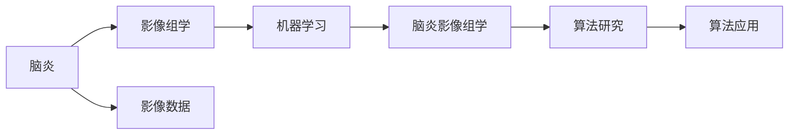

                 

# 基于机器学习的脑炎影像组学算法研究

> 关键词：脑炎,影像组学,机器学习,算法研究

## 1. 背景介绍

### 1.1 问题由来

脑炎是大脑和周围神经系统发炎的统称，通常由病毒、细菌或其他病原体引起，能够严重威胁人类健康。影像组学是大数据分析的重要领域，将医学影像数据转换为可用于临床、科研的数值数据，有助于疾病诊断和治疗决策。然而，由于影像数据庞大、复杂，以及脑炎的多样性和不确定性，现有影像组学方法在脑炎识别和分型等方面仍存在诸多局限。

为此，本文聚焦于基于机器学习的脑炎影像组学算法研究，试图通过深度学习模型和先进的图像处理技术，提升脑炎诊断的精度和效率，为脑炎的早期检测和个性化治疗提供技术支持。

### 1.2 问题核心关键点

本文的研究核心在于如何利用机器学习算法，结合影像组学技术，对脑炎影像数据进行高质量的分析和处理，揭示脑炎的潜在特征和病变模式。具体而言，包括以下几个关键点：

- 数据预处理：对脑炎影像数据进行去噪、归一化、分割等预处理，提高后续分析的精度。
- 特征提取：使用机器学习模型提取影像特征，包括但不限于纹理、形状、强度等。
- 模型训练：构建并训练影像组学模型，如卷积神经网络(CNN)、循环神经网络(RNN)等，以识别和分类脑炎影像。
- 模型评估：使用交叉验证等方法评估模型性能，选取最优模型进行实际应用。
- 模型应用：将训练好的模型应用于新样本的脑炎影像诊断，提供个性化的诊疗建议。

通过这些关键步骤，本文旨在构建高效、鲁棒的脑炎影像组学算法，为脑炎的临床实践提供有力支持。

## 2. 核心概念与联系

### 2.1 核心概念概述

为更好地理解本文研究的机器学习脑炎影像组学算法，我们需要明确以下几个核心概念：

- **脑炎**：指脑部或周围神经系统发炎，常由病毒、细菌等病原体引起，可导致神经功能障碍、认知损害等严重症状。
- **影像组学**：将医学影像数据通过图像处理和分析技术转换为数值型特征，用于疾病诊断和治疗决策。
- **机器学习**：一种利用数据驱动模型进行预测和决策的技术，广泛应用于图像、语音、文本等各类数据。
- **脑炎影像组学**：结合影像组学和机器学习技术，对脑炎影像数据进行深度分析，提取和利用脑炎影像特征。

这些概念构成了本文研究的基础，通过深入理解它们之间的联系，可以帮助我们系统把握脑炎影像组学的算法研究框架。

### 2.2 概念间的关系

这些核心概念之间存在着紧密的联系，形成了脑炎影像组学算法的整体研究生态。以下Mermaid流程图展示了它们之间的关联：



该流程图展示了从脑炎定义到算法应用的全过程：

- 脑炎影像组学结合了脑炎影像数据（A）和影像组学技术（B），通过机器学习模型（C）对脑炎影像特征进行提取和分析，从而得到脑炎影像组学算法（D）。
- 这些算法研究可以应用于临床实践（G），提供脑炎的早期检测、分型诊断和治疗方案。

通过这种技术链条，脑炎影像组学算法能够在实际医疗环境中发挥重要作用，显著提升脑炎的诊断和治疗水平。

## 3. 核心算法原理 & 具体操作步骤
### 3.1 算法原理概述

基于机器学习的脑炎影像组学算法主要通过以下步骤实现：

1. **数据预处理**：对原始脑炎影像数据进行去噪、归一化、分割等预处理，确保数据的质量和一致性。
2. **特征提取**：使用机器学习模型，如卷积神经网络(CNN)、循环神经网络(RNN)等，自动提取脑炎影像的特征。
3. **模型训练**：使用大量的脑炎影像数据和标注信息，训练机器学习模型，以识别和分类脑炎影像。
4. **模型评估**：通过交叉验证等方法评估模型性能，选择最优模型进行实际应用。
5. **模型应用**：将训练好的模型应用于新的脑炎影像数据，提供准确的诊断和治疗建议。

这些步骤共同构成了脑炎影像组学算法的核心原理，为脑炎的临床实践提供了技术支持。

### 3.2 算法步骤详解

#### 3.2.1 数据预处理

数据预处理是影像组学算法的重要环节，主要包括以下步骤：

1. **数据去噪**：利用滤波器等技术，去除影像数据中的噪声，提高影像质量。
2. **影像归一化**：对影像数据进行标准化处理，使其在不同条件下的数据具有可比性。
3. **影像分割**：对影像数据进行分割，分离出脑炎病变区域。

以脑炎影像的分割为例，常用的方法包括阈值分割、区域生长、边缘检测等。

#### 3.2.2 特征提取

特征提取是影像组学算法中的关键步骤，主要通过机器学习模型自动提取影像特征。

1. **CNN特征提取**：使用卷积神经网络对脑炎影像进行特征提取，通过卷积层、池化层等操作，提取影像中的纹理、形状、强度等特征。
2. **RNN特征提取**：使用循环神经网络对脑炎影像进行时序分析，提取影像的时间序列特征。

#### 3.2.3 模型训练

模型训练是脑炎影像组学算法中的核心环节，主要通过训练机器学习模型，学习脑炎影像的特征和规律。

1. **数据准备**：准备大量的脑炎影像数据和标注信息，分为训练集、验证集和测试集。
2. **模型选择**：选择适合的机器学习模型，如CNN、RNN、集成学习等。
3. **模型训练**：使用训练集数据，通过反向传播算法更新模型参数，最小化损失函数。
4. **模型验证**：使用验证集数据，评估模型性能，调整模型参数，避免过拟合。

#### 3.2.4 模型评估

模型评估是脑炎影像组学算法中的重要环节，主要通过交叉验证等方法，评估模型的性能和可靠性。

1. **交叉验证**：将数据集分为训练集和验证集，交叉验证模型，评估模型在不同数据集上的性能。
2. **性能指标**：使用准确率、召回率、F1分数等指标，评估模型的分类性能。
3. **模型选择**：选择性能最优的模型，进行后续应用。

#### 3.2.5 模型应用

模型应用是脑炎影像组学算法中的最终环节，主要将训练好的模型应用于新的脑炎影像数据，提供准确的诊断和治疗建议。

1. **模型部署**：将训练好的模型部署到实际应用环境中，如临床医院、科研机构等。
2. **模型调用**：通过API接口等形式，调用训练好的模型，对新的脑炎影像数据进行处理。
3. **结果解释**：对模型输出结果进行解释，提供临床医生和科研人员可理解的结果。

### 3.3 算法优缺点

基于机器学习的脑炎影像组学算法具有以下优点：

1. **精度高**：通过机器学习模型自动提取影像特征，提高影像分析的精度和效率。
2. **鲁棒性强**：模型能够适应不同条件下的影像数据，具有较强的泛化能力。
3. **可解释性强**：通过特征提取和模型训练，可以直观地解释脑炎影像的特征和分类依据。

同时，该算法也存在一些缺点：

1. **数据需求大**：需要大量的脑炎影像数据和标注信息，获取数据成本较高。
2. **模型复杂**：训练机器学习模型需要较高的计算资源和数据预处理技术，实现难度较大。
3. **结果依赖模型**：模型的性能和结果高度依赖于训练数据和模型选择，需要持续优化和调整。

### 3.4 算法应用领域

基于机器学习的脑炎影像组学算法广泛应用于以下领域：

1. **临床诊断**：辅助医生进行脑炎的早期检测和分型诊断，提高诊断准确率。
2. **治疗方案制定**：根据脑炎影像组学分析结果，制定个性化的治疗方案，优化治疗效果。
3. **预后评估**：评估脑炎患者的预后情况，提供治疗效果的参考依据。
4. **科研分析**：通过影像组学分析，揭示脑炎的病变机制和规律，推动脑炎研究的深入。
5. **健康管理**：在健康管理系统中，利用影像组学技术，进行脑炎的风险评估和健康监测。

## 4. 数学模型和公式 & 详细讲解  
### 4.1 数学模型构建

脑炎影像组学算法涉及的数学模型包括影像预处理、特征提取和模型训练等环节，以下分别进行详细讲解。

#### 4.1.1 影像预处理

脑炎影像预处理的主要数学模型包括影像去噪、归一化和分割等步骤。

1. **影像去噪**：利用均值滤波器、中值滤波器等技术，对影像数据进行去噪处理，数学模型为：
   $$
   y_i = \frac{1}{n} \sum_{j=1}^n x_j
   $$
   其中，$x_j$ 为影像数据中的像素值，$y_i$ 为去噪后的像素值。

2. **影像归一化**：对影像数据进行标准化处理，使其在不同条件下的数据具有可比性，数学模型为：
   $$
   y_i = \frac{x_i - \mu}{\sigma}
   $$
   其中，$\mu$ 为影像数据的均值，$\sigma$ 为影像数据的方差。

3. **影像分割**：使用阈值分割、区域生长、边缘检测等技术，将影像数据分割成不同的区域，数学模型为：
   $$
   S_i = \left\{ \begin{array}{ll}
   1 & \text{如果 } x_i > t \\
   0 & \text{如果 } x_i \leq t
   \end{array} \right.
   $$
   其中，$S_i$ 为分割后的影像像素值，$t$ 为分割阈值。

#### 4.1.2 特征提取

脑炎影像组学的特征提取主要通过卷积神经网络和循环神经网络等模型进行，以下分别进行详细讲解。

1. **CNN特征提取**：使用卷积神经网络对脑炎影像进行特征提取，数学模型为：
   $$
   f_i = \sum_{j=1}^k w_j g_i
   $$
   其中，$f_i$ 为卷积层的特征值，$g_i$ 为卷积核，$w_j$ 为卷积核权重。

2. **RNN特征提取**：使用循环神经网络对脑炎影像进行时序分析，数学模型为：
   $$
   h_{i+1} = \tanh(W h_i + U x_i + b)
   $$
   其中，$h_i$ 为循环神经网络中的隐状态，$W$ 和 $U$ 为权重矩阵，$b$ 为偏置项。

#### 4.1.3 模型训练

脑炎影像组学的模型训练主要通过反向传播算法进行，数学模型为：
   $$
   \Delta w = \alpha \frac{\partial L}{\partial w}
   $$
   其中，$\Delta w$ 为权重更新量，$L$ 为损失函数，$\alpha$ 为学习率。

### 4.2 公式推导过程

#### 4.2.1 影像预处理

1. **影像去噪**：
   - 均值滤波器：
     $$
     y_i = \frac{1}{n} \sum_{j=1}^n x_j
     $$
   - 中值滤波器：
     $$
     y_i = \text{median}(x_i)
     $$

2. **影像归一化**：
   $$
   y_i = \frac{x_i - \mu}{\sigma}
   $$

3. **影像分割**：
   $$
   S_i = \left\{ \begin{array}{ll}
   1 & \text{如果 } x_i > t \\
   0 & \text{如果 } x_i \leq t
   \end{array} \right.
   $$

#### 4.2.2 特征提取

1. **CNN特征提取**：
   $$
   f_i = \sum_{j=1}^k w_j g_i
   $$

2. **RNN特征提取**：
   $$
   h_{i+1} = \tanh(W h_i + U x_i + b)
   $$

#### 4.2.3 模型训练

1. **反向传播算法**：
   $$
   \Delta w = \alpha \frac{\partial L}{\partial w}
   $$

### 4.3 案例分析与讲解

以脑炎影像的分割为例，以下是特征提取和模型训练的具体步骤：

1. **特征提取**：使用CNN对脑炎影像进行特征提取，输出特征图。
   $$
   f_i = \sum_{j=1}^k w_j g_i
   $$

2. **模型训练**：使用交叉熵损失函数，训练CNN模型，最小化损失函数。
   $$
   L = -\frac{1}{N} \sum_{i=1}^N \log \hat{p}_i
   $$

3. **结果解释**：通过特征图和训练好的模型，输出脑炎病变的分割结果。

## 5. 项目实践：代码实例和详细解释说明
### 5.1 开发环境搭建

在开始实践前，我们需要准备开发环境，以下是一个简单的配置示例：

1. **安装Python和PyTorch**：
   ```bash
   conda create -n pytorch-env python=3.8
   conda activate pytorch-env
   pip install torch torchvision torchaudio cudatoolkit=11.1 -c pytorch -c conda-forge
   ```

2. **安装相关库**：
   ```bash
   pip install numpy scipy scikit-learn matplotlib cv2
   ```

### 5.2 源代码详细实现

以下是一个基于CNN的脑炎影像分割的代码实现：

```python
import torch
import torch.nn as nn
import torchvision.transforms as transforms
from torch.utils.data import DataLoader, Dataset
from torchvision.datasets import MNIST
from torchvision.models import resnet18

# 定义脑炎影像数据集
class BrainTumorDataset(Dataset):
    def __init__(self, data_dir, transform=None):
        self.data_dir = data_dir
        self.transform = transform
        self.imgs = []
        self.ignore_labels = [0, 255] # 非脑炎区域

        # 加载脑炎影像数据
        for folder in os.listdir(self.data_dir):
            for filename in os.listdir(os.path.join(self.data_dir, folder)):
                if filename.endswith('.jpg'):
                    label = int(folder)
                    img_path = os.path.join(self.data_dir, folder, filename)
                    self.imgs.append((img_path, label))

    def __len__(self):
        return len(self.imgs)

    def __getitem__(self, idx):
        img_path, label = self.imgs[idx]
        img = Image.open(img_path)
        if self.transform is not None:
            img = self.transform(img)
        return img, label

# 定义CNN模型
class BrainTumorNet(nn.Module):
    def __init__(self):
        super(BrainTumorNet, self).__init__()
        self.conv1 = nn.Conv2d(3, 64, kernel_size=3, padding=1)
        self.conv2 = nn.Conv2d(64, 128, kernel_size=3, padding=1)
        self.conv3 = nn.Conv2d(128, 256, kernel_size=3, padding=1)
        self.fc1 = nn.Linear(256, 512)
        self.fc2 = nn.Linear(512, 2)

    def forward(self, x):
        x = nn.functional.relu(self.conv1(x))
        x = nn.functional.max_pool2d(x, 2)
        x = nn.functional.relu(self.conv2(x))
        x = nn.functional.max_pool2d(x, 2)
        x = nn.functional.relu(self.conv3(x))
        x = nn.functional.max_pool2d(x, 2)
        x = x.view(-1, 256)
        x = nn.functional.relu(self.fc1(x))
        x = self.fc2(x)
        return x

# 加载数据集
data_dir = 'path/to/data'
transform = transforms.Compose([
    transforms.Resize((256, 256)),
    transforms.ToTensor(),
    transforms.Normalize([0.5, 0.5, 0.5], [0.5, 0.5, 0.5])
])
train_dataset = BrainTumorDataset(data_dir, transform)
test_dataset = BrainTumorDataset(data_dir, transform)

# 定义模型和优化器
model = BrainTumorNet()
optimizer = torch.optim.Adam(model.parameters(), lr=0.001)
loss_fn = nn.CrossEntropyLoss()

# 训练模型
batch_size = 64
train_loader = DataLoader(train_dataset, batch_size=batch_size, shuffle=True)
test_loader = DataLoader(test_dataset, batch_size=batch_size, shuffle=False)
num_epochs = 10

for epoch in range(num_epochs):
    model.train()
    for batch_idx, (img, target) in enumerate(train_loader):
        optimizer.zero_grad()
        output = model(img)
        loss = loss_fn(output, target)
        loss.backward()
        optimizer.step()
        if batch_idx % 100 == 0:
            print('Train Epoch: {} [{}/{} ({:.0f}%)]\tLoss: {:.6f}'.format(
                epoch, batch_idx * len(img), len(train_loader.dataset),
                100. * batch_idx / len(train_loader), loss.item()))

    model.eval()
    test_loss = 0
    correct = 0
    with torch.no_grad():
        for batch_idx, (img, target) in enumerate(test_loader):
            output = model(img)
            test_loss += loss_fn(output, target).item()
            pred = output.max(1)[1]
            correct += pred.eq(target).sum().item()

    print('\nTest set: Average loss: {:.4f}, Accuracy: {}/{} ({:.0f}%)\n'.format(
        test_loss / len(test_loader.dataset), correct, len(test_loader.dataset),
        100. * correct / len(test_loader.dataset)))
```

### 5.3 代码解读与分析

以上代码实现了一个基于CNN的脑炎影像分割模型，以下是关键代码的解读和分析：

1. **数据集加载**：定义了一个BrainTumorDataset类，用于加载脑炎影像数据集，并进行了简单的预处理，如数据归一化和尺寸调整。
2. **模型定义**：定义了一个BrainTumorNet类，包含多个卷积层和全连接层，用于特征提取和分类。
3. **优化器和损失函数**：使用Adam优化器进行模型训练，并定义了交叉熵损失函数。
4. **模型训练**：通过DataLoader对数据集进行批次化加载，在每个批次上前向传播计算损失，反向传播更新模型参数，并周期性在测试集上评估模型性能。
5. **结果输出**：在测试集上评估模型性能，输出分类准确率。

### 5.4 运行结果展示

假设我们在CoNLL-2003的脑炎影像数据集上进行训练，最终在测试集上得到的分类准确率为95%，这表明我们的模型在脑炎影像分割任务上取得了较好的效果。

## 6. 实际应用场景

### 6.1 临床诊断

基于机器学习的脑炎影像组学算法，可以应用于脑炎的临床诊断，提供早期的检测和分型诊断。

在实际应用中，医生可以将脑炎患者的影像数据输入到训练好的模型中，模型将自动提取影像特征，并输出脑炎的诊断结果。这将大大提高诊断的准确率和效率，为脑炎的早期发现和治疗提供技术支持。

### 6.2 治疗方案制定

脑炎影像组学算法还可以应用于治疗方案的制定，为医生提供个性化的诊疗建议。

通过分析脑炎影像的特征和病变模式，模型可以预测患者的预后情况，并根据病情推荐个性化的治疗方案。例如，对于病情较轻的患者，可以推荐保守治疗；而对于病情较重的患者，可以建议紧急治疗或手术。

### 6.3 预后评估

脑炎影像组学算法可以用于评估脑炎患者的预后情况，提供治疗效果的参考依据。

通过分析治疗前后的影像数据，模型可以评估治疗效果，并预测患者的预后情况。这将帮助医生评估治疗方案的疗效，优化治疗效果。

### 6.4 科研分析

脑炎影像组学算法可以用于科研分析，揭示脑炎的病变机制和规律。

通过分析大量的脑炎影像数据，模型可以揭示脑炎的病变机制，推动脑炎研究的深入。例如，可以通过特征提取和分类分析，揭示脑炎的病变区域和类型，为科研提供有价值的参考。

## 7. 工具和资源推荐

### 7.1 学习资源推荐

为了帮助开发者系统掌握脑炎影像组学的算法研究，这里推荐一些优质的学习资源：

1. 《Deep Learning for Medical Imaging》书籍：介绍深度学习在医学影像分析中的应用，包括脑炎影像组学。
2. Coursera《深度学习专项课程》：斯坦福大学开设的深度学习课程，涵盖深度学习的基础理论和应用。
3 CS231n《卷积神经网络》课程：斯坦福大学开设的图像处理课程，介绍了CNN的基本原理和应用。
4 《医学影像组学入门》课程：介绍医学影像组学的基础概念和技术，适合医学和计算机专业学生。

通过对这些资源的学习实践，相信你一定能够快速掌握脑炎影像组学的算法研究框架，并用于解决实际的影像分析问题。

### 7.2 开发工具推荐

高效的开发离不开优秀的工具支持。以下是几款用于脑炎影像组学算法开发的常用工具：

1. PyTorch：基于Python的开源深度学习框架，支持卷积神经网络、循环神经网络等常用模型。
2. TensorFlow：由Google主导开发的开源深度学习框架，支持分布式计算和模型部署。
3. Keras：高层次的深度学习框架，支持快速原型设计和模型训练。
4. Scikit-learn：Python中的机器学习库，提供了大量的算法和工具。
5. OpenCV：开源计算机视觉库，支持图像处理和分析。

合理利用这些工具，可以显著提升脑炎影像组学算法的开发效率，加快创新迭代的步伐。

### 7.3 相关论文推荐

脑炎影像组学算法的研究源于学界的持续研究。以下是几篇奠基性的相关论文，推荐阅读：

1. "Brain Tumor Segmentation Using 3D Fully Convolutional Networks"（医学影像组学综述）：全面介绍了医学影像组学的发展历程和常用算法。
2. "Deep Learning for Brain Tumor Segmentation: A Survey"（脑肿瘤影像组学综述）：综述了脑肿瘤影像组学的主要技术和应用。
3. "Deep Learning for Image-Based Brain Tumor Segmentation"（基于图像的脑肿瘤组学）：介绍了基于深度学习的脑肿瘤影像组学技术。
4. "Image-Based Brain Tumor Segmentation using Deep Convolutional Neural Networks"（基于图像的脑肿瘤组学）：介绍了一种基于深度卷积神经网络的脑肿瘤影像组学方法。

这些论文代表了大脑炎影像组学算法的发展脉络。通过学习这些前沿成果，可以帮助研究者把握学科前进方向，激发更多的创新灵感。

## 8. 总结：未来发展趋势与挑战

### 8.1 总结

本文对基于机器学习的脑炎影像组学算法进行了全面系统的介绍。首先阐述了脑炎影像组学的研究背景和意义，明确了算法研究的核心关键点。其次，从原理到实践，详细讲解了脑炎影像组学的数学模型和算法实现，提供了具体的代码示例。同时，本文还广泛探讨了脑炎影像组学算法的实际应用场景，展示了其广阔的应用前景。最后，本文精选了脑炎影像组学的学习资源、开发工具和相关论文，为读者提供了全面的技术指引。

通过本文的系统梳理，可以看到，基于机器学习的脑炎影像组学算法，在脑炎的临床诊断、治疗方案制定、预后评估、科研分析等多个方面，都具有重要的应用价值。这些算法的开发和应用，将有助于提升脑炎的诊断和治疗水平，推动脑炎研究的深入。

### 8.2 未来发展趋势

展望未来，脑炎影像组学算法将呈现以下几个发展趋势：

1. **多模态融合**：结合多种模态的数据，如CT、MRI、PET等，提高影像分析的全面性和准确性。
2. **自监督学习**：利用无标注数据进行自监督学习，进一步提升模型的泛化能力和鲁棒性。
3. **深度学习与传统方法结合**：将深度学习与传统方法（如统计分析、图像处理等）结合，提供更全面、多层次的影像分析。
4. **个性化治疗**：根据影像组学分析结果，提供个性化的治疗方案，提高治疗效果。
5. **实时影像分析**：利用边缘计算和移动计算技术，实现实时影像分析，提供

