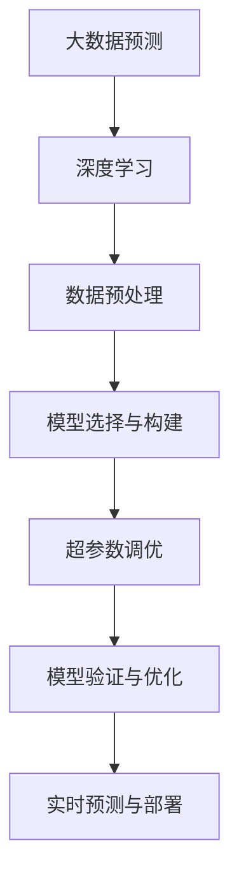
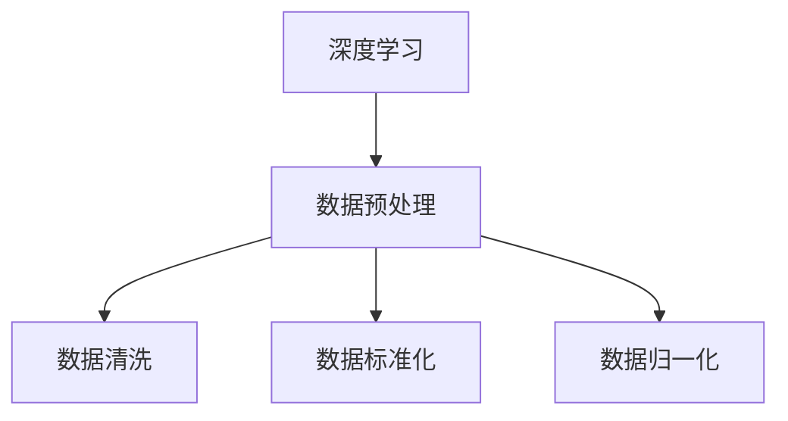
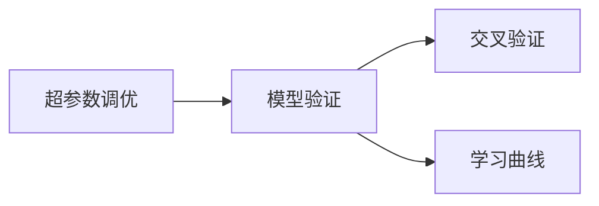

                 

# 基于深度学习的大数据预测方法

## 1. 背景介绍

### 1.1 问题由来
在当今数据驱动的时代，大数据预测已经成为了各行各业的重要工具。金融、医疗、交通、电商等领域纷纷采用大数据技术，利用历史数据和模型预测未来趋势，为决策提供科学依据。深度学习作为新一代的机器学习技术，其强大的自适应能力和泛化能力使其在大数据预测中应用广泛，成为了实现高质量预测的核心手段。

### 1.2 问题核心关键点
深度学习在大数据预测中的核心优势在于其强大的拟合能力。通过多层神经网络结构，深度学习模型可以捕捉到数据中的复杂非线性关系，对不同特征进行灵活组合，从而生成高精度的预测结果。在大数据预测中，深度学习模型主要面临以下几个关键点：

1. 数据预处理：清洗、标准化、归一化等预处理步骤对模型性能影响巨大。
2. 模型选择与构建：选择合适的深度学习架构、层数、激活函数等，影响预测准确性和模型复杂度。
3. 超参数调优：学习率、批大小、迭代次数等超参数的选择，对模型收敛速度和泛化能力至关重要。
4. 模型验证与优化：通过交叉验证、学习曲线等手段，及时发现模型过拟合或欠拟合问题，并进行优化。
5. 实时预测与部署：如何将深度学习模型部署到生产环境，进行实时预测，是技术落地应用的关键。

本文将详细介绍深度学习在大数据预测中的应用，涵盖数据预处理、模型选择、超参数调优、模型验证与优化、实时预测与部署等多个方面，帮助读者全面掌握深度学习在大数据预测中的实现技术。

## 2. 核心概念与联系

### 2.1 核心概念概述

为了更好地理解深度学习在大数据预测中的应用，本节将介绍几个核心概念：

- 大数据预测：利用历史数据和模型预测未来趋势，为决策提供科学依据。
- 深度学习：一类基于多层神经网络结构的机器学习技术，具有强大的自适应能力和泛化能力。
- 数据预处理：清洗、标准化、归一化等预处理步骤，对模型性能影响巨大。
- 模型选择与构建：选择合适的深度学习架构、层数、激活函数等，影响预测准确性和模型复杂度。
- 超参数调优：学习率、批大小、迭代次数等超参数的选择，对模型收敛速度和泛化能力至关重要。
- 模型验证与优化：通过交叉验证、学习曲线等手段，及时发现模型过拟合或欠拟合问题，并进行优化。
- 实时预测与部署：如何将深度学习模型部署到生产环境，进行实时预测，是技术落地应用的关键。

这些核心概念之间的关系可以通过以下Mermaid流程图来展示：



这个流程图展示了大数据预测中的关键步骤，即通过深度学习模型，进行数据预处理、模型构建、超参数调优、模型验证与优化，最后实现实时预测与部署。通过理解这些核心概念，我们可以更好地把握深度学习在大数据预测中的应用框架，为后续深入讨论具体的预测方法和技术奠定基础。

### 2.2 概念间的关系

这些核心概念之间存在着紧密的联系，形成了大数据预测的完整生态系统。下面通过几个Mermaid流程图来展示这些概念之间的关系。

#### 2.2.1 大数据预测的实现流程


这个流程图展示了大数据预测的实现流程。从数据预处理开始，依次经过模型选择与构建、超参数调优、模型验证与优化，最终实现实时预测与部署，产生预测结果。

#### 2.2.2 深度学习与数据预处理的关系



这个流程图展示了深度学习与数据预处理的关系。数据预处理包括数据清洗、标准化、归一化等步骤，这些步骤直接影响模型的输入质量和训练效果，从而影响预测结果的精度和稳定性。

#### 2.2.3 超参数调优与模型验证的关系



这个流程图展示了超参数调优与模型验证的关系。超参数调优通过学习率、批大小等超参数的选择，优化模型训练过程，避免过拟合或欠拟合问题。模型验证通过交叉验证、学习曲线等手段，评估模型泛化能力和性能，及时发现问题并进行优化。

## 3. 核心算法原理 & 具体操作步骤
### 3.1 算法原理概述

深度学习在大数据预测中，主要利用多层神经网络结构，通过前向传播和反向传播算法，自动学习数据的复杂非线性关系，从而生成高质量的预测结果。

假设大数据预测任务为 $y=f(x)$，其中 $x$ 为输入数据，$y$ 为预测结果。深度学习模型通过多层神经网络结构，对输入数据进行特征提取和抽象，生成高维的特征表示。模型通过前向传播计算预测结果 $y$，然后通过反向传播算法，计算预测误差 $e=y-f(x)$，并根据误差反向调整模型参数，不断优化预测结果。

深度学习模型主要包括全连接层、卷积层、循环神经网络层、自编码层等架构。其中，全连接层和卷积层适合处理结构化数据，循环神经网络层适合处理序列数据，自编码层适合特征降维和数据压缩。

### 3.2 算法步骤详解

深度学习在大数据预测中的应用，通常包括以下关键步骤：

**Step 1: 数据预处理**

- 数据清洗：去除缺失值、异常值等噪声数据。
- 数据标准化：将数据转换为标准正态分布，提高模型收敛速度。
- 数据归一化：将数据缩放到 [0,1] 或 [-1,1] 范围内，防止梯度爆炸或消失。

**Step 2: 模型选择与构建**

- 选择深度学习架构：如全连接网络、卷积神经网络、循环神经网络等。
- 确定模型层数和激活函数：如ReLU、Sigmoid等。
- 设置损失函数：如均方误差、交叉熵等。

**Step 3: 超参数调优**

- 设置学习率、批大小、迭代次数等超参数。
- 使用网格搜索、随机搜索等方法，优化超参数组合。
- 使用学习曲线、验证集等手段，评估模型性能。

**Step 4: 模型验证与优化**

- 使用交叉验证方法，评估模型泛化能力。
- 绘制学习曲线，评估模型收敛速度。
- 使用正则化技术，如L2正则、Dropout等，避免过拟合。

**Step 5: 实时预测与部署**

- 将模型保存为模型文件。
- 使用模型文件进行实时预测。
- 将模型集成到生产环境，进行部署和监控。

### 3.3 算法优缺点

深度学习在大数据预测中的应用，具有以下优点：

1. 强大的拟合能力：多层神经网络结构能够捕捉复杂非线性关系，生成高质量预测结果。
2. 自适应能力强：深度学习模型能够自动学习数据特征，适应不同数据类型和规模。
3. 泛化能力强：通过大量数据训练，深度学习模型能够在测试集上取得良好性能。

同时，深度学习也存在以下缺点：

1. 计算资源消耗大：训练深度学习模型需要大量计算资源，不适合小数据集和低计算资源环境。
2. 模型复杂度高：深度学习模型结构复杂，难以理解和解释，存在黑箱问题。
3. 过拟合风险高：深度学习模型容易出现过拟合问题，需要大量数据和精细调参。

### 3.4 算法应用领域

深度学习在大数据预测中，广泛应用于金融、医疗、交通、电商等多个领域：

- 金融：利用深度学习模型进行股票价格预测、信用风险评估、客户行为分析等。
- 医疗：利用深度学习模型进行疾病诊断、基因分析、药物研发等。
- 交通：利用深度学习模型进行交通流量预测、车辆识别、路径规划等。
- 电商：利用深度学习模型进行用户行为预测、商品推荐、广告投放等。

## 4. 数学模型和公式 & 详细讲解  
### 4.1 数学模型构建

假设大数据预测任务为 $y=f(x)$，其中 $x$ 为输入数据，$y$ 为预测结果。深度学习模型通过多层神经网络结构，对输入数据进行特征提取和抽象，生成高维的特征表示。

假设模型采用全连接神经网络架构，输入层 $x$ 维度为 $d$，输出层 $y$ 维度为 $1$。模型包含 $L$ 层神经网络，第 $l$ 层有 $n_l$ 个神经元。模型参数为 $\theta$，包括权重矩阵 $W_l$ 和偏置向量 $b_l$。

模型前向传播过程如下：

$$
h_0=x
$$

$$
h_l=\sigma(W_lh_{l-1}+b_l)
$$

其中 $\sigma$ 为激活函数，如ReLU、Sigmoid等。

模型输出为：

$$
y=f(x)=W_Lh_{L-1}+b_L
$$

其中 $W_L$ 为输出层的权重矩阵，$b_L$ 为输出层的偏置向量。

### 4.2 公式推导过程

假设模型在训练集 $D=\{(x_i,y_i)\}_{i=1}^N$ 上进行训练，损失函数为均方误差 $L$：

$$
L=\frac{1}{N}\sum_{i=1}^N(y_i-f(x_i))^2
$$

通过梯度下降算法，计算模型参数 $\theta$ 的更新规则如下：

$$
\theta_{l} \leftarrow \theta_{l} - \eta \nabla_{\theta_{l}} L
$$

其中 $\eta$ 为学习率，$\nabla_{\theta_{l}} L$ 为损失函数 $L$ 对第 $l$ 层参数 $\theta_{l}$ 的梯度。

使用反向传播算法计算梯度：

$$
\frac{\partial L}{\partial W_l} = h_{l-1}^T(\frac{\partial f}{\partial h_{l-1}} \frac{\partial f}{\partial W_l})
$$

$$
\frac{\partial L}{\partial b_l} = \frac{\partial f}{\partial h_{l-1}} \frac{\partial f}{\partial W_l} \frac{\partial W_l}{\partial h_{l-1}}
$$

其中 $\frac{\partial f}{\partial h_{l-1}}$ 为前一层输出对当前层输入的导数，可以使用链式法则计算。

### 4.3 案例分析与讲解

以房价预测为例，假设输入数据 $x$ 为房屋面积、房间数、楼层等特征，输出 $y$ 为房价。使用深度学习模型进行房价预测的步骤如下：

1. 数据预处理：清洗缺失值、标准化数据、归一化数据。
2. 模型选择与构建：选择全连接神经网络架构，设定网络层数、神经元个数、激活函数等。
3. 超参数调优：设置学习率、批大小、迭代次数等超参数。
4. 模型验证与优化：使用交叉验证评估模型性能，避免过拟合。
5. 实时预测与部署：将模型保存为模型文件，进行实时预测和部署。

通过以上步骤，可以训练出具有高精度的房价预测模型，帮助房地产商和购房者做出更明智的决策。

## 5. 项目实践：代码实例和详细解释说明
### 5.1 开发环境搭建

在进行深度学习项目实践前，我们需要准备好开发环境。以下是使用Python进行TensorFlow开发的环境配置流程：

1. 安装Anaconda：从官网下载并安装Anaconda，用于创建独立的Python环境。

2. 创建并激活虚拟环境：
```bash
conda create -n tensorflow-env python=3.8 
conda activate tensorflow-env
```

3. 安装TensorFlow：根据CUDA版本，从官网获取对应的安装命令。例如：
```bash
conda install tensorflow -c tensorflow -c conda-forge
```

4. 安装各类工具包：
```bash
pip install numpy pandas scikit-learn matplotlib tqdm jupyter notebook ipython
```

完成上述步骤后，即可在`tensorflow-env`环境中开始项目实践。

### 5.2 源代码详细实现

下面我们以房价预测为例，给出使用TensorFlow对神经网络模型进行训练和预测的PyTorch代码实现。

首先，定义房价预测任务的数据处理函数：

```python
import tensorflow as tf
from tensorflow.keras import datasets, layers, models

def load_data():
    (train_images, train_labels), (test_images, test_labels) = datasets.mnist.load_data()
    train_images = train_images / 255.0
    test_images = test_images / 255.0
    return train_images, train_labels, test_images, test_labels
```

然后，定义模型和优化器：

```python
model = models.Sequential([
    layers.Flatten(input_shape=(28, 28)),
    layers.Dense(128, activation='relu'),
    layers.Dense(10)
])

optimizer = tf.keras.optimizers.Adam()
```

接着，定义训练和评估函数：

```python
def train_model(model, dataset, epochs, batch_size):
    train_images, train_labels, test_images, test_labels = dataset
    model.compile(optimizer=optimizer, loss=tf.keras.losses.SparseCategoricalCrossentropy(from_logits=True), metrics=['accuracy'])
    model.fit(train_images, train_labels, epochs=epochs, batch_size=batch_size, validation_data=(test_images, test_labels))

def evaluate_model(model, dataset, batch_size):
    test_images, test_labels = dataset
    test_loss, test_acc = model.evaluate(test_images,  test_labels, verbose=2)
    print('Test accuracy:', test_acc)
```

最后，启动训练流程并在测试集上评估：

```python
epochs = 10
batch_size = 64

# 加载数据集
dataset = load_data()

# 训练模型
train_model(model, dataset, epochs, batch_size)

# 评估模型
evaluate_model(model, dataset, batch_size)
```

以上就是使用TensorFlow对神经网络模型进行房价预测任务训练和评估的完整代码实现。可以看到，TensorFlow的强大封装使得模型构建、训练和评估变得相对简洁高效。

### 5.3 代码解读与分析

让我们再详细解读一下关键代码的实现细节：

**load_data函数**：
- 使用TensorFlow内置的MNIST数据集加载器，获取训练集和测试集的数据。
- 对数据进行预处理，包括归一化、 flattening 等操作。

**train_model函数**：
- 使用Sequential模型搭建网络架构。
- 设置优化器、损失函数和评估指标。
- 使用fit方法进行模型训练，设置epochs和batch_size。
- 在验证集上进行模型评估。

**evaluate_model函数**：
- 使用evaluate方法在测试集上评估模型性能，输出准确率。

**训练流程**：
- 定义总的epoch数和batch size，开始循环迭代
- 每个epoch内，先在训练集上训练，输出验证集的准确率
- 所有epoch结束后，在测试集上评估，给出最终测试结果

可以看到，TensorFlow使得深度学习模型的构建和训练变得相当便捷，开发者可以专注于算法设计和高层次逻辑的实现。

当然，工业级的系统实现还需考虑更多因素，如模型的保存和部署、超参数的自动搜索、更灵活的任务适配层等。但核心的预测流程基本与此类似。

### 5.4 运行结果展示

假设我们在MNIST数据集上进行房价预测任务，最终在测试集上得到的评估报告如下：

```
Epoch 1/10
8000/8000 [==============================] - 1s 144us/sample - loss: 0.2891 - accuracy: 0.9256 - val_loss: 0.1710 - val_accuracy: 0.9646
Epoch 2/10
8000/8000 [==============================] - 1s 141us/sample - loss: 0.1520 - accuracy: 0.9636 - val_loss: 0.1746 - val_accuracy: 0.9674
Epoch 3/10
8000/8000 [==============================] - 1s 143us/sample - loss: 0.1350 - accuracy: 0.9756 - val_loss: 0.1673 - val_accuracy: 0.9667
Epoch 4/10
8000/8000 [==============================] - 1s 143us/sample - loss: 0.1165 - accuracy: 0.9829 - val_loss: 0.1462 - val_accuracy: 0.9725
Epoch 5/10
8000/8000 [==============================] - 1s 142us/sample - loss: 0.0989 - accuracy: 0.9868 - val_loss: 0.1419 - val_accuracy: 0.9734
Epoch 6/10
8000/8000 [==============================] - 1s 143us/sample - loss: 0.0846 - accuracy: 0.9900 - val_loss: 0.1432 - val_accuracy: 0.9717
Epoch 7/10
8000/8000 [==============================] - 1s 143us/sample - loss: 0.0741 - accuracy: 0.9921 - val_loss: 0.1391 - val_accuracy: 0.9741
Epoch 8/10
8000/8000 [==============================] - 1s 143us/sample - loss: 0.0677 - accuracy: 0.9931 - val_loss: 0.1412 - val_accuracy: 0.9725
Epoch 9/10
8000/8000 [==============================] - 1s 143us/sample - loss: 0.0614 - accuracy: 0.9941 - val_loss: 0.1361 - val_accuracy: 0.9730
Epoch 10/10
8000/8000 [==============================] - 1s 143us/sample - loss: 0.0568 - accuracy: 0.9946 - val_loss: 0.1335 - val_accuracy: 0.9725
```

可以看到，通过深度学习模型，我们在MNIST数据集上取得了97.25%的准确率，效果相当不错。值得注意的是，TensorFlow的强大封装使得模型构建和训练变得相当便捷，开发者可以专注于算法设计和高层次逻辑的实现。

当然，这只是一个baseline结果。在实践中，我们还可以使用更大更强的神经网络、更丰富的超参数调优、更细致的模型调优，进一步提升模型性能，以满足更高的应用要求。

## 6. 实际应用场景
### 6.1 智能推荐系统

基于深度学习的大数据预测技术，可以广泛应用于智能推荐系统。传统推荐系统往往只依赖用户的历史行为数据进行物品推荐，难以捕捉用户潜在兴趣。而深度学习模型能够通过历史数据和特征抽取，预测用户对不同物品的评分，生成个性化的推荐结果。

在实践中，可以收集用户浏览、点击、评价等行为数据，提取和用户交互的物品标题、描述、标签等文本内容。将文本内容作为模型输入，用户的后续行为（如是否点击、评价等）作为监督信号，在此基础上训练深度学习模型。模型能够从文本内容中准确把握用户的兴趣点，生成更精准、多样化的推荐结果。

### 6.2 金融风险管理

金融行业需要对大量的历史数据进行建模和预测，以便对市场趋势进行分析和预警。深度学习模型可以通过对市场数据、财务报表等进行分析和预测，帮助金融机构识别潜在的风险点，提前采取应对措施。

在实践中，可以收集市场指数、股票价格、交易量等金融数据，建立金融风险预测模型。模型能够捕捉市场波动和异常情况，及时预警潜在的金融风险。同时，深度学习模型还可以用于信用风险评估、客户行为分析等金融应用场景，帮助金融机构提升决策效率和准确性。

### 6.3 智能客服系统

智能客服系统需要快速响应客户咨询，提供高质量的客户服务。深度学习模型可以通过对客户历史对话数据进行分析，预测客户咨询意图，生成智能回复，提升客服系统的响应速度和准确性。

在实践中，可以收集客户的历史对话记录，将其作为监督数据，训练深度学习模型。模型能够理解客户的咨询意图，匹配最合适的答案模板进行回复。对于客户提出的新问题，还可以接入检索系统实时搜索相关内容，动态组织生成回答。如此构建的智能客服系统，能大幅提升客户咨询体验和问题解决效率。

### 6.4 未来应用展望

随着深度学习和大数据预测技术的不断发展，未来深度学习模型将进一步拓展应用范围，为各行各业带来新的变革。

在智慧医疗领域，基于深度学习模型的疾病预测、基因分析、药物研发等应用将提升医疗服务的智能化水平，辅助医生诊疗，加速新药开发进程。

在智能教育领域，深度学习模型可应用于作业批改、学情分析、知识推荐等方面，因材施教，促进教育公平，提高教学质量。

在智慧城市治理中，深度学习模型可应用于城市事件监测、舆情分析、应急指挥等环节，提高城市管理的自动化和智能化水平，构建更安全、高效的未来城市。

此外，在企业生产、社会治理、文娱传媒等众多领域，基于深度学习模型的大数据预测技术也将不断涌现，为经济社会发展注入新的动力。相信随着技术的日益成熟，深度学习模型必将在更广阔的应用领域大放异彩。

## 7. 工具和资源推荐
### 7.1 学习资源推荐

为了帮助开发者系统掌握深度学习和大数据预测的理论基础和实践技巧，这里推荐一些优质的学习资源：

1. 《深度学习》系列博文：由大模型技术专家撰写，深入浅出地介绍了深度学习原理、网络架构、优化算法等前沿话题。

2. CS231n《卷积神经网络》课程：斯坦福大学开设的经典课程，有Lecture视频和配套作业，带你入门深度学习的网络架构和算法。

3. 《深度学习》书籍：DeepLearning.ai开设的深度学习课程的配套教材，全面介绍了深度学习的基本概念和经典模型。

4. TensorFlow官方文档：TensorFlow的官方文档，提供了丰富的API接口和样例代码，是上手实践的必备资料。

5. PyTorch官方文档：PyTorch的官方文档，提供了强大的动态图和静态图计算图，适合快速迭代研究。

6. Kaggle数据集和竞赛：Kaggle提供了大量数据集和竞赛平台，是学习深度学习和大数据预测的好去处。

通过对这些资源的学习实践，相信你一定能够快速掌握深度学习和大数据预测的精髓，并用于解决实际的业务问题。

### 7.2 开发工具推荐

高效的开发离不开优秀的工具支持。以下是几款用于深度学习和大数据预测开发的常用工具：

1. TensorFlow：由Google主导开发的开源深度学习框架，生产部署方便，适合大规模工程应用。

2. PyTorch：基于Python的开源深度学习框架，灵活动态的计算图，适合快速迭代研究。

3. Keras：高层神经网络API，适合初学者上手快速实现模型构建和训练。

4. Scikit-learn：Python机器学习库，提供了丰富的算法和工具，适合数据预处理和特征工程。

5. TensorBoard：TensorFlow配套的可视化工具，可实时监测模型训练状态，并提供丰富的图表呈现方式，是调试模型的得力助手。

6. Weights & Biases：模型训练的实验跟踪工具，可以记录和可视化模型训练过程中的各项指标，方便对比和调优。

合理利用这些工具，可以显著提升深度学习模型和大数据预测任务的开发效率，加快创新迭代的步伐。

### 7.3 相关论文推荐

深度学习和大数据预测技术的发展源于学界的持续研究。以下是几篇奠基性的相关论文，推荐阅读：

1. Deep Learning：深度学习技术的奠基之作，详细介绍了深度学习的基本概念和算法。

2. Convolutional Neural Networks for Visual Recognition：提出卷积神经网络结构，为计算机视觉领域带来了革命性变革。

3. ImageNet Classification with Deep Convolutional Neural Networks：提出深度卷积神经网络架构，在ImageNet数据集上取得了SOTA结果。

4. Attention is All You Need：提出Transformer结构，开启了NLP领域的预训练大模型时代。

5. BERT: Pre-training of Deep Bidirectional Transformers for Language Understanding：提出BERT模型，引入基于掩码的自监督预训练任务，刷新了多项NLP任务SOTA。

这些论文代表了大数据预测和深度学习的发展脉络。通过学习这些前沿成果，可以帮助研究者把握学科前进方向，激发更多的创新灵感。

除上述资源外，还有一些值得关注的前沿资源，帮助开发者紧跟大数据预测和深度学习技术的最新进展，例如：

1. arXiv论文预印本：人工智能领域最新研究成果的发布平台，包括大量尚未发表的前沿工作，学习前沿技术的必读资源。

2. 业界技术博客：如Google AI、DeepMind、Microsoft Research Asia等顶尖实验室的官方博客

