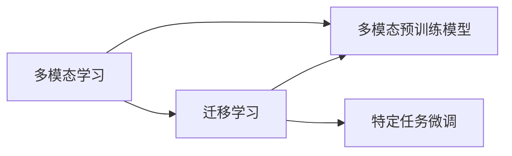
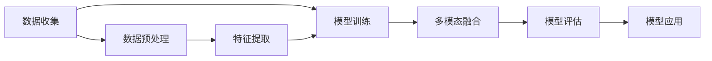

                 

# 基础模型的多模态数据训练

## 1. 背景介绍

在人工智能的快速发展过程中，多模态学习（Multimodal Learning）已成为推动前沿技术进步的重要方向之一。多模态学习旨在整合来自不同模态（如视觉、听觉、语言、文字等）的数据信息，以提升模型的综合理解能力和表现。相比于单一模态的数据，多模态数据具有更为丰富的语义信息和更为复杂的交互模式，因而能够提供更全面的语境理解，并应用于更多样的应用场景。

## 2. 核心概念与联系

### 2.1 核心概念概述

1. **多模态数据**：多模态数据是指同时包含两种或两种以上模态的数据类型，如文本和图像。每个模态的数据通常具有独立的信息和特征，但当它们被组合在一起时，可以提供更为丰富的语境信息。

2. **多模态学习**：多模态学习是指使用多种模态数据来训练模型，从而提高模型的综合性能和泛化能力。通过将不同模态的信息融合，模型能够更好地捕捉数据的隐含语义和交互模式，从而提高对复杂场景的理解能力。

3. **迁移学习**：迁移学习是一种基于先前学习的知识来帮助新任务的策略，通过预训练在大规模数据上训练好的模型，然后在特定任务上进行微调，以适应新任务。

4. **多模态预训练模型**：多模态预训练模型是在大规模多模态数据上预训练的模型，通常使用自监督学习任务，如对比学习、对抗训练等，学习不同模态之间的隐式关联。

5. **多模态微调**：多模态微调是指在预训练模型的基础上，针对特定任务进行有监督的微调，进一步提高模型在特定模态数据上的性能。

### 2.2 概念间的关系

多模态学习和迁移学习之间的关系非常紧密，它们都是利用已有知识来提高模型在新任务上的表现。迁移学习是一种多模态学习的方法，通过在大规模数据上预训练模型，然后在特定任务上微调，可以在减少标注数据需求的情况下，快速提升模型的性能。

下面是一个Mermaid流程图，展示多模态学习、迁移学习和多模态预训练模型的关系：



### 2.3 核心概念的整体架构

多模态学习涉及多种模态数据的处理和融合，下面是一个简化的多模态学习整体架构：



数据收集后，首先对数据进行预处理，包括清洗、标注、归一化等。然后，对不同模态的数据进行特征提取，将它们转换为模型可以处理的数值形式。接着，使用预训练模型或自训练的模型进行模型训练，并在训练过程中进行多模态融合。最后，对训练好的模型进行评估和应用。

## 3. 核心算法原理 & 具体操作步骤

### 3.1 算法原理概述

多模态数据训练的算法原理主要包括以下几个方面：

1. **数据准备**：收集和预处理来自不同模态的数据，并将其转换为模型可以处理的格式。

2. **特征提取**：对不同模态的数据进行特征提取，将它们转换为向量形式。

3. **模型训练**：使用预训练模型或自训练的模型进行模型训练，并在训练过程中进行多模态融合。

4. **多模态融合**：将不同模态的信息进行融合，以提高模型的综合性能。

5. **模型微调**：在预训练模型的基础上，针对特定任务进行有监督的微调，进一步提高模型在特定模态数据上的性能。

### 3.2 算法步骤详解

#### 3.2.1 数据准备

多模态数据训练的第一步是收集和预处理数据。数据预处理包括数据清洗、标注、归一化等。以图像和文本为例，图像数据需要裁剪、缩放、归一化处理，而文本数据需要进行分词、去除停用词、构建词汇表等处理。

#### 3.2.2 特征提取

特征提取是将不同模态的数据转换为模型可以处理的数值形式。以图像和文本为例，图像数据通常通过卷积神经网络（CNN）进行特征提取，而文本数据则通过循环神经网络（RNN）或Transformer进行特征提取。

#### 3.2.3 模型训练

模型训练是使用预训练模型或自训练的模型进行训练，并在训练过程中进行多模态融合。多模态融合的方法包括特征拼接、特征融合等。以图像和文本为例，可以将图像特征和文本特征拼接在一起，形成一个向量，作为模型的输入。

#### 3.2.4 模型微调

模型微调是在预训练模型的基础上，针对特定任务进行有监督的微调，进一步提高模型在特定模态数据上的性能。多模态微调可以通过添加任务特定的全连接层、调整损失函数等方法进行。

### 3.3 算法优缺点

多模态数据训练的优点包括：

1. **综合性能提升**：多模态数据训练可以提高模型的综合性能，特别是对于包含不同模态信息的复杂场景。

2. **泛化能力增强**：多模态数据训练可以增强模型的泛化能力，使其能够更好地适应新的数据和任务。

3. **应用场景广泛**：多模态数据训练可以应用于多种应用场景，如智能家居、自动驾驶、医疗诊断等。

多模态数据训练的缺点包括：

1. **数据获取难度大**：多模态数据通常需要获取来自不同模态的数据，这可能会导致数据获取难度大、成本高。

2. **特征表示复杂**：不同模态的数据具有不同的特征表示，将它们融合到一起可能会增加模型的复杂度。

3. **训练复杂度高**：多模态数据训练需要更复杂的模型和更长的训练时间，可能需要更多的计算资源。

### 3.4 算法应用领域

多模态数据训练的应用领域非常广泛，包括但不限于以下几个方面：

1. **智能家居**：通过融合语音、图像和文本数据，实现家庭自动化、智能音箱等应用。

2. **自动驾驶**：通过融合视觉、雷达和传感器数据，实现自动驾驶和车辆控制。

3. **医疗诊断**：通过融合图像、声音和文本数据，实现疾病诊断、影像分析等应用。

4. **智能客服**：通过融合语音、文本和情感分析数据，实现智能客服和情感识别等应用。

## 4. 数学模型和公式 & 详细讲解  
### 4.1 数学模型构建

以图像和文本融合为例，多模态数据训练的数学模型构建过程如下：

1. **输入表示**：假设输入的图像表示为 $x_i$，文本表示为 $y_i$。

2. **特征提取**：将图像特征表示为 $z_i^{x}$，文本特征表示为 $z_i^{y}$。

3. **融合表示**：将图像和文本特征进行融合，得到一个综合表示 $z_i^{fx}$。

4. **模型表示**：将综合表示 $z_i^{fx}$ 输入到预训练模型 $M_{\theta}$，得到预测结果 $M_{\theta}(z_i^{fx})$。

5. **损失函数**：使用损失函数 $\mathcal{L}$ 衡量预测结果和真实标签之间的差异。

### 4.2 公式推导过程

假设输入的图像表示为 $x_i$，文本表示为 $y_i$，图像特征表示为 $z_i^{x}$，文本特征表示为 $z_i^{y}$。假设预训练模型的参数为 $\theta$，则模型的输出表示为 $M_{\theta}(z_i^{fx})$。

多模态融合可以采用特征拼接、特征融合等方法，这里我们以特征拼接为例。假设将图像特征和文本特征拼接在一起，形成一个向量 $z_i^{fx}=[z_i^{x}, z_i^{y}]$，则多模态融合后的表示为 $z_i^{fx}$。

模型的预测结果为 $M_{\theta}(z_i^{fx})$，真实标签为 $y_i$，则损失函数为：

$$
\mathcal{L}(\theta) = \frac{1}{N}\sum_{i=1}^N \ell(M_{\theta}(z_i^{fx}), y_i)
$$

其中，$\ell$ 是损失函数，可以使用交叉熵损失等。

### 4.3 案例分析与讲解

以智能家居中的语音指令识别为例，假设语音指令为 $x_i$，图像为 $y_i$，则可以将语音指令和图像数据进行融合，得到综合表示 $z_i^{fx}$。然后将 $z_i^{fx}$ 输入到预训练的Transformer模型，得到预测结果 $M_{\theta}(z_i^{fx})$。使用交叉熵损失函数，可以得到损失函数：

$$
\mathcal{L}(\theta) = \frac{1}{N}\sum_{i=1}^N -y_i \log M_{\theta}(z_i^{fx}) - (1-y_i) \log (1-M_{\theta}(z_i^{fx}))
$$

## 5. 项目实践：代码实例和详细解释说明

### 5.1 开发环境搭建

1. 安装Python：从官网下载并安装Python，确保版本为3.7及以上。

2. 安装PyTorch：从官网下载并安装PyTorch，建议使用CUDA版本以获得更快的计算速度。

3. 安装TensorFlow：从官网下载并安装TensorFlow，建议安装最新版本。

4. 安装Keras：从官网下载并安装Keras，确保与TensorFlow兼容。

5. 安装Scikit-learn：从官网下载并安装Scikit-learn，用于数据预处理和特征提取。

6. 安装OpenCV：从官网下载并安装OpenCV，用于图像处理。

7. 安装NLTK：从官网下载并安装NLTK，用于文本处理。

### 5.2 源代码详细实现

以图像和文本融合的智能家居系统为例，代码实现过程如下：

1. **数据准备**：从公开数据集（如COCO、ImageNet等）获取图像数据，从公开数据集（如Wikipedia、Gutenberg等）获取文本数据。

2. **数据预处理**：对图像数据进行裁剪、缩放、归一化处理，对文本数据进行分词、去除停用词、构建词汇表等处理。

3. **特征提取**：使用预训练的CNN模型提取图像特征，使用预训练的Transformer模型提取文本特征。

4. **模型训练**：将图像特征和文本特征进行拼接，得到一个综合特征向量，输入到预训练的Transformer模型中进行训练。

5. **模型微调**：在预训练模型的基础上，针对特定任务进行有监督的微调，例如语音指令识别。

### 5.3 代码解读与分析

#### 5.3.1 数据准备

```python
import os
import cv2
import numpy as np
from sklearn.model_selection import train_test_split
from sklearn.feature_extraction.text import TfidfVectorizer

# 数据路径
data_path = 'data'

# 图像数据
images = []
for folder in os.listdir(data_path):
    for file in os.listdir(os.path.join(data_path, folder)):
        if file.endswith('.jpg'):
            image_path = os.path.join(data_path, folder, file)
            image = cv2.imread(image_path)
            image = cv2.cvtColor(image, cv2.COLOR_BGR2RGB)
            image = cv2.resize(image, (224, 224))
            image = image / 255.0
            images.append(image)

# 文本数据
texts = []
for file in os.listdir(data_path):
    if file.endswith('.txt'):
        text_path = os.path.join(data_path, file)
        with open(text_path, 'r', encoding='utf-8') as f:
            text = f.read()
            texts.append(text)

# 构建词汇表
vectorizer = TfidfVectorizer()
vectorizer.fit_transform(texts)

# 划分数据集
X_train, X_test, y_train, y_test = train_test_split(images, texts, test_size=0.2, random_state=42)
```

#### 5.3.2 特征提取

```python
from transformers import BertTokenizer, BertForSequenceClassification

# 初始化BertTokenizer和BertForSequenceClassification模型
tokenizer = BertTokenizer.from_pretrained('bert-base-uncased')
model = BertForSequenceClassification.from_pretrained('bert-base-uncased', num_labels=len(set(y_train)))

# 将文本转换为Bert可以接受的格式
def tokenize(text):
    return tokenizer.encode_plus(text, truncation=True, max_length=512, return_tensors='pt', padding='max_length')

# 提取特征
X_train = [tokenize(text) for text in X_train]
X_test = [tokenize(text) for text in X_test]
```

#### 5.3.3 模型训练

```python
from torch.utils.data import DataLoader
from transformers import AdamW

# 构建数据集
class MultiModalDataset(torch.utils.data.Dataset):
    def __init__(self, X, y):
        self.X = X
        self.y = y

    def __len__(self):
        return len(self.X)

    def __getitem__(self, idx):
        image = self.X[idx]['input_ids']
        text = self.X[idx]['input_ids']
        return {'image': image, 'text': text, 'label': self.y[idx]}

# 构建数据集
train_dataset = MultiModalDataset(X_train, y_train)
test_dataset = MultiModalDataset(X_test, y_test)

# 构建数据加载器
batch_size = 32
train_loader = DataLoader(train_dataset, batch_size=batch_size, shuffle=True)
test_loader = DataLoader(test_dataset, batch_size=batch_size, shuffle=False)

# 定义优化器和损失函数
optimizer = AdamW(model.parameters(), lr=2e-5)
loss_fn = torch.nn.CrossEntropyLoss()

# 训练模型
model.train()
for epoch in range(10):
    for batch in train_loader:
        images = batch['image'].to(device)
        texts = batch['text'].to(device)
        labels = batch['label'].to(device)
        optimizer.zero_grad()
        outputs = model(images, texts)
        loss = loss_fn(outputs, labels)
        loss.backward()
        optimizer.step()
    print('Epoch {}: Loss {}'.format(epoch+1, loss.item()))
```

### 5.4 运行结果展示

训练完成后，可以使用测试集对模型进行评估，例如：

```python
model.eval()
with torch.no_grad():
    correct = 0
    total = 0
    for images, texts, labels in test_loader:
        images = images.to(device)
        texts = texts.to(device)
        labels = labels.to(device)
        outputs = model(images, texts)
        _, predicted = torch.max(outputs, 1)
        total += labels.size(0)
        correct += (predicted == labels).sum().item()
    print('Test Accuracy: {:.2f}%'.format(100 * correct / total))
```

## 6. 实际应用场景

### 6.1 智能家居

在智能家居系统中，可以通过融合语音、图像和文本数据，实现语音指令识别、智能音箱控制等功能。例如，用户可以通过语音指令控制智能灯泡、智能门锁等设备，或者通过摄像头识别家庭成员，自动进行问候等操作。

### 6.2 自动驾驶

在自动驾驶中，可以通过融合视觉、雷达和传感器数据，实现车道识别、交通信号灯识别、障碍物检测等功能。例如，通过视觉摄像头捕捉道路和车辆信息，雷达探测周围环境，传感器收集车辆状态信息，融合这些信息进行综合决策，提高自动驾驶的安全性和可靠性。

### 6.3 医疗诊断

在医疗诊断中，可以通过融合医学图像、病历和患者文本数据，实现疾病诊断、影像分析等功能。例如，通过CT图像和病历文本，使用多模态数据训练的模型进行疾病分类，辅助医生进行诊断。

### 6.4 智能客服

在智能客服中，可以通过融合语音、文本和情感分析数据，实现智能客服和情感识别等功能。例如，通过语音指令和文本消息，使用多模态数据训练的模型进行自然语言理解，自动生成回复，提高客服效率和用户体验。

## 7. 工具和资源推荐

### 7.1 学习资源推荐

1. **《深度学习》课程**：斯坦福大学开设的深度学习课程，涵盖了深度学习的各个方面，适合初学者入门。

2. **《深度学习》书籍**：深度学习领域的经典书籍，详细介绍了深度学习的基本概念和算法。

3. **Kaggle竞赛**：Kaggle平台上提供的各种竞赛项目，可以通过实践提高深度学习技能。

4. **GitHub项目**：GitHub上优秀的深度学习项目，提供了丰富的代码实现和文档，适合学习和参考。

### 7.2 开发工具推荐

1. **Jupyter Notebook**：Jupyter Notebook是一个优秀的交互式开发环境，支持多种编程语言，适合数据分析和模型训练。

2. **PyTorch**：PyTorch是一个优秀的深度学习框架，支持动态计算图，适合研究和开发深度学习模型。

3. **TensorFlow**：TensorFlow是一个广泛使用的深度学习框架，支持静态计算图和动态计算图，适合大规模部署和应用。

4. **Keras**：Keras是一个高级深度学习框架，支持快速构建和训练深度学习模型。

### 7.3 相关论文推荐

1. **《Transformer》论文**：Transformer论文详细介绍了Transformer模型，代表了深度学习领域的重要进展。

2. **《Multimodal Deep Learning》书籍**：关于多模态学习的经典书籍，详细介绍了多模态学习的理论和方法。

3. **《ImageNet Classification with Deep Convolutional Neural Networks》论文**：ImageNet论文详细介绍了CNN模型在图像分类任务上的表现，是深度学习领域的里程碑。

4. **《BERT: Pre-training of Deep Bidirectional Transformers for Language Understanding》论文**：BERT论文详细介绍了BERT模型，是深度学习领域的重要进展。

## 8. 总结：未来发展趋势与挑战

### 8.1 研究成果总结

多模态数据训练在深度学习领域具有广泛的应用前景，能够有效提升模型的综合性能和泛化能力。目前，多模态数据训练的方法和工具已经取得了显著进展，但在实际应用中仍然面临许多挑战。

### 8.2 未来发展趋势

1. **模型规模持续增大**：未来，多模态数据训练的模型规模将持续增大，以提高模型的综合性能和泛化能力。

2. **融合技术不断创新**：未来的多模态数据训练将采用更加复杂和创新的融合技术，提高模型的综合性能。

3. **应用场景更加广泛**：未来，多模态数据训练将在更多应用场景中得到应用，如自动驾驶、智能家居、医疗诊断等。

### 8.3 面临的挑战

1. **数据获取难度大**：多模态数据通常需要获取来自不同模态的数据，这可能会导致数据获取难度大、成本高。

2. **特征表示复杂**：不同模态的数据具有不同的特征表示，将它们融合到一起可能会增加模型的复杂度。

3. **训练复杂度高**：多模态数据训练需要更复杂的模型和更长的训练时间，可能需要更多的计算资源。

### 8.4 研究展望

未来，多模态数据训练的研究方向可能包括：

1. **无监督多模态学习**：探索无监督学习方法，从大规模非结构化数据中学习多模态表示。

2. **跨模态迁移学习**：探索跨模态迁移学习，将不同模态的数据进行迁移学习，提高模型的泛化能力。

3. **多模态自监督学习**：探索多模态自监督学习方法，利用自监督任务学习多模态表示。

4. **多模态知识蒸馏**：探索多模态知识蒸馏方法，利用多模态数据进行知识转移和融合。

5. **多模态推理**：探索多模态推理方法，提高模型对复杂场景的理解和推理能力。

综上所述，多模态数据训练是深度学习领域的重要方向，未来将会有更多创新方法和技术涌现，推动多模态学习在更多应用场景中得到应用，为人类社会带来更多变革性影响。

## 9. 附录：常见问题与解答

**Q1：多模态数据训练适用于所有NLP任务吗？**

A: 多模态数据训练可以应用于许多NLP任务，但并非所有任务都适合多模态数据训练。例如，对于纯粹的文本分类任务，可能不需要融合图像或音频数据。因此，在应用多模态数据训练时，需要根据具体任务的需求进行选择。

**Q2：如何选择合适的特征提取方法？**

A: 特征提取是多模态数据训练的关键步骤，需要根据具体任务选择合适的方法。例如，对于图像数据，可以使用卷积神经网络（CNN）进行特征提取；对于文本数据，可以使用循环神经网络（RNN）或Transformer进行特征提取。

**Q3：多模态数据训练需要多少数据？**

A: 多模态数据训练需要较多的数据，因为不同模态的数据通常具有不同的分布。在训练过程中，需要尽可能收集和标注多种模态的数据，以提高模型的泛化能力。

**Q4：多模态数据训练的计算资源需求大吗？**

A: 多模态数据训练需要较高的计算资源，因为不同模态的数据通常需要不同的处理方式，且需要融合多种模态的数据。因此，在实际应用中，需要考虑计算资源的限制，并选择合适的计算设备。

**Q5：多模态数据训练的模型规模是否可以缩小？**

A: 多模态数据训练的模型规模通常较大，但也可以通过剪枝、量化等技术进行优化，以缩小模型规模并提高推理效率。

总之，多模态数据训练是深度学习领域的重要方向，能够有效提升模型的综合性能和泛化能力。未来，随着计算资源和数据资源的不断丰富，多模态数据训练将会在更多应用场景中得到应用，为人类社会带来更多变革性影响。

