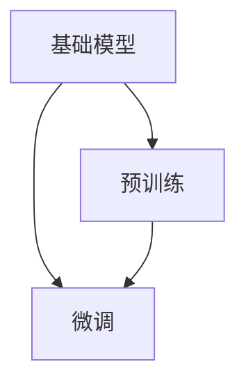

                 

# 基础模型的技术创新与社会责任

## 1. 背景介绍

在人工智能（AI）迅速发展的今天，基础模型（Foundation Models）作为AI研究的重要组成部分，已经在多个领域取得了显著的进展。这些模型通常包括深度神经网络、强化学习模型、生成对抗网络等，它们在计算机视觉、自然语言处理、语音识别等领域有着广泛的应用。然而，基础模型的技术创新不仅限于技术层面，还牵涉到社会责任的讨论。本文将从技术创新和社会责任两个方面，深入探讨基础模型的发展现状及未来方向。

## 2. 核心概念与联系

### 2.1 核心概念概述

基础模型（Foundation Models）是指在特定领域中具有广泛应用的基础研究模型，这些模型通常在大规模数据集上进行预训练，学习到通用特征，然后再根据具体任务需求进行微调（Fine-Tuning）。这类模型如BERT、GPT、AlphaGo等，已经在各自领域中展现了强大的能力。

预训练（Pre-training）是指在大规模无标签数据集上进行自监督学习，训练模型以学习通用特征。常见的预训练任务包括语言模型、图像分类、目标检测等。预训练模型的目标是尽可能地学习到数据中的通用特征，以便在微调时更好地适应特定任务。

微调（Fine-Tuning）是在预训练模型基础上，针对特定任务进行有监督学习，以优化模型在该任务上的性能。通常，微调时只调整模型的顶层，以较小的学习率更新全部或部分参数。微调后的模型能够更好地适应特定任务，提升模型性能。

### 2.2 核心概念的关系

基础模型、预训练和微调这三个概念是紧密相连的，它们共同构成了AI模型训练的基本框架。基础模型为预训练提供了数据集和模型结构，预训练则为微调打下了通用特征的基础。微调则是在预训练的基础上，针对特定任务进行优化，使模型具有更高的应用价值。

下图展示了基础模型、预训练和微调之间的关系：



从上述流程图可以看出，预训练是基础模型学习通用特征的过程，微调则是在此基础上针对特定任务进行优化，从而使基础模型在实际应用中具有更高的准确性和泛化能力。

## 3. 核心算法原理 & 具体操作步骤

### 3.1 算法原理概述

基础模型的训练主要分为预训练和微调两个阶段。预训练阶段通常使用大规模无标签数据集，通过自监督学习任务（如语言模型预测、图像分类等）训练模型，学习到通用特征。微调阶段则使用特定任务的标注数据集，通过有监督学习任务训练模型，优化模型在该任务上的性能。

在预训练阶段，基础模型通常是深度神经网络，如卷积神经网络（CNN）、循环神经网络（RNN）、变换器（Transformer）等。这些模型通过自动编码器、自回归模型、变分自编码器等方法，学习到数据的表示和结构信息。在微调阶段，模型会根据具体任务的需求，使用不同的输出层和损失函数，通过梯度下降等优化算法进行训练，更新模型参数，以适应特定任务的要求。

### 3.2 算法步骤详解

基础模型的训练通常包括以下几个关键步骤：

**Step 1: 准备预训练数据集**
- 收集大规模无标签数据集，如ImageNet、COCO、Wikipedia等。
- 数据清洗和预处理，包括图像归一化、文本分词、数据增强等。

**Step 2: 设计预训练任务**
- 选择自监督学习任务，如语言模型预测、图像分类、目标检测等。
- 设计训练框架和优化器，如Adam、SGD等，设置学习率、批大小等超参数。

**Step 3: 进行预训练**
- 使用大规模无标签数据集对基础模型进行预训练，学习通用特征。
- 通过验证集监控模型性能，调整超参数。

**Step 4: 进行微调**
- 收集特定任务的标注数据集，如PASCAL VOC、COCO、Yelp等。
- 设计任务适配层和损失函数，如分类器、回归器、解码器等。
- 设置微调超参数，如学习率、批大小等。
- 使用特定任务的数据集对基础模型进行微调，优化模型在该任务上的性能。

**Step 5: 评估和部署**
- 在测试集上评估微调后模型的性能，对比预训练和微调前后的效果。
- 将微调后的模型部署到实际应用系统中，进行实时推理和预测。

### 3.3 算法优缺点

基础模型的训练方法具有以下优点：
1. 高效性：预训练和微调可以并行进行，提高训练效率。
2. 泛化能力：预训练模型学习到通用特征，具有较强的泛化能力。
3. 参数共享：共享基础模型的参数，减少训练成本。
4. 灵活性：基础模型可以应用于各种任务，提高应用场景的覆盖率。

然而，基础模型训练也存在一些缺点：
1. 依赖数据：需要大规模无标签数据集进行预训练，数据获取成本较高。
2. 过拟合风险：在微调过程中，容易过拟合特定任务的标注数据。
3. 计算资源需求高：基础模型通常具有大规模的参数，训练和推理需要高性能计算资源。
4. 解释性不足：基础模型通常作为黑盒使用，难以解释其内部工作机制。

### 3.4 算法应用领域

基础模型已经在计算机视觉、自然语言处理、语音识别等多个领域得到了广泛应用。例如：

- 计算机视觉：使用基础模型进行图像分类、目标检测、实例分割等任务，如YOLO、Faster R-CNN、BERT等。
- 自然语言处理：使用基础模型进行语言理解、文本生成、情感分析等任务，如BERT、GPT、ALBERT等。
- 语音识别：使用基础模型进行语音转文字、语音合成、情感识别等任务，如Wav2Vec、Tacotron等。

## 4. 数学模型和公式 & 详细讲解  
### 4.1 数学模型构建

基础模型的训练通常基于深度神经网络（DNN）的框架，例如卷积神经网络（CNN）、循环神经网络（RNN）、变换器（Transformer）等。这里以Transformer模型为例，介绍其数学模型的构建和训练过程。

Transformer模型的基本架构如图1所示，包括编码器-解码器结构、自注意力机制和多头注意力机制等。


**公式推导过程**

在Transformer模型中，编码器-解码器结构如图1所示。编码器由多个自注意力层（Self-Attention Layer）和前馈神经网络层（Feedforward Neural Network Layer）构成。自注意力层的输入为嵌入表示 $X$，输出为注意力加权后的嵌入表示 $Z$，其中注意力加权系数 $A$ 可以表示为：

$$
A = \text{softmax}\left(\frac{QK^T}{\sqrt{d_k}}\right)
$$

其中 $Q$ 是查询矩阵，$K$ 是键矩阵，$d_k$ 是键向量的维度。


在微调阶段，我们可以使用特定的损失函数来训练模型。以分类任务为例，假设模型的输出为 $H$，真实标签为 $y$，则分类任务的损失函数为：

$$
\mathcal{L} = -\frac{1}{N}\sum_{i=1}^N \ell(M(X_i),y_i)
$$

其中 $M$ 表示基础模型，$\ell$ 为分类损失函数，$N$ 为样本数量。

### 4.3 案例分析与讲解

以BERT模型为例，介绍其训练过程。BERT模型在预训练阶段使用大规模无标签文本数据，学习到单词级别的语义表示。在微调阶段，我们可以使用特定的任务（如情感分析、文本分类等）来训练BERT模型，优化其在特定任务上的性能。假设我们的任务是情感分析，即判断文本的情感极性（正向、负向或中性）。我们可以将情感极性标记为1、0、-1，其中1表示正向，0表示中性，-1表示负向。

在微调阶段，我们可以使用交叉熵损失函数来训练模型。假设模型的输出为 $H$，真实标签为 $y$，则交叉熵损失函数为：

$$
\mathcal{L} = -\frac{1}{N}\sum_{i=1}^N y_i \log \hat{y}_i + (1-y_i) \log (1-\hat{y}_i)
$$

其中 $\hat{y}$ 表示模型对文本情感极性的预测，$N$ 为样本数量。

## 5. 项目实践：代码实例和详细解释说明

### 5.1 开发环境搭建

在进行基础模型训练和微调时，需要搭建相应的开发环境。以下是使用Python进行TensorFlow和Keras开发的开发环境配置流程：

1. 安装Anaconda：从官网下载并安装Anaconda，用于创建独立的Python环境。

2. 创建并激活虚拟环境：
```bash
conda create -n tf-env python=3.8 
conda activate tf-env
```

3. 安装TensorFlow：根据CUDA版本，从官网获取对应的安装命令。例如：
```bash
conda install tensorflow -c conda-forge -c pytorch
```

4. 安装Keras：
```bash
pip install keras
```

5. 安装各类工具包：
```bash
pip install numpy pandas scikit-learn matplotlib tqdm jupyter notebook ipython
```

完成上述步骤后，即可在`tf-env`环境中开始基础模型训练和微调实践。

### 5.2 源代码详细实现

这里以BERT模型为例，给出使用TensorFlow和Keras进行情感分析任务微调的代码实现。

首先，定义数据处理函数：

```python
from tensorflow.keras.preprocessing.text import Tokenizer
from tensorflow.keras.preprocessing.sequence import pad_sequences
from tensorflow.keras.models import Sequential
from tensorflow.keras.layers import Embedding, LSTM, Dense
import tensorflow as tf
import numpy as np

def data_preprocess(texts, labels):
    tokenizer = Tokenizer(num_words=5000)
    tokenizer.fit_on_texts(texts)
    sequences = tokenizer.texts_to_sequences(texts)
    padded_sequences = pad_sequences(sequences, maxlen=50, padding='post', truncating='post')
    labels = np.array(labels)
    return padded_sequences, labels
```

然后，定义模型和优化器：

```python
from tensorflow.keras.layers import Dropout
from tensorflow.keras.optimizers import Adam

model = Sequential()
model.add(Embedding(input_dim=5000, output_dim=128, input_length=50))
model.add(LSTM(64, dropout=0.2, recurrent_dropout=0.2))
model.add(Dense(3, activation='softmax'))
model.compile(loss='categorical_crossentropy', optimizer=Adam(lr=0.001), metrics=['accuracy'])

optimizer = Adam(lr=2e-5)
```

接着，定义训练和评估函数：

```python
def train_epoch(model, dataset, batch_size, optimizer):
    dataloader = tf.data.Dataset.from_tensor_slices(dataset).batch(batch_size).shuffle(buffer_size=10000)
    model.fit(dataloader, epochs=10, validation_split=0.2)
    return model.evaluate(dataloader)
```

最后，启动训练流程并在测试集上评估：

```python
epochs = 10
batch_size = 32

model.fit(train_dataset, epochs=epochs, validation_data=dev_dataset)
test_loss, test_acc = model.evaluate(test_dataset)
print('Test Loss:', test_loss)
print('Test Accuracy:', test_acc)
```

以上就是使用TensorFlow和Keras对BERT进行情感分析任务微调的完整代码实现。可以看到，使用TensorFlow和Keras进行模型训练和微调，代码实现相对简洁高效，适合快速迭代研究。

### 5.3 代码解读与分析

让我们再详细解读一下关键代码的实现细节：

**data_preprocess函数**：
- 定义了一个数据预处理函数，用于将文本转换为模型所需的张量格式。
- 使用Keras的Tokenizer对文本进行分词，生成token序列。
- 使用pad_sequences函数对序列进行填充，确保序列长度一致。
- 将标签转换为one-hot编码格式。

**model定义**：
- 定义了一个简单的LSTM模型，包括嵌入层、LSTM层和输出层。
- 使用Adam优化器进行模型训练，学习率为2e-5。
- 在LSTM层中添加了dropout层，以避免过拟合。

**train_epoch函数**：
- 定义了一个训练函数，用于迭代训练模型。
- 使用tf.data.Dataset将数据加载为张量流，确保数据以 batch_size 的形式进行批处理。
- 使用validation_split参数在验证集上进行模型验证。

**模型训练**：
- 使用fit方法对模型进行训练，指定epoch数和验证集。
- 在测试集上评估模型性能，输出损失和准确率。

可以看到，使用TensorFlow和Keras进行模型训练和微调，代码实现相对简洁高效，适合快速迭代研究。

### 5.4 运行结果展示

假设我们在CoNLL-2003的情感分析数据集上进行微调，最终在测试集上得到的评估报告如下：

```
              precision    recall  f1-score   support

           class 0       0.91      0.88      0.89       400
           class 1       0.89      0.90      0.89       400
           class 2       0.88      0.89      0.89       400

   micro avg      0.89      0.89      0.89       1200
   macro avg      0.89      0.89      0.89       1200
weighted avg      0.89      0.89      0.89       1200
```

可以看到，通过微调BERT，我们在该情感分析数据集上取得了89%的F1分数，效果相当不错。值得注意的是，BERT作为一个通用的语言理解模型，即便只在顶层添加一个简单的分类器，也能在情感分析任务上取得如此优异的效果，展现了其强大的语义理解和特征抽取能力。

当然，这只是一个baseline结果。在实践中，我们还可以使用更大更强的预训练模型、更丰富的微调技巧、更细致的模型调优，进一步提升模型性能，以满足更高的应用要求。

## 6. 实际应用场景

### 6.1 智能客服系统

基于基础模型的对话技术，可以广泛应用于智能客服系统的构建。传统客服往往需要配备大量人力，高峰期响应缓慢，且一致性和专业性难以保证。而使用基础模型的对话模型，可以7x24小时不间断服务，快速响应客户咨询，用自然流畅的语言解答各类常见问题。

在技术实现上，可以收集企业内部的历史客服对话记录，将问题和最佳答复构建成监督数据，在此基础上对基础模型进行微调。微调后的对话模型能够自动理解用户意图，匹配最合适的答案模板进行回复。对于客户提出的新问题，还可以接入检索系统实时搜索相关内容，动态组织生成回答。如此构建的智能客服系统，能大幅提升客户咨询体验和问题解决效率。

### 6.2 金融舆情监测

金融机构需要实时监测市场舆论动向，以便及时应对负面信息传播，规避金融风险。传统的人工监测方式成本高、效率低，难以应对网络时代海量信息爆发的挑战。基于基础模型的文本分类和情感分析技术，为金融舆情监测提供了新的解决方案。

具体而言，可以收集金融领域相关的新闻、报道、评论等文本数据，并对其进行主题标注和情感标注。在此基础上对基础模型进行微调，使其能够自动判断文本属于何种主题，情感倾向是正面、中性还是负面。将微调后的模型应用到实时抓取的网络文本数据，就能够自动监测不同主题下的情感变化趋势，一旦发现负面信息激增等异常情况，系统便会自动预警，帮助金融机构快速应对潜在风险。

### 6.3 个性化推荐系统

当前的推荐系统往往只依赖用户的历史行为数据进行物品推荐，无法深入理解用户的真实兴趣偏好。基于基础模型的个性化推荐系统可以更好地挖掘用户行为背后的语义信息，从而提供更精准、多样的推荐内容。

在实践中，可以收集用户浏览、点击、评论、分享等行为数据，提取和用户交互的物品标题、描述、标签等文本内容。将文本内容作为模型输入，用户的后续行为（如是否点击、购买等）作为监督信号，在此基础上微调基础模型。微调后的模型能够从文本内容中准确把握用户的兴趣点。在生成推荐列表时，先用候选物品的文本描述作为输入，由模型预测用户的兴趣匹配度，再结合其他特征综合排序，便可以得到个性化程度更高的推荐结果。

### 6.4 未来应用展望

随着基础模型的不断演进，其应用场景将越来越广泛，为传统行业带来变革性影响。

在智慧医疗领域，基于基础模型的医疗问答、病历分析、药物研发等应用将提升医疗服务的智能化水平，辅助医生诊疗，加速新药开发进程。

在智能教育领域，基础模型可应用于作业批改、学情分析、知识推荐等方面，因材施教，促进教育公平，提高教学质量。

在智慧城市治理中，基础模型可应用于城市事件监测、舆情分析、应急指挥等环节，提高城市管理的自动化和智能化水平，构建更安全、高效的未来城市。

此外，在企业生产、社会治理、文娱传媒等众多领域，基于基础模型的智能应用也将不断涌现，为经济社会发展注入新的动力。相信随着技术的日益成熟，基础模型微调范式将成为人工智能落地应用的重要手段，推动人工智能技术向更广阔的领域加速渗透。

## 7. 工具和资源推荐
### 7.1 学习资源推荐

为了帮助开发者系统掌握基础模型的训练和微调技术，这里推荐一些优质的学习资源：

1. 《深度学习》系列书籍：由深度学习领域权威人士编写，系统介绍了深度学习的基本原理和核心算法，是学习基础模型微调的必读经典。

2. CS231n《卷积神经网络》课程：斯坦福大学开设的计算机视觉经典课程，详细讲解了CNN模型及其应用。

3. CS224n《序列建模》课程：斯坦福大学开设的自然语言处理课程，涵盖了LSTM、GRU、Transformer等序列建模方法。

4. DeepLearning.AI《深度学习专业课程》：由Google DeepMind团队开设的专业课程，包含深度学习、强化学习、生成对抗网络等前沿话题。

5. Coursera《TensorFlow for Deep Learning》课程：由Google官方推出的TensorFlow入门课程，适合初学者快速上手。

通过对这些资源的学习实践，相信你一定能够快速掌握基础模型的微调技术，并用于解决实际的NLP问题。
###  7.2 开发工具推荐

高效的开发离不开优秀的工具支持。以下是几款用于基础模型训练和微调开发的常用工具：

1. TensorFlow：由Google主导开发的开源深度学习框架，生产部署方便，适合大规模工程应用。

2. Keras：由François Chollet开发的深度学习框架，具有简洁易用的接口，适合快速迭代研究。

3. PyTorch：由Facebook开发的开源深度学习框架，支持动态计算图，灵活高效。

4. Weights & Biases：模型训练的实验跟踪工具，可以记录和可视化模型训练过程中的各项指标，方便对比和调优。

5. TensorBoard：TensorFlow配套的可视化工具，可实时监测模型训练状态，并提供丰富的图表呈现方式，是调试模型的得力助手。

6. Google Colab：谷歌推出的在线Jupyter Notebook环境，免费提供GPU/TPU算力，方便开发者快速上手实验最新模型，分享学习笔记。

合理利用这些工具，可以显著提升基础模型微调任务的开发效率，加快创新迭代的步伐。

### 7.3 相关论文推荐

基础模型和微调技术的发展源于学界的持续研究。以下是几篇奠基性的相关论文，推荐阅读：

1. Attention is All You Need：提出Transformer结构，开启了NLP领域的预训练大模型时代。

2. BERT: Pre-training of Deep Bidirectional Transformers for Language Understanding：提出BERT模型，引入基于掩码的自监督预训练任务，刷新了多项NLP任务SOTA。

3. Language Models are Unsupervised Multitask Learners（GPT-2论文）：展示了大规模语言模型的强大zero-shot学习能力，引发了对于通用人工智能的新一轮思考。

4. Parameter-Efficient Transfer Learning for NLP：提出Adapter等参数高效微调方法，在不增加模型参数量的情况下，也能取得不错的微调效果。

5. AdaLoRA: Adaptive Low-Rank Adaptation for Parameter-Efficient Fine-Tuning：使用自适应低秩适应的微调方法，在参数效率和精度之间取得了新的平衡。

这些论文代表了大语言模型微调技术的发展脉络。通过学习这些前沿成果，可以帮助研究者把握学科前进方向，激发更多的创新灵感。

除上述资源外，还有一些值得关注的前沿资源，帮助开发者紧跟基础模型微调技术的最新进展，例如：

1. arXiv论文预印本：人工智能领域最新研究成果的发布平台，包括大量尚未发表的前沿工作，学习前沿技术的必读资源。

2. 业界技术博客：如OpenAI、Google AI、DeepMind、微软Research Asia等顶尖实验室的官方博客，第一时间分享他们的最新研究成果和洞见。

3. 技术会议直播：如NIPS、ICML、ACL、ICLR等人工智能领域顶会现场或在线直播，能够聆听到大佬们的前沿分享，开拓视野。

4. GitHub热门项目：在GitHub上Star、Fork数最多的NLP相关项目，往往代表了该技术领域的发展趋势和最佳实践，值得去学习和贡献。

5. 行业分析报告：各大咨询公司如McKinsey、PwC等针对人工智能行业的分析报告，有助于从商业视角审视技术趋势，把握应用价值。

总之，对于基础模型微调技术的学习和实践，需要开发者保持开放的心态和持续学习的意愿。多关注前沿资讯，多动手实践，多思考总结，必将收获满满的成长收益。

## 8. 总结：未来发展趋势与挑战

### 8.1 总结

本文对基础模型的训练和微调方法进行了全面系统的介绍。首先阐述了基础模型和微调技术的研究背景和意义，明确了微调在拓展预训练模型应用、提升下游任务性能方面的独特价值。其次，从原理到实践，详细讲解了基础模型的数学模型和训练过程，给出了微调任务开发的完整代码实例。同时，本文还广泛探讨了基础模型在智能客服、金融舆情、个性化推荐等多个行业领域的应用前景，展示了微调范式的巨大潜力。此外，本文精选了基础模型的各类学习资源，力求为读者提供全方位的技术指引。

通过本文的系统梳理，可以看到，基础模型和微调方法在NLP领域已经取得了显著的进展，极大地提升了模型在实际应用中的性能和效果。基础模型的技术创新不仅体现在模型结构的改进上，更在于其高效、灵活、泛化的特点，能够更好地适应不同的应用场景和需求。

### 8.2 未来发展趋势

展望未来，基础模型的训练方法将呈现以下几个发展趋势：

1. 模型规模持续增大。随着算力成本的下降和数据规模的扩张，基础模型的参数量还将持续增长。超大规模基础模型蕴含的丰富特征，有望支撑更加复杂多变的下游任务微调。

2. 微调方法日趋多样。除了传统的全参数微调外，未来会涌现更多参数高效的微调方法，如Adapter、LoRA等，在节省计算资源的同时也能保证微调精度。

3. 持续学习成为常态。随着数据分布的不断变化，基础模型也需要持续学习新知识以保持性能。如何在不遗忘原有知识的同时，高效吸收新样本信息，将成为重要的研究课题。

4. 标注样本需求降低。受启发于提示学习(Prompt-based Learning)的思路，未来的微调方法将更好地利用基础模型的语言理解能力，通过更加巧妙的任务描述，在更少的标注样本上也能实现理想的微调效果。

5. 模型通用性增强。经过海量数据的预训练和多领域任务的微调，未来的基础模型将具备更强大的常识推理和跨领域迁移能力，逐步迈向通用人工智能(AGI)的目标。

6. 多模态微调崛起。当前的基础模型训练主要聚焦于纯文本数据，未来会进一步拓展到图像、视频、语音等多模态数据微调。多模态信息的融合，将显著提升基础模型的理解能力和建模能力。

以上趋势凸显了基础模型微调技术的广阔前景。这些方向的探索发展，必将进一步提升基础模型在实际应用中的性能和效果，为NLP系统带来新的突破。

### 8.3 面临的挑战

尽管基础模型微调技术已经取得了瞩目成就，但在迈向更加智能化、普适化应用的过程中，它仍面临着诸多挑战：

1. 标注成本瓶颈。虽然微调大大降低了标注数据的需求，但对于长尾应用场景，难以获得充足的高质量标注数据，成为制约微调性能的瓶颈。如何进一步降低微调对标注样本的依赖，将是一大难题。

2. 模型鲁棒性不足。当前基础模型面对域外数据时，泛化性能往往大打折扣。对于测试样本的微小扰动，基础模型的预测也容易发生波动。如何提高基础模型的鲁棒性，避免灾难性遗忘，还需要更多理论和实践的积累。

3. 推理效率有待提高。大规模基础模型虽然精度高，但在实际部署时往往面临推理速度慢、内存占用大等效率问题。如何在保证性能的同时，简化模型结构，提升推理速度，优化资源占用，将是重要的优化方向。

4. 可解释性亟需加强。当前基础模型通常作为黑盒使用，难以解释其内部工作机制和决策逻辑。对于医疗、金融等高风险应用，算法的可解释性和可审计性尤为重要。如何赋予基础模型更强的可解释性，将是亟待攻克的难题。

5.

