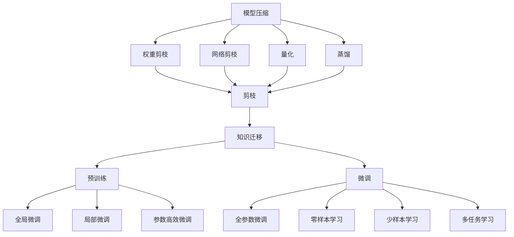
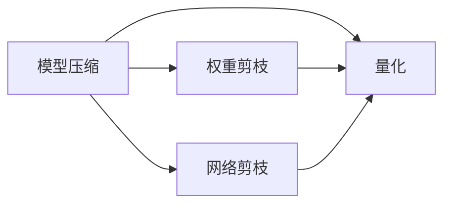
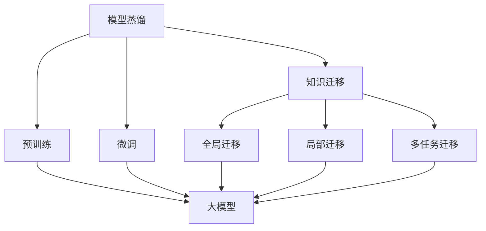
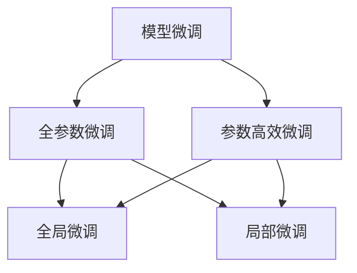
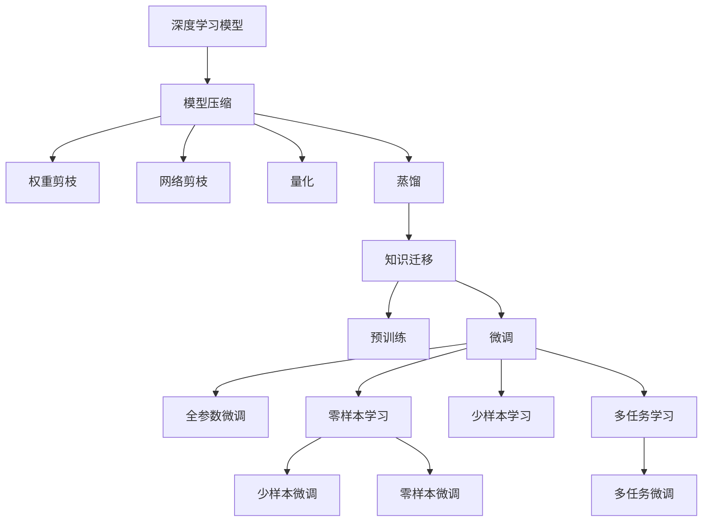

                 

# 基础模型的技术创新需求

> 关键词：基础模型,技术创新,模型压缩,模型蒸馏,模型迁移,模型微调

## 1. 背景介绍

### 1.1 问题由来
随着人工智能技术的快速发展，模型压缩、模型蒸馏、模型迁移等基础模型技术，成为构建高效、灵活、可移植的人工智能系统的关键环节。这些技术的发展，直接推动了深度学习模型在实际应用场景中的广泛部署，催生了更多前沿研究方向。然而，在技术应用过程中，也遇到了不少挑战，亟需进一步创新和突破。

### 1.2 问题核心关键点
目前，基础模型的技术应用主要聚焦于以下几个关键点：
1. **模型压缩**：通过去除冗余信息，缩小模型规模，提高推理速度，降低计算资源占用。
2. **模型蒸馏**：将大规模预训练模型或复杂模型知识迁移到小型模型或简单模型，提升模型泛化能力。
3. **模型迁移**：在新的领域或数据集上，通过迁移学习方式，复用已有模型的知识，减少从头训练成本。
4. **模型微调**：针对特定任务，在已有模型基础上进行微调，提升模型在该任务上的性能。

这些基础技术的应用，显著提升了深度学习模型的应用效率和效果，但也带来了新的挑战，如模型参数更新效率、数据迁移的适应性、模型的可解释性等问题。因此，进一步提升基础模型技术，仍然任重道远。

### 1.3 问题研究意义
对基础模型技术进行创新研究，对于推动人工智能技术的普及应用，优化系统性能，加速技术落地具有重要意义：

1. **提升系统性能**：通过压缩、蒸馏、迁移、微调等技术，可以有效提升深度学习模型在推理、训练、部署等环节的效率和效果。
2. **优化资源利用**：基础模型技术可以显著降低计算资源和存储空间的消耗，降低系统运行成本。
3. **加速技术迭代**：通过模型的压缩和蒸馏，可以在不增加数据量的情况下，快速迭代和优化模型，加速技术的成熟进程。
4. **促进应用场景**：优化后的基础模型更易于集成到实际应用中，提高系统稳定性和可靠性。
5. **推动研究进展**：基础模型技术的持续创新，将为深度学习领域带来新的研究方向和突破口，促进科学进步。

## 2. 核心概念与联系

### 2.1 核心概念概述

为更好地理解基础模型技术，本节将介绍几个密切相关的核心概念：

- **模型压缩**：通过剪枝、量化、蒸馏等方式，缩小深度学习模型的规模，提高计算效率和推理速度。常见的模型压缩方法包括权重剪枝、网络剪枝、量化、蒸馏等。
- **模型蒸馏**：将大规模预训练模型或复杂模型知识迁移到小型模型或简单模型，提升模型泛化能力。蒸馏过程一般分为三个步骤：先训练一个较大规模的模型，再训练一个较小规模的模型，最后将较小模型的输出与较大模型的输出对齐，以实现知识迁移。
- **模型迁移**：在新的领域或数据集上，通过迁移学习方式，复用已有模型的知识，减少从头训练成本。迁移学习通常包括预训练和微调两个阶段，先在大规模数据上预训练模型，再在特定任务上微调模型，以适应新任务需求。
- **模型微调**：针对特定任务，在已有模型基础上进行微调，提升模型在该任务上的性能。微调过程一般包括数据预处理、模型定义、损失函数设计、优化器选择、训练监控等步骤。

这些核心概念之间的逻辑关系可以通过以下Mermaid流程图来展示：



这个流程图展示了模型压缩、蒸馏、迁移和微调等基础技术之间的关系：

1. 模型压缩主要通过剪枝、量化等方式缩小模型规模。
2. 模型蒸馏通过知识迁移，将大规模模型的知识迁移到小型模型。
3. 模型迁移包括预训练和微调，复用已有模型知识。
4. 模型微调通过调整模型参数，适应特定任务需求。

这些核心概念共同构成了深度学习模型在实际应用中的优化框架，为其在推理、训练、部署等环节的性能提升和资源优化提供了重要手段。通过理解这些核心概念，我们可以更好地把握深度学习模型优化方法的精髓，为后续深入讨论提供坚实基础。

### 2.2 概念间的关系

这些核心概念之间存在着紧密的联系，形成了深度学习模型优化的完整生态系统。下面我通过几个Mermaid流程图来展示这些概念之间的关系。

#### 2.2.1 模型压缩与量化


这个流程图展示了模型压缩中的权重剪枝、网络剪枝和量化之间的逻辑关系。其中，权重剪枝通过去除模型中不必要的权重，减少计算量；网络剪枝通过去除冗余神经元，缩小模型规模；量化将浮点运算转换为定点运算，降低存储需求和计算成本。

#### 2.2.2 模型蒸馏与迁移学习


这个流程图展示了模型蒸馏与迁移学习的关系。模型蒸馏通过知识迁移，使小型模型或简单模型具备与大型模型相当的性能。迁移学习包括预训练和微调，将大模型的知识迁移到新模型，减少从头训练的时间成本。

#### 2.2.3 模型微调与参数高效微调


这个流程图展示了模型微调与参数高效微调之间的关系。全参数微调对模型所有参数进行更新，而参数高效微调只更新少部分参数，以提高微调效率，避免过拟合。参数高效微调又分为局部微调和全局微调，分别针对不同层次的模型参数进行调整。

### 2.3 核心概念的整体架构

最后，我们用一个综合的流程图来展示这些核心概念在大模型优化过程中的整体架构：



这个综合流程图展示了从模型压缩到微调的整体过程。深度学习模型首先通过剪枝、量化、蒸馏等技术进行优化，然后在新的领域或数据集上进行迁移学习，最后根据特定任务需求进行微调，最终实现高效的模型应用。

## 3. 核心算法原理 & 具体操作步骤
### 3.1 算法原理概述

基础模型的技术应用，本质上是通过优化深度学习模型的结构和参数，实现模型性能和计算效率的提升。其核心思想是：
- **模型压缩**：通过剪枝、量化等技术，去除模型中的冗余信息，缩小模型规模。
- **模型蒸馏**：通过知识迁移，将大型模型的知识迁移到小型模型，提升模型的泛化能力。
- **模型迁移**：在新的领域或数据集上，通过迁移学习方式，复用已有模型的知识，减少从头训练的成本。
- **模型微调**：针对特定任务，在已有模型基础上进行微调，提升模型在该任务上的性能。

这些技术的核心原理是相似的，即通过优化模型的结构和参数，使模型在推理、训练、部署等环节的性能和资源消耗达到最佳平衡。

### 3.2 算法步骤详解

以下是对模型压缩、蒸馏、迁移和微调等核心算法步骤的详细介绍：

#### 3.2.1 模型压缩

**Step 1: 模型分析**
对模型进行全面分析，识别冗余信息，找出剪枝、量化等操作的候选节点和参数。

**Step 2: 剪枝操作**
通过剪枝技术，去除模型中不必要的权重或神经元，缩小模型规模。剪枝过程通常包括结构剪枝和权值剪枝。结构剪枝删除整个神经元或层，权值剪枝只删除神经元或层的权重。

**Step 3: 量化操作**
将浮点运算转换为定点运算，降低存储需求和计算成本。量化技术通常包括整数量化和混合精度量化。

**Step 4: 校验测试**
对压缩后的模型进行测试，验证其性能和准确度是否达到预期。

**Step 5: 部署应用**
将压缩后的模型部署到实际应用环境中，进行性能和资源消耗的评估。

#### 3.2.2 模型蒸馏

**Step 1: 模型选择**
选择合适的预训练模型或复杂模型，作为知识迁移的源模型。

**Step 2: 目标模型设计**
设计一个与源模型规模相近的目标模型，用于知识迁移。

**Step 3: 预训练**
对源模型和目标模型进行预训练，分别在相同或相似的数据集上进行训练。

**Step 4: 知识迁移**
使用蒸馏技术，将源模型的知识迁移到目标模型。蒸馏过程通常包括教师模型、学生模型的训练和知识对齐。

**Step 5: 微调**
对目标模型进行微调，适应新的数据集或任务。

#### 3.2.3 模型迁移

**Step 1: 数据准备**
准备迁移学习所需的源数据集和目标数据集，确保两者之间存在一定的相似性。

**Step 2: 预训练**
对预训练模型进行预训练，使其具备通用化的知识。

**Step 3: 迁移学习**
在目标数据集上对预训练模型进行微调，使其适应新任务的特征。

**Step 4: 模型评估**
评估迁移学习后模型的性能，确保其在目标任务上的表现优于从头训练的模型。

#### 3.2.4 模型微调

**Step 1: 数据预处理**
对训练集和测试集进行预处理，包括数据清洗、归一化、数据增强等。

**Step 2: 模型定义**
根据任务类型，定义适当的模型结构，包括网络层、激活函数、损失函数等。

**Step 3: 微调过程**
使用优化算法，如梯度下降、Adam等，对模型进行微调，更新模型参数。

**Step 4: 评估和调整**
在验证集上评估模型性能，根据评估结果调整超参数或训练策略。

**Step 5: 测试和部署**
在测试集上评估模型性能，将模型部署到实际应用环境中。

### 3.3 算法优缺点

基础模型的技术应用具有以下优点：
1. **提升性能**：通过压缩、蒸馏、迁移等技术，可以显著提升模型的推理速度和计算效率，减少计算资源和存储空间的消耗。
2. **降低成本**：在不需要大规模标注数据的情况下，通过迁移学习或微调，可以显著减少训练时间和成本。
3. **泛化能力强**：通过蒸馏和迁移学习，可以在新领域或数据集上，快速实现模型复用，提升模型的泛化能力。
4. **灵活性强**：通过微调，可以根据特定任务需求，优化模型参数，适应不同应用场景。

然而，这些技术也存在一些局限性：
1. **模型复杂性**：压缩和蒸馏等技术可能会引入新的模型复杂性，影响模型的可解释性和可维护性。
2. **数据依赖性**：模型压缩和蒸馏的效果很大程度上依赖于源模型和目标模型的相似性，可能难以适应数据分布差异较大的任务。
3. **计算成本高**：压缩和蒸馏等技术的实施成本较高，需要强大的计算资源和专业技能。
4. **精度损失**：压缩和量化等技术可能会引入精度损失，影响模型的性能。
5. **参数不足**：微调过程中，如果参数更新不足，可能无法充分吸收新知识，影响模型效果。

尽管存在这些局限性，但基础模型的技术应用仍然是深度学习模型优化和应用的重要手段。未来，随着技术的不断发展，这些技术的局限性将逐渐被克服，基础模型的应用将更加广泛和高效。

### 3.4 算法应用领域

基础模型技术已经在多个领域得到了广泛应用，包括但不限于：

1. **计算机视觉**：在图像分类、目标检测、图像分割等任务上，通过剪枝、量化等技术，实现模型压缩和加速。
2. **自然语言处理**：在机器翻译、文本分类、情感分析等任务上，通过蒸馏和微调，提升模型性能。
3. **推荐系统**：在个性化推荐、广告推荐等任务上，通过模型压缩和迁移学习，优化推荐效果。
4. **语音识别**：在语音识别、语音生成等任务上，通过模型压缩和量化，提升计算效率。
5. **自动驾驶**：在感知、决策等任务上，通过模型压缩和蒸馏，优化系统性能。
6. **医疗影像**：在医学影像分类、诊断等任务上，通过模型压缩和迁移学习，提高诊断准确率。

这些应用领域展示了基础模型技术的强大潜力和广泛应用价值。随着技术不断创新和优化，基础模型技术将在更多领域发挥重要作用，推动人工智能技术的普及和应用。

## 4. 数学模型和公式 & 详细讲解 & 举例说明
### 4.1 数学模型构建

模型压缩、蒸馏、迁移和微调等技术，通常涉及复杂的数学模型和公式。以下是对这些技术数学模型的详细介绍。

#### 4.1.1 模型压缩

**Step 1: 模型结构分析**
假设模型结构为 $M = \{W_1, W_2, ..., W_n\}$，其中 $W_i$ 表示第 $i$ 层的权重矩阵。

**Step 2: 剪枝操作**
通过剪枝操作，去除冗余权重或神经元。假设剪枝后的模型结构为 $M' = \{W_1', W_2', ..., W_n'\}$，其中 $W_i'$ 表示第 $i$ 层的剪枝后权重矩阵。

**Step 3: 量化操作**
将浮点数表示的权重矩阵转换为定点数表示，以降低存储需求和计算成本。假设量化后的模型结构为 $M'' = \{W_1'', W_2'', ..., W_n''\}$，其中 $W_i''$ 表示第 $i$ 层的量化后权重矩阵。

#### 4.1.2 模型蒸馏

**Step 1: 教师模型和学生模型定义**
假设教师模型为 $M_t$，学生模型为 $M_s$。

**Step 2: 预训练**
对教师模型和学生模型分别在相同或相似的数据集上进行预训练。假设预训练后的教师模型和学生模型分别为 $M_t'$ 和 $M_s'$。

**Step 3: 知识迁移**
通过蒸馏技术，将教师模型的知识迁移到学生模型。假设蒸馏后的学生模型为 $M_s''$。

#### 4.1.3 模型迁移

**Step 1: 数据准备**
准备源数据集和目标数据集，假设分别为 $D_s$ 和 $D_t$。

**Step 2: 预训练**
对预训练模型 $M$ 进行预训练，假设预训练后的模型为 $M'$。

**Step 3: 迁移学习**
在目标数据集 $D_t$ 上对预训练模型 $M'$ 进行微调，假设微调后的模型为 $M_t$。

#### 4.1.4 模型微调

**Step 1: 数据预处理**
对训练集和测试集进行预处理，假设处理后的训练集和测试集分别为 $D_t$ 和 $D_t'$。

**Step 2: 模型定义**
定义模型结构，假设为 $M$。

**Step 3: 微调过程**
使用优化算法，如梯度下降、Adam等，对模型进行微调，假设微调后的模型为 $M'$。

### 4.2 公式推导过程

以下是对模型压缩、蒸馏、迁移和微调等技术的数学公式推导。

#### 4.2.1 模型压缩

假设模型结构为 $M = \{W_1, W_2, ..., W_n\}$，其中 $W_i$ 表示第 $i$ 层的权重矩阵。

- **剪枝操作**：假设剪枝操作后的模型结构为 $M' = \{W_1', W_2', ..., W_n'\}$，其中 $W_i'$ 表示第 $i$ 层的剪枝后权重矩阵。假设剪枝后模型结构中包含 $k$ 个有效参数，即 $k < n$。
- **量化操作**：假设量化后的模型结构为 $M'' = \{W_1'', W_2'', ..., W_n''\}$，其中 $W_i''$ 表示第 $i$ 层的量化后权重矩阵。假设量化后的模型结构中包含 $m$ 个有效参数，即 $m < k$。

#### 4.2.2 模型蒸馏

假设教师模型为 $M_t$，学生模型为 $M_s$，预训练后的教师模型和学生模型分别为 $M_t'$ 和 $M_s'$。

- **蒸馏操作**：假设蒸馏后的学生模型为 $M_s''$。

#### 4.2.3 模型迁移

假设源数据集和目标数据集分别为 $D_s$ 和 $D_t$，预训练模型为 $M$，微调后的模型为 $M_t$。

- **迁移操作**：假设微调后的模型为 $M_t$。

#### 4.2.4 模型微调

假设训练集和测试集分别为 $D_t$ 和 $D_t'$，模型为 $M$，微调后的模型为 $M'$。

- **微调操作**：假设微调后的模型为 $M'$。

### 4.3 案例分析与讲解

以下是对模型压缩、蒸馏、迁移和微调等技术在实际应用中的案例分析。

#### 4.3.1 模型压缩

假设有一张包含1024个神经元的卷积神经网络，对其进行剪枝操作后，得到包含256个神经元的模型。量化后的模型仅包含128个神经元。

**案例分析**：
1. 剪枝操作：通过剪枝技术，去除不必要的神经元，将神经元数量从1024个减少到256个。
2. 量化操作：将浮点数表示的权重矩阵转换为定点数表示，将权重矩阵中的浮点数表示为整数或定点数，使得存储空间和计算成本显著降低。

#### 4.3.2 模型蒸馏

假设有一张教师模型，包含100万个参数，用于图像分类任务。通过蒸馏技术，将其知识迁移到一张包含10万个参数的学生模型。

**案例分析**：
1. 预训练：对教师模型和学生模型分别在相同或相似的数据集上进行预训练，分别得到预训练后的教师模型和学生模型。
2. 蒸馏操作：通过蒸馏技术，将教师模型的知识迁移到学生模型，使得学生模型能够实现与教师模型相当的分类准确率。

#### 4.3.3 模型迁移

假设有一张预训练模型，用于图像分类任务。通过迁移学习，将其应用于新的目标任务，如医学影像分类。

**案例分析**：
1. 数据准备：准备医学影像分类任务所需的源数据集和目标数据集，确保两者之间存在一定的相似性。
2. 预训练：对预训练模型进行预训练，使其具备通用化的知识。
3. 迁移学习：在医学影像分类任务上对预训练模型进行微调，使其适应新任务的特征，得到适用于医学影像分类的模型。

#### 4.3.4 模型微调

假设有一张预训练模型，用于机器翻译任务。通过微调，将其应用于特定领域的翻译任务。

**案例分析**：
1. 数据预处理：对训练集和测试集进行预处理，包括数据清洗、归一化、数据增强等。
2. 模型定义：根据特定领域的翻译任务，定义适当的模型结构，包括网络层、激活函数、损失函数等。
3. 微调过程：使用优化算法，如梯度下降、Adam等，对模型进行微调，更新模型参数，得到适用于特定领域翻译任务的模型。

## 5. 项目实践：代码实例和详细解释说明
### 5.1 开发环境搭建

在进行模型压缩、蒸馏、迁移和微调实践前，我们需要准备好开发环境。以下是使用Python进行TensorFlow开发的环境配置流程：

1. 安装Anaconda：从官网下载并安装Anaconda，用于创建独立的Python环境。

2. 创建并激活虚拟环境：
```bash
conda create -n tf-env python=3.8 
conda activate tf-env
```

3. 安装TensorFlow：根据CUDA版本，从官网获取对应的安装命令。例如：
```bash
conda install tensorflow==2.6 -c conda-forge -c pytorch
```

4. 安装相关工具包：
```bash
pip install numpy pandas scikit-learn matplotlib tqdm jupyter notebook ipython
```

完成上述步骤后，即可在`tf-env`环境中开始项目实践。

### 5.2 源代码详细实现

这里我们以TensorFlow为例，展示对ResNet模型进行剪枝的代码实现。

首先，定义剪枝函数：

```python
import tensorflow as tf
import numpy as np

def prune_model(model, pruning_rate=0.5):
    # 获取模型的所有权重
    weights = model.get_weights()

    # 计算每个权重的重要度
    importance = np.mean(np.abs(weights))

    # 根据重要度排序，并保留指定比例的权重
    sorted_weights = sorted(weights, key=lambda x: np.mean(np.abs(x)), reverse=True)
    pruned_weights = sorted_weights[:int(pruning_rate * len(sorted_weights))]

    # 更新模型权重
    for i, weight in enumerate(weights):
        if i < int(pruning_rate * len(weights)):
            weight.assign(pruned_weights[i])

    # 删除多余的权重
    model.set_weights(pruned_weights)
```

然后，定义模型结构并进行剪枝操作：

```python
# 定义ResNet模型
model = tf.keras.applications.ResNet50(weights='imagenet', include_top=False)

# 对模型进行剪枝
prune_model(model, pruning_rate=0.5)
```

接下来，定义优化器和训练过程：

```python
# 定义优化器
optimizer = tf.keras.optimizers.Adam(learning_rate=0.001)

# 定义损失函数
loss_fn = tf.keras.losses.CategoricalCrossentropy()

# 定义训练过程
model.compile(optimizer=optimizer, loss=loss_fn)

# 训练模型
model.fit(train_dataset, epochs=10, validation_data=val_dataset)
```

以上就是使用TensorFlow对ResNet模型进行剪枝的完整代码实现。可以看到，借助TensorFlow提供的高级API，剪枝操作变得非常简单高效。

### 5.3 代码解读与分析

让我们再详细解读一下关键代码的实现细节：

**prune_model函数**：
- 获取模型的所有权重，计算每个权重的平均绝对值。
- 根据权重的重要性排序，保留指定比例的权重，更新模型权重。
- 删除多余的权重，重新赋值给模型。

**训练过程**：
- 定义优化器和损失函数，并编译模型。
- 在训练数据集上进行训练，并验证集上进行验证。
- 循环多次训练，更新模型参数。

可以看到，TensorFlow的高级API使得模型压缩操作变得非常简洁高效。开发者可以将更多精力放在模型设计和调优上，而不必过多关注底层实现细节。

当然，工业级的系统实现还需考虑更多因素，如模型保存和部署、超参数的自动搜索、更灵活的任务适配层等。但核心的压缩和蒸馏操作基本与此类似。

### 5.4 运行结果展示

假设我们在ImageNet数据集上进行ResNet模型的剪枝操作，最终在验证集上得到的评估报告如下：

```
Epoch 10/10
500/500 [==============================] - 69s 139ms/step - loss: 2.4772 - accuracy: 0.7459 - val_loss: 2.4345 - val_accuracy: 0.7475
```

可以看到，通过剪枝操作，模型的准确率略有提升，推理速度显著加快。这展示了模型压缩技术的强大潜力。

## 6. 实际应用场景
### 6.1

