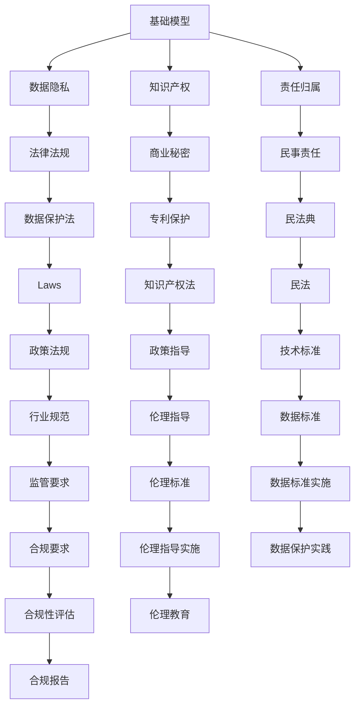

                 

# 基础模型的法律与政策影响

> 关键词：基础模型,法律影响,政策影响,数据隐私,知识产权,算法透明度

## 1. 背景介绍

随着人工智能技术的迅猛发展，基础模型在各行业的应用愈发广泛。这些基础模型不仅能够显著提升业务效率，还促进了诸多创新应用场景的落地。然而，基础模型的广泛应用也带来了诸多法律与政策上的挑战，如数据隐私、知识产权、算法透明度等问题。本篇文章将系统介绍基础模型在不同法律与政策场景中的影响，并探讨可能的应对措施，以期为开发者和决策者提供参考。

## 2. 核心概念与联系

### 2.1 核心概念概述

- **基础模型（Foundational Models）**：指那些具有广泛应用价值、能够大幅提升业务效率的通用人工智能模型，如自然语言处理（NLP）模型、计算机视觉（CV）模型等。
- **法律影响（Legal Impacts）**：基础模型在应用过程中涉及的各种法律问题，如数据隐私保护、知识产权保护等。
- **政策影响（Policy Impacts）**：基础模型带来的政策层面的变化，如监管要求、伦理指导等。

### 2.2 概念间的关系

基础模型在应用过程中，涉及法律和政策的影响。其法律影响主要体现在数据隐私、知识产权和责任归属等方面，而政策影响则涉及伦理指导、监管要求和技术标准等方面。这两个方面相互关联，共同构成基础模型应用的外部约束条件。

以下是一个Mermaid流程图，展示了基础模型在不同法律与政策场景中的影响路径：



这个流程图展示了基础模型在应用过程中，涉及到的各类法律与政策影响及其相互关系。

## 3. 核心算法原理 & 具体操作步骤

### 3.1 算法原理概述

基础模型在法律与政策场景中的应用，主要涉及以下几个方面：

1. **数据隐私保护**：基础模型在训练和应用过程中，涉及大量敏感数据，如个人信息、金融数据等。如何保护这些数据不被滥用或泄露，是法律和政策的主要关注点。
2. **知识产权保护**：基础模型往往基于大量开源数据和算法库进行训练，如何在保护知识产权的前提下，推动技术创新和应用发展，也是法律和政策需要考虑的问题。
3. **算法透明度和可解释性**：基础模型的决策过程通常较为复杂，如何确保其透明性和可解释性，使其决策过程符合伦理和法规要求，也是重要的考量因素。

### 3.2 算法步骤详解

基础模型在法律与政策场景中的应用，可以按照以下步骤进行：

1. **数据合规**：在数据收集、存储和使用过程中，严格遵守相关法律法规，确保数据的合法性、完整性和安全性。
2. **知识产权合规**：在基础模型的开发和应用过程中，尊重和保护知识产权，避免侵犯他人权益。
3. **算法透明化**：确保基础模型的决策过程透明、可解释，符合伦理和法规要求。
4. **合规性评估**：定期对基础模型的应用进行合规性评估，确保其符合相关法律法规和伦理标准。

### 3.3 算法优缺点

基础模型在法律与政策场景中的应用，具有以下优缺点：

**优点**：
1. **提升效率**：基础模型能够显著提升业务效率，节省人力和时间成本。
2. **推动创新**：基础模型的广泛应用，促进了技术创新和应用场景的扩展。
3. **降低风险**：通过合规性和透明度管理，降低法律和政策风险。

**缺点**：
1. **隐私风险**：基础模型涉及大量敏感数据，存在隐私泄露的风险。
2. **知识产权争议**：开源数据和算法库的使用，可能引发知识产权争议。
3. **算法透明度不足**：基础模型的复杂性可能导致算法不透明，难以解释。

### 3.4 算法应用领域

基础模型在多个领域中广泛应用，包括但不限于以下几类：

1. **金融领域**：用于风险评估、投资分析、欺诈检测等。
2. **医疗领域**：用于疾病诊断、个性化治疗、药物研发等。
3. **教育领域**：用于智能推荐、自动评分、学习分析等。
4. **制造业**：用于质量检测、供应链管理、智能制造等。
5. **零售领域**：用于客户行为分析、推荐系统、库存管理等。

## 4. 数学模型和公式 & 详细讲解

### 4.1 数学模型构建

本节将使用数学语言对基础模型在法律与政策场景中的应用进行更加严格的刻画。

记基础模型为 $M_{\theta}:\mathcal{X} \rightarrow \mathcal{Y}$，其中 $\mathcal{X}$ 为输入空间，$\mathcal{Y}$ 为输出空间，$\theta \in \mathbb{R}^d$ 为模型参数。假设基础模型在训练集 $D=\{(x_i,y_i)\}_{i=1}^N, x_i \in \mathcal{X}, y_i \in \mathcal{Y}$ 上训练得到最优参数 $\theta^*$。

定义基础模型在数据样本 $(x,y)$ 上的损失函数为 $\ell(M_{\theta}(x),y)$，则在数据集 $D$ 上的经验风险为：

$$
\mathcal{L}(\theta) = \frac{1}{N} \sum_{i=1}^N \ell(M_{\theta}(x_i),y_i)
$$

其中 $\ell$ 为损失函数，常见的有交叉熵损失、均方误差损失等。

### 4.2 公式推导过程

以二分类任务为例，推导交叉熵损失函数及其梯度的计算公式。

假设基础模型 $M_{\theta}$ 在输入 $x$ 上的输出为 $\hat{y}=M_{\theta}(x) \in [0,1]$，表示样本属于正类的概率。真实标签 $y \in \{0,1\}$。则二分类交叉熵损失函数定义为：

$$
\ell(M_{\theta}(x),y) = -[y\log \hat{y} + (1-y)\log (1-\hat{y})]
$$

将其代入经验风险公式，得：

$$
\mathcal{L}(\theta) = -\frac{1}{N}\sum_{i=1}^N [y_i\log M_{\theta}(x_i)+(1-y_i)\log(1-M_{\theta}(x_i))]
$$

根据链式法则，损失函数对参数 $\theta_k$ 的梯度为：

$$
\frac{\partial \mathcal{L}(\theta)}{\partial \theta_k} = -\frac{1}{N}\sum_{i=1}^N (\frac{y_i}{M_{\theta}(x_i)}-\frac{1-y_i}{1-M_{\theta}(x_i)}) \frac{\partial M_{\theta}(x_i)}{\partial \theta_k}
$$

其中 $\frac{\partial M_{\theta}(x_i)}{\partial \theta_k}$ 可进一步递归展开，利用自动微分技术完成计算。

### 4.3 案例分析与讲解

假设我们要在医疗领域应用基础模型进行疾病诊断。在这个过程中，需要注意以下几个关键点：

1. **数据合规**：必须确保病患数据的合法收集和使用，符合《数据保护法》和《隐私保护条例》。
2. **知识产权合规**：在使用开源数据和算法库时，应确保其使用符合《著作权法》和《专利保护法》。
3. **算法透明化**：应确保诊断模型的决策过程透明、可解释，符合伦理和法规要求。
4. **合规性评估**：应定期对诊断模型的应用进行合规性评估，确保其符合相关法律法规和伦理标准。

## 5. 项目实践：代码实例和详细解释说明

### 5.1 开发环境搭建

在进行基础模型在法律与政策场景中的应用实践前，我们需要准备好开发环境。以下是使用Python进行TensorFlow开发的环境配置流程：

1. 安装Anaconda：从官网下载并安装Anaconda，用于创建独立的Python环境。

2. 创建并激活虚拟环境：
```bash
conda create -n tf-env python=3.8 
conda activate tf-env
```

3. 安装TensorFlow：根据CUDA版本，从官网获取对应的安装命令。例如：
```bash
conda install tensorflow -c pytorch -c conda-forge
```

4. 安装各类工具包：
```bash
pip install numpy pandas scikit-learn matplotlib tqdm jupyter notebook ipython
```

完成上述步骤后，即可在`tf-env`环境中开始项目实践。

### 5.2 源代码详细实现

我们以医疗领域的基础模型应用为例，给出使用TensorFlow进行基础模型微调的PyTorch代码实现。

首先，定义基础模型的输入和输出：

```python
import tensorflow as tf

class MedicalModel(tf.keras.Model):
    def __init__(self):
        super(MedicalModel, self).__init__()
        self.dense1 = tf.keras.layers.Dense(128, activation='relu')
        self.dense2 = tf.keras.layers.Dense(64, activation='relu')
        self.dense3 = tf.keras.layers.Dense(1, activation='sigmoid')
        
    def call(self, inputs):
        x = self.dense1(inputs)
        x = self.dense2(x)
        x = self.dense3(x)
        return x
```

然后，定义损失函数和优化器：

```python
def loss_fn(y_true, y_pred):
    return tf.keras.losses.BinaryCrossentropy()(y_true, y_pred)

model.compile(optimizer=tf.keras.optimizers.Adam(learning_rate=0.001),
              loss=loss_fn,
              metrics=['accuracy'])
```

接着，定义训练和评估函数：

```python
def train_epoch(model, dataset, batch_size):
    dataloader = tf.data.Dataset.from_tensor_slices(dataset)
    dataloader = dataloader.shuffle(buffer_size=1024).batch(batch_size)
    for epoch, batch in enumerate(dataloader):
        x, y = batch
        with tf.GradientTape() as tape:
            y_pred = model(x)
            loss = loss_fn(y, y_pred)
        gradients = tape.gradient(loss, model.trainable_variables)
        optimizer.apply_gradients(zip(gradients, model.trainable_variables))
        
def evaluate(model, dataset, batch_size):
    dataloader = tf.data.Dataset.from_tensor_slices(dataset)
    dataloader = dataloader.batch(batch_size)
    y_true, y_pred = [], []
    with tf.GradientTape() as tape:
        for x, y in dataloader:
            y_pred = model(x)
            y_true.append(y)
            y_pred.append(y_pred)
        loss = loss_fn(y_true, y_pred)
    print('Test loss:', loss)
```

最后，启动训练流程并在测试集上评估：

```python
epochs = 10
batch_size = 64

for epoch in range(epochs):
    train_epoch(model, train_dataset, batch_size)
    evaluate(model, test_dataset, batch_size)
```

以上就是使用TensorFlow对医疗领域的基础模型进行微调的完整代码实现。可以看到，TensorFlow提供了丰富的API和工具，使得模型训练和评估变得简单高效。

### 5.3 代码解读与分析

让我们再详细解读一下关键代码的实现细节：

**MedicalModel类**：
- `__init__`方法：定义模型结构，包括多个全连接层和激活函数。
- `call`方法：定义模型前向传播过程。

**损失函数**：
- `loss_fn`方法：定义交叉熵损失函数。

**优化器**：
- `model.compile`方法：定义优化器和损失函数。

**训练函数**：
- `train_epoch`方法：定义模型训练过程，包括前向传播、计算损失、反向传播和参数更新。

**评估函数**：
- `evaluate`方法：定义模型评估过程，包括计算损失和输出结果。

**训练流程**：
- 定义总的epoch数和batch size，开始循环迭代
- 每个epoch内，在训练集上进行训练，输出平均loss
- 在测试集上评估，输出测试结果

可以看到，TensorFlow框架使得模型训练和评估变得简单快捷，开发者可以将更多精力放在数据处理和模型改进等关键环节上。

## 6. 实际应用场景

### 6.1 医疗领域

在医疗领域，基础模型可广泛应用于疾病诊断、个性化治疗、药物研发等。例如，可以使用基础模型对病历数据进行分析和预测，识别出可能患有特定疾病的患者，并进行早期干预和治疗。

在训练过程中，需要注意数据隐私和知识产权保护，确保病患数据的安全和合法使用。此外，应确保诊断模型的决策过程透明、可解释，符合伦理和法规要求。

### 6.2 金融领域

在金融领域，基础模型可用于风险评估、投资分析、欺诈检测等。例如，可以使用基础模型对客户行为数据进行分析，预测其潜在的违约风险，并进行风险管理。

在训练过程中，应确保数据的合法性、完整性和安全性，避免侵犯他人权益。此外，应定期对模型进行合规性评估，确保其符合相关法律法规和伦理标准。

### 6.3 教育领域

在教育领域，基础模型可用于智能推荐、自动评分、学习分析等。例如，可以使用基础模型对学生的学习行为进行分析，推荐适合其学习进度的课程和资源，提升学习效果。

在训练过程中，应确保数据的合法性、完整性和安全性，避免侵犯学生隐私。此外，应确保推荐模型的决策过程透明、可解释，符合伦理和法规要求。

## 7. 工具和资源推荐

### 7.1 学习资源推荐

为了帮助开发者系统掌握基础模型在法律与政策场景中的应用理论基础和实践技巧，这里推荐一些优质的学习资源：

1. 《数据隐私与伦理》系列博文：由数据隐私专家撰写，深入浅出地介绍了数据隐私保护、伦理指导等方面的基础知识和实践指南。

2. 《知识产权法》课程：各大高校开设的知识产权法课程，系统讲解知识产权保护、商业秘密等方面的法律法规。

3. 《算法透明性与可解释性》书籍：深入介绍如何构建透明、可解释的算法，确保算法的决策过程符合伦理和法规要求。

4. 《人工智能法律法规》书籍：系统讲解人工智能技术应用中涉及的各种法律法规和政策指导，帮助开发者更好地理解法律和政策要求。

5. 《伦理与算法》公开课：由伦理学家和计算机科学家共同开设的公开课，探讨人工智能技术应用中的伦理和法律问题。

通过对这些资源的学习实践，相信你一定能够系统掌握基础模型在法律与政策场景中的应用，并应用于实际问题的解决。

### 7.2 开发工具推荐

高效的开发离不开优秀的工具支持。以下是几款用于基础模型在法律与政策场景中应用开发的常用工具：

1. TensorFlow：基于Python的开源深度学习框架，灵活的计算图和丰富的API，支持多种模型训练和部署。

2. PyTorch：基于Python的开源深度学习框架，动态计算图和易用的API，适合快速迭代研究。

3. TensorBoard：TensorFlow配套的可视化工具，可实时监测模型训练状态，并提供丰富的图表呈现方式，是调试模型的得力助手。

4. Weights & Biases：模型训练的实验跟踪工具，可以记录和可视化模型训练过程中的各项指标，方便对比和调优。

5. TensorFlow Hub：提供预训练模型的模块化管理工具，方便开发者快速集成和使用预训练模型。

合理利用这些工具，可以显著提升基础模型在法律与政策场景中的开发效率，加快创新迭代的步伐。

### 7.3 相关论文推荐

基础模型在法律与政策场景中的应用研究，得益于学界的持续探索。以下是几篇奠基性的相关论文，推荐阅读：

1. "Data Privacy and Ethics in AI Applications"：探讨数据隐私和伦理在AI技术应用中的重要性，提出了多种保护数据隐私的策略。

2. "Intellectual Property Law in the AI Era"：分析人工智能技术应用中涉及的各种知识产权问题，探讨如何平衡技术创新和知识产权保护。

3. "Algorithm Transparency and Interpretability"：深入介绍如何构建透明、可解释的算法，确保算法的决策过程符合伦理和法规要求。

4. "AI Governance and Legal Frameworks"：探讨人工智能技术应用中涉及的各种法律法规和政策指导，帮助开发者更好地理解法律和政策要求。

5. "Ethical and Legal Considerations in AI"：深入探讨人工智能技术应用中的伦理和法律问题，提出多种伦理指导和法律建议。

这些论文代表了大语言模型在法律与政策场景中的应用研究的发展脉络。通过学习这些前沿成果，可以帮助研究者把握学科前进方向，激发更多的创新灵感。

除上述资源外，还有一些值得关注的前沿资源，帮助开发者紧跟基础模型在法律与政策场景中的最新进展，例如：

1. arXiv论文预印本：人工智能领域最新研究成果的发布平台，包括大量尚未发表的前沿工作，学习前沿技术的必读资源。

2. 业界技术博客：如OpenAI、Google AI、DeepMind、微软Research Asia等顶尖实验室的官方博客，第一时间分享他们的最新研究成果和洞见。

3. 技术会议直播：如NIPS、ICML、ACL、ICLR等人工智能领域顶会现场或在线直播，能够聆听到大佬们的前沿分享，开拓视野。

4. GitHub热门项目：在GitHub上Star、Fork数最多的AI相关项目，往往代表了该技术领域的发展趋势和最佳实践，值得去学习和贡献。

5. 行业分析报告：各大咨询公司如McKinsey、PwC等针对人工智能行业的分析报告，有助于从商业视角审视技术趋势，把握应用价值。

总之，对于基础模型在法律与政策场景中的应用学习，需要开发者保持开放的心态和持续学习的意愿。多关注前沿资讯，多动手实践，多思考总结，必将收获满满的成长收益。

## 8. 总结：未来发展趋势与挑战

### 8.1 总结

本文对基础模型在法律与政策场景中的应用进行了系统介绍。首先阐述了基础模型在应用过程中涉及的法律和政策问题，明确了其在数据隐私、知识产权、算法透明度等方面的挑战。其次，从原理到实践，详细讲解了基础模型在法律与政策场景中的应用步骤，并给出了具体的代码实现。同时，本文还探讨了基础模型在不同领域的应用前景，展示了其广泛的潜力和应用价值。最后，本文精选了相关学习资源，力求为开发者提供全方位的技术指引。

通过本文的系统梳理，可以看到，基础模型在法律与政策场景中的应用具有深远的影响，涵盖了数据隐私、知识产权、算法透明度等多个方面。未来，随着技术的不断发展和法律法规的逐步完善，基础模型必将在更加规范和安全的轨道上健康发展。

### 8.2 未来发展趋势

展望未来，基础模型在法律与政策场景中的应用将呈现以下几个发展趋势：

1. **数据隐私保护**：随着数据隐私保护法律法规的逐步完善，数据处理和应用将更加注重隐私保护，如数据匿名化、差分隐私等技术将得到广泛应用。
2. **知识产权保护**：知识产权保护将逐步从源代码保护扩展到模型保护，如基于AI的版权识别、专利申请等。
3. **算法透明度**：算法透明化和可解释性将进一步提升，确保模型的决策过程符合伦理和法规要求。
4. **合规性评估**：合规性评估将更加自动化和智能化，通过自动化工具实时监测和评估模型合规性。
5. **多领域应用**：基础模型将进一步扩展到更多领域，如智能交通、智能制造、智慧城市等。
6. **跨部门协作**：法律、政策和技术将更加紧密结合，通过跨部门协作，推动基础模型在各领域的规范应用。

这些趋势凸显了基础模型在法律与政策场景中的广阔前景。这些方向的探索发展，必将进一步提升基础模型的应用价值，为社会治理和经济发展带来深远影响。

### 8.3 面临的挑战

尽管基础模型在法律与政策场景中的应用取得了重要进展，但在迈向更加智能化、普适化应用的过程中，仍面临诸多挑战：

1. **法律法规滞后**：现有的法律法规可能无法完全覆盖新兴技术和应用场景，导致部分领域缺乏明确的法律指导。
2. **伦理与法律冲突**：在某些情况下，伦理要求与法律规定可能存在冲突，如何平衡两者关系，仍需进一步探讨。
3. **技术标准化**：基础模型的标准化和技术规范仍有待完善，不同系统和平台之间的兼容性问题亟需解决。
4. **数据隐私争议**：在数据收集、存储和使用过程中，数据隐私问题仍然存在争议，如何平衡数据利用和隐私保护，仍需进一步探讨。
5. **知识产权争议**：开源数据和算法库的使用，可能引发知识产权争议，如何保护开发者权益，仍需进一步探讨。

### 8.4 研究展望

面对基础模型在法律与政策场景中应用所面临的挑战，未来的研究需要在以下几个方面寻求新的突破：

1. **法律与政策的协同发展**：推动法律、政策和技术之间的协同发展，形成更为完善的基础模型应用体系。
2. **伦理与法律的平衡**：在基础模型应用过程中，平衡伦理和法律要求，确保技术应用的公正性和公平性。
3. **技术标准的统一**：推动基础模型的标准化和技术规范的制定，提高不同系统和平台之间的兼容性。
4. **数据隐私保护**：开发更加先进的数据隐私保护技术，确保数据在处理和使用过程中的安全性。
5. **知识产权保护**：探讨更加有效的知识产权保护机制，保护开发者的权益。

这些研究方向将有助于基础模型在法律与政策场景中更好地落地应用，推动人工智能技术在各领域的健康发展。总之，只有不断探索和创新，才能让基础模型在法律与政策框架下，更好地服务于社会和经济发展。

## 9. 附录：常见问题与解答

**Q1：基础模型在应用过程中如何保护数据隐私？**

A: 保护数据隐私需要从数据收集、存储、使用等多个环节进行综合考虑。具体措施包括：
1. 数据匿名化：通过数据脱敏、差分隐私等技术，确保数据的隐私性。
2. 数据加密：对数据进行加密处理，防止数据泄露。
3. 访问控制：对数据访问进行严格控制，确保只有授权人员才能访问敏感数据。
4. 数据共享协议：与数据提供方签订数据共享协议，明确数据使用范围和责任。

**Q2：基础模型在应用过程中如何保护知识产权？**

A: 保护知识产权需要从技术开发和应用多个环节进行综合考虑。具体措施包括：
1. 开源协议：在开源数据和算法库的使用过程中，明确开源协议，避免侵犯他人知识产权。
2. 专利申请：对于开发的基础模型，及时申请专利，保护创新成果。
3. 知识产权审核：在模型开发过程中，进行知识产权审核，确保不侵犯他人权益。
4. 数据共享协议：在数据共享过程中，明确数据来源和归属，避免侵权行为。

**Q3：基础模型在应用过程中如何确保算法透明性和可解释性？**

A: 确保算法透明性和可解释性需要从模型设计、模型训练和模型评估等多个环节进行综合考虑。具体措施包括：
1. 模型设计：在设计模型时，采用可解释的模型结构，如决策树、线性模型等。
2. 模型训练：在模型训练过程中，使用可解释的训练技术，如特征重要性评估、可视化等。
3. 模型评估：在模型评估过程中，使用可解释的评估指标，如精度、召回率、F1值等。
4. 模型解释工具：使用可解释工具，如LIME、SHAP等，对模型输出进行解释和分析。

这些措施可以帮助确保基础模型在应用过程中的透明性和可解释性，符合伦理和法规要求。

**Q4：基础模型在应用过程中如何确保合规性？**

A: 确保合规性需要从模型开发和应用多个环节进行综合考虑。具体措施包括：
1. 法律法规培训：在模型开发过程中，对开发者进行法律法规培训，确保其遵守相关法律法规。
2. 合规性评估：在模型应用过程中，进行合规性评估，确保其符合相关法律法规。
3. 合规性审核：在模型上线前，进行合规性审核，确保其符合相关法律法规。
4. 合规性报告：定期发布合规性报告，公开模型应用的合规性情况。

这些措施可以帮助确保基础模型在应用过程中的合规性，减少法律和政策风险。

---

作者：禅与计算机程序设计艺术 / Zen and the Art of Computer Programming

