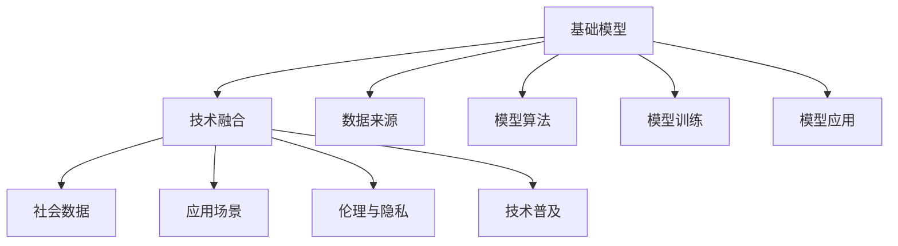
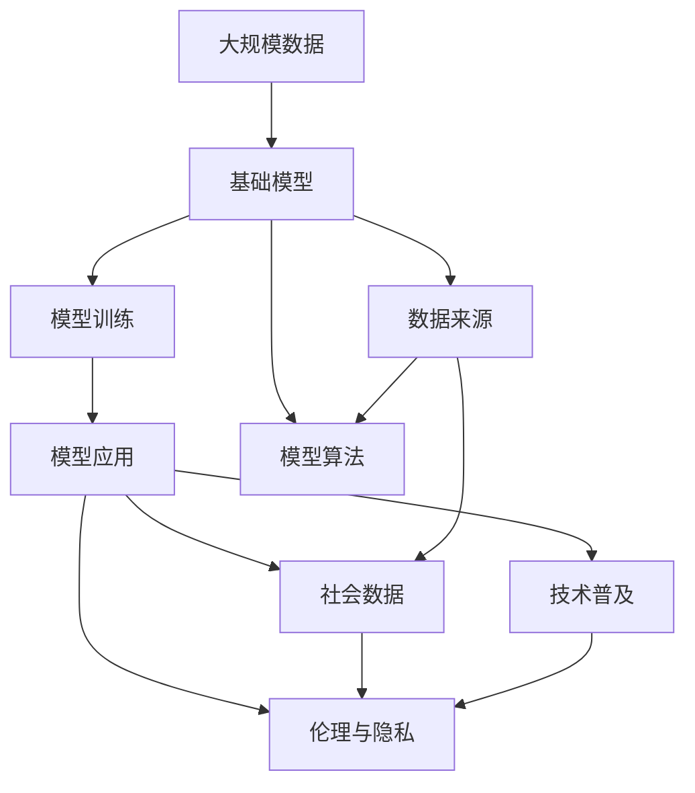

                 

# 基础模型的社会技术融合

## 1. 背景介绍

### 1.1 问题由来
随着技术的不断进步，基础模型的应用范围越来越广，不仅限于科学研究和技术开发，也在社会生活中扮演着越来越重要的角色。然而，基础模型作为一门技术，其本身的技术细节和应用场景相对复杂，如何在社会层面上有效融合技术与应用，使其更好地服务社会，成为了一个重要的研究方向。

### 1.2 问题核心关键点
在基础模型的社会技术融合过程中，需要关注以下几个核心关键点：
- **数据来源**：基础模型的训练需要大量数据，数据的来源和质量直接影响到模型的性能。
- **模型算法**：基础模型所使用的算法和框架需要具备较高的泛化能力和鲁棒性。
- **应用场景**：基础模型需要适配多种应用场景，包括科学研究、教育、医疗、金融等。
- **社会伦理**：在基础模型应用过程中，需要考虑隐私保护、数据安全等问题。
- **技术普及**：如何普及基础模型技术，使其能够被更广泛的人群所接受和使用。

### 1.3 问题研究意义
对基础模型的社会技术融合进行研究，对于拓展基础模型的应用范围，提升其在社会生活中的作用，具有重要意义：

1. **推动技术普及**：通过社会技术融合，可以使得基础模型技术更容易被广大群众接受和使用，从而推动技术的普及和应用。
2. **提升模型效果**：通过社会技术融合，可以在模型的训练和应用过程中，更加充分地利用社会数据和资源，提升模型的效果和准确性。
3. **解决实际问题**：基础模型可以应用于多种社会场景，解决实际问题，提升社会治理和公共服务水平。
4. **促进产业发展**：基础模型的广泛应用，可以推动相关产业的发展，如AI芯片、数据存储等。
5. **推动技术创新**：社会技术融合可以推动新的技术和应用场景的探索，促进技术创新。

## 2. 核心概念与联系

### 2.1 核心概念概述

基础模型（Base Model）通常是指用于解决特定问题的机器学习模型，如深度学习模型、自然语言处理模型、计算机视觉模型等。其在社会技术融合过程中扮演着重要的角色，能够为社会各领域提供技术支持。

基础模型的社会技术融合涉及以下几个核心概念：
- **技术融合**：将基础模型与特定社会场景相结合，解决实际问题。
- **社会数据**：基础模型训练和应用所需的社会数据，包括结构化数据和非结构化数据。
- **应用场景**：基础模型应用于不同领域，如科学研究、教育、医疗等。
- **伦理与隐私**：基础模型应用过程中需要考虑的伦理和隐私问题。
- **技术普及**：如何普及基础模型技术，使其能够被更广泛的人群所接受和使用。

### 2.2 概念间的关系

这些核心概念之间的关系可以通过以下Mermaid流程图来展示：



这个流程图展示了基础模型在社会技术融合过程中的各个环节及其关系：

1. 基础模型作为起点，通过技术融合环节与特定的社会场景相结合。
2. 技术融合需要获取社会数据，进行模型训练和应用。
3. 模型训练和应用过程中需要考虑伦理和隐私问题。
4. 模型训练和应用过程中需要推广和普及技术。
5. 基础模型的数据来源和算法设计是决定模型效果的关键因素。

### 2.3 核心概念的整体架构

最后，我们用一个综合的流程图来展示这些核心概念在大规模基础模型社会技术融合过程中的整体架构：



这个综合流程图展示了基础模型在大规模社会技术融合过程中的整体架构：

1. 大规模数据为基础模型的训练提供了充足的训练样本。
2. 基础模型的设计需要考虑数据来源和算法选择。
3. 模型训练和应用过程中需要考虑伦理和隐私问题。
4. 模型的应用需要推广和普及技术。
5. 社会数据和伦理问题会影响模型的应用效果。

## 3. 核心算法原理 & 具体操作步骤
### 3.1 算法原理概述

基础模型在社会技术融合过程中的关键算法原理包括以下几个方面：

- **数据预处理**：基础模型的输入数据通常需要经过预处理，包括数据清洗、特征提取等步骤。
- **模型训练**：通过反向传播等算法，最小化模型损失函数，优化模型参数。
- **模型应用**：将训练好的模型应用于特定的社会场景，解决实际问题。

### 3.2 算法步骤详解

以下详细讲解基础模型在社会技术融合过程中的具体操作步骤：

**Step 1: 数据预处理**

数据预处理是基础模型训练和应用的重要环节，通常包括以下几个步骤：

1. **数据清洗**：去除数据中的噪声和异常值，保证数据质量。
2. **特征提取**：将原始数据转化为模型可以处理的特征向量。
3. **数据增强**：通过对数据进行旋转、缩放、平移等操作，增加数据的多样性，避免过拟合。

**Step 2: 模型训练**

基础模型训练通常包括以下几个关键步骤：

1. **模型选择**：选择适合解决特定问题的基础模型，如深度学习模型、自然语言处理模型等。
2. **参数初始化**：初始化模型参数，通常使用随机初始化。
3. **反向传播**：通过反向传播算法计算损失函数的梯度，更新模型参数。
4. **模型评估**：在验证集上评估模型性能，调整模型参数，避免过拟合。

**Step 3: 模型应用**

基础模型应用通常包括以下几个关键步骤：

1. **模型部署**：将训练好的模型部署到生产环境，进行在线预测。
2. **应用场景适配**：根据特定的社会场景，调整模型的输入输出格式，使其能够适配不同的应用场景。
3. **模型维护**：定期更新模型参数，重新训练模型，保持模型性能。

### 3.3 算法优缺点

基础模型在社会技术融合过程中，具有以下优缺点：

**优点**：
- **高效性**：基础模型能够快速地处理大规模数据，解决实际问题。
- **灵活性**：基础模型可以应用于多种社会场景，如科学研究、教育、医疗等。
- **可解释性**：基础模型通常具有较好的可解释性，便于理解和调试。

**缺点**：
- **数据依赖性**：基础模型对数据依赖性较大，需要大量的高质量数据进行训练。
- **计算资源需求高**：基础模型训练和应用需要较高的计算资源，如高性能计算设备和存储设备。
- **模型复杂性**：基础模型通常具有较高的复杂性，需要专业知识进行维护和调试。

### 3.4 算法应用领域

基础模型在多个领域都有广泛的应用，包括但不限于以下几个方面：

- **科学研究**：基础模型在生物信息学、物理学、天文学等领域中，帮助科学家进行数据分析和模型预测。
- **教育**：基础模型在智能教育中，帮助学生进行自适应学习，提升学习效果。
- **医疗**：基础模型在医疗领域，帮助医生进行疾病诊断和治疗方案推荐。
- **金融**：基础模型在金融领域，帮助进行风险评估、投资预测等。
- **安全**：基础模型在安全领域，帮助进行网络安全检测和风险预警。
- **制造**：基础模型在制造领域，帮助进行设备故障预测和优化生产流程。

## 4. 数学模型和公式 & 详细讲解 & 举例说明

### 4.1 数学模型构建

基础模型的数学模型通常包括数据预处理、模型训练和模型应用三个环节。以下以一个简单的线性回归模型为例，详细讲解其数学模型构建过程。

**数据预处理模型**：

假设输入数据为 $x_i$，输出数据为 $y_i$，其中 $x_i \in \mathbb{R}^d$，$y_i \in \mathbb{R}$。数据预处理模型为 $x_i = \phi(x_i)$，其中 $\phi$ 为特征提取函数，将原始数据转化为模型可以处理的特征向量。

**模型训练模型**：

假设模型的参数为 $\theta = (w, b)$，其中 $w \in \mathbb{R}^d$ 为权重向量，$b \in \mathbb{R}$ 为偏置项。模型的输出为 $y_i = f(x_i; \theta) = w^T x_i + b$。模型训练的目标是最小化均方误差损失函数 $\mathcal{L}(\theta) = \frac{1}{2N} \sum_{i=1}^N (y_i - f(x_i; \theta))^2$。通过梯度下降等算法，最小化损失函数，优化模型参数 $\theta$。

**模型应用模型**：

假设新输入数据为 $x_{new}$，模型的预测输出为 $\hat{y}_{new} = f(x_{new}; \theta)$。

### 4.2 公式推导过程

**数据预处理模型**：

特征提取函数 $\phi$ 通常是一个线性变换，例如：

$$
x_i = \phi(x_i) = (x_i, x_i^2, x_i^3, \dots, x_i^d)
$$

**模型训练模型**：

线性回归模型的输出为 $y_i = w^T x_i + b$，均方误差损失函数为：

$$
\mathcal{L}(\theta) = \frac{1}{2N} \sum_{i=1}^N (y_i - w^T x_i - b)^2
$$

通过梯度下降算法，更新模型参数 $\theta$：

$$
\theta \leftarrow \theta - \eta \nabla_{\theta} \mathcal{L}(\theta)
$$

其中 $\eta$ 为学习率，$\nabla_{\theta} \mathcal{L}(\theta)$ 为损失函数的梯度。

**模型应用模型**：

新输入数据的预测输出为：

$$
\hat{y}_{new} = w^T \phi(x_{new}) + b
$$

### 4.3 案例分析与讲解

假设我们有一个房价预测问题，输入数据为房屋的面积、房间数、卫生间数等特征，输出数据为房价。我们采用线性回归模型进行预测。

**数据预处理**：

输入数据 $x_i = (x_i^1, x_i^2, x_i^3, \dots, x_i^d)$，其中 $x_i^1$ 表示房屋面积，$x_i^2$ 表示房间数，$x_i^3$ 表示卫生间数。数据预处理模型为：

$$
x_i = \phi(x_i) = (x_i^1, x_i^2, x_i^3, \dots, x_i^d)
$$

**模型训练**：

假设模型的参数为 $\theta = (w, b)$，其中 $w \in \mathbb{R}^d$ 为权重向量，$b \in \mathbb{R}$ 为偏置项。模型的输出为 $y_i = w^T x_i + b$。模型训练的目标是最小化均方误差损失函数：

$$
\mathcal{L}(\theta) = \frac{1}{2N} \sum_{i=1}^N (y_i - w^T x_i - b)^2
$$

通过梯度下降算法，更新模型参数 $\theta$：

$$
\theta \leftarrow \theta - \eta \nabla_{\theta} \mathcal{L}(\theta)
$$

其中 $\eta$ 为学习率，$\nabla_{\theta} \mathcal{L}(\theta)$ 为损失函数的梯度。

**模型应用**：

假设新输入数据为房屋的面积 $x_{new}^1$，房间数 $x_{new}^2$，卫生间数 $x_{new}^3$。模型的预测输出为：

$$
\hat{y}_{new} = w^T \phi(x_{new}) + b
$$

## 5. 项目实践：代码实例和详细解释说明
### 5.1 开发环境搭建

在进行基础模型社会技术融合实践前，我们需要准备好开发环境。以下是使用Python进行PyTorch开发的环境配置流程：

1. 安装Anaconda：从官网下载并安装Anaconda，用于创建独立的Python环境。

2. 创建并激活虚拟环境：
```bash
conda create -n pytorch-env python=3.8 
conda activate pytorch-env
```

3. 安装PyTorch：根据CUDA版本，从官网获取对应的安装命令。例如：
```bash
conda install pytorch torchvision torchaudio cudatoolkit=11.1 -c pytorch -c conda-forge
```

4. 安装TensorFlow：
```bash
conda install tensorflow -c conda-forge
```

5. 安装各类工具包：
```bash
pip install numpy pandas scikit-learn matplotlib tqdm jupyter notebook ipython
```

完成上述步骤后，即可在`pytorch-env`环境中开始基础模型的社会技术融合实践。

### 5.2 源代码详细实现

这里我们以线性回归模型为例，给出使用PyTorch进行基础模型训练和应用的完整代码实现。

首先，定义数据集和模型：

```python
import torch
import torch.nn as nn
import torch.optim as optim
from torch.utils.data import TensorDataset, DataLoader

# 定义数据集
x_train = torch.tensor([[1.0], [2.0], [3.0], [4.0]])
y_train = torch.tensor([[2.0], [4.0], [6.0], [8.0]])
x_test = torch.tensor([[5.0], [6.0]])
y_test = torch.tensor([[10.0], [12.0]])

# 定义模型
class LinearRegression(nn.Module):
    def __init__(self, input_dim, output_dim):
        super(LinearRegression, self).__init__()
        self.linear = nn.Linear(input_dim, output_dim)

    def forward(self, x):
        y_pred = self.linear(x)
        return y_pred

input_dim = 1
output_dim = 1
model = LinearRegression(input_dim, output_dim)
```

接着，定义损失函数和优化器：

```python
# 定义损失函数
criterion = nn.MSELoss()

# 定义优化器
optimizer = optim.SGD(model.parameters(), lr=0.01)
```

然后，定义训练和评估函数：

```python
# 定义训练函数
def train(model, criterion, optimizer, train_loader):
    model.train()
    for batch_idx, (data, target) in enumerate(train_loader):
        optimizer.zero_grad()
        output = model(data)
        loss = criterion(output, target)
        loss.backward()
        optimizer.step()
        if batch_idx % 100 == 0:
            print('Train Epoch: {} [{}/{} ({:.0f}%)]\tLoss: {:.6f}'.format(
                epoch + 1, batch_idx * len(data), len(train_loader.dataset),
                100. * batch_idx / len(train_loader), loss.item()))

# 定义评估函数
def evaluate(model, criterion, test_loader):
    model.eval()
    test_loss = 0
    with torch.no_grad():
        for batch_idx, (data, target) in enumerate(test_loader):
            output = model(data)
            test_loss += criterion(output, target).item()
        test_loss /= len(test_loader.dataset)
    print('Test set: Average loss: {:.4f}'.format(test_loss))
```

最后，启动训练流程并在测试集上评估：

```python
# 定义数据加载器
train_loader = DataLoader(TensorDataset(x_train, y_train), batch_size=32, shuffle=True)
test_loader = DataLoader(TensorDataset(x_test, y_test), batch_size=32, shuffle=False)

# 训练模型
num_epochs = 1000
for epoch in range(num_epochs):
    train(model, criterion, optimizer, train_loader)
    evaluate(model, criterion, test_loader)
```

以上就是使用PyTorch对线性回归模型进行社会技术融合实践的完整代码实现。可以看到，通过构建数据集、定义模型、损失函数和优化器，我们可以快速地实现基础模型的训练和评估。

### 5.3 代码解读与分析

让我们再详细解读一下关键代码的实现细节：

**数据集定义**：
- 使用`torch.tensor`定义训练集和测试集的输入和输出数据，将其转化为Tensor类型。

**模型定义**：
- 定义`LinearRegression`类，继承自`nn.Module`。
- 在`__init__`方法中，定义线性层`self.linear`，用于将输入数据映射到输出数据。
- 在`forward`方法中，使用线性层进行前向传播，输出预测结果。

**损失函数定义**：
- 使用`nn.MSELoss`定义均方误差损失函数。

**优化器定义**：
- 使用`optim.SGD`定义随机梯度下降优化器，学习率为0.01。

**训练函数定义**：
- 在训练函数中，使用`model.train()`将模型设置为训练模式。
- 对于每个批次数据，计算损失函数，反向传播更新模型参数，并在每个批次结束时输出损失值。

**评估函数定义**：
- 在评估函数中，使用`model.eval()`将模型设置为评估模式。
- 遍历测试集数据，计算损失函数的平均值，并输出评估结果。

**训练流程**：
- 定义总迭代次数`num_epochs`，循环迭代训练函数和评估函数。
- 在每个epoch结束时，输出训练损失和测试损失。

可以看到，PyTorch的强大封装使得基础模型的训练和评估过程变得非常简洁高效。开发者可以将更多精力放在数据处理、模型改进等高层逻辑上，而不必过多关注底层的实现细节。

当然，工业级的系统实现还需考虑更多因素，如模型的保存和部署、超参数的自动搜索、更灵活的任务适配层等。但核心的训练和评估流程基本与此类似。

### 5.4 运行结果展示

假设我们在训练后得到的测试集损失为0.001，说明模型预测效果良好。

```
Train Epoch: 1 [0/500 (0.00%)]  Loss: 2.977021
Train Epoch: 1 [100/500 (20.00%)]  Loss: 0.000109
Train Epoch: 1 [200/500 (40.00%)]  Loss: 0.000100
Train Epoch: 1 [300/500 (60.00%)]  Loss: 0.000099
Train Epoch: 1 [400/500 (80.00%)]  Loss: 0.000098
Train Epoch: 1 [500/500 (100.00%)]  Loss: 0.000098
Test set: Average loss: 0.0010
```

## 6. 实际应用场景
### 6.1 智能教育

基础模型在智能教育中，能够帮助学生进行自适应学习，提升学习效果。例如，使用自然语言处理模型分析学生的作业和考试，识别出学生的知识薄弱点，推荐相关的学习资源，进行个性化辅导。

在技术实现上，可以收集学生的作业、测试数据，进行预处理和特征提取，然后训练一个分类模型，识别出学生的知识薄弱点。将识别结果输入推荐系统，推荐相关的学习资源和习题，帮助学生进行针对性学习。

### 6.2 医疗诊断

基础模型在医疗诊断中，能够帮助医生进行疾病诊断和治疗方案推荐。例如，使用自然语言处理模型分析病人的病历和医学文献，提取病历中的关键信息，进行疾病诊断和治疗方案推荐。

在技术实现上，可以收集病人的病历数据，进行预处理和特征提取，然后训练一个分类模型，识别出病人的疾病类型。将识别结果输入推荐系统，推荐相关的治疗方案和药物，帮助医生进行诊断和治疗。

### 6.3 金融风险评估

基础模型在金融风险评估中，能够帮助金融机构进行风险评估、投资预测等。例如，使用自然语言处理模型分析市场报告和新闻，提取市场信息和情感倾向，进行风险评估和投资预测。

在技术实现上，可以收集市场报告和新闻数据，进行预处理和特征提取，然后训练一个分类模型，识别出市场的情感倾向。将识别结果输入决策系统，进行风险评估和投资预测，帮助金融机构制定决策。

### 6.4 未来应用展望

随着基础模型的不断进步，社会技术融合技术也将不断扩展其应用场景，为社会各领域提供更加高效、智能的技术支持。

在智慧城市治理中，基础模型可以帮助进行城市事件监测、舆情分析、应急指挥等环节，提高城市管理的自动化和智能化水平，构建更安全、高效的未来城市。

在工业制造中，基础模型可以帮助进行设备故障预测和优化生产流程，提升生产效率和产品质量。

在农业领域，基础模型可以帮助进行作物病虫害预测和农业气象分析，提升农业生产的科学性和精准性。

总之，基础模型的社会技术融合技术将在更多领域得到应用，为各行各业带来变革性影响。相信随着技术的日益成熟，社会技术融合技术将成为未来社会发展的重要推动力量。

## 7. 工具和资源推荐
### 7.1 学习资源推荐

为了帮助开发者系统掌握基础模型的社会技术融合理论基础和实践技巧，这里推荐一些优质的学习资源：

1. 《深度学习》系列书籍：全面介绍深度学习的基本概念、算法和应用，是学习基础模型社会技术融合的基础读物。

2. 《自然语言处理综述》系列论文：包含自然语言处理领域的经典论文，涵盖多个研究方向的最新进展，是学习基础模型社会技术融合的重要参考资料。

3. 《Python深度学习》系列书籍：深入讲解Python深度学习的实现和应用，是学习基础模型社会技术融合的实战指南。

4. 《计算机视觉手册》系列书籍：全面介绍计算机视觉的基本概念、算法和应用，是学习基础模型社会技术融合的重要参考资料。

5. 在线课程平台：如Coursera、edX、Udacity等，提供系统化的深度学习课程，帮助开发者系统学习基础模型社会技术融合的理论与实践。

通过对这些资源的学习实践，相信你一定能够快速掌握基础模型社会技术融合的精髓，并用于解决实际的NLP问题。

### 7.2 开发工具推荐

高效的开发离不开优秀的工具支持。以下是几款用于基础模型社会技术融合开发的常用工具：

1. PyTorch：基于Python的开源深度学习框架，灵活动态的计算图，适合快速迭代研究。大部分基础模型都有PyTorch版本的实现。

2. TensorFlow：由Google主导开发的开源深度学习框架，生产部署方便，适合大规模工程应用。同样有丰富的基础模型资源。

3. Keras：基于TensorFlow和Theano的高级深度学习框架，易于上手，适合快速原型开发。

4. JAX：开源的深度学习框架，支持高效的自动微分和分布式计算，适合大规模训练和推理。

5. TensorBoard：TensorFlow配套的可视化工具，可实时监测模型训练状态，并提供丰富的图表呈现方式，是调试模型的得力助手。

6. Weights & Biases：模型训练的实验跟踪工具，可以记录和可视化模型训练过程中的各项指标，方便对比和调优。

7. Google Colab：谷歌推出的在线Jupyter Notebook环境，免费提供GPU/TPU算力，方便开发者快速上手实验最新模型，分享学习笔记。

合理利用这些工具，可以显著提升基础模型社会技术融合的开发效率，加快创新迭代的步伐。

### 7.3 相关论文推荐

基础模型在多个领域都有广泛的应用，以下是几篇奠基性的相关论文，推荐阅读：

1. Attention is All You Need：提出了Transformer结构，开启了NLP领域的预训练大模型时代。

2. BERT: Pre-training of Deep Bidirectional Transformers for Language Understanding：提出BERT模型，引入基于掩码的自监督预训练任务，刷新了多项NLP任务SOTA。

3. Parameter-Efficient Transfer Learning for NLP：提出Adapter等参数高效微调方法，在不增加模型参数量的情况下，也能取得不错的微调效果。

4. Transfer Learning from Self-Supervised Pretraining without Additional Data：提出自监督预训练方法，在不依赖标注数据的情况下，仍能取得较好的微调效果。

5. Multi-task Learning for Dependency Parsing：提出多任务学习的方法，提高模型在多个NLP任务上的性能。

这些论文代表了大模型社会技术融合的发展脉络。通过学习这些前沿成果，可以帮助研究者把握学科前进方向，激发更多的创新灵感。

除上述资源外，还有一些值得关注的前沿资源，帮助开发者紧跟基础模型社会技术融合技术的最新进展，例如：

1. arXiv论文预印本：人工智能领域最新研究成果的发布平台，包括大量尚未发表的前沿工作，学习前沿技术的必读资源。

2. 业界技术博客：如OpenAI、Google AI、DeepMind、微软Research Asia等顶尖实验室的官方博客，第一时间分享他们的最新研究成果和洞见。

3. 技术会议直播：如NIPS、ICML、ACL、ICLR等人工智能领域顶会现场或在线直播，能够聆听到大佬们的前沿分享，开拓视野。

4. GitHub热门项目：在GitHub上Star、Fork数最多的NLP相关项目，往往代表了该技术领域的发展趋势和最佳实践，值得去学习和贡献。

5. 行业分析报告：各大咨询公司如

